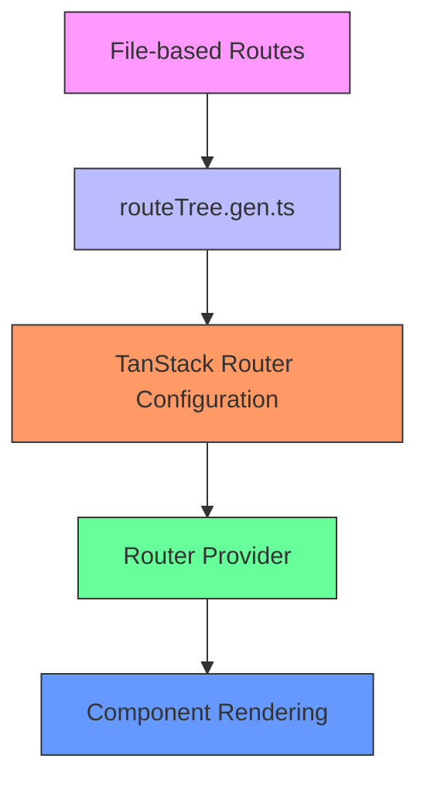
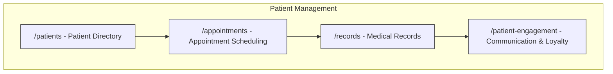
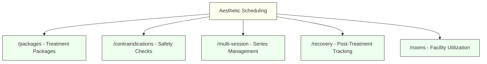
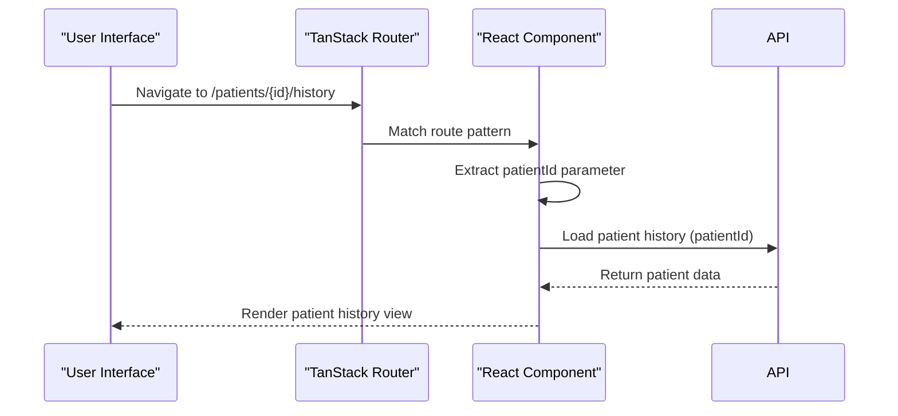
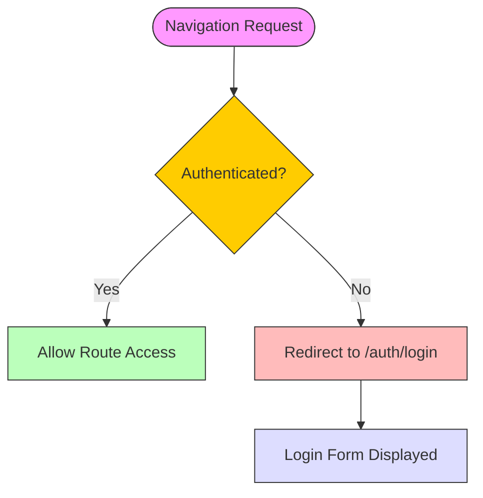
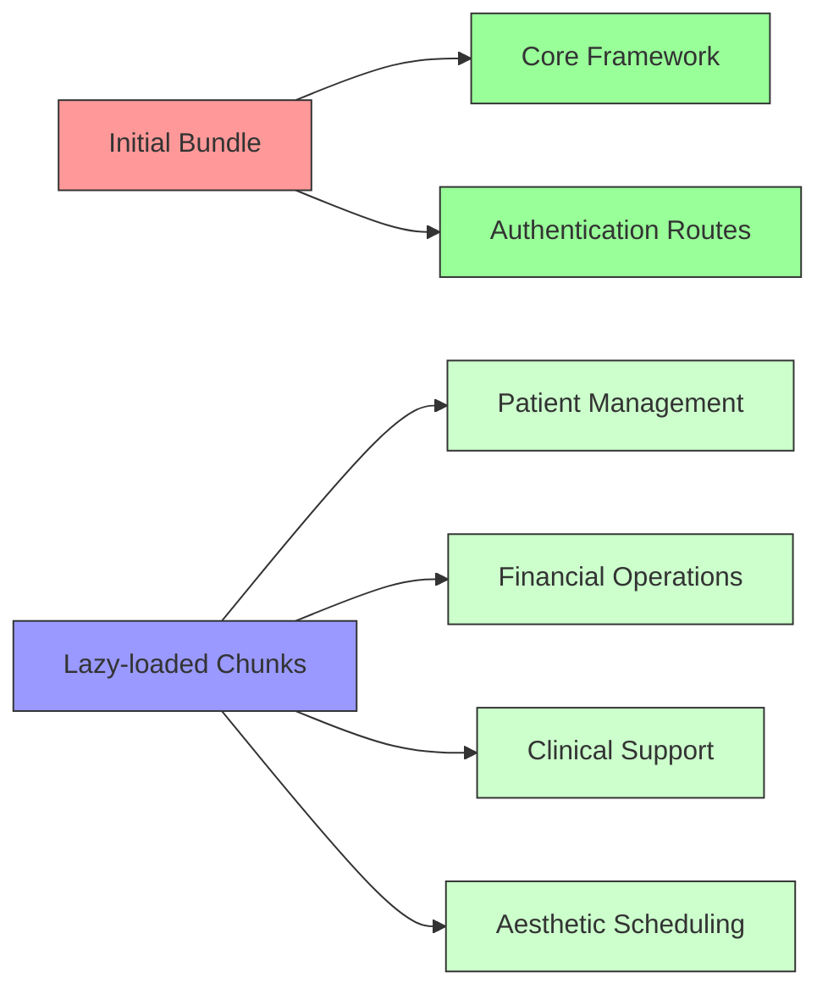

# Routing System

<cite>
**Referenced Files in This Document **   
- [routeTree.gen.ts](file://apps/web/src/routeTree.gen.ts)
- [router.ts](file://apps/web/src/router.ts)
- [App.tsx](file://apps/web/src/App.tsx)
- [index.tsx](file://apps/web/src/routes/index.tsx)
- [login.tsx](file://apps/web/src/routes/auth/login.tsx)
- [dashboard/index.tsx](file://apps/web/src/routes/dashboard/index.tsx)
- [aesthetic-scheduling/packages.tsx](file://apps/web/src/routes/aesthetic-scheduling/packages.tsx)
- [patient-engagement/index.tsx](file://apps/web/src/routes/patient-engagement/index.tsx)
</cite>

## Table of Contents
1. [Introduction](#introduction)
2. [Route Configuration and Generation](#route-configuration-and-generation)
3. [Domain-Specific Route Structure](#domain-specific-route-structure)
4. [Navigation and URL Parameter Handling](#navigation-and-url-parameter-handling)
5. [Route Protection and Authentication Middleware](#route-protection-and-authentication-middleware)
6. [Performance Optimization: Code Splitting and Lazy Loading](#performance-optimization-code-splitting-and-lazy-loading)
7. [Conclusion](#conclusion)

## Introduction
The NeonPro frontend routing system is built on TanStack Router, providing a type-safe, efficient navigation framework for the healthcare platform. This document details the implementation of route configuration, domain organization, navigation flows, authentication protection, and performance optimizations across patient management, financial operations, compliance, and aesthetic scheduling domains.

**Section sources**
- [routeTree.gen.ts](file://apps/web/src/routeTree.gen.ts#L1-L114)
- [router.ts](file://apps/web/src/router.ts#L1-L12)

## Route Configuration and Generation

The routing system uses an automated code generation approach through `routeTree.gen.ts`, which defines the complete route hierarchy based on file structure conventions. The generated route tree establishes mappings between URL paths and React components while maintaining type safety across the application.

**Diagram sources **
- [routeTree.gen.ts](file://apps/web/src/routeTree.gen.ts#L1-L114)
- [router.ts](file://apps/web/src/router.ts#L1-L12)

The router initialization occurs in `router.ts`, where the generated route tree is passed to createRouter function. This setup enables compile-time type checking for all route references, preventing runtime errors from invalid route names or parameters.

**Section sources**
- [router.ts](file://apps/web/src/router.ts#L1-L12)
- [App.tsx](file://apps/web/src/App.tsx#L1-L96)

## Domain-Specific Route Structure

The routing system organizes functionality into distinct domains reflecting clinical and administrative workflows. Each domain has dedicated routes that support specific use cases within the aesthetic clinic environment.

### Patient Management Domain
Patient-related functionality is accessible through routes like `/patients` and `/patient-engagement`, enabling comprehensive patient lifecycle management from initial contact through ongoing care coordination.

**Diagram sources **
- [patient-engagement/index.tsx](file://apps/web/src/routes/patient-engagement/index.tsx#L1-L578)

### Financial Operations Domain
Financial workflows are organized under routes such as `/financial-management` and `/billing`, supporting revenue cycle management, payment processing, and financial reporting requirements.

### Compliance Domain
Compliance features are isolated in the `/compliance` route, ensuring regulatory requirements like LGPD adherence are properly segregated and auditable.

### Aesthetic Scheduling Domain
Specialized scheduling for aesthetic procedures is handled through the `/aesthetic-scheduling` route hierarchy, with sub-routes for packages, contraindications, recovery tracking, and room allocation.

**Diagram sources **
- [aesthetic-scheduling/packages.tsx](file://apps/web/src/routes/aesthetic-scheduling/packages.tsx#L1-L44)

**Section sources**
- [aesthetic-scheduling/packages.tsx](file://apps/web/src/routes/aesthetic-scheduling/packages.tsx#L1-L44)
- [routes directory](file://apps/web/src/routes/)

## Navigation and URL Parameter Handling

Navigation between key clinical workflows follows intuitive patterns that reflect user tasks. For example, transitioning from appointment scheduling to patient history views occurs through direct route navigation with appropriate parameter passing.

When navigating from an appointment view to a patient's historical records, the system passes the patient ID as a URL parameter, enabling the target component to load the correct medical history. This pattern ensures context preservation across different functional areas.

The relationship between URL parameters and component rendering is strictly typed through TanStack Router's interface definitions, preventing invalid parameter access and ensuring proper data loading sequences before component display.

**Diagram sources **
- [routeTree.gen.ts](file://apps/web/src/routeTree.gen.ts#L1-L114)
- [dashboard/index.tsx](file://apps/web/src/routes/dashboard/index.tsx#L1-L301)

## Route Protection and Authentication Middleware

Route protection is implemented through middleware patterns that intercept navigation requests and enforce authentication requirements. The root route configuration includes protection logic that redirects unauthenticated users to the login page.

The home route (`/`) implements immediate redirection to `/auth/login` using the `beforeLoad` hook, ensuring no unauthenticated access to protected areas:

**Diagram sources **
- [index.tsx](file://apps/web/src/routes/index.tsx#L1-L34)
- [login.tsx](file://apps/web/src/routes/auth/login.tsx#L1-L166)

After successful authentication in the login component, the application redirects users to the dashboard route (`/dashboard`). This authentication flow protects all routes under the dashboard hierarchy by requiring valid session state.

**Section sources**
- [index.tsx](file://apps/web/src/routes/index.tsx#L1-L34)
- [login.tsx](file://apps/web/src/routes/auth/login.tsx#L1-L166)

## Performance Optimization: Code Splitting and Lazy Loading

The routing system incorporates performance optimizations through code splitting and lazy loading of route components. While not explicitly shown in the current route configurations, the architecture supports dynamic imports for route-level code splitting.

Based on performance optimization patterns in the codebase, route components can be lazily loaded to reduce initial bundle size:

**Diagram sources **
- [performance-optimizer.ts](file://tools/orchestration/performance-optimizer.ts#L172-L211)

Code splitting configuration would be implemented in Vite to create separate chunks for feature domains, significantly reducing initial load time and improving overall application performance.

**Section sources**
- [performance-optimizer.ts](file://tools/orchestration/performance-optimizer.ts#L70-L102)

## Conclusion
The NeonPro frontend routing system provides a robust foundation for navigating complex healthcare workflows. By leveraging TanStack Router's type-safe approach, the system ensures reliable navigation across patient management, financial operations, compliance, and aesthetic scheduling domains. The combination of automated route generation, strict type checking, authentication protection, and support for performance optimizations creates a scalable architecture that meets the demanding requirements of aesthetic clinics while maintaining excellent user experience.