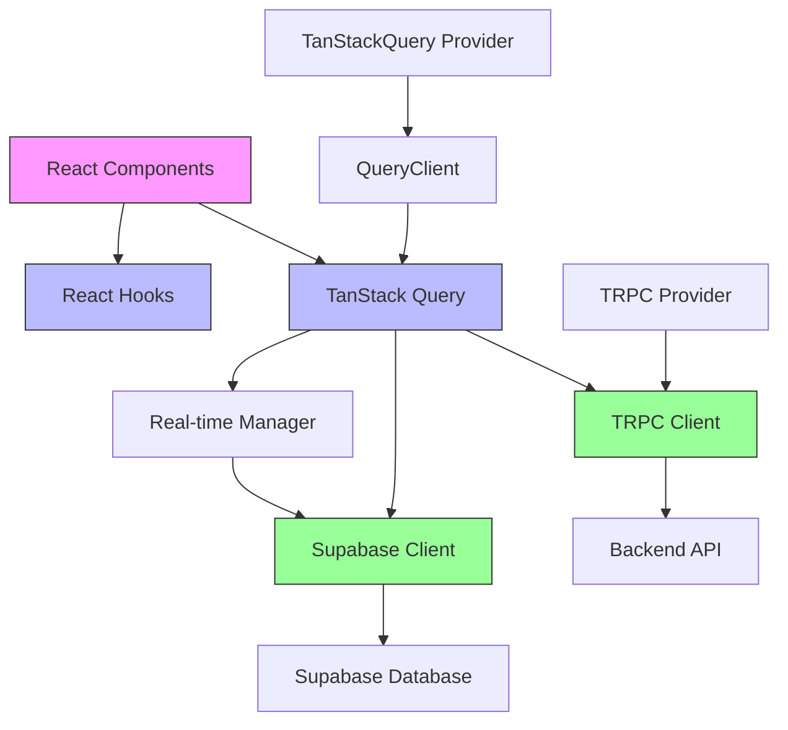
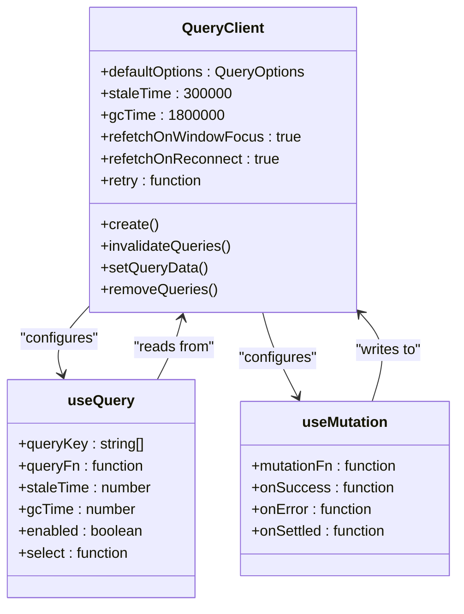
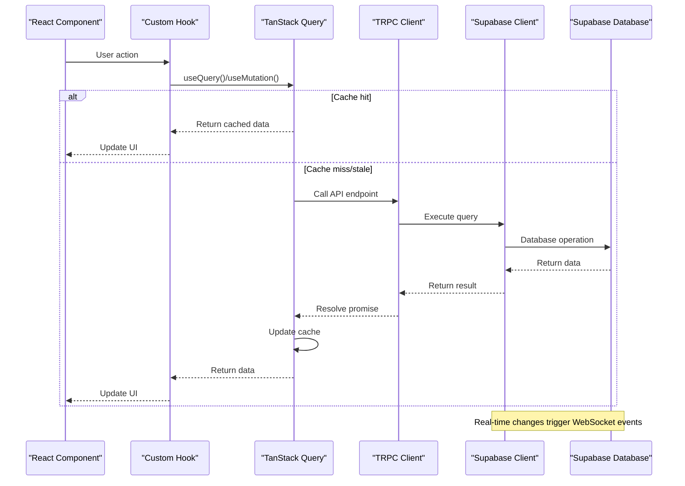
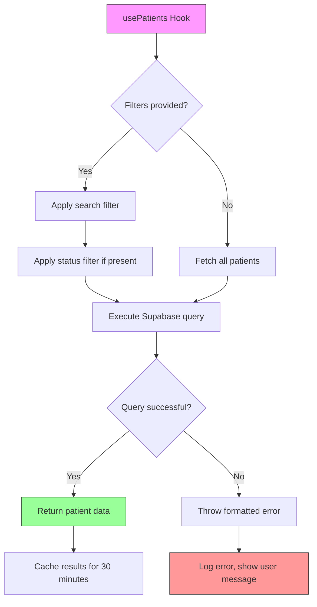
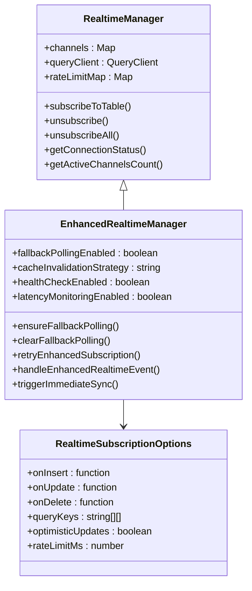
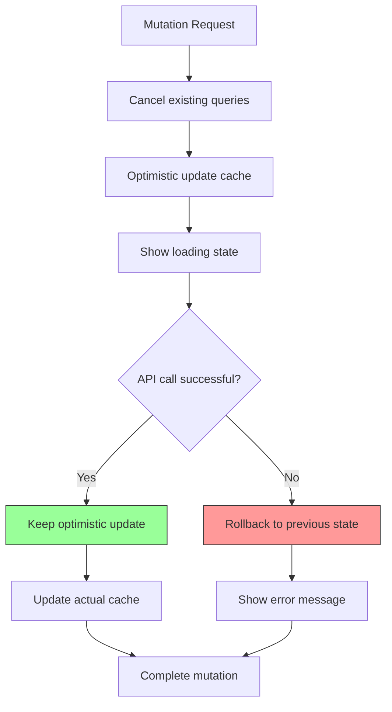

# State Management

<cite>
**Referenced Files in This Document **
- [usePatients.ts](file://apps/web/src/hooks/usePatients.ts)
- [TanStackQueryProvider.tsx](file://apps/web/src/components/providers/TanStackQueryProvider.tsx)
- [TRPCProvider.tsx](file://apps/web/src/components/providers/TRPCProvider.tsx)
- [trpc.ts](file://apps/web/src/lib/trpc.ts)
- [client.ts](file://apps/web/src/integrations/supabase/client.ts)
- [enhanced-realtime-manager.ts](file://packages/core-services/src/realtime/enhanced-realtime-manager.ts)
</cite>

## Table of Contents

1. [Introduction](#introduction)
2. [Architecture Overview](#architecture-overview)
3. [Server State with TanStack Query](#server-state-with-tanstack-query)
4. [Client State with React Hooks](#client-state-with-react-hooks)
5. [Data Synchronization with TRPC and Supabase](#data-synchronization-with-trpc-and-supabase)
6. [Patient Data Retrieval Example](#patient-data-retrieval-example)
7. [Real-time Updates Implementation](#real-time-updates-implementation)
8. [Relationship Between Local and Global State](#relationship-between-local-and-global-state)
9. [Common Issues and Solutions](#common-issues-and-solutions)
10. [Performance Considerations](#performance-considerations)

## Introduction

The neonpro frontend implements a sophisticated state management system that combines TanStack Query for server state management and React hooks for client state. This architecture enables efficient data fetching, caching, and synchronization across components while maintaining optimal performance and user experience. The system integrates TRPC for type-safe API communication and Supabase for real-time database operations, creating a robust foundation for healthcare applications with strict data privacy requirements.

## Architecture Overview

**Diagram sources **

- [TanStackQueryProvider.tsx](file://apps/web/src/components/providers/TanStackQueryProvider.tsx)
- [TRPCProvider.tsx](file://apps/web/src/components/providers/TRPCProvider.tsx)
- [trpc.ts](file://apps/web/src/lib/trpc.ts)

**Section sources**

- [TanStackQueryProvider.tsx](file://apps/web/src/components/providers/TanStackQueryProvider.tsx)
- [TRPCProvider.tsx](file://apps/web/src/components/providers/TRPCProvider.tsx)

## Server State with TanStack Query

The application uses TanStack Query as the primary solution for managing server state, providing automatic caching, background refetching, and stale data handling. The QueryClient is configured with healthcare-appropriate defaults including 5-minute stale time and 30-minute garbage collection time to balance freshness with performance.

Key configuration features include:

- Automatic refetching on window focus for real-time updates
- Reconnection resilience for offline scenarios
- Selective retry logic that avoids retries on 4xx errors
- Centralized error handling and logging

**Diagram sources **

- [TanStackQueryProvider.tsx](file://apps/web/src/components/providers/TanStackQueryProvider.tsx)
- [usePatients.ts](file://apps/web/src/hooks/usePatients.ts)

**Section sources**

- [TanStackQueryProvider.tsx](file://apps/web/src/components/providers/TanStackQueryProvider.tsx)
- [usePatients.ts](file://apps/web/src/hooks/usePatients.ts)

## Client State with React Hooks

Client state is managed through custom React hooks that encapsulate component-specific state logic. These hooks leverage useState, useEffect, and other React primitives to manage local UI state while coordinating with global server state when necessary.

The state management approach follows these principles:

- Separation of concerns between server and client state
- Custom hooks for reusable state logic
- Minimal local state to reduce complexity
- Synchronization points where client actions affect server state

## Data Synchronization with TRPC and Supabase

The application integrates TRPC and Supabase clients to enable seamless data synchronization between frontend and backend systems. TRPC provides end-to-end type safety for API calls, while Supabase enables real-time database operations and authentication.

**Diagram sources **

- [trpc.ts](file://apps/web/src/lib/trpc.ts)
- [client.ts](file://apps/web/src/integrations/supabase/client.ts)
- [usePatients.ts](file://apps/web/src/hooks/usePatients.ts)

**Section sources**

- [trpc.ts](file://apps/web/src/lib/trpc.ts)
- [client.ts](file://apps/web/src/integrations/supabase/client.ts)

## Patient Data Retrieval Example

The patient data retrieval system demonstrates the integration of multiple state management patterns. The `usePatients` hook fetches patient data from Supabase with optional filtering capabilities, while maintaining proper cache invalidation and error handling.

Key implementation details:

- Query keys are structured hierarchically for precise cache invalidation
- Filters are incorporated into query keys to enable filtered result caching
- Error messages are standardized for consistent user feedback
- Stale time is set to 5 minutes to balance data freshness with performance

**Diagram sources **

- [usePatients.ts](file://apps/web/src/hooks/usePatients.ts)

**Section sources**

- [usePatients.ts](file://apps/web/src/hooks/usePatients.ts)

## Real-time Updates Implementation

Real-time updates are implemented through an enhanced realtime manager that synchronizes Supabase's real-time capabilities with TanStack Query's caching system. This ensures that UI components automatically reflect database changes without requiring manual refreshes.

The system includes:

- WebSocket subscriptions to database changes
- Intelligent cache invalidation strategies
- Fallback polling mechanisms for unreliable connections
- Connection resilience for poor network conditions
- Healthcare-specific optimizations like rate limiting

**Diagram sources **

- [enhanced-realtime-manager.ts](file://packages/core-services/src/realtime/enhanced-realtime-manager.ts)
- [usePatients.ts](file://apps/web/src/hooks/usePatients.ts)

**Section sources**

- [enhanced-realtime-manager.ts](file://packages/core-services/src/realtime/enhanced-realtime-manager.ts)

## Relationship Between Local and Global State

The application maintains a clear separation between local component state and global application state, with well-defined synchronization points. Local state handles transient UI interactions, while global state manages persistent data that affects multiple components.

Synchronization occurs through:

- Mutation callbacks that update both server and client state
- Query invalidation that triggers refetching of related data
- Optimistic updates that provide immediate UI feedback
- Error boundaries that handle failed operations gracefully

## Common Issues and Solutions

### Stale Data

Stale data is addressed through multiple mechanisms:

- Configurable staleTime (5 minutes by default)
- Automatic refetching on window focus
- Real-time WebSocket updates
- Manual refetch triggers when needed

### Race Conditions

Race conditions are mitigated by:

- Optimistic updates with rollback capability
- Query cancellation before mutations
- Version-based concurrency control
- Proper loading state management

**Diagram sources **

- [enhanced-realtime-manager.ts](file://packages/core-services/src/realtime/enhanced-realtime-manager.ts)
- [usePatients.ts](file://apps/web/src/hooks/usePatients.ts)

**Section sources**

- [enhanced-realtime-manager.ts](file://packages/core-services/src/realtime/enhanced-realtime-manager.ts)
- [usePatients.ts](file://apps/web/src/hooks/usePatients.ts)

## Performance Considerations

### Data Fetching Strategies

The application employs several performance optimization techniques:

- Batched requests through httpBatchLink
- Intelligent caching with appropriate TTL values
- Selective fetching of required fields
- Pagination for large datasets
- Prefetching of likely-needed data

### Memory Usage Optimization

Memory usage is optimized through:

- Garbage collection time settings (30 minutes)
- Automatic cleanup of unused queries
- Efficient data structures in cache
- Removal of inactive subscriptions
- Proper cleanup in component unmount

The system balances performance needs with healthcare requirements for data accuracy and privacy, ensuring responsive user interfaces while maintaining compliance with regulations like LGPD.

**Section sources**

- [TanStackQueryProvider.tsx](file://apps/web/src/components/providers/TanStackQueryProvider.tsx)
- [enhanced-realtime-manager.ts](file://packages/core-services/src/realtime/enhanced-realtime-manager.ts)
