# UI Design Principles

<cite>
**Referenced Files in This Document**
- [lgpd-consent-banner.tsx](file://packages/ui/src/components/healthcare/lgpd-consent-banner.tsx)
- [healthcare-theme-provider.tsx](file://packages/ui/src/components/healthcare/healthcare-theme-provider.tsx)
- [tailwind.config.ts](file://packages/ui/tailwind.config.ts)
- [ThemeContext.tsx](file://packages/ui/src/theme/ThemeContext.tsx)
- [accessibility.ts](file://packages/ui/src/utils/accessibility.ts)
- [healthcare-validation.ts](file://packages/ui/src/utils/healthcare-validation.ts)
- [NeonProChatInterface.tsx](file://apps/web/src/components/chat/NeonProChatInterface.tsx)
- [NeonProAccessibility.tsx](file://apps/web/src/components/chat/NeonProAccessibility.tsx)
- [healthcare-form.tsx](file://packages/ui/src/components/forms/healthcare-form.tsx)
- [healthcare-text-field.tsx](file://packages/ui/src/components/forms/healthcare-text-field.tsx)
- [healthcare-select.tsx](file://packages/ui/src/components/forms/healthcare-select.tsx)
</cite>

## Table of Contents

1. [Introduction](#introduction)
2. [Design System Overview](#design-system-overview)
3. [Reusable UI Components](#reusable-ui-components)
4. [Styling Conventions and CSS Architecture](#styling-conventions-and-css-architecture)
5. [Theme Customization and Context Management](#theme-customization-and-context-management)
6. [Accessibility Implementation](#accessibility-implementation)
7. [PWA Features and Performance Considerations](#pwa-features-and-performance-considerations)
8. [Responsive Design Challenges](#responsive-design-challenges)
9. [Cross-Browser Compatibility](#cross-browser-compatibility)
10. [Conclusion](#conclusion)

## Introduction

The neonpro platform implements a comprehensive UI design system focused on healthcare applications with strict compliance requirements, accessibility standards, and performance optimization. The design principles are centered around the `@neonpro/ui` package, which provides reusable components, theme management, and accessibility utilities specifically tailored for medical applications. This document details the implementation of these principles across the platform.

The design system emphasizes LGPD (Brazilian General Data Protection Law) compliance, WCAG 2.1 AA+ accessibility standards, and responsive design for healthcare professionals using various devices. The architecture leverages React 19, Tailwind CSS, and a monorepo structure to ensure consistency and reusability across different applications within the neonpro ecosystem.

## Design System Overview

The neonpro design system is built on a component-based architecture that promotes reusability, consistency, and maintainability. The core of the design system resides in the `@neonpro/ui` package, which contains generic, application-agnostic components and utilities. This separation ensures that UI primitives remain decoupled from specific application logic while providing a consistent user experience across different parts of the platform.

The design system follows atomic design principles, organizing components into a hierarchy from basic elements to complex compositions. This approach enables healthcare-specific implementations while maintaining a cohesive visual language and interaction patterns throughout the application suite.

```mermaid
graph TD
A[Design System] --> B[@neonpro/ui Package]
B --> C[Atomic Components]
B --> D[Molecular Components]
B --> E[Organism Components]
B --> F[Template Components]
C --> G[Buttons, Inputs, Badges]
D --> H[Form Fields, Cards, Alerts]
E --> I[Data Tables, Chat Interfaces]
F --> J[Dashboard Layouts]
```

**Diagram sources**

- [healthcare-theme-provider.tsx](file://packages/ui/src/components/healthcare/healthcare-theme-provider.tsx)
- [lgpd-consent-banner.tsx](file://packages/ui/src/components/healthcare/lgpd-consent-banner.tsx)

**Section sources**

- [README.md](file://packages/ui/README.md)

## Reusable UI Components

The `@neonpro/ui` package provides a rich library of reusable UI components specifically designed for healthcare applications. These components are organized into logical categories based on their functionality and usage patterns.

### Form Components

Healthcare-specific form components include specialized validation, accessibility features, and LGPD compliance mechanisms. The `HealthcareForm` component serves as a foundation for all data entry interfaces, providing context-aware validation and error handling.

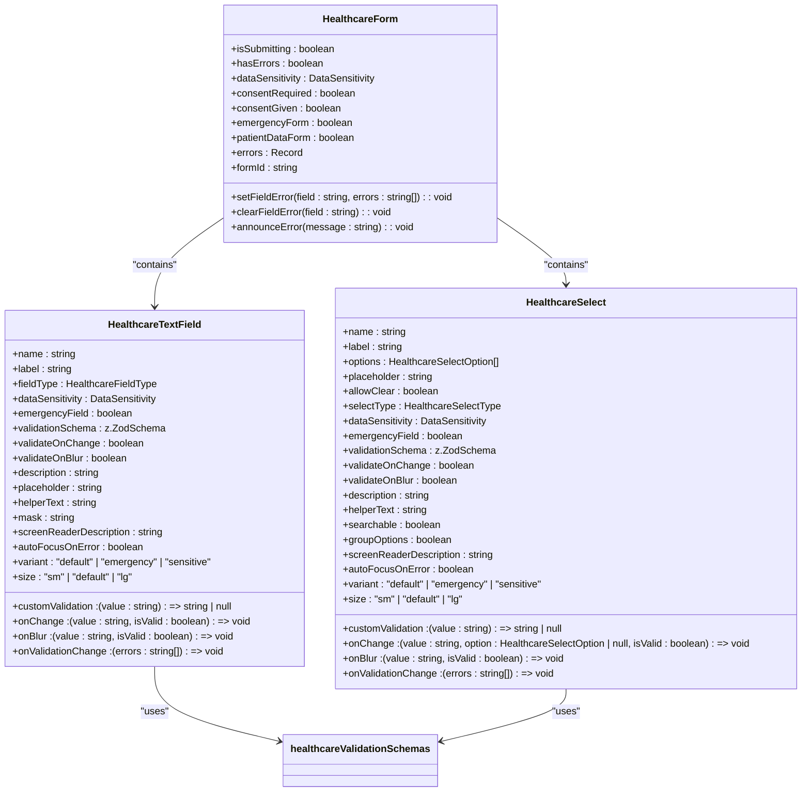

**Diagram sources**

- [healthcare-form.tsx](file://packages/ui/src/components/forms/healthcare-form.tsx)
- [healthcare-text-field.tsx](file://packages/ui/src/components/forms/healthcare-text-field.tsx)
- [healthcare-select.tsx](file://packages/ui/src/components/forms/healthcare-select.tsx)

**Section sources**

- [healthcare-form.tsx](file://packages/ui/src/components/forms/healthcare-form.tsx)
- [healthcare-text-field.tsx](file://packages/ui/src/components/forms/healthcare-text-field.tsx)
- [healthcare-select.tsx](file://packages/ui/src/components/forms/healthcare-select.tsx)

### Healthcare-Specific Components

The design system includes specialized components for healthcare scenarios, such as consent management and patient data handling. The `LGPDConsentBanner` component provides comprehensive consent management with granular control over data processing permissions.

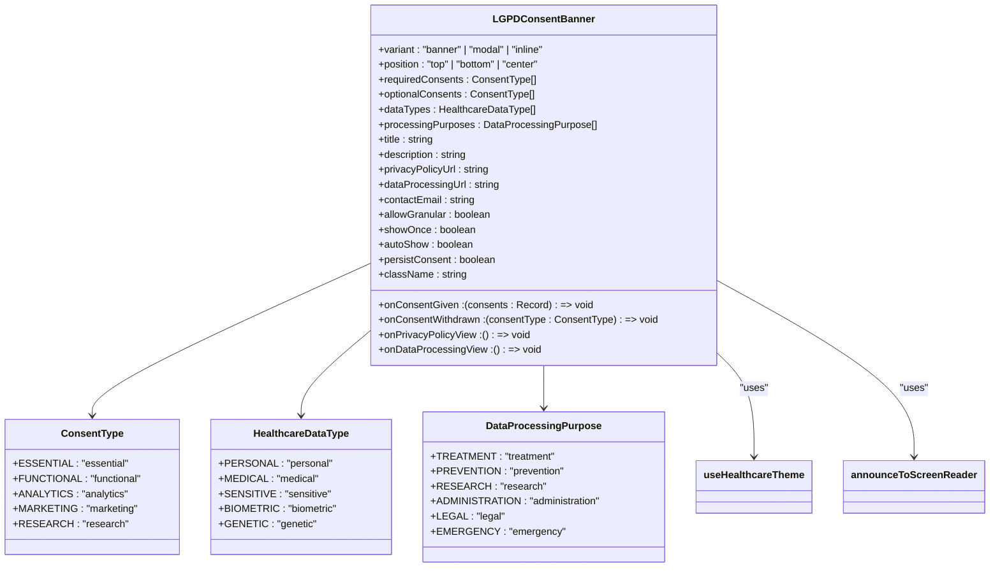

**Diagram sources**

- [lgpd-consent-banner.tsx](file://packages/ui/src/components/healthcare/lgpd-consent-banner.tsx)

**Section sources**

- [lgpd-consent-banner.tsx](file://packages/ui/src/components/healthcare/lgpd-consent-banner.tsx)

## Styling Conventions and CSS Architecture

The neonpro platform employs a utility-first CSS approach using Tailwind CSS, combined with semantic CSS variables for theming and customization. This hybrid approach provides both flexibility and consistency in styling across components.

### Tailwind Configuration

The Tailwind configuration extends the default theme with healthcare-specific color definitions that map to CSS variables. This allows for dynamic theme switching while maintaining accessibility standards.

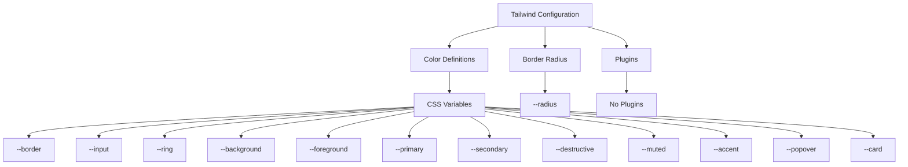

**Diagram sources**

- [tailwind.config.ts](file://packages/ui/tailwind.config.ts)

**Section sources**

- [tailwind.config.ts](file://packages/ui/tailwind.config.ts)

### CSS Variables and Theming

The design system uses CSS variables extensively to enable theme customization and dynamic styling. These variables are defined at the root level and can be overridden by specific themes or user preferences.

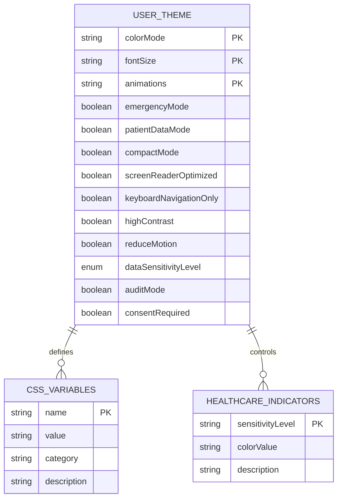

**Diagram sources**

- [healthcare-theme-provider.tsx](file://packages/ui/src/components/healthcare/healthcare-theme-provider.tsx)

**Section sources**

- [healthcare-theme-provider.tsx](file://packages/ui/src/components/healthcare/healthcare-theme-provider.tsx)

## Theme Customization and Context Management

The neonpro platform implements a sophisticated theme management system that supports multiple aspects of user experience customization, particularly for healthcare environments with specific accessibility and compliance requirements.

### Theme Context Implementation

The theme system is built on React's Context API, providing a centralized state management solution for theme-related settings. The `HealthcareThemeProvider` component wraps the application and makes theme values available to all descendants.

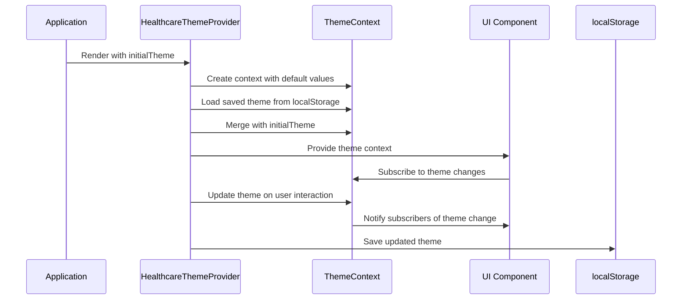

**Diagram sources**

- [ThemeContext.tsx](file://packages/ui/src/theme/ThemeContext.tsx)
- [healthcare-theme-provider.tsx](file://packages/ui/src/components/healthcare/healthcare-theme-provider.tsx)

**Section sources**

- [ThemeContext.tsx](file://packages/ui/src/theme/ThemeContext.tsx)
- [healthcare-theme-provider.tsx](file://packages/ui/src/components/healthcare/healthcare-theme-provider.tsx)

### Healthcare Theme Configuration

The healthcare theme configuration includes specialized settings for medical applications, such as emergency mode, patient data sensitivity levels, and compliance requirements. These settings affect both visual presentation and interaction patterns.

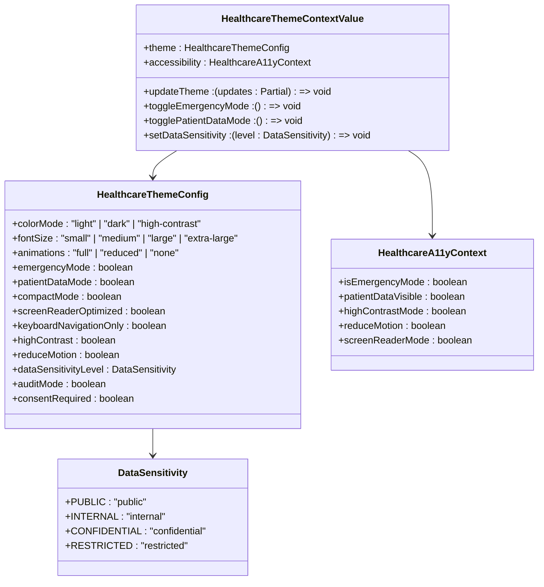

**Diagram sources**

- [healthcare-theme-provider.tsx](file://packages/ui/src/components/healthcare/healthcare-theme-provider.tsx)

**Section sources**

- [healthcare-theme-provider.tsx](file://packages/ui/src/components/healthcare/healthcare-theme-provider.tsx)

## Accessibility Implementation

The neonpro platform places strong emphasis on accessibility, particularly for healthcare professionals and patients who may have various disabilities or use assistive technologies. The accessibility implementation follows WCAG 2.1 AA+ guidelines and includes specific features for medical applications.

### Accessibility Utilities

The `@neonpro/ui` package includes a comprehensive set of accessibility utilities that support screen readers, keyboard navigation, and other assistive technologies. These utilities are designed to work seamlessly with the healthcare-specific components.

```mermaid
classDiagram
class AccessibilityUtilities {
+announceToScreenReader(message : string, priority : HealthcarePriority, delay : number) : void
+useHealthcareFocus(shouldFocus : boolean) : RefObject<HTMLElement>
+useFocusTrap(isActive : boolean) : RefObject<HTMLElement>
+useTableNavigation() : RefObject<HTMLTableElement>
+generateAccessibleId(prefix : string) : string
+validateColorContrast(foregroundColor : string, backgroundColor : string, targetLevel : WCAGLevel) : {isValid : boolean, ratio : number, minimumRatio : number}
+createAccessibleErrorMessage(fieldId : string, errors : string[], priority : HealthcarePriority) : HTMLElement
+useHealthcareKeyboardShortcuts(shortcuts : Record<string, () => void>, isEnabled : boolean) : void
+createScreenReaderDescription(data : Record<string, any>, type : "patient" | "appointment" | "medication" | "result") : string
+useHighContrastMode() : {isHighContrast : boolean, setHighContrastMode : (enabled : boolean) => void}
+useReducedMotion() : {prefersReducedMotion : boolean}
}
class HealthcareA11yContext {
+isEmergencyMode : boolean
+patientDataVisible : boolean
+highContrastMode : boolean
+reduceMotion : boolean
+screenReaderMode : boolean
}
class HealthcarePriority {
+EMERGENCY : "emergency"
+HIGH : "high"
+MEDIUM : "medium"
+LOW : "low"
}
class WCAGLevel {
+A : "A"
+AA : "AA"
+AAA : "AAA"
}
AccessibilityUtilities --> HealthcareA11yContext
AccessibilityUtilities --> HealthcarePriority
AccessibilityUtilities --> WCAGLevel
```

**Diagram sources**

- [accessibility.ts](file://packages/ui/src/utils/accessibility.ts)

**Section sources**

- [accessibility.ts](file://packages/ui/src/utils/accessibility.ts)

### Chat Interface Accessibility

The chat interface implementation includes specialized accessibility features for healthcare communication, ensuring that all users can effectively interact with AI agents regardless of their abilities or assistive technology usage.

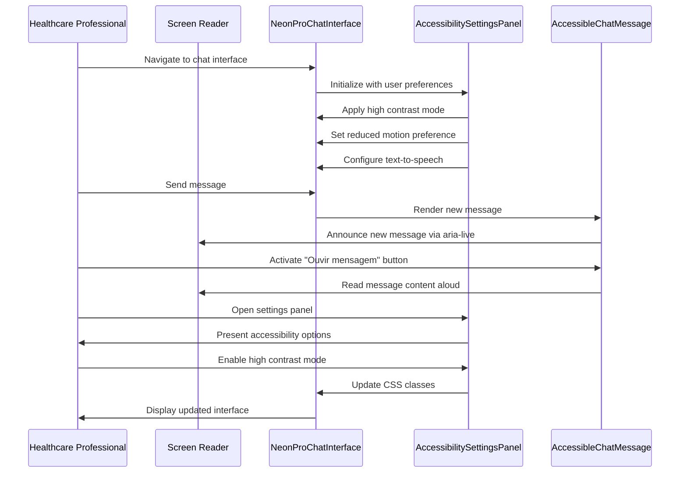

**Diagram sources**

- [NeonProChatInterface.tsx](file://apps/web/src/components/chat/NeonProChatInterface.tsx)
- [NeonProAccessibility.tsx](file://apps/web/src/components/chat/NeonProAccessibility.tsx)

**Section sources**

- [NeonProChatInterface.tsx](file://apps/web/src/components/chat/NeonProChatInterface.tsx)
- [NeonProAccessibility.tsx](file://apps/web/src/components/chat/NeonProAccessibility.tsx)

## PWA Features and Performance Considerations

The neonpro platform implements Progressive Web App (PWA) features to enhance performance, reliability, and user experience, particularly important for healthcare applications where connectivity may be inconsistent.

### Bundle Size Optimization

The design system employs several strategies to minimize bundle size and improve load performance:

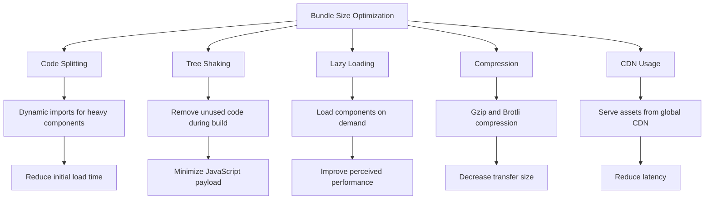

**Section sources**

- [vite.config.ts](file://packages/ui/vite.config.ts)
- [tsup.config.ts](file://packages/ui/tsup.config.ts)

### Critical CSS Delivery

The platform implements critical CSS delivery to ensure fast rendering of above-the-fold content, which is particularly important for healthcare professionals who need immediate access to patient information.

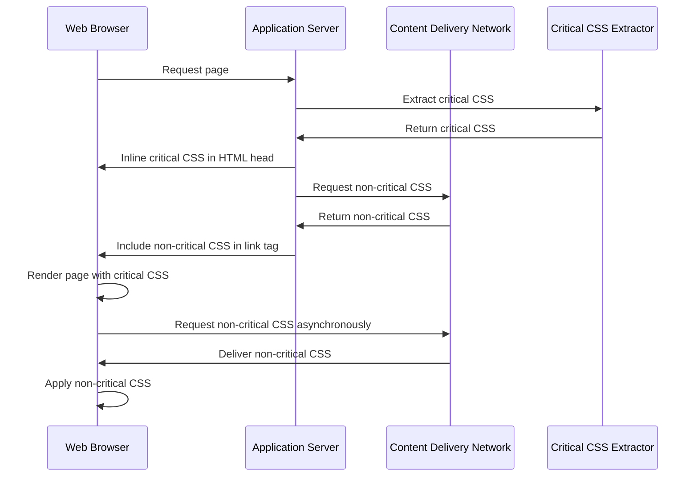

**Section sources**

- [index.html](file://apps/web/public/index.html)
- [main.css](file://apps/web/src/styles/main.css)

## Responsive Design Challenges

The neonpro platform addresses responsive design challenges specific to healthcare environments where professionals use various devices with different screen sizes and input methods.

### Multi-Device Support

The design system supports a wide range of devices used by healthcare professionals:

```mermaid
erDiagram
DEVICE_TYPE {
string type PK
string description
int minWidth
int maxWidth
string orientation
string inputMethod
string typicalUseCase
}
DESIGN_REQUIREMENTS {
string requirementId PK
string description
string priority
string implementationStatus
}
COMPONENT_ADAPTATION {
string component PK
string deviceType PK
string adaptationStrategy
string implementationNotes
}
DEVICE_TYPE ||--o{ COMPONENT_ADAPTATION : "requires"
DESIGN_REQUIREMENTS ||--o{ COMPONENT_ADAPTATION : "addresses"
DEVICE_TYPE {
"mobile" "Smartphones" 320 767 "portrait|landscape" "touch" "Quick patient lookup"
"tablet" "Tablets" 768 1023 "portrait|landscape" "touch|stylus" "Patient documentation"
"desktop" "Desktop computers" 1024 1920 "landscape" "mouse|keyboard" "Detailed patient records"
"large-screen" "Large monitors" 1921 3840 "landscape" "mouse|keyboard" "Multi-patient monitoring"
"specialized" "Medical devices" 800 1200 "portrait" "touch|buttons" "Point-of-care devices"
}
```

**Section sources**

- [NeonProChatInterface.tsx](file://apps/web/src/components/chat/NeonProChatInterface.tsx)
- [NeonProAccessibility.tsx](file://apps/web/src/components/chat/NeonProAccessibility.tsx)

### Adaptive Layout Strategies

The platform implements adaptive layout strategies to optimize the user experience across different device types:

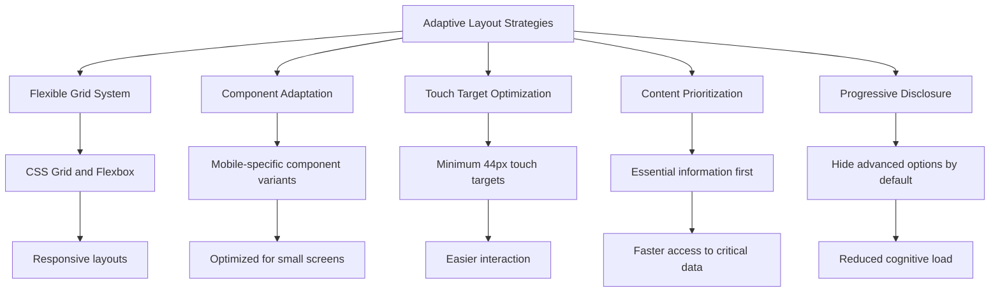

**Section sources**

- [NeonProChatInterface.tsx](file://apps/web/src/components/chat/NeonProChatInterface.tsx)
- [NeonProAccessibility.tsx](file://apps/web/src/components/chat/NeonProAccessibility.tsx)

## Cross-Browser Compatibility

The neonpro platform ensures compatibility across different browsers commonly used in healthcare institutions, which often have legacy systems and restricted software choices.

### Browser Support Strategy

The platform maintains compatibility with major browsers while leveraging modern web features:

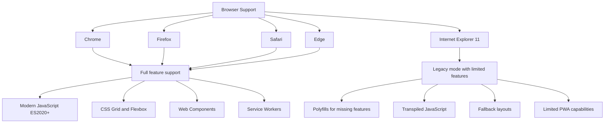

**Section sources**

- [package.json](file://packages/ui/package.json)
- [tsconfig.json](file://packages/ui/tsconfig.json)

### Feature Detection and Fallbacks

The platform implements robust feature detection and fallback mechanisms:

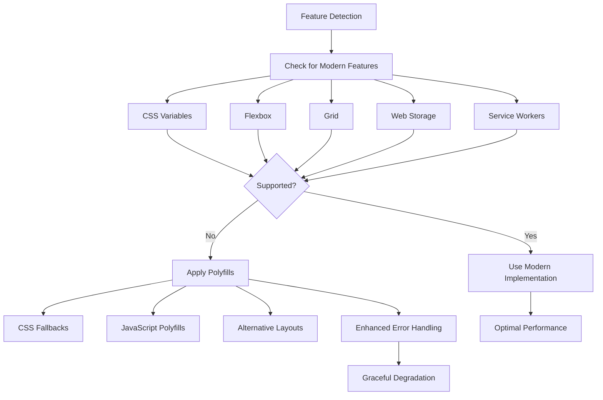

**Section sources**

- [healthcare-theme-provider.tsx](file://packages/ui/src/components/healthcare/healthcare-theme-provider.tsx)
- [accessibility.ts](file://packages/ui/src/utils/accessibility.ts)

## Conclusion

The neonpro platform's UI design principles demonstrate a comprehensive approach to creating accessible, compliant, and performant healthcare applications. By leveraging a well-structured design system with reusable components, the platform ensures consistency across different applications while addressing the unique requirements of medical environments.

Key strengths of the design system include its focus on LGPD compliance, extensive accessibility features, and responsive design for various healthcare devices. The implementation of theme customization through context providers allows for dynamic adaptation to different user needs and environmental conditions.

Performance considerations such as bundle size optimization and critical CSS delivery ensure that the platform remains responsive even in low-bandwidth healthcare settings. The cross-browser compatibility strategy balances modern web capabilities with support for legacy systems commonly found in medical institutions.

Future enhancements could include more advanced personalization features, improved offline capabilities for PWA functionality, and expanded support for assistive technologies. Overall, the neonpro design system provides a solid foundation for building reliable and accessible healthcare applications that meet both regulatory requirements and user needs.
