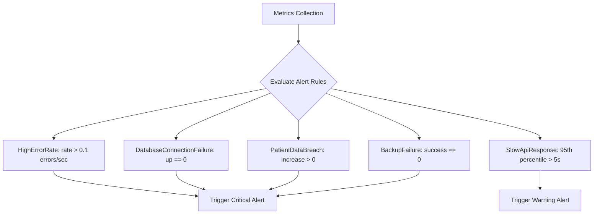
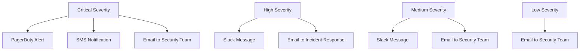
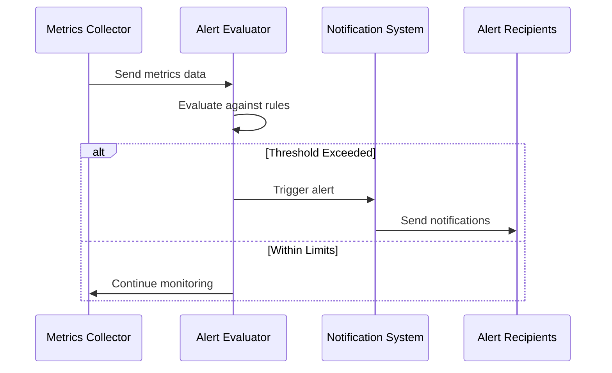
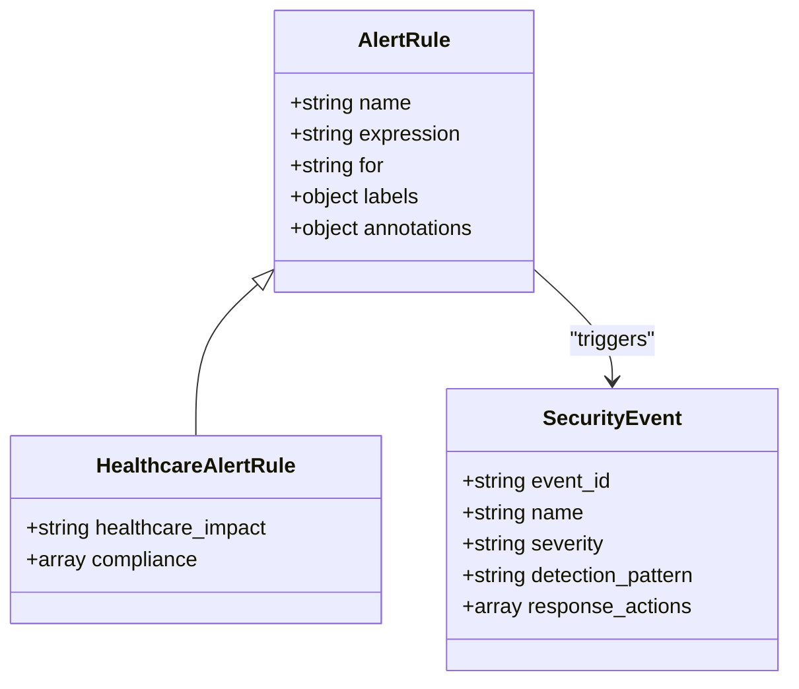

# Alerting System

<cite>
**Referenced Files in This Document **   
- [healthcare-alerts.json](file://tools/monitoring/alerts/healthcare-alerts.json)
- [security-monitoring.json](file://tools/monitoring/security-monitoring.json)
- [cert-renewal.sh](file://apps/api/scripts/cert-renewal.sh)
- [performance-monitor.js](file://apps/api/scripts/performance-monitor.js)
- [compliance-validator.sh](file://tools/monitoring/scripts/compliance-validator.sh)
</cite>

## Table of Contents
1. [Introduction](#introduction)
2. [Alert Rules Configuration](#alert-rules-configuration)
3. [Notification Channels and Escalation Policies](#notification-channels-and-escalation-policies)
4. [Alert Trigger Mechanisms](#alert-trigger-mechanisms)
5. [Practical Alert Configuration Examples](#practical-alert-configuration-examples)
6. [Alert Sensitivity and Maintenance Windows](#alert-sensitivity-and-maintenance-windows)
7. [Incident Management Integration](#incident-management-integration)
8. [Best Practices for Alert Response](#best-practices-for-alert-response)
9. [Conclusion](#conclusion)

## Introduction
The alerting system in the neonpro platform is designed to proactively identify and notify stakeholders about critical system issues, security events, and compliance violations. This comprehensive monitoring framework ensures the integrity, availability, and confidentiality of healthcare data while maintaining regulatory compliance with standards such as LGPD, ANVISA, and HIPAA. The system employs a multi-layered approach to monitoring, combining metrics-based thresholds, security event detection, and compliance validation to provide timely alerts that enable rapid response to potential incidents.

**Section sources**
- [healthcare-alerts.json](file://tools/monitoring/alerts/healthcare-alerts.json#L1-L158)
- [security-monitoring.json](file://tools/monitoring/security-monitoring.json#L1-L295)

## Alert Rules Configuration
The alert rules are defined in configuration files that specify the conditions under which alerts should be triggered. These rules are organized by severity level and impact category, covering critical system failures, performance degradation, security breaches, and compliance violations. Each alert rule includes an expression that evaluates metrics or events, a duration threshold that must be met before triggering, and metadata labels that categorize the alert by severity, component, and healthcare impact.

**Diagram sources **
- [healthcare-alerts.json](file://tools/monitoring/alerts/healthcare-alerts.json#L1-L158)

**Section sources**
- [healthcare-alerts.json](file://tools/monitoring/alerts/healthcare-alerts.json#L1-L158)

## Notification Channels and Escalation Policies
The alerting system supports multiple notification channels to ensure timely delivery of alerts to appropriate stakeholders. These channels include email, SMS, Slack, and PagerDuty integration, with channel selection based on alert severity. The escalation policies define response time requirements and responsible teams for different severity levels, ensuring appropriate resources are engaged based on the criticality of the incident.

**Diagram sources **
- [security-monitoring.json](file://tools/monitoring/security-monitoring.json#L100-L130)

**Section sources**
- [security-monitoring.json](file://tools/monitoring/security-monitoring.json#L100-L130)

## Alert Trigger Mechanisms
Alerts are triggered by various mechanisms including metrics thresholds, error rates, certificate expiration, and security events. The system continuously monitors key performance indicators and security metrics, evaluating them against predefined rules. For example, API error rates are monitored using Prometheus-style expressions that calculate the rate of errors over a 5-minute window, while database connectivity is verified through health check endpoints.

**Diagram sources **
- [healthcare-alerts.json](file://tools/monitoring/alerts/healthcare-alerts.json#L1-L158)
- [security-monitoring.json](file://tools/monitoring/security-monitoring.json#L1-L295)

**Section sources**
- [healthcare-alerts.json](file://tools/monitoring/alerts/healthcare-alerts.json#L1-L158)
- [security-monitoring.json](file://tools/monitoring/security-monitoring.json#L1-L295)

## Practical Alert Configuration Examples
The system provides practical examples of alert configurations for different scenarios. Critical system failures are detected through database connectivity checks and backup success monitoring. Performance degradation is identified by tracking API response times and error rates. Security breaches are detected through anomaly detection in authentication patterns and unauthorized data access attempts. Compliance violations trigger immediate alerts to ensure regulatory requirements are met.

**Diagram sources **
- [healthcare-alerts.json](file://tools/monitoring/alerts/healthcare-alerts.json#L1-L158)
- [security-monitoring.json](file://tools/monitoring/security-monitoring.json#L1-L295)

**Section sources**
- [healthcare-alerts.json](file://tools/monitoring/alerts/healthcare-alerts.json#L1-L158)
- [security-monitoring.json](file://tools/monitoring/security-monitoring.json#L1-L295)

## Alert Sensitivity and Maintenance Windows
The system allows configuration of alert sensitivity to avoid noise from transient issues. Maintenance windows can be defined to suppress non-critical alerts during scheduled maintenance periods, preventing unnecessary notifications. This helps maintain alert effectiveness by ensuring that only meaningful incidents generate notifications, reducing alert fatigue among operations staff.

**Section sources**
- [healthcare-alerts.json](file://tools/monitoring/alerts/healthcare-alerts.json#L1-L158)

## Incident Management Integration
The alerting system integrates with incident management tools through webhook endpoints and dedicated integrations. This enables automatic ticket creation in service management systems and coordination of response efforts. The integration also supports post-incident review processes by capturing alert context and response timelines for analysis and process improvement.

**Section sources**
- [security-monitoring.json](file://tools/monitoring/security-monitoring.json#L100-L130)

## Best Practices for Alert Response
Effective alert response requires clear procedures and regular review. The system supports best practices such as immediate acknowledgment of critical alerts, structured investigation protocols, and post-incident reviews to identify root causes and prevent recurrence. Documentation of runbooks for common alert types ensures consistent response regardless of personnel on duty.

**Section sources**
- [healthcare-alerts.json](file://tools/monitoring/alerts/healthcare-alerts.json#L1-L158)
- [security-monitoring.json](file://tools/monitoring/security-monitoring.json#L1-L295)

## Conclusion
The neonpro platform's alerting system provides comprehensive monitoring and notification capabilities essential for maintaining the reliability and security of healthcare applications. By combining metrics-based alerts, security event detection, and compliance monitoring with effective notification channels and escalation policies, the system enables proactive identification and resolution of issues. Proper configuration of alert sensitivity and integration with incident management processes ensures that alerts remain actionable and effective in protecting patient data and system availability.