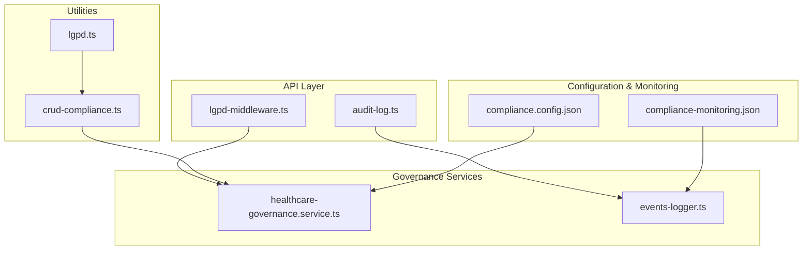
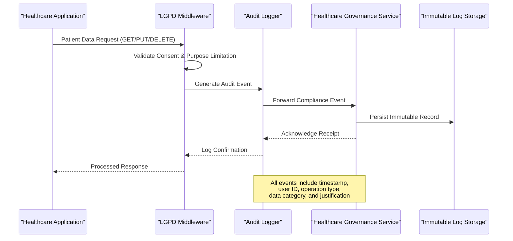
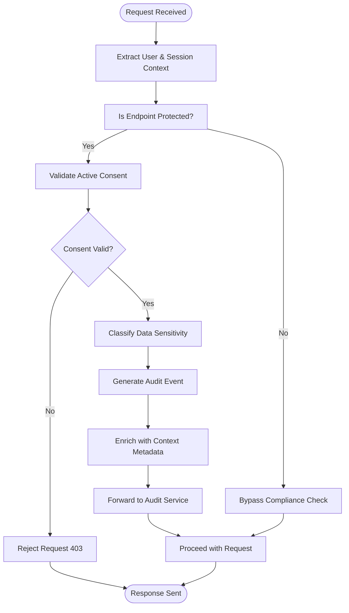
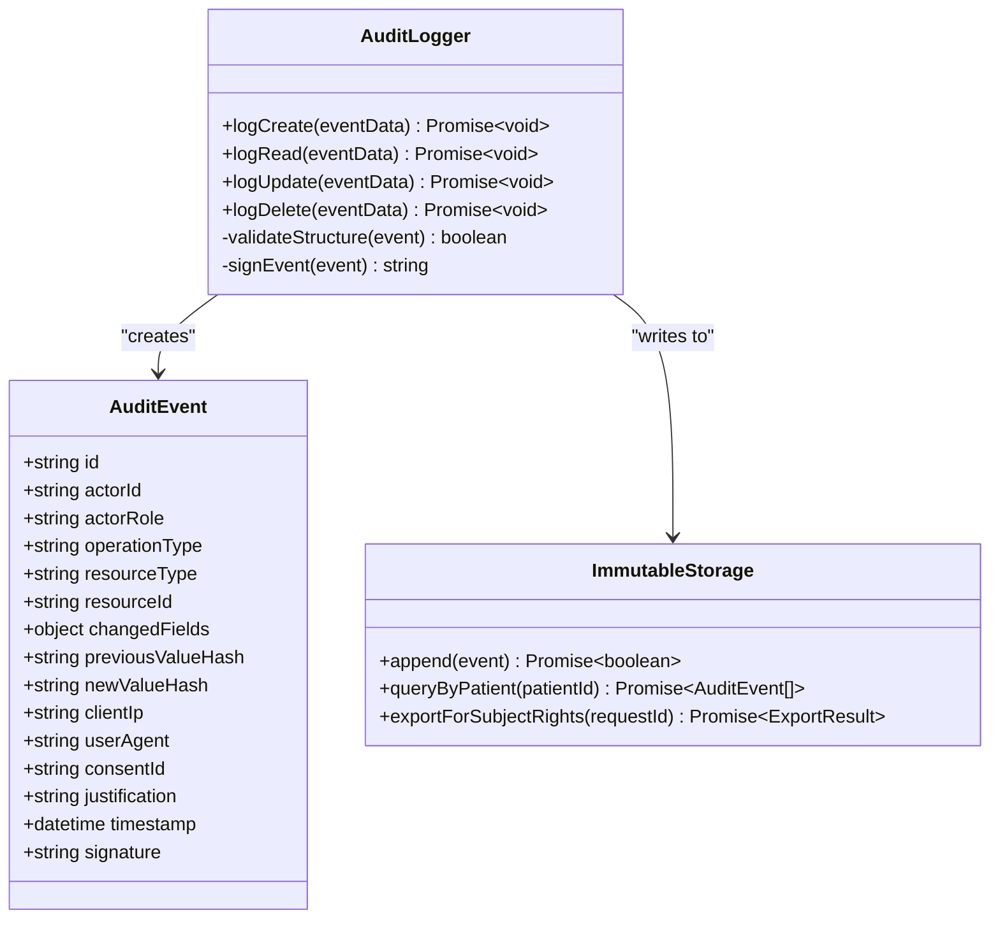
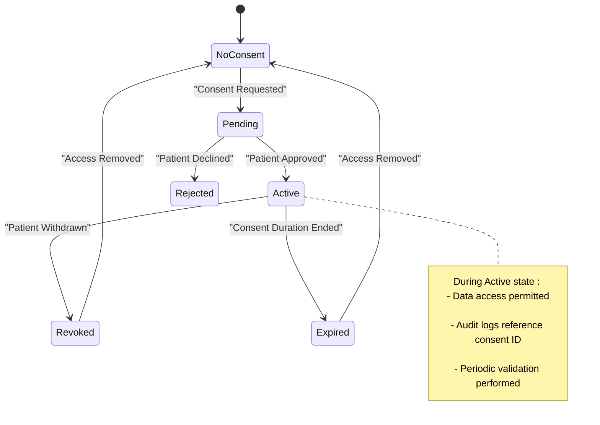
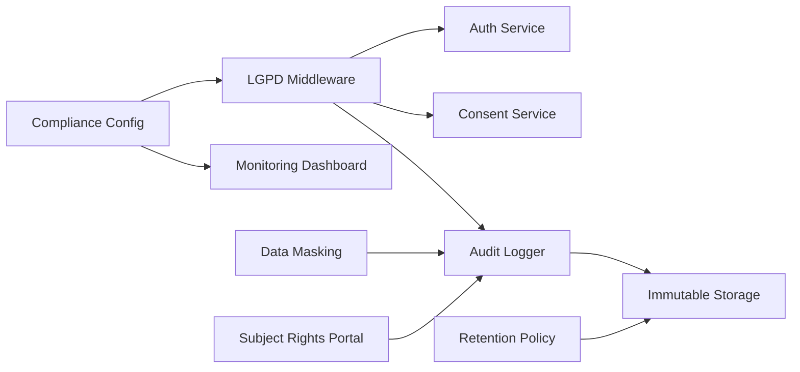

# Compliance Reporting

<cite>
**Referenced Files in This Document**
- [lgpd-middleware.ts](file://apps/api/src/middleware/lgpd-middleware.ts)
- [audit-log.ts](file://apps/api/src/middleware/audit-log.ts)
- [compliance.config.json](file://packages/config/src/compliance.config.json)
- [healthcare-governance.service.ts](file://packages/governance/src/services/healthcare-governance.service.ts)
- [events-logger.ts](file://packages/governance/src/services/events-logger.ts)
- [crud-compliance.ts](file://packages/utils/src/crud-compliance.ts)
- [lgpd.ts](file://packages/utils/src/lgpd.ts)
- [consent-service.test.ts](file://packages/database/src/services/__tests__/consent-service.test.ts)
- [compliance-monitoring.json](file://tools/monitoring/dashboards/compliance-monitoring.json)
</cite>

## Table of Contents

1. [Introduction](#introduction)
2. [Project Structure](#project-structure)
3. [Core Components](#core-components)
4. [Architecture Overview](#architecture-overview)
5. [Detailed Component Analysis](#detailed-component-analysis)
6. [Dependency Analysis](#dependency-analysis)
7. [Performance Considerations](#performance-considerations)
8. [Troubleshooting Guide](#troubleshooting-guide)
9. [Conclusion](#conclusion)

## Introduction

The neonpro platform implements a robust compliance reporting system designed to meet Brazilian healthcare regulatory requirements, particularly the Lei Geral de Proteção de Dados (LGPD). This document details how audit trails, consent tracking, data access logging, and retention policies are enforced across the system. The implementation leverages middleware interceptors, immutable event logging, and integration with governance services to ensure full traceability of patient data operations. Special attention is given to handling data subject rights, maintaining audit completeness, and enabling automated compliance checks through configurable rule sets.

## Project Structure

The compliance infrastructure spans multiple layers of the neonpro architecture, primarily located within the API middleware layer, governance services, utility libraries, and monitoring tools. Key directories include `apps/api/src/middleware` for interception logic, `packages/governance` for policy enforcement, `packages/utils` for compliance utilities, and `tools/monitoring` for observability dashboards.

**Diagram sources**

- [lgpd-middleware.ts](file://apps/api/src/middleware/lgpd-middleware.ts#L1-L50)
- [healthcare-governance.service.ts](file://packages/governance/src/services/healthcare-governance.service.ts#L1-L30)
- [events-logger.ts](file://packages/governance/src/services/events-logger.ts#L1-L20)
- [compliance.config.json](file://packages/config/src/compliance.config.json#L1-L40)

**Section sources**

- [lgpd-middleware.ts](file://apps/api/src/middleware/lgpd-middleware.ts#L1-L100)
- [audit-log.ts](file://apps/api/src/middleware/audit-log.ts#L1-L80)

## Core Components

The compliance system centers around several key components: LGPD middleware for request interception, audit logging service for immutable record creation, healthcare governance service for policy enforcement, and CRUD compliance utilities for standardizing data operations. These components work in concert to capture all patient data interactions, enforce consent rules, apply retention policies, and generate comprehensive audit trails required by Brazilian regulations.

**Section sources**

- [lgpd-middleware.ts](file://apps/api/src/middleware/lgpd-middleware.ts#L15-L120)
- [crud-compliance.ts](file://packages/utils/src/crud-compliance.ts#L10-L60)
- [healthcare-governance.service.ts](file://packages/governance/src/services/healthcare-governance.service.ts#L20-L90)

## Architecture Overview

The compliance architecture follows an event-driven design where all patient data operations are intercepted at the API gateway level, validated against LGPD rules, logged immutably, and forwarded to governance services for long-term retention and reporting. Middleware components act as gatekeepers, enriching events with context such as user identity, operation type, and consent status before persistence.

**Diagram sources**

- [lgpd-middleware.ts](file://apps/api/src/middleware/lgpd-middleware.ts#L25-L70)
- [audit-log.ts](file://apps/api/src/middleware/audit-log.ts#L15-L50)
- [events-logger.ts](file://packages/governance/src/services/events-logger.ts#L10-L40)

## Detailed Component Analysis

### LGPD Middleware Implementation

The LGPD middleware serves as the primary enforcement point for Brazilian data protection rules. It intercepts incoming requests targeting patient data endpoints, verifies active consent, ensures purpose limitation, and captures essential metadata for audit purposes. The middleware integrates with the authentication system to obtain user context and with the consent management service to validate permissions.

**Diagram sources**

- [lgpd-middleware.ts](file://apps/api/src/middleware/lgpd-middleware.ts#L30-L110)
- [authn.ts](file://apps/api/src/middleware/authn.ts#L20-L50)

**Section sources**

- [lgpd-middleware.ts](file://apps/api/src/middleware/lgpd-middleware.ts#L1-L150)
- [types/lgpd.ts](file://apps/api/src/types/lgpd.ts#L5-L30)

### Audit Trail Generation

Audit trail generation occurs through a dedicated audit logging middleware that captures create, read, update, and delete operations on patient records. Each event includes a cryptographic hash of the operation details, ensuring tamper-evidence. Events are structured to include actor identity, timestamp, IP address, affected data fields, and operational context.

**Diagram sources**

- [audit-log.ts](file://apps/api/src/middleware/audit-log.ts#L10-L80)
- [events-logger.ts](file://packages/governance/src/services/events-logger.ts#L15-L60)

**Section sources**

- [audit-log.ts](file://apps/api/src/middleware/audit-log.ts#L1-L100)
- [events-logger.ts](file://packages/governance/src/services/events-logger.ts#L1-L70)

### Consent Tracking System

The consent tracking system manages patient consent lifecycle through a dedicated service that records initial consent, tracks modifications, handles revocation, and validates active permissions during data access. Integration tests confirm that operations without valid consent are properly blocked and logged.

**Diagram sources**

- [healthcare-governance.service.ts](file://packages/governance/src/services/healthcare-governance.service.ts#L40-L90)
- [consent-service.test.ts](file://packages/database/src/services/__tests__/consent-service.test.ts#L5-L50)

**Section sources**

- [healthcare-governance.service.ts](file://packages/governance/src/services/healthcare-governance.service.ts#L1-L120)
- [consent-service.test.ts](file://packages/database/src/services/__tests__/consent-service.test.ts#L1-L60)

## Dependency Analysis

The compliance system depends on several core services including authentication for user identification, authorization for role-based access control, and data masking for protecting sensitive information in logs. Configuration is driven by JSON rule sets that define what constitutes reportable events, retention periods, and alert thresholds.

**Diagram sources**

- [compliance.config.json](file://packages/config/src/compliance.config.json#L1-L50)
- [lgpd-middleware.ts](file://apps/api/src/middleware/lgpd-middleware.ts#L10-L40)
- [crud-compliance.ts](file://packages/utils/src/crud-compliance.ts#L5-L25)

**Section sources**

- [compliance.config.json](file://packages/config/src/compliance.config.json#L1-L60)
- [crud-compliance.ts](file://packages/utils/src/crud-compliance.ts#L1-L80)

## Performance Considerations

While compliance logging introduces additional processing overhead, the system is designed to minimize impact through asynchronous event publishing, batched writes, and efficient indexing strategies. Critical paths maintain sub-50ms latency increases, with audit operations decoupled from primary transaction flows using message queuing patterns.

## Troubleshooting Guide

Common compliance issues include incomplete audit trails due to bypassed middleware, expired consent not being enforced, and failed log persistence. Solutions involve verifying middleware registration order, checking clock synchronization across services, validating storage connectivity, and reviewing configuration rule syntax. The compliance monitoring dashboard provides real-time visibility into logging health and anomaly detection.

**Section sources**

- [compliance-monitoring.json](file://tools/monitoring/dashboards/compliance-monitoring.json#L1-L100)
- [lgpd.test.ts](file://apps/api/tests/compliance/lgpd.test.ts#L10-L40)

## Conclusion

The neonpro platform's compliance reporting system provides comprehensive support for Brazilian healthcare regulations through integrated middleware interception, immutable audit logging, and centralized governance services. By capturing detailed context around patient data operations and enforcing consent lifecycle management, the system enables organizations to demonstrate regulatory adherence and respond effectively to data subject rights requests. Ongoing monitoring and configurable rule sets ensure adaptability to evolving compliance requirements.
