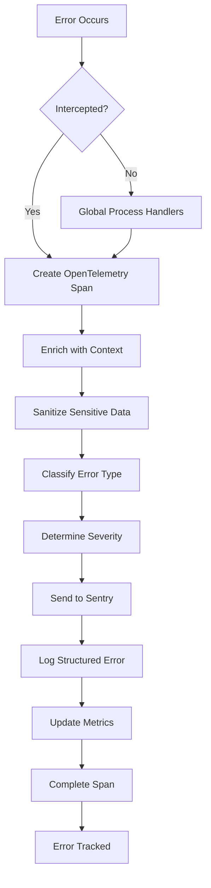
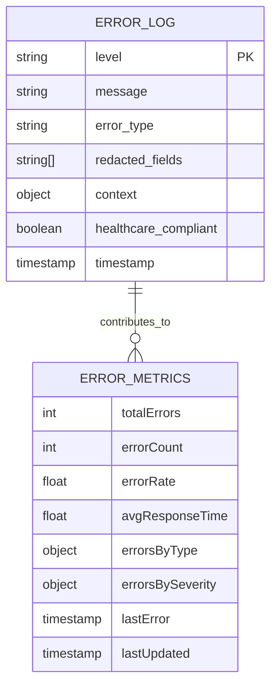
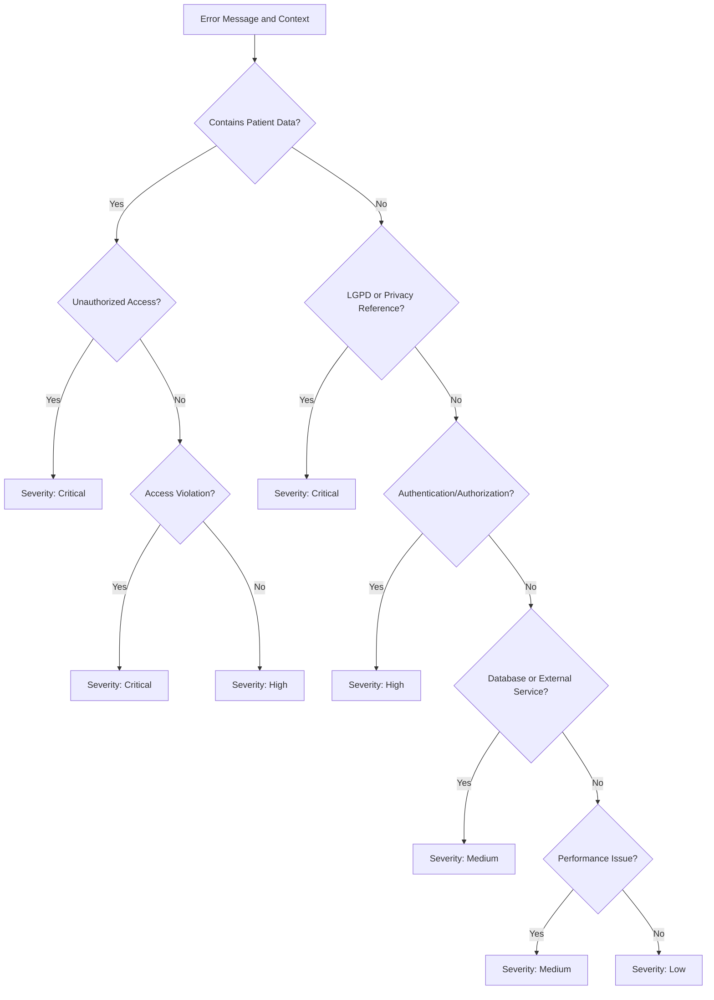
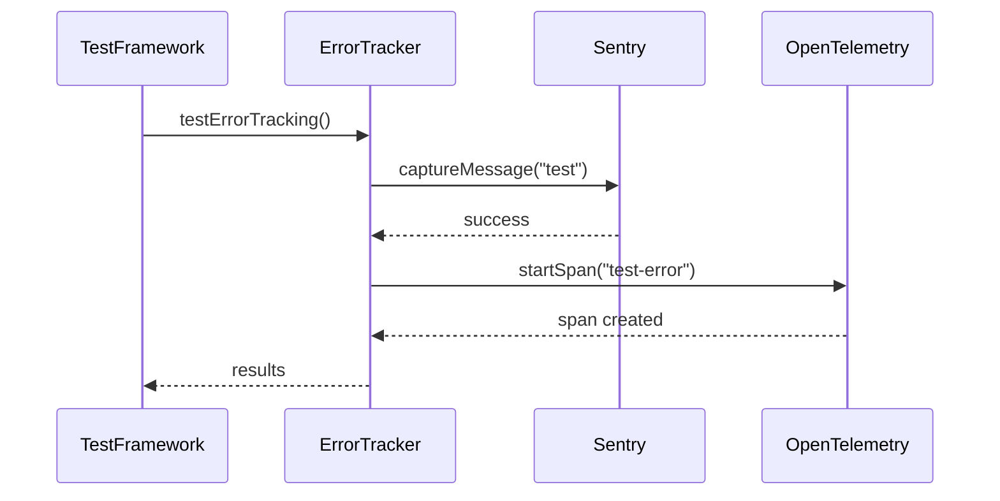

# Error Tracking

<cite>
**Referenced Files in This Document **   
- [error-tracking.ts](file://apps/api/src/services/error-tracking.ts)
- [error-tracking-init.ts](file://apps/api/src/services/error-tracking-init.ts)
- [error-tracking.ts](file://apps/api/src/config/error-tracking.ts)
- [error-handler.ts](file://apps/api/src/middleware/error-handler.ts)
- [error-sanitization.ts](file://apps/api/src/middleware/error-sanitization.ts)
- [error-tracking.test.ts](file://apps/api/src/__tests__/error-tracking.test.ts)
</cite>

## Table of Contents
1. [Introduction](#introduction)
2. [Error Handling Pipeline](#error-handling-pipeline)
3. [Context Enrichment and Data Sanitization](#context-enrichment-and-data-sanitization)
4. [Structured Logging and Monitoring](#structured-logging-and-monitoring)
5. [Configuration Options](#configuration-options)
6. [Error Classification and Severity Levels](#error-classification-and-severity-levels)
7. [Integration with External Services](#integration-with-external-services)
8. [Frontend, Backend, and AI Service Error Tracking](#frontend-backend-and-ai-service-error-tracking)
9. [Developer Instrumentation Guidelines](#developer-instrumentation-guidelines)
10. [Operations and Incident Response](#operations-and-incident-response)
11. [Testing and Validation](#testing-and-validation)

## Introduction
The NeonPro platform's error tracking system provides comprehensive monitoring and analysis of application errors across frontend, backend, and AI services. Designed with healthcare compliance as a core principle, the system captures, processes, and analyzes errors while ensuring sensitive data protection under LGPD regulations. The architecture combines Sentry for error aggregation and OpenTelemetry for distributed tracing, creating a robust observability framework that supports both development debugging and operational incident response.

**Section sources**
- [error-tracking.ts](file://apps/api/src/services/error-tracking.ts#L1-L50)
- [error-tracking-init.ts](file://apps/api/src/services/error-tracking-init.ts#L1-L30)

## Error Handling Pipeline
The error handling pipeline in NeonPro follows a systematic approach to intercept, process, and route errors through various stages of analysis and reporting. When an error occurs in any component of the system, it enters the pipeline through middleware or direct API calls to the error tracking service. The pipeline begins with error interception at the global level, where uncaught exceptions and unhandled promise rejections are captured by process-level handlers.

Once intercepted, errors are processed through a series of transformations that enrich context, sanitize sensitive information, and prepare them for external reporting. The pipeline is designed to be non-blocking, ensuring that error tracking does not impact the primary functionality of the application. Each error flows through the HealthcareErrorTracker class, which orchestrates the entire tracking process using OpenTelemetry spans to maintain traceability across asynchronous operations.



**Diagram sources **
- [error-tracking.ts](file://apps/api/src/services/error-tracking.ts#L392-L460)
- [error-tracking-init.ts](file://apps/api/src/services/error-tracking-init.ts#L47-L95)

**Section sources**
- [error-tracking.ts](file://apps/api/src/services/error-tracking.ts#L1-L100)
- [error-tracking-init.ts](file://apps/api/src/services/error-tracking-init.ts#L1-L50)

## Context Enrichment and Data Sanitization
The error tracking system automatically enriches errors with contextual information while simultaneously sanitizing sensitive data to ensure compliance with healthcare privacy regulations. Context enrichment extracts relevant information from the request environment, including clinic ID, user role, request ID, endpoint, HTTP method, and timestamp. This contextual data is crucial for diagnosing issues and understanding the circumstances under which errors occur.

Data sanitization is a critical component of the system, designed specifically to protect Protected Health Information (PHI) and comply with LGPD requirements. The system employs pattern-based redaction to identify and mask sensitive information such as CPF numbers, phone numbers, email addresses, medical record identifiers, and financial data. Both string content and structured objects are recursively sanitized to prevent accidental exposure of sensitive fields in error messages, stack traces, or metadata.

```mermaid
classDiagram
class ErrorSanitization {
+SENSITIVE_PATTERNS : RegExp[]
+sanitizeString(str : string) : string
+sanitizeObject(obj : any) : any
+redactHealthcareData(text : string) : {redacted : string, fields : string[]}
+redactMetadata(metadata : Record) : Record
}
class ErrorContextExtractor {
+extractHealthcareContext(request : any, additionalContext? : Record) : HealthcareErrorContext
+sanitizeUrl(url : string) : string
}
class RedactedError {
+message : string
+originalMessage : string
+redactedFields : string[]
+severity : ErrorSeverity
+type : HealthcareErrorType
+context : ErrorContext
+stack? : string
}
ErrorTrackingPipeline --> ErrorSanitization : "uses"
ErrorTrackingPipeline --> ErrorContextExtractor : "uses"
ErrorTrackingPipeline --> RedactedError : "creates"
```

**Diagram sources **
- [error-sanitization.ts](file://apps/api/src/middleware/error-sanitization.ts#L1-L147)
- [error-tracking.ts](file://apps/api/src/services/error-tracking.ts#L150-L250)

**Section sources**
- [error-sanitization.ts](file://apps/api/src/middleware/error-sanitization.ts#L1-L148)
- [error-tracking.ts](file://apps/api/src/services/error-tracking.ts#L150-L300)

## Structured Logging and Monitoring
The error tracking system implements structured logging to provide consistent, machine-readable error records that facilitate analysis and alerting. Each logged error follows a standardized JSON format containing severity level, error message, error type, redacted fields, contextual information, and timestamps. This structured approach enables efficient querying and aggregation in downstream systems like Elasticsearch or Splunk.

Monitoring capabilities are integrated through OpenTelemetry metrics that track error rates, types, and severities over time. The system maintains counters for total errors, errors by type, and errors by severity, allowing operations teams to identify trends and potential systemic issues. Performance metrics are also collected to correlate error occurrences with response times and system load, providing insights into the overall health of the platform.



**Diagram sources **
- [error-tracking.ts](file://apps/api/src/services/error-tracking.ts#L500-L600)
- [error-tracking-init.ts](file://apps/api/src/services/error-tracking-init.ts#L200-L243)

**Section sources**
- [error-tracking.ts](file://apps/api/src/services/error-tracking.ts#L500-L619)
- [error-tracking-init.ts](file://apps/api/src/services/error-tracking-init.ts#L200-L244)

## Configuration Options
The error tracking system provides extensive configuration options to tailor its behavior to different environments and operational requirements. Configuration is managed through the errorTrackingConfig object, which exposes settings for Sentry integration, OpenTelemetry, healthcare compliance, and performance monitoring. Environment-specific configurations allow different sampling rates and enablement policies for development, testing, and production environments.

Key configuration parameters include sample rates for error collection, trace sampling rates for performance monitoring, and environment-specific enablement flags. The system also allows configuration of sensitive data patterns for redaction, enabling customization based on specific regulatory requirements or organizational policies. Healthcare-specific settings ensure LGPD compliance by default, with options to adjust data masking and audit logging behaviors.

**Section sources**
- [error-tracking.ts](file://apps/api/src/config/error-tracking.ts#L1-L288)
- [error-tracking-init.ts](file://apps/api/src/services/error-tracking-init.ts#L1-L50)

## Error Classification and Severity Levels
The system automatically classifies errors into meaningful categories and assigns appropriate severity levels based on the nature and impact of the error. Error classification identifies the type of issue from a comprehensive taxonomy that includes data access violations, LGPD compliance issues, patient data exposure, unauthorized access, and various technical failures. This classification helps prioritize responses and identify systemic problems.

Severity levels are determined algorithmically based on the error type and context, ranging from 'low' to 'critical'. Critical severity is reserved for errors involving patient data exposure, data access violations, or LGPD compliance issues, triggering immediate alerts and incident response protocols. High severity covers unauthorized access and data integrity violations, while medium severity includes performance degradation and database errors. This tiered approach ensures appropriate response levels for different types of incidents.



**Diagram sources **
- [error-tracking.ts](file://apps/api/src/services/error-tracking.ts#L300-L400)

**Section sources**
- [error-tracking.ts](file://apps/api/src/services/error-tracking.ts#L300-L460)

## Integration with External Services
The error tracking system integrates with external monitoring and alerting services to provide comprehensive observability across the NeonPro platform. Primary integration is with Sentry for error aggregation, crash reporting, and team collaboration, while OpenTelemetry provides distributed tracing capabilities and metrics export to Prometheus. These integrations work together to create a complete picture of system health and error patterns.

The integration with Sentry is configured to respect healthcare compliance requirements, with beforeSend hooks that remove sensitive data before transmission. OpenTelemetry instrumentation is selectively enabled for different components, avoiding instrumentations that might capture sensitive information through file system, DNS, or network monitoring. The system also supports custom exporters and can be extended to integrate with other monitoring platforms as needed.

**Section sources**
- [error-tracking.ts](file://apps/api/src/config/error-tracking.ts#L50-L150)
- [error-tracking-init.ts](file://apps/api/src/services/error-tracking-init.ts#L50-L100)

## Frontend, Backend, and AI Service Error Tracking
The error tracking system provides unified monitoring across frontend, backend, and AI services, enabling correlation of errors across the entire technology stack. For frontend applications, errors are captured through global error handlers and unhandled promise rejection listeners, then transmitted to the backend error tracking service via secure APIs. Backend services use middleware integration to automatically capture route-level errors and exceptions.

AI services have specialized error tracking that accounts for their unique failure modes, including model inference failures, prompt engineering issues, and hallucination detection. The system correlates AI agent errors with user interactions and business outcomes, providing insights into the reliability and effectiveness of AI-powered features. Cross-service correlation is enabled through shared request IDs and distributed tracing, allowing developers to follow error propagation across service boundaries.

**Section sources**
- [error-tracking.ts](file://apps/api/src/services/error-tracking.ts#L1-L100)
- [error-handler.ts](file://apps/api/src/middleware/error-handler.ts#L1-L47)

## Developer Instrumentation Guidelines
Developers should instrument their code to generate meaningful error reports that facilitate debugging and system improvement. The primary method is using the trackError function exported from the error tracking service, which accepts an Error object and optional context parameters. When throwing custom errors, developers should include relevant contextual information in the error context rather than in the error message itself to avoid sensitive data exposure.

For anticipated error conditions, developers should use structured error objects with clear types and messages, avoiding generic error messages that provide little diagnostic value. When catching and re-throwing errors, the original error should be preserved as the cause to maintain stack trace integrity. The system provides a createErrorMiddleware function that can be used to standardize error handling across API routes.

**Section sources**
- [error-tracking.ts](file://apps/api/src/services/error-tracking.ts#L600-L619)
- [error-handler.ts](file://apps/api/src/middleware/error-handler.ts#L1-L47)

## Operations and Incident Response
Operations teams can leverage error tracking data for incident response and system improvement through several mechanisms. Real-time dashboards display error rates, types, and severities, enabling rapid detection of emerging issues. Alerting rules are configured to notify on-calls for critical and high-severity errors, with escalation procedures for sustained incidents.

Post-incident analysis is supported by comprehensive error logs and traces that provide detailed context for root cause analysis. The system's healthcare compliance focus ensures that incident investigations can proceed without exposing sensitive patient data. Trend analysis of error metrics helps identify recurring issues and prioritize reliability improvements in the development backlog.

**Section sources**
- [error-tracking.ts](file://apps/api/src/services/error-tracking.ts#L500-L600)
- [error-tracking-init.ts](file://apps/api/src/services/error-tracking-init.ts#L150-L200)

## Testing and Validation
The error tracking system includes comprehensive testing and validation capabilities to ensure reliability and correctness. Unit tests verify the proper functioning of error classification, severity determination, and data sanitization logic. Integration tests confirm that the system correctly initializes and communicates with external services like Sentry and OpenTelemetry.

The system provides a testErrorTracking function that validates end-to-end functionality by sending test events through all components of the pipeline. A forceErrorTracking function allows developers to simulate errors of specific severities for testing alerting and monitoring workflows. Health check endpoints provide real-time status of the error tracking systems, indicating whether they are healthy, degraded, or unhealthy.



**Diagram sources **
- [error-tracking.test.ts](file://apps/api/src/__tests__/error-tracking.test.ts#L1-L213)
- [error-tracking-init.ts](file://apps/api/src/services/error-tracking-init.ts#L100-L150)

**Section sources**
- [error-tracking.test.ts](file://apps/api/src/__tests__/error-tracking.test.ts#L1-L213)
- [error-tracking-init.ts](file://apps/api/src/services/error-tracking-init.ts#L100-L150)