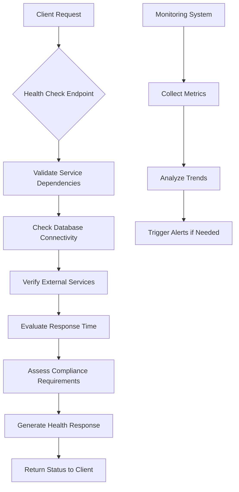
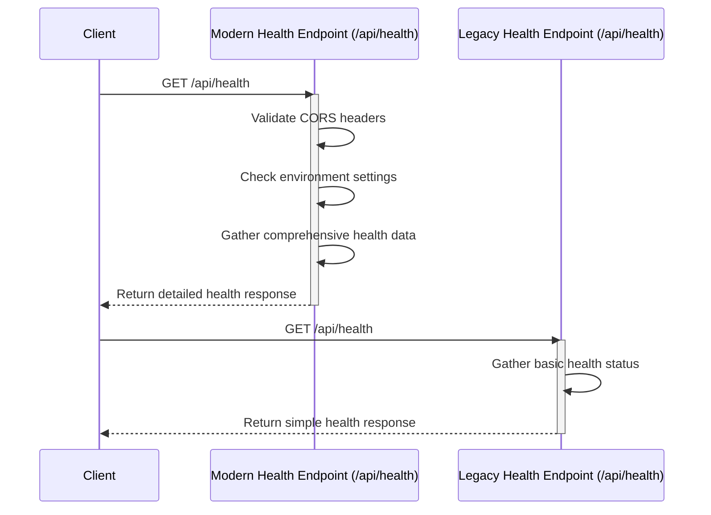
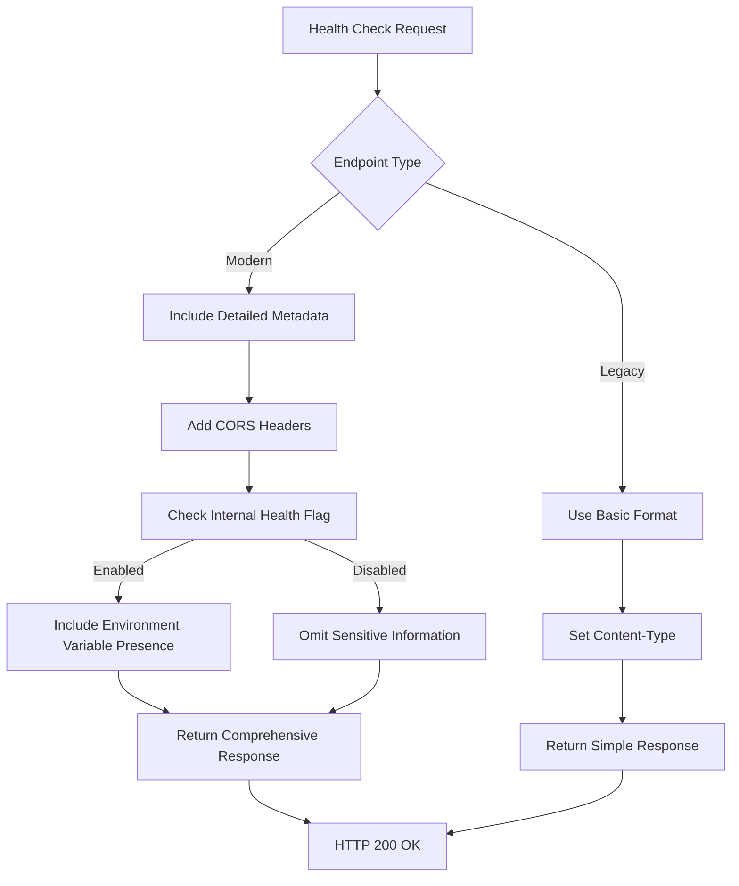
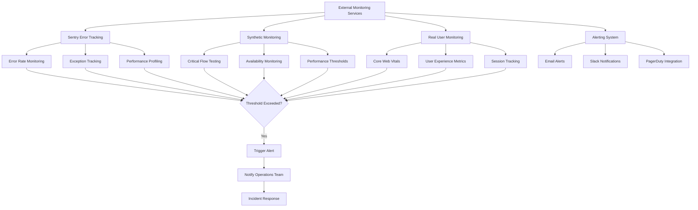
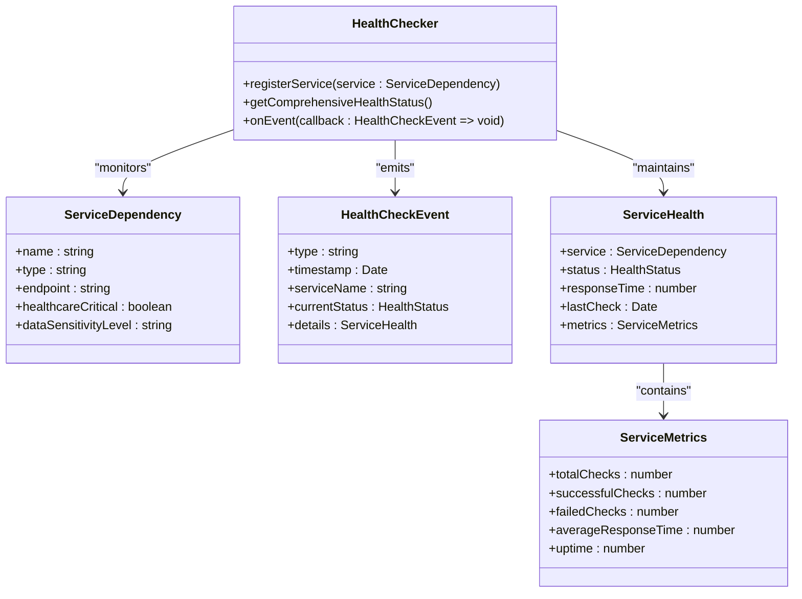

# Health Checks

<cite>
**Referenced Files in This Document **   
- [health.ts](file://apps/api/vercel/health.ts)
- [health-legacy.ts](file://apps/api/vercel/health-legacy.ts)
- [v1/health-legacy.ts](file://apps/api/vercel/v1/health-legacy.ts)
- [monitoring-config.ts](file://config/vercel/monitoring-config.ts)
- [health-checker.ts](file://apps/api/src/services/circuit-breaker/health-checker.ts)
- [agent_config.py](file://apps/api/agents/ag-ui-rag-agent/agent_config.py)
- [healthcare_data_service.py](file://apps/api/agents/ag-ui-rag-agent/healthcare_data_service.py)
</cite>

## Table of Contents
1. [Introduction](#introduction)
2. [Health Check System Overview](#health-check-system-overview)
3. [Modern vs Legacy Health Endpoints](#modern-vs-legacy-health-endpoints)
4. [Response Formats and Status Indicators](#response-formats-and-status-indicators)
5. [Configuration Options](#configuration-options)
6. [Integration with External Monitoring Services](#integration-with-external-monitoring-services)
7. [Practical Use Cases](#practical-use-cases)
8. [Extending the Health Check System](#extending-the-health-check-system)
9. [Conclusion](#conclusion)

## Introduction

The health check system in the neonpro platform is a critical component for ensuring service availability and system reliability across all application layers. It provides comprehensive monitoring capabilities that validate the operational status of various services, detect potential issues before they impact users, and ensure compliance with healthcare-specific regulations such as LGPD, ANVISA, and CFM. The system supports both modern and legacy endpoints to accommodate different client requirements while maintaining backward compatibility.

**Section sources**
- [health.ts](file://apps/api/vercel/health.ts#L1-L47)
- [health-legacy.ts](file://apps/api/vercel/health-legacy.ts#L1-L12)

## Health Check System Overview

The health check system in neonpro platform consists of multiple components working together to provide comprehensive monitoring and reliability assessment. At its core, the system includes endpoint-based health checks, circuit breaker patterns for service resilience, and integration with external monitoring tools. The architecture is designed to support both real-time health validation and historical performance analysis.

The system monitors various aspects including API responsiveness, database connectivity, external service dependencies, and resource utilization metrics. It also incorporates healthcare-specific compliance checks to ensure adherence to Brazilian healthcare regulations. The monitoring framework emits events for different health states (healthy, degraded, unhealthy) and compliance violations, enabling proactive incident response.

**Diagram sources **
- [health.ts](file://apps/api/vercel/health.ts#L1-L47)
- [health-checker.ts](file://apps/api/src/services/circuit-breaker/health-checker.ts#L1-L100)

**Section sources**
- [health.ts](file://apps/api/vercel/health.ts#L1-L47)
- [health-checker.ts](file://apps/api/src/services/circuit-breaker/health-checker.ts#L1-L100)

## Modern vs Legacy Health Endpoints

The neonpro platform maintains both modern and legacy health endpoints to support different client requirements and ensure backward compatibility. The modern health endpoint (`/api/health`) provides enhanced functionality with detailed status information, while the legacy endpoints (`/api/health` and `/api/v1/health`) maintain simpler response formats for older clients.

The modern health endpoint includes additional security features such as CORS header restrictions based on allowed origins, internal health information visibility controlled by environment variables, and comprehensive deployment metadata. It returns a JSON response with detailed status information including deployment version, environment type, and optional internal health indicators when enabled.

In contrast, the legacy health endpoints provide basic health status with minimal information, focusing on backward compatibility with existing integrations. These endpoints return simpler JSON structures with essential health indicators but lack the detailed metadata and security features of the modern endpoint.

**Diagram sources **
- [health.ts](file://apps/api/vercel/health.ts#L1-L47)
- [health-legacy.ts](file://apps/api/vercel/health-legacy.ts#L1-L12)
- [v1/health-legacy.ts](file://apps/api/vercel/v1/health-legacy.ts#L1-L12)

**Section sources**
- [health.ts](file://apps/api/vercel/health.ts#L1-L47)
- [health-legacy.ts](file://apps/api/vercel/health-legacy.ts#L1-L12)
- [v1/health-legacy.ts](file://apps/api/vercel/v1/health-legacy.ts#L1-L12)

## Response Formats and Status Indicators

The health check system employs different response formats for modern and legacy endpoints, each designed to meet specific client requirements while providing essential health information. The modern endpoint returns a comprehensive JSON structure with detailed status indicators, while legacy endpoints use simplified formats for backward compatibility.

The modern health endpoint response includes several key fields:
- `status`: Current health status ("ok" or "error")
- `message`: Descriptive message about the system status
- `timestamp`: ISO formatted timestamp of the health check
- `deployment`: Deployment identifier
- `environment`: Current environment (production, development, etc.)
- Internal health indicators (when enabled): Presence of critical environment variables

The legacy endpoints use a simpler format with basic health indicators:
- `ok`: Boolean indicating overall health status
- `status`: Text status description
- `ts`: Timestamp of the health check
- `path`: Requested health check path

Both endpoint types return HTTP status code 200 for successful health checks, ensuring consistent behavior across different client implementations.

**Diagram sources **
- [health.ts](file://apps/api/vercel/health.ts#L1-L47)
- [health-legacy.ts](file://apps/api/vercel/health-legacy.ts#L1-L12)

**Section sources**
- [health.ts](file://apps/api/vercel/health.ts#L1-L47)
- [health-legacy.ts](file://apps/api/vercel/health-legacy.ts#L1-L12)

## Configuration Options

The health check system offers various configuration options to customize behavior according to deployment requirements and security policies. These configurations are primarily managed through environment variables and configuration files, allowing flexible adaptation to different environments.

Key configuration options include:
- `NODE_ENV`: Determines whether the system is running in development or production mode
- `INTERNAL_HEALTH`: Controls visibility of internal health information including environment variable presence
- `ALLOWED_ORIGINS`: Specifies domains permitted for CORS access to health endpoints
- Various timeout and interval settings for health monitoring

The monitoring configuration file (`monitoring-config.ts`) provides extensive options for customizing observability settings, including error tracking, performance monitoring, logging levels, and alert thresholds. Healthcare-specific configurations ensure compliance with regulatory requirements by enabling audit logging, security event monitoring, and compliance violation detection.

Additionally, the AG-UI RAG agent configuration allows customization of health-related parameters such as maximum response time and query length limits, ensuring optimal performance while maintaining healthcare compliance standards.

**Section sources**
- [health.ts](file://apps/api/vercel/health.ts#L1-L47)
- [monitoring-config.ts](file://config/vercel/monitoring-config.ts#L1-L485)
- [agent_config.py](file://apps/api/agents/ag-ui-rag-agent/agent_config.py#L1-L78)

## Integration with External Monitoring Services

The health check system integrates seamlessly with external monitoring services to provide comprehensive observability and alerting capabilities. The configuration supports multiple monitoring tools including Sentry for error tracking, synthetic monitoring for critical user flows, and real user monitoring (RUM) for performance insights.

The monitoring configuration defines alert rules based on various metrics such as error rate, response time, memory usage, and database connection issues. These alerts are routed through multiple channels including email, Slack, and PagerDuty, ensuring timely notification of potential issues. The system also supports synthetic monitoring of critical healthcare workflows like patient registration and appointment booking, with configurable frequency and locations.

Performance thresholds are defined for response time, availability, and error rate, allowing the system to detect degradation before it impacts users. The integration with external services enables automated incident response and facilitates compliance reporting by maintaining detailed audit trails of system health and performance.

**Diagram sources **
- [monitoring-config.ts](file://config/vercel/monitoring-config.ts#L1-L485)

**Section sources**
- [monitoring-config.ts](file://config/vercel/monitoring-config.ts#L1-L485)

## Practical Use Cases

The health check system plays a crucial role in various practical scenarios across the neonpro platform's lifecycle, from deployment pipelines to incident response. In deployment pipelines, health checks validate successful deployments by confirming that new instances are operational before routing traffic to them. Load balancers use health check responses to determine which instances should receive traffic, automatically removing unhealthy instances from rotation.

During incident response, the comprehensive health information helps operations teams quickly identify affected components and assess the scope of issues. The system's integration with monitoring tools enables automated alerts and facilitates root cause analysis by providing detailed metrics and logs. Healthcare-specific compliance monitoring ensures that critical services remain available and compliant with regulatory requirements.

The health check system also supports capacity planning by providing historical performance data and trend analysis. This information helps infrastructure teams anticipate resource needs and optimize system performance. Additionally, the system aids in validating disaster recovery procedures by verifying that backup systems are operational and can handle production traffic.

**Section sources**
- [health.ts](file://apps/api/vercel/health.ts#L1-L47)
- [monitoring-config.ts](file://config/vercel/monitoring-config.ts#L1-L485)
- [health-checker.ts](file://apps/api/src/services/circuit-breaker/health-checker.ts#L1-L100)

## Extending the Health Check System

The health check system can be extended with custom probes to monitor specific aspects of the application and its dependencies. Developers can implement custom health checks for database connectivity, external API dependencies, and resource utilization metrics by registering new service dependencies with the health checker.

The circuit breaker pattern implemented in the health checker allows for sophisticated failure handling and automatic recovery detection. Custom health checks can be configured with specific thresholds for response time, failure rate, and retry behavior, tailored to the characteristics of each service. Healthcare-critical services can be marked as such in their configuration, triggering more aggressive monitoring and alerting when issues occur.

The system supports event listeners that can respond to health check events, enabling custom actions such as sending notifications, updating dashboards, or initiating failover procedures. The modular design allows new health check types to be added without modifying existing code, promoting maintainability and extensibility.

**Diagram sources **
- [health-checker.ts](file://apps/api/src/services/circuit-breaker/health-checker.ts#L1-L100)

**Section sources**
- [health-checker.ts](file://apps/api/src/services/circuit-breaker/health-checker.ts#L1-L100)
- [healthcare_data_service.py](file://apps/api/agents/ag-ui-rag-agent/healthcare_data_service.py#L1-L413)

## Conclusion

The health check system in the neonpro platform provides a robust foundation for ensuring service availability and system reliability across all application layers. By combining modern and legacy endpoints, comprehensive monitoring capabilities, and healthcare-specific compliance features, the system addresses the diverse needs of a healthcare platform operating in a regulated environment.

The flexible configuration options and extensible architecture enable organizations to tailor the health check system to their specific requirements while maintaining high standards of reliability and compliance. Integration with external monitoring services enhances observability and facilitates proactive incident management, reducing downtime and improving user experience.

As healthcare systems continue to evolve, the health check system will play an increasingly important role in maintaining the availability and performance of critical medical applications, ultimately contributing to better patient care and operational efficiency.