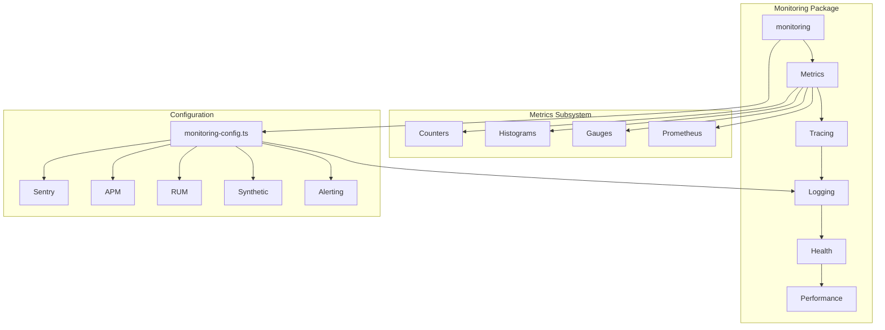
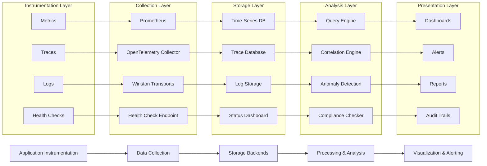
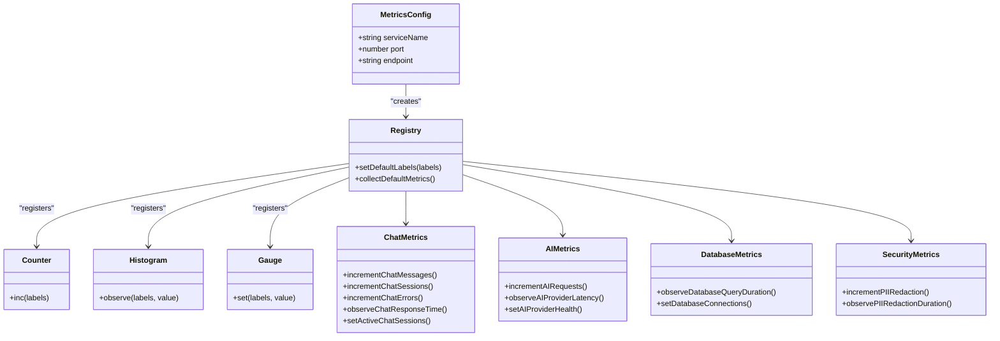
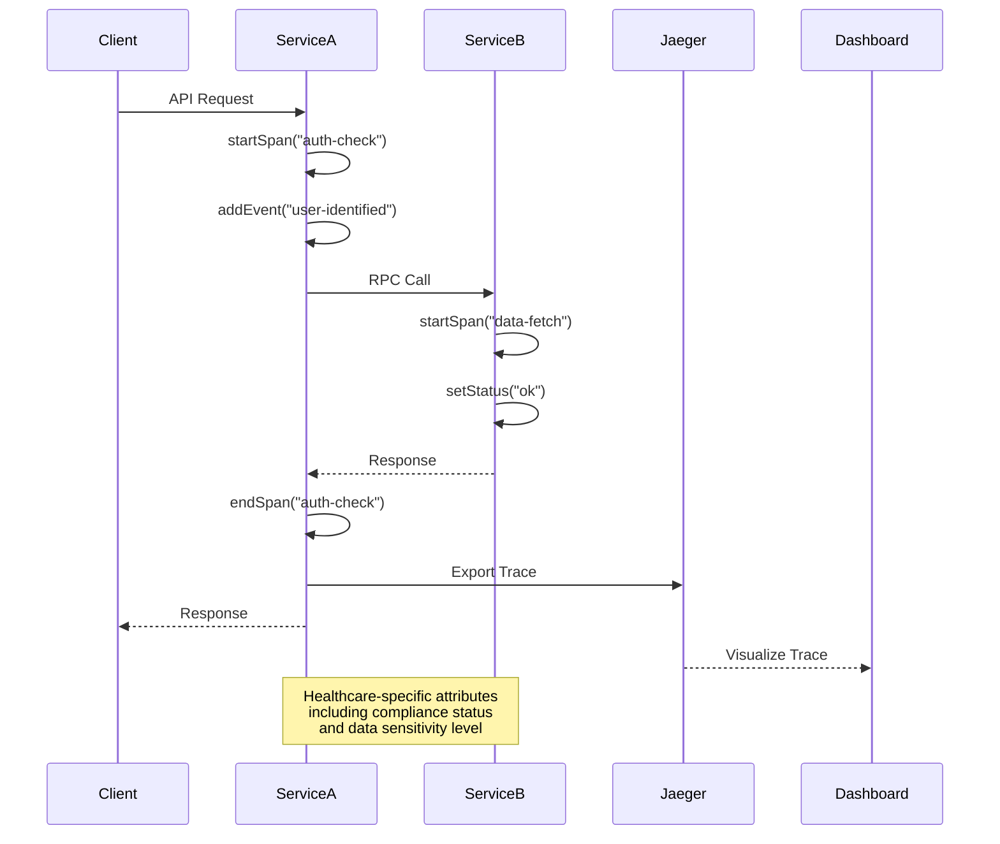
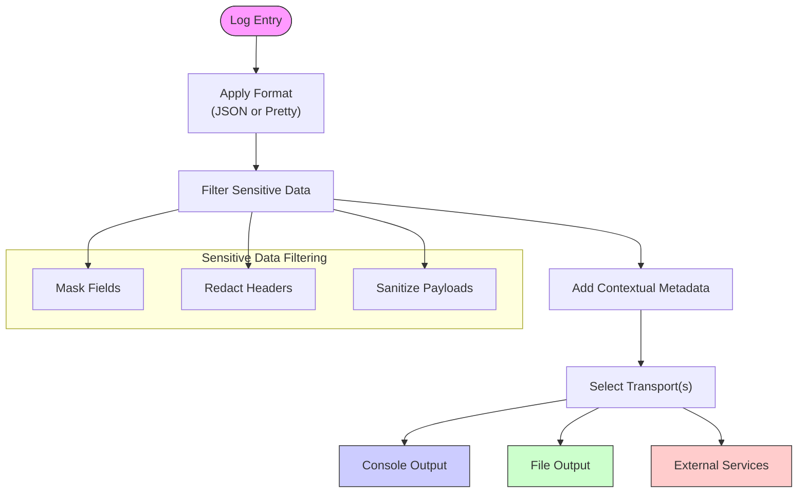
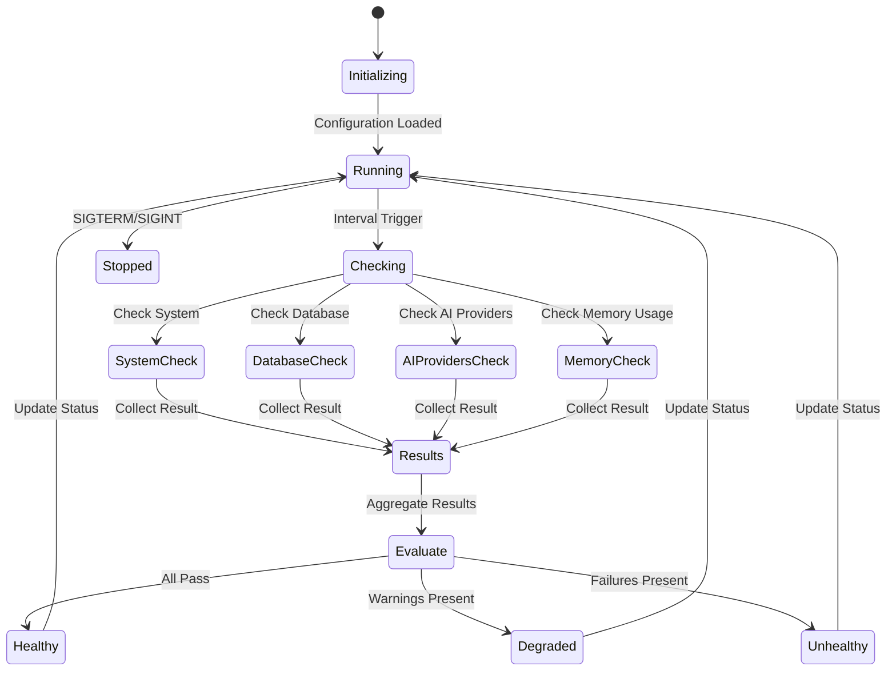
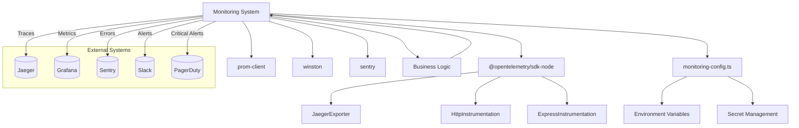

# Monitoring & Analytics

<cite>
**Referenced Files in This Document **
- [index.ts](file://packages/monitoring/src/index.ts)
- [init.ts](file://packages/monitoring/src/init.ts)
- [types.ts](file://packages/monitoring/src/types.ts)
- [metrics/init.ts](file://packages/monitoring/src/metrics/init.ts)
- [metrics/prometheus.ts](file://packages/monitoring/src/metrics/prometheus.ts)
- [metrics/counters.ts](file://packages/monitoring/src/metrics/counters.ts)
- [metrics/histograms.ts](file://packages/monitoring/src/metrics/histograms.ts)
- [metrics/gauges.ts](file://packages/monitoring/src/metrics/gauges.ts)
- [tracing/tracer.ts](file://packages/monitoring/src/tracing/tracer.ts)
- [logging/winston.ts](file://packages/monitoring/src/logging/winston.ts)
- [health/init.ts](file://packages/monitoring/src/health/init.ts)
- [monitoring-config.ts](file://config/vercel/monitoring-config.ts)
</cite>

## Table of Contents

1. [Introduction](#introduction)
2. [Project Structure](#project-structure)
3. [Core Components](#core-components)
4. [Architecture Overview](#architecture-overview)
5. [Detailed Component Analysis](#detailed-component-analysis)
6. [Dependency Analysis](#dependency-analysis)
7. [Performance Considerations](#performance-considerations)
8. [Troubleshooting Guide](#troubleshooting-guide)
9. [Conclusion](#conclusion)

## Introduction

The neonpro platform implements a comprehensive monitoring and analytics system designed to provide full observability across all application layers. This documentation details the architectural design and implementation of the monitoring infrastructure, which encompasses metrics collection, distributed tracing, structured logging, health checks, and alerting systems. The system is specifically tailored for healthcare applications with strict compliance requirements under LGPD, ANVISA, and CFM regulations.

The monitoring architecture follows a modular design pattern, enabling independent configuration and scaling of each observability pillar. It integrates industry-standard tools such as Prometheus for metrics, Jaeger for distributed tracing, and Sentry for error tracking, while implementing healthcare-specific safeguards for protecting sensitive patient information. The system provides real-time insights into application performance, user behavior, security events, and system health, ensuring both operational excellence and regulatory compliance.

## Project Structure

The monitoring system is organized as a dedicated package within the monorepo architecture, following domain-driven design principles. This separation ensures that observability concerns are decoupled from business logic while maintaining consistent instrumentation across services.

**Diagram sources**

- [index.ts](file://packages/monitoring/src/index.ts)
- [monitoring-config.ts](file://config/vercel/monitoring-config.ts)

**Section sources**

- [index.ts](file://packages/monitoring/src/index.ts)
- [monitoring-config.ts](file://config/vercel/monitoring-config.ts)

## Core Components

The monitoring system comprises several core components that work together to provide comprehensive observability. These components include metrics collection with Prometheus, distributed tracing with OpenTelemetry, structured logging with Winston, health checking mechanisms, and performance monitoring capabilities.

The system is initialized through a centralized `initializeMonitoring` function that configures all subsystems based on environment-specific settings. Each component is designed to be optional and independently configurable, allowing different services within the platform to enable only the monitoring features they require.

Key architectural patterns include dependency injection for testability, registry patterns for metric management, and event-driven health checking. The system also implements healthcare-specific safeguards, including automatic redaction of protected health information (PHI) and specialized audit logging for compliance purposes.

**Section sources**

- [init.ts](file://packages/monitoring/src/init.ts)
- [types.ts](file://packages/monitoring/src/types.ts)

## Architecture Overview

The monitoring architecture implements a multi-layered approach to observability, with data flowing from application instrumentation through collection pipelines to storage and visualization layers. The system follows the four pillars of modern observability: metrics, logs, traces, and health checks.

**Diagram sources**

- [init.ts](file://packages/monitoring/src/init.ts)
- [monitoring-config.ts](file://config/vercel/monitoring-config.ts)

## Detailed Component Analysis

### Metrics Collection System

The metrics collection system implements a comprehensive telemetry framework using Prometheus as the primary metrics backend. The system captures various types of metrics including counters, histograms, and gauges, each serving specific monitoring purposes.

**Diagram sources**

- [metrics/init.ts](file://packages/monitoring/src/metrics/init.ts)
- [metrics/prometheus.ts](file://packages/monitoring/src/metrics/prometheus.ts)
- [metrics/counters.ts](file://packages/monitoring/src/metrics/counters.ts)
- [metrics/histograms.ts](file://packages/monitoring/src/metrics/histograms.ts)
- [metrics/gauges.ts](file://packages/monitoring/src/metrics/gauges.ts)

**Section sources**

- [metrics/init.ts](file://packages/monitoring/src/metrics/init.ts)
- [metrics/prometheus.ts](file://packages/monitoring/src/metrics/prometheus.ts)

#### Distributed Tracing Implementation

The distributed tracing system leverages OpenTelemetry to provide end-to-end visibility into request flows across microservices. The implementation includes automatic instrumentation for HTTP and Express frameworks, along with manual tracing capabilities for custom operations.

**Diagram sources**

- [init.ts](file://packages/monitoring/src/init.ts)
- [tracing/tracer.ts](file://packages/monitoring/src/tracing/tracer.ts)

#### Structured Logging Framework

The structured logging system implements a flexible and secure logging framework using Winston, with multiple transport options and healthcare-specific data protection measures. The system ensures that all log entries are consistently formatted and automatically filtered for sensitive information.

**Diagram sources**

- [logging/winston.ts](file://packages/monitoring/src/logging/winston.ts)
- [monitoring-config.ts](file://config/vercel/monitoring-config.ts)

#### Health Checking Mechanism

The health checking system provides continuous monitoring of service availability and system health through periodic checks of critical components. The implementation supports both internal system checks and external dependency verification.

**Diagram sources**

- [health/init.ts](file://packages/monitoring/src/health/init.ts)
- [init.ts](file://packages/monitoring/src/init.ts)

## Dependency Analysis

The monitoring system has well-defined dependencies on both internal and external components, ensuring loose coupling while maintaining comprehensive observability coverage.

**Diagram sources**

- [init.ts](file://packages/monitoring/src/init.ts)
- [monitoring-config.ts](file://config/vercel/monitoring-config.ts)

**Section sources**

- [init.ts](file://packages/monitoring/src/init.ts)
- [monitoring-config.ts](file://config/vercel/monitoring-config.ts)

## Performance Considerations

The monitoring system is designed with performance as a first-class concern, implementing several optimization strategies to minimize overhead on production services. The architecture balances comprehensive data collection with minimal performance impact.

Key performance considerations include:

- **Sampling strategies**: Transaction sampling rates are configured based on environment (higher in development, lower in production)
- **Asynchronous operations**: All monitoring operations are performed asynchronously to avoid blocking application logic
- **Batch processing**: Metrics and logs are batched before transmission to reduce network overhead
- **Memory efficiency**: Object pooling and reuse patterns minimize garbage collection pressure
- **Conditional activation**: Monitoring components can be individually enabled/disabled based on service requirements

The system also implements healthcare-specific performance monitoring, tracking key metrics such as patient registration time, appointment booking latency, and medical record access duration. These metrics are crucial for ensuring compliance with service level agreements and regulatory requirements.

## Troubleshooting Guide

The monitoring system includes several built-in mechanisms to assist with troubleshooting and diagnostics. When issues arise, administrators should follow this systematic approach:

1. **Check health endpoints**: Verify the `/health` endpoint returns status 200 with all checks passing
2. **Review error logs**: Examine the structured logs for error-level messages with correlation IDs
3. **Analyze traces**: Use distributed tracing to identify bottlenecks or failures in request flows
4. **Monitor metrics**: Check key performance indicators such as response times, error rates, and resource utilization
5. **Validate configurations**: Ensure monitoring configuration matches environment requirements

Common issues and their resolutions include:

- **High memory usage**: Investigate memory check results and review heap dumps
- **Database connection problems**: Verify database health check status and connection pool settings
- **AI provider timeouts**: Check AI provider health status and retry configurations
- **Missing metrics**: Confirm Prometheus scraping configuration and firewall rules
- **Trace data loss**: Validate OpenTelemetry collector connectivity and buffer settings

**Section sources**

- [health/init.ts](file://packages/monitoring/src/health/init.ts)
- [init.ts](file://packages/monitoring/src/init.ts)
- [monitoring-config.ts](file://config/vercel/monitoring-config.ts)

## Conclusion

The monitoring and analytics system in the neonpro platform provides a robust, compliant, and comprehensive observability solution for healthcare applications. By integrating metrics, traces, logs, and health checks into a unified architecture, the system enables proactive issue detection, rapid troubleshooting, and continuous performance optimization.

The modular design allows for flexible deployment across different services and environments, while healthcare-specific features ensure compliance with stringent regulatory requirements. The implementation of automatic sensitive data protection, comprehensive audit logging, and specialized alerting rules demonstrates a deep understanding of the unique challenges in healthcare technology.

Future enhancements could include machine learning-based anomaly detection, predictive capacity planning, and enhanced user journey analysis. However, the current system already provides a solid foundation for maintaining high availability, performance, and security in the neonpro platform.
