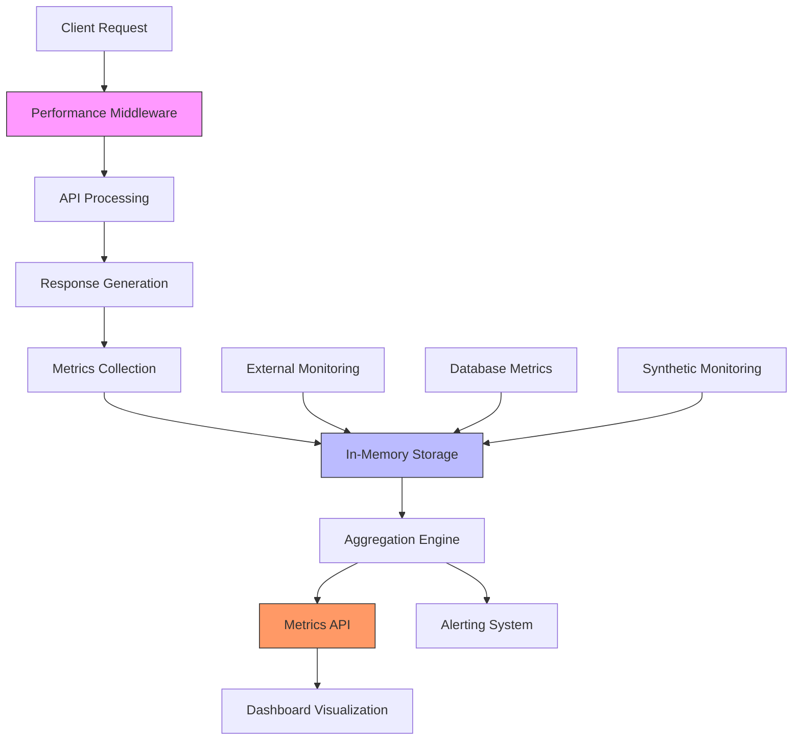
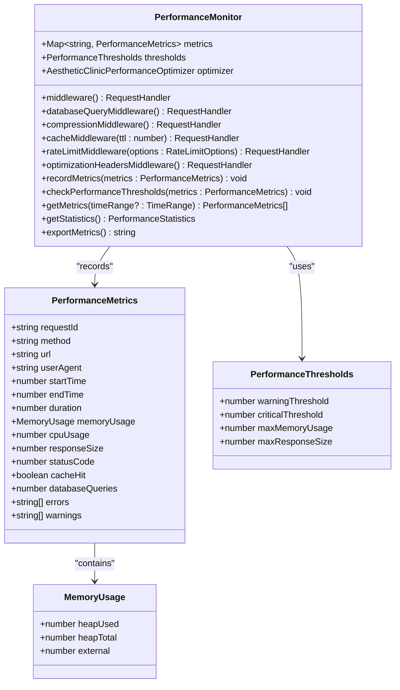
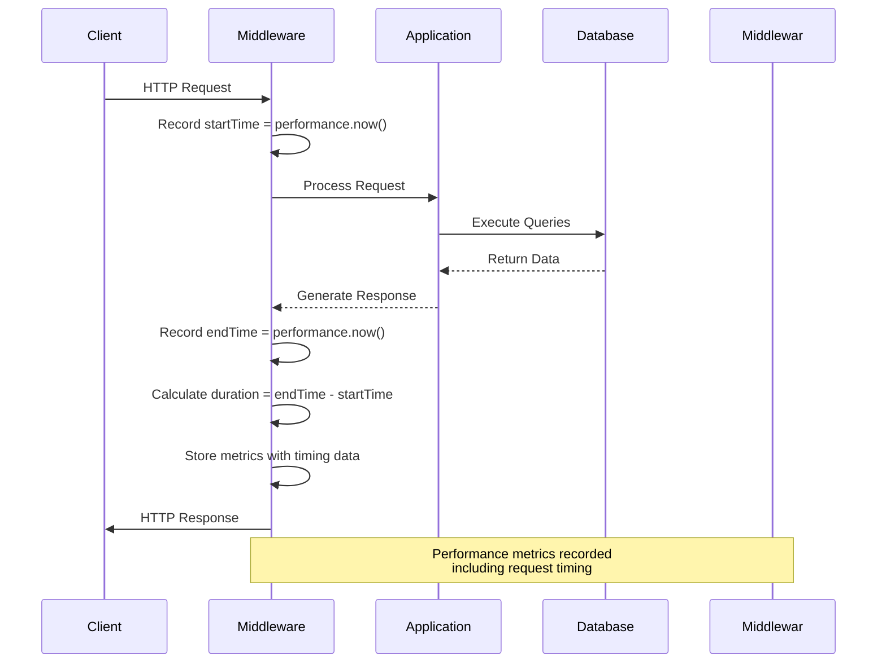
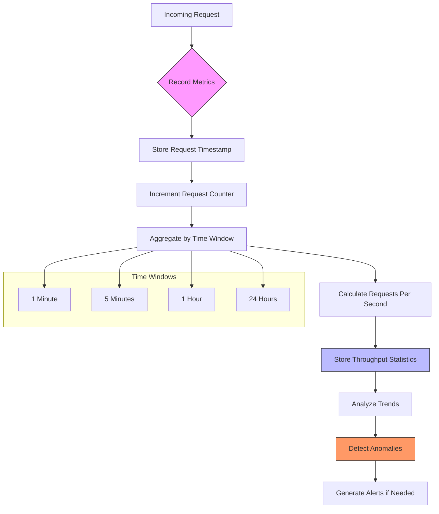
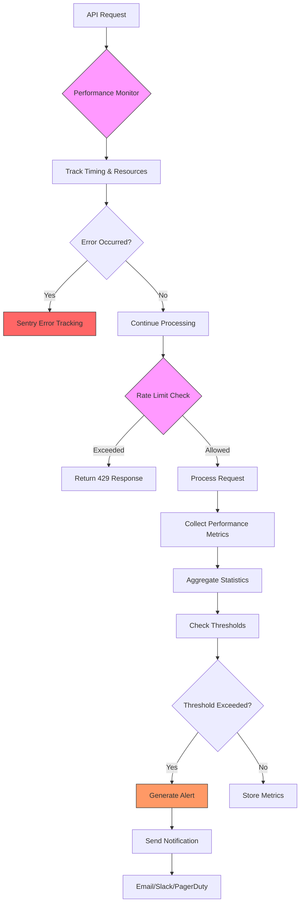
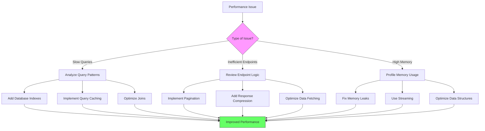

# Performance Monitoring

<cite>
**Referenced Files in This Document**   
- [performance-middleware.ts](file://apps/api/src/middleware/performance-middleware.ts)
- [metrics.ts](file://apps/api/src/routes/metrics.ts)
- [monitoring-config.ts](file://config/vercel/monitoring-config.ts)
- [performance-dashboard.ts](file://apps/api/src/routes/performance-dashboard.ts)
</cite>

## Table of Contents
1. [Introduction](#introduction)
2. [Performance Monitoring Architecture](#performance-monitoring-architecture)
3. [Core Components and Implementation](#core-components-and-implementation)
4. [Request Timing and Response Latency Tracking](#request-timing-and-response-latency-tracking)
5. [Throughput Measurement and Aggregation](#throughput-measurement-and-aggregation)
6. [Metrics Exposure and Visualization](#metrics-exposure-and-visualization)
7. [Integration with Error Tracking and Rate Limiting](#integration-with-error-tracking-and-rate-limiting)
8. [Common Performance Issues and Solutions](#common-performance-issues-and-solutions)
9. [Configuration and Threshold Management](#configuration-and-threshold-management)
10. [Conclusion](#conclusion)

## Introduction

The neonpro platform implements a comprehensive performance monitoring system designed to track, analyze, and optimize API performance across the healthcare application ecosystem. This documentation details the implementation of request timing, response latency tracking, and throughput measurement across the API layer. The system captures critical performance metrics at multiple levels, from individual request processing to system-wide performance trends, enabling proactive identification and resolution of performance bottlenecks.

The monitoring infrastructure is tightly integrated with middleware components that collect performance data and feed it into a centralized metrics collection system. This allows for real-time visibility into application health, historical trend analysis, and automated alerting when performance thresholds are exceeded. The system is specifically designed to meet healthcare compliance requirements while providing deep technical insights for developers and operations teams.

**Section sources**
- [performance-middleware.ts](file://apps/api/src/middleware/performance-middleware.ts#L1-L50)
- [monitoring-config.ts](file://config/vercel/monitoring-config.ts#L1-L50)

## Performance Monitoring Architecture

The performance monitoring architecture in the neonpro platform follows a layered approach with multiple components working together to capture, process, and expose performance metrics. At the core of this architecture is the `PerformanceMonitor` class, which serves as the central component for collecting and managing performance data across API requests.

The architecture consists of several key layers:
- **Collection Layer**: Middleware components that intercept HTTP requests and responses to gather timing, size, and resource usage data
- **Processing Layer**: Services that aggregate raw metrics into meaningful statistics and detect performance anomalies
- **Storage Layer**: In-memory data structures and external databases that persist metrics for analysis
- **Exposure Layer**: API endpoints that provide access to performance data for visualization and alerting
- **Alerting Layer**: Systems that monitor metrics against defined thresholds and trigger notifications when issues are detected

This multi-layered approach ensures that performance data is captured efficiently without significantly impacting request processing time, while still providing comprehensive insights into system behavior.



**Diagram sources**
- [performance-middleware.ts](file://apps/api/src/middleware/performance-middleware.ts#L38-L403)
- [metrics.ts](file://apps/api/src/routes/metrics.ts#L1-L235)

**Section sources**
- [performance-middleware.ts](file://apps/api/src/middleware/performance-middleware.ts#L1-L50)
- [metrics.ts](file://apps/api/src/routes/metrics.ts#L1-L50)

## Core Components and Implementation

The performance monitoring system is built around several core components that work together to provide comprehensive performance insights. The primary component is the `PerformanceMonitor` class, which manages the lifecycle of performance metrics collection and analysis.

The `PerformanceMonitor` class maintains an in-memory map of performance metrics, with each entry containing detailed information about a specific request including start time, end time, duration, memory usage, response size, and status code. The class provides methods for recording metrics, checking performance thresholds, and retrieving aggregated statistics.

Key implementation details include:
- Request ID generation for tracking individual requests through the system
- Response size tracking by overriding the Express `res.send` method
- Memory usage monitoring using Node.js `process.memoryUsage()`
- Periodic cleanup of old metrics to prevent memory leaks
- Statistical analysis of collected metrics to identify trends and anomalies

The system also includes specialized middleware for database query tracking, response compression, caching, rate limiting, and performance optimization headers, all of which contribute to the overall performance monitoring capabilities.



**Diagram sources**
- [performance-middleware.ts](file://apps/api/src/middleware/performance-middleware.ts#L38-L403)

**Section sources**
- [performance-middleware.ts](file://apps/api/src/middleware/performance-middleware.ts#L38-L403)

## Request Timing and Response Latency Tracking

The performance monitoring system captures detailed timing information for each API request to measure response latency and identify slow operations. Timing data is collected using the high-resolution `performance.now()` function, which provides sub-millisecond accuracy for precise measurements.

When a request enters the system, the performance middleware records the start time using `performance.now()`. As the request progresses through the application, various metrics are collected, including database query counts and response size. When the response is completed, the middleware captures the end time and calculates the total duration of the request.

The system tracks several key timing metrics:
- **Start Time**: When the request was received by the server
- **End Time**: When the response was fully sent to the client
- **Duration**: Total processing time (end time - start time)
- **Database Query Count**: Number of database operations performed during the request
- **Memory Usage**: Heap usage before and after request processing

These timing metrics are stored in the `PerformanceMetrics` interface and used to calculate response latency. The system automatically checks these metrics against configurable thresholds and logs warnings when response times exceed acceptable limits.



**Diagram sources**
- [performance-middleware.ts](file://apps/api/src/middleware/performance-middleware.ts#L100-L150)

**Section sources**
- [performance-middleware.ts](file://apps/api/src/middleware/performance-middleware.ts#L100-L150)

## Throughput Measurement and Aggregation

The performance monitoring system measures throughput by tracking the volume of requests processed by the API over time. Throughput is calculated based on the number of requests received within specific time intervals, allowing for analysis of system capacity and load patterns.

The system collects throughput data at multiple levels:
- **Individual Request Level**: Each request is assigned a timestamp and included in throughput calculations
- **Time-Based Aggregation**: Metrics are grouped by time windows (e.g., per minute, per hour) to calculate requests per second/minute
- **Endpoint-Specific Throughput**: Requests are categorized by URL to measure throughput for specific API endpoints
- **Method-Specific Throughput**: Requests are categorized by HTTP method (GET, POST, etc.) to understand usage patterns

The `getStatistics()` method in the `PerformanceMonitor` class calculates key throughput metrics, including total requests processed and requests per second. These statistics are derived from the complete set of recorded performance metrics and provide insights into system utilization and capacity planning.

Throughput data is also used to detect anomalies such as sudden traffic spikes or unexpected drops in request volume, which could indicate issues with client applications or potential security incidents.



**Diagram sources**
- [performance-middleware.ts](file://apps/api/src/middleware/performance-middleware.ts#L350-L380)

**Section sources**
- [performance-middleware.ts](file://apps/api/src/middleware/performance-middleware.ts#L350-L380)

## Metrics Exposure and Visualization

The performance monitoring system exposes collected metrics through dedicated API endpoints that enable visualization and integration with external monitoring tools. The primary endpoint for accessing performance data is implemented in the `metrics.ts` route file, which provides structured access to various types of performance metrics.

The system exposes metrics through several endpoints:
- **/web-vitals**: Collects and retrieves Core Web Vitals from client-side monitoring
- **/server**: Collects and retrieves server-side performance metrics
- **/dashboard**: Provides aggregated performance data for dashboard visualization
- **/realtime**: Provides recent metrics for real-time monitoring displays

The `/dashboard` endpoint returns a comprehensive JSON object containing averaged metrics, percentiles, and summary statistics. This data is used to power performance dashboards that visualize key indicators such as response times, error rates, and system health. The dashboard data includes 24-hour averages for Core Web Vitals like Largest Contentful Paint (LCP), First Input Delay (FID), and Cumulative Layout Shift (CLS).

For real-time monitoring, the `/realtime` endpoint provides metrics from the last five minutes, enabling near-instant visibility into current system performance. This is particularly useful for detecting and responding to performance issues as they occur.

```mermaid
graph TB
A[Metrics Collection] --> B[In-Memory Storage]
B --> C{API Endpoints}
C --> D[/web-vitals]
C --> E[/server]
C --> F[/dashboard]
C --> G[/realtime]
D --> H[Client-Side Metrics]
E --> I[Server-Side Metrics]
F --> J[Aggregated Dashboard Data]
G --> K[Real-Time Metrics]
J --> L[Performance Dashboard]
K --> M[Real-Time Monitoring]
H --> N[User Experience Analysis]
I --> O[System Performance Analysis]
style C fill:#f9f,stroke:#333
style F fill:#f96,stroke:#333
style G fill:#f96,stroke:#333
```

**Diagram sources**
- [metrics.ts](file://apps/api/src/routes/metrics.ts#L1-L235)

**Section sources**
- [metrics.ts](file://apps/api/src/routes/metrics.ts#L1-L235)

## Integration with Error Tracking and Rate Limiting

The performance monitoring system is tightly integrated with other observability components, particularly error tracking and rate limiting middleware. This integration enables a comprehensive view of system health by correlating performance metrics with error rates and traffic patterns.

The system integrates with Sentry for error tracking, configured through the `monitoring-config.ts` file. This configuration includes sample rates for transaction tracing, session replays, and performance profiling. When errors occur, the system captures performance context such as response time, memory usage, and request details, providing valuable insights for debugging.

Rate limiting middleware works in conjunction with performance monitoring to protect the system from excessive traffic that could degrade performance. The `rateLimitMiddleware` in the performance monitoring system tracks request counts and enforces limits based on IP address or custom key generators. When rate limits are exceeded, the system returns appropriate HTTP 429 responses and logs the event for analysis.

The integration between these systems allows for sophisticated alerting rules that consider both performance and error metrics. For example, alerts can be triggered when both error rates exceed 5% and response times exceed 3 seconds for more than 10 minutes, indicating a serious performance degradation.



**Diagram sources**
- [performance-middleware.ts](file://apps/api/src/middleware/performance-middleware.ts#L250-L300)
- [monitoring-config.ts](file://config/vercel/monitoring-config.ts#L1-L481)

**Section sources**
- [performance-middleware.ts](file://apps/api/src/middleware/performance-middleware.ts#L250-L300)
- [monitoring-config.ts](file://config/vercel/monitoring-config.ts#L1-L481)

## Common Performance Issues and Solutions

The performance monitoring system is designed to help identify and resolve common performance issues in the neonpro platform. By analyzing the collected metrics, developers and operations teams can diagnose problems and implement effective solutions.

### Slow Database Queries

Slow database queries are one of the most common performance bottlenecks. The system tracks database query counts per request but currently lacks detailed timing for individual queries. To address slow queries:

1. Implement query-level timing in database services
2. Add indexes to frequently queried fields
3. Optimize complex joins and subqueries
4. Implement caching for frequently accessed data
5. Use database query analyzers to identify inefficient queries

The performance monitoring system can detect when requests have high database query counts, which often correlates with slow performance.

### Inefficient API Endpoints

Inefficient API endpoints can cause high response times and resource consumption. The system identifies these through:

- High response duration (exceeding warning/critical thresholds)
- Large response sizes (exceeding 10MB threshold)
- High memory usage during processing

Solutions include:
- Implementing pagination for large datasets
- Optimizing data serialization
- Adding response compression
- Implementing efficient caching strategies
- Reducing unnecessary data fetching

### High Memory Usage

The system monitors memory usage through `process.memoryUsage()` and alerts when heap usage exceeds 500MB. High memory usage can be caused by:

- Memory leaks in long-running processes
- Loading large datasets into memory
- Inefficient data structures
- Lack of proper cleanup in event listeners

Solutions include:
- Implementing proper garbage collection
- Using streaming for large data processing
- Optimizing data structures
- Regularly monitoring memory usage patterns



**Diagram sources**
- [performance-middleware.ts](file://apps/api/src/middleware/performance-middleware.ts#L300-L350)

**Section sources**
- [performance-middleware.ts](file://apps/api/src/middleware/performance-middleware.ts#L300-L350)

## Configuration and Threshold Management

Performance monitoring in the neonpro platform is highly configurable through environment variables and configuration files. The primary configuration is managed in the `monitoring-config.ts` file, which defines settings for various monitoring components including Sentry, APM, logging, RUM, synthetic monitoring, and alerting.

Key configuration options include:
- **Sampling Rates**: Control the percentage of transactions, sessions, and profiles that are captured
- **Performance Thresholds**: Define warning and critical levels for response times, error rates, and resource usage
- **Alerting Channels**: Configure notification destinations for different severity levels
- **Data Retention**: Set policies for how long metrics are stored
- **Compliance Settings**: Enable specific monitoring features required for healthcare regulations

The system uses sensible defaults but allows customization through environment variables. For example, `SENTRY_TRACES_SAMPLE_RATE` controls the percentage of transactions sent to Sentry, while `APM_SAMPLE_RATE` controls the sampling rate for application performance monitoring.

Performance thresholds are configurable both globally and per-service. The default thresholds in the `PerformanceMonitor` class are:
- Warning threshold: 1,000ms (1 second)
- Critical threshold: 5,000ms (5 seconds)
- Maximum memory usage: 500MB
- Maximum response size: 10MB

These thresholds can be overridden when creating a `PerformanceMonitor` instance, allowing different services to have tailored performance expectations based on their specific requirements.

**Section sources**
- [monitoring-config.ts](file://config/vercel/monitoring-config.ts#L1-L481)
- [performance-middleware.ts](file://apps/api/src/middleware/performance-middleware.ts#L50-L100)

## Conclusion

The performance monitoring system in the neonpro platform provides comprehensive visibility into API performance, enabling proactive identification and resolution of issues that could impact user experience and system reliability. By implementing detailed request timing, response latency tracking, and throughput measurement, the system captures critical performance metrics at every level of the application stack.

The integration of middleware components with centralized metrics infrastructure creates a cohesive monitoring solution that not only collects data but also analyzes it for trends, anomalies, and compliance with defined thresholds. The system's ability to expose metrics through standardized APIs enables rich visualization and integration with external monitoring tools.

For developers, the system provides valuable insights into application behavior, helping to identify and resolve performance bottleneits. For operations teams, the alerting capabilities ensure that issues are detected and addressed promptly. And for compliance officers, the detailed audit trails and monitoring coverage help demonstrate adherence to healthcare regulations.

By leveraging the full capabilities of this performance monitoring system, the neonpro platform can maintain high levels of performance, reliability, and compliance in its healthcare applications.