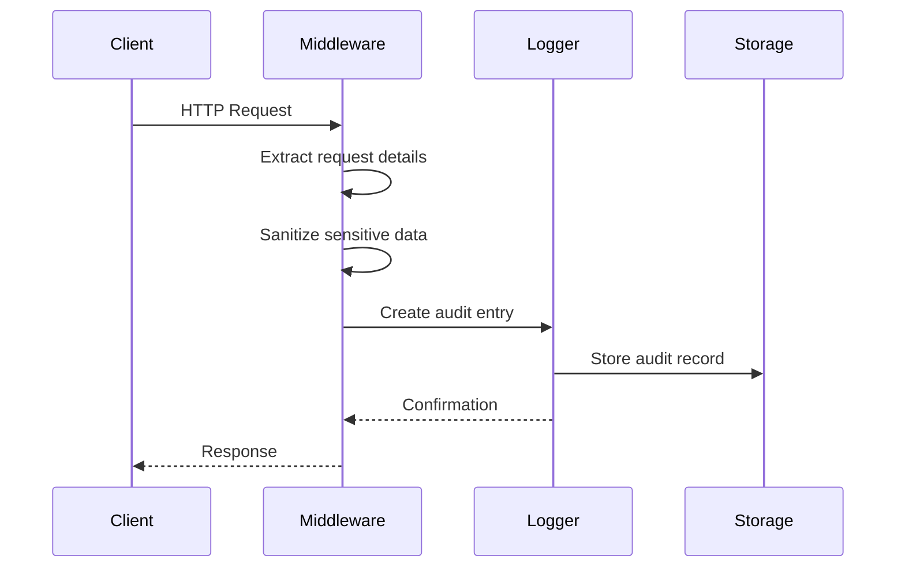
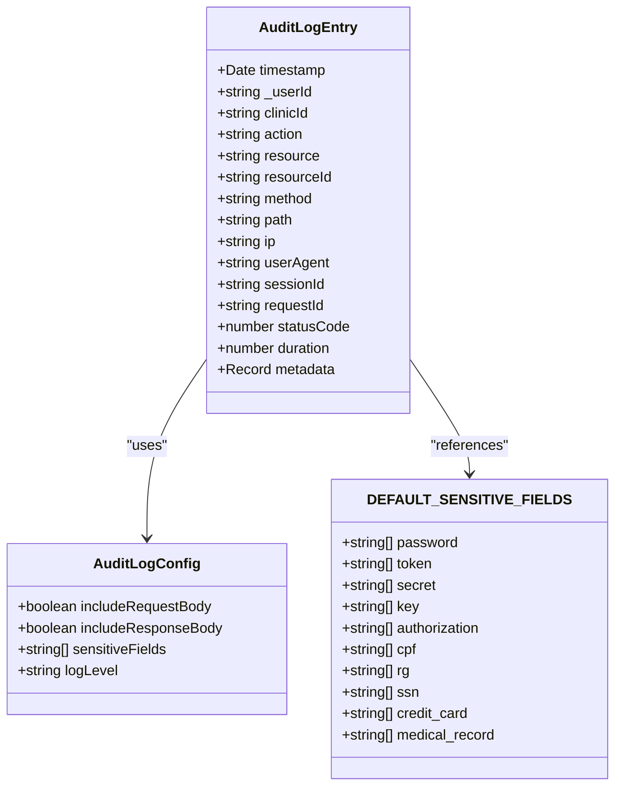
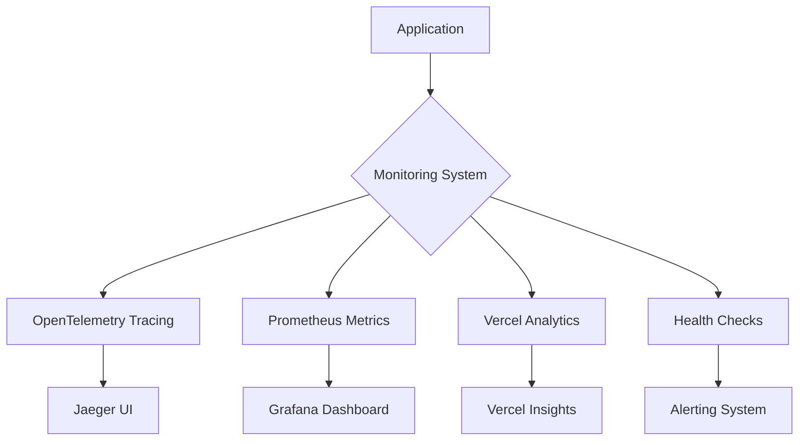
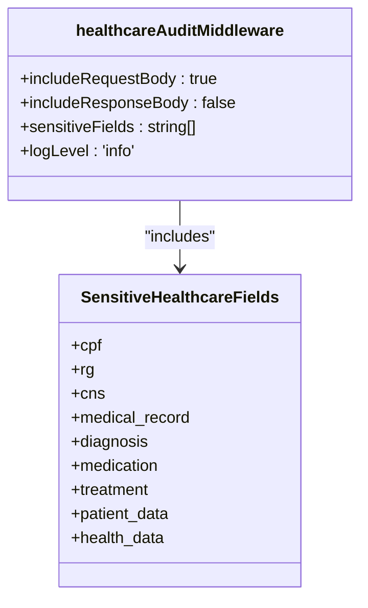
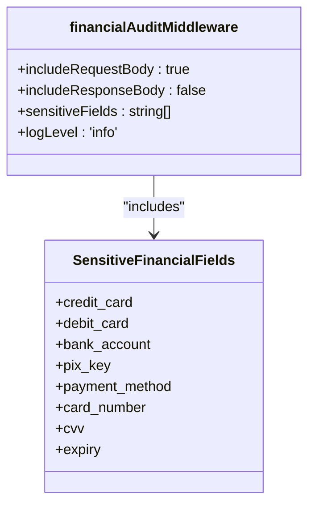
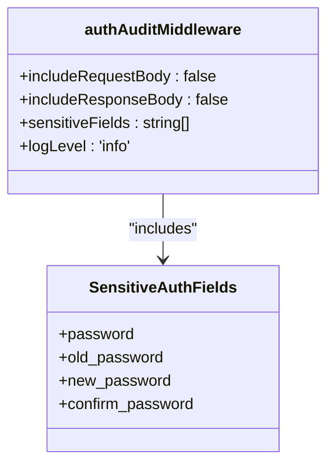
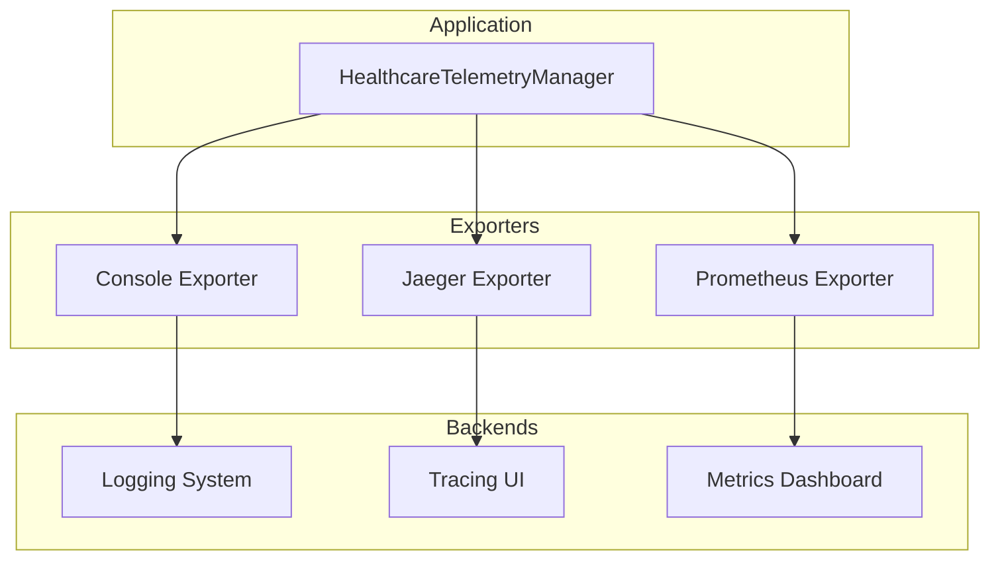
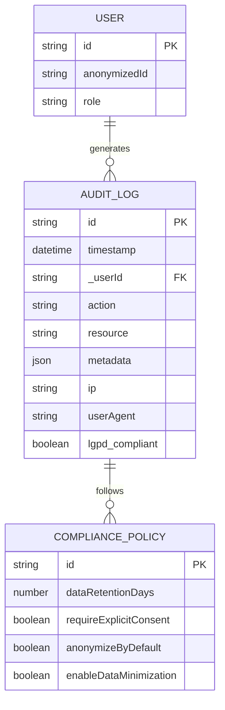

# Audit Logging & Monitoring

<cite>
**Referenced Files in This Document **
- [audit-log.ts](file://apps/api/src/middleware/audit-log.ts)
- [opentelemetry-config.ts](file://packages/shared/src/telemetry/opentelemetry-config.ts)
- [init.ts](file://packages/monitoring/src/init.ts)
</cite>

## Table of Contents

1. [Introduction](#introduction)
2. [Audit Log Implementation](#audit-log-implementation)
3. [Structured Logging Formats](#structured-logging-formats)
4. [Real-time Monitoring Capabilities](#real-time-monitoring-capabilities)
5. [Domain Models for Audit Events](#domain-models-for-audit-events)
6. [Integration with Observability Systems](#integration-with-observability-systems)
7. [Compliance and Regulatory Requirements](#compliance-and-regulatory-requirements)
8. [Common Issues and Solutions](#common-issues-and-solutions)
9. [Conclusion](#conclusion)

## Introduction

The neonpro platform implements a comprehensive audit logging and monitoring infrastructure designed to ensure data integrity, regulatory compliance, and operational visibility across clinical, financial, and administrative workflows. The system captures immutable audit trails for all critical operations while providing real-time monitoring capabilities through integrated observability tools.

## Audit Log Implementation

The audit logging system is implemented as middleware that intercepts requests and generates audit entries for significant operations. The core implementation provides automatic event capture for CRUD operations on patient data, appointments, and financial transactions.

**Diagram sources **

- [audit-log.ts](file://apps/api/src/middleware/audit-log.ts#L0-L330)

**Section sources**

- [audit-log.ts](file://apps/api/src/middleware/audit-log.ts#L0-L330)

## Structured Logging Formats

The platform uses structured JSON logging with consistent field naming and data types. Each log entry contains contextual information including timestamps, user identifiers, IP addresses, and request metadata. Sensitive fields are automatically redacted based on configurable patterns.

**Diagram sources **

- [audit-log.ts](file://apps/api/src/middleware/audit-log.ts#L6-L22)

**Section sources**

- [audit-log.ts](file://apps/api/src/middleware/audit-log.ts#L6-L22)

## Real-time Monitoring Capabilities

The monitoring infrastructure provides real-time visibility into system performance, error rates, and security events. It integrates with OpenTelemetry for distributed tracing, Prometheus for metrics collection, and Vercel analytics for frontend performance monitoring.

**Diagram sources **

- [init.ts](file://packages/monitoring/src/init.ts#L0-L101)

**Section sources**

- [init.ts](file://packages/monitoring/src/init.ts#L0-L101)

## Domain Models for Audit Events

The system defines specific audit middleware configurations for different domains, each with appropriate sensitivity settings and logging requirements. These domain-specific implementations ensure compliance with relevant regulations while capturing necessary operational context.

### Healthcare Audit Model

**Diagram sources **

- [audit-log.ts](file://apps/api/src/middleware/audit-log.ts#L265-L283)

### Financial Audit Model

**Diagram sources **

- [audit-log.ts](file://apps/api/src/middleware/audit-log.ts#L288-L305)

### Authentication Audit Model

**Diagram sources **

- [audit-log.ts](file://apps/api/src/middleware/audit-log.ts#L310-L323)

## Integration with Observability Systems

The platform integrates with multiple observability systems to provide comprehensive monitoring and analysis capabilities. OpenTelemetry serves as the primary instrumentation framework, exporting traces and metrics to various backends.

**Diagram sources **

- [opentelemetry-config.ts](file://packages/shared/src/telemetry/opentelemetry-config.ts#L0-L363)

**Section sources**

- [opentelemetry-config.ts](file://packages/shared/src/telemetry/opentelemetry-config.ts#L0-L363)

## Compliance and Regulatory Requirements

The audit logging system is designed to meet strict regulatory requirements, particularly Brazil's LGPD (Lei Geral de Proteção de Dados). The configuration includes data retention policies, anonymization settings, and explicit consent requirements.

**Section sources**

- [opentelemetry-config.ts](file://packages/shared/src/telemetry/opentelemetry-config.ts#L346-L393)

## Common Issues and Solutions

### Log Volume Management

High-volume operations can generate excessive log data. The system addresses this through sampling strategies and tiered logging levels, allowing detailed logging for critical operations while minimizing overhead for routine activities.

### Audit Integrity

To ensure audit trail integrity, the system implements write-once storage for audit records and cryptographic hashing to detect tampering. Each audit entry is timestamped and linked to the originating session and request.

### Regulatory Retention

The platform enforces configurable retention periods aligned with regulatory requirements. Automated purging removes records beyond their required retention period while maintaining chain-of-custody documentation for compliance audits.

**Section sources**

- [opentelemetry-config.ts](file://packages/shared/src/telemetry/opentelemetry-config.ts#L346-L393)

## Conclusion

The neonpro platform's audit logging and monitoring infrastructure provides a robust foundation for ensuring data security, regulatory compliance, and operational excellence. By implementing domain-specific audit policies, structured logging formats, and comprehensive observability integrations, the system enables both automated compliance and proactive issue detection across clinical, financial, and administrative workflows.
