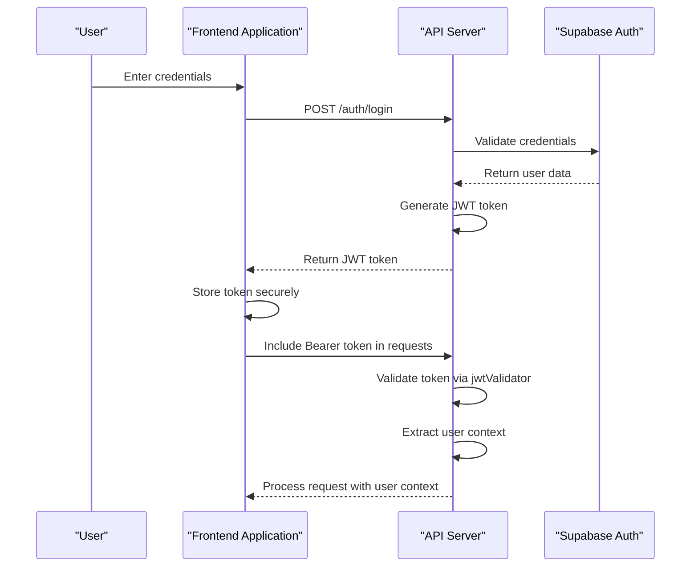
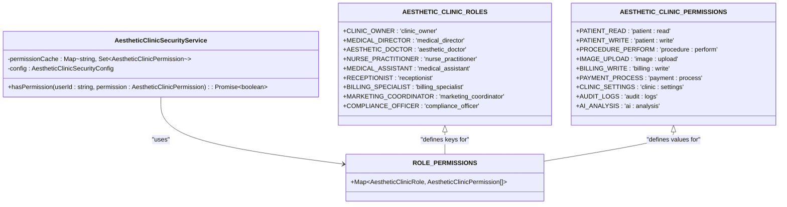
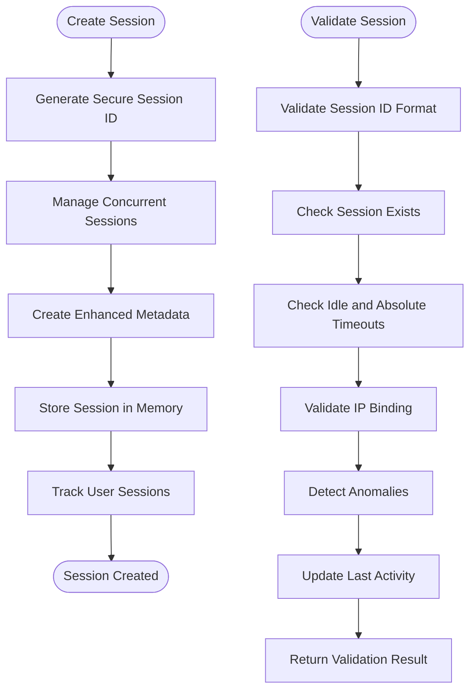
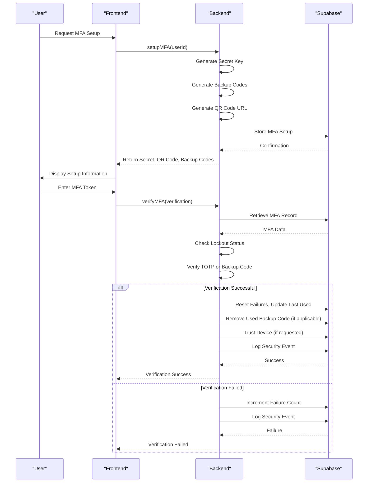
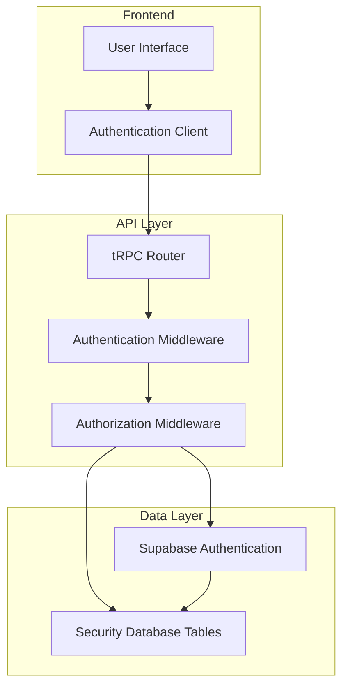
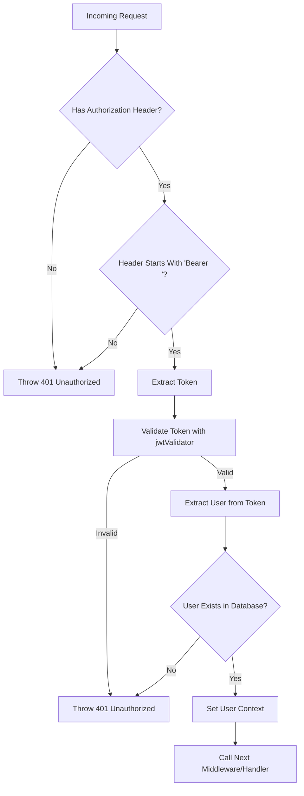

# Authentication & Authorization

<cite>
**Referenced Files in This Document**   
- [aesthetic-clinic-security-service.ts](file://apps/api/src/security/aesthetic-clinic-security-service.ts)
- [authn.ts](file://apps/api/src/middleware/authn.ts)
- [enhanced-session-manager.ts](file://apps/api/src/security/enhanced-session-manager.ts)
</cite>

## Table of Contents
1. [Introduction](#introduction)
2. [Authentication Flow](#authentication-flow)
3. [Role-Based Access Control (RBAC)](#role-based-access-control-rbac)
4. [Session Management](#session-management)
5. [Multi-Factor Authentication (MFA)](#multi-factor-authentication-mfa)
6. [Security Integration with Supabase and tRPC](#security-integration-with-supabase-and-trpc)
7. [Token Validation and Protected Routes](#token-validation-and-protected-routes)
8. [Common Security Issues and Mitigations](#common-security-issues-and-mitigations)
9. [Conclusion](#conclusion)

## Introduction
The neonpro platform implements a comprehensive authentication and authorization system designed specifically for aesthetic clinic operations. The security architecture combines JWT-based authentication, role-based access control (RBAC), enhanced session management, and multi-factor authentication (MFA) to ensure compliance with Brazilian healthcare regulations including LGPD, ANVISA, and CFM. This document details the implementation of these security features, their integration points, and best practices for secure access to clinic data and operations.

The system is built on a layered security approach that includes medical image protection, financial transaction security, real-time monitoring, and comprehensive audit trails. All components work together to provide granular access control while maintaining usability for healthcare professionals across different roles.

## Authentication Flow
The authentication flow in the neonpro platform follows a JWT-based approach integrated with Supabase authentication. When a user attempts to log in, the system validates credentials through Supabase and generates a JWT token containing user information such as ID, email, role, clinic ID, and name. This token is then used for subsequent requests to authenticate the user.

The authentication process begins with the `authenticationMiddleware` function, which checks for a valid Bearer token in the Authorization header of incoming requests. If present, the token is validated using the comprehensive security validator implemented in `jwt-validator`. Upon successful validation, user information is extracted from the token payload and stored in the request context for downstream handlers.

For users requiring additional verification, the system supports optional authentication flows that can escalate to require MFA based on risk assessment. The authentication flow also includes development/testing support for test tokens with predefined user data, allowing for easier testing while maintaining security in production environments.

**Diagram sources**
- [authn.ts](file://apps/api/src/middleware/authn.ts#L29-L111)
- [aesthetic-clinic-security-service.ts](file://apps/api/src/security/aesthetic-clinic-security-service.ts#L389-L433)

**Section sources**
- [authn.ts](file://apps/api/src/middleware/authn.ts#L29-L111)
- [aesthetic-clinic-security-service.ts](file://apps/api/src/security/aesthetic-clinic-security-service.ts#L389-L433)

## Role-Based Access Control (RBAC)
The RBAC system in the neonpro platform provides granular permission management for different roles within an aesthetic clinic. The system defines nine distinct roles with specific permissions tailored to their responsibilities:

- Clinic Owner
- Medical Director
- Aesthetic Doctor
- Nurse Practitioner
- Medical Assistant
- Receptionist
- Billing Specialist
- Marketing Coordinator
- Compliance Officer

Each role has a defined set of permissions that control access to patient data, medical procedures, financial operations, and clinic management functions. The system implements a hierarchical permission model where higher-level roles inherit permissions from lower-level roles. For example, an Aesthetic Doctor inherits permissions from both Nurse Practitioners and Medical Assistants.

Permissions are categorized into several domains:
- Patient Management (read, write, delete, medical records)
- Aesthetic Procedures (read, perform, schedule, cancel)
- Medical Images (upload, view, download, delete, watermark)
- Financial Operations (read, write, process payments, refunds, reports)
- Clinic Management (settings, staff management, appointments, inventory)
- Compliance & Security (monitoring, audit logs, security settings, data export)
- AI Features (analysis, recommendations)

The `hasPermission` method in the `AestheticClinicSecurityService` class checks whether a user has a specific permission by first checking the cache, then retrieving the user's roles from the database, collecting all permissions associated with those roles, and applying hierarchical inheritance if enabled. Permission checks are cached for performance optimization and automatically cleared after the session timeout period.

**Diagram sources**
- [aesthetic-clinic-security-service.ts](file://apps/api/src/security/aesthetic-clinic-security-service.ts#L551-L600)
- [aesthetic-clinic-security-service.ts](file://apps/api/src/security/aesthetic-clinic-security-service.ts#L147-L198)

**Section sources**
- [aesthetic-clinic-security-service.ts](file://apps/api/src/security/aesthetic-clinic-security-service.ts#L551-L600)
- [aesthetic-clinic-security-service.ts](file://apps/api/src/security/aesthetic-clinic-security-service.ts#L147-L198)

## Session Management
The enhanced session management system provides robust security features including IP binding, session fixation protection, concurrent session limits, timeout controls, and anomaly detection. The `EnhancedSessionManager` class manages sessions with cryptographic security measures to prevent session hijacking and other attacks.

Sessions are identified by cryptographically secure 32-character hexadecimal IDs generated with 128 bits of entropy. Each session includes metadata such as creation time, last activity timestamp, IP address, user agent, device fingerprint, security level, risk score, and timeout tracking. The system implements both idle timeout (30 minutes by default) and absolute timeout (8 hours by default) to automatically expire inactive or long-lived sessions.

IP binding ensures that sessions remain tied to the originating IP address, with special handling for mobile networks that may change subnets. The system tracks IP changes and can require re-authentication if excessive changes occur within a short period. Concurrent session limits restrict users to three simultaneous sessions by default, automatically removing the oldest session when the limit is exceeded.

Anomaly detection monitors for suspicious patterns such as rapid IP changes, user agent changes, or multiple consecutive authentication failures. Based on detected anomalies, the system can take actions ranging from warnings to requiring MFA verification or blocking access entirely.

**Diagram sources**
- [enhanced-session-manager.ts](file://apps/api/src/security/enhanced-session-manager.ts#L92-L797)
- [enhanced-session-manager.ts](file://apps/api/src/security/enhanced-session-manager.ts#L392-L434)

**Section sources**
- [enhanced-session-manager.ts](file://apps/api/src/security/enhanced-session-manager.ts#L92-L797)
- [enhanced-session-manager.ts](file://apps/api/src/security/enhanced-session-manager.ts#L392-L434)

## Multi-Factor Authentication (MFA)
The MFA system in the neonpro platform provides an additional layer of security for sensitive operations and high-risk roles. The `AestheticClinicSecurityService` implements TOTP (Time-Based One-Time Password) authentication with backup codes and device trust functionality.

MFA is required by default for Aesthetic Doctors and Medical Directors, though this can be configured. When setting up MFA, the system generates a random 20-byte secret key and 10 backup codes, each 4 bytes encoded as hexadecimal. A QR code URL is generated for easy setup with authenticator apps, following the otpauth protocol specification.

During verification, the system checks both TOTP tokens and backup codes. Users are locked out for 15 minutes after three failed attempts to prevent brute force attacks. Successful verification resets the failure counter and updates the last used timestamp. Users can choose to trust their current device, which creates a trusted device record valid for 30 days.

The MFA implementation includes comprehensive logging of all setup and verification attempts, with different severity levels for successful verifications (low), failed attempts (high), and errors (high). Security events are recorded in the audit trail for compliance purposes.

**Diagram sources**
- [aesthetic-clinic-security-service.ts](file://apps/api/src/security/aesthetic-clinic-security-service.ts#L389-L433)
- [aesthetic-clinic-security-service.ts](file://apps/api/src/security/aesthetic-clinic-security-service.ts#L438-L546)

**Section sources**
- [aesthetic-clinic-security-service.ts](file://apps/api/src/security/aesthetic-clinic-security-service.ts#L389-L433)
- [aesthetic-clinic-security-service.ts](file://apps/api/src/security/aesthetic-clinic-security-service.ts#L438-L546)

## Security Integration with Supabase and tRPC
The authentication system integrates seamlessly with Supabase for user management and authentication, while leveraging tRPC for type-safe API endpoints with built-in middleware chaining. The integration creates a robust security framework that combines external identity management with internal permission enforcement.

Supabase serves as the primary identity provider, handling user registration, login, and password management. The neonpro platform extends this foundation with custom security features by storing additional MFA configuration, trusted devices, and role assignments in Supabase tables. The `user_mfa`, `trusted_devices`, and `user_roles` tables maintain the extended security state beyond what Supabase provides natively.

The tRPC middleware chain applies security layers in a specific order: authentication first, followed by authorization, and finally route-specific logic. The `requireAuth` function combines authentication and authorization middleware, ensuring that only authenticated users with appropriate roles can access protected endpoints. This middleware composition allows for flexible security policies across different API routes.

Integration with frontend components occurs through standardized authentication flows that handle token storage, refresh mechanisms, and error handling for expired or invalid tokens. The system supports both mandatory and optional authentication, allowing public routes to still benefit from user context when available.

**Diagram sources**
- [authn.ts](file://apps/api/src/middleware/authn.ts#L242-L255)
- [aesthetic-clinic-security-service.ts](file://apps/api/src/security/aesthetic-clinic-security-service.ts#L279-L1138)

**Section sources**
- [authn.ts](file://apps/api/src/middleware/authn.ts#L242-L255)
- [aesthetic-clinic-security-service.ts](file://apps/api/src/security/aesthetic-clinic-security-service.ts#L279-L1138)

## Token Validation and Protected Routes
Token validation is a critical component of the authentication system, ensuring that only valid and unexpired tokens grant access to protected resources. The validation process occurs in the `authenticationMiddleware` function, which extracts the JWT token from the Authorization header and passes it to the `jwtValidator` for comprehensive validation.

The validation process checks multiple aspects of the token:
- Proper format and presence in the Authorization header
- Valid JWT structure and signature
- Unexpired token (based on the exp claim)
- Correct audience and issuer
- Valid user data against the database

Once validated, the user information is extracted from the token payload and stored in the request context under keys such as 'user', 'userId', and 'clinicId'. This context is then available to all downstream handlers and middleware.

Protected routes use the `requireAuth` middleware with optional role specifications to enforce access control. For example, a route that requires clinic owner privileges would use `requireAuth([AESTHETIC_CLINIC_ROLES.CLINIC_OWNER])`. Routes that need to check specific permissions rather than just roles can call the `hasPermission` method directly.

The system also implements optional authentication through the `optionalAuth` middleware, which attempts to authenticate users but does not fail if no valid token is provided. This is useful for routes that provide enhanced functionality to authenticated users but remain accessible to guests.

**Diagram sources**
- [authn.ts](file://apps/api/src/middleware/authn.ts#L29-L111)
- [authn.ts](file://apps/api/src/middleware/authn.ts#L116-L149)

**Section sources**
- [authn.ts](file://apps/api/src/middleware/authn.ts#L29-L111)
- [authn.ts](file://apps/api/src/middleware/authn.ts#L116-L149)

## Common Security Issues and Mitigations
The neonpro platform addresses several common security issues through proactive design and implementation choices. These mitigations protect against token expiration, session hijacking, and improper cookie configuration while ensuring compliance with healthcare regulations.

Token expiration is handled through a combination of short-lived access tokens and automatic refresh mechanisms. When a token expires, the client application must obtain a new one through re-authentication or refresh token exchange. The system logs all token expiration events for audit purposes and provides clear error messages to guide clients on proper handling.

Session hijacking is prevented through multiple layers of protection:
- Cryptographically secure session IDs with high entropy
- IP binding that detects and responds to IP address changes
- User agent validation that detects browser changes
- Anomaly detection that identifies suspicious patterns
- Automatic session invalidation on logout or timeout

Secure cookie configuration follows industry best practices with HttpOnly, Secure, and SameSite attributes. Cookies are not used for storing sensitive information; instead, they contain only session identifiers that reference server-side session data. The system avoids storing tokens in local storage where they could be vulnerable to XSS attacks.

Additional security measures include:
- Rate limiting to prevent brute force attacks
- Account lockout after multiple failed login attempts
- Comprehensive audit logging of all security-relevant events
- Regular security checks and vulnerability scanning
- Data encryption at rest and in transit
- Regular security training for developers and administrators

The system also implements specific protections for healthcare data, including patient consent verification before accessing medical images, watermarking of sensitive images, and strict access controls based on the principle of least privilege.

**Section sources**
- [enhanced-session-manager.ts](file://apps/api/src/security/enhanced-session-manager.ts#L273-L342)
- [aesthetic-clinic-security-service.ts](file://apps/api/src/security/aesthetic-clinic-security-service.ts#L906-L926)

## Conclusion
The authentication and authorization system in the neonpro platform provides a comprehensive security framework tailored to the needs of aesthetic clinics. By combining JWT-based authentication, role-based access control, enhanced session management, and multi-factor authentication, the system ensures that sensitive healthcare data remains protected while providing appropriate access to authorized personnel.

Key strengths of the implementation include its compliance with Brazilian healthcare regulations, granular permission management, real-time security monitoring, and seamless integration with Supabase and tRPC. The system balances security requirements with usability considerations, allowing healthcare professionals to focus on patient care without unnecessary authentication friction.

Future enhancements could include biometric authentication methods, adaptive authentication based on risk assessment, and more sophisticated anomaly detection using machine learning techniques. However, the current implementation already provides a robust foundation for secure clinic operations.