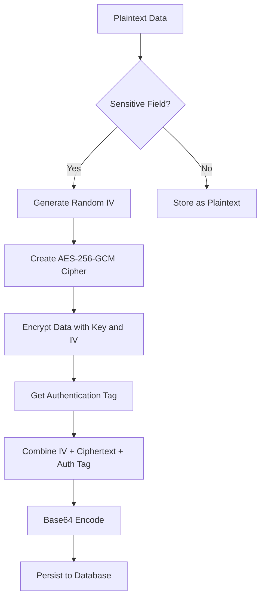
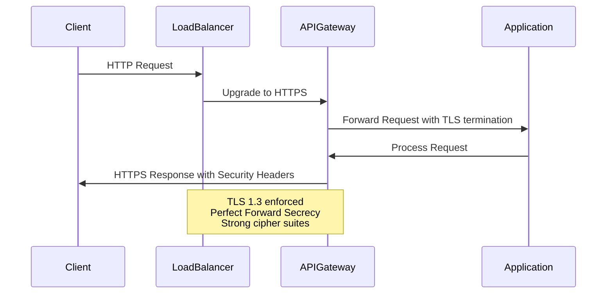
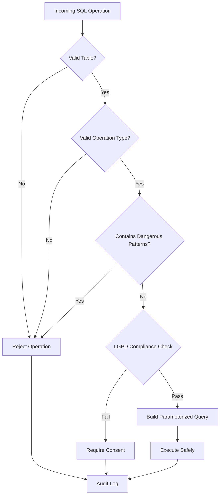
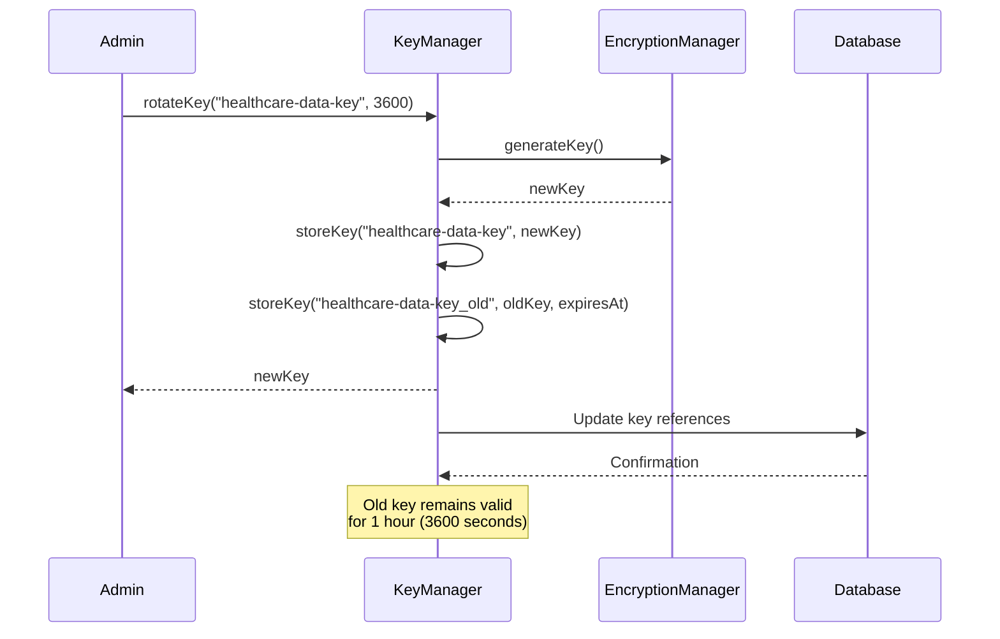
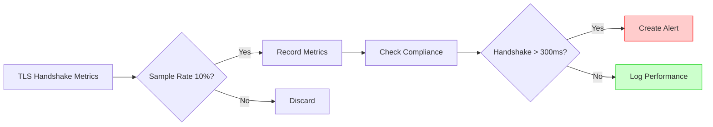

# Data Encryption & Protection

<cite>
**Referenced Files in This Document **
- [DataMaskingService](file://apps/api/src/services/data-masking-service.ts)
- [TLSConfigManager](file://apps/api/src/config/tls-config.ts)
- [KeyManager](file://packages/security/src/encryption.ts)
- [EncryptionManager](file://packages/security/src/encryption.ts)
- [sql-sanitizer.ts](file://apps/api/src/security/sql-sanitizer.ts)
- [rls-policies.ts](file://apps/api/src/security/rls-policies.ts)
- [https-config.ts](file://apps/api/src/config/https-config.ts)
- [https-monitoring-service.ts](file://apps/api/src/services/monitoring/https-monitoring-service.ts)
</cite>

## Table of Contents

1. [Introduction](#introduction)
2. [Field-Level Encryption Implementation](#field-level-encryption-implementation)
3. [Data Masking Strategies](#data-masking-strategies)
4. [Secure Transmission Protocols](#secure-transmission-protocols)
5. [Integration with Supabase RLS Policies](#integration-with-supabase-rls-policies)
6. [SQL Injection Prevention](#sql-injection-prevention)
7. [Key Management System](#key-management-system)
8. [Performance Considerations](#performance-considerations)
9. [Compliance and Audit Logging](#compliance-and-audit-logging)
10. [Troubleshooting Guide](#troubleshooting-guide)

## Introduction

The neonpro platform implements comprehensive data encryption and protection mechanisms to ensure the confidentiality, integrity, and availability of sensitive healthcare data. This document details the implementation of field-level encryption, data masking strategies, secure transmission protocols, and integration with Supabase Row Level Security (RLS) policies. The system is designed to comply with LGPD (Lei Geral de Proteção de Dados) and other healthcare regulations, providing end-to-end protection for personal and medical information across the full stack.

**Section sources**

- [DataMaskingService](file://apps/api/src/services/data-masking-service.ts)
- [TLSConfigManager](file://apps/api/src/config/tls-config.ts)

## Field-Level Encryption Implementation

The platform employs AES-256-GCM encryption for protecting sensitive data at rest. The EncryptionManager class provides methods for encrypting and decrypting data using authenticated encryption, ensuring both confidentiality and integrity. Field-level encryption is applied to sensitive fields such as CPF (Brazilian individual taxpayer registry), medical records, and financial information.

The encryption process generates a random initialization vector (IV) for each operation and includes an authentication tag to detect tampering. Encrypted data is stored in a format that combines the IV, encrypted payload, and authentication tag, all base64-encoded for storage in the database. This approach ensures that even if two identical values are encrypted, their ciphertexts will be different due to the random IV.



**Diagram sources **

- [EncryptionManager](file://packages/security/src/encryption.ts)

**Section sources**

- [EncryptionManager](file://packages/security/src/encryption.ts)

## Data Masking Strategies

The DataMaskingService implements context-aware data masking based on user roles, access purposes, and regulatory requirements. The service applies different masking techniques depending on the sensitivity of the data and the context in which it is accessed.

For list views and exports, the system applies partial masking to personal information such as phone numbers and email addresses, while fully masking highly sensitive data like credit card numbers. Medical data receives special handling, with diagnosis information redacted for non-medical staff. The masking rules are defined with priorities, allowing more specific rules to override general ones.

```mermaid
classDiagram
class DataMaskingService {
+maskData(data, context, customRules)
+getApplicableRules(context)
+applyMaskingRules(data, rules, context, tracking)
+applyMasking(value, rule, context)
+determineConfidentialityLevel(dataCategories, rulesAppliedCount)
+createAuditLogEntry(context, fieldsMasked, rulesApplied)
}
class MaskingRule {
+id : string
+fieldName : string | string[]
+dataCategory : LGPDDataCategory
+maskingType : 'full' | 'partial' | 'hash' | 'tokenize' | 'redact'
+pattern? : RegExp
+replacementPattern? : string
+context : 'list_view' | 'detail_view' | 'export' | 'api_response' | 'audit_log'
+conditions? : { userRole? : string[], purpose? : string[], consentRequired? : boolean }
+priority : number
}
class MaskingContext {
+userId : string
+userRole : string
+purpose : string[]
+patientId? : string
+hasExplicitConsent : boolean
+isEmergencyAccess : boolean
+isHealthcareProfessional : boolean
+viewContext : 'list' | 'detail' | 'export' | 'audit'
+requestScope : 'self' | 'patient' | 'clinic' | 'system'
}
DataMaskingService --> MaskingRule : "applies"
DataMaskingService --> MaskingContext : "uses"
```

**Diagram sources **

- [DataMaskingService](file://apps/api/src/services/data-masking-service.ts)

**Section sources**

- [DataMaskingService](file://apps/api/src/services/data-masking-service.ts)

## Secure Transmission Protocols

The platform enforces TLS 1.3 for all HTTPS connections, ensuring secure transmission of data in transit. The TLSConfigManager singleton manages the TLS configuration, including certificate loading, cipher suite selection, and security options. The system uses only strong cipher suites that provide Perfect Forward Secrecy (PFS), preventing decryption of recorded traffic even if the server's private key is compromised.

The HTTPS configuration includes strict security settings such as disabling older TLS versions (SSLv2, SSLv3, TLSv1.0, TLSv1.1), enforcing cipher order preference on the server side, and using single-use ECDH parameters. Session tickets are rotated regularly to enhance forward secrecy, and Diffie-Hellman parameters are generated with 2048-bit strength.



**Diagram sources **

- [TLSConfigManager](file://apps/api/src/config/tls-config.ts)
- [https-config.ts](file://apps/api/src/config/https-config.ts)

**Section sources**

- [TLSConfigManager](file://apps/api/src/config/tls-config.ts)
- [https-config.ts](file://apps/api/src/config/https-config.ts)

## Integration with Supabase RLS Policies

The platform integrates with Supabase Row Level Security (RLS) policies to enforce fine-grained access control at the database level. The AdvancedRLSPolicies class defines comprehensive security policies for healthcare tables, incorporating role hierarchy, time restrictions, and consent requirements.

Each policy specifies conditions that must be met for access to be granted, such as the user's role, clinic affiliation, and professional-patient relationship. Emergency access is supported for critical situations, bypassing normal time restrictions while maintaining audit trails. The policies are dynamically evaluated based on the current user context, ensuring that users can only access data they are authorized to see.

```mermaid
erDiagram
USER ||--o{ PATIENT : "treats"
USER ||--o{ APPOINTMENT : "schedules"
USER ||--o{ MEDICAL_RECORD : "accesses"
PATIENT ||--o{ MEDICAL_RECORD : "has"
PATIENT ||--o{ APPOINTMENT : "has"
CONSENT ||--o{ PATIENT : "for"
class USER {
id PK
email UK
role
clinic_id FK
}
class PATIENT {
id PK
full_name
cpf UK
date_of_birth
phone
address
clinic_id FK
}
class MEDICAL_RECORD {
id PK
patient_id FK
professional_id FK
diagnosis
treatment
notes
created_at
}
class APPOINTMENT {
id PK
patient_id FK
professional_id FK
appointment_time
status
notes
}
class CONSENT {
id PK
patient_id FK
purpose
status
granted_at
expires_at
}
```

**Diagram sources **

- [rls-policies.ts](file://apps/api/src/security/rls-policies.ts)

**Section sources**

- [rls-policies.ts](file://apps/api/src/security/rls-policies.ts)

## SQL Injection Prevention

The platform implements multiple layers of defense against SQL injection attacks through the SQLSanitizer class. The sanitizer uses a whitelist-based approach, validating all SQL operations against a predefined set of allowed tables, operations, and functions.

Before any SQL query is executed, the sanitizer checks for dangerous patterns such as UNION SELECT, DROP TABLE, and comment sequences. It also validates that the requested operation is permitted on the target table and that the user has appropriate authorization. For dynamic queries, parameterized statements are used to separate code from data, preventing injection attacks.



**Diagram sources **

- [sql-sanitizer.ts](file://apps/api/src/security/sql-sanitizer.ts)

**Section sources**

- [sql-sanitizer.ts](file://apps/api/src/security/sql-sanitizer.ts)

## Key Management System

The KeyManager class provides secure storage and management of encryption keys using a singleton pattern. Keys are stored in memory with optional expiration dates, and the system supports key rotation with a time-to-live (TTL) period during which both old and new keys remain valid.

When a key is rotated, the old key is retained with a suffix "_old" and an expiration date, allowing for decryption of data encrypted with the previous key. This enables seamless key rotation without data loss. The system automatically cleans up expired keys during regular maintenance operations.



**Diagram sources **

- [KeyManager](file://packages/security/src/encryption.ts)

**Section sources**

- [KeyManager](file://packages/security/src/encryption.ts)

## Performance Considerations

The encryption and data masking operations introduce computational overhead that affects system performance. Field-level encryption increases database storage requirements by approximately 30-40% due to the additional IV and authentication tag. The TLS handshake performance is monitored to ensure compliance with the ≤300ms requirement for healthcare applications.

The HTTPS monitoring service samples 10% of TLS handshakes to track performance metrics, including handshake duration, TLS version, and cipher suite. Alerts are triggered when handshake times exceed thresholds, allowing for proactive optimization. The system balances security requirements with performance needs by using efficient cipher suites like TLS_AES_256_GCM_SHA384 that leverage hardware acceleration.



**Diagram sources **

- [https-monitoring-service.ts](file://apps/api/src/services/monitoring/https-monitoring-service.ts)

**Section sources**

- [https-monitoring-service.ts](file://apps/api/src/services/monitoring/https-monitoring-service.ts)

## Compliance and Audit Logging

The platform maintains comprehensive audit logs for all data access and security-related operations. Every data masking operation, key rotation, and RLS policy evaluation is logged with contextual information including timestamp, user ID, and operation details.

The audit logs capture the before and after states of sensitive operations, enabling forensic analysis and compliance reporting. For data portability and erasure requests under LGPD Article 18, the system generates detailed export files and maintains records of anonymization operations. All logs are protected with the same encryption mechanisms as production data.

**Section sources**

- [DataMaskingService](file://apps/api/src/services/data-masking-service.ts)
- [KeyManager](file://packages/security/src/encryption.ts)
- [rls-policies.ts](file://apps/api/src/security/rls-policies.ts)

## Troubleshooting Guide

When troubleshooting encryption and data protection issues, first verify that the TLS configuration is properly initialized and certificates are accessible. Check the HTTPS monitoring service for any alerts related to handshake performance or protocol violations.

For data masking issues, review the masking rules and context to ensure they match the expected behavior. Verify that user roles and access purposes are correctly set in the masking context. When debugging key management problems, confirm that keys have not expired and that the key rotation process is functioning correctly.

Common issues include missing SSL certificates in production environments, incorrect cipher suite configurations, and expired encryption keys. The system provides validation methods for TLS configuration and key integrity that should be used during deployment and maintenance operations.

**Section sources**

- [TLSConfigManager](file://apps/api/src/config/tls-config.ts)
- [KeyManager](file://packages/security/src/encryption.ts)
- [https-config.ts](file://apps/api/src/config/https-config.ts)
