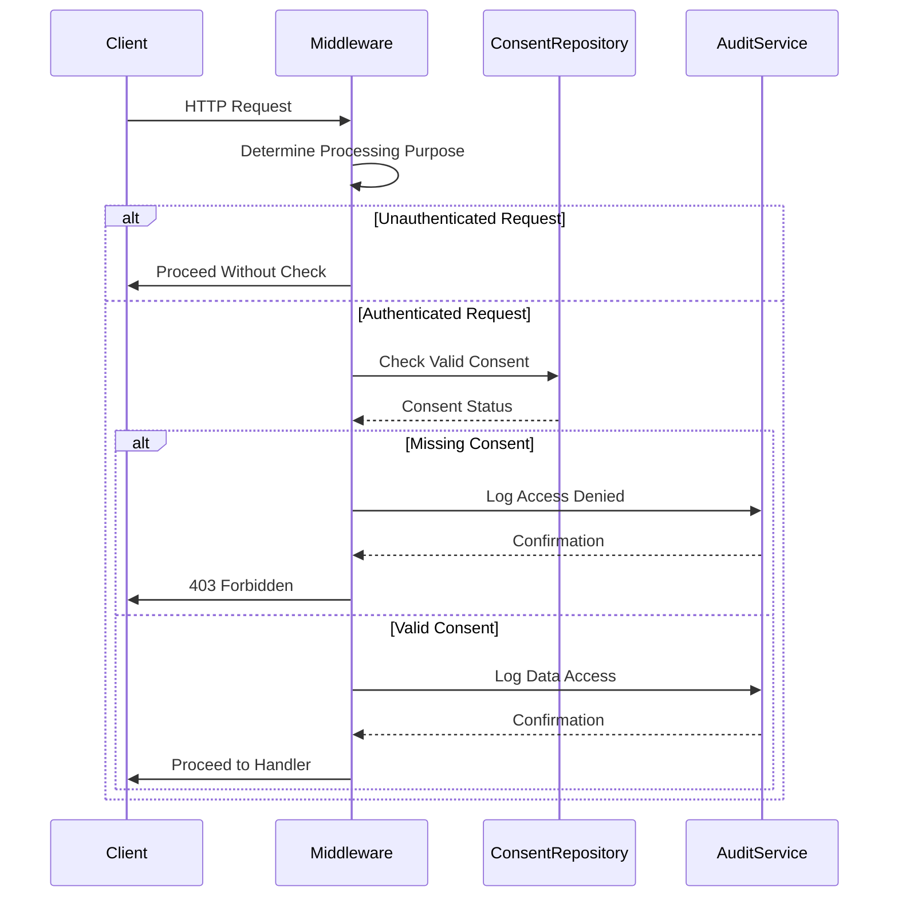
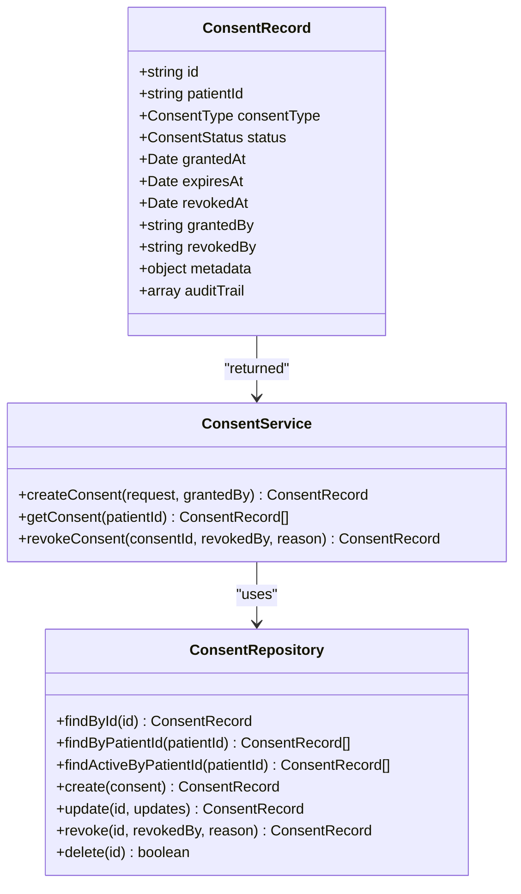
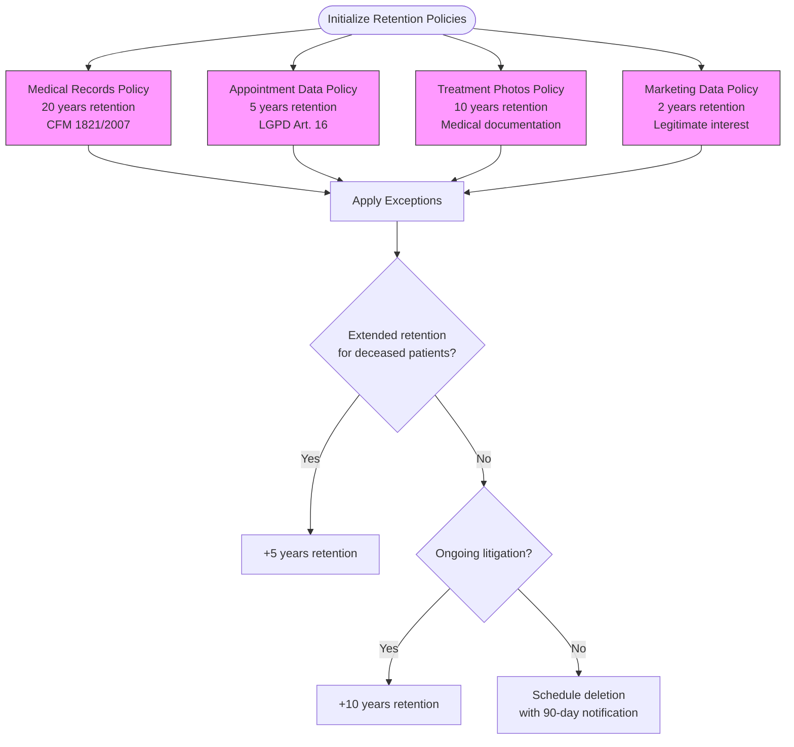
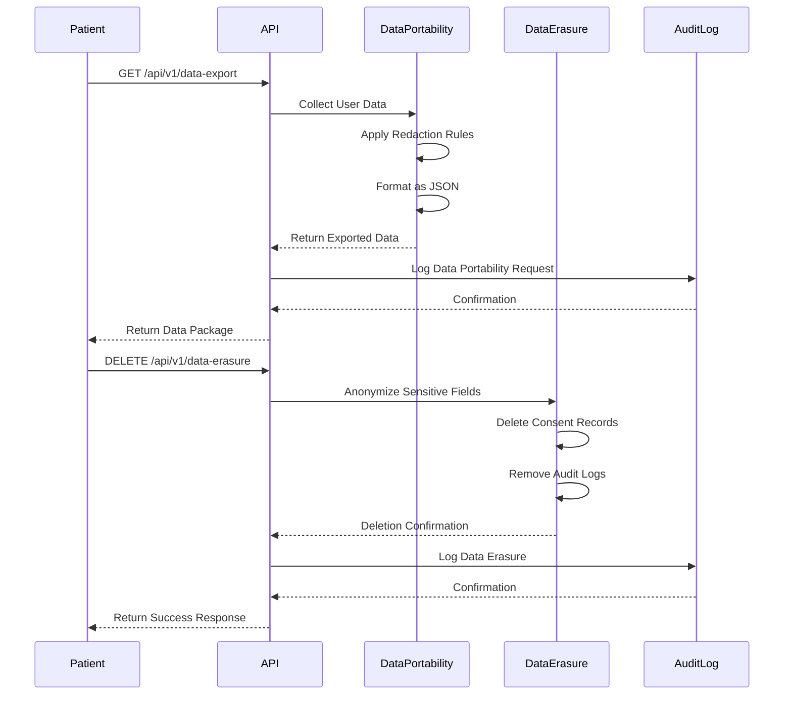
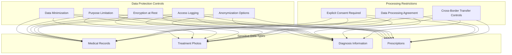
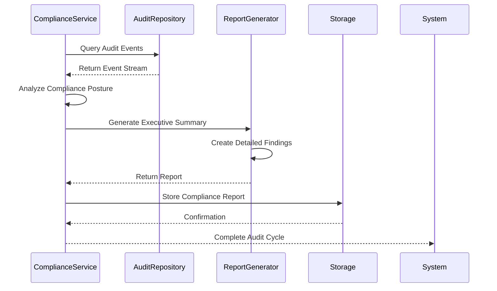
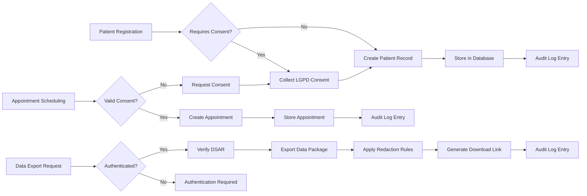

# LGPD Compliance Measures

<cite>
**Referenced Files in This Document **
- [lgpd-middleware.ts](file://apps/api/src/middleware/lgpd-middleware.ts)
- [lgpd.ts](file://apps/api/src/types/lgpd.ts)
- [lgpd.ts](file://packages/utils/src/lgpd.ts)
- [consent-repository.ts](file://packages/domain/src/repositories/consent-repository.ts)
- [consent-service.ts](file://packages/domain/src/services/consent-service.ts)
- [consent-service.ts](file://packages/database/src/services/consent-service.ts)
- [healthcare-governance.service.ts](file://packages/governance/src/services/healthcare-governance.service.ts)
- [anonymization.ts](file://packages/security/src/anonymization.ts)
- [lgpd-sensitive-health-data-protection.test.ts](file://apps/api/src/__tests__/compliance/lgpd-sensitive-health-data-protection.test.ts)
- [lgpd-audit-trail-verification.test.ts](file://apps/api/src/__tests__/compliance/lgpd-audit-trail-verification.test.ts)
- [lgpd-data-retention-deletion.test.ts](file://apps/api/src/__tests__/compliance/lgpd-data-retention-deletion.test.ts)
</cite>

## Table of Contents

1. [Introduction](#introduction)
2. [LGPD Middleware Implementation](#lgpd-middleware-implementation)
3. [Consent Lifecycle Management](#consent-lifecycle-management)
4. [Data Retention Policies](#data-retention-policies)
5. [Data Subject Rights Handling](#data-subject-rights-handling)
6. [Sensitive Health Data Protection](#sensitive-health-data-protection)
7. [Audit and Compliance Verification](#audit-and-compliance-verification)
8. [Integration with Patient Services](#integration-with-patient-services)
9. [Common Compliance Issues and Solutions](#common-compliance-issues-and-solutions)
10. [Technical Implementation of LGPD Principles](#technical-implementation-of-lgpd-principles)

## Introduction

The neonpro healthcare platform implements comprehensive compliance measures with Brazil's General Data Protection Law (LGPD). This document details the technical architecture and implementation strategies for handling data subject rights, managing consent lifecycles, and enforcing personal data processing restrictions. The system integrates lgpd-middleware with consent repositories and audit services to ensure regulatory compliance across all patient interactions. Domain models for consent records, data anonymization workflows, and retention policies are implemented throughout the platform, with specific controls for cross-border data transfers and sensitive health information. Integration points with patient registration, appointment scheduling, and data export features ensure that LGPD requirements are met at every touchpoint in the patient journey.

## LGPD Middleware Implementation

The LGPD middleware serves as the central enforcement point for data protection regulations within the neonpro platform. Implemented as a Hono middleware component, it intercepts requests to validate compliance with LGPD requirements before allowing access to protected resources.

**Diagram sources**

- [lgpd-middleware.ts](file://apps/api/src/middleware/lgpd-middleware.ts#L1-L685)

**Section sources**

- [lgpd-middleware.ts](file://apps/api/src/middleware/lgpd-middleware.ts#L1-L685)

## Consent Lifecycle Management

The consent management system implements a complete lifecycle for patient consent records, from creation through revocation. The domain model defines consent status transitions and validation rules that align with LGPD requirements.

**Diagram sources**

- [consent-repository.ts](file://packages/domain/src/repositories/consent-repository.ts#L1-L107)
- [consent-service.ts](file://packages/domain/src/services/consent-service.ts#L1-L153)

**Section sources**

- [consent-repository.ts](file://packages/domain/src/repositories/consent-repository.ts#L1-L107)
- [consent-service.ts](file://packages/domain/src/services/consent-service.ts#L1-L153)
- [consent-service.ts](file://packages/database/src/services/consent-service.ts#L1-L161)

## Data Retention Policies

The platform implements data retention policies that comply with Brazilian healthcare regulations, including CFM Resolution 1.821/2007 which mandates 20-year retention for medical records. The system automatically applies appropriate retention periods based on data category.

**Diagram sources**

- [enhanced-lgpd-lifecycle.ts](file://apps/api/src/services/enhanced-lgpd-lifecycle.ts#L211-L244)
- [lgpd-data-retention-deletion.test.ts](file://apps/api/src/__tests__/compliance/lgpd-data-retention-deletion.test.ts#L74-L106)

**Section sources**

- [enhanced-lgpd-lifecycle.ts](file://apps/api/src/services/enhanced-lgpd-lifecycle.ts#L211-L244)
- [data-retention-service.ts](file://apps/api/src/services/data-retention-service.ts#L28-L71)
- [compliance-management-service.ts](file://packages/core-services/src/services/compliance-management-service.ts#L956-L1044)

## Data Subject Rights Handling

The platform provides comprehensive support for data subject rights as defined in LGPD Article 18, including the right to access, correct, delete, and port personal data. These capabilities are exposed through dedicated API endpoints integrated with the lgpd-middleware.

**Diagram sources**

- [lgpd-middleware.ts](file://apps/api/src/middleware/lgpd-middleware.ts#L1-L685)
- [lgpd.ts](file://apps/api/src/types/lgpd.ts#L1-L423)

**Section sources**

- [lgpd-middleware.ts](file://apps/api/src/middleware/lgpd-middleware.ts#L1-L685)
- [lgpd.ts](file://apps/api/src/types/lgpd.ts#L1-L423)

## Sensitive Health Data Protection

The platform implements specialized protections for sensitive health data as required by LGPD Article 11. These include enhanced encryption, access controls, and data minimization practices to protect patient confidentiality.

**Diagram sources**

- [lgpd-sensitive-health-data-protection.test.ts](file://apps/api/src/__tests__/compliance/lgpd-sensitive-health-data-protection.test.ts#L1158-L1187)
- [anonymization.ts](file://packages/security/src/anonymization.ts#L1-L50)

**Section sources**

- [lgpd-sensitive-health-data-protection.test.ts](file://apps/api/src/__tests__/compliance/lgpd-sensitive-health-data-protection.test.ts#L1158-L1187)
- [anonymization.ts](file://packages/security/src/anonymization.ts#L1-L50)

## Audit and Compliance Verification

The platform includes comprehensive audit capabilities to verify LGPD compliance and generate required documentation. Automated audit trails capture all data access and modification events, enabling verification of compliance posture.

**Diagram sources**

- [lgpd-audit-trail-verification.test.ts](file://apps/api/src/__tests__/compliance/lgpd-audit-trail-verification.test.ts#L558-L577)
- [aesthetic-compliance-service.ts](file://apps/api/src/services/agui-protocol/aesthetic-compliance-service.ts#L477-L511)

**Section sources**

- [lgpd-audit-trail-verification.test.ts](file://apps/api/src/__tests__/compliance/lgpd-audit-trail-verification.test.ts#L558-L577)
- [aesthetic-compliance-service.ts](file://apps/api/src/services/agui-protocol/aesthetic-compliance-service.ts#L477-L511)

## Integration with Patient Services

The LGPD compliance system integrates seamlessly with core patient services including registration, appointment scheduling, and data export. These integrations ensure that compliance checks are performed at every relevant interaction point.

**Section sources**

- [lgpd-middleware.ts](file://apps/api/src/middleware/lgpd-middleware.ts#L1-L685)
- [lgpd.ts](file://apps/api/src/types/lgpd.ts#L1-L423)
- [healthcare-governance.service.ts](file://packages/governance/src/services/healthcare-governance.service.ts#L1-L50)

## Common Compliance Issues and Solutions

The platform addresses common LGPD compliance challenges through automated processes and clear user interfaces. These solutions ensure that both patients and healthcare providers can meet their obligations under Brazilian data protection law.

### Handling Data Subject Access Requests (DSARs)

The system provides an automated process for handling DSARs, allowing patients to submit requests through a self-service portal. The request triggers a workflow that collects all relevant data from across the platform, applies appropriate redaction rules, and delivers the information in a standardized format.

### Implementing Right to Be Forgotten Procedures

When a patient exercises their right to be forgotten, the system initiates a multi-step process that first anonymizes sensitive fields in medical records (as required by medical regulations), then permanently deletes consent records and audit logs. This balanced approach respects both patient privacy rights and legal requirements for medical record retention.

### Maintaining Compliance Documentation

The platform automatically generates and stores compliance documentation, including consent records, audit trails, and data processing agreements. These documents are retained for the legally required periods and can be retrieved for regulatory inspections or internal audits.

**Section sources**

- [lgpd-middleware.ts](file://apps/api/src/middleware/lgpd-middleware.ts#L1-L685)
- [lgpd.ts](file://apps/api/src/types/lgpd.ts#L1-L423)
- [consent-service.ts](file://packages/domain/src/services/consent-service.ts#L1-L153)

## Technical Implementation of LGPD Principles

The platform embodies key LGPD principles through specific technical implementations that ensure accountability and transparency in data processing activities.

### Data Minimization

The system implements data minimization through selective field inclusion in API responses and database queries. Only data necessary for the specific purpose is retrieved and transmitted, reducing exposure of unnecessary personal information.

### Purpose Limitation

Each data processing operation is associated with a defined purpose (medical care, appointment scheduling, billing, etc.). The lgpd-middleware enforces that data collected for one purpose cannot be used for another without explicit additional consent.

### Accountability

Comprehensive audit logging captures all data access and modification events, creating an immutable record of processing activities. These logs include timestamps, user identifiers, IP addresses, and user agents, providing evidence of compliance with regulatory requirements.

**Section sources**

- [lgpd-middleware.ts](file://apps/api/src/middleware/lgpd-middleware.ts#L1-L685)
- [audit-log.ts](file://apps/api/src/middleware/audit-log.ts#L1-L50)
- [lgpd.ts](file://packages/utils/src/lgpd.ts#L1-L448)
