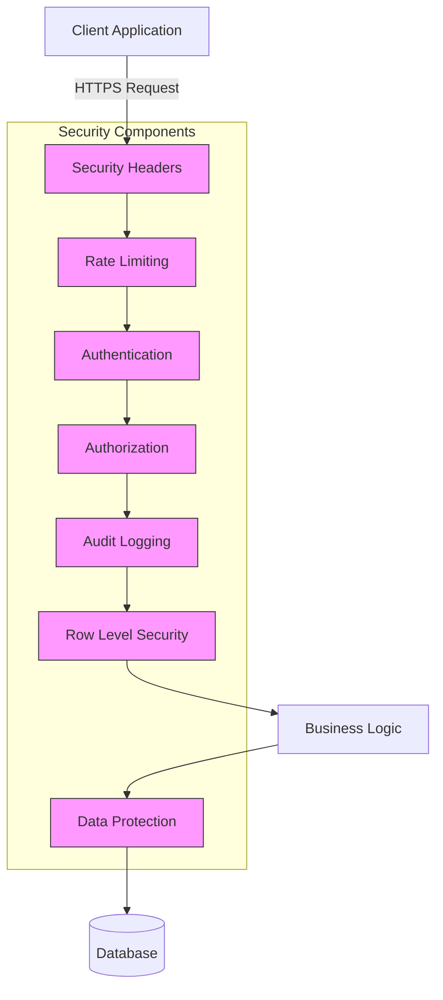
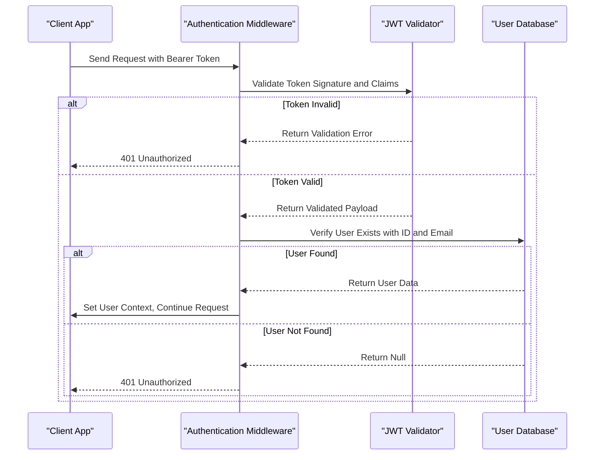
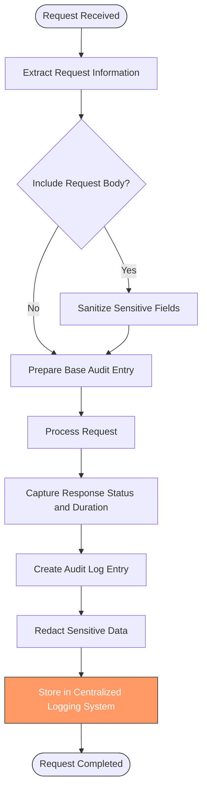
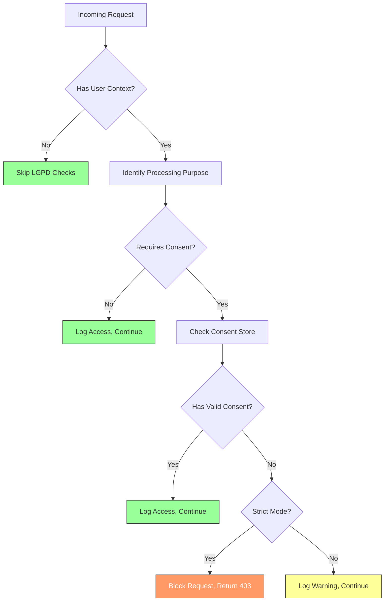
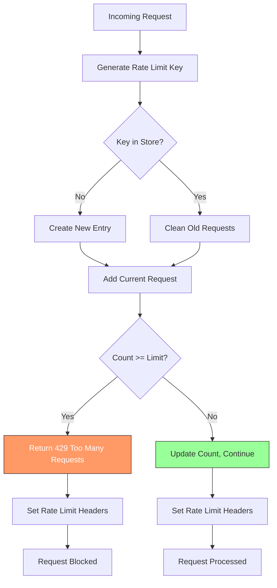
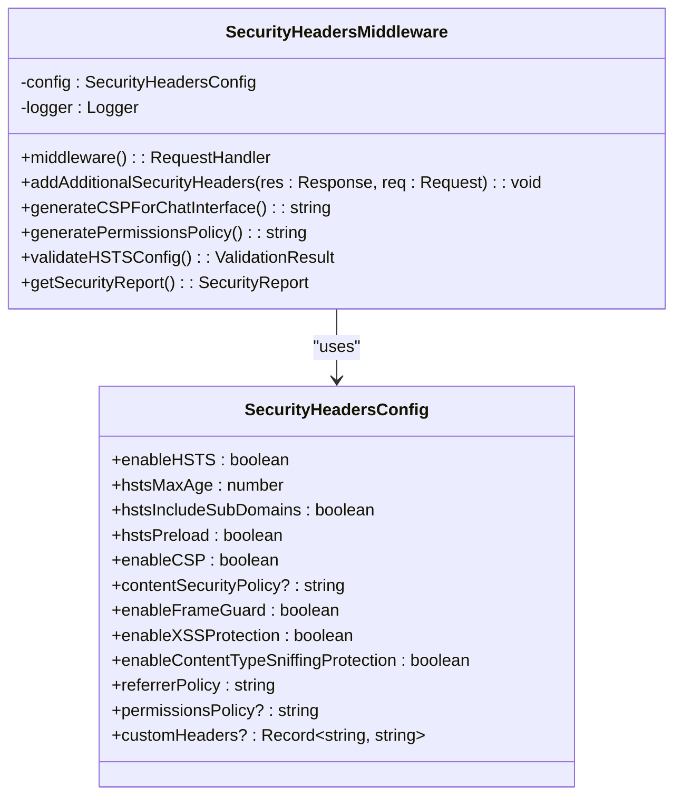
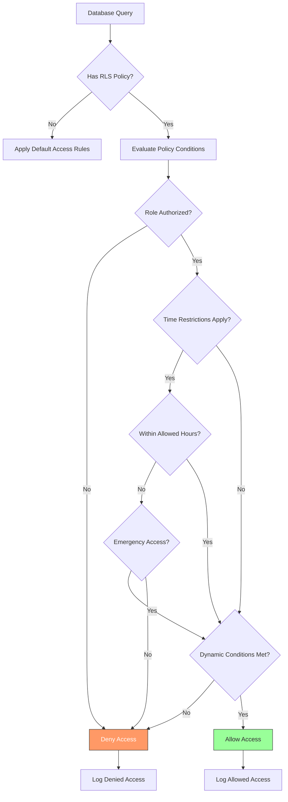

# Security & Compliance

<cite>
**Referenced Files in This Document**
- [security-middleware.ts](file://apps/api/src/middleware/security-middleware.ts)
- [rls-policies.ts](file://apps/api/src/security/rls-policies.ts)
- [audit-log.ts](file://apps/api/src/middleware/audit-log.ts)
- [https-config.ts](file://apps/api/src/config/https-config.ts)
- [authn.ts](file://apps/api/src/middleware/authn.ts)
- [jwt-validator.ts](file://apps/api/src/security/jwt-validator.ts)
- [rate-limiting.ts](file://apps/api/src/middleware/rate-limiting.ts)
- [security-headers.ts](file://apps/api/src/middleware/security-headers.ts)
- [encryption.ts](file://packages/security/src/encryption.ts)
- [tls-config.ts](file://apps/api/src/config/tls-config.ts)
- [lgpd-middleware.ts](file://apps/api/src/middleware/lgpd-middleware.ts)
</cite>

## Table of Contents

1. [Introduction](#introduction)
2. [Security Architecture Overview](#security-architecture-overview)
3. [Authentication and Authorization](#authentication-and-authorization)
4. [Data Protection and Encryption](#data-protection-and-encryption)
5. [Audit Logging and Monitoring](#audit-logging-and-monitoring)
6. [Compliance and Regulatory Requirements](#compliance-and-regulatory-requirements)
7. [Rate Limiting and Abuse Prevention](#rate-limiting-and-abuse-prevention)
8. [Security Headers and HTTPS Enforcement](#security-headers-and-https-enforcement)
9. [Row-Level Security Implementation](#row-level-security-implementation)
10. [Incident Response and Vulnerability Management](#incident-response-and-vulnerability-management)

## Introduction

The neonpro platform implements a comprehensive security and compliance infrastructure designed to protect sensitive healthcare data while meeting regulatory requirements such as LGPD (Lei Geral de Proteção de Dados). The security architecture follows the principle of defense-in-depth, implementing multiple layers of protection across the application stack.

This document outlines the high-level design of the security infrastructure, detailing the architectural patterns, component interactions, and specific security features implemented throughout the system. The platform employs a middleware pipeline for security enforcement, ensuring that all requests pass through a series of security checks before reaching business logic components.

The security model is built on the principle of least privilege, where users and services are granted only the minimum permissions necessary to perform their functions. This approach minimizes the potential impact of compromised accounts or systems.

**Section sources**

- [security-middleware.ts](file://apps/api/src/middleware/security-middleware.ts#L1-L384)

## Security Architecture Overview

The security architecture of the neonpro platform consists of multiple interconnected components that work together to provide comprehensive protection. At the core of this architecture is a middleware pipeline that processes all incoming requests, applying various security controls in sequence.



**Diagram sources**

- [security-middleware.ts](file://apps/api/src/middleware/security-middleware.ts#L1-L384)
- [authn.ts](file://apps/api/src/middleware/authn.ts#L1-L307)

## Authentication and Authorization

The authentication and authorization system in neonpro is implemented through a combination of JWT-based authentication and role-based access control. The system follows industry best practices for token validation and security.

The authentication process begins with the validation of JWT tokens using a comprehensive security validator that checks for algorithm confusion attacks, validates audience and issuer claims, and enforces token expiration policies. The `JWTSecurityValidator` class implements these checks according to OWASP security best practices.



**Diagram sources**

- [authn.ts](file://apps/api/src/middleware/authn.ts#L1-L307)
- [jwt-validator.ts](file://apps/api/src/security/jwt-validator.ts#L1-L712)

**Section sources**

- [authn.ts](file://apps/api/src/middleware/authn.ts#L1-L307)
- [jwt-validator.ts](file://apps/api/src/security/jwt-validator.ts#L1-L712)

## Data Protection and Encryption

The neonpro platform implements robust data protection measures to safeguard sensitive healthcare information both at rest and in transit. The encryption system is based on AES-256-GCM, providing authenticated encryption with guaranteed confidentiality and integrity.

The `EncryptionManager` class provides methods for encrypting and decrypting data, as well as utilities for hashing sensitive information. Key management is handled by the `KeyManager` class, which implements secure key storage and rotation practices.

```mermaid
classDiagram
class EncryptionManager {
+algorithm : string
+keyLength : number
+ivLength : number
+generateKey() : string
+validateKey(key : string) : boolean
+encryptData(data : string, key : string) : string
+decryptData(encryptedData : string, key : string) : string
+encryptObject(obj : T, key : string, sensitiveFields : string[]) : T
+decryptObject(obj : T, key : string, sensitiveFields : string[]) : T
+hashData(data : string) : string
+compareHash(plaintext : string, hash : string) : boolean
}
class KeyManager {
-keys : Map~string, string~
-keyMetadata : Map~string, {createdAt : Date, expiresAt? : Date}~
+storeKey(keyId : string, key : string, expiresAt? : Date) : void
+getKey(keyId : string) : string | null
+removeKey(keyId : string) : void
+listKeys() : string[]
+rotateKey(keyId : string, ttl : number) : string
+cleanup() : void
}
class TLSConfigManager {
-config : TLSConfiguration | null
-certificateConfig : CertificateConfig | null
+initialize(certConfig : CertificateConfig) : void
+getHTTPSOptions() : https.ServerOptions
+getCertificateInfo() : CertificateInfo
+validateConfiguration() : ValidationResult
+rotateSessionTickets() : void
}
EncryptionManager --> KeyManager : "uses"
TLSConfigManager --> EncryptionManager : "depends on"
```

**Diagram sources**

- [encryption.ts](file://packages/security/src/encryption.ts#L1-L302)
- [tls-config.ts](file://apps/api/src/config/tls-config.ts#L1-L312)

**Section sources**

- [encryption.ts](file://packages/security/src/encryption.ts#L1-L302)
- [tls-config.ts](file://apps/api/src/config/tls-config.ts#L1-L312)

## Audit Logging and Monitoring

The audit logging system in neonpro captures detailed information about all significant operations within the platform, providing a comprehensive trail for security analysis and compliance purposes. The system is designed to meet healthcare industry requirements for data access monitoring.

The `auditLogMiddleware` function creates audit entries for each request, capturing information such as timestamp, user ID, action performed, resource accessed, IP address, and user agent. Sensitive data is automatically redacted from logs to prevent exposure of confidential information.



**Diagram sources**

- [audit-log.ts](file://apps/api/src/middleware/audit-log.ts#L1-L331)

**Section sources**

- [audit-log.ts](file://apps/api/src/middleware/audit-log.ts#L1-L331)

## Compliance and Regulatory Requirements

The neonpro platform is designed to comply with Brazilian data protection regulations, particularly LGPD (Lei Geral de Proteção de Dados). The compliance infrastructure includes specialized middleware that enforces data processing rules based on user consent and legitimate purposes.

The `lgpdMiddleware` function implements LGPD compliance checks by validating that data processing activities have appropriate legal basis, such as explicit user consent. The middleware logs all data access events and can block operations that lack proper authorization.



**Diagram sources**

- [lgpd-middleware.ts](file://apps/api/src/middleware/lgpd-middleware.ts#L1-L222)

**Section sources**

- [lgpd-middleware.ts](file://apps/api/src/middleware/lgpd-middleware.ts#L1-L222)

## Rate Limiting and Abuse Prevention

The rate limiting system in neonpro protects against abuse and denial-of-service attacks by enforcing limits on request frequency. The implementation uses an in-memory store to track request counts and provides different limits for various endpoint types.

The system implements tiered rate limiting with different thresholds for healthcare data endpoints, AI/chat endpoints, authentication endpoints, and general API endpoints. This approach ensures that critical functionality remains available while preventing abusive behavior.



**Diagram sources**

- [rate-limiting.ts](file://apps/api/src/middleware/rate-limiting.ts#L1-L215)

**Section sources**

- [rate-limiting.ts](file://apps/api/src/middleware/rate-limiting.ts#L1-L215)

## Security Headers and HTTPS Enforcement

The neonpro platform implements comprehensive security headers to protect against common web vulnerabilities such as XSS, clickjacking, and MIME type sniffing. These headers are applied consistently across all responses to enhance client-side security.

The system enforces HTTPS in production environments, redirecting HTTP requests to their secure counterparts. Security headers include HSTS (HTTP Strict Transport Security), CSP (Content Security Policy), X-Frame-Options, and X-XSS-Protection.



**Diagram sources**

- [security-headers.ts](file://apps/api/src/middleware/security-headers.ts#L1-L382)
- [https-config.ts](file://apps/api/src/config/https-config.ts#L1-L166)

**Section sources**

- [security-headers.ts](file://apps/api/src/middleware/security-headers.ts#L1-L382)
- [https-config.ts](file://apps/api/src/config/https-config.ts#L1-L166)

## Row-Level Security Implementation

The row-level security (RLS) system in neonpro provides fine-grained access control at the database level, ensuring that users can only access data they are authorized to view. The implementation is based on Supabase RLS policies with additional application-level enforcement.

The `AdvancedRLSPolicies` class defines comprehensive access policies for healthcare tables, incorporating role hierarchy, time restrictions, consent requirements, and audit levels. Policies are evaluated dynamically based on user context and request parameters.



**Diagram sources**

- [rls-policies.ts](file://apps/api/src/security/rls-policies.ts#L1-L642)

**Section sources**

- [rls-policies.ts](file://apps/api/src/security/rls-policies.ts#L1-L642)

## Incident Response and Vulnerability Management

The neonpro platform includes comprehensive incident response and vulnerability management procedures to address security issues promptly and effectively. The system is designed to detect, respond to, and recover from security incidents while minimizing impact on operations.

Security monitoring is implemented through continuous validation of system configurations, automated scanning for vulnerabilities, and real-time alerting for suspicious activities. The platform includes tools for security analysis and auditing that help identify potential weaknesses before they can be exploited.

The incident response process follows a structured approach:

1. Detection and analysis of security events
2. Containment to prevent further damage
3. Eradication of the root cause
4. Recovery of affected systems
5. Post-incident review and improvement

Vulnerability management includes regular security audits, penetration testing, and prompt patching of identified issues. The platform's modular architecture allows for rapid deployment of security fixes without disrupting service availability.

**Section sources**

- [security-middleware.ts](file://apps/api/src/middleware/security-middleware.ts#L1-L384)
- [audit-log.ts](file://apps/api/src/middleware/audit-log.ts#L1-L331)
