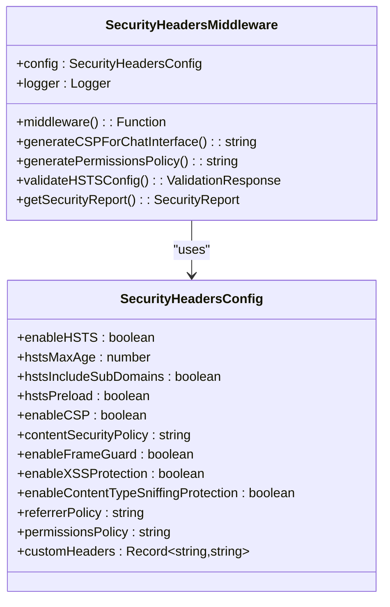
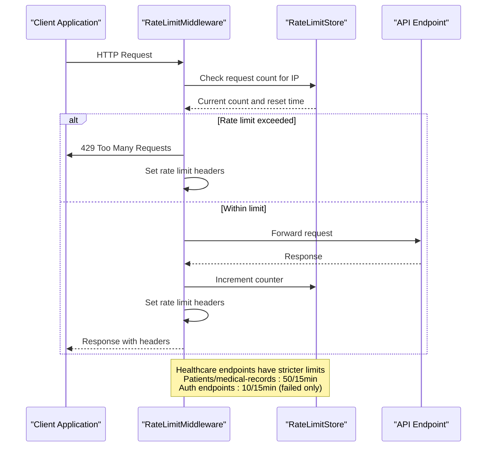
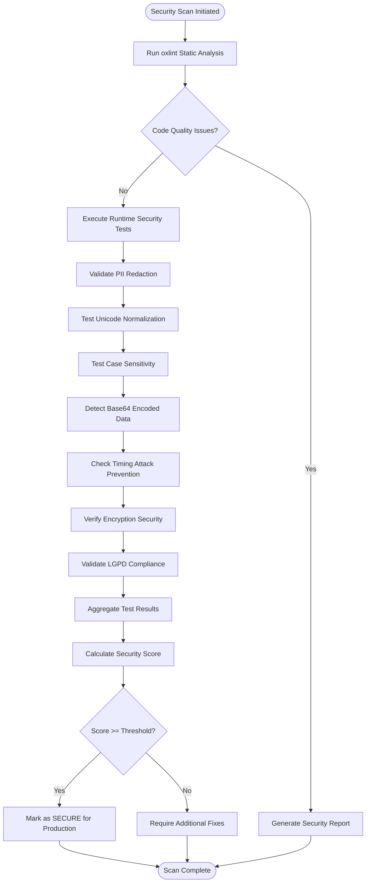
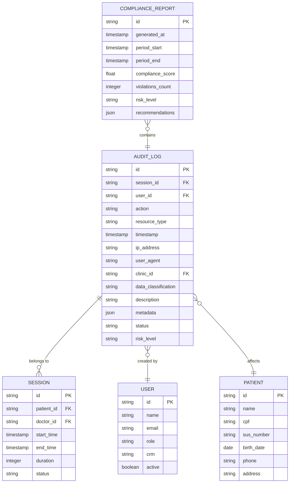
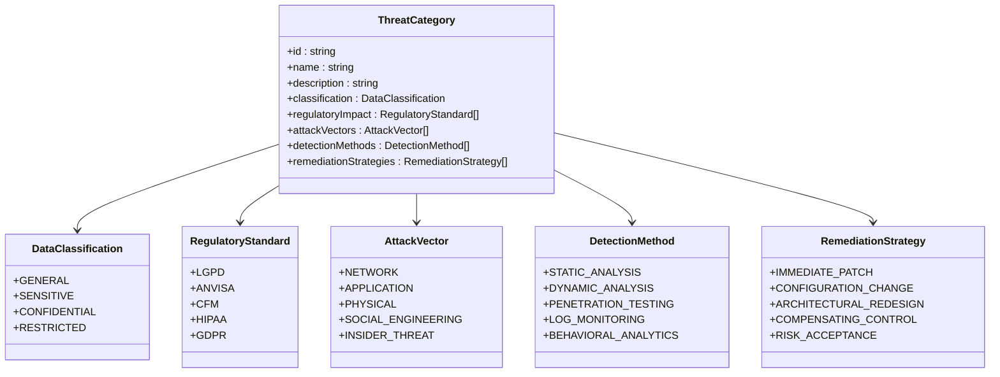

# Vulnerability Management

<cite>
**Referenced Files in This Document **   
- [security-headers.ts](file://apps/api/src/middleware/security-headers.ts)
- [rate-limiting.ts](file://apps/api/src/middleware/rate-limiting.ts)
- [oxlint.config.mjs](file://tools/quality/oxlint.config.mjs)
- [security-audit.ts](file://scripts/security-audit.ts)
- [install-hooks.sh](file://scripts/install-hooks.sh)
- [audit-service.ts](file://packages/database/src/services/audit-service.ts)
</cite>

## Table of Contents
1. [Introduction](#introduction)
2. [Security Header Enforcement](#security-header-enforcement)
3. [Rate Limiting Strategies](#rate-limiting-strategies)
4. [Automated Vulnerability Scanning](#automated-vulnerability-scanning)
5. [Integration with Development Workflows](#integration-with-development-workflows)
6. [Incident Response and Audit Logging](#incident-response-and-audit-logging)
7. [Domain Models for Security Management](#domain-models-for-security-management)
8. [Common Challenges and Mitigation Strategies](#common-challenges-and-mitigation-strategies)
9. [Proactive Security Measures](#proactive-security-measures)
10. [Conclusion](#conclusion)

## Introduction
The neonpro platform implements a comprehensive vulnerability management framework designed to protect sensitive healthcare data while maintaining regulatory compliance with LGPD, ANVISA, and CFM standards. This document details the security architecture, focusing on three core pillars: security header enforcement, rate limiting strategies, and automated vulnerability scanning. The system integrates security controls at multiple levels—from middleware and CI/CD pipelines to incident response workflows—ensuring protection across the entire development lifecycle. Key components include Content Security Policy (CSP) implementation, brute force attack prevention, regular security audits, and deep integration with development workflows through oxlint configurations and pre-commit hooks.

## Security Header Enforcement
The neonpro platform employs a robust security headers middleware to protect against common web vulnerabilities. Implemented in `security-headers.ts`, this middleware configures critical HTTP security headers including HSTS, CSP, X-Frame-Options, and others. The system uses a configurable approach that allows different security policies for various endpoint types, with healthcare-specific configurations enforcing stricter standards.



**Diagram sources **
- [security-headers.ts](file://apps/api/src/middleware/security-headers.ts#L1-L382)

**Section sources**
- [security-headers.ts](file://apps/api/src/middleware/security-headers.ts#L1-L382)

## Rate Limiting Strategies
The platform implements sophisticated rate limiting strategies to prevent abuse and protect against brute force attacks. The rate limiting system, defined in `rate-limiting.ts`, uses an in-memory store with time-window based counters to track request frequency. Different endpoints have tailored rate limits based on their sensitivity and function, with healthcare data endpoints receiving the most restrictive protections.



**Diagram sources **
- [rate-limiting.ts](file://apps/api/src/middleware/rate-limiting.ts#L1-L215)

**Section sources**
- [rate-limiting.ts](file://apps/api/src/middleware/rate-limiting.ts#L1-L215)

## Automated Vulnerability Scanning
The neonpro platform incorporates automated vulnerability scanning through a combination of static analysis tools and runtime security audits. The oxlint configuration enforces code quality and security rules across the codebase, while dedicated security audit scripts validate critical systems. The security audit process includes comprehensive testing for PII redaction, Unicode normalization, case sensitivity issues, base64 detection, and timing attack prevention.



**Diagram sources **
- [oxlint.config.mjs](file://tools/quality/oxlint.config.mjs#L1-L162)
- [security-audit.ts](file://scripts/security-audit.ts#L1-L132)

**Section sources**
- [oxlint.config.mjs](file://tools/quality/oxlint.config.mjs#L1-L162)
- [security-audit.ts](file://scripts/security-audit.ts#L1-L132)

## Integration with Development Workflows
Security is deeply integrated into the development workflow through pre-commit hooks and linter configurations. The installation script sets up automated checks that run on every commit, validating compliance with healthcare regulations and preventing the introduction of security vulnerabilities. The oxlint configuration enforces TypeScript best practices, accessibility standards, and security rules, with file-specific overrides for test files and configuration files.

```mermaid
graph TB
subgraph "Developer Environment"
Editor[Code Editor]
Linter[oxlint]
PreCommit[Pre-commit Hooks]
end
subgraph "CI Pipeline"
Build[Build Process]
Test[Automated Testing]
SecurityScan[Security Scanning]
end
Editor --> Linter
Linter --> PreCommit
PreCommit --> |Pass| Build
PreCommit --> |Fail| Editor
Build --> Test
Test --> SecurityScan
SecurityScan --> |Approved| Deploy[Deployment]
SecurityScan --> |Blocked| Review[Manual Review]
style PreCommit fill:#f9f,stroke:#333
style SecurityScan fill:#f9f,stroke:#333
Note right of PreCommit: LGPD personal data protection<br>ANVISA protocol validation<br>CFM license format checks<br>Healthcare secrets detection
```

**Diagram sources **
- [oxlint.config.mjs](file://tools/quality/oxlint.config.mjs#L1-L162)
- [install-hooks.sh](file://scripts/install-hooks.sh#L1-L44)

**Section sources**
- [oxlint.config.mjs](file://tools/quality/oxlint.config.mjs#L1-L162)
- [install-hooks.sh](file://scripts/install-hooks.sh#L1-L44)

## Incident Response and Audit Logging
The platform maintains comprehensive audit logging capabilities to support incident response and compliance reporting. The audit service captures detailed information about system events, including user actions, data access, and security events. Each log entry includes contextual information such as timestamps, IP addresses, user agents, and session identifiers, enabling thorough forensic analysis when needed.



**Diagram sources **
- [audit-service.ts](file://packages/database/src/services/audit-service.ts#L51-L678)

**Section sources**
- [audit-service.ts](file://packages/database/src/services/audit-service.ts#L51-L678)

## Domain Models for Security Management
The vulnerability management system incorporates well-defined domain models for threat categories, vulnerability severity levels, and remediation timelines. These models provide a structured approach to security management, enabling consistent assessment and prioritization of vulnerabilities across the organization.

### Threat Categories Model


**Diagram sources **
- [audit-service.ts](file://packages/database/src/services/audit-service.ts#L51-L678)

### Vulnerability Severity Levels
The platform uses a four-tier severity classification system:
- **Critical**: Immediate risk to patient safety or data confidentiality; requires patch within 24 hours
- **High**: Significant security impact; requires patch within 7 days
- **Medium**: Moderate security impact; requires patch within 30 days
- **Low**: Minor security impact; addressed in regular maintenance cycles

### Remediation Timelines
Remediation timelines are determined by a combination of severity level, affected systems, and regulatory requirements. Critical vulnerabilities affecting patient data systems trigger an immediate response protocol, while lower-severity issues follow scheduled patch cycles aligned with release windows.

## Common Challenges and Mitigation Strategies
The neonpro platform addresses several common challenges in vulnerability management:

### False Positive Reduction
The security scanning system incorporates context-aware analysis to reduce false positives. By understanding the healthcare domain and specific data patterns, the system can distinguish between legitimate medical data and potential security issues. The oxlint configuration includes healthcare-specific rules that minimize noise while maintaining rigorous security standards.

### Coordinating Patch Deployment Windows
The platform uses a staged deployment approach with canary releases to minimize disruption while ensuring security updates are deployed promptly. Critical patches follow an expedited process with rollback capabilities, while routine updates are batched and deployed during predefined maintenance windows.

### Maintaining Security Posture Across Frequent Releases
Continuous security validation is maintained through automated testing in the CI/CD pipeline. Every code change triggers security scans, and pre-commit hooks prevent vulnerable code from being committed. The system also maintains a security debt register to track and prioritize unresolved issues across releases.

## Proactive Security Measures
Beyond reactive vulnerability management, the neonpro platform implements several proactive security measures:

### Dependency Scanning
All third-party dependencies are continuously monitored for known vulnerabilities using automated scanning tools. The system integrates with security databases to receive real-time alerts about newly discovered vulnerabilities in dependencies.

### Penetration Testing Coordination
Regular penetration tests are conducted by internal security champions and external experts. Findings are systematically tracked and prioritized based on the platform's severity classification system, with remediation efforts integrated into the development backlog.

### Security Champion Programs
Development teams include designated security champions who receive specialized training and are responsible for promoting security best practices within their teams. These champions participate in security reviews, help triage vulnerabilities, and serve as points of contact for security-related questions.

## Conclusion
The neonpro platform's vulnerability management practices demonstrate a comprehensive, multi-layered approach to security that spans technical controls, development processes, and organizational practices. By integrating security headers, rate limiting, automated scanning, and proactive measures into a cohesive framework, the platform maintains a strong security posture while supporting rapid development in the healthcare domain. The system's emphasis on automation, clear domain models, and developer integration ensures that security is not a bottleneck but an integral part of the development culture.