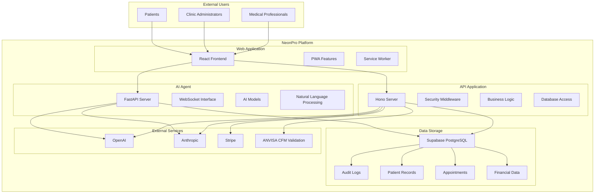
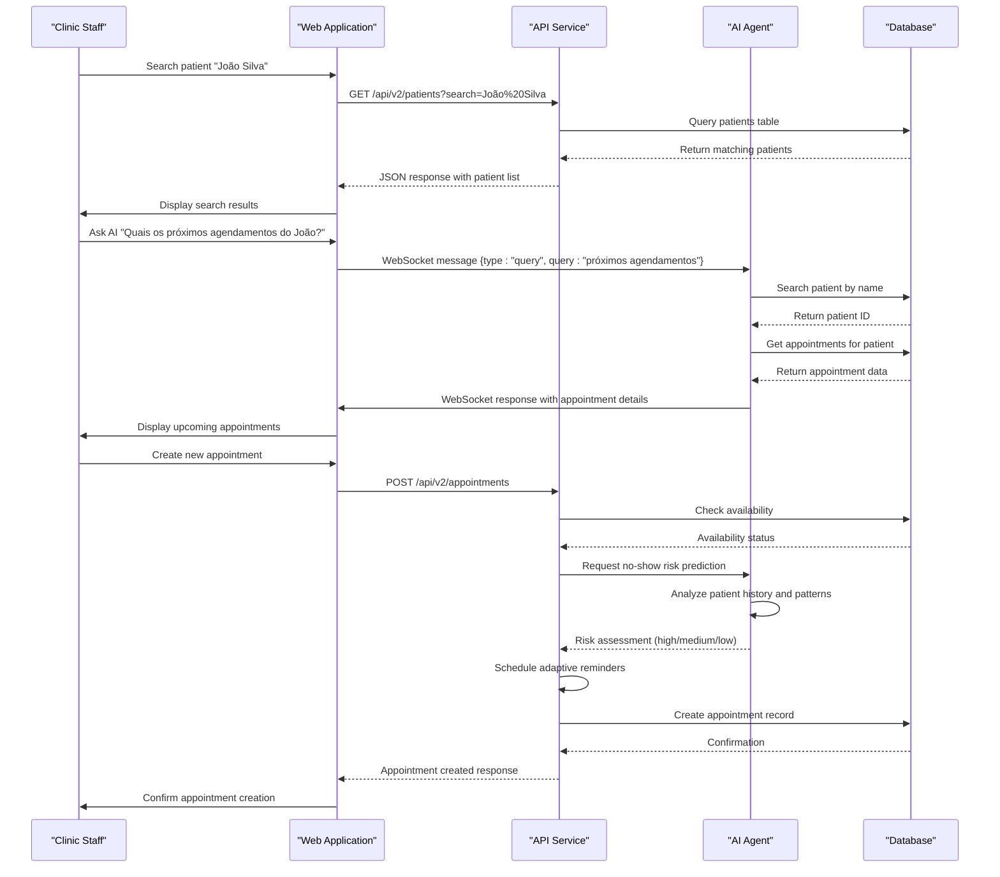

# System Overview

<cite>
**Referenced Files in This Document**
- [main.py](file://apps/ai-agent/main.py)
- [agent_service.py](file://apps/ai-agent/services/agent_service.py)
- [database_service.py](file://apps/ai-agent/services/database_service.py)
- [websocket_manager.py](file://apps/ai-agent/services/websocket_manager.py)
- [app.ts](file://apps/api/src/app.ts)
- [router.ts](file://apps/api/src/trpc/router.ts)
- [patients.ts](file://apps/api/src/trpc/routers/patients.ts)
- [appointments.ts](file://apps/api/src/trpc/routers/appointments.ts)
- [ai.ts](file://apps/api/src/trpc/routers/ai.ts)
- [App.tsx](file://apps/web/src/App.tsx)
</cite>

## Table of Contents

1. [Introduction](#introduction)
2. [Core Architecture](#core-architecture)
3. [Main Applications](#main-applications)
4. [Shared Packages and Services](#shared-packages-and-services)
5. [User Scenarios](#user-scenarios)
6. [System Context Diagram](#system-context-diagram)
7. [Component Interaction Diagram](#component-interaction-diagram)

## Introduction

The NeonPro healthcare platform is a full-stack application specifically designed for aesthetic clinics in Brazil, with a strong emphasis on regulatory compliance, security, and AI-powered services. As a monorepo architecture, it integrates multiple interconnected components including frontend, backend, AI services, and shared packages to provide a comprehensive solution for clinic management.

NeonPro's primary focus is on ensuring compliance with Brazil's General Data Protection Law (LGPD), implementing robust security measures, and leveraging artificial intelligence to enhance clinical decision-making and operational efficiency. The platform serves aesthetic clinics by providing tools for patient management, appointment scheduling, financial operations, and AI-assisted clinical support.

The system is built as a monorepo containing three main applications: a web frontend for user interaction, an API backend for business logic and data processing, and an AI agent service for intelligent data analysis and assistance. These applications are supported by numerous shared packages that provide common functionality across the system.

NeonPro targets aesthetic clinic administrators, medical professionals, and support staff who require a reliable, secure, and intelligent platform to manage their daily operations while maintaining strict compliance with Brazilian healthcare regulations.

## Core Architecture

NeonPro follows a monorepo architecture pattern, organizing its codebase into distinct but interconnected components. This approach enables consistent development practices, shared tooling, and efficient dependency management across the entire platform. The architecture is divided into three main application domains and a collection of shared packages that provide reusable functionality.

The monorepo structure allows for atomic commits across multiple components, ensuring that changes affecting multiple parts of the system can be implemented and deployed together. This is particularly important for maintaining consistency in API contracts, data models, and security policies across the different services.

At the core of the architecture is the principle of separation of concerns, with each application focusing on specific responsibilities:

- The **web** application handles user interface and client-side interactions
- The **api** application manages business logic, data persistence, and API endpoints
- The **ai-agent** service provides AI-powered capabilities and real-time data processing

These applications communicate through well-defined interfaces and protocols, primarily using REST APIs, WebSocket connections, and shared data models. The architecture also incorporates extensive logging, monitoring, and error tracking to ensure system reliability and compliance with healthcare regulations.

The platform leverages modern technologies and frameworks, including React for the frontend, Hono and FastAPI for the backend services, and various AI providers for intelligent features. Security and compliance are integrated throughout the architecture, with middleware components handling authentication, authorization, data protection, and audit logging.

**Section sources**

- [main.py](file://apps/ai-agent/main.py#L1-L180)
- [app.ts](file://apps/api/src/app.ts#L1-L571)
- [App.tsx](file://apps/web/src/App.tsx#L1-L95)

## Main Applications

### Web Application

The web application serves as the primary user interface for NeonPro, providing a responsive and intuitive experience for clinic staff and administrators. Built with React and TypeScript, it follows modern frontend practices with component-based architecture and state management.

The application implements Progressive Web App (PWA) features, allowing users to install the application on their devices and access it offline when needed. Service workers handle caching and background synchronization, ensuring a smooth user experience even with intermittent connectivity.

Key features of the web application include:

- Patient management interface
- Appointment scheduling dashboard
- Financial operations console
- AI assistant integration
- Compliance monitoring tools

The frontend communicates with the backend API through REST endpoints and WebSocket connections, enabling real-time updates and interactive features. It also implements client-side validation and error handling to provide immediate feedback to users.

**Section sources**

- [App.tsx](file://apps/web/src/App.tsx#L1-L95)

### API Application

The API application forms the backbone of the NeonPro platform, exposing RESTful endpoints and tRPC routers for data access and business logic execution. Built with Hono, a lightweight and fast web framework for Bun/Node.js, it provides high-performance API services with minimal overhead.

The API layer implements comprehensive security measures, including CORS protection, rate limiting, input validation, and HTTPS enforcement. It also incorporates extensive logging and monitoring to track API usage, performance metrics, and potential security incidents.

Key architectural components of the API application include:

- **Security Middleware**: Implements healthcare-compliant security headers, rate limiting, and error sanitization
- **Authentication and Authorization**: Handles user authentication and role-based access control
- **Data Validation**: Ensures data integrity and prevents injection attacks
- **Error Handling**: Provides consistent error responses with appropriate status codes
- **Monitoring and Telemetry**: Integrates with logging and monitoring systems for observability

The API exposes multiple versions of endpoints to support backward compatibility while introducing new features. It also provides OpenAPI documentation for developer reference and automated client generation.

**Section sources**

- [app.ts](file://apps/api/src/app.ts#L1-L571)

### AI Agent Application

The AI Agent application is a specialized service that provides artificial intelligence capabilities to the NeonPro platform. Built with FastAPI, it offers both WebSocket and REST interfaces for real-time interaction with AI models.

This service acts as an intelligent assistant for clinic staff, capable of processing natural language queries about patients, appointments, and financial data. It integrates with multiple AI providers, including OpenAI and Anthropic, to deliver advanced language understanding and generation capabilities.

Key features of the AI Agent include:

- **Natural Language Processing**: Understands and responds to Portuguese queries from clinic staff
- **Data Integration**: Accesses patient, appointment, and financial data through secure database connections
- **Real-time Communication**: Uses WebSocket protocol for low-latency interactions
- **Intent Recognition**: Detects user intentions such as client search, appointment queries, and financial inquiries
- **Entity Extraction**: Identifies relevant information like names, dates, and CPF numbers from user queries

The AI Agent implements Brazilian healthcare patterns in its processing, recognizing local naming conventions, document formats, and medical terminology. It also respects LGPD compliance requirements by handling sensitive data appropriately and maintaining audit logs of all interactions.

**Section sources**

- [main.py](file://apps/ai-agent/main.py#L1-L180)
- [agent_service.py](file://apps/ai-agent/services/agent_service.py#L35-L480)

## Shared Packages and Services

### Database Services

The database services package provides a unified interface for data access across the NeonPro platform. It abstracts the underlying Supabase PostgreSQL database, offering methods for querying, creating, updating, and deleting records while enforcing data consistency and security rules.

Key components of the database services include:

- **Patient Search**: Enables searching for patients by name with multi-clinic isolation
- **Appointment Management**: Handles CRUD operations for appointment records
- **Financial Transactions**: Manages billing and payment records
- **Audit Logging**: Creates immutable records of data access and modifications for LGPD compliance
- **Caching Layer**: Implements query result caching to improve performance

The database service enforces multi-tenancy by ensuring that data access is scoped to the appropriate clinic, preventing unauthorized cross-clinic data access. It also implements connection pooling and query optimization to maintain high performance under load.

**Section sources**

- [database_service.py](file://apps/ai-agent/services/database_service.py#L14-L284)

### WebSocket Manager

The WebSocket manager handles real-time communication between the AI agent and client applications. It manages connection lifecycle, message routing, and connection health monitoring to ensure reliable bidirectional communication.

Key features of the WebSocket manager include:

- **Connection Management**: Tracks active connections and associated metadata
- **Message Broadcasting**: Sends messages to specific clients or all connected clients
- **Heartbeat Monitoring**: Implements ping/pong mechanism to detect and clean up stale connections
- **Subscription Management**: Allows clients to subscribe to specific event types
- **Error Handling**: Gracefully handles connection errors and disconnections

The manager maintains statistics on connection count, connection duration, and idle time, which can be used for monitoring and capacity planning. It also implements connection limits to prevent resource exhaustion.

**Section sources**

- [websocket_manager.py](file://apps/ai-agent/services/websocket_manager.py#L14-L230)

### AI Services

The AI services package provides the core intelligence behind the NeonPro platform. It integrates with multiple AI providers and implements sophisticated processing pipelines for various healthcare use cases.

Key capabilities of the AI services include:

- **Intent Detection**: Classifies user queries into categories such as client search, appointment queries, and financial inquiries
- **Entity Extraction**: Identifies and extracts relevant information from natural language input
- **Contextual Understanding**: Maintains conversation history to provide coherent responses across multiple interactions
- **Multi-provider Support**: Routes requests to optimal AI providers based on cost, performance, and availability
- **Brazilian Healthcare Patterns**: Recognizes local medical terminology, document formats, and clinical workflows

The AI services implement safety checks to prevent inappropriate content generation and ensure compliance with medical ethics guidelines. They also incorporate fallback mechanisms to maintain service availability even if primary AI providers experience issues.

**Section sources**

- [agent_service.py](file://apps/ai-agent/services/agent_service.py#L35-L480)

## User Scenarios

### Patient Management

The patient management workflow demonstrates how clinic staff can efficiently manage patient information while maintaining LGPD compliance. When creating a new patient record, the system requires explicit consent for data processing, generating cryptographic proof of consent and creating audit trails.

For patient searches, staff can query by name, CPF, or other identifying information. The AI agent can process natural language queries like "Buscar pacientes com nome João Silva" and return matching results with relevant details. The system applies data minimization principles, only displaying information authorized by the patient's consent level and the user's role.

When updating patient information, the system validates that the user has appropriate permissions and that any changes comply with data protection regulations. The withdrawal of consent triggers automatic anonymization of personal data, implementing the "right to be forgotten" as required by LGPD Article 18.

**Section sources**

- [patients.ts](file://apps/api/src/trpc/routers/patients.ts#L165-L682)

### Appointment Scheduling

The appointment scheduling process combines traditional calendar management with AI-powered risk prediction to reduce no-show rates. When creating a new appointment, the system performs several validation steps:

1. **CFM License Verification**: Confirms that the medical professional has the appropriate credentials for the requested service
2. **Real-time Availability Check**: Validates that the selected time slot is available for both the professional and the clinic
3. **No-Show Risk Prediction**: Uses AI to analyze historical patterns, appointment timing, and weather conditions to predict the likelihood of the patient not attending
4. **Adaptive Reminder Scheduling**: Automatically schedules multi-channel reminders (WhatsApp, SMS, email) based on the predicted risk level

For example, a high-risk appointment might trigger additional reminder channels and earlier notification times, while a low-risk appointment might only receive standard reminders. Staff can also manually send reminders or adjust the schedule based on their knowledge of the patient.

The system provides real-time availability checking, allowing staff to quickly find suitable time slots for patients. It also supports complex scheduling scenarios, such as multi-session treatment plans and follow-up appointments.

**Section sources**

- [appointments.ts](file://apps/api/src/trpc/routers/appointments.ts#L637-L1118)

### AI-Assisted Clinical Decision Making

AI-assisted clinical decision making enhances the capabilities of medical professionals by providing intelligent insights and recommendations. The AI agent can assist with various aspects of patient care:

- **Treatment Planning**: Analyzes patient history and current condition to suggest appropriate aesthetic procedures
- **Risk Assessment**: Evaluates potential contraindications and complications for proposed treatments
- **Protocol Recommendations**: Provides guidance on pre- and post-treatment care based on best practices
- **Resource Optimization**: Suggests scheduling patterns that maximize clinic efficiency while maintaining quality of care

For example, when a professional is considering a botox treatment for a patient, the AI agent can analyze the patient's medical history, previous treatments, and current medications to identify any potential risks. It can also suggest alternative approaches or complementary treatments that might achieve better results.

The system implements ANVISA compliance checks for aesthetic medicine procedures, ensuring that recommended treatments adhere to regulatory requirements. It also provides educational resources and references to support evidence-based decision making.

All AI interactions are logged in the audit trail, creating a transparent record of the decision support provided. This ensures accountability and allows for retrospective analysis of AI-assisted outcomes.

**Section sources**

- [ai.ts](file://apps/api/src/trpc/routers/ai.ts#L310-L973)

## System Context Diagram

**Diagram sources **

- [main.py](file://apps/ai-agent/main.py#L1-L180)
- [app.ts](file://apps/api/src/app.ts#L1-L571)
- [App.tsx](file://apps/web/src/App.tsx#L1-L95)

## Component Interaction Diagram

**Diagram sources **

- [agent_service.py](file://apps/ai-agent/services/agent_service.py#L35-L480)
- [database_service.py](file://apps/ai-agent/services/database_service.py#L14-L284)
- [app.ts](file://apps/api/src/app.ts#L1-L571)
