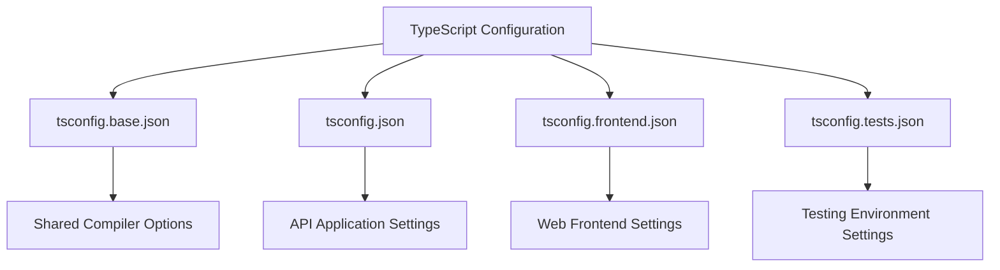
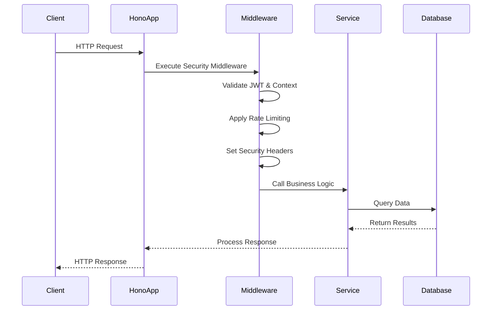
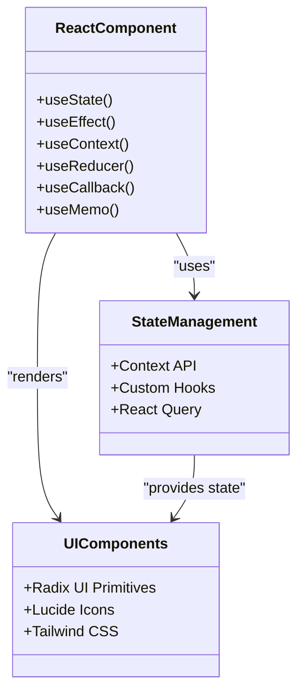
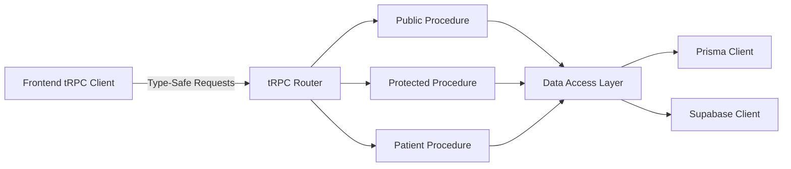
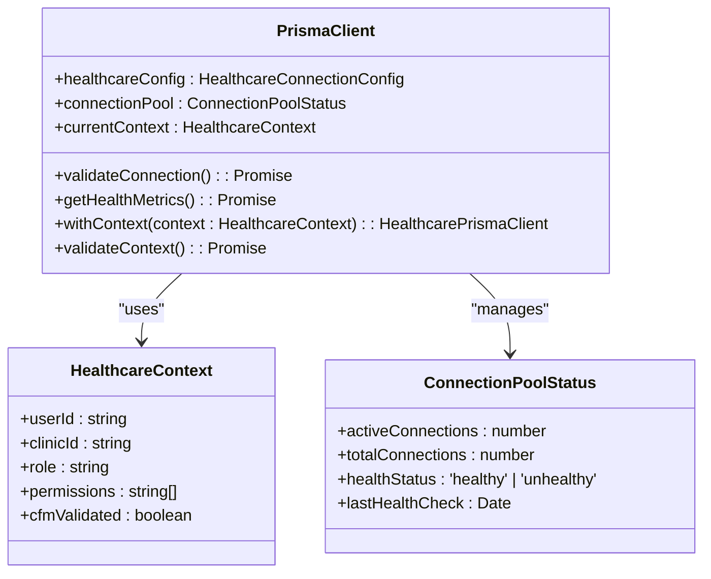
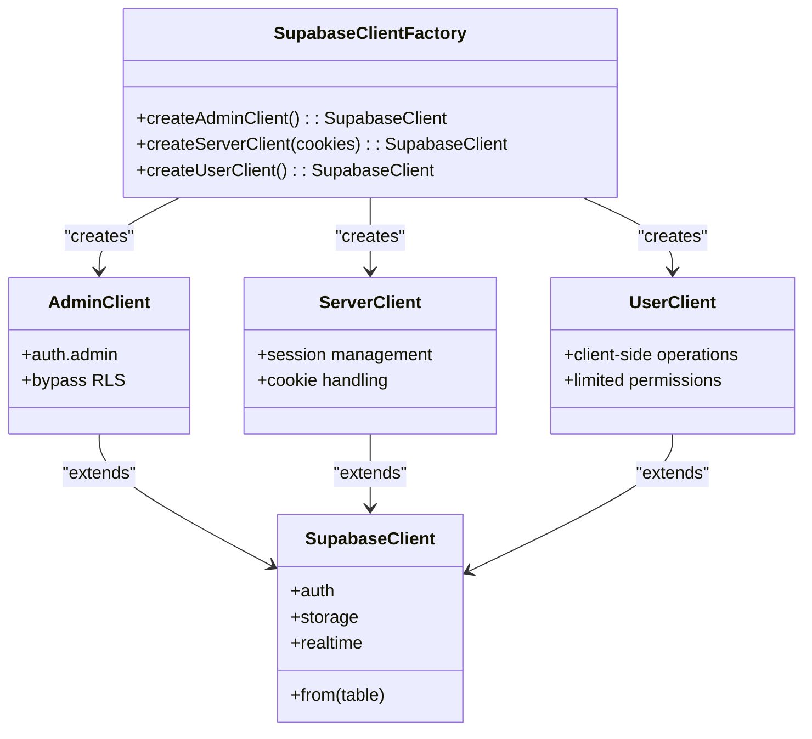
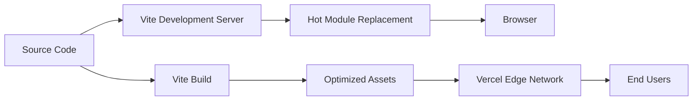

# Technology Stack

<cite>
**Referenced Files in This Document **   
- [package.json](file://apps/api/package.json)
- [package.json](file://apps/web/package.json)
- [requirements.txt](file://apps/ai-agent/requirements.txt)
- [README.md](file://packages/database/migrations/README.md)
- [prisma.ts](file://apps/api/src/clients/prisma.ts)
- [supabase.ts](file://apps/api/src/clients/supabase.ts)
- [context.ts](file://apps/api/src/trpc/context.ts)
- [hono.ts](file://apps/api/src/trpc/hono.ts)
- [vite.config.ts](file://minimal-deployment/vite.config.ts)
</cite>

## Table of Contents
1. [Introduction](#introduction)
2. [Programming Languages](#programming-languages)
3. [Backend Frameworks and Libraries](#backend-frameworks-and-libraries)
4. [Frontend Technologies](#frontend-technologies)
5. [Database and ORM Solutions](#database-and-orm-solutions)
6. [AI Agent Services](#ai-agent-services)
7. [Build and Testing Tools](#build-and-testing-tools)
8. [Integration Patterns](#integration-patterns)
9. [Tooling Setup Issues and Solutions](#tooling-setup-issues-and-solutions)
10. [Performance Considerations](#performance-considerations)
11. [Best Practices](#best-practices)

## Introduction
The neonpro project employs a sophisticated technology stack designed to deliver a high-performance, compliant healthcare platform for Brazilian aesthetic clinics. This document provides comprehensive coverage of the technologies used across the system, detailing both conceptual overviews for beginners and technical specifics for experienced developers. The architecture leverages TypeScript for full-stack development, Python for AI agent services, and SQL for database migrations, creating a robust foundation that supports regulatory compliance with LGPD, CFM, and ANVISA standards.

**Section sources**
- [package.json](file://apps/api/package.json)
- [package.json](file://apps/web/package.json)
- [requirements.txt](file://apps/ai-agent/requirements.txt)

## Programming Languages

### TypeScript
TypeScript serves as the primary language for both frontend and backend development in the neonpro project. Its implementation provides strong typing, enhanced IDE support, and improved code maintainability across the entire stack. The configuration files such as `tsconfig.json` and related variants (`tsconfig.base.json`, `tsconfig.frontend.json`) demonstrate a sophisticated setup with composite projects, path aliases, and strict type checking enabled.

The project utilizes TypeScript 5.9.2, leveraging modern features like decorators, const assertions, and improved control flow analysis. The configuration extends from a base file (`tsconfig.base.json`) to specialized configurations for different parts of the application, ensuring consistent typing rules while allowing for environment-specific optimizations.

**Diagram sources **
- [tsconfig.json](file://tsconfig.json)
- [tsconfig.base.json](file://tsconfig.base.json)
- [tsconfig.frontend.json](file://tsconfig.frontend.json)

### Python
Python powers the AI agent services within the neonpro ecosystem, specifically in the `ai-agent` application. The requirements.txt file reveals a comprehensive set of dependencies focused on AI/ML capabilities, including OpenAI, Anthropic, LangChain, and FastAPI. This indicates a microservices architecture where AI functionality is decoupled from the main application.

The Python environment uses modern versions of critical packages: openai>=1.35.0, fastapi>=0.110.0, and pydantic>=2.7.0, ensuring compatibility with contemporary AI development practices. The inclusion of Brazilian healthcare-specific libraries like `cpf>=0.4.0` demonstrates localization considerations in the technology selection.

**Section sources**
- [requirements.txt](file://apps/ai-agent/requirements.txt)

### SQL
SQL is used extensively for database migrations, particularly in the healthcare compliance implementation. The migration system follows a structured approach with versioned SQL scripts that implement Brazilian regulatory requirements (LGPD, CFM, ANVISA). These migrations create multi-schema databases with dedicated schemas for public data, audit logging, and LGPD-specific compliance data.

The migration strategy includes rollback procedures, post-migration verification steps, and comprehensive audit trails. Performance optimizations are implemented through carefully designed indexes on critical fields like patient CPF and CNS numbers, appointment scheduling data, and telemedicine session records.

**Section sources**
- [README.md](file://packages/database/migrations/README.md)

## Backend Frameworks and Libraries

### Hono
Hono is the primary backend API framework used in the neonpro project, as evidenced by its presence in the API package.json dependencies. This lightweight, edge-optimized framework is particularly well-suited for the healthcare platform's requirements, offering excellent performance characteristics and seamless integration with Vercel's edge runtime.

Hono's middleware system enables the implementation of critical healthcare compliance features such as authentication, rate limiting, security headers, and error handling. The framework's modular design allows for the creation of specialized middleware for LGPD compliance, CFM validation, and ANVISA regulatory requirements.

**Diagram sources **
- [package.json](file://apps/api/package.json)
- [middleware](file://apps/api/src/middleware)

### FastAPI
FastAPI serves as the framework for AI agent services, providing a modern, high-performance solution for building APIs in Python. Its integration with Pydantic ensures robust data validation and serialization, which is critical for maintaining data integrity in healthcare applications.

The framework's async capabilities enable efficient handling of AI operations, which often involve long-running processes and external API calls. FastAPI's automatic OpenAPI documentation generation supports transparency and ease of integration between the AI agents and the main application.

**Section sources**
- [requirements.txt](file://apps/ai-agent/requirements.txt)

## Frontend Technologies

### React
React forms the foundation of the frontend UI, powering the interactive healthcare platform interface. The project uses React 19.0.1, taking advantage of concurrent rendering features for improved user experience during complex operations like patient data loading and AI-powered diagnostics.

The implementation follows modern React patterns with hooks, context for state management, and server components where applicable. The minimal-test-runner.js file demonstrates a simplified React implementation for testing purposes, indicating a focus on performance and reliability.

**Diagram sources **
- [package.json](file://apps/web/package.json)
- [minimal-test-runner.js](file://apps/web/minimal-test-runner.js)

### tRPC
tRPC provides type-safe APIs between the frontend and backend, eliminating the need for manual API documentation and reducing runtime errors. The implementation in neonpro ensures end-to-end type safety from database to UI, which is particularly valuable in a healthcare context where data accuracy is paramount.

The tRPC configuration includes context creation that integrates both Prisma and Supabase clients, enabling rich data operations within procedures. The use of superjson as a transformer allows for serialization of complex data types like dates and maps, which are common in healthcare data models.

**Diagram sources **
- [context.ts](file://apps/api/src/trpc/context.ts)
- [index.ts](file://apps/api/src/trpc/index.ts)

## Database and ORM Solutions

### Prisma
Prisma serves as the ORM layer, providing a type-safe interface to the PostgreSQL database. The implementation is heavily customized for healthcare compliance, featuring Row Level Security (RLS) policies, multi-tenant isolation, and LGPD-specific data protection measures.

The Prisma client is extended with healthcare-specific methods and configuration options, including connection pooling optimized for healthcare workloads and health monitoring capabilities. The schema.prisma file (referenced in package.json) defines models that incorporate Brazilian regulatory requirements, with fields for consent tracking, data retention schedules, and professional validation.

**Diagram sources **
- [prisma.ts](file://apps/api/src/clients/prisma.ts)
- [README-PRISMA-HEALTHCARE.md](file://apps/api/src/README-PRISMA-HEALTHCARE.md)

### Supabase
Supabase provides the underlying PostgreSQL database with additional features like real-time subscriptions, authentication, and storage. The neonpro implementation uses Supabase in a three-tier architecture with different client types for various use cases:

1. Admin client for service role operations
2. Server client for SSR and API routes
3. User client for browser-based operations

This architecture ensures proper separation of concerns and security boundaries, preventing misuse of privileged operations in user-facing contexts.

**Diagram sources **
- [supabase.ts](file://apps/api/src/clients/supabase.ts)
- [supabase-architecture.test.ts](file://apps/api/src/clients/__tests__/supabase-architecture.test.ts)

## AI Agent Services
The AI agent services are implemented as a separate Python application using FastAPI and various AI/ML libraries. This microservice architecture allows for independent scaling and deployment of AI capabilities without affecting the main application.

The agent services integrate with the AG-UI protocol, suggesting a standardized interface for AI interactions within the platform. Dependencies include langchain for orchestration, openai and anthropic for LLM access, and supabase for data persistence, creating a comprehensive AI stack.

The services are containerized with Docker and can be orchestrated using the tools in the orchestration directory, enabling complex workflows that combine multiple AI agents for healthcare tasks like patient triage, diagnostic assistance, and treatment planning.

**Section sources**
- [requirements.txt](file://apps/ai-agent/requirements.txt)
- [main.py](file://apps/ai-agent/main.py)

## Build and Testing Tools

### Vite
Vite serves as the build tool for the frontend application, providing fast development server startup and hot module replacement. The configuration in vite.config.ts demonstrates optimization for healthcare applications, including code splitting, tree shaking, and bundle analysis.

The build process is configured to generate bundles that comply with healthcare performance requirements, with specific attention to bundle size and load times. The integration with Vercel enables edge deployment, bringing the application closer to users in Brazil for reduced latency.

**Diagram sources **
- [vite.config.ts](file://minimal-deployment/vite.config.ts)
- [package.json](file://apps/web/package.json)

### Vitest
Vitest is the testing framework used throughout the project, providing a modern alternative to Jest with better TypeScript support and faster execution. The configuration files across various packages show a consistent approach to testing with shared settings and best practices.

The testing strategy includes unit tests, integration tests, and end-to-end tests, with specific focus on healthcare compliance scenarios. Test timeouts are extended to accommodate complex healthcare validation logic, and the framework is configured to exit gracefully when no test files are found.

**Section sources**
- [vitest.config.ts](file://packages/monitoring/vitest.config.ts)
- [vitest.config.ts](file://packages/config/vitest.config.ts)

## Integration Patterns
The neonpro project employs several key integration patterns that connect the various technologies into a cohesive system:

1. **Type Safety Chain**: TypeScript interfaces flow from Prisma schema through tRPC to React components, ensuring end-to-end type safety.
2. **Healthcare Context Propagation**: Authentication and authorization context is passed through the stack, enabling RLS and compliance checks.
3. **Event-Driven Architecture**: Supabase real-time features enable reactive updates across the application.
4. **Microservices for AI**: Python-based AI agents communicate with the main application via defined protocols.

These patterns ensure that the system remains maintainable while meeting the stringent requirements of healthcare software.

**Section sources**
- [context.ts](file://apps/api/src/trpc/context.ts)
- [prisma.ts](file://apps/api/src/clients/prisma.ts)

## Tooling Setup Issues and Solutions
Several common tooling issues have been identified and addressed in the neonpro project:

1. **TypeScript Configuration Complexity**: With multiple tsconfig files, developers may encounter confusion about which configuration applies where. The solution is clear documentation and consistent naming conventions.

2. **Dependency Conflicts**: The combination of Prisma, Supabase, and various AI libraries can lead to dependency conflicts. The project addresses this through careful version pinning and regular dependency audits.

3. **Testing Environment Setup**: Configuring Vitest with the correct environment and plugins requires attention to detail. The project provides standardized vitest.config.ts files across packages.

4. **Database Migration Management**: Coordinating migrations across development, staging, and production environments requires careful planning. The project uses Prisma's migration system with verification steps.

**Section sources**
- [tsconfig.json](file://tsconfig.json)
- [package.json](file://apps/api/package.json)

## Performance Considerations
The technology stack has been selected and configured with performance as a critical factor, especially given the healthcare context where responsiveness can impact patient care:

1. **Edge Optimization**: Both Hono and Vite are optimized for edge deployment, reducing latency for users in Brazil.
2. **Connection Pooling**: Prisma and Supabase clients implement intelligent connection pooling to handle high concurrency.
3. **Bundle Size**: The build process includes bundle analysis to ensure optimal load times.
4. **Query Optimization**: Database queries are carefully crafted with appropriate indexes for healthcare workflows.

Monitoring tools track performance metrics, and the system includes health check endpoints to verify operational status.

**Section sources**
- [prisma.ts](file://apps/api/src/clients/prisma.ts)
- [vite.config.ts](file://minimal-deployment/vite.config.ts)

## Best Practices
The neonpro project exemplifies several best practices in modern web development:

1. **Strict Type Safety**: Comprehensive TypeScript usage throughout the stack minimizes runtime errors.
2. **Security First**: The three-tier Supabase client architecture prevents privilege escalation.
3. **Compliance by Design**: Regulatory requirements are baked into the technology choices and implementation.
4. **Test Coverage**: Extensive testing at all levels ensures reliability and maintainability.
5. **Performance Monitoring**: Built-in metrics and health checks enable proactive issue detection.

These practices ensure that the application not only meets functional requirements but also maintains the highest standards of quality, security, and reliability required for healthcare software.

**Section sources**
- [supabase.ts](file://apps/api/src/clients/supabase.ts)
- [prisma.ts](file://apps/api/src/clients/prisma.ts)
- [context.ts](file://apps/api/src/trpc/context.ts)