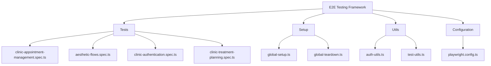
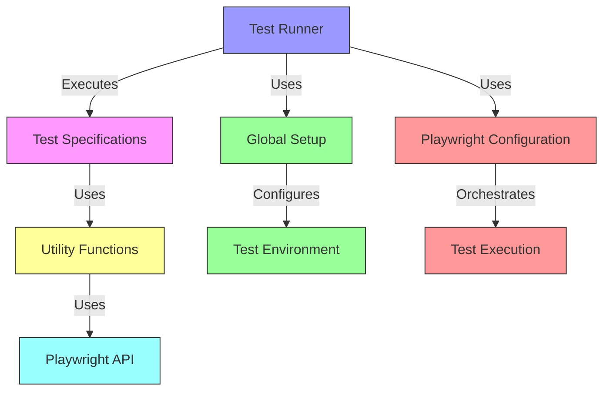
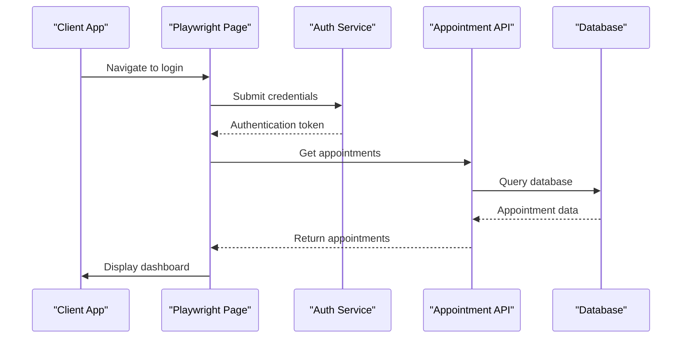
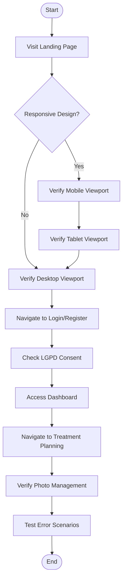
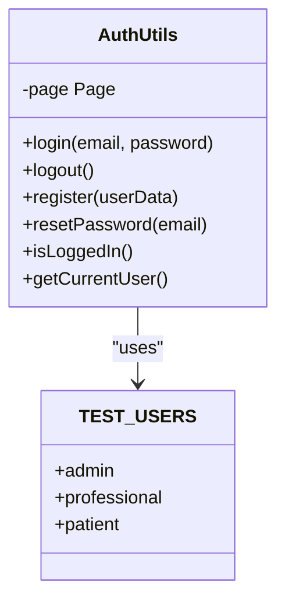
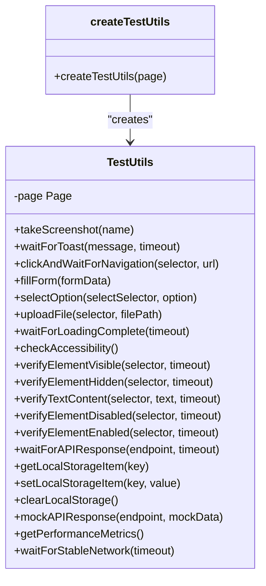
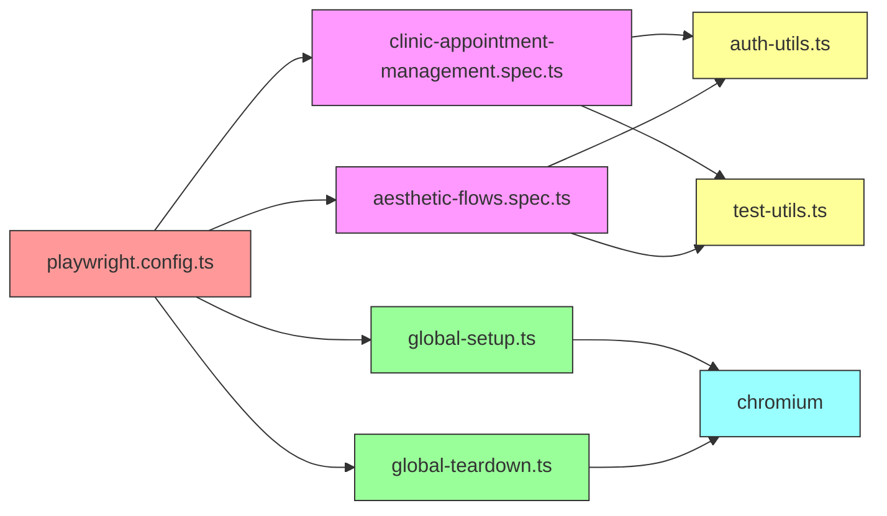

# End-to-End Testing

<cite>
**Referenced Files in This Document **   
- [clinic-appointment-management.spec.ts](file://apps/tools/e2e/clinic-appointment-management.spec.ts)
- [aesthetic-flows.spec.ts](file://apps/tools/e2e/aesthetic-flows.spec.ts)
- [playwright.config.ts](file://apps/tools/playwright.config.ts)
- [global-setup.ts](file://apps/tools/e2e/setup/global-setup.ts)
- [global-teardown.ts](file://apps/tools/e2e/setup/global-teardown.ts)
- [auth-utils.ts](file://apps/tools/e2e/utils/auth-utils.ts)
- [test-utils.ts](file://apps/tools/e2e/utils/test-utils.ts)
- [TESTING_STRATEGY.md](file://apps/web/TESTING_STRATEGY.md)
- [IMPLEMENTATION-SUMMARY.md](file://apps/web/docs/testing/IMPLEMENTATION-SUMMARY.md)
</cite>

## Table of Contents
1. [Introduction](#introduction)
2. [Project Structure](#project-structure)
3. [Core Components](#core-components)
4. [Architecture Overview](#architecture-overview)
5. [Detailed Component Analysis](#detailed-component-analysis)
6. [Dependency Analysis](#dependency-analysis)
7. [Performance Considerations](#performance-considerations)
8. [Troubleshooting Guide](#troubleshooting-guide)
9. [Conclusion](#conclusion)

## Introduction
The NeonPro project implements a comprehensive end-to-end testing strategy using Playwright for browser automation, focusing on critical healthcare workflows in aesthetic clinics. The testing framework covers complete user journeys from authentication to complex clinical operations, ensuring reliability and compliance with Brazilian healthcare regulations (LGPD). The system tests key scenarios including patient registration with document upload, appointment booking with conflict validation, and AI-assisted treatment planning. Through sophisticated test organization and infrastructure, the framework addresses common E2E testing challenges such as flakiness in dynamic interfaces, asynchronous UI updates in telemedicine features, and responsive design across viewport sizes.

## Project Structure
The end-to-end testing infrastructure is organized within the `apps/tools/e2e` directory, following a modular structure that separates concerns for maintainability and scalability. The main components include test specifications, setup/teardown scripts, utility functions, and configuration files. Test files are categorized by workflow type, with specific files for clinic appointment management, aesthetic flows, and authentication. Utility modules provide reusable functions for authentication handling and general test operations. The global setup and teardown scripts manage test environment initialization and cleanup, while the Playwright configuration file defines browser targets, execution parameters, and reporting mechanisms.

**Diagram sources **
- [clinic-appointment-management.spec.ts](file://apps/tools/e2e/clinic-appointment-management.spec.ts)
- [aesthetic-flows.spec.ts](file://apps/tools/e2e/aesthetic-flows.spec.ts)
- [playwright.config.ts](file://apps/tools/playwright.config.ts)
- [global-setup.ts](file://apps/tools/e2e/setup/global-setup.ts)
- [global-teardown.ts](file://apps/tools/e2e/setup/global-teardown.ts)
- [auth-utils.ts](file://apps/tools/e2e/utils/auth-utils.ts)
- [test-utils.ts](file://apps/tools/e2e/utils/test-utils.ts)

**Section sources**
- [clinic-appointment-management.spec.ts](file://apps/tools/e2e/clinic-appointment-management.spec.ts)
- [aesthetic-flows.spec.ts](file://apps/tools/e2e/aesthetic-flows.spec.ts)
- [playwright.config.ts](file://apps/tools/playwright.config.ts)

## Core Components
The end-to-end testing framework consists of several core components that work together to provide comprehensive coverage of the NeonPro application. The test specifications define the actual test cases for various user journeys, including appointment management, aesthetic workflows, and authentication processes. The Playwright configuration file orchestrates test execution across multiple browsers and devices, with specific settings for desktop, mobile, and tablet viewports. Global setup and teardown scripts ensure proper initialization and cleanup of the test environment, while utility classes provide reusable functionality for authentication and common test operations.

**Section sources**
- [clinic-appointment-management.spec.ts](file://apps/tools/e2e/clinic-appointment-management.spec.ts)
- [aesthetic-flows.spec.ts](file://apps/tools/e2e/aesthetic-flows.spec.ts)
- [playwright.config.ts](file://apps/tools/playwright.config.ts)
- [global-setup.ts](file://apps/tools/e2e/setup/global-setup.ts)
- [global-teardown.ts](file://apps/tools/e2e/setup/global-teardown.ts)
- [auth-utils.ts](file://apps/tools/e2e/utils/auth-utils.ts)
- [test-utils.ts](file://apps/tools/e2e/utils/test-utils.ts)

## Architecture Overview
The end-to-end testing architecture follows a layered approach with clear separation between test definitions, execution configuration, and supporting utilities. At the foundation, the Playwright configuration defines the test environment, including browser targets, viewport sizes, and execution parameters. Above this layer, the global setup and teardown scripts manage the lifecycle of the test suite, preparing the environment before tests run and cleaning up afterward. The utility layer provides reusable functions for common operations like authentication and API mocking. Finally, the test specification layer contains the actual test cases organized by workflow type, each describing complete user journeys through the application.

**Diagram sources **
- [playwright.config.ts](file://apps/tools/playwright.config.ts)
- [global-setup.ts](file://apps/tools/e2e/setup/global-setup.ts)
- [global-teardown.ts](file://apps/tools/e2e/setup/global-teardown.ts)
- [auth-utils.ts](file://apps/tools/e2e/utils/auth-utils.ts)
- [test-utils.ts](file://apps/tools/e2e/utils/test-utils.ts)
- [clinic-appointment-management.spec.ts](file://apps/tools/e2e/clinic-appointment-management.spec.ts)
- [aesthetic-flows.spec.ts](file://apps/tools/e2e/aesthetic-flows.spec.ts)

## Detailed Component Analysis

### Clinic Appointment Management Analysis
The clinic appointment management tests cover the complete lifecycle of appointments from booking to cancellation, with special attention to business-critical features like the anti-no-show engine and WhatsApp integration. These tests validate both professional and client perspectives, ensuring that all stakeholders have appropriate access and functionality. The test suite includes verification of appointment dashboards, calendar views, statistics, and real-time updates. It also tests advanced features like AI time optimization, recurring appointments, and conflict detection.

#### For API/Service Components:

**Diagram sources **
- [clinic-appointment-management.spec.ts](file://apps/tools/e2e/clinic-appointment-management.spec.ts)

**Section sources**
- [clinic-appointment-management.spec.ts](file://apps/tools/e2e/clinic-appointment-management.spec.ts)

### Aesthetic Flows Analysis
The aesthetic flows tests validate the complete user journey through the NeonPro platform, from initial landing page interaction to treatment planning. These tests verify responsive design across multiple viewport sizes, ensuring optimal user experience on desktop, tablet, and mobile devices. They also test critical compliance features like LGPD consent management during registration and photo consent for before/after images. The test suite includes navigation flows, error handling scenarios, and accessibility checks to ensure inclusive design.

#### For Complex Logic Components:

**Diagram sources **
- [aesthetic-flows.spec.ts](file://apps/tools/e2e/aesthetic-flows.spec.ts)

**Section sources**
- [aesthetic-flows.spec.ts](file://apps/tools/e2e/aesthetic-flows.spec.ts)

### Authentication Utilities Analysis
The authentication utilities provide a reusable class-based interface for common authentication operations, encapsulating the complexity of login, logout, registration, and password reset flows. This abstraction allows test authors to focus on business logic rather than implementation details of authentication. The utilities handle waiting for form elements, filling credentials, clicking buttons, and verifying successful navigation. They also provide methods to check login status and retrieve current user information, enabling state verification in tests.

#### For Object-Oriented Components:

**Diagram sources **
- [auth-utils.ts](file://apps/tools/e2e/utils/auth-utils.ts)

**Section sources**
- [auth-utils.ts](file://apps/tools/e2e/utils/auth-utils.ts)

### Test Utilities Analysis
The test utilities class provides a comprehensive set of helper methods for common testing operations beyond authentication. These include screenshot capture, toast message waiting, form filling, file uploading, and API response interception. The utilities also offer accessibility checking, performance metrics collection, and local storage manipulation. By centralizing these functions, the framework promotes consistency across tests and reduces code duplication. The mockAPIResponse method enables controlled test conditions by intercepting and fulfilling requests with predefined data.

#### For Object-Oriented Components:

**Diagram sources **
- [test-utils.ts](file://apps/tools/e2e/utils/test-utils.ts)

**Section sources**
- [test-utils.ts](file://apps/tools/e2e/utils/test-utils.ts)

## Dependency Analysis
The end-to-end testing framework has well-defined dependencies between its components, with clear import relationships and execution order. The test specifications depend on the utility classes for authentication and general operations, while the global setup and teardown scripts are automatically invoked by Playwright based on the configuration. The Playwright configuration file serves as the central orchestrator, defining which tests to run, on which browsers, and with what parameters. All components ultimately depend on the Playwright runtime for browser automation capabilities.

**Diagram sources **
- [playwright.config.ts](file://apps/tools/playwright.config.ts)
- [clinic-appointment-management.spec.ts](file://apps/tools/e2e/clinic-appointment-management.spec.ts)
- [aesthetic-flows.spec.ts](file://apps/tools/e2e/aesthetic-flows.spec.ts)
- [global-setup.ts](file://apps/tools/e2e/setup/global-setup.ts)
- [global-teardown.ts](file://apps/tools/e2e/setup/global-teardown.ts)
- [auth-utils.ts](file://apps/tools/e2e/utils/auth-utils.ts)
- [test-utils.ts](file://apps/tools/e2e/utils/test-utils.ts)

**Section sources**
- [playwright.config.ts](file://apps/tools/playwright.config.ts)
- [clinic-appointment-management.spec.ts](file://apps/tools/e2e/clinic-appointment-management.spec.ts)
- [aesthetic-flows.spec.ts](file://apps/tools/e2e/aesthetic-flows.spec.ts)
- [global-setup.ts](file://apps/tools/e2e/setup/global-setup.ts)
- [global-teardown.ts](file://apps/tools/e2e/setup/global-teardown.ts)
- [auth-utils.ts](file://apps/tools/e2e/utils/auth-utils.ts)
- [test-utils.ts](file://apps/tools/e2e/utils/test-utils.ts)

## Performance Considerations
The end-to-end testing framework incorporates several performance optimizations to ensure efficient test execution. The Playwright configuration enables fully parallel test execution with multiple worker processes, significantly reducing overall test suite duration. Retry mechanisms are implemented for flaky tests, with increased retry counts in CI environments. The configuration also optimizes resource usage by reusing existing server instances during development and adjusting timeout values based on the execution environment. Video recording and trace collection are configured to retain artifacts only on failure in CI, minimizing storage requirements while preserving diagnostic information for failing tests.

**Section sources**
- [playwright.config.ts](file://apps/tools/playwright.config.ts)

## Troubleshooting Guide
Common issues in the end-to-end testing framework typically relate to test flakiness, environment setup, or network conditions. For flaky tests, the framework provides retry mechanisms and configurable timeouts to accommodate variable response times. Environment issues can often be resolved by ensuring the global setup script completes successfully and that test data is properly initialized. Network-related problems may require adjusting the navigationTimeout and general timeout values in the Playwright configuration. When debugging specific test failures, running tests in headed mode with trace collection enabled can provide valuable insights into the sequence of events leading to the failure.

**Section sources**
- [playwright.config.ts](file://apps/tools/playwright.config.ts)
- [global-setup.ts](file://apps/tools/e2e/setup/global-setup.ts)
- [global-teardown.ts](file://apps/tools/e2e/setup/global-teardown.ts)

## Conclusion
The end-to-end testing strategy for the NeonPro project provides comprehensive coverage of critical healthcare workflows using Playwright for browser automation. The framework effectively tests complete user journeys from authentication to complex clinical operations, with specialized attention to business-critical features like appointment management, anti-no-show prediction, and WhatsApp integration. Through modular organization, reusable utilities, and sophisticated configuration, the system addresses common E2E testing challenges while ensuring compliance with Brazilian healthcare regulations. The implementation demonstrates a mature testing approach that balances thoroughness with efficiency, providing confidence in the reliability and quality of the NeonPro application.