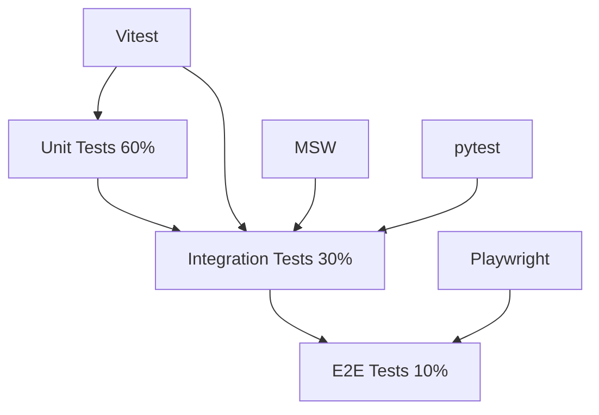
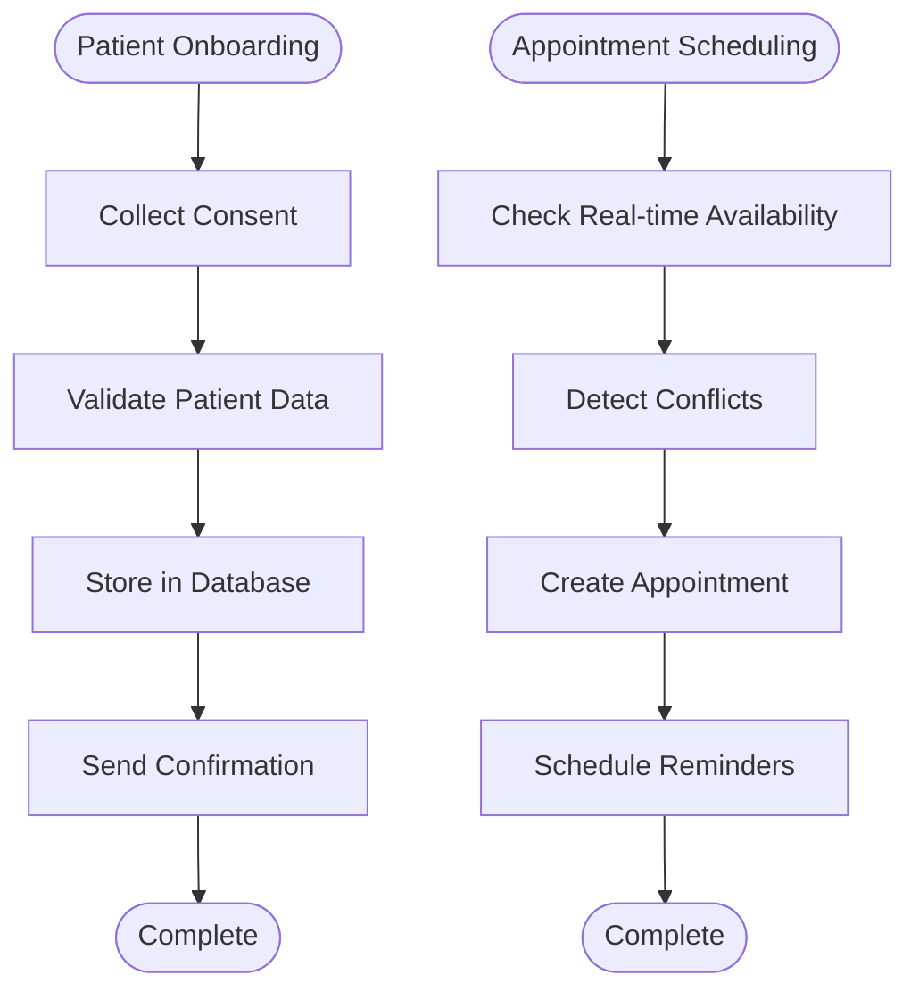
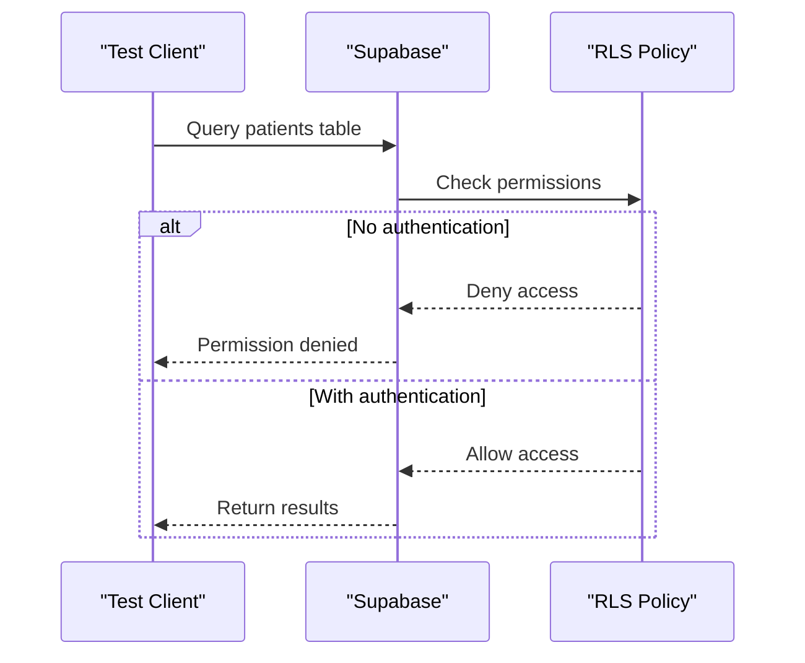
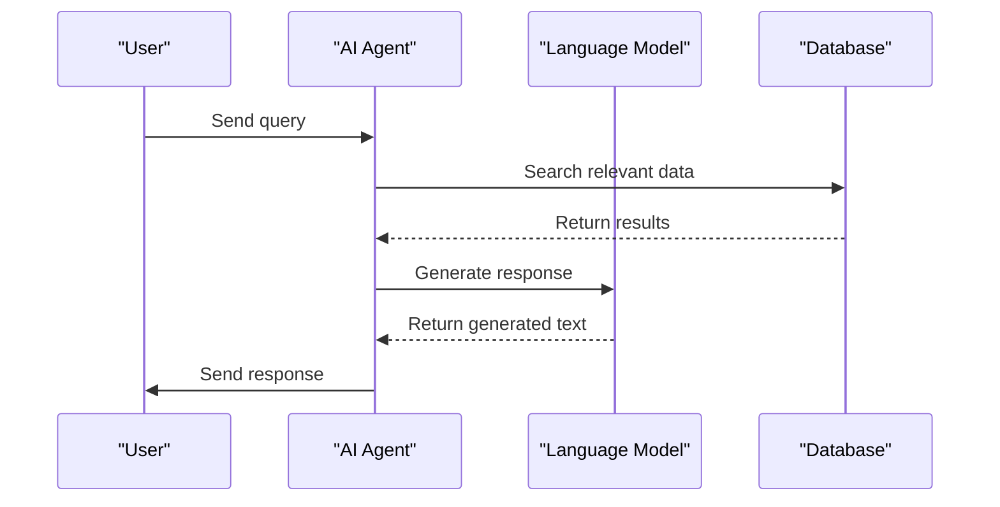
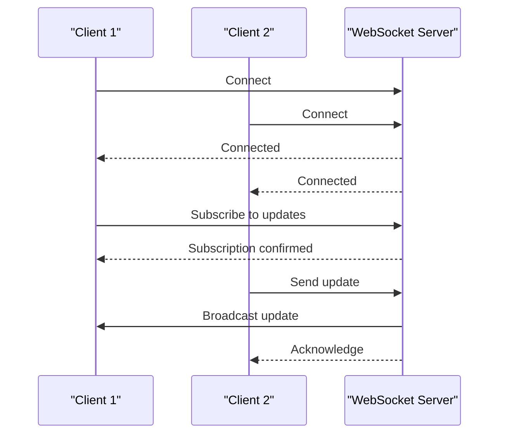
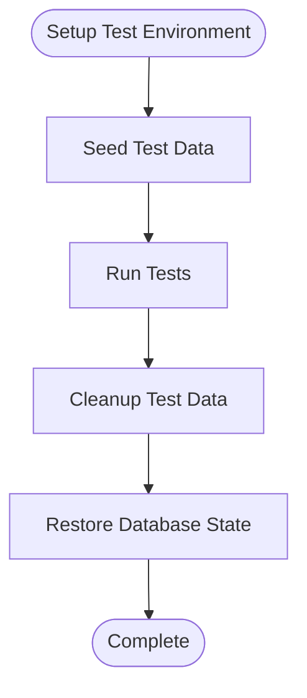
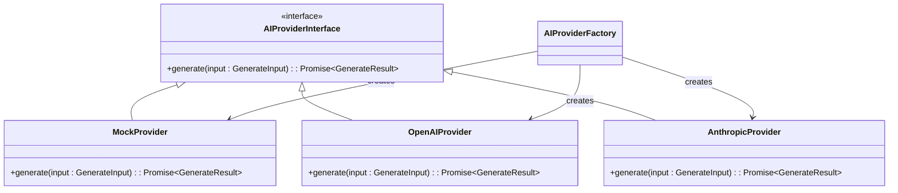
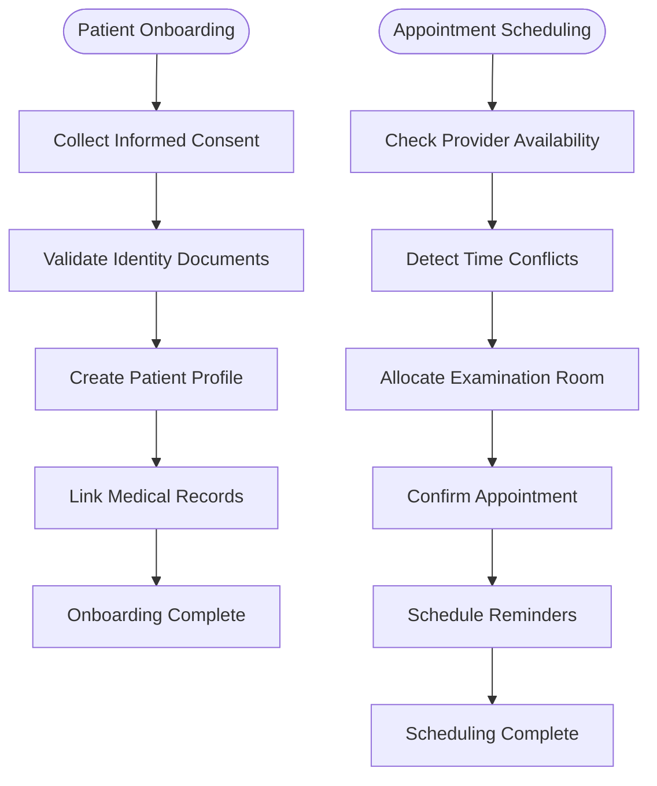

# Integration Testing

<cite>
**Referenced Files in This Document **   
- [supabase-connectivity.test.ts](file://apps/api/src/__tests__/integration/supabase-connectivity.test.ts)
- [ai-agent-system.test.ts](file://apps/api/src/__tests__/integration/ai-agent-system.test.ts)
- [test_integration.py](file://apps/ai-agent/tests/test_integration.py)
- [README_TESTS.md](file://apps/ai-agent/README_TESTS.md)
- [TESTING_STRATEGY.md](file://apps/web/TESTING_STRATEGY.md)
- [vitest.config.integration.ts](file://apps/web/vitest.config.integration.ts)
</cite>

## Table of Contents
1. [Introduction](#introduction)
2. [Integration Testing Strategy](#integration-testing-strategy)
3. [Core Components and Workflows](#core-components-and-workflows)
4. [Database and RLS Testing](#database-and-rls-testing)
5. [AI Agent System Integration](#ai-agent-system-integration)
6. [WebSocket Communication Testing](#websocket-communication-testing)
7. [tRPC Procedure Execution](#trpc-procedure-execution)
8. [Test Data Management](#test-data-management)
9. [External Service Mocking](#external-service-mocking)
10. [Healthcare Workflow Testing](#healthcare-workflow-testing)
11. [Common Issues and Solutions](#common-issues-and-solutions)
12. [Conclusion](#conclusion)

## Introduction

The integration testing approach in the neonpro project focuses on validating component interactions across service boundaries, ensuring that different parts of the system work together as expected. This document provides a comprehensive overview of the integration testing strategy, covering API endpoints with database persistence, AI agent communication through WebSockets, and tRPC procedure execution with proper context.

The testing framework is designed to be accessible to beginners while providing sufficient technical depth for advanced topics such as testing Row Level Security (RLS) policies and cross-service transaction consistency. The approach emphasizes realistic test data, database transaction rollback strategies, and external service mocking for Supabase and AI providers.

**Section sources**
- [README_TESTS.md](file://apps/ai-agent/README_TESTS.md#L1-L20)
- [TESTING_STRATEGY.md](file://apps/web/TESTING_STRATEGY.md#L1-L10)

## Integration Testing Strategy

The integration testing strategy in neonpro follows a structured approach that combines unit, integration, and end-to-end tests to ensure comprehensive coverage. The testing pyramid prioritizes unit tests (60%), followed by integration tests (30%), and end-to-end tests (10%).

The framework uses Vitest for JavaScript/TypeScript testing and pytest for Python services, with Playwright for end-to-end testing. Integration tests are organized into specific categories including healthcare compliance, database operations, AI agent functionality, and real-time communication.

Key aspects of the strategy include:
- Using MSW (Mock Service Worker) for API mocking
- Implementing realistic test data patterns
- Ensuring LGPD compliance in test scenarios
- Supporting parallel test execution
- Maintaining high code coverage thresholds

**Diagram sources **
- [TESTING_STRATEGY.md](file://apps/web/TESTING_STRATEGY.md#L15-L25)
- [vitest.config.integration.ts](file://apps/web/vitest.config.integration.ts#L1-L10)

**Section sources**
- [TESTING_STRATEGY.md](file://apps/web/TESTING_STRATEGY.md#L1-L50)
- [vitest.config.integration.ts](file://apps/web/vitest.config.integration.ts#L1-L20)

## Core Components and Workflows

The integration testing framework covers several core components and workflows critical to the neonpro application. These include patient onboarding with consent management, appointment scheduling with real-time availability checks, and AI-powered client analytics.

For patient onboarding, tests validate the complete workflow from initial registration through consent collection and data storage. Appointment scheduling tests verify real-time availability checks and conflict detection. AI agent tests cover query processing, intent detection, and response generation.

The framework also tests complex healthcare workflows such as treatment planning, financial transactions, and medical record access, ensuring all components interact correctly across service boundaries.

**Diagram sources **
- [ai-agent-system.test.ts](file://apps/api/src/__tests__/integration/ai-agent-system.test.ts#L1-L50)
- [test_integration.py](file://apps/ai-agent/tests/test_integration.py#L1-L50)

**Section sources**
- [ai-agent-system.test.ts](file://apps/api/src/__tests__/integration/ai-agent-system.test.ts#L1-L100)
- [test_integration.py](file://apps/ai-agent/tests/test_integration.py#L1-L100)

## Database and RLS Testing

Database integration testing in neonpro focuses on verifying connectivity, data persistence, and security policies. The framework includes comprehensive tests for Supabase connectivity and Row Level Security (RLS) enforcement.

Tests validate that anonymous clients cannot access protected tables without proper authentication, while service role keys can bypass RLS when appropriate. The RLS query builder is tested to ensure it properly handles user context and applies appropriate security constraints.

Database transaction rollback strategies are implemented using beforeEach and afterEach hooks to ensure test isolation. Test data is automatically cleaned up after each test run to prevent interference between test cases.

**Diagram sources **
- [supabase-connectivity.test.ts](file://apps/api/src/__tests__/integration/supabase-connectivity.test.ts#L1-L50)
- [test_integration.py](file://apps/ai-agent/tests/test_integration.py#L1-L50)

**Section sources**
- [supabase-connectivity.test.ts](file://apps/api/src/__tests__/integration/supabase-connectivity.test.ts#L1-L200)
- [test_integration.py](file://apps/ai-agent/tests/test_integration.py#L1-L200)

## AI Agent System Integration

The AI agent system integration tests validate the complete workflow from query processing to response generation. These tests cover multiple aspects of the AI agent functionality, including intent detection, entity extraction, and response generation.

Tests use mocked external services such as OpenAI, Anthropic, and Google AI providers to simulate real-world conditions without incurring costs or depending on external availability. The mock services allow testing various scenarios, including successful responses, rate limiting, and service failures.

The framework tests both synchronous REST API calls and asynchronous WebSocket communication, ensuring the AI agent can handle different interaction patterns. Error handling is thoroughly tested, including database connection failures, API rate limiting, and invalid query formats.

**Diagram sources **
- [ai-agent-system.test.ts](file://apps/api/src/__tests__/integration/ai-agent-system.test.ts#L1-L50)
- [test_integration.py](file://apps/ai-agent/tests/test_integration.py#L1-L50)

**Section sources**
- [ai-agent-system.test.ts](file://apps/api/src/__tests__/integration/ai-agent-system.test.ts#L1-L300)
- [test_integration.py](file://apps/ai-agent/tests/test_integration.py#L1-L300)

## WebSocket Communication Testing

WebSocket integration testing ensures reliable real-time communication between clients and the AI agent service. The framework tests connection management, message routing, and real-time updates.

Tests validate that WebSocket connections are properly established and authenticated. Message handling is tested for various types including queries, subscriptions, and control messages. The framework verifies that broadcast messages are delivered to all subscribed clients and that subscription filtering works correctly.

Performance testing includes handling concurrent WebSocket connections and measuring latency under load. Error recovery scenarios are tested, such as reconnection after network interruptions and message queueing during temporary disconnections.

**Diagram sources **
- [test_integration.py](file://apps/ai-agent/tests/test_integration.py#L1-L50)
- [README_TESTS.md](file://apps/ai-agent/README_TESTS.md#L1-L50)

**Section sources**
- [test_integration.py](file://apps/ai-agent/tests/test_integration.py#L1-L200)
- [README_TESTS.md](file://apps/ai-agent/README_TESTS.md#L50-L100)

## tRPC Procedure Execution

tRPC procedure integration testing validates type-safe RPC calls between frontend and backend services. The framework ensures that procedures execute with proper context and return correctly typed responses.

Tests cover authentication context propagation, input validation, and error handling. The type safety of tRPC is verified by testing both valid and invalid input scenarios, ensuring appropriate TypeScript types are enforced at runtime.

Procedure batching is tested to ensure multiple requests are handled efficiently. Performance metrics are collected for procedure execution time and resource usage under various load conditions.

**Section sources**
- [ai-agent-system.test.ts](file://apps/api/src/__tests__/integration/ai-agent-system.test.ts#L1-L50)
- [test_integration.py](file://apps/ai-agent/tests/test_integration.py#L1-L50)

## Test Data Management

Test data management in neonpro follows a structured approach to ensure realistic and consistent testing scenarios. The framework uses fixtures and factories to generate realistic Brazilian healthcare data, including patient records with CPFs, appointment histories, and financial transactions.

Test data isolation is maintained through database transaction rollback strategies and dedicated test databases. Each test suite sets up its own data environment and cleans up after execution to prevent interference between tests.

Realistic data patterns are used, including:
- Brazilian names and addresses
- CPF and SUS card numbers
- Healthcare appointment schedules
- Medical treatment plans
- Financial payment histories

Data seeding functions create consistent test environments, while cleanup functions ensure database state is restored after each test run.

**Diagram sources **
- [test_integration.py](file://apps/ai-agent/tests/test_integration.py#L1-L50)
- [README_TESTS.md](file://apps/ai-agent/README_TESTS.md#L1-L50)

**Section sources**
- [test_integration.py](file://apps/ai-agent/tests/test_integration.py#L1-L150)
- [README_TESTS.md](file://apps/ai-agent/README_TESTS.md#L100-L150)

## External Service Mocking

External service mocking is a critical component of the integration testing framework, allowing tests to run reliably without depending on external APIs. The framework mocks several key services:

- **Supabase**: Database and authentication services
- **AI Providers**: OpenAI, Anthropic, and Google AI services
- **OCR Services**: Document text extraction
- **Validation Services**: CPF, email, and phone validation
- **Machine Learning Services**: Prediction models

Mocks are implemented using Jest for TypeScript services and unittest.mock for Python services. The mock implementations provide realistic responses while allowing test scenarios to be controlled and predictable.

The AI provider factory includes a mock provider as the default fallback, ensuring tests can run even when other providers are unavailable. This allows comprehensive testing of failover mechanisms and error handling.

**Diagram sources **
- [ai-provider-factory.ts](file://packages/ai-providers/src/providers/ai-provider-factory.ts#L46-L91)
- [ai-agent-system.test.ts](file://apps/api/src/__tests__/integration/ai-agent-system.test.ts#L1-L50)

**Section sources**
- [ai-provider-factory.ts](file://packages/ai-providers/src/providers/ai-provider-factory.ts#L1-L100)
- [ai-agent-system.test.ts](file://apps/api/src/__tests__/integration/ai-agent-system.test.ts#L50-L150)

## Healthcare Workflow Testing

Healthcare workflow integration testing focuses on complex clinical processes that involve multiple system components. Key workflows tested include patient onboarding with consent management and appointment scheduling with real-time availability checks.

Patient onboarding tests validate the complete process from initial contact through data collection, consent verification, and profile creation. The tests ensure LGPD compliance by verifying audit logging, data retention policies, and consent management.

Appointment scheduling tests verify real-time availability checks, conflict detection, and resource allocation. The framework tests edge cases such as overlapping appointments, provider availability, and room scheduling conflicts.

Other healthcare workflows tested include:
- Treatment planning and progress tracking
- Medical record access and sharing
- Prescription management
- Billing and insurance processing
- Emergency contact management

**Diagram sources **
- [ai-agent-system.test.ts](file://apps/api/src/__tests__/integration/ai-agent-system.test.ts#L1-L50)
- [test_integration.py](file://apps/ai-agent/tests/test_integration.py#L1-L50)

**Section sources**
- [ai-agent-system.test.ts](file://apps/api/src/__tests__/integration/ai-agent-system.test.ts#L150-L300)
- [test_integration.py](file://apps/ai-agent/tests/test_integration.py#L150-L300)

## Common Issues and Solutions

The integration testing framework addresses several common issues encountered in distributed systems testing:

### Test Data Isolation
Problem: Tests interfere with each other due to shared database state.
Solution: Use database transaction rollback and dedicated test databases.

### Timing Dependencies
Problem: Distributed systems have inherent timing dependencies that cause flaky tests.
Solution: Implement retry mechanisms and use mocked time where appropriate.

### Flaky Network-Dependent Tests
Problem: External service dependencies cause unreliable test results.
Solution: Comprehensive mocking of external services and implementation of circuit breakers.

### RLS Policy Testing
Problem: Verifying Row Level Security policies without compromising security.
Solution: Test both allowed and denied scenarios using appropriate authentication contexts.

### Cross-Service Transaction Consistency
Problem: Maintaining data consistency across multiple services.
Solution: Implement distributed transaction patterns and idempotent operations.

The framework includes specific strategies for handling these issues, such as retry mechanisms for flaky tests, comprehensive mocking for external dependencies, and detailed logging for debugging failed tests.

**Section sources**
- [test_integration.py](file://apps/ai-agent/tests/test_integration.py#L1-L50)
- [README_TESTS.md](file://apps/ai-agent/README_TESTS.md#L1-L50)

## Conclusion

The integration testing approach in the neonpro project provides a comprehensive framework for validating component interactions across service boundaries. By focusing on realistic test data, robust mocking strategies, and thorough coverage of critical workflows, the framework ensures high-quality, reliable software delivery.

Key strengths of the approach include:
- Comprehensive coverage of healthcare-specific workflows
- Robust testing of security policies like RLS
- Effective handling of distributed system challenges
- Clear separation of test concerns and responsibilities
- Extensive documentation and onboarding materials

The framework balances accessibility for beginners with technical depth for advanced topics, making it suitable for teams of varying experience levels. By following this approach, the neonpro project maintains high standards of quality and reliability in its healthcare applications.