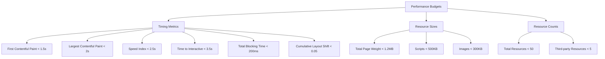
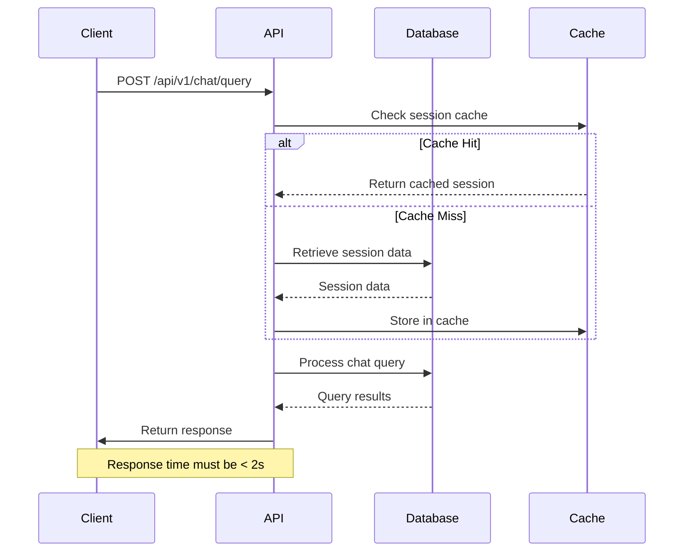
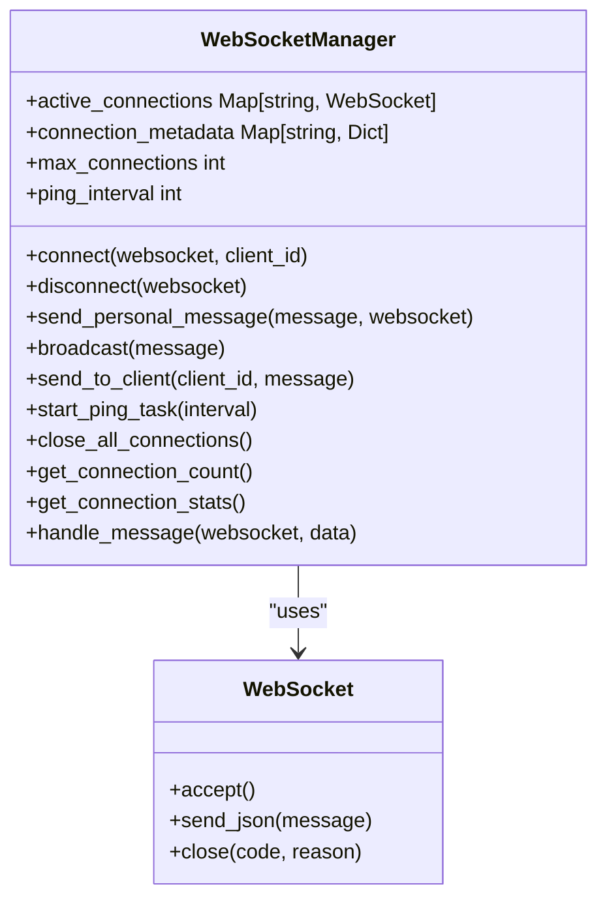
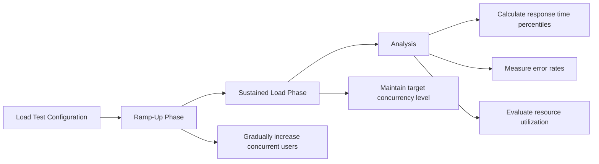
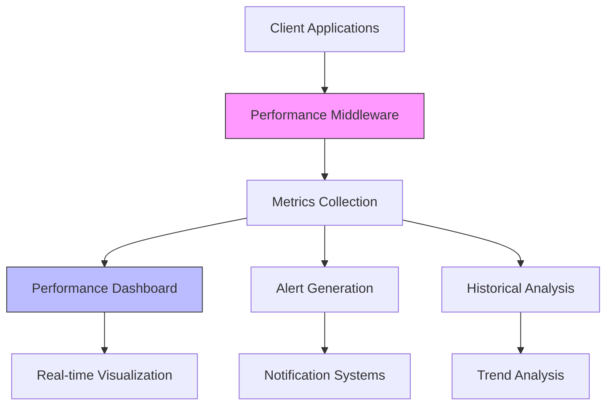

# Performance Testing

<cite>
**Referenced Files in This Document**   
- [lighthouse-budget.json](file://lighthouse-budget.json)
- [aesthetic-clinic-performance.test.ts](file://apps/api/src/tests/performance/aesthetic-clinic-performance.test.ts)
- [chat-latency.test.ts](file://apps/api/tests/performance/chat-latency.test.ts)
- [performance-middleware.ts](file://apps/api/src/middleware/performance-middleware.ts)
- [websocket_manager.py](file://apps/ai-agent/services/websocket_manager.py)
- [performance-dashboard.ts](file://apps/api/src/routes/performance-dashboard.ts)
- [index.ts](file://supabase/functions/healthcare-performance-monitor/index.ts)
</cite>

## Table of Contents
1. [Introduction](#introduction)
2. [Performance Budgets and Core Web Vitals](#performance-budgets-and-core-web-vitals)
3. [API Response Time Testing](#api-response-time-testing)
4. [Frontend Rendering Performance with Lighthouse](#frontend-rendering-performance-with-lighthouse)
5. [AI Agent Processing Latency](#ai-agent-processing-latency)
6. [High-Concurrency and Stress Testing](#high-concurrency-and-stress-testing)
7. [Performance Monitoring and Real-Time Dashboards](#performance-monitoring-and-real-time-dashboards)
8. [Database Query Optimization](#database-query-optimization)
9. [Common Challenges in Healthcare Application Performance](#common-challenges-in-healthcare-application-performance)
10. [Conclusion](#conclusion)

## Introduction

The neonpro project implements a comprehensive performance testing strategy designed to ensure optimal user experience across all application components, with particular attention to the stringent requirements of healthcare applications. The performance testing framework addresses three critical dimensions: API response times, frontend rendering performance, and AI agent processing latency. This documentation details the implementation of automated performance tests, custom performance budgets, and monitoring systems that validate application performance under various conditions including high concurrency and peak load scenarios.

The testing strategy incorporates industry-standard tools like Lighthouse for core web vitals measurement, alongside custom validation scripts and real-world scenario simulations. Special emphasis is placed on validating critical healthcare workflows such as patient record access, appointment scheduling, and AI-powered medical consultations. The system establishes meaningful performance baselines and provides mechanisms for identifying regressions, particularly in AI-powered features that are central to the application's functionality.

**Section sources**
- [aesthetic-clinic-performance.test.ts](file://apps/api/src/tests/performance/aesthetic-clinic-performance.test.ts#L1-L635)
- [chat-latency.test.ts](file://apps/api/tests/performance/chat-latency.test.ts#L1-L546)

## Performance Budgets and Core Web Vitals

The neonpro project utilizes a custom `lighthouse-budget.json` configuration file to define performance budgets that align with healthcare application requirements. These budgets establish strict thresholds for both timing metrics and resource usage, ensuring the application delivers an optimal user experience even in challenging network conditions typical of rural clinic internet connections.

**Diagram sources**
- [lighthouse-budget.json](file://lighthouse-budget.json#L1-L160)

The performance budget defines different thresholds for general pages versus dashboard pages, recognizing that complex data visualization interfaces have different performance characteristics than standard content pages. For general pages, the first-contentful-paint budget is set at 1500ms with a tolerance of 200ms, while dashboard pages have a slightly more lenient budget of 1800ms. Similarly, the largest-contentful-paint metric has a budget of 2000ms for general pages and 2300ms for dashboards.

Resource size budgets are carefully calibrated to optimize performance on limited bandwidth connections. The total page weight budget is set at 1200KB, with specific allocations for different resource types: 500KB for scripts, 100KB for stylesheets, 300KB for images, and 150KB for fonts. This ensures that the application remains responsive even in areas with poor internet connectivity, which is crucial for rural healthcare clinics.

Resource count limits further enhance performance by preventing excessive HTTP requests. The budget allows for a maximum of 50 total resources per page, with specific limits for different types: 15 scripts, 8 stylesheets, 15 images, and 5 third-party resources. These constraints encourage efficient bundling and minimize the overhead associated with multiple network requests.

**Section sources**
- [lighthouse-budget.json](file://lighthouse-budget.json#L1-L160)

## API Response Time Testing

API response time testing in the neonpro project focuses on ensuring that all endpoints meet constitutional requirements for healthcare applications, with a maximum response time of 2 seconds for critical operations. The `chat-latency.test.ts` file contains comprehensive tests that validate these requirements across various API endpoints and usage scenarios.

**Diagram sources**
- [chat-latency.test.ts](file://apps/api/tests/performance/chat-latency.test.ts#L1-L546)
- [performance-middleware.ts](file://apps/api/src/middleware/performance-middleware.ts#L1-L425)

The testing framework validates response times for multiple endpoints, including health checks, chat queries, session retrieval, and explanation requests. Each test measures the actual response time and asserts that it falls within the defined performance targets. The `PERFORMANCE_TARGETS` constant defines a maximum response time of 2000ms (2 seconds) as a constitutional requirement, with a more ambitious target of 500ms for optimal user experience.

Health check endpoints are tested to ensure they respond within 500ms, providing a quick way to verify system availability. Chat query endpoints, which involve AI processing, are validated to complete within the 2-second limit, even when handling complex medical inquiries. Session retrieval operations are also tested for speed, as rapid access to user context is essential for maintaining conversational flow in medical consultations.

The tests include scenarios that simulate real-world usage patterns, such as consecutive requests from the same user and interactions that require database access. By measuring response times across these varied scenarios, the testing framework ensures consistent performance regardless of the specific workflow being executed.

**Section sources**
- [chat-latency.test.ts](file://apps/api/tests/performance/chat-latency.test.ts#L1-L546)

## Frontend Rendering Performance with Lighthouse

Frontend rendering performance is measured using Lighthouse, an open-source tool developed by Google that audits web applications across multiple performance dimensions. The neonpro project integrates Lighthouse into its testing pipeline to continuously monitor core web vitals and ensure compliance with the defined performance budgets.

The Lighthouse configuration is customized to reflect the specific requirements of healthcare applications, with emphasis on metrics that directly impact user experience during medical consultations. First Contentful Paint (FCP) measures the time from navigation to the rendering of the first text or image, ensuring users receive visual feedback quickly. Largest Contentful Paint (LCP) tracks the loading performance of the main content, which is critical for ensuring that medical information is available promptly.

Speed Index quantifies how quickly the contents of a page are visibly populated, which affects the perceived performance during patient record review. Time to Interactive (TTI) measures when the page becomes fully interactive, ensuring that healthcare practitioners can begin working with the application without delay. Total Blocking Time (TBT) quantifies the amount of time between FCP and TTI where the main thread was blocked for long enough to prevent input responsiveness.

Cumulative Layout Shift (CLS) measures visual stability, preventing unexpected layout shifts that could cause errors when entering sensitive medical data. The performance budget sets a CLS threshold of 0.05, significantly stricter than the default recommendation, to ensure a stable interface during critical medical tasks.

Automated validation scripts execute Lighthouse audits as part of the continuous integration pipeline, comparing results against the performance budgets defined in `lighthouse-budget.json`. When metrics exceed their budgets, the build fails, preventing performance regressions from reaching production. This automated enforcement ensures that performance remains a first-class requirement throughout the development lifecycle.

**Section sources**
- [lighthouse-budget.json](file://lighthouse-budget.json#L1-L160)

## AI Agent Processing Latency

AI agent processing latency is a critical performance dimension in the neonpro project, as the application relies heavily on AI-powered features for medical consultations, treatment recommendations, and patient education. The WebSocket manager in the AI agent service handles real-time communication between the frontend and AI processing components, ensuring low-latency interactions.

**Diagram sources**
- [websocket_manager.py](file://apps/ai-agent/services/websocket_manager.py#L1-L231)

The AI agent performance tests validate that chat queries complete within the required 2-second window, even when processing complex medical inquiries. The tests simulate realistic consultation flows, including multiple exchanges between practitioner and AI assistant, to ensure sustained performance during extended interactions.

Streaming responses are implemented to provide immediate feedback to users while the AI processes their request. This approach improves perceived performance by delivering partial results quickly, rather than making users wait for complete processing. The tests validate that streaming responses initiate within 500ms, meeting the target for good user experience.

The WebSocket manager maintains persistent connections with clients, reducing the overhead associated with establishing new connections for each interaction. It implements periodic ping tasks to maintain connection health and automatically handles client disconnections. Connection statistics are tracked to monitor system load and identify potential scalability issues.

Error handling is thoroughly tested to ensure that performance does not degrade when validation errors occur. Validation error responses are expected to return within 100ms, providing rapid feedback to users who may have entered incomplete or malformed queries during fast-paced medical consultations.

**Section sources**
- [chat-latency.test.ts](file://apps/api/tests/performance/chat-latency.test.ts#L1-L546)
- [websocket_manager.py](file://apps/ai-agent/services/websocket_manager.py#L1-L231)

## High-Concurrency and Stress Testing

High-concurrency and stress testing are essential components of the neonpro performance strategy, simulating scenarios where multiple practitioners access patient records simultaneously or the appointment scheduling system experiences peak load. These tests ensure the application remains responsive and reliable during periods of high demand, which is critical for healthcare operations.

The aesthetic clinic performance tests include scenarios that simulate concurrent access to client profiles, treatment catalogs, and clinic analytics. The tests measure how the system performs when multiple users simultaneously search for clients, view before-and-after photos, or generate reports. This validates that caching mechanisms effectively reduce database load and maintain consistent response times under concurrent usage.

**Diagram sources**
- [aesthetic-clinic-performance.test.ts](file://apps/api/src/tests/performance/aesthetic-clinic-performance.test.ts#L1-L635)

Stress testing pushes the system beyond normal operating conditions to identify breaking points and ensure graceful degradation. The tests gradually increase the number of concurrent users until the system reaches its capacity, documenting performance characteristics at each level. This information helps determine appropriate scaling strategies and infrastructure requirements.

Appointment scheduling under peak load is simulated by creating numerous concurrent booking requests, validating that the system can handle high volumes of transactions without data integrity issues or unacceptable delays. The tests verify that rate limiting functions correctly, preventing abuse while allowing legitimate high-volume usage during registration periods.

Memory usage is closely monitored during high-concurrency tests to detect potential memory leaks or inefficient resource management. The tests validate that memory consumption remains within acceptable limits even after prolonged operation under heavy load, ensuring system stability over time.

**Section sources**
- [aesthetic-clinic-performance.test.ts](file://apps/api/src/tests/performance/aesthetic-clinic-performance.test.ts#L1-L635)

## Performance Monitoring and Real-Time Dashboards

Performance monitoring in the neonpro project extends beyond pre-deployment testing to include real-time observation of system behavior in production environments. The performance dashboard routes provide comprehensive insights into application performance, enabling proactive identification and resolution of issues.

The healthcare performance monitor edge function collects and analyzes performance metrics from various services, generating alerts when thresholds are exceeded. It monitors response times, error rates, throughput, and availability, ensuring compliance with service level agreements. The system implements Brazilian healthcare-specific thresholds that reflect the critical nature of medical applications.

**Diagram sources**
- [performance-middleware.ts](file://apps/api/src/middleware/performance-middleware.ts#L1-L425)
- [performance-dashboard.ts](file://apps/api/src/routes/performance-dashboard.ts#L1-L717)
- [index.ts](file://supabase/functions/healthcare-performance-monitor/index.ts#L1-L688)

The performance middleware captures detailed metrics for each request, including duration, memory usage, response size, and database query counts. These metrics are aggregated and exposed through the performance dashboard API, which supports various endpoints for retrieving metrics, insights, cache statistics, and query performance data.

The real-time performance stream endpoint provides continuous updates via Server-Sent Events (SSE), enabling live monitoring of system performance. This allows operations teams to observe the immediate impact of deployments or traffic spikes and respond quickly to emerging issues.

Automated alert generation identifies performance degradation, high error rates, or system outages, triggering notifications to the appropriate personnel. The alert system distinguishes between different severity levels, ensuring critical issues receive immediate attention while less severe warnings are handled according to established procedures.

**Section sources**
- [performance-middleware.ts](file://apps/api/src/middleware/performance-middleware.ts#L1-L425)
- [performance-dashboard.ts](file://apps/api/src/routes/performance-dashboard.ts#L1-L717)
- [index.ts](file://supabase/functions/healthcare-performance-monitor/index.ts#L1-L688)

## Database Query Optimization

Database query optimization is a critical aspect of performance testing in the neonpro project, particularly for operations involving large patient history retrievals. The aesthetic clinic performance optimizer implements several strategies to minimize database load and improve query response times.

Caching is employed extensively to reduce redundant database queries. Frequently accessed data such as client profiles, treatment catalogs, and before-and-after photos are stored in memory with configurable time-to-live (TTL) values. The cache configuration specifies different TTLs for different data types, with client profiles cached for 5 minutes, treatment catalogs for 1 hour, and before-and-after photos for 30 minutes.

Query batching is used to combine multiple related queries into single database operations, reducing round-trip time and network overhead. Connection pooling maintains a ready supply of database connections, eliminating the latency associated with establishing new connections for each request. Although read replicas are currently disabled in testing, the configuration supports their use in production to distribute read load.

The performance tests validate that database queries complete within specified time limits, with a maximum query time of 1000ms. Tests for client profile retrieval, treatment catalog access, client searching, and clinic analytics all assert that execution time remains below this threshold. The tests also verify that cache hit rates exceed 70%, indicating effective utilization of the caching layer.

Index hints are configured for critical queries to ensure optimal execution plans. The system monitors slow queries and generates recommendations for additional indexing when necessary. This proactive approach to query optimization prevents performance degradation as data volumes grow over time.

**Section sources**
- [aesthetic-clinic-performance.test.ts](file://apps/api/src/tests/performance/aesthetic-clinic-performance.test.ts#L1-L635)
- [performance-middleware.ts](file://apps/api/src/middleware/performance-middleware.ts#L1-L425)

## Common Challenges in Healthcare Application Performance

Healthcare applications face unique performance challenges that require specialized testing approaches and optimization strategies. The neonpro project addresses several common issues through its comprehensive performance testing framework.

Establishing meaningful performance baselines for medical applications requires understanding the specific workflows and usage patterns of healthcare practitioners. Unlike general-purpose applications, medical software must prioritize reliability and data accuracy over raw speed. The performance tests in neonpro focus on critical healthcare workflows such as patient intake, treatment planning, and medical consultation, ensuring these operations meet stringent performance requirements.

Identifying performance regressions in AI-powered features presents additional complexity, as response times can vary based on query complexity and model loading requirements. The testing framework uses consistent test cases and statistical analysis to distinguish between normal variation and genuine performance degradation. By tracking metrics like average response time, 95th percentile response time, and error rates, the system can detect subtle regressions that might otherwise go unnoticed.

Optimizing bundle size for rural clinic internet connections is addressed through strict resource budgets and efficient code splitting. The frontend application is structured to load only essential functionality initially, with additional modules loaded on demand. Image optimization techniques, including format conversion to WebP and dynamic resizing, reduce bandwidth requirements without compromising diagnostic quality.

Tracing performance bottlenecks in tRPC calls is facilitated by comprehensive logging and distributed tracing. The performance middleware captures detailed metrics for each request, including timing information for different processing stages. This enables developers to identify whether delays occur in authentication, database access, business logic processing, or external service calls.

Security considerations add another layer of complexity, as encryption, data masking, and audit logging can impact performance. The tests validate that security controls do not introduce unacceptable delays, ensuring that patient privacy protections do not compromise clinical efficiency. Data masking operations, for example, are tested to ensure they complete within 100ms, preventing them from becoming a bottleneck in fast-paced clinical environments.

**Section sources**
- [aesthetic-clinic-performance.test.ts](file://apps/api/src/tests/performance/aesthetic-clinic-performance.test.ts#L1-L635)
- [chat-latency.test.ts](file://apps/api/tests/performance/chat-latency.test.ts#L1-L546)
- [performance-middleware.ts](file://apps/api/src/middleware/performance-middleware.ts#L1-L425)

## Conclusion

The performance testing strategy implemented in the neonpro project provides a comprehensive framework for ensuring optimal application performance across all critical dimensions. By combining automated testing with real-time monitoring and proactive optimization, the system maintains high performance standards required for healthcare applications.

The integration of Lighthouse for core web vitals measurement, custom performance budgets, and automated validation scripts creates a robust defense against performance regressions. Concrete test examples like `aesthetic-clinic-performance.test.ts` and `chat-latency.test.ts` validate critical healthcare workflows under various conditions, ensuring reliability during actual clinical use.

High-concurrency testing and stress testing prepare the system for peak load scenarios, while database query optimization and caching strategies maintain responsiveness even with large datasets. The real-time performance dashboard and alerting system enable proactive issue resolution, minimizing downtime and performance degradation in production environments.

By addressing common challenges such as establishing meaningful performance baselines, identifying regressions in AI features, and optimizing for constrained network environments, the neonpro performance strategy delivers a user experience that meets the demanding requirements of modern healthcare delivery. This comprehensive approach ensures that practitioners can focus on patient care without being hindered by technical limitations or performance issues.