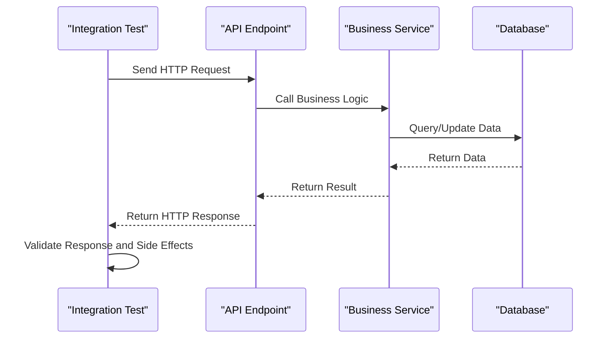
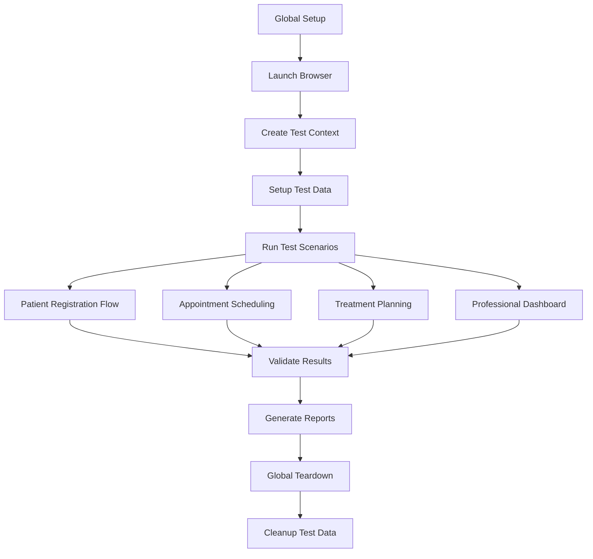
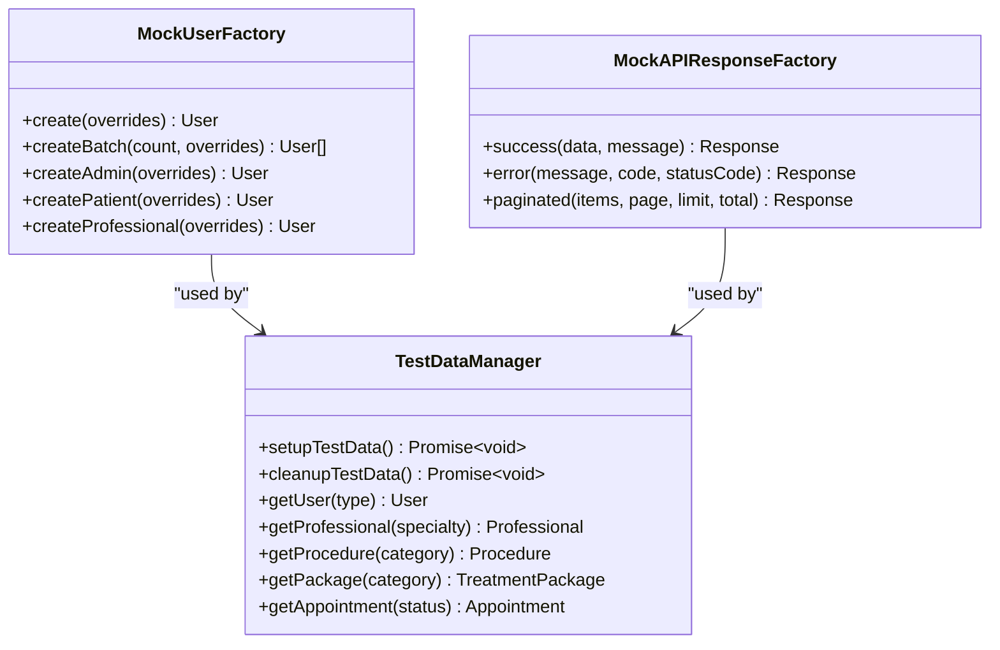

# Testing Strategy

<cite>
**Referenced Files in This Document **
- [vitest.config.ts](file://apps/api/vitest.config.ts)
- [playwright.config.ts](file://apps/tools/playwright.config.ts)
- [test-setup.ts](file://apps/api/src/test-setup.ts)
- [global-setup.ts](file://apps/tools/e2e/setup/global-setup.ts)
- [global-teardown.ts](file://apps/tools/e2e/setup/global-teardown.ts)
- [aesthetic-clinic-performance.test.ts](file://apps/api/src/tests/performance/aesthetic-clinic-performance.test.ts)
- [performance-setup.ts](file://apps/web/src/__tests__/setup/performance-setup.ts)
- [mock-factories.ts](file://tools/testing-toolkit/src/utils/mock-factories.ts)
- [test-data.ts](file://apps/web/src/__tests__/setup/test-data.ts)
</cite>

## Table of Contents

1. [Introduction](#introduction)
2. [Testing Frameworks and Configuration](#testing-frameworks-and-configuration)
3. [Unit Testing Strategy](#unit-testing-strategy)
4. [Integration Testing Approach](#integration-testing-approach)
5. [End-to-End (E2E) Testing Implementation](#end-to-end-e2e-testing-implementation)
6. [Performance Testing Methodology](#performance-testing-methodology)
7. [Compliance Testing for Healthcare Regulations](#compliance-testing-for-healthcare-regulations)
8. [Test Organization and Data Management](#test-organization-and-data-management)
9. [Common Testing Challenges and Solutions](#common-testing-challenges-and-solutions)
10. [Performance Considerations for Test Execution](#performance-considerations-for-test-execution)

## Introduction

The neonpro project employs a comprehensive, multi-layered testing strategy designed to ensure software quality across all dimensions of the application. This strategy follows the testing pyramid model, with a strong foundation of unit tests, a middle layer of integration tests, and a smaller but critical layer of end-to-end tests. The approach is augmented by specialized performance testing and rigorous compliance testing to meet healthcare industry standards. The testing ecosystem leverages Vitest for unit and integration testing, Playwright for E2E testing, and custom tooling for compliance validation. This documentation provides both conceptual overviews for developers new to the testing approach and detailed technical information for test automation experts.

## Testing Frameworks and Configuration

The neonpro project utilizes Vitest as the primary testing framework for unit and integration tests, chosen for its speed, TypeScript support, and compatibility with the Vite ecosystem. For end-to-end testing, Playwright is employed due to its cross-browser capabilities, reliable execution, and excellent debugging tools. The configuration files define the testing environment, include patterns, reporters, and other essential settings that ensure consistent test execution across different environments.

```mermaid
graph TD
A[Vitest Configuration] --> B[Environment: node]
A --> C[Include Patterns: tests/**/*.{test,spec}.{ts,tsx}]
A --> D[Exclude Patterns: node_modules/**, dist/**]
A --> E[Reporters: default]
A --> F[Timeout: 20000ms]
A --> G[Alias Configuration for Shared Packages]
H[Playwright Configuration] --> I[Test Directory: ./e2e]
H --> J[Output Directory: ./test-results]
H --> K[Fully Parallel Execution]
H --> L[Multiple Browser Projects]
H --> M[Web Server Configuration]
H --> N[Global Setup and Teardown]
```

**Diagram sources**

- [vitest.config.ts](file://apps/api/vitest.config.ts)
- [playwright.config.ts](file://apps/tools/playwright.config.ts)

**Section sources**

- [vitest.config.ts](file://apps/api/vitest.config.ts#L1-L65)
- [playwright.config.ts](file://apps/tools/playwright.config.ts#L1-L234)

## Unit Testing Strategy

Unit testing in the neonpro project focuses on validating individual functions, classes, and components in isolation. The strategy emphasizes testing business logic, data transformations, and utility functions with high code coverage. Tests are organized by feature and domain, with dedicated directories for different types of unit tests. Mocking is used extensively to isolate units under test from their dependencies, ensuring that tests are fast and reliable.

**Section sources**

- [test-setup.ts](file://apps/api/src/test-setup.ts#L1-L83)
- [ai-data-service.test.ts](file://tests/unit/ai-data-service.test.ts)
- [intent-parser.test.ts](file://tests/unit/intent-parser.test.ts)

## Integration Testing Approach

Integration testing verifies the interaction between different components and services within the system. In neonpro, integration tests validate API endpoints, database interactions, and service-to-service communication. These tests run in a controlled environment that closely resembles production, using real or mocked external dependencies. The integration testing strategy ensures that components work together as expected and that data flows correctly through the system.



**Diagram sources**

- [appointment-query.test.ts](file://tests/integration/appointment-query.test.ts)
- [data-agent-endpoint.test.ts](file://tests/integration/data-agent-endpoint.test.ts)
- [feedback-endpoint.test.ts](file://tests/integration/feedback-endpoint.test.ts)

**Section sources**

- [appointment-query.test.ts](file://tests/integration/appointment-query.test.ts)
- [data-agent-endpoint.test.ts](file://tests/integration/data-agent-endpoint.test.ts)
- [https-enforcement.test.ts](file://tests/integration/https-enforcement.test.ts)

## End-to-End (E2E) Testing Implementation

E2E testing in neonpro simulates real user scenarios across the entire application stack, from the user interface to the backend services and database. Playwright is used to automate browser interactions, ensuring that the application works as expected from the user's perspective. The E2E test suite includes tests for critical user journeys such as patient registration, appointment scheduling, and treatment planning.



**Diagram sources**

- [global-setup.ts](file://apps/tools/e2e/setup/global-setup.ts)
- [global-teardown.ts](file://apps/tools/e2e/setup/global-teardown.ts)
- [clinic-appointment-management.spec.ts](file://apps/tools/e2e/clinic-appointment-management.spec.ts)

**Section sources**

- [global-setup.ts](file://apps/tools/e2e/setup/global-setup.ts#L1-L67)
- [global-teardown.ts](file://apps/tools/e2e/setup/global-teardown.ts#L1-L29)
- [auth.spec.ts](file://apps/tools/e2e/auth/auth.spec.ts)

## Performance Testing Methodology

Performance testing in neonpro focuses on measuring and optimizing the application's response time, throughput, and resource usage under various load conditions. The methodology includes load testing, stress testing, and performance benchmarking to ensure the application meets healthcare industry standards for responsiveness and reliability. Custom performance budgets are defined for key metrics such as Largest Contentful Paint (LCP), First Input Delay (FID), and Cumulative Layout Shift (CLS).

```mermaid
classDiagram
class PerformanceBenchmark {
+runLoadTest(optimizer, config) Promise~Results~
+runStressTest(optimizer, config) Promise~Results~
-calculateStatistics(responseTimes) Object
-validatePerformanceThresholds(results) boolean
}
class PerformanceMeasurer {
+measure(fn) Promise~{result, metrics}~
-startMeasurement() void
-endMeasurement() Metrics
}
class PerformanceBudgetValidator {
+validate(metrics, budget) ValidationResults
-checkExecutionTime(metrics, budget) string[]
-checkMemoryUsage(metrics, budget) string[]
-checkIterationsPerSecond(metrics, budget) string[]
}
PerformanceBenchmark --> PerformanceMeasurer : "uses"
PerformanceBudgetValidator --> PerformanceMeasurer : "uses"
PerformanceBenchmark --> PerformanceBudgetValidator : "uses"
```

**Diagram sources**

- [aesthetic-clinic-performance.test.ts](file://apps/api/src/tests/performance/aesthetic-clinic-performance.test.ts)
- [performance-setup.ts](file://apps/web/src/__tests__/setup/performance-setup.ts)

**Section sources**

- [aesthetic-clinic-performance.test.ts](file://apps/api/src/tests/performance/aesthetic-clinic-performance.test.ts)
- [performance-setup.ts](file://apps/web/src/__tests__/setup/performance-setup.ts)

## Compliance Testing for Healthcare Regulations

Compliance testing ensures that the neonpro application adheres to healthcare regulations such as LGPD (Brazilian General Data Protection Law), ANVISA (National Health Surveillance Agency), and CFM (Federal Council of Medicine). The testing strategy includes automated validation of data protection measures, consent management, audit trails, and data retention policies. Specialized test suites verify that sensitive health data is properly anonymized, encrypted, and accessible only to authorized personnel.

**Section sources**

- [lgpd-aesthetic-clinic-consent.test.ts](file://apps/api/src/__tests__/compliance/lgpd-aesthetic-clinic-consent.test.ts)
- [lgpd-data-anonymization-pseudonymization.test.ts](file://apps/api/src/__tests__/compliance/lgpd-data-anonymization-pseudonymization.test.ts)
- [anvisa-reporting.test.ts](file://apps/api/tests/compliance/anvisa-reporting.test.ts)

## Test Organization and Data Management

The neonpro project employs a structured approach to test organization and data management. Tests are organized by type (unit, integration, E2E) and by feature domain, making it easy to locate and maintain test code. Test data is managed through factory patterns and setup/teardown scripts that ensure a consistent state before and after each test. Mock data generators create realistic test scenarios while maintaining data privacy and security.



**Diagram sources**

- [mock-factories.ts](file://tools/testing-toolkit/src/utils/mock-factories.ts)
- [test-data.ts](file://apps/web/src/__tests__/setup/test-data.ts)

**Section sources**

- [mock-factories.ts](file://tools/testing-toolkit/src/utils/mock-factories.ts#L1-L106)
- [test-data.ts](file://apps/web/src/__tests__/setup/test-data.ts#L1-L428)

## Common Testing Challenges and Solutions

The neonpro project addresses several common testing challenges through established patterns and practices. Testing asynchronous code is handled using async/await patterns and proper timeout configurations. External dependencies are managed through mocking and stubbing, ensuring test reliability and speed. Test flakiness is minimized through careful synchronization, retry mechanisms, and deterministic test data. The project also implements strategies for testing complex state management and UI interactions.

**Section sources**

- [test-setup.ts](file://apps/api/src/test-setup.ts#L1-L83)
- [global-setup.ts](file://apps/tools/e2e/setup/global-setup.ts#L1-L67)
- [test-runner.test.ts](file://tools/testing-toolkit/tests/test-runner.test.ts)

## Performance Considerations for Test Execution

The neonpro testing strategy places significant emphasis on test execution performance and resource efficiency. Tests are designed to be fast and lightweight, with unit tests typically completing in under 2 seconds. Parallel execution is enabled for both Vitest and Playwright to maximize test throughput. Resource usage is monitored to prevent memory leaks and excessive CPU consumption during test runs. The project also implements caching and reuse of expensive resources like database connections and browser instances.

**Section sources**

- [vitest.config.ts](file://apps/api/vitest.config.ts#L1-L65)
- [playwright.config.ts](file://apps/tools/playwright.config.ts#L1-L234)
- [performance-setup.ts](file://apps/web/src/__tests__/setup/performance-setup.ts#L1-L311)
