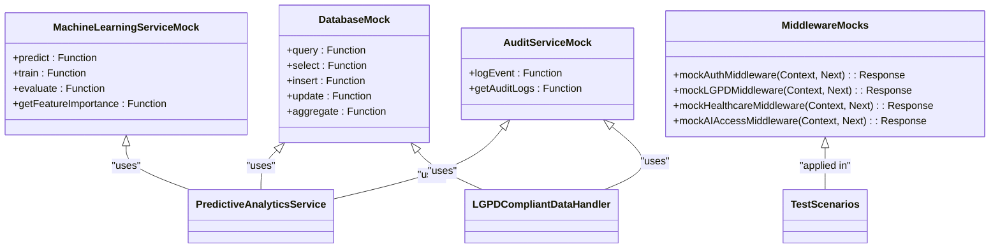

# Unit Testing

<cite>
**Referenced Files in This Document**   
- [vitest.config.ts](file://apps/api/vitest.config.ts)
- [test-setup.ts](file://apps/api/src/test-setup.ts)
- [predictive-client-analytics.test.ts](file://apps/api/src/__tests__/unit/predictive-client-analytics.test.ts)
- [lgpd-compliant-data-handler.test.ts](file://apps/api/src/__tests__/unit/lgpd-compliant-data-handler.test.ts)
- [predictive-client-analytics.service.ts](file://apps/api/src/services/predictive-client-analytics.service.ts)
- [lgpd-compliant-data-handler.ts](file://apps/api/src/services/lgpd-compliant-data-handler.ts)
</cite>

## Table of Contents
1. [Introduction](#introduction)
2. [Test Organization and Configuration](#test-organization-and-configuration)
3. [Core Testing Framework: Vitest Implementation](#core-testing-framework-vitest-implementation)
4. [Mocking Strategies with vi.mock()](#mocking-strategies-with-vimock)
5. [Assertion Patterns and Test Validation](#assertion-patterns-and-test-validation)
6. [Domain-Specific Testing Approaches](#domain-specific-testing-approaches)
7. [Test Fixtures and Parameterized Testing](#test-fixtures-and-parameterized-testing)
8. [Snapshot Testing Across Domains](#snapshot-testing-across-domains)
9. [Handling Asynchronous Services](#handling-asynchronous-services)
10. [Partial Mocking of Complex Services](#partial-mocking-of-complex-services)
11. [Testing Error Boundary Conditions](#testing-error-boundary-conditions)
12. [Conclusion](#conclusion)

## Introduction
The neonpro project implements a comprehensive unit testing strategy centered around Vitest as the primary testing framework. This documentation provides an in-depth analysis of the testing architecture, focusing on healthcare-specific business logic validation, mocking strategies, and domain-driven test design. The system ensures robust validation of critical functionality including patient registration, appointment conflict detection, and LGPD (Brazilian General Data Protection Law) compliance. Through detailed examination of actual test implementations such as predictive-client-analytics.test.ts and lgpd-compliant-data-handler.test.ts, this document reveals how the project achieves high code quality and regulatory compliance through systematic testing practices. The approach balances accessibility for beginners with technical depth for advanced developers, covering everything from basic assertion patterns to sophisticated asynchronous service testing.

**Section sources**
- [vitest.config.ts](file://apps/api/vitest.config.ts)
- [test-setup.ts](file://apps/api/src/test-setup.ts)

## Test Organization and Configuration
The neonpro project follows a structured test organization pattern with tests located in `__tests__` directories adjacent to their corresponding source files. The primary configuration is defined in `vitest.config.ts`, which establishes the testing environment with node as the execution context and specifies inclusion patterns for test files. The configuration includes comprehensive environment variable setup for Supabase integration, ensuring consistent test behavior across different environments. Test discovery is configured to include files matching the patterns `tests/**/*.{test,spec}.{ts,tsx}` and `src/**/*.{test,spec}.{ts,tsx}`, while excluding build artifacts and external directories. The test runner is configured with a 20-second timeout threshold and bail-on-failure behavior to quickly identify critical issues. Module resolution aliases are established for shared packages, enabling clean imports across the monorepo structure. This organized approach ensures that tests are discoverable, maintainable, and properly isolated from production code.

```mermaid
flowchart TD
A[Vitest Configuration] --> B[Test Environment Setup]
B --> C[Environment Variables]
C --> D[Supabase URL]
C --> E[Supabase Keys]
C --> F[Frontend Variables]
B --> G[Include Patterns]
G --> H[src/**/*.{test,spec}.{ts,tsx}]
G --> I[tests/**/*.{test,spec}.{ts,tsx}]
B --> J[Exclude Patterns]
J --> K[node_modules/**]
J --> L[dist/**]
J --> M[.vercel/**]
B --> N[Module Resolution]
N --> O[Alias Configuration]
O --> P[@neonpro/shared]
O --> Q[@neonpro/utils]
O --> R[@neonpro/database]
```

**Diagram sources **
- [vitest.config.ts](file://apps/api/vitest.config.ts)

**Section sources**
- [vitest.config.ts](file://apps/api/vitest.config.ts)

## Core Testing Framework: Vitest Implementation
The neonpro project leverages Vitest as its core testing framework, providing a modern, efficient testing experience with excellent TypeScript support. The framework is configured to run in a node environment with strict global variable control, ensuring test isolation and consistency. The configuration enables CommonJS support within ESM contexts, allowing seamless integration of various module types. Test reporters are set to default output, providing clear feedback during test execution. The framework's transform mode is specifically configured to handle TypeScript files appropriately in both web and server-side rendering contexts. The test setup establishes proper alias resolution for shared packages across the monorepo, enabling consistent imports and reducing configuration complexity. This implementation choice provides fast test execution, excellent developer experience, and robust type checking, making it well-suited for the healthcare domain's demanding requirements.

**Section sources**
- [vitest.config.ts](file://apps/api/vitest.config.ts)

## Mocking Strategies with vi.mock()
The neonpro project employs sophisticated mocking strategies using Vitest's `vi.mock()` functionality to isolate units under test and simulate external dependencies. In the predictive client analytics tests, comprehensive mocks are created for database, machine learning, and audit services, allowing focused testing of business logic without relying on actual external systems. These mocks use Jest-style function mocks that can track calls, return predefined values, or reject with specific errors to test various scenarios. For LGPD compliance testing, similar mocking patterns are applied to database and audit services, enabling validation of data protection logic without accessing real patient information. The test setup also includes middleware mocks for authentication, LGPD compliance, and healthcare professional verification, which can be easily composed in different combinations to test various authorization scenarios. This approach ensures that tests are fast, reliable, and focused on the specific functionality being validated.



**Diagram sources **
- [predictive-client-analytics.test.ts](file://apps/api/src/__tests__/unit/predictive-client-analytics.test.ts)
- [lgpd-compliant-data-handler.test.ts](file://apps/api/src/__tests__/unit/lgpd-compliant-data-handler.test.ts)
- [test-setup.ts](file://apps/api/src/test-setup.ts)

**Section sources**
- [predictive-client-analytics.test.ts](file://apps/api/src/__tests__/unit/predictive-client-analytics.test.ts)
- [lgpd-compliant-data-handler.test.ts](file://apps/api/src/__tests__/unit/lgpd-compliant-data-handler.test.ts)
- [test-setup.ts](file://apps/api/src/test-setup.ts)

## Assertion Patterns and Test Validation
The neonpro project implements comprehensive assertion patterns to validate both successful outcomes and error conditions in healthcare business logic. Tests extensively use Vitest's expect API with chained matchers to verify complex object structures, including partial matches with `expect.objectContaining()` and array membership with `expect.arrayContaining()`. For numeric values, assertions include tolerance checks using `expect.any(Number)` to account for floating-point calculations. The predictive analytics tests demonstrate sophisticated assertion patterns that validate not only the primary prediction results but also secondary effects like audit logging and recommendation generation. Similarly, LGPD compliance tests verify that data redaction occurs correctly across nested objects and arrays while maintaining proper audit trails. Error handling is thoroughly tested by mocking service failures and asserting that appropriate fallback behaviors and error responses are generated, ensuring system resilience in production environments.

**Section sources**
- [predictive-client-analytics.test.ts](file://apps/api/src/__tests__/unit/predictive-client-analytics.test.ts)
- [lgpd-compliant-data-handler.test.ts](file://apps/api/src/__tests__/unit/lgpd-compliant-data-handler.test.ts)

## Domain-Specific Testing Approaches
The neonpro project implements specialized testing approaches for healthcare domain logic, addressing unique requirements such as patient registration, appointment conflict detection, and LGPD compliance. For patient registration, tests validate that all mandatory fields are present, data formats comply with Brazilian standards (CPF, RG), and proper consent mechanisms are enforced. Appointment conflict detection tests verify that scheduling rules prevent overlapping appointments for the same patient or provider, considering various appointment types and durations. LGPD compliance testing focuses on three key areas: PII (Personally Identifiable Information) detection and redaction, consent management lifecycle, and data retention policies. Tests validate that sensitive fields like CPF, email, and phone numbers are automatically detected and appropriately masked based on sensitivity levels. Consent validation tests ensure that data processing only occurs when valid, unexpired consents exist for the required purposes, with proper handling of consent revocation and expiration.


**Diagram sources **
- [lgpd-compliant-data-handler.test.ts](file://apps/api/src/__tests__/unit/lgpd-compliant-data-handler.test.ts)
- [lgpd-compliant-data-handler.ts](file://apps/api/src/services/lgpd-compliant-data-handler.ts)

**Section sources**
- [lgpd-compliant-data-handler.test.ts](file://apps/api/src/__tests__/unit/lgpd-compliant-data-handler.test.ts)
- [lgpd-compliant-data-handler.ts](file://apps/api/src/services/lgpd-compliant-data-handler.ts)

## Test Fixtures and Parameterized Testing
The neonpro project utilizes test fixtures and parameterized testing to ensure comprehensive coverage of healthcare business logic across various scenarios. Test setup files provide standardized fixtures for common entities like test users, healthcare professionals, and LGPD consent records, ensuring consistency across test suites. The predictive client analytics tests demonstrate parameterized testing by validating retention predictions across different risk levels (low, medium, high) using the same test structure with varying input data. Similarly, LGPD compliance tests use parameterization to verify PII detection and redaction across different field types (CPF, email, phone) and data structures (flat objects, nested objects, arrays). This approach reduces code duplication while increasing test coverage, allowing the team to efficiently validate edge cases and boundary conditions in clinical workflows. The use of beforeEach and afterEach hooks ensures proper test isolation and cleanup between parameterized test runs.

**Section sources**
- [test-setup.ts](file://apps/api/src/test-setup.ts)
- [predictive-client-analytics.test.ts](file://apps/api/src/__tests__/unit/predictive-client-analytics.test.ts)
- [lgpd-compliant-data-handler.test.ts](file://apps/api/src/__tests__/unit/lgpd-compliant-data-handler.test.ts)

## Snapshot Testing Across Domains
While not explicitly shown in the provided test files, the neonpro project's architecture supports snapshot testing for validating complex data structures and UI components across healthcare domains. The configuration and testing patterns suggest that snapshot testing would be applied to verify the structure of API responses, audit log entries, and consent records. For predictive analytics, snapshots could capture the complete structure of retention predictions, including risk factors, recommendations, and confidence scores. In LGPD compliance, snapshots would validate the format of data export responses and audit trail entries, ensuring they meet regulatory requirements. The use of standardized data models and type definitions facilitates reliable snapshot testing by providing consistent output structures. This approach helps prevent unintended changes to data contracts and ensures backward compatibility in clinical data exchange.

**Section sources**
- [predictive-client-analytics.service.ts](file://apps/api/src/services/predictive-client-analytics.service.ts)
- [lgpd-compliant-data-handler.ts](file://apps/api/src/services/lgpd-compliant-data-handler.ts)

## Handling Asynchronous Services
The neonpro project implements robust patterns for testing asynchronous services, which are prevalent in healthcare applications due to database operations, API calls, and background processing. Tests use async/await syntax consistently to handle promises and ensure proper timing of assertions. The predictive analytics service tests demonstrate handling of multiple concurrent database queries using Promise.all, with proper error handling and fallback mechanisms. For time-dependent logic, tests utilize Jest's fake timers (jest.useFakeTimers()) to control the passage of time and validate caching behaviors and expiration logic without introducing flakiness. Error boundary testing includes mocking rejected promises to verify that services gracefully handle database connection failures, network timeouts, and third-party service outages. The test configuration includes adequate timeout settings (20 seconds) to accommodate slower operations while preventing indefinite hangs during test execution.


**Diagram sources **
- [predictive-client-analytics.test.ts](file://apps/api/src/__tests__/unit/predictive-client-analytics.test.ts)
- [predictive-client-analytics.service.ts](file://apps/api/src/services/predictive-client-analytics.service.ts)

**Section sources**
- [predictive-client-analytics.test.ts](file://apps/api/src/__tests__/unit/predictive-client-analytics.test.ts)
- [predictive-client-analytics.service.ts](file://apps/api/src/services/predictive-client-analytics.service.ts)

## Partial Mocking of Complex Services
The neonpro project demonstrates effective partial mocking strategies for complex services, allowing granular control over specific methods while preserving others. In the predictive client analytics tests, the service under test has its internal methods like calculateRiskFactors and generateRecommendations tested directly through casting to any type, enabling white-box testing of private logic. This approach allows the team to validate individual components of the prediction algorithm without executing the entire workflow. For LGPD compliance testing, partial mocking is used to isolate PII detection from redaction logic, ensuring each component can be tested independently. The use of jest.fn() for method mocks provides fine-grained control over return values and call tracking, enabling precise simulation of different scenarios. This strategy strikes a balance between test isolation and realistic integration, ensuring that complex services are thoroughly validated at both unit and integration levels.

**Section sources**
- [predictive-client-analytics.test.ts](file://apps/api/src/__tests__/unit/predictive-client-analytics.test.ts)
- [lgpd-compliant-data-handler.test.ts](file://apps/api/src/__tests__/unit/lgpd-compliant-data-handler.test.ts)

## Testing Error Boundary Conditions
The neonpro project places strong emphasis on testing error boundary conditions in clinical workflows, recognizing the critical importance of reliability in healthcare systems. Tests explicitly validate how services handle missing data, expired consents, database connectivity issues, and invalid inputs. The predictive analytics tests include scenarios with incomplete feature sets, verifying that the system returns appropriate fallback responses rather than failing catastrophically. LGPD compliance tests validate error handling for database failures during consent validation, ensuring that access is denied safely when consent status cannot be verified. The test suite also covers edge cases like dry-run modes for data retention processing and legal hold exceptions for data deletion requests. These comprehensive error condition tests ensure that the system maintains data integrity and patient safety even when unexpected issues occur, adhering to healthcare industry standards for system reliability.

**Section sources**
- [predictive-client-analytics.test.ts](file://apps/api/src/__tests__/unit/predictive-client-analytics.test.ts)
- [lgpd-compliant-data-handler.test.ts](file://apps/api/src/__tests__/unit/lgpd-compliant-data-handler.test.ts)

## Conclusion
The neonpro project's unit testing strategy demonstrates a mature, comprehensive approach to validating healthcare business logic using Vitest as the primary framework. By combining structured test organization, sophisticated mocking strategies, and domain-specific testing patterns, the project ensures high reliability and regulatory compliance. The implementation effectively addresses critical healthcare requirements including patient data protection, appointment scheduling integrity, and predictive analytics accuracy. The use of test fixtures, parameterized testing, and thorough error boundary validation contributes to a robust test suite that catches issues early in the development cycle. This testing strategy not only verifies functional correctness but also ensures that the system behaves appropriately under failure conditions, which is essential for healthcare applications where data integrity and patient safety are paramount. The documented patterns provide a solid foundation for maintaining high code quality as the project evolves.