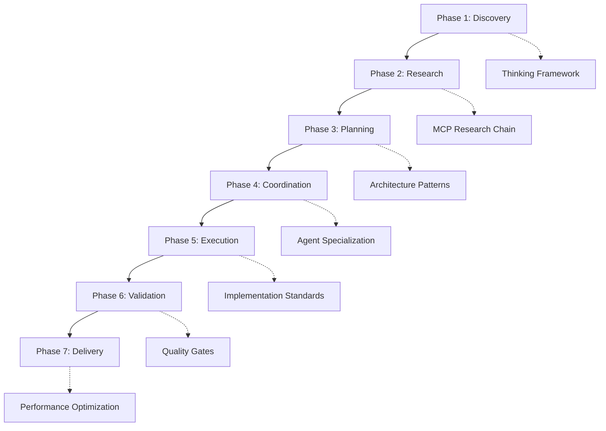

# Workflow Orchestration Framework

## 🌟 SEVEN-PHASE EXECUTION FRAMEWORK

Systematic workflow orchestration for AI coding assistants with intelligent agent coordination,
progressive quality gates, and context-preserving transitions.

**Core Philosophy**: Think → Research → Decompose → Plan → Implement → Validate → Deliver

## 🔄 WORKFLOW PHASES OVERVIEW



## 📊 PHASE 1: DISCOVERY & ANALYSIS

**Purpose**: Comprehensive requirement analysis with context understanding and complexity assessment

### Core Activities

- **Requirement Analysis**: Complete understanding of user needs and constraints
- **Context Assessment**: Technical environment, existing systems, and dependencies
- **Complexity Scoring**: L1-L10 assessment with domain-specific triggers
- **Strategic Planning**: High-level approach and resource allocation

### Thinking Integration

- **Auto-Activation**: Appropriate thinking level based on complexity detection
- **Context Analysis**: Multi-perspective evaluation of requirements
- **Constraint Identification**: Technical, business, and regulatory limitations
- **Success Criteria**: Clear, measurable outcomes and quality thresholds

### Quality Gates

- **Requirements Clarity**: ≥95% completeness with stakeholder validation
- **Context Understanding**: Complete technical and business environment mapping
- **Complexity Assessment**: Accurate L1-L10 rating with domain considerations
- **Strategic Alignment**: Clear connection between requirements and approach

### Deliverables

```yaml
requirements_specification:
  - "Functional requirements with acceptance criteria"
  - "Non-functional requirements (performance, security, scalability)"
  - "Technical constraints and dependencies"
  - "Business objectives and success metrics"

complexity_assessment:
  - "L1-L10 complexity rating with justification"
  - "Domain-specific considerations (healthcare, enterprise, etc.)"
  - "Resource requirements and timeline estimation"
  - "Risk assessment and mitigation strategies"

execution_plan:
  - "High-level approach and methodology"
  - "Technology stack and architectural decisions"
  - "Quality standards and validation criteria"
  - "Phase-by-phase implementation roadmap"
```

## 🔍 PHASE 2: RESEARCH & VALIDATION

**Purpose**: Knowledge acquisition and validation for informed implementation

### MCP Research Chain Priority

1. **Official Documentation** (Primary): Authoritative sources and API references
2. **Best Practices** (Secondary): Industry standards and proven patterns
3. **Community Insights** (Tertiary): Current trends and community consensus
4. **Expert Analysis** (Advanced): Deep technical analysis and optimization strategies

### Research Orchestration

```yaml
research_coordination:
  simple_tasks_L1_L2:
    sources: ["Official docs if needed"]
    depth: "Basic pattern validation"
    time_budget: "5-15 minutes"

  moderate_tasks_L3_L4:
    sources: ["Official docs", "Best practices", "Community validation"]
    depth: "Comprehensive pattern analysis"
    time_budget: "15-45 minutes"

  complex_tasks_L5_L6:
    sources: ["Official docs", "Best practices", "Community", "Expert insights"]
    depth: "Multi-source validation with alternatives"
    time_budget: "45-90 minutes"

  critical_tasks_L7_L10:
    sources: ["Complete research chain", "Regulatory compliance", "Security analysis"]
    depth: "Exhaustive validation with expert review"
    time_budget: "90+ minutes"
```

### Quality Gates

- **Source Validation**: ≥95% accuracy with authoritative source verification
- **Pattern Confirmation**: Proven approaches with success case studies
- **Risk Assessment**: Comprehensive evaluation of potential issues
- **Alternative Analysis**: Multiple approaches evaluated with trade-offs

### Deliverables

```yaml
research_package:
  - "Technology evaluation with pros/cons analysis"
  - "Implementation patterns with code examples"
  - "Security considerations and best practices"
  - "Performance implications and optimization strategies"
  - "Integration requirements and compatibility assessment"

evidence_base:
  - "Authoritative source documentation"
  - "Community validation and feedback"
  - "Expert insights and recommendations"
  - "Regulatory compliance requirements (if applicable)"
```

## 📋 PHASE 3: PLANNING & DESIGN

**Purpose**: Solution architecture and strategic implementation planning

### Planning Framework

- **Architecture Design**: System design aligned with requirements and constraints
- **Implementation Strategy**: Step-by-step execution plan with dependencies
- **Quality Framework**: Testing, validation, and quality assurance approach
- **Risk Mitigation**: Comprehensive risk assessment with contingency plans

### Design Patterns Integration

- **Architectural Patterns**: Proven architectural approaches for the domain
- **Design Principles**: SOLID, DRY, KISS, YAGNI applied appropriately
- **Technology Selection**: Framework and tool choices justified by requirements
- **Integration Strategies**: System integration and API design patterns

### Quality Gates

- **Architecture Review**: ≥9.5/10 design quality with scalability validation
- **Implementation Feasibility**: Technical feasibility confirmed with proof of concept
- **Resource Planning**: Accurate effort estimation with realistic timelines
- **Risk Assessment**: Comprehensive risk analysis with mitigation strategies

### Deliverables

```yaml
architecture_specification:
  - "System architecture diagram with component relationships"
  - "Database design with optimization considerations"
  - "API design with security and performance requirements"
  - "Integration architecture with external systems"

implementation_plan:
  - "Detailed task breakdown with dependencies"
  - "Technology stack with version specifications"
  - "Development workflow and collaboration approach"
  - "Testing strategy with coverage requirements"

quality_framework:
  - "Quality standards and validation criteria"
  - "Testing approach with automated test strategy"
  - "Performance benchmarks and monitoring approach"
  - "Security requirements and compliance validation"
```

## 🤝 PHASE 4: COORDINATION & ORCHESTRATION

**Purpose**: Multi-agent task distribution and orchestration management

### Agent Specialization Matrix

```yaml
development_coordination:
  triggers: ["implement", "develop", "build", "create", "code"]
  specialization: "Full-stack development with architectural excellence"
  coordination_scope: "Complete development lifecycle management"
  quality_standard: "Progressive L1-L10 with performance optimization"

research_coordination:
  triggers: ["research", "analyze", "investigate", "validate", "study"]
  specialization: "Multi-source research with expert validation"
  coordination_scope: "Knowledge acquisition and technology assessment"
  quality_standard: "≥95% accuracy with cross-source validation"

design_coordination:
  triggers: ["design", "ui", "ux", "interface", "accessibility"]
  specialization: "User experience with accessibility compliance"
  coordination_scope: "Interface design and user experience optimization"
  quality_standard: "WCAG 2.1 AA+ compliance with usability validation"
```

### Context Preservation

- **Complete Workflow History**: Decision points, quality metrics, and progress tracking
- **Technical Context**: Implementation decisions, architectural choices, and constraints
- **Quality Context**: Standards achievement, validation results, and improvement areas
- **Domain Context**: Regulatory requirements, compliance status, and industry standards

### Quality Gates

- **Agent Coordination**: ≥95% efficiency with seamless context preservation
- **Task Distribution**: Optimal agent selection with expertise matching
- **Progress Tracking**: Real-time monitoring with quality validation
- **Context Integrity**: Zero information loss across agent transitions

## 🚀 PHASE 5: EXECUTION & IMPLEMENTATION

**Purpose**: Implementation with real-time quality monitoring and optimization

### Implementation Framework

```yaml
implementation_patterns:
  code_quality:
    - "TypeScript strict mode with comprehensive type checking"
    - "ESLint/Prettier with automated formatting and linting"
    - "Comprehensive error handling with structured logging"
    - "Performance optimization with profiling and monitoring"

  architecture_compliance:
    - "SOLID principles with clean architecture patterns"
    - "Design patterns appropriate for domain and complexity"
    - "Security by design with threat modeling validation"
    - "Scalability considerations with load testing validation"

  testing_integration:
    - "Unit tests with ≥90% code coverage for business logic"
    - "Integration tests with API and database validation"
    - "End-to-end tests with user journey validation"
    - "Performance tests with benchmark validation"
```

### Real-time Quality Monitoring

- **Continuous Validation**: Quality checks at every implementation step
- **Performance Monitoring**: Response time and resource usage tracking
- **Security Scanning**: Automated vulnerability detection and remediation
- **Accessibility Validation**: WCAG 2.1 AA+ compliance verification

### Quality Gates

- **Implementation Quality**: Progressive L1-L10 standards with domain compliance
- **Performance Standards**: Response times and scalability requirements met
- **Security Validation**: Zero critical vulnerabilities with security best practices
- **Code Quality**: Clean code principles with comprehensive documentation

## ✅ PHASE 6: VALIDATION & TESTING

**Purpose**: Comprehensive quality assurance and multi-dimensional testing

### Validation Framework

```yaml
testing_strategy:
  unit_testing:
    coverage: "≥90% for business logic components"
    frameworks: "Jest, Vitest, or domain-appropriate testing frameworks"
    quality: "Descriptive test names with comprehensive assertions"

  integration_testing:
    scope: "API endpoints, database operations, external service integration"
    validation: "Data flow integrity and error handling verification"
    performance: "Response time and throughput validation"

  end_to_end_testing:
    coverage: "Critical user journeys and business workflows"
    accessibility: "WCAG 2.1 AA+ compliance validation"
    cross_browser: "Multiple browser and device compatibility"

  security_testing:
    vulnerability_scanning: "Automated security vulnerability detection"
    penetration_testing: "Manual security assessment for critical systems"
    compliance_validation: "Regulatory requirement verification"
```

### Quality Enforcement

- **Zero Tolerance**: Critical bugs and security vulnerabilities must be resolved
- **Performance Validation**: All performance benchmarks must be met
- **Accessibility Compliance**: WCAG 2.1 AA+ validation for user-facing features
- **Regulatory Compliance**: Complete compliance validation for regulated domains

### Quality Gates

- **Test Coverage**: ≥90% coverage with comprehensive test scenarios
- **Performance Benchmarks**: All response time and scalability requirements met
- **Security Validation**: Zero critical vulnerabilities with comprehensive security review
- **Compliance Verification**: Complete regulatory compliance with audit trail

## 🎯 PHASE 7: DELIVERY & OPTIMIZATION

**Purpose**: Final optimization, deployment preparation, and knowledge transfer

### Delivery Framework

```yaml
deployment_preparation:
  production_readiness:
    - "Environment configuration with security hardening"
    - "Monitoring and alerting with comprehensive observability"
    - "Backup and recovery with disaster recovery testing"
    - "Performance optimization with load testing validation"

  documentation_completion:
    - "API documentation with comprehensive examples"
    - "User documentation with step-by-step guides"
    - "Deployment documentation with rollback procedures"
    - "Maintenance documentation with troubleshooting guides"

  knowledge_transfer:
    - "Team training with hands-on workshops"
    - "Documentation review with stakeholder validation"
    - "Operational procedures with incident response plans"
    - "Continuous improvement with feedback integration"
```

### Performance Optimization

- **Response Time Optimization**: <2 seconds for web applications, <200ms for APIs
- **Resource Utilization**: Optimal memory and CPU usage with monitoring
- **Caching Strategy**: Multi-layer caching with intelligent invalidation
- **Scalability Validation**: Horizontal scaling with load testing verification

### Quality Gates

- **Production Readiness**: Complete deployment preparation with validation
- **Performance Optimization**: All performance benchmarks exceeded
- **Documentation Completeness**: Comprehensive documentation with stakeholder approval
- **Knowledge Transfer**: Team readiness with operational capability validation

## 🔧 WORKFLOW STATE MANAGEMENT

### Context Preservation

```yaml
workflow_context:
  current_phase: "Active phase with progress tracking and quality metrics"
  progress_monitoring: "Real-time progress with KPI dashboards and trend analysis"
  quality_gates: "Progressive validation with threshold enforcement and improvement tracking"
  decision_history: "Complete decision rationale with architectural decision records (ADRs)"

context_integrity:
  phase_transitions: "Seamless handoffs with complete context preservation"
  agent_coordination: "Context-aware agent selection with expertise matching"
  quality_continuity: "Progressive standards maintenance across all transitions"
  rollback_capability: "Phase rollback with state restoration and error recovery"
```

### Success Criteria

```yaml
termination_criteria:
  completion_requirements:
    - "User requirements 100% satisfied with stakeholder validation"
    - "Quality standards achieved with progressive L1-L10 compliance"
    - "Performance benchmarks met with scalability validation"
    - "Security requirements satisfied with compliance verification"
    - "Documentation complete with team knowledge transfer"

  quality_validation:
    - "≥9.5/10 overall quality score with domain-specific standards"
    - "Zero critical bugs or security vulnerabilities"
    - "Complete test coverage with automated validation"
    - "Production readiness with deployment validation"
```

## 🌍 BILINGUAL WORKFLOW COMMANDS

### Portuguese Commands

- `/descobrir` - Phase 1: Discovery and analysis
- `/pesquisar` - Phase 2: Research and validation
- `/planejar` - Phase 3: Planning and design
- `/coordenar` - Phase 4: Coordination and orchestration
- `/executar` - Phase 5: Execution and implementation
- `/validar` - Phase 6: Validation and testing
- `/entregar` - Phase 7: Delivery and optimization

### English Commands

- `/discover` - Phase 1: Discovery and analysis
- `/research` - Phase 2: Research and validation
- `/plan` - Phase 3: Planning and design
- `/coordinate` - Phase 4: Coordination and orchestration
- `/execute` - Phase 5: Execution and implementation
- `/validate` - Phase 6: Validation and testing
- `/deliver` - Phase 7: Delivery and optimization

## 📈 WORKFLOW OPTIMIZATION

### Continuous Improvement

- **Pattern Recognition**: Successful workflow patterns with codification and reuse
- **Failure Analysis**: Root cause analysis with prevention strategies
- **Performance Monitoring**: Workflow efficiency tracking with optimization opportunities
- **Quality Tracking**: Quality outcomes monitoring with standard improvements

### Adaptive Routing

- **Complexity-Based**: Automatic workflow adaptation based on complexity assessment
- **Domain-Specific**: Specialized workflows for healthcare, enterprise, and other domains
- **Context-Aware**: Dynamic adjustment based on project context and requirements
- **Performance-Optimized**: Route optimization for maximum efficiency and quality

---

## 🚀 WORKFLOW ACTIVATION

**Automatic Workflow Engagement**: The system automatically initiates appropriate workflow phases
based on request complexity, domain context, and quality requirements.

**Progressive Quality Enforcement**: Each phase enforces appropriate quality standards with
automatic escalation for complex or critical implementations.

**Context-Aware Coordination**: Intelligent agent selection and coordination based on task
requirements, domain expertise, and quality standards.

**Continuous Optimization**: Workflow patterns continuously optimized based on outcomes, performance
metrics, and quality achievements.

_This workflow orchestration framework ensures systematic, high-quality development with appropriate
thinking depth, comprehensive validation, and optimal resource utilization across all complexity
levels and domains._
