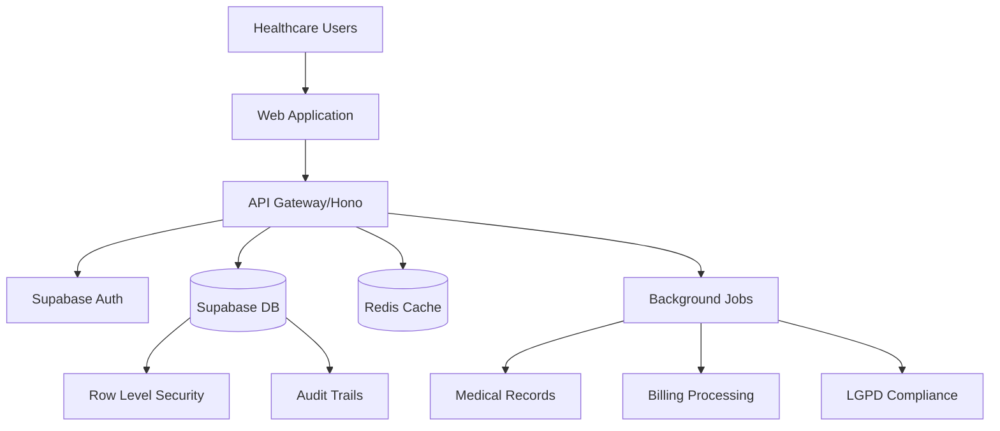

# NeonPro Healthcare Platform - Deployment Guide
## Production Deployment and Operations Manual

**Platform Version**: v2.0.0  
**Last Updated**: January 15, 2025  
**Environment**: Production-Ready Healthcare Platform

## 🚀 QUICK START DEPLOYMENT

### Prerequisites
```bash
# Required tools
node --version    # v18.0.0+
pnpm --version    # v8.0.0+
git --version     # v2.30.0+

# Environment requirements
# - Supabase project (cloud or self-hosted)
# - Redis instance (for job queue and caching)
# - Vercel account (for frontend deployment)
```

### 1. Environment Configuration

Create production environment files:

```bash
# Root .env.production
DATABASE_URL="postgresql://[user]:[password]@[host]:[port]/[database]"
SUPABASE_URL="https://[project-id].supabase.co"
SUPABASE_ANON_KEY="[anon-key]"
SUPABASE_SERVICE_ROLE_KEY="[service-role-key]"
REDIS_URL="redis://[host]:[port]"
NEXTAUTH_SECRET="[generate-32-char-secret]"
NEXTAUTH_URL="https://[your-domain]"

# Healthcare-specific configuration
ANVISA_API_ENDPOINT="https://consultas.anvisa.gov.br/api"
SUS_INTEGRATION_ENDPOINT="https://sis.saude.gov.br/api"
TUSS_VERSION="2024.1"
LGPD_CONSENT_RETENTION_DAYS="2555"  # 7 years as required

# Security configuration
CSP_REPORT_URI="https://[your-domain]/api/csp-report"
SECURITY_HEADERS_ENABLED="true"
RATE_LIMIT_PER_MINUTE="100"
```

### 2. Database Setup

```bash
# Initialize Supabase project
pnpm dlx supabase init
pnpm dlx supabase start

# Run migrations
pnpm dlx supabase db push

# Seed production data (optional)
pnpm dlx supabase db seed
```

### 3. Application Deployment

#### Option A: Vercel Deployment (Recommended)
```bash
# Install Vercel CLI
pnpm dlx vercel --version

# Link project
pnpm dlx vercel link --yes

# Deploy to production
pnpm dlx vercel --prod
```

#### Option B: Docker Deployment
```bash
# Build Docker image
docker build -t neonpro-healthcare .

# Run container
docker run -p 3000:3000 \
  --env-file .env.production \
  neonpro-healthcare
```

## 🏗️ ARCHITECTURE OVERVIEW

### System Components



### Technology Stack
- **Frontend**: React 19 + TanStack Router + Vite
- **Backend**: Hono + Supabase + PostgreSQL
- **Authentication**: Supabase Auth with RBAC
- **Caching**: Redis for sessions and job queue
- **Deployment**: Vercel + Docker support
- **Monitoring**: Built-in observability and tracing

## 🔒 SECURITY CONFIGURATION

### 1. Supabase Security Setup

```sql
-- Enable Row Level Security for all tables
ALTER TABLE patients ENABLE ROW LEVEL SECURITY;
ALTER TABLE medical_records ENABLE ROW LEVEL SECURITY;
ALTER TABLE billing_records ENABLE ROW LEVEL SECURITY;

-- Healthcare provider access policy
CREATE POLICY "Healthcare providers can access their patients"
ON patients FOR ALL
USING (
  auth.jwt() ->> 'role' = 'healthcare_provider'
  AND organization_id = (auth.jwt() ->> 'org_id')::uuid
);

-- Patient self-access policy
CREATE POLICY "Patients can access own records"
ON medical_records FOR SELECT
USING (
  patient_id = (auth.jwt() ->> 'sub')::uuid
  OR auth.jwt() ->> 'role' = 'healthcare_provider'
);
```

### 2. API Security Headers

```typescript
// Security middleware configuration
const securityHeaders = {
  'Content-Security-Policy': `
    default-src 'self';
    script-src 'self' 'unsafe-inline' https://cdn.jsdelivr.net;
    style-src 'self' 'unsafe-inline' https://fonts.googleapis.com;
    font-src 'self' https://fonts.gstatic.com;
    img-src 'self' data: https:;
    connect-src 'self' https://*.supabase.co;
  `,
  'X-Frame-Options': 'DENY',
  'X-Content-Type-Options': 'nosniff',
  'Referrer-Policy': 'strict-origin-when-cross-origin',
  'Permissions-Policy': 'camera=(), microphone=(), geolocation=()'
};
```

## 🚦 MONITORING & OBSERVABILITY

### 1. Health Checks

```typescript
// API health endpoint
app.get('/api/health', async (c) => {
  const checks = {
    database: await checkDatabaseConnection(),
    redis: await checkRedisConnection(),
    external_apis: await checkExternalAPIs()
  };
  
  return c.json({
    status: 'healthy',
    timestamp: new Date().toISOString(),
    checks
  });
});
```

### 2. Performance Monitoring

```bash
# Install monitoring tools
pnpm add @vercel/analytics
pnpm add web-vitals

# Configure web vitals
export function reportWebVitals(metric) {
  analytics.track('Web Vital', {
    name: metric.name,
    value: metric.value,
    label: metric.label
  });
}
```

### 3. Error Tracking

```typescript
// Global error handler
app.onError((err, c) => {
  console.error('Application error:', {
    error: err.message,
    stack: err.stack,
    path: c.req.path,
    method: c.req.method,
    user: c.get('user')?.id,
    timestamp: new Date().toISOString()
  });
  
  return c.json({
    error: 'Internal server error',
    requestId: c.get('requestId')
  }, 500);
});
```

## 📊 SCALING & PERFORMANCE

### 1. Database Optimization

```sql
-- Create indexes for healthcare queries
CREATE INDEX idx_medical_records_patient_date 
ON medical_records(patient_id, created_at DESC);

CREATE INDEX idx_billing_records_status_date 
ON billing_records(status, created_at DESC);

CREATE INDEX idx_patients_organization 
ON patients(organization_id, created_at DESC);

-- Optimize RLS policies with indexes
CREATE INDEX idx_patients_rls 
ON patients(organization_id, id) 
WHERE deleted_at IS NULL;
```

### 2. Caching Strategy

```typescript
// Redis caching configuration
const cacheConfig = {
  // Patient data cache (30 minutes)
  patient_data: { ttl: 1800, prefix: 'patient:' },
  
  // Medical records cache (15 minutes)
  medical_records: { ttl: 900, prefix: 'records:' },
  
  // Billing data cache (1 hour)
  billing_data: { ttl: 3600, prefix: 'billing:' },
  
  // Static data cache (24 hours)
  static_data: { ttl: 86400, prefix: 'static:' }
};
```

### 3. Background Jobs Scaling

```typescript
// Job queue configuration
const jobConfig = {
  concurrency: {
    'medical-records-archival': 2,
    'billing-reconciliation': 5,
    'lgpd-compliance-check': 1,
    'audit-trail-cleanup': 1
  },
  
  retry: {
    attempts: 3,
    delay: '30s',
    backoff: 'exponential'
  }
};
```

## 🏥 HEALTHCARE COMPLIANCE

### 1. LGPD (Brazilian GDPR) Compliance

```typescript
// Data retention policy implementation
const retentionPolicies = {
  medical_records: '7 years',      // ANVISA requirement
  billing_records: '5 years',     // Tax law requirement
  audit_logs: '10 years',         // Compliance requirement
  consent_records: '7 years',     // LGPD requirement
  deleted_data: '30 days'         // Recovery period
};

// Automated compliance jobs
schedule.every('1 day').do(async () => {
  await cleanupExpiredData();
  await anonymizeOldRecords();
  await generateComplianceReport();
});
```

### 2. ANVISA Healthcare Standards

```typescript
// Medical record validation
const medicalRecordSchema = z.object({
  patient_id: z.string().uuid(),
  provider_id: z.string().uuid(),
  diagnosis_codes: z.array(z.string().regex(/^[A-Z]\d{2}(\.\d{1,2})?$/)), // ICD-10
  procedure_codes: z.array(z.string().regex(/^\d{8}$/)), // TUSS codes
  medications: z.array(medicationSchema),
  created_at: z.date(),
  digital_signature: z.string().min(1) // Required for legal validity
});
```

## 🛡️ BACKUP & DISASTER RECOVERY

### 1. Database Backups

```bash
# Automated daily backups
#!/bin/bash
BACKUP_DIR="/backups/$(date +%Y-%m-%d)"
mkdir -p $BACKUP_DIR

# Full database backup
pg_dump $DATABASE_URL > $BACKUP_DIR/neonpro_full.sql

# Encrypted backup for healthcare data
gpg --cipher-algo AES256 --compress-algo 1 --symmetric \
    --output $BACKUP_DIR/neonpro_encrypted.sql.gpg \
    $BACKUP_DIR/neonpro_full.sql

# Upload to secure cloud storage
aws s3 cp $BACKUP_DIR/neonpro_encrypted.sql.gpg \
    s3://neonpro-backups/$(date +%Y/%m/%d)/
```

### 2. Point-in-Time Recovery

```sql
-- Supabase automatic point-in-time recovery
-- Recovery available for up to 7 days (Pro plan)
-- Use Supabase dashboard or CLI for recovery

-- Manual recovery commands
supabase db backup list
supabase db backup restore [backup-id]
```

## 📋 MAINTENANCE PROCEDURES

### 1. Regular Maintenance Tasks

```bash
# Weekly maintenance script
#!/bin/bash

# Update dependencies
pnpm update

# Run security audit
pnpm audit --audit-level moderate

# Database maintenance
psql $DATABASE_URL -c "VACUUM ANALYZE;"
psql $DATABASE_URL -c "REINDEX DATABASE neonpro;"

# Clear old cache entries
redis-cli --scan --pattern "expired:*" | xargs redis-cli del

# Generate maintenance report
node scripts/maintenance-report.js
```

### 2. Health Check Automation

```typescript
// Automated health monitoring
const healthChecks = {
  async database() {
    const result = await supabase.from('health_check').select('*').limit(1);
    return result.error === null;
  },
  
  async redis() {
    const result = await redis.ping();
    return result === 'PONG';
  },
  
  async externalAPIs() {
    const checks = await Promise.all([
      fetch('https://consultas.anvisa.gov.br/api/health'),
      fetch('https://sis.saude.gov.br/api/health')
    ]);
    return checks.every(response => response.ok);
  }
};

// Run health checks every 5 minutes
setInterval(async () => {
  const results = await Promise.all([
    healthChecks.database(),
    healthChecks.redis(),
    healthChecks.externalAPIs()
  ]);
  
  if (results.some(result => !result)) {
    await sendAlert('Health check failed', results);
  }
}, 5 * 60 * 1000);
```

## 🚨 TROUBLESHOOTING GUIDE

### Common Issues and Solutions

#### 1. Database Connection Issues
```bash
# Check connection
psql $DATABASE_URL -c "SELECT 1;"

# Verify SSL configuration
psql "$DATABASE_URL?sslmode=require" -c "SELECT 1;"

# Check connection pool
echo "SHOW max_connections;" | psql $DATABASE_URL
```

#### 2. Authentication Problems
```typescript
// Debug auth issues
const debugAuth = async (token) => {
  try {
    const { data, error } = await supabase.auth.getUser(token);
    console.log('Auth debug:', { data, error });
    return data.user;
  } catch (error) {
    console.error('Auth error:', error);
    return null;
  }
};
```

#### 3. Performance Issues
```bash
# Check slow queries
echo "SELECT query, mean_time, calls FROM pg_stat_statements 
      WHERE mean_time > 1000 ORDER BY mean_time DESC LIMIT 10;" | psql $DATABASE_URL

# Monitor Redis performance
redis-cli info stats
redis-cli slowlog get 10
```

## 📞 SUPPORT & CONTACTS

### Emergency Contacts
- **Platform Team**: platform-team@neonpro.com.br
- **Database Team**: database@neonpro.com.br
- **Security Team**: security@neonpro.com.br
- **Compliance Officer**: compliance@neonpro.com.br

### Documentation Resources
- **API Documentation**: `/api/docs` (OpenAPI)
- **Database Schema**: `/docs/database-schema/`
- **Security Policies**: `/docs/security/`
- **Compliance Guide**: `/audit-2025-09-15/`

---

**Deployment Version**: v2.0.0  
**Last Updated**: January 15, 2025  
**Next Review**: April 15, 2025