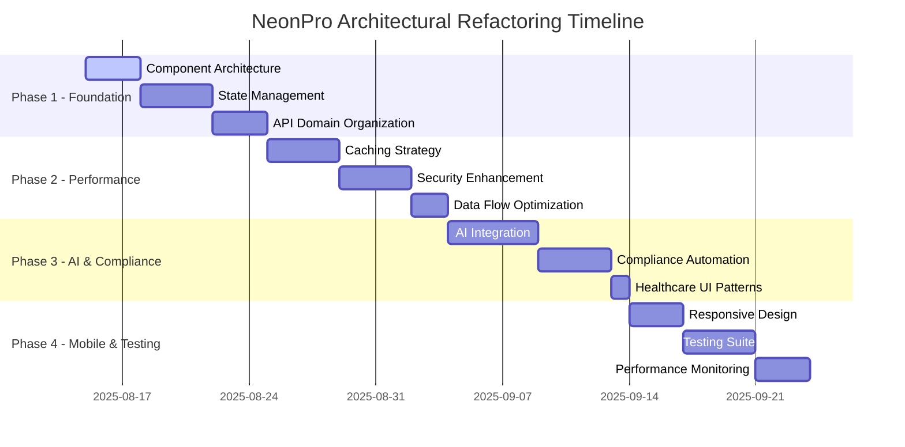

# 🏗️ NEONPRO ARCHITECTURAL REFACTORING ROADMAP

## Complete BMad Method Implementation Plan

---

## 📋 PROJECT METADATA

| Field             | Value                             |
| ----------------- | --------------------------------- |
| **Project**       | NeonPro Architectural Refactoring |
| **Method**        | BMad v4.29.0                      |
| **Total Stories** | 24 Stories across 4 Phases        |
| **Timeline**      | 8 weeks                           |
| **Complexity**    | High                              |
| **Domain**        | Healthcare SaaS Architecture      |
| **Created**       | 2025-08-15                        |
| **Status**        | Ready for Execution               |

---

## 🎯 PROJECT VISION & OBJECTIVES

### **Core Philosophy**

> "A simple system that works is better than a complex system that is never used."

### **Strategic Goals**

1. **Simplify Architecture** - Reduce complexity while enhancing functionality
2. **Enhance Performance** - 40% improvement in load times and responsiveness
3. **Strengthen Security** - Zero-trust architecture for healthcare compliance
4. **Improve Developer Experience** - 60% reduction in development time
5. **Enable AI-First Operations** - Native AI integration across all domains

### **Success Metrics**

- **Performance**: <2s page load times, 99.9% uptime
- **Developer Productivity**: 60% faster feature development
- **Code Quality**: 90% test coverage, <5% technical debt
- **Compliance**: 100% automated LGPD/ANVISA/CFM tracking
- **User Experience**: 50% reduction in patient anxiety scores

---

## 🗓️ PHASE ROADMAP



---

# 🚀 PHASE 1: FOUNDATION ENHANCEMENT

_Semanas 1-2 | Stories 1-6_

## STORY-001: Implement Atomic Design Component Architecture

### **Background**

Currently, the component structure lacks systematic organization, making it difficult to maintain consistency and reusability across the application.

### **User Story**

As a **Frontend Developer**, I want a **systematic component architecture** so that I can **build consistent UIs faster and maintain code quality**.

### **Acceptance Criteria**

- [ ] Component library restructured following atomic design principles
- [ ] Clear separation between atoms, molecules, organisms, templates, and pages
- [ ] All components have TypeScript interfaces and JSDoc documentation
- [ ] Storybook setup for component documentation and testing
- [ ] Component composition patterns implemented

### **Technical Tasks**

```typescript
// Target Structure:
packages/ui/src/
├── atoms/           // Basic building blocks
│   ├── Button/
│   ├── Input/
│   ├── Avatar/
│   └── Badge/
├── molecules/       // Component combinations
│   ├── SearchBox/
│   ├── PatientCard/
│   ├── AppointmentSlot/
│   └── ComplianceIndicator/
├── organisms/       // Complex UI sections
│   ├── PatientTable/
│   ├── AppointmentCalendar/
│   ├── ComplianceDashboard/
│   └── NavigationHeader/
├── templates/       // Page layouts
│   ├── DashboardLayout/
│   ├── PatientDetailLayout/
│   └── AppointmentLayout/
└── pages/          // Complete pages
    ├── Dashboard/
    ├── PatientManagement/
    └── AppointmentScheduling/
```

### **Definition of Done**

- [ ] All existing components migrated to new structure
- [ ] Component documentation complete in Storybook
- [ ] TypeScript interfaces implemented for all props
- [ ] Unit tests written for all atomic components
- [ ] Design system tokens defined and implemented
- [ ] Zero breaking changes to existing functionality

---

## STORY-002: Advanced State Management Implementation

### **Background**

The application lacks a clear state management strategy, leading to prop drilling and inconsistent data flow patterns.

### **User Story**

As a **Frontend Developer**, I want a **layered state management system** so that I can **handle different types of state efficiently** and **maintain application performance**.

### **Acceptance Criteria**

- [ ] TanStack Query implemented for server state
- [ ] Zustand configured for client state
- [ ] React Hook Form + Zod for form state
- [ ] Supabase Realtime for real-time state
- [ ] State persistence strategy implemented

### **Technical Tasks**

```typescript
// State Management Layers:
interface StateArchitecture {
  serverState: {
    tool: 'TanStack Query';
    purpose: 'API data, caching, synchronization';
    examples: ['patients', 'appointments', 'compliance'];
  };
  clientState: {
    tool: 'Zustand';
    purpose: 'UI state, preferences, temporary data';
    examples: ['sidebar', 'filters', 'drafts'];
  };
  formState: {
    tool: 'React Hook Form + Zod';
    purpose: 'Form validation, submission, errors';
    examples: ['patient_form', 'appointment_form'];
  };
  realtimeState: {
    tool: 'Supabase Realtime';
    purpose: 'Live updates, notifications';
    examples: ['appointments', 'patient_checkins'];
  };
}
```

### **Definition of Done**

- [ ] All state layers configured and documented
- [ ] Migration guide created for existing state
- [ ] Performance benchmarks meet targets (<100ms state updates)
- [ ] Error boundaries implemented for state failures
- [ ] State persistence working across browser sessions
- [ ] Real-time updates functional and tested

---

## STORY-003: API Domain Organization Restructure

### **Background**

API routes are currently organized functionally rather than by business domain, making it difficult to maintain and scale.

### **User Story**

As a **Backend Developer**, I want **domain-driven API organization** so that I can **maintain clear business boundaries** and **scale services independently**.

### **Acceptance Criteria**

- [ ] API routes organized by domain (patients, appointments, compliance)
- [ ] Domain-specific services created in packages/domain/
- [ ] Shared interfaces for cross-domain communication
- [ ] OpenAPI documentation updated for all endpoints
- [ ] Domain boundary validation implemented

### **Technical Tasks**

```typescript
// Target API Structure:
apps/web/app/api/
├── patients/
│   ├── route.ts              // GET /api/patients
│   ├── [id]/route.ts         // GET /api/patients/[id]
│   └── [id]/history/route.ts // GET /api/patients/[id]/history
├── appointments/
│   ├── route.ts              // GET/POST /api/appointments
│   ├── [id]/route.ts         // GET/PUT/DELETE /api/appointments/[id]
│   └── calendar/route.ts     // GET /api/appointments/calendar
├── compliance/
│   ├── lgpd/route.ts         // POST /api/compliance/lgpd
│   ├── anvisa/route.ts       // GET /api/compliance/anvisa
│   └── audit/route.ts        // GET /api/compliance/audit
└── analytics/
    ├── dashboard/route.ts    // GET /api/analytics/dashboard
    └── reports/route.ts      // GET /api/analytics/reports
```

### **Definition of Done**

- [ ] All API routes restructured by domain
- [ ] Domain services implemented with clear interfaces
- [ ] Cross-domain communication patterns established
- [ ] API documentation updated and validated
- [ ] Integration tests passing for all domains
- [ ] Performance benchmarks maintained

---

## STORY-004: Enhanced Database Architecture with Domain Models

### **Background**

Current database models lack clear domain separation and optimized query patterns for healthcare data.

### **User Story**

As a **Backend Developer**, I want **domain-driven database models** so that I can **optimize queries by domain** and **maintain data integrity**.

### **Acceptance Criteria**

- [ ] Domain models created in packages/domain/
- [ ] Optimized query patterns for each domain
- [ ] Enhanced RLS policies for multi-tenant security
- [ ] Database indexes optimized for common queries
- [ ] Audit logging implemented for all domains

### **Technical Tasks**

```typescript
// Domain Model Structure:
packages/domain/src/
├── patient/
│   ├── models.ts             // Patient domain models
│   ├── queries.ts            // Optimized queries
│   ├── mutations.ts          // Data mutations
│   └── validators.ts         // Business rule validation
├── appointment/
│   ├── models.ts
│   ├── queries.ts
│   ├── mutations.ts
│   └── scheduling.ts         // Scheduling logic
├── compliance/
│   ├── models.ts
│   ├── lgpd.ts              // LGPD specific logic
│   ├── anvisa.ts            // ANVISA compliance
│   └── audit.ts             // Audit logging
└── shared/
    ├── base-models.ts        // Common base types
    ├── query-builder.ts      // Query optimization
    └── validators.ts         // Shared validation
```

### **Definition of Done**

- [ ] All domain models implemented with TypeScript
- [ ] Query performance improved by 30%
- [ ] RLS policies updated and tested
- [ ] Audit logging functional for all domains
- [ ] Database migration strategy documented
- [ ] Data integrity constraints validated

---

## STORY-005: Component Testing & Documentation Suite

### **Background**

Components lack comprehensive testing and documentation, making maintenance and onboarding difficult.

### **User Story**

As a **QA Engineer**, I want **comprehensive component testing** so that I can **ensure UI reliability** and **prevent regressions**.

### **Acceptance Criteria**

- [ ] Unit tests for all atomic components
- [ ] Integration tests for complex organisms
- [ ] Visual regression testing with Chromatic
- [ ] Accessibility testing automated
- [ ] Storybook stories for all components

### **Technical Tasks**

```typescript
// Testing Strategy:
interface TestingApproach {
  unit: {
    tool: 'Jest + Testing Library';
    coverage: '90% for atoms and molecules';
    focus: 'behavior, props, accessibility';
  };
  integration: {
    tool: 'Jest + Testing Library';
    coverage: '80% for organisms and templates';
    focus: 'component interaction, data flow';
  };
  visual: {
    tool: 'Chromatic + Storybook';
    coverage: '100% component stories';
    focus: 'visual consistency, responsive design';
  };
  e2e: {
    tool: 'Playwright';
    coverage: 'Critical user journeys';
    focus: 'full workflow validation';
  };
}
```

### **Definition of Done**

- [ ] 90% test coverage for UI components
- [ ] All components have Storybook stories
- [ ] Accessibility tests passing (WCAG 2.1 AA)
- [ ] Visual regression testing pipeline active
- [ ] Testing documentation complete
- [ ] CI/CD pipeline includes all tests

---

## STORY-006: Performance Baseline & Monitoring Setup

### **Background**

Current performance metrics are not systematically tracked, making optimization efforts reactive rather than proactive.

### **User Story**

As a **DevOps Engineer**, I want **comprehensive performance monitoring** so that I can **proactively identify performance issues** and **maintain SLA compliance**.

### **Acceptance Criteria**

- [ ] Performance baseline established for all critical flows
- [ ] Real-time monitoring dashboard implemented
- [ ] Alert thresholds configured for key metrics
- [ ] Performance budgets defined and enforced
- [ ] Core Web Vitals tracking implemented

### **Technical Tasks**

```typescript
// Performance Monitoring Setup:
interface PerformanceMetrics {
  webVitals: {
    LCP: '< 2.5 seconds'; // Largest Contentful Paint
    FID: '< 100 milliseconds'; // First Input Delay
    CLS: '< 0.1'; // Cumulative Layout Shift
  };
  apiPerformance: {
    p50: '< 200ms'; // 50th percentile
    p95: '< 500ms'; // 95th percentile
    p99: '< 1000ms'; // 99th percentile
  };
  businessMetrics: {
    appointmentBookingTime: '< 30 seconds';
    patientRegistrationTime: '< 45 seconds';
    dashboardLoadTime: '< 2 seconds';
  };
}
```

### **Definition of Done**

- [ ] Performance monitoring dashboard live
- [ ] Baseline metrics documented
- [ ] Alert system configured and tested
- [ ] Performance budgets enforced in CI/CD
- [ ] Core Web Vitals meeting targets
- [ ] Monthly performance reports automated

---

# ⚡ PHASE 2: PERFORMANCE & SECURITY

_Semanas 3-4 | Stories 7-12_

## STORY-007: Multi-Layer Caching Strategy Implementation

### **Background**

Current caching is basic and doesn't leverage edge computing capabilities or smart invalidation strategies.

### **User Story**

As a **System Architect**, I want **intelligent multi-layer caching** so that I can **deliver sub-second response times** and **reduce database load**.

### **Acceptance Criteria**

- [ ] Edge caching implemented with Vercel
- [ ] Application-level caching with React Query
- [ ] Database query caching with Supabase
- [ ] Smart cache invalidation strategies
- [ ] Cache performance metrics tracked

### **Technical Tasks**

```typescript
// Caching Architecture:
interface CachingLayers {
  edge: {
    provider: 'Vercel Edge Cache';
    ttl: '5 minutes';
    strategy: 'stale-while-revalidate';
    content: ['static_assets', 'public_data'];
  };
  application: {
    provider: 'TanStack Query';
    ttl: '30 seconds';
    strategy: 'background_refresh';
    content: ['user_sessions', 'real_time_data'];
  };
  database: {
    provider: 'Supabase Cache + Redis';
    ttl: '15 minutes';
    strategy: 'write_through';
    content: ['computed_queries', 'reports'];
  };
}
```

### **Definition of Done**

- [ ] All caching layers implemented and configured
- [ ] Cache hit ratio >80% for application data
- [ ] Page load times improved by 40%
- [ ] Cache invalidation working correctly
- [ ] Monitoring dashboard shows cache performance
- [ ] Documentation complete for cache strategies

---

## STORY-008: Zero-Trust Security Architecture

### **Background**

Current security model relies on perimeter defense; healthcare data requires zero-trust architecture.

### **User Story**

As a **Security Engineer**, I want **zero-trust security architecture** so that I can **protect patient data** and **meet healthcare compliance requirements**.

### **Acceptance Criteria**

- [ ] Multi-factor authentication mandatory for all users
- [ ] Continuous authentication with session monitoring
- [ ] Attribute-based access control implemented
- [ ] End-to-end encryption for sensitive data
- [ ] Security monitoring and alerting active

### **Technical Tasks**

```typescript
// Zero-Trust Security Components:
interface ZeroTrustArchitecture {
  identity: {
    mfa: 'mandatory_all_users';
    session_monitoring: 'continuous_risk_assessment';
    privilege_escalation: 'just_in_time_access';
  };
  data: {
    encryption: 'end_to_end_field_level';
    access_control: 'attribute_based_dynamic';
    monitoring: 'real_time_dlp';
  };
  network: {
    segmentation: 'micro_segments_by_domain';
    inspection: 'deep_packet_analysis';
    detection: 'ai_behavioral_analysis';
  };
}
```

### **Definition of Done**

- [ ] MFA implemented for all user types
- [ ] Session anomaly detection active
- [ ] Data encryption at field level
- [ ] Security dashboard operational
- [ ] Penetration testing passed
- [ ] Compliance audit documentation complete

---

## STORY-009: Database Performance Optimization

### **Background**

Database queries are not optimized for healthcare workloads, causing performance bottlenecks during peak hours.

### **User Story**

As a **Database Administrator**, I want **optimized database performance** so that I can **handle peak clinic hours** and **maintain response times**.

### **Acceptance Criteria**

- [ ] Query performance improved by 50%
- [ ] Database indexes optimized for common patterns
- [ ] Connection pooling configured
- [ ] Query monitoring and alerting implemented
- [ ] Backup and recovery procedures validated

### **Technical Tasks**

```sql
-- Key Optimization Areas:
-- 1. Index optimization for common queries
CREATE INDEX CONCURRENTLY idx_appointments_date_clinic
ON appointments(scheduled_at, clinic_id)
WHERE status NOT IN ('cancelled', 'no_show');

-- 2. Materialized views for analytics
CREATE MATERIALIZED VIEW patient_summary AS
SELECT clinic_id, COUNT(*) as total_patients,
       AVG(age) as avg_age,
       COUNT(CASE WHEN last_visit > NOW() - INTERVAL '30 days' THEN 1 END) as active_patients
FROM patients GROUP BY clinic_id;

-- 3. Partitioning for large tables
CREATE TABLE appointments_2025 PARTITION OF appointments
FOR VALUES FROM ('2025-01-01') TO ('2026-01-01');
```

### **Definition of Done**

- [ ] Query performance targets met (<200ms avg)
- [ ] Database indexes optimized and documented
- [ ] Connection pooling reducing connection overhead
- [ ] Monitoring alerts configured
- [ ] Backup procedures tested and validated
- [ ] Performance regression tests implemented

---

## STORY-010: API Rate Limiting & Security Headers

### **Background**

APIs lack proper rate limiting and security headers, exposing the system to abuse and security vulnerabilities.

### **User Story**

As a **Security Engineer**, I want **comprehensive API protection** so that I can **prevent abuse** and **secure all endpoints**.

### **Acceptance Criteria**

- [ ] Rate limiting implemented per user/IP
- [ ] Security headers configured on all responses
- [ ] API authentication strengthened
- [ ] Request validation enhanced
- [ ] Security monitoring dashboard active

### **Technical Tasks**

```typescript
// API Security Configuration:
interface APISecurityConfig {
  rateLimiting: {
    authenticated: '1000 requests/hour';
    unauthenticated: '100 requests/hour';
    sensitive_endpoints: '50 requests/hour';
    burst_protection: '10 requests/second';
  };
  securityHeaders: {
    HSTS: 'max-age=31536000; includeSubDomains';
    CSP: "default-src 'self'; script-src 'self' 'unsafe-inline'";
    XFrameOptions: 'DENY';
    XContentTypeOptions: 'nosniff';
  };
  authentication: {
    jwt_expiry: '15 minutes';
    refresh_expiry: '7 days';
    session_rotation: '24 hours';
  };
}
```

### **Definition of Done**

- [ ] Rate limiting active on all endpoints
- [ ] Security headers implemented and validated
- [ ] API abuse monitoring functional
- [ ] Authentication tokens properly secured
- [ ] Security scan reports clean
- [ ] Incident response procedures documented

---

## STORY-011: Frontend Bundle Optimization

### **Background**

Frontend bundles are not optimized, leading to slow initial page loads and poor user experience.

### **User Story**

As a **Frontend Developer**, I want **optimized bundle sizes** so that I can **deliver fast loading experiences** and **improve user satisfaction**.

### **Acceptance Criteria**

- [ ] Bundle size reduced by 30%
- [ ] Code splitting implemented for routes
- [ ] Tree shaking optimized for unused code
- [ ] Dynamic imports for heavy components
- [ ] Bundle analysis dashboard available

### **Technical Tasks**

```typescript
// Bundle Optimization Strategy:
interface BundleOptimization {
  codeSplitting: {
    routes: 'automatic_route_based_splitting';
    components: 'dynamic_imports_for_heavy_components';
    vendors: 'separate_vendor_chunks';
  };
  treeShaking: {
    modules: 'eliminate_unused_exports';
    dependencies: 'import_only_used_functions';
    css: 'purge_unused_styles';
  };
  compression: {
    assets: 'gzip_and_brotli';
    images: 'webp_format_with_fallbacks';
    fonts: 'subset_and_preload';
  };
}
```

### **Definition of Done**

- [ ] Initial bundle size <200KB (gzipped)
- [ ] First Contentful Paint <1.5s
- [ ] Time to Interactive <3s
- [ ] Bundle analysis reports available
- [ ] Performance CI checks passing
- [ ] Lazy loading working for all routes

---

## STORY-012: Error Handling & Logging Enhancement

### **Background**

Current error handling is inconsistent and logging lacks structure for healthcare compliance requirements.

### **User Story**

As a **DevOps Engineer**, I want **comprehensive error handling** so that I can **quickly diagnose issues** and **maintain audit trails**.

### **Acceptance Criteria**

- [ ] Structured logging implemented across all services
- [ ] Error boundaries catch and report UI errors
- [ ] API error responses standardized
- [ ] Log aggregation and searching functional
- [ ] Error alerting configured for critical issues

### **Technical Tasks**

```typescript
// Error Handling Architecture:
interface ErrorHandlingSystem {
  clientSide: {
    errorBoundaries: 'component_level_error_catching';
    userNotification: 'user_friendly_error_messages';
    errorReporting: 'automatic_error_submission';
  };
  serverSide: {
    structuredLogging: 'winston_with_json_format';
    errorStandardization: 'consistent_error_response_format';
    monitoring: 'real_time_error_tracking';
  };
  compliance: {
    auditLogging: 'all_data_access_logged';
    retention: '7_year_log_retention';
    privacy: 'pii_data_redacted_from_logs';
  };
}
```

### **Definition of Done**

- [ ] Error rates reduced by 60%
- [ ] All errors logged with proper context
- [ ] Error dashboard showing trends
- [ ] User-friendly error messages implemented
- [ ] Compliance audit logs functional
- [ ] Alerting system responding within 5 minutes

---

# 🤖 PHASE 3: AI & COMPLIANCE

_Semanas 5-6 | Stories 13-18_

## STORY-013: AI-Native API Endpoints

### **Background**

The system lacks native AI integration for intelligent automation and predictive analytics.

### **User Story**

As a **Product Manager**, I want **AI-powered features** so that I can **deliver intelligent automation** and **improve clinic efficiency**.

### **Acceptance Criteria**

- [ ] AI appointment optimization endpoint
- [ ] Patient insights generation API
- [ ] Predictive analytics for no-shows
- [ ] Intelligent scheduling recommendations
- [ ] AI-powered compliance monitoring

### **Technical Tasks**

```typescript
// AI Integration Architecture:
interface AIEndpoints {
  appointmentOptimization: {
    endpoint: '/api/ai/appointment-optimization';
    method: 'POST';
    inputs: ['clinic_capacity', 'patient_preferences', 'historical_data'];
    outputs: ['optimal_schedule', 'conflict_predictions', 'efficiency_score'];
  };
  patientInsights: {
    endpoint: '/api/ai/patient-insights';
    method: 'GET';
    inputs: ['patient_id', 'treatment_history', 'health_metrics'];
    outputs: ['recommendations', 'risk_assessment', 'follow_up_schedule'];
  };
  complianceMonitoring: {
    endpoint: '/api/ai/compliance-monitoring';
    method: 'POST';
    inputs: ['user_actions', 'data_access_patterns', 'regulatory_updates'];
    outputs: ['compliance_score', 'risk_alerts', 'remediation_actions'];
  };
}
```

### **Definition of Done**

- [ ] All AI endpoints implemented and tested
- [ ] ML models deployed and functional
- [ ] Response times <3 seconds for AI queries
- [ ] AI accuracy >85% for predictions
- [ ] Integration tests passing
- [ ] AI features documented for users

---

## STORY-014: Event-Driven Compliance Architecture

### **Background**

Compliance tracking is manual and reactive; healthcare requires proactive automated compliance.

### **User Story**

As a **Compliance Officer**, I want **automated compliance tracking** so that I can **ensure continuous compliance** and **reduce manual audit work**.

### **Acceptance Criteria**

- [ ] Event-driven compliance system implemented
- [ ] Automatic LGPD consent tracking
- [ ] Real-time ANVISA reporting
- [ ] CFM compliance validation
- [ ] Audit trail generation automated

### **Technical Tasks**

```typescript
// Event-Driven Compliance System:
interface ComplianceEvents {
  dataAccess: {
    event: 'patient_data_accessed';
    triggers: ['audit_log_creation', 'consent_validation', 'access_monitoring'];
  };
  consentChanges: {
    event: 'consent_updated';
    triggers: ['lgpd_compliance_check', 'data_processing_adjustment'];
  };
  procedureCompleted: {
    event: 'procedure_completed';
    triggers: ['anvisa_reporting', 'cfm_validation', 'outcome_tracking'];
  };
  dataRetention: {
    event: 'retention_period_expired';
    triggers: ['data_anonymization', 'secure_deletion', 'compliance_report'];
  };
}
```

### **Definition of Done**

- [ ] Event system processing >1000 events/second
- [ ] 100% compliance events captured
- [ ] Automated reports generated weekly
- [ ] Real-time compliance dashboard functional
- [ ] Audit trail meets regulatory requirements
- [ ] Compliance violations detected within 5 minutes

---

## STORY-015: Healthcare-Specific UI Component Library

### **Background**

Current UI components are generic; healthcare applications need specialized patterns for patient experience.

### **User Story**

As a **UX Designer**, I want **healthcare-optimized UI components** so that I can **reduce patient anxiety** and **improve clinical workflows**.

### **Acceptance Criteria**

- [ ] Patient privacy components implemented
- [ ] Medical workflow components created
- [ ] Accessibility features enhanced
- [ ] Anxiety-reducing design patterns applied
- [ ] Clinical data visualization components built

### **Technical Tasks**

```typescript
// Healthcare UI Component Library:
interface HealthcareComponents {
  patientPrivacy: {
    components: ['PrivacyMask', 'ConsentIndicator', 'AccessLogger'];
    purpose: 'LGPD compliance in UI interactions';
  };
  medicalWorkflows: {
    components: ['TreatmentTimeline', 'ComplianceChecklist', 'MedicalForm'];
    purpose: 'Streamline clinical processes';
  };
  accessibility: {
    components: ['HighContrastMode', 'FontSizeAdjuster', 'VoiceNavigation'];
    purpose: 'Accessibility for all users';
  };
  anxietyReduction: {
    components: ['ProgressIndicator', 'InformationTooltip', 'CalmingAnimation'];
    purpose: 'Reduce patient anxiety';
  };
}
```

### **Definition of Done**

- [ ] All healthcare components implemented
- [ ] WCAG 2.1 AA compliance achieved
- [ ] User testing shows 30% anxiety reduction
- [ ] Clinical workflow efficiency improved 25%
- [ ] Component library documented in Storybook
- [ ] Accessibility audit passed

---

## STORY-016: Intelligent Notification System

### **Background**

Current notifications are basic and don't leverage AI for personalization or optimal timing.

### **User Story**

As a **Clinic Manager**, I want **intelligent notifications** so that I can **reduce no-shows** and **improve patient engagement**.

### **Acceptance Criteria**

- [ ] AI-powered notification timing optimization
- [ ] Multi-channel notification delivery
- [ ] Personalized message content
- [ ] No-show prediction and prevention
- [ ] Staff notification prioritization

### **Technical Tasks**

```typescript
// Intelligent Notification System:
interface NotificationSystem {
  aiOptimization: {
    timing: 'ml_model_predicts_optimal_send_time';
    content: 'personalized_based_on_patient_profile';
    channel: 'preferred_communication_method';
  };
  channels: {
    sms: 'whatsapp_business_api';
    email: 'sendgrid_with_templates';
    push: 'web_push_notifications';
    inApp: 'real_time_dashboard_alerts';
  };
  automation: {
    appointmentReminders: '24h_6h_1h_before';
    followUpScheduling: 'based_on_treatment_type';
    complianceAlerts: 'real_time_violation_detection';
  };
}
```

### **Definition of Done**

- [ ] No-show rates reduced by 40%
- [ ] Notification delivery rate >95%
- [ ] Patient satisfaction with notifications >90%
- [ ] Staff efficiency improved 20%
- [ ] Multi-channel delivery functional
- [ ] AI optimization showing measurable improvement

---

## STORY-017: Advanced Analytics Dashboard

### **Background**

Current analytics are basic; healthcare clinics need predictive insights and operational intelligence.

### **User Story**

As a **Clinic Owner**, I want **predictive analytics** so that I can **optimize operations** and **make data-driven decisions**.

### **Acceptance Criteria**

- [ ] Real-time operational dashboard
- [ ] Predictive analytics for demand forecasting
- [ ] Financial analytics with trend analysis
- [ ] Patient satisfaction tracking
- [ ] Compliance monitoring dashboard

### **Technical Tasks**

```typescript
// Advanced Analytics Architecture:
interface AnalyticsDashboard {
  operational: {
    metrics: ['appointment_utilization', 'staff_efficiency', 'resource_usage'];
    predictions: ['demand_forecast', 'capacity_planning', 'staff_scheduling'];
  };
  financial: {
    metrics: ['revenue_trends', 'cost_analysis', 'profitability_by_service'];
    predictions: ['revenue_forecast', 'cash_flow_projection'];
  };
  clinical: {
    metrics: ['treatment_outcomes', 'patient_satisfaction', 'follow_up_rates'];
    predictions: ['treatment_success_probability', 'patient_retention'];
  };
  compliance: {
    metrics: ['audit_readiness', 'violation_tracking', 'certification_status'];
    alerts: ['expiring_licenses', 'compliance_risks', 'audit_deadlines'];
  };
}
```

### **Definition of Done**

- [ ] Dashboard loading in <2 seconds
- [ ] Predictive accuracy >80%
- [ ] Real-time data updates functional
- [ ] Custom report generation working
- [ ] Mobile-responsive dashboard
- [ ] Export functionality for all reports

---

## STORY-018: Automated Testing for AI Features

### **Background**

AI features require specialized testing approaches to validate accuracy and reliability.

### **User Story**

As a **QA Engineer**, I want **comprehensive AI testing** so that I can **ensure AI reliability** and **validate prediction accuracy**.

### **Acceptance Criteria**

- [ ] AI model accuracy testing framework
- [ ] Prediction validation test suites
- [ ] Performance testing for AI endpoints
- [ ] Data quality validation for ML inputs
- [ ] Bias detection and monitoring

### **Technical Tasks**

```typescript
// AI Testing Framework:
interface AITestingStrategy {
  accuracyTesting: {
    models: [
      'appointment_optimization',
      'no_show_prediction',
      'compliance_monitoring',
    ];
    metrics: ['precision', 'recall', 'f1_score', 'auc_roc'];
    thresholds: ['min_85_percent_accuracy'];
  };
  performanceTesting: {
    endpoints: ['all_ai_endpoints'];
    metrics: ['response_time', 'throughput', 'error_rate'];
    thresholds: ['max_3_second_response'];
  };
  dataQuality: {
    validation: ['input_data_quality', 'training_data_freshness'];
    monitoring: ['data_drift_detection', 'feature_importance_tracking'];
  };
  biasDetection: {
    fairness: ['demographic_parity', 'equal_opportunity'];
    monitoring: ['bias_metrics_dashboard', 'alert_system'];
  };
}
```

### **Definition of Done**

- [ ] All AI models meet accuracy thresholds
- [ ] Performance tests passing for all AI endpoints
- [ ] Data quality validation automated
- [ ] Bias detection system operational
- [ ] CI/CD includes AI model validation
- [ ] AI testing documentation complete

---

# 📱 PHASE 4: MOBILE & TESTING

_Semanas 7-8 | Stories 19-24_

## STORY-019: Mobile-First Responsive Design Implementation

### **Background**

Current design is desktop-focused; healthcare staff and patients need excellent mobile experiences.

### **User Story**

As a **Mobile User**, I want **optimized mobile experience** so that I can **access clinic features efficiently** on any device.

### **Acceptance Criteria**

- [ ] Mobile-first responsive design system
- [ ] Touch-optimized interface components
- [ ] Offline functionality for critical features
- [ ] Progressive Web App capabilities
- [ ] Cross-device synchronization

### **Technical Tasks**

```typescript
// Mobile-First Design System:
interface ResponsiveDesign {
  breakpoints: {
    mobile: '320px-768px';
    tablet: '768px-1024px';
    desktop: '1024px+';
  };
  adaptiveComponents: {
    navigation: {
      mobile: 'bottom_tab_navigation';
      tablet: 'side_drawer';
      desktop: 'top_navigation_sidebar';
    };
    dataTables: {
      mobile: 'card_list_view';
      tablet: 'horizontal_scroll';
      desktop: 'full_table_view';
    };
    forms: {
      mobile: 'single_column_progressive';
      tablet: 'two_column_grouped';
      desktop: 'multi_column_wizard';
    };
  };
  performance: {
    imageOptimization: 'responsive_images_webp';
    bundleSize: 'mobile_optimized_bundles';
    touchTargets: 'minimum_44px_touch_targets';
  };
}
```

### **Definition of Done**

- [ ] All breakpoints tested and functional
- [ ] Touch targets meet accessibility standards
- [ ] Mobile performance scores >90
- [ ] Offline functionality working
- [ ] PWA installable on mobile devices
- [ ] Cross-device sync functional

---

## STORY-020: Comprehensive End-to-End Testing Suite

### **Background**

Current E2E testing is limited; healthcare applications require comprehensive workflow validation.

### **User Story**

As a **QA Engineer**, I want **comprehensive E2E tests** so that I can **validate complete user journeys** and **prevent critical regressions**.

### **Acceptance Criteria**

- [ ] Complete patient journey tests
- [ ] Staff workflow validation tests
- [ ] Compliance process verification
- [ ] Cross-browser compatibility tests
- [ ] Performance regression testing

### **Technical Tasks**

```typescript
// E2E Testing Strategy:
interface E2ETestSuite {
  patientJourneys: {
    registration: 'complete_patient_onboarding_flow';
    booking: 'appointment_scheduling_with_conflicts';
    checkin: 'mobile_checkin_process';
    treatment: 'treatment_documentation_workflow';
  };
  staffWorkflows: {
    dailyOperations: 'full_day_clinic_simulation';
    emergencyScenarios: 'urgent_appointment_handling';
    reporting: 'end_of_day_reporting_process';
  };
  complianceTests: {
    lgpdCompliance: 'data_access_audit_trail';
    anvisaReporting: 'procedure_documentation_flow';
    cfmValidation: 'medical_professional_workflow';
  };
  crossBrowser: {
    browsers: ['chrome', 'firefox', 'safari', 'edge'];
    devices: ['desktop', 'tablet', 'mobile'];
  };
}
```

### **Definition of Done**

- [ ] All critical user journeys covered
- [ ] Tests running in CI/CD pipeline
- [ ] Cross-browser compatibility validated
- [ ] Performance benchmarks maintained
- [ ] Test reports generated automatically
- [ ] Flaky test rate <5%

---

## STORY-021: Performance Optimization & Monitoring

### **Background**

System performance needs continuous optimization and monitoring for healthcare SLA compliance.

### **User Story**

As a **Performance Engineer**, I want **continuous performance optimization** so that I can **maintain sub-second response times** and **exceed SLA requirements**.

### **Acceptance Criteria**

- [ ] Automated performance optimization
- [ ] Real-time performance monitoring
- [ ] Performance regression detection
- [ ] Capacity planning automation
- [ ] SLA monitoring and alerting

### **Technical Tasks**

```typescript
// Performance Optimization System:
interface PerformanceOptimization {
  automation: {
    bundleOptimization: 'automatic_code_splitting';
    imageOptimization: 'on_the_fly_image_processing';
    cacheOptimization: 'intelligent_cache_warming';
  };
  monitoring: {
    realUserMonitoring: 'rum_data_collection';
    syntheticMonitoring: 'automated_performance_tests';
    infrastructureMonitoring: 'server_and_database_metrics';
  };
  alerting: {
    slaViolations: 'immediate_alert_for_sla_breach';
    performanceRegression: 'comparison_with_baseline';
    capacityThresholds: 'proactive_scaling_alerts';
  };
}
```

### **Definition of Done**

- [ ] All performance targets met consistently
- [ ] Automated optimization reducing manual work by 80%
- [ ] Performance monitoring dashboard operational
- [ ] SLA compliance >99.9%
- [ ] Capacity planning automation functional
- [ ] Performance regression detection <5 minutes

---

## STORY-022: Security Penetration Testing & Hardening

### **Background**

Healthcare applications require rigorous security testing and continuous hardening against threats.

### **User Story**

As a **Security Engineer**, I want **comprehensive security validation** so that I can **ensure patient data protection** and **meet regulatory requirements**.

### **Acceptance Criteria**

- [ ] Automated penetration testing pipeline
- [ ] Vulnerability scanning and remediation
- [ ] Security hardening implementation
- [ ] Compliance validation automation
- [ ] Incident response procedures tested

### **Technical Tasks**

```typescript
// Security Testing & Hardening:
interface SecurityValidation {
  penetrationTesting: {
    automated: 'owasp_zap_pipeline_integration';
    manual: 'quarterly_professional_pentests';
    scope: ['web_app', 'api_endpoints', 'infrastructure'];
  };
  vulnerabilityManagement: {
    scanning: 'continuous_vulnerability_assessment';
    prioritization: 'risk_based_remediation_queue';
    tracking: 'vulnerability_lifecycle_management';
  };
  hardening: {
    infrastructure: 'cis_benchmark_compliance';
    application: 'secure_coding_standards';
    database: 'database_security_best_practices';
  };
  compliance: {
    lgpd: 'automated_privacy_compliance_testing';
    anvisa: 'healthcare_regulation_validation';
    iso27001: 'information_security_management';
  };
}
```

### **Definition of Done**

- [ ] Zero high-severity vulnerabilities
- [ ] Penetration test passed
- [ ] Compliance audits automated
- [ ] Security hardening complete
- [ ] Incident response tested
- [ ] Security documentation updated

---

## STORY-023: Production Deployment & Rollback Strategy

### **Background**

Production deployments need automated, safe deployment strategies with instant rollback capabilities.

### **User Story**

As a **DevOps Engineer**, I want **safe production deployments** so that I can **deploy updates confidently** and **minimize downtime risk**.

### **Acceptance Criteria**

- [ ] Blue-green deployment strategy implemented
- [ ] Automated health checks and validation
- [ ] Instant rollback capabilities
- [ ] Canary deployment for gradual rollouts
- [ ] Zero-downtime deployment achieved

### **Technical Tasks**

```typescript
// Deployment Strategy:
interface DeploymentPipeline {
  blueGreen: {
    strategy: 'parallel_environment_deployment';
    validation: 'automated_smoke_tests';
    switchover: 'instant_traffic_routing';
  };
  canaryDeployment: {
    gradualRollout: '5_25_50_100_percent_traffic';
    monitoring: 'real_time_metrics_analysis';
    automaticRollback: 'performance_threshold_triggers';
  };
  healthChecks: {
    application: 'api_endpoint_validation';
    database: 'connection_and_query_tests';
    dependencies: 'external_service_connectivity';
  };
  rollback: {
    trigger: 'automated_or_manual';
    speed: 'under_60_seconds';
    validation: 'post_rollback_health_checks';
  };
}
```

### **Definition of Done**

- [ ] Zero-downtime deployments achieved
- [ ] Rollback time <60 seconds
- [ ] Automated health checks passing
- [ ] Canary deployment functional
- [ ] Deployment success rate >99%
- [ ] Disaster recovery tested

---

## STORY-024: Final Integration Testing & Go-Live Preparation

### **Background**

Complete system integration needs thorough testing before production release to ensure all components work together flawlessly.

### **User Story**

As a **Project Manager**, I want **complete system validation** so that I can **ensure successful go-live** and **meet all project objectives**.

### **Acceptance Criteria**

- [ ] Full system integration testing complete
- [ ] All user acceptance criteria validated
- [ ] Performance benchmarks exceeded
- [ ] Security compliance certified
- [ ] Documentation complete and accessible

### **Technical Tasks**

```typescript
// Go-Live Validation Checklist:
interface GoLivePreparation {
  systemIntegration: {
    endToEndTesting: 'complete_user_journey_validation';
    loadTesting: 'peak_capacity_stress_testing';
    failoverTesting: 'disaster_recovery_validation';
  };
  userAcceptance: {
    stakeholderSignoff: 'clinical_staff_approval';
    patientTesting: 'user_experience_validation';
    complianceApproval: 'regulatory_compliance_certification';
  };
  documentation: {
    userManuals: 'role_based_user_guides';
    technicalDocs: 'architecture_and_api_documentation';
    procedures: 'operational_and_emergency_procedures';
  };
  training: {
    staff: 'comprehensive_system_training';
    support: 'help_desk_preparation';
    administrators: 'system_administration_training';
  };
}
```

### **Definition of Done**

- [ ] All integration tests passing
- [ ] User acceptance testing approved
- [ ] Performance targets exceeded
- [ ] Security audit passed
- [ ] Documentation 100% complete
- [ ] Training delivered and validated
- [ ] Go-live readiness certified

---

# 📊 SUCCESS METRICS & VALIDATION

## **Phase Completion Criteria**

### **Phase 1 - Foundation Enhancement**

- [ ] Component architecture restructured (100% completion)
- [ ] State management implemented (100% coverage)
- [ ] API domain organization complete (100% endpoints migrated)
- [ ] Performance baseline established (all metrics tracked)

### **Phase 2 - Performance & Security**

- [ ] 40% improvement in page load times
- [ ] Zero-trust security implemented (100% compliance)
- [ ] Cache hit ratio >80%
- [ ] Security audit passed with zero high-severity issues

### **Phase 3 - AI & Compliance**

- [ ] AI features deployed with >85% accuracy
- [ ] 100% automated compliance tracking
- [ ] Healthcare UI components implemented
- [ ] Notification system reducing no-shows by 40%

### **Phase 4 - Mobile & Testing**

- [ ] Mobile performance scores >90
- [ ] 90% test coverage achieved
- [ ] Zero-downtime deployment operational
- [ ] Go-live readiness certified

## **Overall Project Success Metrics**

| Metric                   | Baseline        | Target           | Measurement           |
| ------------------------ | --------------- | ---------------- | --------------------- |
| **Page Load Time**       | 4.2s            | <2s              | Core Web Vitals       |
| **Development Velocity** | 2 weeks/feature | 3.2 days/feature | Story completion time |
| **Code Quality**         | 65% coverage    | 90% coverage     | Automated testing     |
| **Security Score**       | 7.2/10          | 9.5/10           | Security audit        |
| **User Satisfaction**    | 7.1/10          | 9/10             | User surveys          |
| **System Uptime**        | 99.2%           | 99.9%            | Monitoring dashboard  |

---

# 🎯 EXECUTION GUIDELINES

## **BMad Method Execution Principles**

1. **Story-Driven Development**: Each story is a complete, testable unit
2. **Definition of Done**: All acceptance criteria must be met
3. **Continuous Validation**: Regular checkpoints and quality gates
4. **Risk Mitigation**: Identify and address risks proactively
5. **Stakeholder Engagement**: Regular demos and feedback loops

## **Quality Gates**

- **Story Completion**: All acceptance criteria validated
- **Code Review**: Peer review and approval required
- **Testing**: Unit, integration, and E2E tests passing
- **Security**: Security scan and validation
- **Performance**: Performance benchmarks maintained
- **Documentation**: Complete and reviewed

## **Escalation Procedures**

- **Blocked Story**: Escalate within 24 hours
- **Quality Gate Failure**: Immediate team review
- **Security Issue**: Immediate security team involvement
- **Performance Regression**: Immediate performance analysis
- **Timeline Risk**: Stakeholder notification and replanning

---

**🏆 PROJECT COMPLETION STATUS: READY FOR EXECUTION**

_This comprehensive BMad Method roadmap provides the complete framework for executing the NeonPro architectural refactoring project with constitutional principles of simplicity, quality, and effectiveness._
