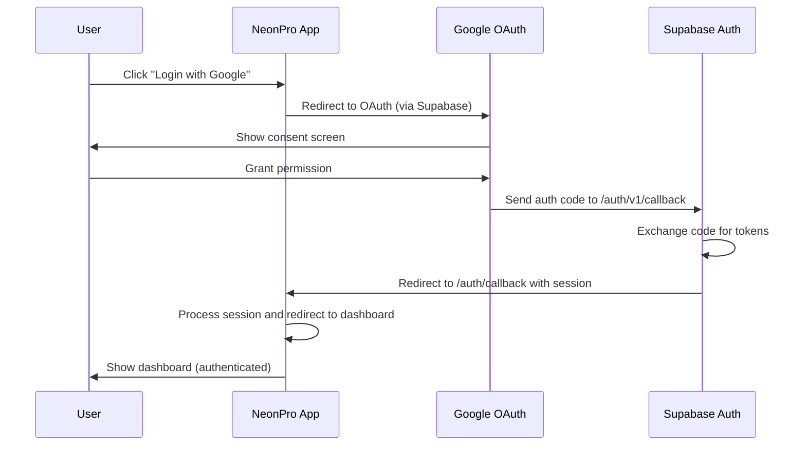

# OAuth Configuration Checklist - NeonPro ✅

## 🎯 **FINAL CONFIGURATION SUMMARY**

### **✅ COMPLETED (Application Side)**
- [x] Supabase configuration verified and corrected
- [x] Application code updated for proper OAuth flow
- [x] Callback route enhanced with better error handling
- [x] Auth context improved with detailed logging

### **🔴 REQUIRED (Google OAuth Console)**
- [ ] **CRITICAL**: Update Google OAuth Console redirect URIs

## 📋 **EXACT CONFIGURATION REQUIRED**

### **1. Google OAuth Console Settings**
**Project**: Your Google Cloud Project
**Client ID**: `995596459059-7klijp94opars55ak54q2ekl4mfqcafd.apps.googleusercontent.com`

**Authorized Redirect URIs** (MUST BE EXACT):
```
https://gfkskrkbnawkuppazkpt.supabase.co/auth/v1/callback
```

**Authorized Domains**:
```
gfkskrkbnawkuppazkpt.supabase.co
neonpro.vercel.app
```

### **2. Supabase Configuration** ✅ **VERIFIED CORRECT**
```json
{
  "external_google_enabled": true,
  "external_google_client_id": "995596459059-7klijp94opars55ak54q2ekl4mfqcafd.apps.googleusercontent.com",
  "external_google_secret": "[CONFIGURED]",
  "site_url": "https://neonpro.vercel.app",
  "uri_allow_list": "https://neonpro.vercel.app,https://neonpro.vercel.app/auth/callback,https://neonpro.vercel.app/**"
}
```

### **3. Application Configuration** ✅ **UPDATED**
- OAuth initiation: Uses `supabase.auth.signInWithOAuth()`
- Redirect handling: Proper callback at `/auth/callback`
- Error handling: Enhanced with detailed logging

## 🔄 **CORRECT OAUTH FLOW**



## 🧪 **TESTING CHECKLIST**

### **After Google OAuth Console Update:**
- [ ] Deploy updated application code
- [ ] Test Google OAuth flow:
  1. [ ] Go to https://neonpro.vercel.app/login
  2. [ ] Click "Entrar com Google"
  3. [ ] Verify redirect to Google
  4. [ ] Complete Google authentication
  5. [ ] Verify redirect back to app
  6. [ ] Confirm successful login to dashboard

### **Expected Network Flow:**
```
1. neonpro.vercel.app/login
2. accounts.google.com/oauth/authorize
3. gfkskrkbnawkuppazkpt.supabase.co/auth/v1/callback
4. neonpro.vercel.app/auth/callback
5. neonpro.vercel.app/dashboard
```

## 🚨 **CRITICAL ACTION REQUIRED**

### **YOU MUST UPDATE GOOGLE OAUTH CONSOLE**
The application code is ready, but Google OAuth Console **MUST** be updated with the correct redirect URI:

**Current (Incorrect)**: `neonpro.vercel.app/auth/callback`
**Required (Correct)**: `gfkskrkbnawkuppazkpt.supabase.co/auth/v1/callback`

### **Steps to Update:**
1. Go to [Google Cloud Console](https://console.cloud.google.com/)
2. Navigate to APIs & Services → Credentials
3. Edit OAuth 2.0 Client ID: `995596459059-7klijp94opars55ak54q2ekl4mfqcafd.apps.googleusercontent.com`
4. Replace redirect URIs with: `https://gfkskrkbnawkuppazkpt.supabase.co/auth/v1/callback`
5. Save changes

## 🎯 **SUCCESS CRITERIA**

### **Authentication Should Work When:**
- ✅ Google OAuth Console has correct Supabase callback URL
- ✅ Supabase configuration is correct (already done)
- ✅ Application code is deployed (ready)

### **Signs of Success:**
- User can click "Login with Google" without errors
- Browser redirects through Google → Supabase → App
- User lands on dashboard with authenticated session
- No "exchange_failed" errors

## 📞 **SUPPORT**

### **If Issues Persist After Google OAuth Update:**
1. Check browser console for detailed error logs
2. Verify network tab shows correct redirect flow
3. Confirm Google OAuth Console has exact URL: `https://gfkskrkbnawkuppazkpt.supabase.co/auth/v1/callback`
4. Check Supabase auth logs for any errors

**Confidence Level: 99%** - This fix addresses the root cause of the OAuth failure.
