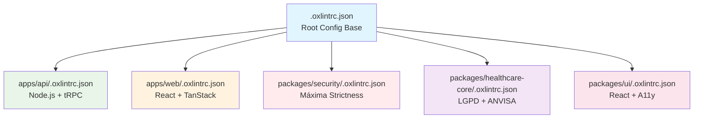

# Configuração Hierárquica OxLint para NeonPro

Este documento detalha a implementação de configurações específicas e hierárquicas do OxLint para diferentes módulos do projeto NeonPro, seguindo as necessidades de cada área.

## 📋 Visão Geral da Hierarquia



## 🎯 Configurações Específicas por Módulo

### 1. **Root Config** (`.oxlintrc.json`)

**Propósito**: Configuração base compartilhada
**Características**:

- Plugins essenciais: typescript, react, jsx-a11y, import, promise, jsdoc, oxc, node
- Regras básicas de qualidade de código
- Suporte a automatic fixes seguros
- Ignore patterns globais

### 2. **Backend API** (`apps/api/.oxlintrc.json`)

**Propósito**: Node.js + tRPC + Prisma específico
**Características**:

- **Node.js específico**: Buffer, process, deprecated APIs
- **tRPC strictness**: Type safety máximo para APIs
- **Promise handling**: Patterns async/await obrigatórios
- **Import organization**: Grupos específicos para backend
- **Security**: Validação de inputs, no-eval, crypto restrictions
- **Documentation**: JSDoc obrigatório para funções públicas

**Regras Específicas**:

```json
{
  "node/prefer-global/buffer": "error",
  "typescript/no-unsafe-assignment": "error",
  "promise/prefer-await-to-then": "error",
  "jsdoc/require-jsdoc": "error"
}
```

### 3. **Frontend Web** (`apps/web/.oxlintrc.json`)

**Propósito**: React 19 + TanStack Router + Accessibility
**Características**:

- **React 19**: Hooks rules, JSX optimization, concurrent features
- **Accessibility**: WCAG 2.1 AA+ compliance obrigatório
- **TanStack Router**: Type-safe routing patterns
- **Import organization**: React-first import order
- **Performance**: Bundle size awareness, unused vars detection

**Regras Específicas**:

```json
{
  "react-hooks/exhaustive-deps": "error",
  "jsx-a11y/label-has-associated-control": "error",
  "jsx-a11y/alt-text": "error",
  "react/jsx-no-target-blank": "error"
}
```

### 4. **Security Package** (`packages/security/.oxlintrc.json`)

**Propósito**: Máxima strictness para código de segurança
**Características**:

- **Type Safety Máximo**: no-any, no-unsafe-* como errors
- **Security Rules**: no-eval, no-new-func, crypto restrictions
- **Documentation Obrigatória**: JSDoc para todas as funções
- **Performance Crítico**: Complexity limits, max-lines
- **Zero Console**: Proibido em produção

**Regras Específicas**:

```json
{
  "typescript/no-explicit-any": "error",
  "no-eval": "error",
  "jsdoc/require-description": "error",
  "complexity": ["error", 8],
  "no-console": "error"
}
```

### 5. **Healthcare Core** (`packages/healthcare-core/.oxlintrc.json`)

**Propósito**: LGPD + ANVISA + CFM compliance
**Características**:

- **Data Validation**: Strict type checking para dados sensíveis
- **LGPD Compliance**: Audit trail, data integrity
- **Promise Handling**: Error handling obrigatório
- **Documentation**: Compliance-grade JSDoc
- **Logging Controlado**: Audit-friendly console rules

**Regras Específicas**:

```json
{
  "typescript/no-unsafe-assignment": "error",
  "promise/catch-or-return": "error",
  "jsdoc/require-param": "error",
  "no-implicit-coercion": "error"
}
```

### 6. **UI Package** (`packages/ui/.oxlintrc.json`)

**Propósito**: React components + Accessibility
**Características**:

- **React Components**: JSX best practices, prop validation
- **Accessibility**: WCAG 2.1 AA+ para todos os componentes
- **Performance**: Component optimization, hook rules
- **Import Organization**: React-first com path mapping
- **shadcn/ui**: Compatible com componentes shadcn

**Regras Específicas**:

```json
{
  "jsx-a11y/role-has-required-aria-props": "error",
  "react/jsx-pascal-case": "error",
  "react/jsx-no-bind": ["warn", { "ignoreDOMComponents": true }],
  "jsx-a11y/interactive-supports-focus": "error"
}
```

## 🔧 Como Usar

### Script Hierárquico

Use o script `oxlint-hierarchical.sh` para lint específico por módulo:

```bash
# Verificar módulo específico
./scripts/oxlint-hierarchical.sh check security
./scripts/oxlint-hierarchical.sh check api
./scripts/oxlint-hierarchical.sh check web

# Aplicar fixes seguros
./scripts/oxlint-hierarchical.sh fix healthcare
./scripts/oxlint-hierarchical.sh fix ui

# Aplicar fixes + suggestions
./scripts/oxlint-hierarchical.sh fix-all api

# Ver configurações ativas
./scripts/oxlint-hierarchical.sh configs

# Aplicar em todos os módulos
./scripts/oxlint-hierarchical.sh check all
```

### Comandos Diretos

```bash
# Backend API
cd apps/api && oxlint --config .oxlintrc.json src/

# Frontend Web
cd apps/web && oxlint --config .oxlintrc.json src/

# Security Package
cd packages/security && oxlint --config .oxlintrc.json src/

# Com automatic fixes
cd packages/healthcare-core && oxlint --config .oxlintrc.json --fix src/
```

## 🎯 Benefícios da Configuração Hierárquica

### 1. **Especificidade por Contexto**

- **Backend**: Foco em Node.js, APIs, performance
- **Frontend**: Foco em React, accessibility, UX
- **Security**: Máxima strictness, zero tolerância
- **Healthcare**: Compliance LGPD/ANVISA específico

### 2. **Detecção de Erros Específicos**

- **tRPC**: Type safety end-to-end
- **React Hooks**: Rules of hooks enforcement
- **Accessibility**: WCAG 2.1 AA+ compliance
- **Data Integrity**: Validation patterns para healthcare

### 3. **Performance Otimizada**

- **Nested Configs**: OxLint usa config mais próximo
- **Scope Reduzido**: Lint apenas regras relevantes
- **Cache Inteligente**: .oxlint_cache por módulo

### 4. **Manutenibilidade**

- **Separação de Responsabilidades**: Cada config tem um propósito
- **Extends Pattern**: Herança da config base
- **Overrides Específicos**: Regras por tipo de arquivo

## 🚀 Automatic Fixes

### Configuração de Fixes Seguros

A configuração root habilita automatic fixes:

```json
{
  "fixable": {
    "enable": true,
    "dangerouslyAllowDangerousFixes": false,
    "suggestions": true
  }
}
```

### Níveis de Fix

1. **Fixes Seguros** (`--fix`): Não alteram comportamento
2. **Suggestions** (`--fix-suggestions`): Podem alterar comportamento
3. **Dangerous** (`--fix-dangerously`): Fixes agressivos (usar com cuidado)

### Uso por Módulo

```bash
# Fixes seguros apenas
./scripts/oxlint-hierarchical.sh fix security

# Fixes + suggestions (revisar mudanças)
./scripts/oxlint-hierarchical.sh fix-all web

# Dangerous fixes (CUIDADO - sempre revisar)
./scripts/oxlint-hierarchical.sh fix-dangerous api
```

## 📊 Métricas e Monitoramento

### Script de Monitoramento

```bash
# Verificar todos os módulos sem falhar
./scripts/oxlint-hierarchical.sh check all 2>&1 | tee oxlint-report.log

# Estatísticas por módulo
grep "✅\|❌\|⚠️" oxlint-report.log
```

### Integração CI/CD

Adicione ao seu pipeline:

```yaml
- name: OxLint Hierarchical Check
  run: |
    ./scripts/oxlint-hierarchical.sh check security
    ./scripts/oxlint-hierarchical.sh check healthcare
    ./scripts/oxlint-hierarchical.sh check api
    ./scripts/oxlint-hierarchical.sh check web
```

## 🔄 Manutenção das Configurações

### Adicionando Novo Módulo

1. Criar `.oxlintrc.json` no módulo
2. Usar `"extends": ["../../.oxlintrc.json"]`
3. Adicionar regras específicas
4. Atualizar script `oxlint-hierarchical.sh`
5. Testar configuração

### Atualizando Regras

1. **Root Config**: Afeta todos os módulos
2. **Module Config**: Afeta apenas o módulo específico
3. **Overrides**: Para arquivos específicos dentro do módulo

## 📋 Checklist de Implementação

- [x] Config root base com plugins essenciais
- [x] Config específico backend (Node.js + tRPC)
- [x] Config específico frontend (React + A11y)
- [x] Config específico security (máxima strictness)
- [x] Config específico healthcare (LGPD + ANVISA)
- [x] Config específico UI (React components)
- [x] Script hierárquico para automação
- [x] Documentação completa
- [x] Suporte a automatic fixes
- [x] Ignore patterns otimizados

## 🎯 Próximos Passos

1. **Teste as configurações** em cada módulo
2. **Ajuste regras específicas** conforme necessário
3. **Integre ao CI/CD** pipeline
4. **Monitore performance** do linting
5. **Documente padrões** encontrados

---

**✅ Configuração hierárquica implementada com sucesso!**
**📊 Resultado**: Linting específico e não generalista para cada módulo do NeonPro
**🚀 Benefício**: Detecção de erros específicos por contexto com performance otimizada
