# LGPD Automation System - Guia Técnico Completo

## 📋 Índice

1. [Visão Geral da Arquitetura](#visão-geral-da-arquitetura)
2. [Módulos do Sistema](#módulos-do-sistema)
3. [Configuração e Instalação](#configuração-e-instalação)
4. [Integração com Banco de Dados](#integração-com-banco-de-dados)
5. [APIs e Endpoints](#apis-e-endpoints)
6. [Monitoramento e Alertas](#monitoramento-e-alertas)
7. [Segurança e Compliance](#segurança-e-compliance)
8. [Performance e Otimização](#performance-e-otimização)
9. [Troubleshooting](#troubleshooting)
10. [Desenvolvimento e Extensões](#desenvolvimento-e-extensões)

## 🏗️ Visão Geral da Arquitetura

### Arquitetura Modular

O sistema LGPD Automation é construído com uma arquitetura modular que permite:

- **Escalabilidade**: Cada módulo pode ser escalado independentemente
- **Manutenibilidade**: Módulos isolados facilitam manutenção e atualizações
- **Flexibilidade**: Possibilidade de ativar/desativar módulos conforme necessário
- **Testabilidade**: Cada módulo pode ser testado isoladamente

```typescript
// Estrutura da Arquitetura
LGPDAutomationOrchestrator
├── ConsentAutomationManager
├── DataSubjectRightsAutomation
├── RealTimeComplianceMonitor
├── DataRetentionAutomation
├── BreachDetectionAutomation
├── DataMinimizationAutomation
├── ThirdPartyComplianceAutomation
└── AuditReportingAutomation
```

### Fluxo de Dados

```mermaid
graph TD
    A[Cliente/Usuário] --> B[API Gateway]
    B --> C[LGPD Orchestrator]
    C --> D[Módulos de Automação]
    D --> E[Supabase Database]
    D --> F[Compliance Manager]
    F --> G[Audit Logs]
    D --> H[Real-time Monitoring]
    H --> I[Alertas e Notificações]
```



## 🧩 Módulos do Sistema

### 1. Consent Automation Manager

**Responsabilidades:**

- Coleta automatizada de consentimentos
- Renovação automática de consentimentos
- Retirada de consentimentos
- Analytics de consentimento

**Configurações Principais:**

```typescript
interface ConsentAutomationConfig {
  processing_interval_minutes: number;
  auto_renewal_enabled: boolean;
  renewal_notification_days: number;
  analytics_enabled: boolean;
  tracking_enabled: boolean;
}
```

**Eventos Monitorados:**

- `consent_collected`
- `consent_renewed`
- `consent_withdrawn`
- `consent_expired`

### 2. Data Subject Rights Automation

**Responsabilidades:**

- Processamento automático de solicitações de acesso
- Retificação de dados
- Exclusão de dados (direito ao esquecimento)
- Portabilidade de dados

**Prazos Legais:**

- Resposta inicial: 15 dias
- Resposta completa: 30 dias (prorrogável por mais 30)

**Fluxo de Processamento:**

```typescript
// Exemplo de processamento de solicitação
const request = await rightsAutomation.processAccessRequest({
  user_id: 'user123',
  request_type: 'access',
  contact_email: 'user@example.com',
  identity_verified: true,
  requested_data_categories: ['personal', 'usage'],
});
```

### 3. Real-Time Compliance Monitor

**Métricas Monitoradas:**

- Taxa de conformidade de consentimento
- Tempo de resposta a solicitações
- Violações detectadas
- Status de retenção de dados

**Alertas Configuráveis:**

```typescript
interface AlertThresholds {
  consent_compliance: number; // %
  response_time_hours: number;
  breach_severity: 'low' | 'medium' | 'high';
  retention_compliance: number; // %
}
```

### 4. Data Retention Automation

**Tipos de Retenção:**

- `hard_delete`: Exclusão permanente
- `soft_delete`: Marcação como excluído
- `anonymization`: Anonimização dos dados
- `archival`: Arquivamento seguro

**Processo de Aprovação:**

```typescript
// Política requer aprovação
const policy = await retentionAutomation.createRetentionPolicy({
  name: 'User Data Retention',
  retention_period_months: 24,
  approval_required: true,
  backup_before_deletion: true,
});

// Aprovação da execução
const execution = await retentionAutomation.approveScheduledExecution(
  scheduleId,
  'admin@company.com'
);
```

### 5. Breach Detection Automation

**Tipos de Detecção:**

- Tentativas de login falhadas
- Acesso não autorizado
- Exportação suspeita de dados
- Alterações não autorizadas

**Resposta Automática:**

```typescript
interface AutoResponse {
  block_user: boolean;
  notify_admin: boolean;
  escalate_to_anpd: boolean;
  containment_actions: string[];
}
```

### 6. Data Minimization Automation

**Estratégias de Minimização:**

- **Anonimização**: Remoção de identificadores
- **Pseudonimização**: Substituição por pseudônimos
- **Agregação**: Agrupamento de dados
- **Mascaramento**: Ocultação parcial

**Avaliação de Impacto:**

```typescript
interface BusinessImpactAssessment {
  affected_features: string[];
  risk_level: 'low' | 'medium' | 'high';
  mitigation_strategies: string[];
  approval_required: boolean;
}
```

### 7. Third Party Compliance Automation

**Validações Automáticas:**

- Verificação de DPA (Data Processing Agreement)
- Monitoramento de transferências internacionais
- Validação de adequacy decisions
- Auditoria de safeguards implementadas

**Monitoramento Contínuo:**

```typescript
// Avaliação automática de conformidade
const assessment =
  await thirdPartyCompliance.performComplianceAssessment(providerId);

if (assessment.compliance_score < 80) {
  await thirdPartyCompliance.triggerComplianceReview(providerId);
}
```

### 8. Audit Reporting Automation

**Tipos de Relatórios:**

- Relatórios de conformidade mensais
- Relatórios de incidentes
- Dashboards executivos
- Trilhas de auditoria detalhadas

**Formatos Suportados:**

- PDF (relatórios formais)
- JSON (integração com sistemas)
- CSV (análise de dados)
- HTML (visualização web)

## ⚙️ Configuração e Instalação

### Pré-requisitos

```bash
# Node.js 18+
node --version

# TypeScript
npm install -g typescript

# Dependências do projeto
npm install @supabase/supabase-js
npm install @types/node
npm install jest @types/jest
```

### Configuração do Ambiente

```typescript
// .env.local
NEXT_PUBLIC_SUPABASE_URL=your_supabase_url
NEXT_PUBLIC_SUPABASE_ANON_KEY=your_supabase_anon_key
SUPABASE_SERVICE_ROLE_KEY=your_service_role_key

// Configurações LGPD
LGPD_AUTOMATION_ENVIRONMENT=production
LGPD_NOTIFICATION_EMAIL=compliance@company.com
LGPD_ANPD_NOTIFICATION_ENDPOINT=https://api.anpd.gov.br/notifications
```

### Inicialização do Sistema

```typescript
import { createClient } from '@supabase/supabase-js';
import { LGPDComplianceManager } from '../LGPDComplianceManager';
import { LGPDAutomationOrchestrator, getLGPDAutomationConfig } from './index';

// Configuração
const supabase = createClient(
  process.env.NEXT_PUBLIC_SUPABASE_URL!,
  process.env.SUPABASE_SERVICE_ROLE_KEY!
);

const complianceManager = new LGPDComplianceManager(supabase);
const config = getLGPDAutomationConfig('production');

// Inicialização
const orchestrator = new LGPDAutomationOrchestrator(
  supabase,
  complianceManager,
  config
);

// Iniciar todos os módulos
await orchestrator.startAllAutomation();
```

## 🗄️ Integração com Banco de Dados

### Estrutura de Tabelas

#### Tabelas Principais

```sql
-- Consentimentos
CREATE TABLE lgpd_consents (
  id UUID PRIMARY KEY DEFAULT gen_random_uuid(),
  user_id UUID REFERENCES auth.users(id),
  purpose consent_purpose_enum NOT NULL,
  consent_given BOOLEAN NOT NULL,
  collection_method consent_collection_method_enum,
  consent_text TEXT,
  legal_basis legal_basis_enum,
  data_categories TEXT[],
  retention_period_months INTEGER,
  third_party_sharing BOOLEAN DEFAULT false,
  created_at TIMESTAMP WITH TIME ZONE DEFAULT NOW(),
  updated_at TIMESTAMP WITH TIME ZONE DEFAULT NOW(),
  expires_at TIMESTAMP WITH TIME ZONE,
  withdrawn_at TIMESTAMP WITH TIME ZONE
);

-- Solicitações de Direitos do Titular
CREATE TABLE lgpd_data_subject_requests (
  id UUID PRIMARY KEY DEFAULT gen_random_uuid(),
  user_id UUID REFERENCES auth.users(id),
  request_type data_subject_request_type_enum NOT NULL,
  status request_status_enum DEFAULT 'pending',
  contact_email TEXT NOT NULL,
  identity_verified BOOLEAN DEFAULT false,
  requested_data_categories TEXT[],
  created_at TIMESTAMP WITH TIME ZONE DEFAULT NOW(),
  updated_at TIMESTAMP WITH TIME ZONE DEFAULT NOW(),
  completed_at TIMESTAMP WITH TIME ZONE,
  legal_deadline TIMESTAMP WITH TIME ZONE
);

-- Políticas de Retenção
CREATE TABLE lgpd_retention_policies (
  id UUID PRIMARY KEY DEFAULT gen_random_uuid(),
  name TEXT NOT NULL,
  description TEXT,
  table_name TEXT NOT NULL,
  retention_period_months INTEGER NOT NULL,
  retention_type retention_type_enum NOT NULL,
  conditions JSONB,
  approval_required BOOLEAN DEFAULT true,
  created_at TIMESTAMP WITH TIME ZONE DEFAULT NOW(),
  updated_at TIMESTAMP WITH TIME ZONE DEFAULT NOW()
);
```

#### Funções RPC

```sql
-- Função para obter métricas de conformidade
CREATE OR REPLACE FUNCTION get_compliance_metrics(
  start_date DATE DEFAULT CURRENT_DATE - INTERVAL '30 days',
  end_date DATE DEFAULT CURRENT_DATE
)
RETURNS JSON AS $$
DECLARE
  result JSON;
BEGIN
  SELECT json_build_object(
    'consent_metrics', (
      SELECT json_build_object(
        'total_consents', COUNT(*),
        'active_consents', COUNT(*) FILTER (WHERE consent_given = true AND withdrawn_at IS NULL),
        'consent_rate', ROUND(
          (COUNT(*) FILTER (WHERE consent_given = true)::DECIMAL / NULLIF(COUNT(*), 0)) * 100, 2
        )
      )
      FROM lgpd_consents
      WHERE created_at::DATE BETWEEN start_date AND end_date
    ),
    'request_metrics', (
      SELECT json_build_object(
        'total_requests', COUNT(*),
        'completed_requests', COUNT(*) FILTER (WHERE status = 'completed'),
        'avg_response_time_hours', ROUND(
          AVG(EXTRACT(EPOCH FROM (completed_at - created_at)) / 3600), 2
        ) FILTER (WHERE completed_at IS NOT NULL)
      )
      FROM lgpd_data_subject_requests
      WHERE created_at::DATE BETWEEN start_date AND end_date
    )
  ) INTO result;

  RETURN result;
END;
$$ LANGUAGE plpgsql SECURITY DEFINER;
```

### Triggers e Automações

```sql
-- Trigger para atualizar timestamp
CREATE OR REPLACE FUNCTION update_updated_at_column()
RETURNS TRIGGER AS $$
BEGIN
  NEW.updated_at = NOW();
  RETURN NEW;
END;
$$ LANGUAGE plpgsql;

-- Aplicar trigger em todas as tabelas LGPD
CREATE TRIGGER update_lgpd_consents_updated_at
  BEFORE UPDATE ON lgpd_consents
  FOR EACH ROW EXECUTE FUNCTION update_updated_at_column();

-- Trigger para log de auditoria
CREATE OR REPLACE FUNCTION log_lgpd_audit()
RETURNS TRIGGER AS $$
BEGIN
  INSERT INTO lgpd_audit_logs (
    table_name,
    operation,
    old_data,
    new_data,
    user_id,
    timestamp
  ) VALUES (
    TG_TABLE_NAME,
    TG_OP,
    CASE WHEN TG_OP = 'DELETE' THEN row_to_json(OLD) ELSE NULL END,
    CASE WHEN TG_OP IN ('INSERT', 'UPDATE') THEN row_to_json(NEW) ELSE NULL END,
    COALESCE(NEW.user_id, OLD.user_id),
    NOW()
  );

  RETURN COALESCE(NEW, OLD);
END;
$$ LANGUAGE plpgsql SECURITY DEFINER;
```

## 🔌 APIs e Endpoints

### Next.js API Routes

#### Consent Management

```typescript
// pages/api/lgpd/consent/collect.ts
import type { NextApiRequest, NextApiResponse } from 'next';
import { getOrchestrator } from '@/lib/lgpd/automation/api-helpers';

export default async function handler(
  req: NextApiRequest,
  res: NextApiResponse
) {
  if (req.method !== 'POST') {
    return res.status(405).json({ error: 'Method not allowed' });
  }

  try {
    const orchestrator = await getOrchestrator();
    const { consentAutomation } = orchestrator.getModules();

    const result = await consentAutomation.collectConsentWithTracking(req.body);

    res.status(200).json(result);
  } catch (error) {
    console.error('Consent collection error:', error);
    res.status(500).json({ error: 'Internal server error' });
  }
}
```

#### Data Subject Rights

```typescript
// pages/api/lgpd/rights/request.ts
export default async function handler(
  req: NextApiRequest,
  res: NextApiResponse
) {
  const { method } = req;

  switch (method) {
    case 'POST':
      return handleCreateRequest(req, res);
    case 'GET':
      return handleGetRequest(req, res);
    case 'PUT':
      return handleUpdateRequest(req, res);
    default:
      return res.status(405).json({ error: 'Method not allowed' });
  }
}

async function handleCreateRequest(req: NextApiRequest, res: NextApiResponse) {
  const orchestrator = await getOrchestrator();
  const { dataSubjectRights } = orchestrator.getModules();

  const { request_type } = req.body;

  let result;
  switch (request_type) {
    case 'access':
      result = await dataSubjectRights.processAccessRequest(req.body);
      break;
    case 'rectification':
      result = await dataSubjectRights.processRectificationRequest(req.body);
      break;
    case 'deletion':
      result = await dataSubjectRights.processDeletionRequest(req.body);
      break;
    case 'portability':
      result = await dataSubjectRights.processPortabilityRequest(req.body);
      break;
    default:
      return res.status(400).json({ error: 'Invalid request type' });
  }

  res.status(200).json(result);
}
```

#### Compliance Dashboard

```typescript
// pages/api/lgpd/dashboard.ts
export default async function handler(
  req: NextApiRequest,
  res: NextApiResponse
) {
  if (req.method !== 'GET') {
    return res.status(405).json({ error: 'Method not allowed' });
  }

  try {
    const orchestrator = await getOrchestrator();
    const dashboard = await orchestrator.getUnifiedDashboard();

    res.status(200).json(dashboard);
  } catch (error) {
    console.error('Dashboard error:', error);
    res.status(500).json({ error: 'Internal server error' });
  }
}
```

### Middleware de Consentimento

```typescript
// middleware/consent-check.ts
import { NextRequest, NextResponse } from 'next/server';
import { getOrchestrator } from '@/lib/lgpd/automation/api-helpers';

export async function consentMiddleware(request: NextRequest) {
  const userId = request.headers.get('x-user-id');

  if (!userId) {
    return NextResponse.redirect(new URL('/login', request.url));
  }

  try {
    const orchestrator = await getOrchestrator();
    const { consentAutomation } = orchestrator.getModules();

    const consents = await consentAutomation.getUserConsents(userId);
    const hasValidConsent = consents.some(
      (consent) =>
        consent.consent_given &&
        !consent.withdrawn_at &&
        (!consent.expires_at || new Date(consent.expires_at) > new Date())
    );

    if (!hasValidConsent) {
      return NextResponse.redirect(new URL('/consent', request.url));
    }

    return NextResponse.next();
  } catch (error) {
    console.error('Consent check error:', error);
    return NextResponse.redirect(new URL('/error', request.url));
  }
}
```

## 📊 Monitoramento e Alertas

### Sistema de Alertas

```typescript
// Configuração de alertas
interface AlertConfig {
  type: 'email' | 'webhook' | 'sms';
  recipients: string[];
  severity_threshold: 'low' | 'medium' | 'high';
  frequency_limit: number; // máximo por hora
}

// Exemplo de callback de alerta
const alertCallback = async (alert: ComplianceAlert) => {
  if (alert.severity === 'high') {
    // Notificação imediata
    await sendImmediateNotification(alert);

    // Escalar para ANPD se necessário
    if (alert.type === 'data_breach') {
      await escalateToANPD(alert);
    }
  }

  // Log para auditoria
  await logAlert(alert);
};

// Registrar callback
const { complianceMonitor } = orchestrator.getModules();
complianceMonitor.registerAlertCallback(alertCallback);
```

### Métricas de Performance

```typescript
// Monitoramento de performance
interface PerformanceMetrics {
  module_name: string;
  operation: string;
  execution_time_ms: number;
  memory_usage_mb: number;
  success_rate: number;
  error_count: number;
}

// Coleta automática de métricas
class PerformanceMonitor {
  private metrics: PerformanceMetrics[] = [];

  async trackOperation<T>(
    moduleName: string,
    operation: string,
    fn: () => Promise<T>
  ): Promise<T> {
    const startTime = Date.now();
    const startMemory = process.memoryUsage().heapUsed;

    try {
      const result = await fn();

      this.recordMetric({
        module_name: moduleName,
        operation,
        execution_time_ms: Date.now() - startTime,
        memory_usage_mb:
          (process.memoryUsage().heapUsed - startMemory) / 1024 / 1024,
        success_rate: 100,
        error_count: 0,
      });

      return result;
    } catch (error) {
      this.recordMetric({
        module_name: moduleName,
        operation,
        execution_time_ms: Date.now() - startTime,
        memory_usage_mb:
          (process.memoryUsage().heapUsed - startMemory) / 1024 / 1024,
        success_rate: 0,
        error_count: 1,
      });

      throw error;
    }
  }
}
```

## 🔒 Segurança e Compliance

### Criptografia de Dados

```typescript
import crypto from 'crypto';

class DataEncryption {
  private readonly algorithm = 'aes-256-gcm';
  private readonly keyLength = 32;

  encrypt(data: string, key: Buffer): EncryptedData {
    const iv = crypto.randomBytes(16);
    const cipher = crypto.createCipher(this.algorithm, key);
    cipher.setAAD(Buffer.from('lgpd-automation'));

    let encrypted = cipher.update(data, 'utf8', 'hex');
    encrypted += cipher.final('hex');

    const authTag = cipher.getAuthTag();

    return {
      encrypted,
      iv: iv.toString('hex'),
      authTag: authTag.toString('hex'),
    };
  }

  decrypt(encryptedData: EncryptedData, key: Buffer): string {
    const decipher = crypto.createDecipher(this.algorithm, key);
    decipher.setAAD(Buffer.from('lgpd-automation'));
    decipher.setAuthTag(Buffer.from(encryptedData.authTag, 'hex'));

    let decrypted = decipher.update(encryptedData.encrypted, 'hex', 'utf8');
    decrypted += decipher.final('utf8');

    return decrypted;
  }
}
```

### Controle de Acesso

```typescript
// Sistema de permissões baseado em roles
interface UserPermissions {
  user_id: string;
  roles: string[];
  permissions: string[];
  data_access_level: 'none' | 'read' | 'write' | 'admin';
}

class AccessControl {
  async checkPermission(
    userId: string,
    operation: string,
    resource: string
  ): Promise<boolean> {
    const permissions = await this.getUserPermissions(userId);

    // Verificar role admin
    if (permissions.roles.includes('lgpd_admin')) {
      return true;
    }

    // Verificar permissão específica
    const requiredPermission = `${operation}:${resource}`;
    return permissions.permissions.includes(requiredPermission);
  }

  async auditAccess(
    userId: string,
    operation: string,
    resource: string,
    granted: boolean
  ): Promise<void> {
    await this.logAuditEvent({
      event_type: 'access_control',
      user_id: userId,
      operation,
      resource,
      access_granted: granted,
      timestamp: new Date().toISOString(),
    });
  }
}
```

### Validação de Dados

```typescript
import Joi from 'joi';

// Schemas de validação
const consentSchema = Joi.object({
  user_id: Joi.string().uuid().required(),
  purpose: Joi.string()
    .valid('marketing', 'analytics', 'personalization', 'communication')
    .required(),
  consent_given: Joi.boolean().required(),
  collection_method: Joi.string()
    .valid('web_form', 'email', 'phone', 'in_person', 'api')
    .required(),
  legal_basis: Joi.string()
    .valid(
      'consent',
      'contract',
      'legal_obligation',
      'vital_interests',
      'public_task',
      'legitimate_interests'
    )
    .required(),
  data_categories: Joi.array().items(Joi.string()).min(1).required(),
  retention_period_months: Joi.number().integer().min(1).max(120).required(),
});

// Middleware de validação
export function validateRequest(schema: Joi.ObjectSchema) {
  return (req: NextApiRequest, res: NextApiResponse, next: Function) => {
    const { error } = schema.validate(req.body);

    if (error) {
      return res.status(400).json({
        error: 'Validation error',
        details: error.details.map((d) => d.message),
      });
    }

    next();
  };
}
```

## ⚡ Performance e Otimização

### Cache Strategy

```typescript
import Redis from 'ioredis';

class CacheManager {
  private redis: Redis;

  constructor() {
    this.redis = new Redis(process.env.REDIS_URL!);
  }

  async get<T>(key: string): Promise<T | null> {
    const cached = await this.redis.get(key);
    return cached ? JSON.parse(cached) : null;
  }

  async set(key: string, value: any, ttlSeconds: number = 3600): Promise<void> {
    await this.redis.setex(key, ttlSeconds, JSON.stringify(value));
  }

  async invalidate(pattern: string): Promise<void> {
    const keys = await this.redis.keys(pattern);
    if (keys.length > 0) {
      await this.redis.del(...keys);
    }
  }
}

// Uso em módulos
class OptimizedConsentManager extends ConsentAutomationManager {
  private cache = new CacheManager();

  async getUserConsents(userId: string) {
    const cacheKey = `consents:${userId}`;

    // Tentar cache primeiro
    let consents = await this.cache.get(cacheKey);

    if (!consents) {
      // Buscar do banco
      consents = await super.getUserConsents(userId);

      // Cachear por 1 hora
      await this.cache.set(cacheKey, consents, 3600);
    }

    return consents;
  }
}
```

### Batch Processing

```typescript
class BatchProcessor {
  private batchSize: number = 100;
  private processingQueue: any[] = [];

  async processBatch<T, R>(
    items: T[],
    processor: (batch: T[]) => Promise<R[]>
  ): Promise<R[]> {
    const results: R[] = [];

    for (let i = 0; i < items.length; i += this.batchSize) {
      const batch = items.slice(i, i + this.batchSize);
      const batchResults = await processor(batch);
      results.push(...batchResults);

      // Pequena pausa entre batches para não sobrecarregar
      await new Promise((resolve) => setTimeout(resolve, 100));
    }

    return results;
  }
}

// Exemplo de uso
const batchProcessor = new BatchProcessor();

// Processar consentimentos em lote
const processConsentsBatch = async (consents: ConsentData[]) => {
  return await batchProcessor.processBatch(consents, async (batch) => {
    const promises = batch.map((consent) =>
      consentManager.collectConsentWithTracking(consent)
    );
    return await Promise.all(promises);
  });
};
```

### Database Optimization

```sql
-- Índices para performance
CREATE INDEX CONCURRENTLY idx_lgpd_consents_user_purpose
  ON lgpd_consents(user_id, purpose)
  WHERE consent_given = true AND withdrawn_at IS NULL;

CREATE INDEX CONCURRENTLY idx_lgpd_requests_status_created
  ON lgpd_data_subject_requests(status, created_at);

CREATE INDEX CONCURRENTLY idx_lgpd_audit_logs_timestamp
  ON lgpd_audit_logs(timestamp DESC);

-- Particionamento por data
CREATE TABLE lgpd_audit_logs_2024 PARTITION OF lgpd_audit_logs
  FOR VALUES FROM ('2024-01-01') TO ('2025-01-01');

-- Função para limpeza automática de logs antigos
CREATE OR REPLACE FUNCTION cleanup_old_audit_logs()
RETURNS void AS $$
BEGIN
  DELETE FROM lgpd_audit_logs
  WHERE timestamp < NOW() - INTERVAL '2 years';
END;
$$ LANGUAGE plpgsql;

-- Agendar limpeza mensal
SELECT cron.schedule('cleanup-audit-logs', '0 2 1 * *', 'SELECT cleanup_old_audit_logs();');
```

## 🔧 Troubleshooting

### Problemas Comuns

#### 1. Timeout em Operações de Retenção

**Sintoma**: Operações de retenção falham com timeout

**Causa**: Volume muito grande de dados para processar

**Solução**:

```typescript
// Configurar batch size menor
const config = {
  data_retention: {
    batch_size: 500, // Reduzir de 1000 para 500
    processing_timeout_minutes: 30, // Aumentar timeout
    parallel_processing: false, // Desabilitar processamento paralelo
  },
};

// Ou processar em horários de baixo tráfego
const schedule = {
  execution_date: '2024-01-01T02:00:00Z', // 2h da manhã
  dry_run: true, // Testar primeiro
};
```

#### 2. Alertas Duplicados

**Sintoma**: Múltiplos alertas para o mesmo evento

**Causa**: Callbacks registrados múltiplas vezes

**Solução**:

```typescript
// Implementar debounce
class AlertManager {
  private alertHistory = new Map<string, number>();
  private debounceTime = 5 * 60 * 1000; // 5 minutos

  async sendAlert(alert: ComplianceAlert) {
    const alertKey = `${alert.type}:${alert.severity}:${alert.source}`;
    const lastSent = this.alertHistory.get(alertKey);

    if (lastSent && Date.now() - lastSent < this.debounceTime) {
      console.log('Alert debounced:', alertKey);
      return;
    }

    await this.doSendAlert(alert);
    this.alertHistory.set(alertKey, Date.now());
  }
}
```

#### 3. Performance Degradada

**Sintoma**: Sistema lento, timeouts frequentes

**Diagnóstico**:

```typescript
// Verificar métricas de performance
const metrics = await orchestrator.getAutomationMetrics();
console.log('Performance metrics:', {
  avgResponseTime: metrics.avg_response_time_ms,
  errorRate: metrics.error_rate,
  memoryUsage: process.memoryUsage(),
});

// Verificar status dos módulos
const status = await orchestrator.getAutomationStatus();
const slowModules = status.filter((s) => s.avg_processing_time_ms > 5000);
console.log('Slow modules:', slowModules);
```

**Soluções**:

1. Aumentar recursos do servidor
2. Implementar cache mais agressivo
3. Otimizar queries do banco
4. Reduzir frequência de monitoramento

### Logs e Debugging

```typescript
// Configurar logging detalhado
const debugConfig = {
  global_settings: {
    debug_mode: true,
    log_level: 'debug',
    performance_monitoring: true,
    detailed_error_logging: true,
  },
};

// Logger customizado
class LGPDLogger {
  private context: string;

  constructor(context: string) {
    this.context = context;
  }

  debug(message: string, data?: any) {
    if (process.env.NODE_ENV === 'development') {
      console.log(`[${this.context}] DEBUG:`, message, data);
    }
  }

  error(message: string, error?: Error, data?: any) {
    console.error(`[${this.context}] ERROR:`, message, {
      error: error?.message,
      stack: error?.stack,
      data,
    });

    // Enviar para serviço de monitoramento
    this.sendToMonitoring('error', { message, error, data });
  }

  private async sendToMonitoring(level: string, data: any) {
    // Integração com Sentry, DataDog, etc.
  }
}
```

## 🚀 Desenvolvimento e Extensões

### Criando Novos Módulos

```typescript
// Template para novo módulo
abstract class BaseLGPDModule {
  protected supabase: SupabaseClient<Database>;
  protected complianceManager: LGPDComplianceManager;
  protected config: any;
  protected logger: LGPDLogger;

  constructor(
    supabase: SupabaseClient<Database>,
    complianceManager: LGPDComplianceManager,
    config: any
  ) {
    this.supabase = supabase;
    this.complianceManager = complianceManager;
    this.config = config;
    this.logger = new LGPDLogger(this.constructor.name);
  }

  abstract async start(): Promise<{ success: boolean; message?: string }>;
  abstract async stop(): Promise<{ success: boolean; message?: string }>;
  abstract async getStatus(): Promise<ModuleStatus>;
  abstract async getMetrics(): Promise<ModuleMetrics>;
}

// Exemplo de novo módulo
class CookieComplianceAutomation extends BaseLGPDModule {
  private monitoringInterval?: NodeJS.Timeout;

  async start() {
    this.logger.debug('Starting cookie compliance monitoring');

    this.monitoringInterval = setInterval(
      () => this.checkCookieCompliance(),
      this.config.monitoring_interval_minutes * 60 * 1000
    );

    return { success: true, message: 'Cookie compliance monitoring started' };
  }

  async stop() {
    if (this.monitoringInterval) {
      clearInterval(this.monitoringInterval);
      this.monitoringInterval = undefined;
    }

    return { success: true, message: 'Cookie compliance monitoring stopped' };
  }

  private async checkCookieCompliance() {
    // Implementar verificação de cookies
    this.logger.debug('Checking cookie compliance');
  }
}
```

### Hooks e Extensibilidade

```typescript
// Sistema de hooks para extensibilidade
interface LGPDHook {
  name: string;
  priority: number;
  handler: (context: any) => Promise<any>;
}

class HookManager {
  private hooks = new Map<string, LGPDHook[]>();

  register(event: string, hook: LGPDHook) {
    if (!this.hooks.has(event)) {
      this.hooks.set(event, []);
    }

    const eventHooks = this.hooks.get(event)!;
    eventHooks.push(hook);
    eventHooks.sort((a, b) => a.priority - b.priority);
  }

  async execute(event: string, context: any) {
    const eventHooks = this.hooks.get(event) || [];

    for (const hook of eventHooks) {
      try {
        context = await hook.handler(context);
      } catch (error) {
        console.error(`Hook ${hook.name} failed:`, error);
      }
    }

    return context;
  }
}

// Uso de hooks
const hookManager = new HookManager();

// Registrar hook para validação customizada
hookManager.register('before_consent_collection', {
  name: 'custom_validation',
  priority: 10,
  handler: async (context) => {
    // Validação customizada
    if (!context.data.custom_field) {
      throw new Error('Custom field is required');
    }
    return context;
  },
});

// Executar hooks
const context = await hookManager.execute('before_consent_collection', {
  data: consentData,
  user: userData,
});
```

### Testes Automatizados

```typescript
// Configuração de testes de integração
describe('LGPD Integration Tests', () => {
  let testOrchestrator: LGPDAutomationOrchestrator;
  let testDatabase: SupabaseClient;

  beforeAll(async () => {
    // Configurar banco de teste
    testDatabase = createClient(
      process.env.TEST_SUPABASE_URL!,
      process.env.TEST_SUPABASE_KEY!
    );

    // Limpar dados de teste
    await cleanTestData(testDatabase);

    // Inicializar orquestrador de teste
    testOrchestrator = new LGPDAutomationOrchestrator(
      testDatabase,
      new LGPDComplianceManager(testDatabase),
      getLGPDAutomationConfig('test')
    );

    await testOrchestrator.startAllAutomation();
  });

  afterAll(async () => {
    await testOrchestrator.stopAllAutomation();
    await cleanTestData(testDatabase);
  });

  test('End-to-end consent flow', async () => {
    // Coletar consentimento
    const consent = await testOrchestrator
      .getModules()
      .consentAutomation.collectConsentWithTracking({
        user_id: 'test-user',
        purpose: 'marketing',
        consent_given: true,
        // ... outros campos
      });

    expect(consent.consent_id).toBeDefined();

    // Verificar auditoria
    const auditLogs = await testOrchestrator
      .getModules()
      .auditReporting.getAuditTrail({
        user_id: 'test-user',
        event_type: 'consent_collected',
      });

    expect(auditLogs.events).toHaveLength(1);

    // Retirar consentimento
    const withdrawal = await testOrchestrator
      .getModules()
      .consentAutomation.withdrawConsent({
        consent_id: consent.consent_id,
        user_id: 'test-user',
        withdrawal_reason: 'user_request',
        withdrawal_method: 'web_form',
      });

    expect(withdrawal.success).toBe(true);
  });
});
```

---

## 📞 Suporte e Manutenção

### Monitoramento de Saúde

```typescript
// Endpoint de health check
export async function healthCheck() {
  const checks = {
    database: await checkDatabaseConnection(),
    modules: await checkModulesStatus(),
    memory: checkMemoryUsage(),
    performance: await checkPerformanceMetrics(),
  };

  const isHealthy = Object.values(checks).every(
    (check) => check.status === 'ok'
  );

  return {
    status: isHealthy ? 'healthy' : 'unhealthy',
    timestamp: new Date().toISOString(),
    checks,
  };
}
```

### Backup e Recuperação

```sql
-- Script de backup automático
CREATE OR REPLACE FUNCTION backup_lgpd_data()
RETURNS void AS $$
BEGIN
  -- Backup das tabelas principais
  COPY lgpd_consents TO '/backup/consents_' || to_char(now(), 'YYYY-MM-DD') || '.csv' CSV HEADER;
  COPY lgpd_data_subject_requests TO '/backup/requests_' || to_char(now(), 'YYYY-MM-DD') || '.csv' CSV HEADER;
  COPY lgpd_audit_logs TO '/backup/audit_' || to_char(now(), 'YYYY-MM-DD') || '.csv' CSV HEADER;
END;
$$ LANGUAGE plpgsql;

-- Agendar backup diário
SELECT cron.schedule('daily-backup', '0 3 * * *', 'SELECT backup_lgpd_data();');
```

### Documentação de API

Para documentação completa da API, consulte:

- [Swagger/OpenAPI Documentation](./api-docs.yaml)
- [Postman Collection](./lgpd-automation.postman_collection.json)
- [Examples Repository](./examples/)

---

**Versão**: 1.0.0  
**Última Atualização**: Janeiro 2024  
**Licença**: MIT  
**Suporte**: compliance@company.com
