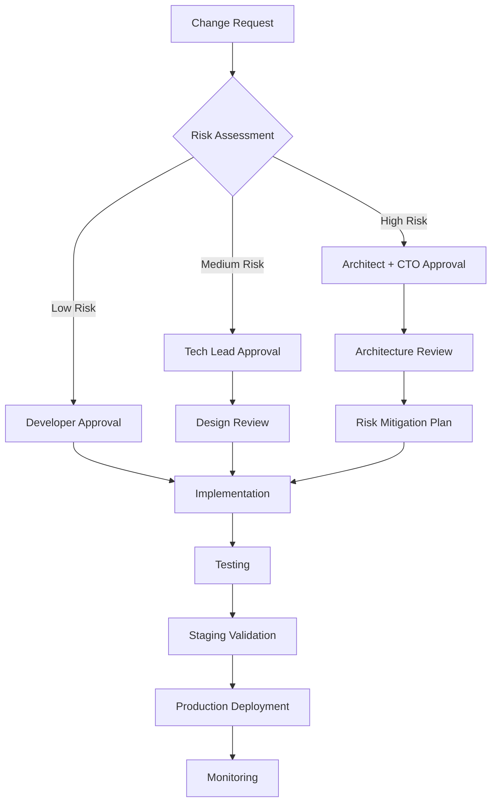

# NeonPro Architectural Analysis Artifacts

**Created**: 2025-01-30  
**Purpose**: Analysis frameworks, issue categorization, and recommendation matrices for comprehensive monorepo architectural review

---

## Artifact 1: Issue Categorization Framework

### 1.1 Issue Classification Matrix

| Category | Subcategory | Severity | Impact | Detection Method | Resolution Priority |
|----------|-------------|----------|---------|------------------|-------------------|
| **Code Duplication** | Exact Duplication | High | Maintenance overhead | Static analysis + semantic search | High |
| | Structural Duplication | Medium | Code complexity | Pattern matching | Medium |
| | Functional Duplication | High | Redundant logic | Semantic analysis | High |
| **Architectural Violations** | SOLID Violations | High | Maintainability | Code review + analysis | Critical |
| | DRY Violations | Medium | Redundancy | Duplication detection | Medium |
| | Separation of Concerns | High | Architecture integrity | Pattern analysis | Critical |
| **Misplaced Code** | Business Logic in UI | High | Architecture integrity | Component analysis | High |
| | Scattered Configuration | Medium | Maintainability | File system analysis | Medium |
| | Type Definitions | Medium | Type safety | Import analysis | Medium |
| **Performance Issues** | Bundle Size | Medium | Load performance | Bundle analysis | Medium |
| | Build Performance | Low | Developer experience | Build timing | Low |
| | Runtime Performance | High | User experience | Performance profiling | High |

### 1.2 Issue Severity Assessment Framework

```typescript
interface IssueSeverity {
  critical: {
    description: "Immediate attention required - affects core functionality"
    examples: ["Security vulnerabilities", "Data corruption", "System failures"]
    sla: "24 hours"
    approval: "Lead architect + CTO"
  }
  
  high: {
    description: "Important issues affecting maintainability or performance"
    examples: ["Architectural violations", "Performance degradation", "Code duplication"]
    sla: "1 week"
    approval: "Lead architect"
  }
  
  medium: {
    description: "Should be addressed - impacts code quality or developer experience"
    examples: ["Code organization", "Import patterns", "Documentation gaps"]
    sla: "2-4 weeks"
    approval: "Tech lead"
  }
  
  low: {
    description: "Nice to have - optimization opportunities"
    examples: ["Code style", "Minor optimizations", "Enhancement suggestions"]
    sla: "Next sprint"
    approval: "Developer"
  }
}
```

### 1.3 Impact Assessment Matrix

| Impact Area | Business Impact | Technical Impact | User Impact | Priority Score |
|-------------|----------------|------------------|-------------|----------------|
| **Functionality** | Revenue loss, feature delivery delay | System stability, reliability | Feature unavailable, errors | Critical (9-10) |
| **Performance** | Conversion rate, user retention | Resource usage, scalability | Slow loading, poor UX | High (7-8) |
| **Maintainability** | Development velocity, team productivity | Code quality, technical debt | Indirect (bug introduction) | Medium (5-6) |
| **Developer Experience** | Team satisfaction, onboarding time | Build times, tooling | Indirect (quality issues) | Low (3-4) |

---

## Artifact 2: Package Analysis Framework

### 2.1 Package Health Assessment

```typescript
interface PackageHealthMetrics {
  name: string
  version: string
  
  // Dependency Analysis
  dependencies: {
    internal: number        // Internal package dependencies
    external: number        // External npm dependencies
    circular: boolean       // Circular dependency detection
    depth: number          // Maximum dependency depth
  }
  
  // Code Quality
  code: {
    linesOfCode: number
    duplicatedLines: number
    complexity: number
    testCoverage: number
    typescriptCoverage: number
  }
  
  // Usage Analysis
  usage: {
    internalConsumers: number
    externalUsage: boolean
    apiSurface: number
    exports: number
  }
  
  // Maintainability
  maintainability: {
    documentation: number     // 0-100 score
    changelog: boolean
    semver: boolean
    stability: string       // stable | beta | experimental
  }
}
```

### 2.2 Component Placement Decision Tree

```mermaid
graph TD
    A[Component Analysis] --> B{Domain Specific?}
    B -->|Yes| C{Healthcare Business Logic?}
    B -->|No| D{Reusable Across Apps?}
    
    C -->|Yes| E[apps/web/src/components - App Specific]
    C -->|No| F{UI Primitive?}
    
    D -->|Yes| G[@neonpro/ui - Shared UI]
    D -->|No| H{Business Logic?}
    
    F -->|Yes| I[@neonpro/ui - Atomic Design]
    F -->|No| J[@neonpro/core - Business Logic]
    
    H -->|Yes| J
    H -->|No| K{Utility Function?}
    
    K -->|Yes| J
    K -->|No| L[Keep in Current Location]
```

### 2.3 Package Dependency Analysis

```typescript
interface DependencyAnalysis {
  packageName: string
  dependencies: PackageDependency[]
  dependents: PackageDependency[]
  healthScore: number
  
  visualization: {
    circularDependencies: boolean[]
    dependencyChains: string[][]
    optimizationOpportunities: string[]
  }
}

interface PackageDependency {
  name: string
  version: string
  type: 'internal' | 'external' | 'dev'
  critical: boolean
  alternatives?: string[]
}
```

---

## Artifact 3: Refactoring Recommendation Matrix

### 3.1 Recommendation Prioritization Framework

| Priority | Impact | Effort | ROI | Timeline | Risk Level |
|----------|--------|--------|-----|----------|------------|
| **P0 - Critical** | High | Low | Very High | 1-2 days | Low |
| **P1 - High** | High | Medium | High | 1 week | Medium |
| **P2 - Medium** | Medium | Medium | Medium | 2-3 weeks | Medium |
| **P3 - Low** | Low | High | Low | 1+ months | High |

### 3.2 Refactoring Strategy Matrix

| Strategy | Best For | Complexity | Risk | Success Rate | Example |
|----------|----------|------------|------|--------------|---------|
| **Extract Method** | Code duplication | Low | Low | 95% | Duplicate validation logic |
| **Extract Component** | UI duplication | Medium | Low | 90% | Similar form components |
| **Move to Package** | Shared functionality | High | Medium | 80% | Common business logic |
| **Consolidate Hooks** | State management patterns | Medium | Medium | 85% | Real-time subscriptions |
| **Restructure Imports** | Organization | Low | Low | 95% | Absolute vs relative paths |
| **Package Split** | Large packages | High | High | 70% | Breaking up @neonpro/ui |

### 3.3 Migration Path Templates

#### Template 1: Component Migration to @neonpro/ui
```typescript
// Step 1: Identify Candidate
const migrationCandidate = {
  component: 'PatientCard',
  location: 'apps/web/src/components/patients/PatientCard.tsx',
  criteria: {
    domainAgnostic: true,
    customizable: true,
    standalone: true,
    documented: false
  }
}

// Step 2: Migration Checklist
const migrationChecklist = [
  'Remove app-specific dependencies',
  'Add props interface for customization',
  'Add TypeScript documentation',
  'Move to appropriate ui package directory',
  'Update all import statements',
  'Add unit tests',
  'Update package exports'
]

// Step 3: Validation
const validationSteps = [
  'Component renders with default props',
  'Component accepts custom styling',
  'Component is accessible (WCAG 2.1 AA)',
  'Component has proper TypeScript types',
  'Component works in isolation'
]
```

#### Template 2: Package Creation (@neonpro/core)
```typescript
// Step 1: Package Structure
const corePackageStructure = {
  'src/hooks/': ['useAuth.ts', 'useRealtime.ts', 'useSupabase.ts'],
  'src/utils/': ['formatting.ts', 'validation.ts', 'helpers.ts'],
  'src/constants/': ['app.ts', 'api.ts', 'validation.ts'],
  'src/types/': ['common.ts', 'api.ts'],
  'src/index.ts': 'Barrel exports'
}

// Step 2: Migration Plan
const migrationPlan = [
  'Identify shared hooks across apps',
  'Extract pure utility functions',
  'Consolidate constants',
  'Move type definitions',
  'Update all imports',
  'Add comprehensive tests',
  'Document API surface'
]

// Step 3: Integration Testing
const integrationTests = [
  'Package builds successfully',
  'All imports resolve correctly',
  'TypeScript compilation passes',
  'Tests pass in isolation',
  'Integration with apps works'
]
```

---

## Artifact 4: Analysis Tools and Scripts

### 4.1 Automated Analysis Scripts

```bash
#!/bin/bash
# analyze-codebase.sh - Comprehensive codebase analysis

echo "🔍 Starting NeonPro Architectural Analysis..."

# 1. Package Dependency Analysis
echo "📦 Analyzing package dependencies..."
bun run analyze:dependencies

# 2. Import Pattern Analysis
echo "🔗 Analyzing import patterns..."
bun run analyze:imports

# 3. Code Duplication Detection
echo "🔄 Detecting code duplication..."
bun run analyze:duplicates

# 4. Component Analysis
echo "🧩 Analyzing components..."
bun run analyze:components

# 5. Type Safety Check
echo "🛡️ Checking type safety..."
bun run analyze:types

# 6. Performance Analysis
echo "⚡ Analyzing performance..."
bun run analyze:performance

echo "✅ Analysis complete! Results saved to /analysis-results/"
```

### 4.2 Package.json Scripts Addition

```json
{
  "scripts": {
    "analyze:dependencies": "madge --circular --format json apps/ packages/ > analysis/dependencies.json",
    "analyze:imports": "eslint apps/ packages/ --ext .ts,.tsx --format json --output-file analysis/import-patterns.json",
    "analyze:duplicates": "jscpd apps/ packages/ --format json --output analysis/duplicates.json",
    "analyze:components": "custom-component-analyzer apps/web/src/components packages/ui/src --output analysis/components.json",
    "analyze:types": "tsc --noEmit --pretty false 2> analysis/typescript-errors.txt",
    "analyze:performance": "bundle-analyzer build/static/js/*.js --report analysis/bundle-report.html",
    "analyze:all": "run-s analyze:*",
    "refactor:suggestions": "echo 'Running refactoring suggestions...' && node scripts/suggest-refactors.js"
  }
}
```

### 4.3 Component Analysis Tool

```typescript
// scripts/component-analyzer.ts
interface ComponentAnalysis {
  path: string
  name: string
  size: number
  complexity: number
  dependencies: string[]
  props: PropInterface[]
  hooks: string[]
  reusability: ReusabilityScore
  placement: PlacementRecommendation
}

interface ReusabilityScore {
  domainAgnostic: boolean
  customizable: boolean
  standalone: boolean
  documented: boolean
  score: number // 0-100
}

interface PlacementRecommendation {
  current: string
  recommended: string
  reason: string
  effort: 'low' | 'medium' | 'high'
  impact: 'low' | 'medium' | 'high'
}
```

---

## Artifact 5: Success Metrics and KPIs

### 5.1 Code Quality Metrics

| Metric | Current | Target | Measurement Method | Frequency |
|--------|---------|--------|-------------------|-----------|
| **Code Duplication** | TBD | <5% | jscpd analysis | Weekly |
| **Component Reusability** | TBD | >70% | Component analysis | Weekly |
| **TypeScript Coverage** | 95% | 100% | tsc --noEmit | Per PR |
| **Test Coverage** | TBD | >90% | vitest coverage | Per PR |
| **Bundle Size** | 603.49 kB | <550kb | Bundle analyzer | Per build |
| **Build Time** | 8.93s | <7s | Build timing | Per build |
| **Lint Issues** | TBD | 0 | eslint | Per PR |
| **Type Errors** | 0 | 0 | TypeScript | Per PR |

### 5.2 Architectural Health Metrics

```typescript
interface ArchitecturalHealth {
  package: {
    circularDependencies: number
    dependencyDepth: number
    packageCohesion: number
    apiStability: number
  }
  
  components: {
    averageSize: number
    complexityDistribution: number[]
    reusabilityScore: number
    documentationCoverage: number
  }
  
  patterns: {
    solidCompliance: number
    dryViolations: number
    separationOfConcerns: number
    architecturalPatterns: number[]
  }
  
  performance: {
    bundleSize: number
    buildTime: number
    runtimePerformance: number
    memoryUsage: number
  }
}
```

### 5.3 Developer Experience Metrics

| Metric | Target | Measurement | Impact |
|--------|--------|-------------|---------|
| **Hot Module Replacement** | <100ms | Dev server timing | Development velocity |
| **TypeScript Compilation** | <1s incremental | tsc timing | Feedback loop |
| **Test Execution** | <30s full suite | vitest timing | CI/CD efficiency |
| **Linting/Formatting** | <500ms | eslint/dprint timing | Code quality gates |
| **Documentation Coverage** | >80% | Automated analysis | Onboarding efficiency |

---

## Artifact 6: Risk Assessment Templates

### 6.1 Risk Assessment Matrix

| Risk Category | Probability | Impact | Risk Score | Mitigation Strategy | Owner |
|---------------|-------------|--------|------------|-------------------|-------|
| **Breaking Changes** | Medium | High | 15 | Incremental migration | Tech Lead |
| **Performance Regression** | Low | High | 8 | Performance monitoring | DevOps |
| **Team Disruption** | Medium | Medium | 12 | Clear communication | Project Manager |
| **Tooling Issues** | Low | Medium | 6 | Tool validation | DevOps |
| **Knowledge Loss** | Low | Medium | 6 | Documentation | Tech Lead |

### 6.2 Rollback Planning Template

```typescript
interface RollbackPlan {
  changeId: string
  description: string
  rollbackSteps: RollbackStep[]
  testingValidation: ValidationStep[]
  communicationPlan: CommunicationStep[]
  approvalRequired: string[]
}

interface RollbackStep {
  order: number
  description: string
  command: string
  verification: string
  estimatedTime: number
}

interface ValidationStep {
  description: string
  test: string
  expectedOutcome: string
}
```

### 6.3 Change Approval Process



---

## Artifact 7: Documentation Templates

### 7.1 Architecture Decision Record (ADR) Template

```markdown
# ADR-[Number]: [Decision Title]

## Status
[Proposed | Accepted | Deprecated | Superseded]

## Context
What is the issue that we're facing that motivates this decision?

## Decision
What is the change that we're proposing and/or doing?

## Consequences
What becomes easier or more difficult to do and any risks introduced by this change.

## Implementation
How will this decision be implemented?

## Testing
How will we test this implementation?

## Monitoring
How will we monitor this change in production?
```

### 7.2 Refactoring Documentation Template

```markdown
# Refactoring: [Title]

## Overview
Brief description of the refactoring effort.

## Problem Statement
What issue is being addressed?

## Solution
How the issue was resolved.

## Before/After
Code examples showing the transformation.

## Impact
List of affected files and components.

## Testing
How the refactoring was tested.

## Rollback Plan
How to revert if needed.
```

### 7.3 Package Documentation Template

```markdown
# @neonpro/[package-name]

## Description
Brief description of the package purpose and scope.

## Installation
How to install and configure the package.

## API Reference
Complete API documentation with examples.

## Usage Examples
Common usage patterns and examples.

## Contributing
Guidelines for contributing to the package.

## Changelog
Version history and changes.
```

---

## Implementation Checklist

### Phase 1: Analysis Readiness
- [ ] Set up analysis scripts and tools
- [ ] Create baseline metrics
- [ ] Configure automated analysis pipeline
- [ ] Prepare analysis documentation templates
- [ ] Set up team communication channels

### Phase 2: Analysis Execution
- [ ] Run automated analysis scripts
- [ ] Perform manual code review
- [ ] Document findings in issue inventory
- [ ] Categorize and prioritize issues
- [ ] Create detailed refactoring plans

### Phase 3: Planning and Approval
- [ ] Present findings to stakeholders
- [ ] Get approval for high-risk changes
- [ ] Create detailed implementation timeline
- [ ] Set up monitoring and rollback procedures
- [ ] Prepare team for implementation

### Phase 4: Implementation
- [ ] Execute quick wins first
- [ ] Implement structural changes incrementally
- [ ] Monitor performance and stability
- [ ] Update documentation continuously
- [ ] Conduct regular team retrospectives

### Phase 5: Validation and Completion
- [ ] Validate all changes against success metrics
- [ ] Update architecture documentation
- [ ] Create knowledge transfer materials
- [ ] Conduct lessons learned session
- [ ] Plan ongoing maintenance procedures

These artifacts provide a comprehensive framework for conducting the NeonPro monorepo architectural analysis, ensuring consistent, thorough, and well-documented evaluation of the codebase architecture.