# 🏗️ NeonPro Enhanced System Overview & Context

*VoidBeast Autonomous Multi-Mode Development Agent - VIBECODE V2.1 Compliance*

## 🎯 Enhanced System Vision

NeonPro é a primeira **"Aesthetic Wellness Intelligence Platform"** do Brasil, combinando gestão inteligente de clínicas estéticas com IA preditiva, wellness integration e compliance total LGPD/ANVISA/CFM.

**Market Position**: Líder em SaaS para clínicas estéticas com diferencial competitivo em IA e wellness  
**Target Revenue**: R$ 15M ARR (500 clínicas × R$ 2.500/mês)  
**Quality Standard**: ≥9.5/10 em todos os componentes  
**Compliance Level**: 100% LGPD/ANVISA/CFM  

## 🏛️ Enhanced Architectural Philosophy

**"AI-First Sharded Microservices"** - Arquitetura híbrida combinando Next.js 15 islands com microservices especializados, IA preditiva integrada e sharding inteligente por clinic_id.

### Enhanced Core Principles
- **AI-First**: Inteligência artificial em todas as operações
- **Wellness-Integrated**: Abordagem holística física + mental
- **Compliance-Native**: LGPD/ANVISA/CFM by design
- **Sharded-Performance**: Escalabilidade horizontal inteligente
- **Edge-Optimized**: Latência <100ms globalmente
- **Security-Hardened**: Zero-trust com ML threat detection
- **Real-time-Sync**: Sincronização multi-device instantânea

## 🌐 Enhanced High-Level Architecture

```mermaid
graph TB
    subgraph "AI Intelligence Layer"
        AI1[Treatment Success Prediction]
        AI2[No-Show Probability Engine]
        AI3[Revenue Forecasting ML]
        AI4[Computer Vision Analysis]
        AI5[Wellness Score Calculator]
        AI6[Scheduling Optimization AI]
    end
    
    subgraph "Edge Network (Vercel + CDN)"
        A[Next.js 15 App Router]
        B[Edge Functions]
        C[Smart Middleware]
        D[PWA Service Worker]
        E[Multi-Layer Cache]
    end
    
    subgraph "Microservices Layer"
        MS1[Patient Management Service]
        MS2[Scheduling Optimization Service]
        MS3[Billing Intelligence Service]
        MS4[Wellness Integration Service]
        MS5[Professional Validation Service]
        MS6[Audit Trail Service]
    end
    
    subgraph "Sharded Data Plane (Supabase + Sharding)"
        DB1[Shard 1: Clinics 1-100]
        DB2[Shard 2: Clinics 101-200]
        DB3[Shard 3: Analytics Data]
        DB4[Shard 4: Audit Logs]
        RLS[Row Level Security]
        RT[Real-time Subscriptions]
    end
    
    subgraph "Compliance & Security Layer"
        LGPD[LGPD Compliance Engine]
        ANVISA[ANVISA Medical Compliance]
        CFM[CFM Professional Validation]
        SEC[Zero-Trust Security]
        AUDIT[Immutable Audit Trail]
    end
    
    subgraph "External Integrations"
        PAY[Payment Gateways]
        SMS[SMS/Email/WhatsApp]
        CRM[CRM/CRO/CFM APIs]
        WELLNESS[Psychology APIs]
        VISION[Computer Vision APIs]
    end
    
    A --> MS1
    A --> MS2
    A --> MS3
    B --> AI1
    B --> AI2
    B --> AI3
    
    MS1 --> DB1
    MS2 --> DB2
    MS3 --> DB3
    
    AI1 --> AI4
    AI2 --> AI5
    AI3 --> AI6
    
    LGPD --> AUDIT
    ANVISA --> CFM
    SEC --> RLS
    
    MS4 --> WELLNESS
    MS5 --> CRM
    AI4 --> VISION
```

