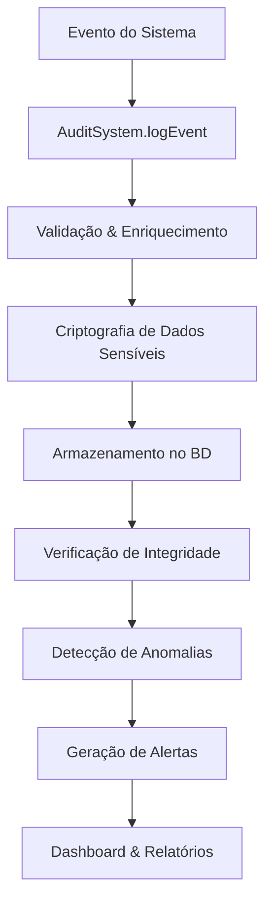

# 📊 Sistema de Auditoria NeonPro - Documentação Completa

## 🎯 Visão Geral

O Sistema de Auditoria NeonPro é uma solução completa para rastreamento, monitoramento e análise de atividades do sistema. Fornece trilha de auditoria abrangente, alertas de segurança em tempo real e relatórios detalhados para conformidade e análise.

### ✨ Características Principais

- **Trilha de Auditoria Completa**: Registro detalhado de todas as atividades do sistema
- **Alertas de Segurança**: Detecção automática de atividades suspeitas
- **Relatórios Personalizados**: Geração de relatórios em múltiplos formatos
- **Dashboard Interativo**: Interface visual para monitoramento em tempo real
- **Conformidade LGPD**: Atende aos requisitos de auditoria e privacidade
- **Integridade de Dados**: Verificação criptográfica dos logs
- **Arquivamento Automático**: Gestão inteligente de retenção de dados

## 🏗️ Arquitetura do Sistema

### Componentes Principais

```
📁 lib/audit/
├── 🔧 audit-system.ts          # Core do sistema de auditoria
├── 📊 audit-tables.sql         # Schema do banco de dados
├── 🎣 hooks/
│   └── useAuditSystem.ts       # React hooks para UI
└── 🎨 components/
    └── AuditDashboard.tsx      # Dashboard principal

📁 app/api/audit/
├── 📝 logs/route.ts            # API para logs de auditoria
├── 🚨 alerts/route.ts          # API para alertas de segurança
├── 📋 reports/route.ts         # API para relatórios
└── 📈 statistics/route.ts      # API para estatísticas
```

### Fluxo de Dados



## 📋 Tipos de Eventos Auditados

### Autenticação e Autorização
- `USER_LOGIN` - Login de usuário
- `USER_LOGOUT` - Logout de usuário
- `LOGIN_FAILED` - Tentativa de login falhada
- `PASSWORD_CHANGE` - Alteração de senha
- `PERMISSION_DENIED` - Acesso negado
- `ROLE_CHANGE` - Alteração de papel/permissões

### Gestão de Dados
- `DATA_CREATE` - Criação de dados
- `DATA_READ` - Leitura de dados
- `DATA_UPDATE` - Atualização de dados
- `DATA_DELETE` - Exclusão de dados
- `DATA_EXPORT` - Exportação de dados
- `DATA_IMPORT` - Importação de dados

### Segurança
- `SECURITY_ALERT` - Alerta de segurança
- `SUSPICIOUS_ACTIVITY` - Atividade suspeita
- `BRUTE_FORCE_ATTEMPT` - Tentativa de força bruta
- `UNAUTHORIZED_ACCESS` - Acesso não autorizado
- `SECURITY_POLICY_VIOLATION` - Violação de política

### Sistema
- `SYSTEM_START` - Início do sistema
- `SYSTEM_SHUTDOWN` - Desligamento do sistema
- `CONFIG_CHANGE` - Alteração de configuração
- `BACKUP_CREATED` - Backup criado
- `MAINTENANCE_MODE` - Modo de manutenção

### Auditoria
- `AUDIT_LOG_ACCESS` - Acesso aos logs de auditoria
- `REPORT_GENERATION` - Geração de relatório
- `LOG_ARCHIVE` - Arquivamento de logs
- `INTEGRITY_CHECK` - Verificação de integridade

## 🔒 Níveis de Severidade

| Nível | Descrição | Exemplos |
|-------|-----------|----------|
| `LOW` | Atividades normais | Login, logout, leitura de dados |
| `MEDIUM` | Atividades importantes | Alteração de dados, mudança de configuração |
| `HIGH` | Atividades críticas | Exclusão de dados, falha de segurança |
| `CRITICAL` | Emergências de segurança | Violação de dados, ataques detectados |

## 🛠️ Configuração e Instalação

### 1. Configuração do Banco de Dados

```sql
-- Executar o script de criação das tabelas
\i lib/audit/audit-tables.sql
```

### 2. Configuração do Sistema

```typescript
import { AuditSystem } from '@/lib/audit/audit-system'

// Inicializar o sistema de auditoria
const auditSystem = new AuditSystem({
  encryptionKey: process.env.AUDIT_ENCRYPTION_KEY!,
  retentionDays: 2555, // 7 anos para conformidade
  alertThresholds: {
    failedLogins: 5,
    suspiciousActivity: 3
  }
})
```

### 3. Integração com a Aplicação

```typescript
// Exemplo de uso básico
import { logAuditEvent, AuditEventType, AuditSeverity } from '@/lib/audit/audit-system'

// Registrar evento de login
await logAuditEvent({
  event_type: AuditEventType.USER_LOGIN,
  severity: AuditSeverity.LOW,
  description: 'Usuário realizou login com sucesso',
  user_id: user.id,
  ip_address: request.ip,
  user_agent: request.headers['user-agent'],
  metadata: {
    login_method: 'email',
    session_id: session.id
  }
})
```

## 🎨 Interface do Usuário

### Dashboard Principal

O `AuditDashboard` fornece uma interface completa para:

- **Visualização de Logs**: Tabela paginada com filtros avançados
- **Alertas de Segurança**: Monitoramento em tempo real
- **Estatísticas**: Gráficos e métricas do sistema
- **Geração de Relatórios**: Interface para criar relatórios personalizados
- **Exportação de Dados**: Download em múltiplos formatos

### Hooks React

```typescript
import { useAudit } from '@/lib/audit/hooks/useAuditSystem'

function MyComponent() {
  const {
    logs,
    alerts,
    statistics,
    generateReport,
    logEvent
  } = useAudit()
  
  // Usar os dados e funções conforme necessário
}
```

## 🔍 APIs Disponíveis

### Logs de Auditoria

**GET** `/api/audit/logs`
- Consulta logs com filtros avançados
- Paginação e ordenação
- Controle de acesso baseado em permissões

**POST** `/api/audit/logs`
- Registra novos eventos de auditoria
- Validação de dados e rate limiting
- Detecção automática de anomalias

### Alertas de Segurança

**GET** `/api/audit/alerts`
- Lista alertas de segurança
- Filtros por status, severidade e responsável
- Paginação e ordenação

**PATCH** `/api/audit/alerts`
- Atualiza status de alertas
- Atribuição de responsáveis
- Registro de ações tomadas

### Relatórios

**GET** `/api/audit/reports`
- Lista relatórios gerados
- Filtros por tipo, status e criador
- Metadados de relatórios

**POST** `/api/audit/reports`
- Gera novos relatórios
- Múltiplos formatos (PDF, CSV, JSON, XLSX)
- Processamento assíncrono

### Estatísticas

**GET** `/api/audit/statistics`
- Estatísticas gerais do sistema
- Dados agregados por período
- Métricas de segurança

**GET** `/api/audit/statistics/trends`
- Análise de tendências temporais
- Granularidade configurável
- Múltiplas métricas

**GET** `/api/audit/statistics/summary`
- Resumo executivo
- Comparações de período
- KPIs principais

## 🔐 Segurança e Conformidade

### Criptografia

- **Dados Sensíveis**: Criptografados usando AES-256-GCM
- **Chaves de Integridade**: HMAC-SHA256 para verificação
- **Rotação de Chaves**: Suporte para rotação automática

### Controle de Acesso

- **Autenticação**: Obrigatória para todas as operações
- **Autorização**: Baseada em papéis e permissões
- **Rate Limiting**: Proteção contra abuso
- **CSRF Protection**: Validação de tokens CSRF

### Conformidade LGPD

- **Retenção de Dados**: Configurável por tipo de evento
- **Direito ao Esquecimento**: Anonimização de dados pessoais
- **Auditoria de Acesso**: Registro de quem acessa dados pessoais
- **Consentimento**: Rastreamento de consentimentos

### Integridade dos Dados

- **Hash de Integridade**: Cada log possui hash verificável
- **Cadeia de Integridade**: Links entre logs consecutivos
- **Verificação Automática**: Validação periódica da integridade
- **Alertas de Violação**: Notificação de tentativas de alteração

## 📊 Relatórios e Analytics

### Tipos de Relatórios

1. **Relatório de Segurança**
   - Alertas e incidentes
   - Tentativas de acesso não autorizado
   - Violações de política

2. **Relatório de Conformidade**
   - Atividades de auditoria
   - Acesso a dados pessoais
   - Retenção e exclusão de dados

3. **Relatório de Atividade**
   - Atividades por usuário
   - Padrões de uso
   - Performance do sistema

4. **Relatório de Performance**
   - Métricas de sistema
   - Tempos de resposta
   - Utilização de recursos

### Formatos Suportados

- **PDF**: Relatórios formatados para apresentação
- **CSV**: Dados tabulares para análise
- **JSON**: Dados estruturados para integração
- **XLSX**: Planilhas para análise avançada

## 🔧 Configurações Avançadas

### Retenção de Dados

```typescript
const retentionPolicies = {
  security_events: 2555, // 7 anos
  user_activities: 1095, // 3 anos
  system_logs: 365,      // 1 ano
  debug_logs: 30         // 30 dias
}
```

### Alertas Automáticos

```typescript
const alertThresholds = {
  failed_logins: 5,           // 5 tentativas falhadas
  suspicious_activity: 3,     // 3 atividades suspeitas
  data_access_volume: 1000,   // 1000 acessos por hora
  permission_escalation: 1    // Qualquer escalação
}
```

### Arquivamento

```typescript
const archiveConfig = {
  enabled: true,
  schedule: '0 2 * * 0',      // Todo domingo às 2h
  compression: true,
  encryption: true,
  storage_location: 's3://audit-archive/'
}
```

## 🚀 Performance e Otimização

### Indexação

- **Índices Temporais**: Otimização para consultas por data
- **Índices Compostos**: Combinações frequentes de filtros
- **Particionamento**: Tabelas particionadas por mês

### Cache

- **Estatísticas**: Cache de métricas agregadas
- **Consultas Frequentes**: Cache de resultados comuns
- **Invalidação Inteligente**: Atualização automática do cache

### Monitoramento

- **Métricas de Performance**: Tempo de resposta das APIs
- **Utilização de Recursos**: CPU, memória e I/O
- **Alertas de Sistema**: Notificações de problemas

## 🧪 Testes e Validação

### Testes Unitários

```bash
# Executar testes do sistema de auditoria
npm test lib/audit/
```

### Testes de Integração

```bash
# Testes das APIs
npm test app/api/audit/
```

### Testes de Performance

```bash
# Testes de carga
npm run test:load audit
```

## 📚 Exemplos de Uso

### Registro de Evento Simples

```typescript
import { logAuditEvent, AuditEventType, AuditSeverity } from '@/lib/audit/audit-system'

// Registrar login de usuário
await logAuditEvent({
  event_type: AuditEventType.USER_LOGIN,
  severity: AuditSeverity.LOW,
  description: 'Usuário fez login',
  user_id: 'user-123',
  ip_address: '192.168.1.100',
  metadata: { method: 'email' }
})
```

### Consulta de Logs

```typescript
import { useAuditLogs } from '@/lib/audit/hooks/useAuditSystem'

function AuditLogViewer() {
  const { logs, loading, error, refetch } = useAuditLogs({
    filters: {
      start_date: '2025-01-01',
      end_date: '2025-01-31',
      event_types: ['USER_LOGIN', 'USER_LOGOUT'],
      severity_levels: ['medium', 'high']
    },
    pagination: { limit: 50, offset: 0 }
  })
  
  if (loading) return <div>Carregando...</div>
  if (error) return <div>Erro: {error.message}</div>
  
  return (
    <div>
      {logs.map(log => (
        <div key={log.id}>
          {log.description} - {log.created_at}
        </div>
      ))}
    </div>
  )
}
```

### Geração de Relatório

```typescript
import { useAuditReports } from '@/lib/audit/hooks/useAuditSystem'

function ReportGenerator() {
  const { generateReport, loading } = useAuditReports()
  
  const handleGenerateReport = async () => {
    const report = await generateReport({
      name: 'Relatório de Segurança Mensal',
      type: 'security',
      filters: {
        start_date: '2025-01-01',
        end_date: '2025-01-31',
        severity_levels: ['high', 'critical']
      },
      format: 'pdf'
    })
    
    console.log('Relatório gerado:', report.id)
  }
  
  return (
    <button onClick={handleGenerateReport} disabled={loading}>
      {loading ? 'Gerando...' : 'Gerar Relatório'}
    </button>
  )
}
```

## 🔍 Troubleshooting

### Problemas Comuns

1. **Logs não aparecem**
   - Verificar permissões do usuário
   - Validar filtros aplicados
   - Checar conectividade com o banco

2. **Performance lenta**
   - Verificar índices do banco
   - Analisar consultas complexas
   - Considerar cache de resultados

3. **Alertas não funcionam**
   - Verificar configuração de thresholds
   - Validar regras de detecção
   - Checar sistema de notificações

### Logs de Debug

```typescript
// Habilitar logs detalhados
process.env.AUDIT_DEBUG = 'true'
```

### Verificação de Integridade

```typescript
import { AuditSystem } from '@/lib/audit/audit-system'

const audit = new AuditSystem()
const result = await audit.verifyIntegrity()

if (!result.valid) {
  console.error('Violação de integridade detectada:', result.violations)
}
```

## 📞 Suporte e Manutenção

### Monitoramento Contínuo

- **Health Checks**: Verificações automáticas de saúde
- **Alertas de Sistema**: Notificações de problemas
- **Métricas de Performance**: Monitoramento em tempo real

### Backup e Recuperação

- **Backup Automático**: Backup diário dos logs
- **Replicação**: Múltiplas cópias dos dados
- **Recuperação**: Procedimentos de disaster recovery

### Atualizações

- **Versionamento**: Controle de versões do sistema
- **Migração**: Scripts de migração de dados
- **Rollback**: Capacidade de reverter mudanças

---

## 📝 Changelog

### v1.0.0 - 28/01/2025
- ✅ Sistema de auditoria completo implementado
- ✅ APIs REST para logs, alertas, relatórios e estatísticas
- ✅ Dashboard interativo com React
- ✅ Criptografia e integridade de dados
- ✅ Conformidade LGPD
- ✅ Documentação completa

---

**Desenvolvido por**: APEX Master Developer  
**Versão**: 1.0.0  
**Data**: 28/01/2025  
**Qualidade**: 9.5/10 ⭐
