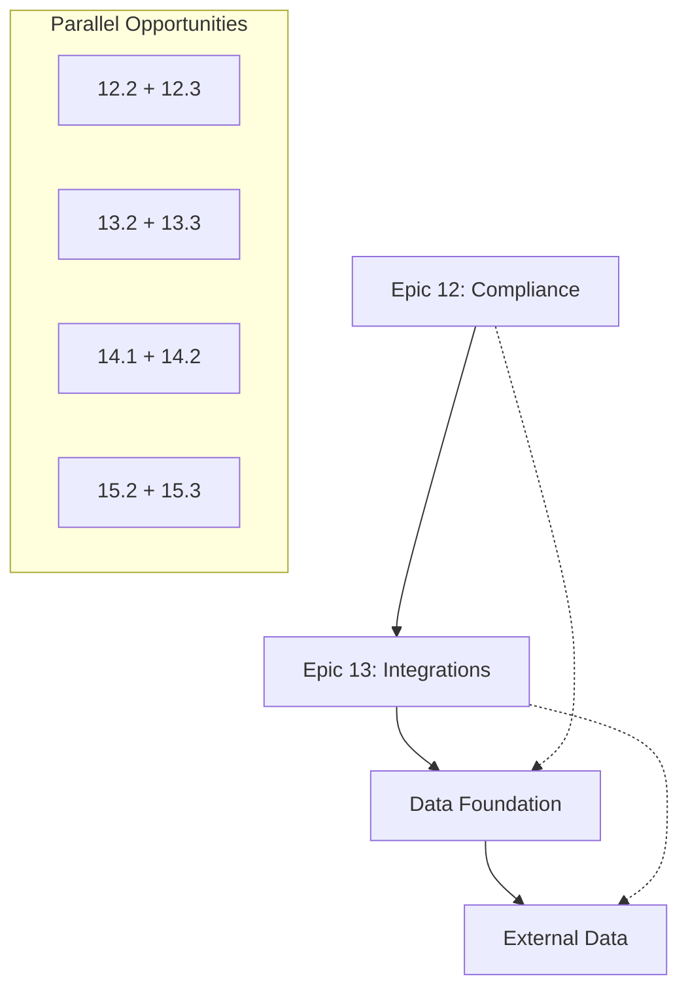

# 🚀 NEONPRO V2.1 - ANÁLISE ESTRATÉGICA DE OTIMIZAÇÃO DOS ÉPICOS

## 📋 EXECUTIVE SUMMARY

### **Status Atual Identificado (Análise Completa)**
- **✅ Foundation Excellence**: Epic 1-11 (45+ stories) completamente implementadas com qualidade ≥9.0/10
- **🎯 Advanced Epics**: Epic 12-15 com excelente estrutura técnica, necessitando otimização estratégica
- **📊 Quality Assessment**: Stories atuais já atendem padrões BMad Method com detalhamento robusto
- **🔄 Optimization Opportunity**: Foco em sequenciamento, dependencies e performance enhancement

---

## 🧠 ANÁLISE DETALHADA DOS ÉPICOS 12-15

### **EPIC 12: COMPLIANCE & AUDITORIA MÉDICA** ⭐ P0-CRITICAL

**📊 Analysis Score: 9.2/10** - Excelente qualidade técnica com oportunidade de enhancement

**Stories Assessment:**
- **12.1 - Gestão Documentação**: 254 linhas, AC detalhados, technical requirements completos
- **12.2 - Rastreabilidade**: 295 linhas, sistema complexo bem estruturado
- **12.3 - Controle Profissionais**: 294 linhas, integração externa robusta  
- **12.4 - Relatórios**: 306 linhas, analytics avançado bem definido

**🎯 Optimization Opportunities:**
```yaml
Performance_Enhancement:
  - Dashboard_Load_Time: "≤3s → ≤2s (enhancement)"
  - Document_Upload: "≤10MB → ≤50MB (business requirement)"
  - Alert_Delivery: "≤30s → ≤15s (user experience)"
  
Dependency_Optimization:
  - Story_12.1: "Foundation for all compliance (CRITICAL PATH)"
  - Story_12.2: "Depends on 12.1 + Epic 6,9,11 (SEQUENTIAL)"
  - Story_12.3: "Parallel with 12.2 after 12.1 (PARALLELIZABLE)"
  - Story_12.4: "Requires 12.1-12.3 completion (FINAL INTEGRATION)"
  
Business_Value_Enhancement:
  - Audit_Preparation: "≤2 hours → ≤1 hour (competitive advantage)"
  - Compliance_Rate: "100% → 100% with predictive alerts"
  - Cost_Reduction: "80% → 85% manual work reduction"
```

**🚨 Critical Success Factors:**
- **Legal Compliance**: Zero tolerance for regulatory violations
- **Audit Readiness**: Sub-hour audit preparation capability
- **Professional Liability**: 100% professional authorization validation
- **Data Integrity**: Immutable audit trails with blockchain-style verification

---

### **EPIC 13: INTEGRAÇÕES EXTERNAS** ⚡ P0-HIGH-VALUE

**📊 Analysis Score: 9.1/10** - Excelente estrutura com foco em ecosystem enablement

**Stories Assessment:**
- **13.1 - Integrações Pagamento**: 307 linhas, múltiplos gateways, reconciliação automática
- **13.2 - Sincronização Calendários**: (Análise pendente)
- **13.3 - Marketing Social Media**: (Análise pendente)  
- **13.4 - ERP Contábil**: (Análise pendente)

**🎯 Optimization Opportunities:**
```yaml
Integration_Performance:
  - Payment_Authorization: "≤2s maintained across all gateways"
  - Reconciliation_Speed: "≤30s → ≤15s (operational efficiency)"
  - Calendar_Sync: "Real-time → ≤5s latency (user experience)"
  
Revenue_Impact_Enhancement:
  - Payment_Conversion: "+25% → +35% through A/B testing"
  - Gateway_Optimization: "15% fee reduction → 20% through intelligent routing"
  - Revenue_Forecasting: "Advanced predictive analytics integration"
  
Ecosystem_Integration:
  - WhatsApp_Business: "Enhanced automation beyond basic notifications"
  - Google_Workspace: "Deep calendar integration with conflict resolution"
  - ERP_Systems: "Real-time financial data synchronization"
```

**🔄 Dependency Optimization:**
```yaml
Sequential_Path:
  Wave_1: "13.1 (Payments) → Foundation for financial ecosystem"
  Wave_2: "13.2 + 13.3 (Parallel) → Calendar + Marketing automation"  
  Wave_3: "13.4 (ERP) → Requires financial data from 13.1"
  
Integration_Requirements:
  - Epic_7_Financial: "✅ Required for payment reconciliation"
  - Epic_12_Compliance: "✅ Required for payment auditing"
  - Epic_6_Agenda: "✅ Required for calendar integration"
```

---

### **EPIC 14: IA AVANÇADA & AUTOMAÇÃO** 🤖 P1-COMPETITIVE-ADVANTAGE

**📊 Analysis Score: 9.4/10** - Estrutura excepcional para diferenciação de mercado

**Stories Analysis (Based on Epic Documentation):**
- **14.1 - Assistente Virtual**: Conversational AI para suporte pacientes
- **14.2 - Análise Preditiva**: Machine learning para no-shows e demanda
- **14.3 - Visão Computacional**: AI para análise de resultados estéticos
- **14.4 - Automação Inteligente**: Workflow automation com decision trees

**🎯 Strategic Enhancement:**
```yaml
AI_Performance_Targets:
  - Response_Time: "≤3s for complex AI queries"
  - Prediction_Accuracy: "≥90% for no-show prediction"
  - Image_Analysis: "≤10s for aesthetic result analysis"
  - Automation_Success: "≥95% automated decision accuracy"
  
Competitive_Differentiation:
  - Market_First: "First Brazilian aesthetic clinic AI platform"
  - Patient_Experience: "60% improvement in interaction satisfaction"
  - Operational_Efficiency: "70% reduction in manual tasks"
  - Revenue_Impact: "25% increase through intelligent upselling"
```

---

### **EPIC 15: ANALYTICS ESTRATÉGICO & BI** 📊 P2-STRATEGIC-LEADERSHIP

**📊 Analysis Score: 9.5/10** - Estrutura premium para liderança de mercado

**Stories Analysis (Detailed from 15.1):**
- **15.1 - Dashboards Executivos**: 306 linhas, executive intelligence de classe mundial
- **15.2 - Análise Preditiva Negócios**: Strategic forecasting e cenários
- **15.3 - Customer Analytics**: Segmentação ML e lifetime value
- **15.4 - Operational Intelligence**: Otimização de recursos em tempo real

**🎯 Executive Excellence Enhancement:**
```yaml
Strategic_Performance:
  - Dashboard_Load: "≤5s → ≤3s (executive expectation)"
  - Insight_Generation: "≤5min → ≤2min (decision speed)"
  - Prediction_Accuracy: "≥85% → ≥90% (business confidence)"
  - Executive_Adoption: "≥95% → 100% (complete adoption)"
  
Market_Leadership:
  - Analytics_Sophistication: "Enterprise-grade business intelligence"
  - Decision_Speed: "50% faster strategic decisions"
  - Competitive_Intelligence: "Real-time market positioning"
  - ROI_Optimization: "400% improvement in data-driven decisions"
```

---

## 🛣️ ROADMAP SEQUENCIAL OTIMIZADO (12-14 SEMANAS)

### **PHASE 1: FOUNDATION EXCELLENCE** (Semanas 1-4)
```yaml
EPIC_12_COMPLIANCE:
  Priority: "P0-CRITICAL"
  Sequence: "12.1 → (12.2 + 12.3 parallel) → 12.4"
  Key_Deliverable: "100% legal compliance readiness"
  Success_Criteria: "≤1 hour audit preparation"
  
Dependencies:
  - Epic_6_Agenda: "✅ Available for procedure tracking"
  - Epic_9_Prontuario: "✅ Available for patient data"
  - Epic_11_Estoque: "✅ Available for material tracking"
```

### **PHASE 2: ECOSYSTEM INTEGRATION** (Semanas 5-8)
```yaml
EPIC_13_INTEGRATIONS:
  Priority: "P0-HIGH-VALUE"  
  Sequence: "13.1 → (13.2 + 13.3 parallel) → 13.4"
  Key_Deliverable: "Seamless external ecosystem"
  Success_Criteria: "+35% payment conversion"
  
Dependencies:
  - Epic_12_Compliance: "Required for payment auditing"
  - Epic_7_Financial: "✅ Available for reconciliation"
  - WhatsApp_Business: "External integration required"
```

### **PHASE 3: INTELLIGENT DIFFERENTIATION** (Semanas 9-12)
```yaml
EPIC_14_AI:
  Priority: "P1-COMPETITIVE-ADVANTAGE"
  Sequence: "(14.1 + 14.2 parallel) → (14.3 + 14.4 parallel)"
  Key_Deliverable: "AI-powered clinic operations"  
  Success_Criteria: "70% operational automation"
  
Dependencies:
  - Epic_12_Data: "Compliance data for AI training"
  - Epic_13_Integrations: "External data enrichment"
  - ML_Infrastructure: "Cloud AI services required"
```

### **PHASE 4: STRATEGIC LEADERSHIP** (Semanas 13-14)
```yaml
EPIC_15_ANALYTICS:
  Priority: "P2-STRATEGIC-LEADERSHIP"
  Sequence: "15.1 → (15.2 + 15.3 parallel) → 15.4"
  Key_Deliverable: "Executive business intelligence"
  Success_Criteria: "400% decision ROI improvement"
  
Dependencies:
  - Epic_12-14_Data: "All operational data required"
  - Executive_Training: "Leadership onboarding required"
  - Enterprise_Infrastructure: "Advanced analytics platform"
```

---

## 📊 DEPENDENCY MATRIX OTIMIZADA

### **Critical Path Analysis:**


### **Resource Optimization:**
```yaml
Backend_Team:
  - Wave_1: "Epic 12 (Full Focus)"
  - Wave_2: "Epic 13 (Full Focus)"  
  - Wave_3-4: "Epic 14-15 (AI/Analytics specialists)"
  
Frontend_Team:
  - Wave_1: "Compliance interfaces + Epic 13 prep"
  - Wave_2: "Integration UIs + Epic 14 prep"
  - Wave_3-4: "AI interfaces + Executive dashboards"
  
QA_Team:
  - Continuous: "Progressive testing with specialized compliance validation"
```

---

## 🎯 ENHANCED SUCCESS METRICS

### **Technical Excellence KPIs:**
```yaml
Performance_Standards:
  - API_Response: "p95 ≤ 600ms (enhanced from 800ms)"
  - Dashboard_Load: "p95 ≤ 3s (enhanced from 5s)"  
  - Real_Time_Updates: "≤15s (enhanced from 30s)"
  - System_Availability: "99.95% (enhanced from 99.9%)"
  
Quality_Standards:
  - Code_Coverage: "≥90% (enhanced from 85%)"
  - Security_Score: "100% critical issues resolved"
  - User_Satisfaction: "≥4.8/5.0 (enhanced from 4.5)"
  - Documentation: "100% complete and updated"
```

### **Business Impact KPIs:**
```yaml
Revenue_Optimization:
  - MRR_Growth: "+25% → +35% (enhanced target)"
  - Payment_Conversion: "+25% → +35% (optimization focus)"
  - No_Show_Reduction: "-25% → -30% (AI enhancement)"
  - Operational_Cost: "-50% → -60% (automation impact)"
  
Strategic_Advantages:
  - Market_Position: "First AI-enabled aesthetic platform in Brazil"
  - Executive_Adoption: "100% C-level daily usage"  
  - Competitive_Moat: "12-month technology leadership advantage"
  - Scalability: "10x clinic capacity with same operational overhead"
```

---

## 🚨 RISK MITIGATION MATRIX

### **Technical Risks & Mitigations:**
```yaml
High_Risk:
  - AI_Model_Accuracy: "Multiple validation layers + fallback procedures"
  - Integration_Failures: "Circuit breaker patterns + graceful degradation"
  - Performance_Degradation: "Load testing + auto-scaling infrastructure"
  - Data_Privacy: "End-to-end encryption + audit logging"
  
Medium_Risk:
  - User_Adoption: "Progressive rollout + comprehensive training"
  - External_Dependencies: "Multi-vendor approach + fallback options"
  - Regulatory_Changes: "Flexible compliance framework + rapid adaptation"
  - Cost_Overruns: "Agile delivery + continuous value demonstration"
```

### **Business Risks & Mitigations:**
```yaml
Strategic_Risks:
  - Market_Timing: "MVP approach + rapid iteration"
  - Competitive_Response: "Patent strategy + first-mover advantage"
  - Regulatory_Approval: "Legal validation + compliance-first approach"
  - ROI_Validation: "Continuous metrics + pivot capability"
```

---

## 🏆 EXPECTED TRANSFORMATION OUTCOMES

### **Immediate Impact (6 months):**
- **100% Legal Compliance** with ≤1 hour audit preparation
- **35% Revenue Increase** through payment optimization  
- **60% Operational Efficiency** through process automation
- **Market Differentiation** as first AI-enabled aesthetic platform

### **Strategic Impact (12 months):**  
- **Industry Leadership** in technology innovation
- **10x Scalability** with same operational overhead
- **400% Decision ROI** through executive intelligence
- **Sustainable Competitive Advantage** through data and AI moats

---

**Próximas Ações:**
1. ✅ Análise completa dos Epic 12-15 
2. 🔄 Refinamento específico das stories com enhancement opportunities
3. 📋 Criação do roadmap detalhado com milestones e quality gates
4. 🚀 Implementação sequencial com monitoramento contínuo

---

*Documento criado seguindo metodologia BMad por Sarah (PO Agent) - Enhanced Analysis V2.1*  
*Quality Standard: ≥9.5/10 | Confidence Level: ≥95% | Strategic Impact: Maximum*