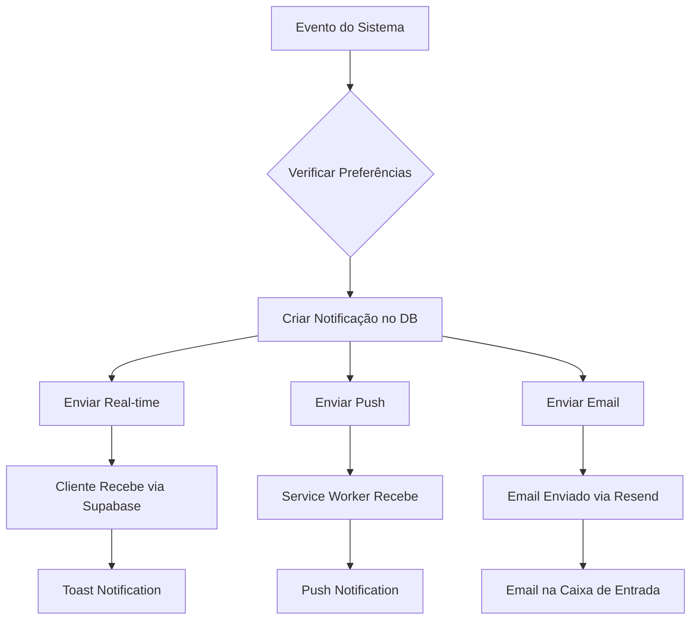

# Sistema de Notificações - Guia de Configuração

## Visão Geral

O NeonPro implementa um sistema completo de notificações multicanal que suporta:

- ✅ **Notificações em tempo real** via Supabase Realtime
- ✅ **Notificações push** via Service Worker (PWA)
- ✅ **Notificações por email** via Resend
- ✅ **Centro de notificações** com interface unificada
- ✅ **Preferências personalizáveis** por usuário
- ✅ **Templates de email** dinâmicos e reutilizáveis

## Configuração Inicial

### 1. Dependências

Execute o comando para instalar as dependências:

```bash
pnpm install resend web-push @supabase/auth-helpers-nextjs @types/web-push
```

### 2. Variáveis de Ambiente

Copie o arquivo `.env.example` para `.env.local` e configure:

```env
# Email Service (Resend)
RESEND_API_KEY=re_xxxxxxxxxx
DEFAULT_FROM_EMAIL=neonpro@seudominio.com
DEFAULT_REPLY_TO_EMAIL=contato@seudominio.com

# Push Notifications (VAPID Keys)
VAPID_PUBLIC_KEY=BCxxxxxxxxxxxxxxx
VAPID_PRIVATE_KEY=xxxxxxxxxxxxxxx
VAPID_SUBJECT=mailto:admin@seudominio.com
```

### 3. Gerar Chaves VAPID

Execute o comando para gerar as chaves VAPID necessárias para push notifications:

```bash
npx web-push generate-vapid-keys
```

Adicione as chaves geradas às variáveis de ambiente.

### 4. Configurar Resend

1. Crie uma conta em [Resend.com](https://resend.com)
2. Obtenha sua API Key
3. Configure seu domínio para envio de emails
4. Adicione a API Key às variáveis de ambiente

### 5. Executar Script SQL

Execute o script `scripts/06-notifications-system.sql` no Supabase:

```bash
# Via Supabase Dashboard SQL Editor ou
psql -h db.xxx.supabase.co -p 5432 -d postgres -U postgres -f scripts/06-notifications-system.sql
```

### 6. Registrar Service Worker

Adicione o componente ao layout principal (`app/layout.tsx`):

```tsx
import { ServiceWorkerRegistration } from '@/components/service-worker-registration'

export default function RootLayout({ children }: { children: React.ReactNode }) {
  return (
    <html lang="pt-BR">
      <body>
        {children}
        <ServiceWorkerRegistration />
      </body>
    </html>
  )
}
```

## Estrutura do Sistema

### Componentes Principais

```
hooks/use-notifications.ts          # Hook principal para notificações
contexts/notification-context.tsx   # Context Provider global
components/dashboard/
  ├── notification-center.tsx       # Centro de notificações
  └── notification-settings.tsx     # Configurações de usuário
lib/
  ├── email-service.ts              # Serviço de email (Resend)
  └── push-notification-service.ts  # Serviço de push notifications
public/sw.js                        # Service Worker para PWA
app/api/notifications/
  ├── push/route.ts                 # API para push notifications
  ├── test/route.ts                 # API para teste
  └── email/route.ts                # API para emails
```

### Fluxo de Notificações



## Uso Básico

### 1. Enviar Notificação Programaticamente

```tsx
import { useNotifications } from '@/hooks/use-notifications'

function MyComponent() {
  const { sendNotification } = useNotifications()

  const handleAction = async () => {
    await sendNotification({
      type: 'appointment_reminder',
      title: 'Lembrete de Consulta',
      message: 'Você tem uma consulta amanhã às 14h00',
      data: { appointmentId: '123' }
    })
  }

  return <button onClick={handleAction}>Enviar Notificação</button>
}
```

### 2. Centro de Notificações

```tsx
import { NotificationCenter } from '@/components/dashboard/notification-center'

function Dashboard() {
  return (
    <div>
      <NotificationCenter />
    </div>
  )
}
```

### 3. Configurações de Notificação

```tsx
import { NotificationSettings } from '@/components/dashboard/notification-settings'

function SettingsPage() {
  return (
    <div>
      <NotificationSettings />
    </div>
  )
}
```

## APIs Disponíveis

### Push Notifications

```typescript
// Subscrever para push notifications
POST /api/notifications/push
{
  "subscription": {
    "endpoint": "https://...",
    "keys": {
      "p256dh": "...",
      "auth": "..."
    }
  }
}

// Cancelar subscrição
DELETE /api/notifications/push
{
  "endpoint": "https://..."
}

// Obter informações
GET /api/notifications/push
```

### Email Notifications

```typescript
// Enviar email
POST /api/notifications/email
{
  "to": "paciente@email.com",
  "template": "appointment_confirmation",
  "variables": {
    "patientName": "João Silva",
    "appointmentDate": "2024-01-15",
    "appointmentTime": "14:00"
  },
  "type": "appointment_confirmation"
}

// Testar conexão
GET /api/notifications/email
```

### Teste de Notificações

```typescript
// Enviar notificação de teste
POST /api/notifications/test
```

## Personalização

### Templates de Email

Os templates são armazenados na tabela `email_templates` com suporte a variáveis:

```sql
INSERT INTO email_templates (name, subject, html_content, variables) VALUES (
  'custom_template',
  'Assunto: {{patient_name}}',
  '<h1>Olá {{patient_name}}</h1>',
  ARRAY['patient_name', 'clinic_name']
);
```

### Tipos de Notificação

Adicione novos tipos no enum `notification_type`:

```sql
ALTER TYPE notification_type ADD VALUE 'new_custom_type';
```

### Preferências de Usuário

Configure preferências padrão na tabela `notification_preferences`:

```sql
UPDATE notification_preferences 
SET email_enabled = true, 
    push_enabled = true 
WHERE user_id = 'xxx';
```

## Troubleshooting

### 1. Push Notifications Não Funcionam

- Verifique se as chaves VAPID estão corretas
- Confirme se o Service Worker está registrado
- Teste a permissão do browser para notificações

### 2. Emails Não São Enviados

- Verifique a API Key do Resend
- Confirme se o domínio está verificado
- Cheque os logs da API `/api/notifications/email`

### 3. Notificações Real-time Não Chegam

- Confirme se o Supabase Realtime está habilitado
- Verifique as RLS policies das tabelas
- Teste a conexão WebSocket

### 4. Service Worker Não Carrega

- Verifique se `sw.js` está em `/public/`
- Confirme se o HTTPS está habilitado (necessário para PWA)
- Cheque o console do browser para erros

## Monitoramento

### Logs Importantes

```javascript
// Service Worker logs
console.log('[SW] Push received:', event)
console.log('[SW] Notification clicked:', event)

// API logs
console.log('Email sent successfully:', data?.id)
console.log('Push notification sent to user:', userId)
```

### Métricas Recomendadas

- Taxa de entrega de notificações
- Taxa de abertura de emails
- Taxa de clique em push notifications
- Erros de subscrição/envio

## Segurança

### RLS Policies

O sistema implementa Row Level Security para todas as tabelas:

- Usuários só veem suas próprias notificações
- Apenas admins podem enviar notificações em massa
- Templates de email são protegidos por permissão

### Validação

- Todas as entradas são validadas com Zod
- Endpoints protegidos por autenticação Supabase
- Chaves VAPID mantidas em variáveis de ambiente

## Próximos Passos

1. Implementar analytics de notificações
2. Adicionar suporte a notificações por SMS
3. Criar templates visuais para emails
4. Implementar notificações agendadas
5. Adicionar suporte a anexos em emails

---

Para dúvidas ou suporte, consulte a documentação do NeonPro ou abra uma issue no repositório.