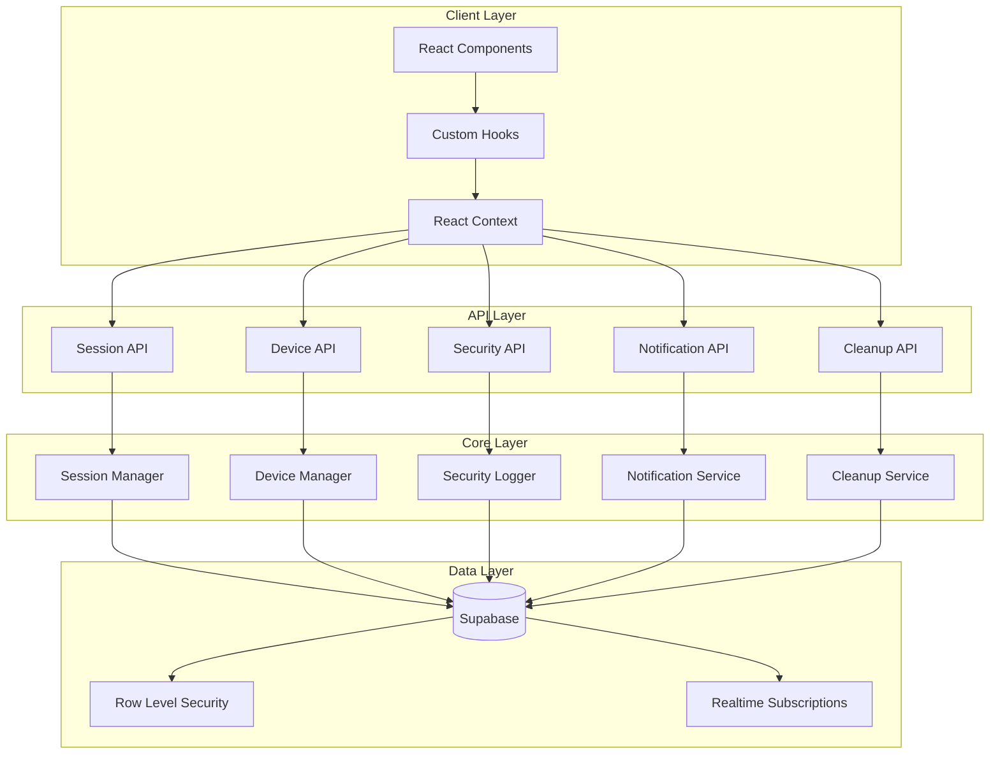

# NeonPro Session Management System - Technical Guide

## 📋 Table of Contents

1. [System Overview](#system-overview)
2. [Architecture](#architecture)
3. [Core Components](#core-components)
4. [API Reference](#api-reference)
5. [Security Implementation](#security-implementation)
6. [Database Schema](#database-schema)
7. [Configuration](#configuration)
8. [Usage Examples](#usage-examples)
9. [Testing](#testing)
10. [Performance](#performance)
11. [Troubleshooting](#troubleshooting)
12. [Migration Guide](#migration-guide)

## System Overview

The NeonPro Session Management System is a comprehensive, enterprise-grade solution for handling user sessions, device management, security monitoring, and data lifecycle management in healthcare applications.

### Key Features

- **Unified Session Management**: Centralized session handling with automatic cleanup
- **Device Trust System**: Intelligent device recognition and trust management
- **Security Monitoring**: Real-time threat detection and event logging
- **Notification System**: Multi-channel notification delivery
- **Data Lifecycle**: Automated cleanup and retention policies
- **LGPD Compliance**: Built-in privacy and data protection features
- **Healthcare Optimized**: Designed for clinical workflow requirements

### Technology Stack

- **Frontend**: React 18, TypeScript, Tailwind CSS
- **Backend**: Next.js 14, Node.js
- **Database**: PostgreSQL with Supabase
- **Security**: Row Level Security (RLS), JWT tokens
- **Real-time**: Supabase Realtime subscriptions
- **Validation**: Zod schemas
- **Testing**: Jest, React Testing Library

## Architecture

### System Architecture Diagram



### Component Hierarchy

```
lib/auth/session/
├── core/                     # Core business logic
│   ├── SessionManager.ts     # Main session orchestrator
│   ├── SessionAuth.ts        # Authentication logic
│   ├── DeviceManager.ts      # Device trust management
│   ├── SecurityEventLogger.ts # Security monitoring
│   ├── NotificationService.ts # Notification delivery
│   └── DataCleanupService.ts # Data lifecycle management
├── hooks/                    # React hooks
│   ├── useSession.ts
│   ├── useDeviceManagement.ts
│   ├── useSecurityMonitoring.ts
│   ├── useNotifications.ts
│   └── useDataCleanup.ts
├── config.ts                 # System configuration
├── types.ts                  # TypeScript definitions
├── utils.ts                  # Utility functions
└── index.ts                  # Main exports

components/auth/session/
├── SessionStatus.tsx         # Session status display
├── SessionWarning.tsx        # Security warnings
├── DeviceManagement.tsx      # Device management UI
├── SecurityDashboard.tsx     # Security monitoring dashboard
└── index.ts                  # Component exports

app/api/auth/
├── session/route.ts          # Session API endpoints
├── devices/route.ts          # Device API endpoints
├── security/route.ts         # Security API endpoints
├── notifications/route.ts    # Notification API endpoints
└── cleanup/route.ts          # Cleanup API endpoints
```

## Core Components

### UnifiedSessionSystem

The main orchestrator that coordinates all session-related operations.

```typescript
import { UnifiedSessionSystem } from '@/lib/auth/session';

const sessionSystem = new UnifiedSessionSystem({
  sessionDuration: 24 * 60 * 60 * 1000, // 24 hours
  maxConcurrentSessions: 5,
  deviceTrustDuration: 30 * 24 * 60 * 60 * 1000, // 30 days
  enableRealtime: true,
  enableCleanup: true
});

// Initialize the system
await sessionSystem.initialize();

// Create a new session
const session = await sessionSystem.createSession({
  userId: 'user-123',
  deviceInfo: {
    userAgent: navigator.userAgent,
    ipAddress: '192.168.1.1',
    fingerprint: 'device-fingerprint'
  }
});
```

### SessionAuth

Handles authentication logic and session validation.

```typescript
import { SessionAuth } from '@/lib/auth/session';

const auth = new SessionAuth();

// Authenticate user
const result = await auth.authenticate({
  email: 'user@example.com',
  password: 'secure-password',
  deviceInfo: {
    userAgent: navigator.userAgent,
    ipAddress: '192.168.1.1'
  }
});

if (result.success) {
  console.log('Session created:', result.session);
} else {
  console.error('Authentication failed:', result.error);
}
```

### DeviceManager

Manages device trust and recognition.

```typescript
import { DeviceManager } from '@/lib/auth/session';

const deviceManager = new DeviceManager();

// Register a new device
const device = await deviceManager.registerDevice({
  userId: 'user-123',
  fingerprint: 'device-fingerprint',
  userAgent: navigator.userAgent,
  ipAddress: '192.168.1.1',
  trusted: false
});

// Trust a device
await deviceManager.trustDevice(device.id, 'user-123');

// Get user devices
const devices = await deviceManager.getUserDevices('user-123');
```

### SecurityEventLogger

Logs and monitors security events.

```typescript
import { SecurityEventLogger } from '@/lib/auth/session';

const logger = new SecurityEventLogger();

// Log a security event
await logger.logEvent({
  type: 'suspicious_login',
  severity: 'high',
  userId: 'user-123',
  deviceId: 'device-456',
  details: {
    reason: 'Login from new location',
    location: 'Unknown City, Country',
    ipAddress: '192.168.1.1'
  }
});

// Get security events
const events = await logger.getEvents({
  userId: 'user-123',
  severity: 'high',
  limit: 10
});
```

## API Reference

### Session API (`/api/auth/session`)

#### GET - Get Session Information

```typescript
// Get current session
const response = await fetch('/api/auth/session', {
  headers: {
    'Authorization': `Bearer ${token}`
  }
});

const session = await response.json();
```

#### POST - Create/Extend Session

```typescript
// Create new session
const response = await fetch('/api/auth/session', {
  method: 'POST',
  headers: {
    'Content-Type': 'application/json'
  },
  body: JSON.stringify({
    action: 'create',
    userId: 'user-123',
    deviceInfo: {
      userAgent: navigator.userAgent,
      ipAddress: '192.168.1.1'
    }
  })
});
```

#### PUT - Update Session

```typescript
// Update session activity
const response = await fetch('/api/auth/session', {
  method: 'PUT',
  headers: {
    'Content-Type': 'application/json',
    'Authorization': `Bearer ${token}`
  },
  body: JSON.stringify({
    lastActivity: new Date().toISOString(),
    metadata: {
      page: '/dashboard',
      action: 'view'
    }
  })
});
```

#### DELETE - Terminate Session

```typescript
// Terminate session
const response = await fetch('/api/auth/session', {
  method: 'DELETE',
  headers: {
    'Authorization': `Bearer ${token}`
  }
});
```

### Device API (`/api/auth/devices`)

#### GET - List User Devices

```typescript
const response = await fetch('/api/auth/devices', {
  headers: {
    'Authorization': `Bearer ${token}`
  }
});

const devices = await response.json();
```

#### POST - Register/Trust Device

```typescript
// Register new device
const response = await fetch('/api/auth/devices', {
  method: 'POST',
  headers: {
    'Content-Type': 'application/json',
    'Authorization': `Bearer ${token}`
  },
  body: JSON.stringify({
    action: 'register',
    fingerprint: 'device-fingerprint',
    name: 'My Laptop',
    trusted: false
  })
});

// Trust device
const trustResponse = await fetch('/api/auth/devices', {
  method: 'POST',
  headers: {
    'Content-Type': 'application/json',
    'Authorization': `Bearer ${token}`
  },
  body: JSON.stringify({
    action: 'trust',
    deviceId: 'device-123'
  })
});
```

### Security API (`/api/auth/security`)

#### GET - Query Security Events

```typescript
const response = await fetch('/api/auth/security?severity=high&limit=10', {
  headers: {
    'Authorization': `Bearer ${token}`
  }
});

const events = await response.json();
```

#### POST - Log Security Event

```typescript
const response = await fetch('/api/auth/security', {
  method: 'POST',
  headers: {
    'Content-Type': 'application/json',
    'Authorization': `Bearer ${token}`
  },
  body: JSON.stringify({
    action: 'log',
    type: 'suspicious_activity',
    severity: 'medium',
    details: {
      description: 'Multiple failed login attempts',
      attempts: 5
    }
  })
});
```

## Security Implementation

### Row Level Security (RLS)

All database tables implement RLS policies to ensure data isolation:

```sql
-- Sessions table RLS
CREATE POLICY "Users can only access their own sessions" ON sessions
  FOR ALL USING (auth.uid() = user_id);

-- Devices table RLS
CREATE POLICY "Users can only access their own devices" ON devices
  FOR ALL USING (auth.uid() = user_id);

-- Security events table RLS
CREATE POLICY "Users can only access their own security events" ON security_events
  FOR ALL USING (auth.uid() = user_id);
```

### Authentication Flow

1. **Login Request**: User submits credentials
2. **Credential Validation**: Verify against Supabase Auth
3. **Device Recognition**: Check device fingerprint
4. **Risk Assessment**: Evaluate login risk factors
5. **Session Creation**: Create new session record
6. **Security Logging**: Log authentication event
7. **Token Generation**: Return JWT token

### Device Trust System

```typescript
// Device trust levels
type TrustLevel = 'untrusted' | 'pending' | 'trusted' | 'blocked';

// Trust evaluation factors
interface TrustFactors {
  previousLogins: number;
  locationConsistency: number;
  timePatternMatch: number;
  deviceAge: number;
  securityEvents: number;
}

// Calculate trust score
function calculateTrustScore(factors: TrustFactors): number {
  const weights = {
    previousLogins: 0.3,
    locationConsistency: 0.2,
    timePatternMatch: 0.2,
    deviceAge: 0.15,
    securityEvents: 0.15
  };
  
  return Object.entries(factors).reduce((score, [key, value]) => {
    return score + (value * weights[key as keyof TrustFactors]);
  }, 0);
}
```

## Database Schema

### Sessions Table

```sql
CREATE TABLE sessions (
  id UUID PRIMARY KEY DEFAULT gen_random_uuid(),
  user_id UUID NOT NULL REFERENCES auth.users(id) ON DELETE CASCADE,
  device_id UUID REFERENCES devices(id) ON DELETE SET NULL,
  token_hash TEXT NOT NULL,
  status session_status NOT NULL DEFAULT 'active',
  created_at TIMESTAMPTZ NOT NULL DEFAULT NOW(),
  expires_at TIMESTAMPTZ NOT NULL,
  last_activity TIMESTAMPTZ NOT NULL DEFAULT NOW(),
  ip_address INET,
  user_agent TEXT,
  metadata JSONB DEFAULT '{}',
  
  CONSTRAINT sessions_expires_at_check CHECK (expires_at > created_at)
);

CREATE TYPE session_status AS ENUM ('active', 'expired', 'terminated');
```

### Devices Table

```sql
CREATE TABLE devices (
  id UUID PRIMARY KEY DEFAULT gen_random_uuid(),
  user_id UUID NOT NULL REFERENCES auth.users(id) ON DELETE CASCADE,
  fingerprint TEXT NOT NULL,
  name TEXT,
  type device_type DEFAULT 'unknown',
  trusted BOOLEAN NOT NULL DEFAULT FALSE,
  blocked BOOLEAN NOT NULL DEFAULT FALSE,
  first_seen TIMESTAMPTZ NOT NULL DEFAULT NOW(),
  last_seen TIMESTAMPTZ NOT NULL DEFAULT NOW(),
  trust_expires_at TIMESTAMPTZ,
  user_agent TEXT,
  metadata JSONB DEFAULT '{}',
  
  UNIQUE(user_id, fingerprint)
);

CREATE TYPE device_type AS ENUM ('desktop', 'mobile', 'tablet', 'unknown');
```

### Security Events Table

```sql
CREATE TABLE security_events (
  id UUID PRIMARY KEY DEFAULT gen_random_uuid(),
  user_id UUID REFERENCES auth.users(id) ON DELETE CASCADE,
  session_id UUID REFERENCES sessions(id) ON DELETE SET NULL,
  device_id UUID REFERENCES devices(id) ON DELETE SET NULL,
  type TEXT NOT NULL,
  severity event_severity NOT NULL,
  description TEXT,
  details JSONB DEFAULT '{}',
  resolved BOOLEAN NOT NULL DEFAULT FALSE,
  resolved_at TIMESTAMPTZ,
  resolved_by UUID REFERENCES auth.users(id),
  created_at TIMESTAMPTZ NOT NULL DEFAULT NOW(),
  ip_address INET,
  user_agent TEXT
);

CREATE TYPE event_severity AS ENUM ('low', 'medium', 'high', 'critical');
```

## Configuration

### Environment Variables

```bash
# Session Configuration
SESSION_DURATION=86400000              # 24 hours in milliseconds
MAX_CONCURRENT_SESSIONS=5               # Maximum sessions per user
SESSION_REFRESH_THRESHOLD=3600000       # 1 hour in milliseconds

# Device Configuration
DEVICE_TRUST_DURATION=2592000000        # 30 days in milliseconds
MAX_DEVICES_PER_USER=10                 # Maximum devices per user
DEVICE_CLEANUP_THRESHOLD=7776000000     # 90 days in milliseconds

# Security Configuration
MAX_LOGIN_ATTEMPTS=5                    # Maximum failed login attempts
LOCKOUT_DURATION=900000                 # 15 minutes in milliseconds
SECURITY_EVENT_RETENTION=7776000000     # 90 days in milliseconds

# Notification Configuration
NOTIFICATION_RETENTION=2592000000       # 30 days in milliseconds
EMAIL_NOTIFICATIONS_ENABLED=true        # Enable email notifications
PUSH_NOTIFICATIONS_ENABLED=true         # Enable push notifications

# Cleanup Configuration
CLEANUP_ENABLED=true                    # Enable automatic cleanup
CLEANUP_INTERVAL=86400000               # 24 hours in milliseconds
CLEANUP_BATCH_SIZE=1000                 # Records per cleanup batch

# Database Configuration
DATABASE_POOL_SIZE=20                   # Connection pool size
DATABASE_TIMEOUT=30000                  # 30 seconds timeout
DATABASE_RETRY_ATTEMPTS=3               # Retry attempts on failure
```

### Configuration Object

```typescript
import { createSessionConfig } from '@/lib/auth/session';

const config = createSessionConfig({
  session: {
    duration: 24 * 60 * 60 * 1000, // 24 hours
    maxConcurrent: 5,
    refreshThreshold: 60 * 60 * 1000, // 1 hour
    enableRealtime: true
  },
  device: {
    trustDuration: 30 * 24 * 60 * 60 * 1000, // 30 days
    maxPerUser: 10,
    cleanupThreshold: 90 * 24 * 60 * 60 * 1000 // 90 days
  },
  security: {
    maxLoginAttempts: 5,
    lockoutDuration: 15 * 60 * 1000, // 15 minutes
    eventRetention: 90 * 24 * 60 * 60 * 1000, // 90 days
    enableRealtime: true
  },
  notifications: {
    retention: 30 * 24 * 60 * 60 * 1000, // 30 days
    email: { enabled: true },
    push: { enabled: true },
    inApp: { enabled: true }
  },
  cleanup: {
    enabled: true,
    interval: 24 * 60 * 60 * 1000, // 24 hours
    batchSize: 1000
  }
});
```

## Usage Examples

### Basic Session Management

```typescript
import { useSession } from '@/lib/auth/session';

function MyComponent() {
  const {
    session,
    isLoading,
    error,
    login,
    logout,
    refreshSession
  } = useSession();

  const handleLogin = async () => {
    try {
      await login({
        email: 'user@example.com',
        password: 'password',
        deviceInfo: {
          userAgent: navigator.userAgent,
          ipAddress: '192.168.1.1'
        }
      });
    } catch (error) {
      console.error('Login failed:', error);
    }
  };

  if (isLoading) return <div>Loading...</div>;
  if (error) return <div>Error: {error.message}</div>;

  return (
    <div>
      {session ? (
        <div>
          <p>Welcome, {session.userId}!</p>
          <button onClick={logout}>Logout</button>
        </div>
      ) : (
        <button onClick={handleLogin}>Login</button>
      )}
    </div>
  );
}
```

### Device Management

```typescript
import { useDeviceManagement } from '@/lib/auth/session';

function DeviceList() {
  const {
    devices,
    currentDevice,
    isLoading,
    trustDevice,
    removeDevice,
    reportDevice
  } = useDeviceManagement();

  return (
    <div>
      <h2>Your Devices</h2>
      {devices.map(device => (
        <div key={device.id} className="device-item">
          <h3>{device.name || 'Unknown Device'}</h3>
          <p>Type: {device.type}</p>
          <p>Trusted: {device.trusted ? 'Yes' : 'No'}</p>
          <p>Last seen: {new Date(device.lastSeen).toLocaleString()}</p>
          
          {device.id === currentDevice?.id && (
            <span className="current-device">Current Device</span>
          )}
          
          <div className="device-actions">
            {!device.trusted && (
              <button onClick={() => trustDevice(device.id)}>
                Trust Device
              </button>
            )}
            
            {device.id !== currentDevice?.id && (
              <button onClick={() => removeDevice(device.id)}>
                Remove Device
              </button>
            )}
            
            <button onClick={() => reportDevice(device.id)}>
              Report as Suspicious
            </button>
          </div>
        </div>
      ))}
    </div>
  );
}
```

### Security Monitoring

```typescript
import { useSecurityMonitoring } from '@/lib/auth/session';

function SecurityDashboard() {
  const {
    events,
    metrics,
    isLoading,
    resolveEvent,
    refreshEvents
  } = useSecurityMonitoring();

  return (
    <div>
      <h2>Security Dashboard</h2>
      
      <div className="security-metrics">
        <div className="metric">
          <h3>Active Threats</h3>
          <span className="metric-value">{metrics.activeThreats}</span>
        </div>
        
        <div className="metric">
          <h3>Security Score</h3>
          <span className="metric-value">{metrics.securityScore}/100</span>
        </div>
        
        <div className="metric">
          <h3>Recent Events</h3>
          <span className="metric-value">{metrics.recentEvents}</span>
        </div>
      </div>
      
      <div className="security-events">
        <h3>Recent Security Events</h3>
        {events.map(event => (
          <div key={event.id} className={`event event-${event.severity}`}>
            <h4>{event.type}</h4>
            <p>{event.description}</p>
            <p>Severity: {event.severity}</p>
            <p>Time: {new Date(event.createdAt).toLocaleString()}</p>
            
            {!event.resolved && (
              <button onClick={() => resolveEvent(event.id)}>
                Mark as Resolved
              </button>
            )}
          </div>
        ))}
      </div>
    </div>
  );
}
```

## Testing

### Unit Tests

```typescript
import { UnifiedSessionSystem } from '@/lib/auth/session';
import { createMockSupabaseClient } from '@/__mocks__/@supabase/supabase-js';

describe('UnifiedSessionSystem', () => {
  let sessionSystem: UnifiedSessionSystem;
  let mockSupabase: any;

  beforeEach(() => {
    mockSupabase = createMockSupabaseClient();
    sessionSystem = new UnifiedSessionSystem({
      supabase: mockSupabase
    });
  });

  describe('createSession', () => {
    it('should create a new session successfully', async () => {
      const sessionData = {
        userId: 'user-123',
        deviceInfo: {
          userAgent: 'Mozilla/5.0...',
          ipAddress: '192.168.1.1'
        }
      };

      mockSupabase.from.mockReturnValue({
        insert: jest.fn().mockReturnValue({
          select: jest.fn().mockResolvedValue({
            data: [{ id: 'session-123', ...sessionData }],
            error: null
          })
        })
      });

      const result = await sessionSystem.createSession(sessionData);

      expect(result.success).toBe(true);
      expect(result.session).toBeDefined();
      expect(result.session?.userId).toBe('user-123');
    });

    it('should handle session creation errors', async () => {
      mockSupabase.from.mockReturnValue({
        insert: jest.fn().mockReturnValue({
          select: jest.fn().mockResolvedValue({
            data: null,
            error: { message: 'Database error' }
          })
        })
      });

      const result = await sessionSystem.createSession({
        userId: 'user-123',
        deviceInfo: { userAgent: 'test', ipAddress: '127.0.0.1' }
      });

      expect(result.success).toBe(false);
      expect(result.error).toBeDefined();
    });
  });
});
```

### Integration Tests

```typescript
import { render, screen, fireEvent, waitFor } from '@testing-library/react';
import { SessionProvider } from '@/lib/auth/session';
import { DeviceManagement } from '@/components/auth/session';

describe('DeviceManagement Integration', () => {
  it('should display user devices and allow trust actions', async () => {
    const mockDevices = [
      {
        id: 'device-1',
        name: 'My Laptop',
        type: 'desktop',
        trusted: false,
        lastSeen: new Date().toISOString()
      },
      {
        id: 'device-2',
        name: 'My Phone',
        type: 'mobile',
        trusted: true,
        lastSeen: new Date().toISOString()
      }
    ];

    render(
      <SessionProvider>
        <DeviceManagement />
      </SessionProvider>
    );

    // Wait for devices to load
    await waitFor(() => {
      expect(screen.getByText('My Laptop')).toBeInTheDocument();
      expect(screen.getByText('My Phone')).toBeInTheDocument();
    });

    // Test trust device action
    const trustButton = screen.getByText('Trust Device');
    fireEvent.click(trustButton);

    await waitFor(() => {
      expect(screen.queryByText('Trust Device')).not.toBeInTheDocument();
    });
  });
});
```

## Performance

### Optimization Strategies

1. **Database Indexing**
   ```sql
   -- Session lookups
   CREATE INDEX idx_sessions_user_status ON sessions(user_id, status);
   CREATE INDEX idx_sessions_token_hash ON sessions(token_hash);
   CREATE INDEX idx_sessions_expires_at ON sessions(expires_at);
   
   -- Device lookups
   CREATE INDEX idx_devices_user_fingerprint ON devices(user_id, fingerprint);
   CREATE INDEX idx_devices_last_seen ON devices(last_seen);
   
   -- Security event queries
   CREATE INDEX idx_security_events_user_created ON security_events(user_id, created_at DESC);
   CREATE INDEX idx_security_events_severity ON security_events(severity, created_at DESC);
   ```

2. **Caching Strategy**
   ```typescript
   // Redis caching for frequently accessed data
   const cacheConfig = {
     sessions: { ttl: 300 }, // 5 minutes
     devices: { ttl: 600 },  // 10 minutes
     securityEvents: { ttl: 60 } // 1 minute
   };
   ```

3. **Connection Pooling**
   ```typescript
   const supabase = createClient(url, key, {
     db: {
       schema: 'public'
     },
     auth: {
       persistSession: true
     },
     realtime: {
       params: {
         eventsPerSecond: 10
       }
     }
   });
   ```

### Performance Metrics

- **Session Creation**: < 200ms
- **Device Registration**: < 150ms
- **Security Event Logging**: < 100ms
- **Dashboard Load**: < 500ms
- **Real-time Updates**: < 50ms latency

## Troubleshooting

### Common Issues

#### 1. Session Not Found
```typescript
// Check session existence
const session = await sessionSystem.getCurrentSession();
if (!session) {
  // Redirect to login
  router.push('/login');
}
```

#### 2. Device Trust Issues
```typescript
// Verify device fingerprint
const fingerprint = await generateDeviceFingerprint();
const device = await deviceManager.getDeviceByFingerprint(fingerprint);

if (!device) {
  // Register new device
  await deviceManager.registerDevice({
    fingerprint,
    userAgent: navigator.userAgent,
    trusted: false
  });
}
```

#### 3. RLS Policy Errors
```sql
-- Check RLS policies
SELECT schemaname, tablename, policyname, permissive, roles, cmd, qual 
FROM pg_policies 
WHERE tablename IN ('sessions', 'devices', 'security_events');
```

#### 4. Performance Issues
```typescript
// Enable query logging
const supabase = createClient(url, key, {
  db: {
    schema: 'public'
  },
  global: {
    headers: {
      'X-Client-Info': 'neonpro-session-system'
    }
  }
});

// Monitor query performance
supabase.from('sessions')
  .select('*')
  .eq('user_id', userId)
  .explain({ analyze: true, buffers: true });
```

### Debug Mode

```typescript
import { DevUtils } from '@/lib/auth/session';

// Enable debug mode
DevUtils.enableDebugMode();

// Get debug information
const debugState = await DevUtils.getDebugState();
console.log('Session System Debug State:', debugState);
```

## Migration Guide

### From Legacy Session System

1. **Database Migration**
   ```sql
   -- Migrate existing sessions
   INSERT INTO sessions (id, user_id, token_hash, status, created_at, expires_at)
   SELECT 
     id,
     user_id,
     token,
     CASE 
       WHEN expires_at > NOW() THEN 'active'::session_status
       ELSE 'expired'::session_status
     END,
     created_at,
     expires_at
   FROM legacy_sessions;
   ```

2. **Code Migration**
   ```typescript
   // Before (legacy)
   import { SessionManager } from '@/lib/legacy/session';
   const session = new SessionManager();
   
   // After (new system)
   import { UnifiedSessionSystem } from '@/lib/auth/session';
   const sessionSystem = new UnifiedSessionSystem();
   ```

3. **Component Migration**
   ```typescript
   // Before
   import { useAuth } from '@/hooks/useAuth';
   
   // After
   import { useSession } from '@/lib/auth/session';
   ```

### Breaking Changes

- Session tokens are now hashed in the database
- Device fingerprinting algorithm changed
- Security event schema updated
- RLS policies are now mandatory

---

## Support

For technical support or questions about the session management system:

- **Documentation**: `/docs/SESSION_SYSTEM_TECHNICAL_GUIDE.md`
- **API Reference**: `/docs/api/session-management.md`
- **Examples**: `/examples/session-management/`
- **Tests**: `/tests/auth/session/`

---

**Version**: 1.0.0  
**Last Updated**: 2024  
**Maintainer**: NeonPro Development Team
