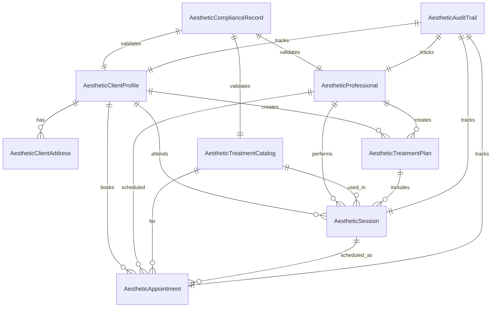

# Aesthetic Clinic Database Schema

## 🗃️ Database Overview

The aesthetic clinic database schema is designed with Brazilian healthcare compliance at its core. It implements comprehensive data models for client management, treatment tracking, multi-professional coordination, and regulatory compliance.

## 📋 Core Tables Structure

### 1. Client Management Tables

#### AestheticClientProfile
```sql
CREATE TABLE AestheticClientProfile (
    id UUID PRIMARY KEY DEFAULT gen_random_uuid(),
    user_id UUID REFERENCES User(id) NOT NULL,
    full_name VARCHAR(255) NOT NULL,
    date_of_birth DATE NOT NULL,
    gender VARCHAR(20) CHECK (gender IN ('male', 'female', 'other')),
    phone VARCHAR(20) NOT NULL,
    email VARCHAR(255) NOT NULL,
    cpf VARCHAR(14) UNIQUE NOT NULL CHECK (cpf ~ '^[0-9]{11}$'),
    rg VARCHAR(20),
    profession VARCHAR(100),
    marital_status VARCHAR(50),
    emergency_contact_name VARCHAR(255),
    emergency_contact_phone VARCHAR(20),
    skin_type VARCHAR(50),
    skin_tone VARCHAR(50),
    medical_conditions TEXT[],
    allergies TEXT[],
    current_medications TEXT[],
    previous_treatments TEXT[],
    aesthetic_goals TEXT[],
    contraindications TEXT[],
    photos_url TEXT[],
    treatment_history TEXT[],
    preferred_contact_method VARCHAR(50) DEFAULT 'whatsapp',
    notification_preferences JSONB DEFAULT '{}',
    lgpd_consent_given BOOLEAN NOT NULL DEFAULT false,
    lgpd_consent_date TIMESTAMP WITH TIME ZONE,
    data_processing_consent BOOLEAN NOT NULL DEFAULT false,
    marketing_consent BOOLEAN NOT NULL DEFAULT false,
    created_at TIMESTAMP WITH TIME ZONE DEFAULT NOW(),
    updated_at TIMESTAMP WITH TIME ZONE DEFAULT NOW(),
    created_by UUID REFERENCES User(id),
    updated_by UUID REFERENCES User(id),
    
    -- Constraints for data integrity
    CONSTRAINT valid_cpf_format CHECK (LENGTH(cpf) = 11),
    CONSTRAINT valid_phone_format CHECK (phone ~ '^[0-9]{10,11}$'),
    CONSTRAINT valid_email_format CHECK (email ~* '^[A-Za-z0-9._%-]+@[A-Za-z0-9.-]+[.][A-Za-z]+$')
);

-- Indexes for performance optimization
CREATE INDEX idx_aesthetic_client_user_id ON AestheticClientProfile(user_id);
CREATE INDEX idx_aesthetic_client_cpf ON AestheticClientProfile(cpf);
CREATE INDEX idx_aesthetic_client_phone ON AestheticClientProfile(phone);
CREATE INDEX idx_aesthetic_client_email ON AestheticClientProfile(email);
CREATE INDEX idx_aesthetic_client_created_at ON AestheticClientProfile(created_at);
```

#### AestheticClientAddress
```sql
CREATE TABLE AestheticClientAddress (
    id UUID PRIMARY KEY DEFAULT gen_random_uuid(),
    client_id UUID REFERENCES AestheticClientProfile(id) ON DELETE CASCADE,
    address_type VARCHAR(50) NOT NULL CHECK (address_type IN ('residential', 'commercial', 'other')),
    street VARCHAR(255) NOT NULL,
    number VARCHAR(20),
    complement VARCHAR(100),
    neighborhood VARCHAR(100),
    city VARCHAR(100) NOT NULL,
    state VARCHAR(2) NOT NULL CHECK (LENGTH(state) = 2),
    postal_code VARCHAR(9) NOT NULL CHECK (postal_code ~ '^[0-9]{8}$'),
    country VARCHAR(50) DEFAULT 'Brasil',
    latitude DECIMAL(10, 8),
    longitude DECIMAL(11, 8),
    is_primary BOOLEAN DEFAULT false,
    created_at TIMESTAMP WITH TIME ZONE DEFAULT NOW(),
    updated_at TIMESTAMP WITH TIME ZONE DEFAULT NOW()
);

-- Indexes for location-based queries
CREATE INDEX idx_aesthetic_address_client_id ON AestheticClientAddress(client_id);
CREATE INDEX idx_aesthetic_address_city_state ON AestheticClientAddress(city, state);
CREATE INDEX idx_aesthetic_address_postal_code ON AestheticClientAddress(postal_code);
CREATE INDEX idx_aesthetic_address_coordinates ON AestheticClientAddress(latitude, longitude);
```

### 2. Treatment Management Tables

#### AestheticTreatmentCatalog
```sql
CREATE TABLE AestheticTreatmentCatalog (
    id UUID PRIMARY KEY DEFAULT gen_random_uuid(),
    name VARCHAR(255) NOT NULL,
    description TEXT NOT NULL,
    category VARCHAR(100) NOT NULL CHECK (category IN ('facial', 'corporal', 'injectable', 'laser', 'peeling', 'preenchimento', 'outros')),
    duration_minutes INTEGER NOT NULL CHECK (duration_minutes > 0),
    base_price DECIMAL(10, 2) NOT NULL CHECK (base_price >= 0),
    anvisa_registration VARCHAR(50) UNIQUE,
    anvisa_product_name VARCHAR(255),
    anvisa_manufacturer VARCHAR(255),
    anvisa_lot_number VARCHAR(50),
    anvisa_expiration_date DATE,
    anvisa_risk_level VARCHAR(20) CHECK (anvisa_risk_level IN ('I', 'II', 'III', 'IV')),
    required_professional_type VARCHAR(100) NOT NULL,
    minimum_age INTEGER DEFAULT 18,
    maximum_age INTEGER,
    pregnancy_contraindicated BOOLEAN DEFAULT false,
    breastfeeding_contraindicated BOOLEAN DEFAULT false,
    required_sessions INTEGER DEFAULT 1,
    session_interval_days INTEGER DEFAULT 7,
    recovery_time_days INTEGER DEFAULT 0,
    contraindications TEXT[],
    side_effects TEXT[],
    pre_care_instructions TEXT[],
    post_care_instructions TEXT[],
    results_duration_days INTEGER,
    photo_required BOOLEAN DEFAULT false,
    consultation_required BOOLEAN DEFAULT true,
    active BOOLEAN DEFAULT true,
    created_at TIMESTAMP WITH TIME ZONE DEFAULT NOW(),
    updated_at TIMESTAMP WITH TIME ZONE DEFAULT NOW(),
    created_by UUID REFERENCES User(id),
    updated_by UUID REFERENCES User(id),
    
    -- ANVISA compliance constraints
    CONSTRAINT valid_anvisa_registration CHECK (
        anvisa_registration IS NULL OR 
        anvisa_registration ~ '^[0-9]{13}$'
    ),
    CONSTRAINT valid_price CHECK (base_price > 0),
    CONSTRAINT valid_duration CHECK (duration_minutes > 0)
);

-- Indexes for treatment lookup
CREATE INDEX idx_aesthetic_treatment_category ON AestheticTreatmentCatalog(category);
CREATE INDEX idx_aesthetic_treatment_anvisa ON AestheticTreatmentCatalog(anvisa_registration);
CREATE INDEX idx_aesthetic_treatment_active ON AestheticTreatmentCatalog(active);
CREATE INDEX idx_aesthetic_treatment_name ON AestheticTreatmentCatalog(name);
CREATE INDEX idx_aesthetic_treatment_professional_type ON AestheticTreatmentCatalog(required_professional_type);
```

#### AestheticTreatmentPlan
```sql
CREATE TABLE AestheticTreatmentPlan (
    id UUID PRIMARY KEY DEFAULT gen_random_uuid(),
    client_id UUID REFERENCES AestheticClientProfile(id) ON DELETE CASCADE,
    professional_id UUID REFERENCES AestheticProfessional(id) ON DELETE SET NULL,
    name VARCHAR(255) NOT NULL,
    description TEXT NOT NULL,
    goals TEXT[] NOT NULL,
    total_estimated_sessions INTEGER NOT NULL CHECK (total_estimated_sessions > 0),
    completed_sessions INTEGER DEFAULT 0 CHECK (completed_sessions >= 0),
    estimated_total_cost DECIMAL(10, 2) NOT NULL CHECK (estimated_total_cost >= 0),
    actual_total_cost DECIMAL(10, 2),
    start_date DATE,
    estimated_completion_date DATE,
    actual_completion_date DATE,
    status VARCHAR(50) NOT NULL DEFAULT 'planning' CHECK (status IN ('planning', 'active', 'completed', 'paused', 'cancelled')),
    priority VARCHAR(20) DEFAULT 'medium' CHECK (priority IN ('low', 'medium', 'high', 'urgent')),
    ai_recommended BOOLEAN DEFAULT false,
    ai_confidence_score DECIMAL(3, 2),
    created_at TIMESTAMP WITH TIME ZONE DEFAULT NOW(),
    updated_at TIMESTAMP WITH TIME ZONE DEFAULT NOW(),
    created_by UUID REFERENCES User(id),
    updated_by UUID REFERENCES User(id),
    
    -- Plan progress constraints
    CONSTRAINT valid_session_progress CHECK (completed_sessions <= total_estimated_sessions),
    CONSTRAINT valid_dates CHECK (actual_completion_date IS NULL OR actual_completion_date >= start_date)
);

-- Indexes for plan management
CREATE INDEX idx_aesthetic_plan_client_id ON AestheticTreatmentPlan(client_id);
CREATE INDEX idx_aesthetic_plan_professional_id ON AestheticTreatmentPlan(professional_id);
CREATE INDEX idx_aesthetic_plan_status ON AestheticTreatmentPlan(status);
CREATE INDEX idx_aesthetic_plan_dates ON AestheticTreatmentPlan(start_date, estimated_completion_date);
```

### 3. Session Management Tables

#### AestheticSession
```sql
CREATE TABLE AestheticSession (
    id UUID PRIMARY KEY DEFAULT gen_random_uuid(),
    client_id UUID REFERENCES AestheticClientProfile(id) ON DELETE CASCADE,
    treatment_plan_id UUID REFERENCES AestheticTreatmentPlan(id) ON DELETE SET NULL,
    professional_id UUID REFERENCES AestheticProfessional(id) ON DELETE SET NULL,
    treatment_id UUID REFERENCES AestheticTreatmentCatalog(id),
    appointment_id UUID REFERENCES AestheticAppointment(id) ON DELETE SET NULL,
    session_number INTEGER NOT NULL CHECK (session_number > 0),
    scheduled_date TIMESTAMP WITH TIME ZONE NOT NULL,
    actual_start_time TIMESTAMP WITH TIME ZONE,
    actual_end_time TIMESTAMP WITH TIME ZONE,
    status VARCHAR(50) NOT NULL DEFAULT 'scheduled' CHECK (status IN ('scheduled', 'in_progress', 'completed', 'cancelled', 'no_show', 'rescheduled')),
    treatment_area TEXT[],
    products_used JSONB[] DEFAULT '{}',
    techniques_used TEXT[],
    settings_parameters JSONB DEFAULT '{}',
    before_photos_url TEXT[],
    after_photos_url TEXT[],
    notes TEXT,
    client_feedback TEXT,
    professional_notes TEXT,
    complications TEXT[],
    results_assessment JSONB DEFAULT '{}',
    satisfaction_rating INTEGER CHECK (satisfaction_rating BETWEEN 1 AND 5),
    pain_level INTEGER CHECK (pain_level BETWEEN 1 AND 10),
    recovery_notes TEXT,
    follow_up_required BOOLEAN DEFAULT false,
    follow_up_date TIMESTAMP WITH TIME ZONE,
    anvisa_lot_used VARCHAR(50),
    anvisa_expiration_check BOOLEAN DEFAULT false,
    lgpd_photo_consent BOOLEAN DEFAULT false,
    created_at TIMESTAMP WITH TIME ZONE DEFAULT NOW(),
    updated_at TIMESTAMP WITH TIME ZONE DEFAULT NOW(),
    created_by UUID REFERENCES User(id),
    updated_by UUID REFERENCES User(id),
    
    -- Session integrity constraints
    CONSTRAINT valid_time_range CHECK (
        actual_end_time IS NULL OR 
        actual_start_time IS NULL OR 
        actual_end_time > actual_start_time
    ),
    CONSTRAINT valid_session_timing CHECK (
        actual_start_time IS NULL OR 
        actual_start_time >= scheduled_date - INTERVAL '1 hour'
    )
);

-- Indexes for session tracking
CREATE INDEX idx_aesthetic_session_client_id ON AestheticSession(client_id);
CREATE INDEX idx_aesthetic_session_professional_id ON AestheticSession(professional_id);
CREATE INDEX idx_aesthetic_session_scheduled_date ON AestheticSession(scheduled_date);
CREATE INDEX idx_aesthetic_session_status ON AestheticSession(status);
CREATE INDEX idx_aesthetic_session_treatment_plan ON AestheticSession(treatment_plan_id);
```

### 4. Professional Management Tables

#### AestheticProfessional
```sql
CREATE TABLE AestheticProfessional (
    id UUID PRIMARY KEY DEFAULT gen_random_uuid(),
    user_id UUID REFERENCES User(id) NOT NULL,
    professional_type VARCHAR(100) NOT NULL CHECK (
        professional_type IN (
            'médico', 'enfermeiro', 'fisioterapeuta', 'biomédico', 
            'farmacêutico', 'dentista', 'psicólogo', 'nutricionista'
        )
    ),
    cfm_crm_number VARCHAR(20) UNIQUE NOT NULL,
    cfm_crm_state VARCHAR(2) NOT NULL CHECK (LENGTH(cfm_crm_state) = 2),
    cfm_crm_specialty VARCHAR(100),
    professional_license VARCHAR(50) UNIQUE,
    license_expiration_date DATE,
    anvisa_certification_number VARCHAR(50),
    anvisa_certification_expiration DATE,
    specialization TEXT[],
    experience_years INTEGER DEFAULT 0 CHECK (experience_years >= 0),
    treatments_specialized TEXT[],
    bio TEXT,
    consultation_duration_minutes INTEGER DEFAULT 30 CHECK (consultation_duration_minutes > 0),
    base_consultation_price DECIMAL(10, 2) DEFAULT 0 CHECK (base_consultation_price >= 0),
    availability_schedule JSONB DEFAULT '{}',
    max_daily_sessions INTEGER DEFAULT 20 CHECK (max_daily_sessions > 0),
    max_weekly_sessions INTEGER DEFAULT 100 CHECK (max_weekly_sessions > 0),
    requires_supervision BOOLEAN DEFAULT false,
    supervisor_id UUID REFERENCES AestheticProfessional(id),
    professional_status VARCHAR(50) DEFAULT 'active' CHECK (
        professional_status IN ('active', 'inactive', 'suspended', 'retired')
    ),
    background_check_completed BOOLEAN DEFAULT false,
    background_check_date DATE,
    insurance_provider VARCHAR(100),
    insurance_policy_number VARCHAR(50),
    emergency_contact_name VARCHAR(255),
    emergency_contact_phone VARCHAR(20),
    profile_photo_url VARCHAR(500),
    created_at TIMESTAMP WITH TIME ZONE DEFAULT NOW(),
    updated_at TIMESTAMP WITH TIME ZONE DEFAULT NOW(),
    created_by UUID REFERENCES User(id),
    updated_by UUID REFERENCES User(id),
    
    -- Professional validation constraints
    CONSTRAINT valid_crm_format CHECK (cfm_crm_number ~ '^[0-9]+$'),
    CONSTRAINT valid_license_expiration CHECK (
        license_expiration_date IS NULL OR 
        license_expiration_date > CURRENT_DATE
    ),
    CONSTRAINT valid_supervisor CHECK (
        requires_supervision = false OR 
        supervisor_id IS NOT NULL AND 
        supervisor_id != id
    )
);

-- Indexes for professional lookup
CREATE INDEX idx_aesthetic_professional_user_id ON AestheticProfessional(user_id);
CREATE INDEX idx_aesthetic_professional_type ON AestheticProfessional(professional_type);
CREATE INDEX idx_aesthetic_professional_crm ON AestheticProfessional(cfm_crm_number, cfm_crm_state);
CREATE INDEX idx_aesthetic_professional_status ON AestheticProfessional(professional_status);
CREATE INDEX idx_aesthetic_professional_specialization ON AestheticProfessional USING GIN(specialization);
```

### 5. Scheduling Tables

#### AestheticAppointment
```sql
CREATE TABLE AestheticAppointment (
    id UUID PRIMARY KEY DEFAULT gen_random_uuid(),
    client_id UUID REFERENCES AestheticClientProfile(id) ON DELETE CASCADE,
    professional_id UUID REFERENCES AestheticProfessional(id) ON DELETE SET NULL,
    treatment_id UUID REFERENCES AestheticTreatmentCatalog(id) ON DELETE SET NULL,
    session_id UUID REFERENCES AestheticSession(id) ON DELETE SET NULL,
    clinic_id UUID REFERENCES Clinic(id),
    appointment_type VARCHAR(50) NOT NULL DEFAULT 'consultation' CHECK (
        appointment_type IN ('consultation', 'treatment', 'follow_up', 'assessment', 'emergency')
    ),
    scheduled_start TIMESTAMP WITH TIME ZONE NOT NULL,
    scheduled_end TIMESTAMP WITH TIME ZONE NOT NULL,
    actual_start TIMESTAMP WITH TIME ZONE,
    actual_end TIMESTAMP WITH TIME ZONE,
    status VARCHAR(50) NOT NULL DEFAULT 'scheduled' CHECK (
        status IN ('scheduled', 'confirmed', 'in_progress', 'completed', 'cancelled', 'no_show', 'rescheduled')
    ),
    duration_minutes INTEGER NOT NULL CHECK (duration_minutes > 0),
    price DECIMAL(10, 2) NOT NULL CHECK (price >= 0),
    payment_status VARCHAR(50) DEFAULT 'pending' CHECK (
        payment_status IN ('pending', 'paid', 'partial', 'refunded', 'cancelled')
    ),
    payment_method VARCHAR(50),
    insurance_captured BOOLEAN DEFAULT false,
    insurance_authorization_number VARCHAR(50),
    room_number VARCHAR(20),
    equipment_required TEXT[],
    special_requirements TEXT[],
    notes TEXT,
    cancellation_reason TEXT,
    cancellation_fee DECIMAL(10, 2) DEFAULT 0,
    reschedule_count INTEGER DEFAULT 0 CHECK (reschedule_count >= 0),
    last_reminder_sent TIMESTAMP WITH TIME ZONE,
    reminder_method VARCHAR(50) DEFAULT 'whatsapp',
    no_show_prediction_score DECIMAL(3, 2) CHECK (no_show_prediction_score BETWEEN 0 AND 1),
    ai_optimized BOOLEAN DEFAULT false,
    created_at TIMESTAMP WITH TIME ZONE DEFAULT NOW(),
    updated_at TIMESTAMP WITH TIME ZONE DEFAULT NOW(),
    created_by UUID REFERENCES User(id),
    updated_by UUID REFERENCES User(id),
    
    -- Appointment validation constraints
    CONSTRAINT valid_time_range CHECK (scheduled_end > scheduled_start),
    CONSTRAINT valid_actual_times CHECK (
        (actual_start IS NULL AND actual_end IS NULL) OR 
        (actual_start IS NOT NULL AND actual_end IS NULL) OR 
        (actual_start IS NOT NULL AND actual_end IS NOT NULL AND actual_end > actual_start)
    ),
    CONSTRAINT valid_duration CHECK (
        EXTRACT(EPOCH FROM (scheduled_end - scheduled_start)) / 60 = duration_minutes
    )
);

-- Indexes for scheduling optimization
CREATE INDEX idx_aesthetic_appointment_client_id ON AestheticAppointment(client_id);
CREATE INDEX idx_aesthetic_appointment_professional_id ON AestheticAppointment(professional_id);
CREATE INDEX idx_aesthetic_appointment_clinic_id ON AestheticAppointment(clinic_id);
CREATE INDEX idx_aesthetic_appointment_scheduled_start ON AestheticAppointment(scheduled_start);
CREATE INDEX idx_aesthetic_appointment_status ON AestheticAppointment(status);
CREATE INDEX idx_aesthetic_appointment_dates ON AestheticAppointment(scheduled_start, scheduled_end);
```

### 6. Compliance Tables

#### AestheticComplianceRecord
```sql
CREATE TABLE AestheticComplianceRecord (
    id UUID PRIMARY KEY DEFAULT gen_random_uuid(),
    record_type VARCHAR(50) NOT NULL CHECK (
        record_type IN ('lgpd_consent', 'anv_validation', 'cfm_verification', 'treatment_authorization', 'data_access')
    ),
    entity_type VARCHAR(50) NOT NULL CHECK (
        entity_type IN ('client', 'professional', 'treatment', 'session', 'appointment')
    ),
    entity_id UUID NOT NULL,
    compliance_status VARCHAR(50) NOT NULL DEFAULT 'pending' CHECK (
        compliance_status IN ('pending', 'approved', 'rejected', 'requires_review', 'expired')
    ),
    validation_date TIMESTAMP WITH TIME ZONE,
    validator_id UUID REFERENCES User(id),
    validation_notes TEXT,
    compliance_score DECIMAL(3, 2) CHECK (compliance_score BETWEEN 0 AND 1),
    risk_level VARCHAR(20) CHECK (risk_level IN ('low', 'medium', 'high', 'critical')),
    next_review_date TIMESTAMP WITH TIME ZONE,
    expiration_date TIMESTAMP WITH TIME ZONE,
    documents_url TEXT[],
    metadata JSONB DEFAULT '{}',
    created_at TIMESTAMP WITH TIME ZONE DEFAULT NOW(),
    updated_at TIMESTAMP WITH TIME ZONE DEFAULT NOW(),
    created_by UUID REFERENCES User(id),
    updated_by UUID REFERENCES User(id)
);

-- Indexes for compliance tracking
CREATE INDEX idx_aesthetic_compliance_entity ON AestheticComplianceRecord(entity_type, entity_id);
CREATE INDEX idx_aesthetic_compliance_type ON AestheticComplianceRecord(record_type);
CREATE INDEX idx_aesthetic_compliance_status ON AestheticComplianceRecord(compliance_status);
CREATE INDEX idx_aesthetic_compliance_validation_date ON AestheticComplianceRecord(validation_date);
CREATE INDEX idx_aesthetic_compliance_next_review ON AestheticComplianceRecord(next_review_date);
```

#### AestheticAuditTrail
```sql
CREATE TABLE AestheticAuditTrail (
    id UUID PRIMARY KEY DEFAULT gen_random_uuid(),
    action VARCHAR(100) NOT NULL,
    entity_type VARCHAR(50) NOT NULL,
    entity_id UUID NOT NULL,
    user_id UUID REFERENCES User(id) NOT NULL,
    user_role VARCHAR(50) NOT NULL,
    action_details JSONB NOT NULL,
    previous_value JSONB,
    new_value JSONB,
    ip_address INET,
    user_agent TEXT,
    session_id UUID,
    compliance_relevant BOOLEAN DEFAULT false,
    risk_level VARCHAR(20) CHECK (risk_level IN ('low', 'medium', 'high', 'critical')),
    requires_review BOOLEAN DEFAULT false,
    review_status VARCHAR(50) DEFAULT 'none' CHECK (
        review_status IN ('none', 'pending', 'approved', 'rejected')
    ),
    reviewer_id UUID REFERENCES User(id),
    review_notes TEXT,
    review_date TIMESTAMP WITH TIME ZONE,
    created_at TIMESTAMP WITH TIME ZONE DEFAULT NOW()
);

-- Indexes for audit performance
CREATE INDEX idx_aesthetic_audit_entity ON AestheticAuditTrail(entity_type, entity_id);
CREATE INDEX idx_aesthetic_audit_user_id ON AestheticAuditTrail(user_id);
CREATE INDEX idx_aesthetic_audit_action ON AestheticAuditTrail(action);
CREATE INDEX idx_aesthetic_audit_created_at ON AestheticAuditTrail(created_at);
CREATE INDEX idx_aesthetic_audit_compliance ON AestheticAuditTrail(compliance_relevant);
CREATE INDEX idx_aesthetic_audit_review_status ON AestheticAuditTrail(review_status);
```

## 🔗 Table Relationships

### Primary Relationships


## 🛡️ Row Level Security (RLS) Policies

### Client Data Protection
```sql
-- Enable RLS on client tables
ALTER TABLE AestheticClientProfile ENABLE ROW LEVEL SECURITY;
ALTER TABLE AestheticClientAddress ENABLE ROW LEVEL SECURITY;

-- Clients can only see their own data
CREATE POLICY client_own_data ON AestheticClientProfile
    FOR SELECT USING (user_id = auth.uid());

-- Professionals can see clients they have appointments with
CREATE POLICY professional_client_access ON AestheticClientProfile
    FOR SELECT USING (
        id IN (
            SELECT client_id FROM AestheticAppointment 
            WHERE professional_id = (
                SELECT id FROM AestheticProfessional 
                WHERE user_id = auth.uid()
            )
        )
    );
```

### Professional Access Control
```sql
-- Enable RLS on professional tables
ALTER TABLE AestheticProfessional ENABLE ROW LEVEL SECURITY;

-- Professionals can see their own profile
CREATE POLICY professional_own_profile ON AestheticProfessional
    FOR ALL USING (user_id = auth.uid());

-- Admins can see all professionals
CREATE POLICY admin_professional_access ON AestheticProfessional
    FOR ALL USING (
        EXISTS (
            SELECT 1 FROM User 
            WHERE id = auth.uid() AND role = 'admin'
        )
    );
```

## 📊 Performance Optimization

### Materialized Views
```sql
-- Client statistics for dashboard
CREATE MATERIALIZED VIEW AestheticClientStatistics AS
SELECT 
    cp.id,
    cp.full_name,
    cp.created_at,
    COUNT(DISTINCT s.id) as total_sessions,
    COUNT(DISTINCT ap.id) as total_appointments,
    SUM(ap.price) as total_spent,
    MAX(s.scheduled_date) as last_session_date,
    AVG(s.satisfaction_rating) as average_satisfaction
FROM AestheticClientProfile cp
LEFT JOIN AestheticSession s ON cp.id = s.client_id
LEFT JOIN AestheticAppointment ap ON cp.id = ap.client_id
GROUP BY cp.id, cp.full_name, cp.created_at;

-- Refresh strategy
CREATE MATERIALIZED VIEW AestheticProfessionalWorkload AS
SELECT 
    p.id,
    p.full_name,
    p.professional_type,
    COUNT(DISTINCT ap.id) as scheduled_appointments,
    COUNT(DISTINCT s.id) as completed_sessions,
    SUM(ap.price) as estimated_revenue,
    AVG(s.satisfaction_rating) as average_rating
FROM AestheticProfessional p
LEFT JOIN AestheticAppointment ap ON p.id = ap.professional_id AND ap.status = 'scheduled'
LEFT JOIN AestheticSession s ON p.id = s.professional_id AND s.status = 'completed'
GROUP BY p.id, p.full_name, p.professional_type;

-- Refresh indexes periodically
REFRESH MATERIALIZED VIEW AestheticClientStatistics;
REFRESH MATERIALIZED VIEW AestheticProfessionalWorkload;
```

## 🔄 Database Triggers

### Automated Audit Trail
```sql
CREATE OR REPLACE FUNCTION aesthetic_audit_trigger()
RETURNS TRIGGER AS $$
BEGIN
    INSERT INTO AestheticAuditTrail (
        action,
        entity_type,
        entity_id,
        user_id,
        user_role,
        action_details,
        previous_value,
        new_value,
        ip_address,
        user_agent,
        session_id
    ) VALUES (
        TG_OP,
        TG_TABLE_NAME,
        COALESCE(NEW.id, OLD.id),
        auth.uid(),
        (SELECT role FROM User WHERE id = auth.uid()),
        jsonb_build_object(
            'table', TG_TABLE_NAME,
            'operation', TG_OP,
            'timestamp', NOW()
        ),
        CASE WHEN TG_OP IN ('UPDATE', 'DELETE') THEN to_jsonb(OLD) ELSE NULL END,
        CASE WHEN TG_OP IN ('INSERT', 'UPDATE') THEN to_jsonb(NEW) ELSE NULL END,
        current_setting('request.headers', true)::jsonb->>'x-client-ip',
        current_setting('request.headers', true)::jsonb->>'user-agent',
        current_setting('request.headers', true)::jsonb->>'x-session-id'
    );
    
    RETURN COALESCE(NEW, OLD);
END;
$$ LANGUAGE plpgsql SECURITY DEFINER;
```

### Compliance Validation
```sql
CREATE OR REPLACE FUNCTION aesthetic_compliance_check()
RETURNS TRIGGER AS $$
BEGIN
    -- Check ANVISA compliance for treatments
    IF TG_OP IN ('INSERT', 'UPDATE') AND TG_TABLE_NAME = 'AestheticSession' THEN
        IF NEW.treatment_id IS NOT NULL THEN
            PERFORM validate_anvisa_compliance(NEW.treatment_id);
        END IF;
    END IF;
    
    -- Check LGPD consent for client data
    IF TG_OP IN ('INSERT', 'UPDATE') AND TG_TABLE_NAME = 'AestheticClientProfile' THEN
        IF NOT NEW.lgpd_consent_given THEN
            RAISE EXCEPTION 'LGPD consent is required for client profiles';
        END IF;
    END IF;
    
    RETURN NEW;
END;
$$ LANGUAGE plpgsql SECURITY DEFINER;
```

This comprehensive database schema provides a robust foundation for the aesthetic clinic system with full Brazilian healthcare compliance support and optimal performance.