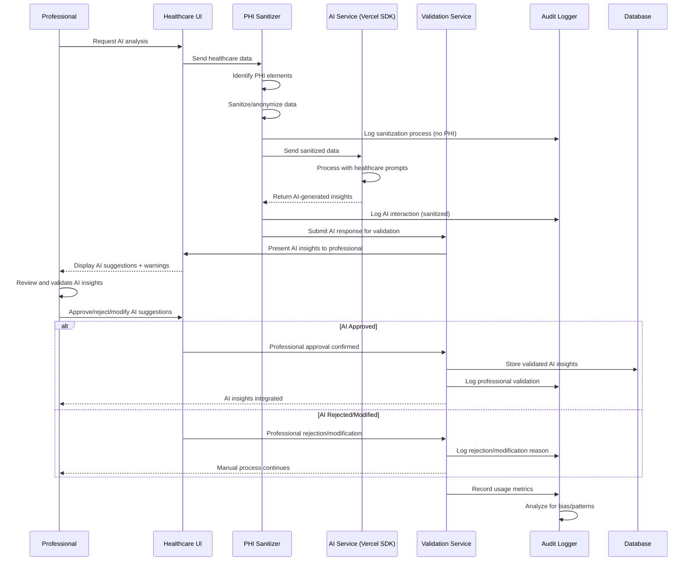
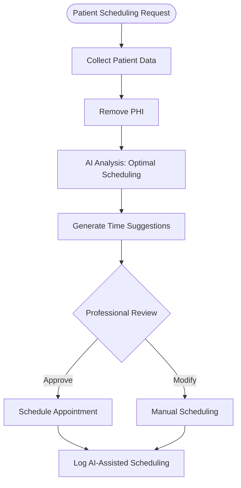
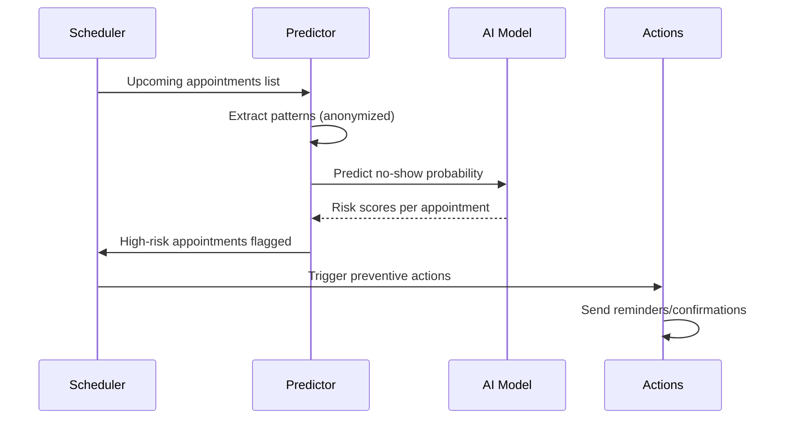
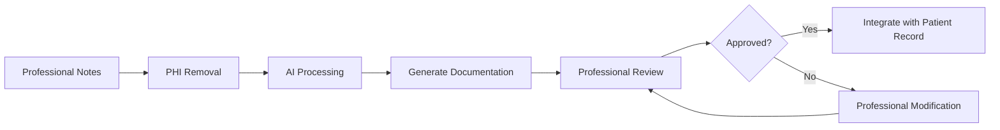

# AI Integration Flow

## Purpose & Scope

This flow documents AI interactions and workflows within the **NeonPro Healthcare Platform**, covering PHI sanitization, professional oversight, bias prevention, and healthcare-specific AI features while maintaining full compliance with medical data protection regulations.

## Compliance Requirements

- ✅ **PHI Protection**: No Protected Health Information sent to external AI services
- ✅ **Professional Oversight**: Human validation required for all AI-generated medical insights
- ✅ **LGPD Compliance**: AI processing requires explicit patient consent
- ✅ **ANVISA Standards**: AI medical device software classification compliance
- ✅ **Transparency**: Clear indication of AI-generated vs human-generated content

## Implementation Guidelines

### Phase 1: Data Preparation & Sanitization
1. **Data Collection**: Gather relevant healthcare data for AI processing
2. **PHI Identification**: Automatically identify all Protected Health Information
3. **Data Sanitization**: Remove or anonymize PHI before AI processing
4. **Context Preservation**: Maintain clinical relevance while protecting privacy

### Phase 2: AI Processing & Analysis
1. **Service Selection**: Choose appropriate AI provider (OpenAI/Anthropic)
2. **Prompt Engineering**: Use healthcare-optimized prompts with safety guidelines
3. **Request Processing**: Send sanitized data to AI service via Vercel AI SDK
4. **Response Processing**: Receive and validate AI-generated insights

### Phase 3: Professional Validation & Integration
1. **Human Review**: Professional validates all AI-generated content
2. **Clinical Context**: Integrate AI insights with professional knowledge
3. **Documentation**: Record AI assistance in patient documentation
4. **Decision Support**: Use AI as decision support tool, not decision maker

### Phase 4: Audit & Monitoring
1. **Usage Logging**: Log all AI interactions without sensitive data
2. **Bias Monitoring**: Track AI outputs for potential biases or errors
3. **Performance Metrics**: Monitor AI accuracy and professional satisfaction
4. **Compliance Validation**: Ensure ongoing regulatory compliance

## Mermaid Diagram



## Healthcare AI Features

### 1. Appointment Intelligence



### 2. No-Show Prediction Engine



### 3. Medical Documentation Assistant



## PHI Sanitization Patterns

### Automatic PHI Detection
```typescript
interface PHISanitizer {
  // Personal Identifiers
  removePersonalIdentifiers(text: string): string;
  // Medical Record Numbers
  sanitizeMedicalIds(text: string): string;
  // Dates (keep only relative timing)
  anonymizeDates(text: string): string;
  // Geographic Information
  removeGeographicInfo(text: string): string;
}
```

### Sanitization Rules
- **Names**: Replace with generic identifiers (Patient A, Doctor B)
- **Dates**: Convert to relative time periods (3 days ago, last week)
- **Medical IDs**: Replace with randomized identifiers
- **Addresses**: Remove or replace with geographic regions
- **Contact Info**: Complete removal of phone/email
- **Biometric Data**: Statistical summaries only

## Error Handling

### AI Service Failures
- **Service Unavailable**: 
  - Fallback: Manual workflow continuation
  - User Notice: "AI assistant temporarily unavailable"
  - Logging: Service outage with duration tracking

- **Invalid Response**:
  - Validation: Automatic response validation
  - Fallback: Request regeneration or manual process
  - Alert: Professional notified of AI processing issue

- **Rate Limiting**:
  - Queue: Request queuing system
  - Priority: Emergency requests prioritized
  - Alternative: Manual process with AI retry later

### Sanitization Failures
- **PHI Detection Missed**:
  - Block: Prevent request to AI service
  - Alert: Security team notification
  - Audit: Log potential PHI exposure incident

- **Context Loss**:
  - Validation: Ensure clinical relevance maintained
  - Fallback: Request human input for missing context
  - Review: Professional assessment of sanitized data quality

## Security & Audit

### AI Processing Security
- **Data in Transit**: All AI requests over HTTPS/TLS 1.3
- **No Data Storage**: External AI services cannot store healthcare data
- **Access Logging**: Every AI request logged with non-PHI metadata
- **Token Management**: Secure API key rotation and management

### Professional Oversight Requirements
- **Clinical Decisions**: AI cannot make final clinical decisions
- **Documentation**: Clear marking of AI-assisted vs human content
- **Validation**: Professional must review and approve AI suggestions
- **Liability**: Professional maintains full responsibility for patient care

### Audit Requirements
- **AI Usage**: Track professional adoption and usage patterns
- **Accuracy Monitoring**: Compare AI suggestions with professional decisions
- **Bias Detection**: Monitor for demographic or clinical biases
- **Performance Metrics**: Response time, accuracy, user satisfaction

## AI Model Management

### Provider Configuration
```typescript
interface AIProvider {
  name: 'openai' | 'anthropic';
  model: string;
  temperature: number;
  maxTokens: number;
  healthcareOptimized: boolean;
}
```

### Healthcare-Specific Prompts
- **Medical Context**: Prompts optimized for healthcare scenarios
- **Safety Guidelines**: Built-in medical safety and ethics constraints
- **Limitation Awareness**: AI acknowledges scope limitations
- **Professional Deference**: AI defers to professional judgment

### Model Selection Criteria
- **Clinical Accuracy**: Validated performance on healthcare data
- **Safety Profile**: Low risk of harmful or inappropriate suggestions
- **Regulatory Compliance**: Meets medical AI regulatory requirements
- **Professional Trust**: High acceptance among healthcare professionals

## Performance Considerations

### Target Metrics
- **AI Response Time**: < 5 seconds for standard queries
- **Sanitization Speed**: < 1 second for typical clinical notes
- **Professional Review Time**: < 30 seconds for AI suggestions
- **System Availability**: 99.9% uptime for AI features

### Optimization Strategies
- **Prompt Caching**: Cache common healthcare prompt patterns
- **Batch Processing**: Group similar AI requests for efficiency
- **Edge Processing**: Local AI for non-sensitive tasks
- **Progressive Enhancement**: Graceful degradation when AI unavailable

## Integration Points

### External AI Services
- **OpenAI**: GPT-4 for complex medical reasoning tasks
- **Anthropic**: Claude for safety-critical healthcare applications
- **Vercel AI SDK**: Unified interface for multiple AI providers
- **Custom Models**: Healthcare-specific fine-tuned models (future)

### Internal Services
- **PHI Sanitizer**: Centralized PHI detection and removal service
- **Audit Service**: AI interaction logging and monitoring
- **Validation Service**: Professional oversight and approval workflows
- **Notification Service**: AI-related alerts and notifications

## Bias Prevention & Monitoring

### Bias Detection
- **Demographic Analysis**: Monitor AI responses across patient demographics
- **Clinical Pattern Analysis**: Detect systematic biases in clinical recommendations
- **Professional Feedback**: Collect feedback on AI suggestion appropriateness
- **Regular Audits**: Quarterly bias assessment and model adjustment

### Mitigation Strategies
- **Diverse Training Data**: Ensure AI training represents diverse populations
- **Regular Model Updates**: Continuous improvement based on bias detection
- **Professional Education**: Train professionals to recognize and correct AI biases
- **Transparency**: Clear documentation of AI limitations and known biases

## Future Enhancements

### Planned Features
- **Voice Integration**: AI-powered medical dictation and note-taking
- **Image Analysis**: AI assistance for medical imaging interpretation
- **Drug Interaction Checking**: AI-powered medication safety analysis
- **Clinical Decision Support**: Advanced diagnostic assistance tools

### Research Areas
- **Federated Learning**: Privacy-preserving AI training across healthcare networks
- **Explainable AI**: Better transparency in AI medical decision-making
- **Real-time Analytics**: Live clinical decision support during patient interactions
- **Predictive Modeling**: Population health and epidemic prediction models

## Notes

- All AI features are additive to professional capabilities, never replacements
- Emergency scenarios may bypass some AI processing for speed
- AI development follows healthcare-first, privacy-first principles
- Professional feedback drives continuous AI improvement
- All AI implementations undergo clinical validation before deployment

## Related Flows

- [`main-flow.md`](./main-flow.md) - Integration with main application workflow
- [`compliance-lgpd-flow.md`](./compliance-lgpd-flow.md) - LGPD compliance for AI processing
- [`healthcare-patient-flow.md`](./healthcare-patient-flow.md) - AI integration in patient workflows