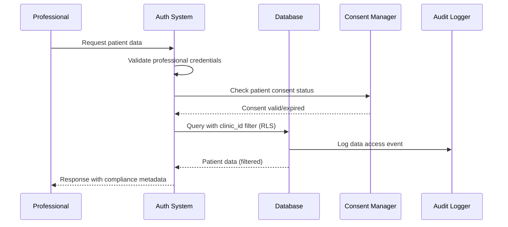
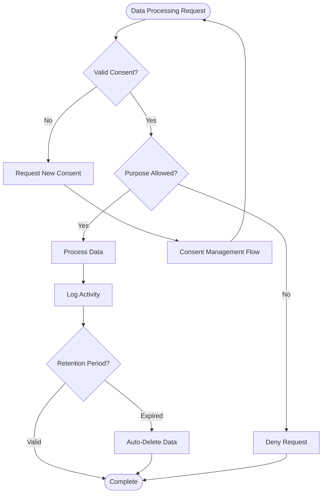
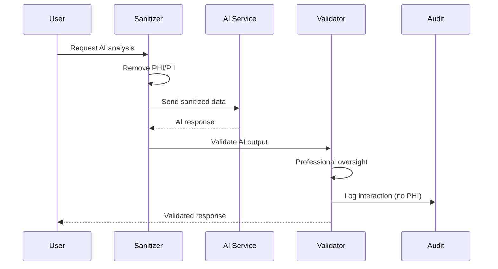

# App Flows Documentation Guide - Version 2.0.0

This file contains instructions and examples for documenting application flows in the **NEONPRO Healthcare Platform**. Complete flow documentation is organized in individual files within the `docs/app-flows/` folder.

## 🏥 Healthcare-Specific Flow Documentation

### File Organization

- **Location**: All flow documentation files must be in the `docs/app-flows/` folder
- **Naming**: Use descriptive names that reflect the flow (e.g., `main-flow.md`, `auth-flow.md`)
- **Healthcare Prefix**: Use `healthcare-` prefix for medical-specific flows
- **Compliance Prefix**: Use `compliance-` prefix for LGPD/ANVISA-related flows
- **Multiple Flows**: A single file documents one specific flow
- **Size Limit**: Each file must not exceed **250 lines** to maintain readability
- **Grouping**: Group flows by functionality or domain (e.g., authentication, patient-management)

### Required Structure for Each Flow

Each documented flow must contain:

1. **Title**: `# [FLOW_NAME] Flow`
2. **Purpose & Scope**: Clear description of the flow's objective with healthcare context
3. **Compliance Requirements**: LGPD, ANVISA, CFM requirements if applicable
4. **Implementation Guidelines**: Step-by-step guidelines with healthcare considerations
5. **Mermaid Diagram**: Visual representation using Mermaid syntax
6. **Error Handling**: Healthcare-specific error scenarios
7. **Security & Audit**: Patient data protection and audit trail requirements
8. **Notes**: Additional important information or adaptations

## 🎯 Healthcare Flow Categories

### Core Application Flows
- `main-flow.md` - Primary user journey in the platform
- `auth-flow.md` - Authentication and authorization processes
- `ai-flow.md` - AI interaction patterns and workflows

### Healthcare-Specific Flows  
- `healthcare-patient-flow.md` - Patient registration and management
- `healthcare-appointment-flow.md` - Appointment booking and management
- `healthcare-treatment-flow.md` - Treatment tracking and documentation
- `healthcare-emergency-flow.md` - Emergency access and critical workflows

### Compliance Flows
- `compliance-lgpd-flow.md` - LGPD consent and data protection workflows
- `compliance-anvisa-flow.md` - ANVISA regulatory compliance flows
- `compliance-audit-flow.md` - Audit trail and logging workflows
- `compliance-cfm-flow.md` - CFM professional oversight requirements

## 📋 Healthcare Flow Templates

### Template 1: Patient Management Flow

**Purpose & Scope:** Document patient data handling with full LGPD compliance and audit trail.

**Compliance Requirements:**
- ✅ LGPD consent validation before any data access
- ✅ Audit trail for all patient data modifications
- ✅ Professional license validation for data access
- ✅ Clinic-based data isolation (RLS)

**Implementation Guidelines:**

1. **Authentication**: Validate professional credentials and clinic association
2. **Consent Check**: Verify active patient consent before proceeding
3. **Data Access**: Apply Row Level Security based on clinic_id
4. **Audit Logging**: Log all data access and modifications
5. **Response**: Return data with compliance metadata

**Mermaid Diagram:**



**Error Handling:**
- **Consent Expired**: Redirect to consent renewal flow
- **Access Denied**: Log unauthorized access attempt
- **System Error**: Maintain audit trail even on failures

**Security & Audit:**
- All patient data access logged with timestamp, user, and purpose
- Sensitive data encrypted at rest and in transit
- Professional license validation before any healthcare data access

**Notes:** This template applies to all patient data interactions in the system.

---

### Template 2: LGPD Compliance Flow

**Purpose & Scope:** Ensure all data processing complies with LGPD requirements with proper consent management.

**Compliance Requirements:**
- ✅ Explicit consent for data processing
- ✅ Right to data portability 
- ✅ Right to erasure ("right to be forgotten")
- ✅ Data processing purpose limitation
- ✅ Retention period compliance

**Implementation Guidelines:**

1. **Consent Validation**: Check active consent before any data processing
2. **Purpose Verification**: Ensure processing aligns with consented purposes
3. **Data Minimization**: Process only necessary data for the specific purpose
4. **Audit Trail**: Log all data processing activities
5. **Retention Management**: Respect data retention periods

**Mermaid Diagram:**



**Error Handling:**
- **Consent Required**: Redirect to consent management interface
- **Purpose Mismatch**: Log violation and deny access
- **Retention Expired**: Automatic data deletion with audit log

**Security & Audit:**
- All consent decisions logged with legal basis
- Data processing purposes tracked and validated
- Automatic compliance monitoring and alerts

**Notes:** This flow is mandatory for all patient data processing in the healthcare platform.

---

### Template 3: AI Integration Flow

**Purpose & Scope:** Document AI processing workflows with healthcare data protection and bias prevention.

**Compliance Requirements:**
- ✅ PHI sanitization before AI processing
- ✅ No sensitive data storage in AI logs
- ✅ Professional oversight for AI-generated insights
- ✅ Transparency in AI decision-making

**Implementation Guidelines:**

1. **Data Sanitization**: Remove PHI before sending to AI services
2. **Professional Validation**: Require human oversight for AI outputs
3. **Audit Trail**: Log AI interactions without sensitive data
4. **Error Handling**: Graceful degradation when AI services unavailable
5. **Bias Monitoring**: Track AI outputs for potential biases

**Mermaid Diagram:**



**Error Handling:**
- **Sanitization Failure**: Block AI processing, log security event
- **AI Service Down**: Provide manual alternative workflow
- **Validation Failure**: Require professional review before output

**Security & Audit:**
- No PHI/PII sent to external AI services
- All AI interactions logged without sensitive data
- Professional oversight required for clinical AI outputs

**Notes:** All AI features must implement PHI sanitization and professional oversight.

## 🔧 Implementation Guidelines

### Mermaid Diagram Standards
- **Use consistent participant names**: Professional, Patient, System, Database
- **Include error paths**: Show both success and failure scenarios  
- **Add compliance checkpoints**: Highlight LGPD/ANVISA validation points
- **Color coding**: Use consistent colors for different types of interactions

### Healthcare-Specific Considerations
- **Patient Privacy**: Always show consent validation steps
- **Professional Oversight**: Include human validation for critical decisions
- **Audit Requirements**: Document all audit trail touchpoints
- **Emergency Scenarios**: Include emergency access patterns
- **Compliance Validation**: Show regulatory compliance checkpoints

### File Naming Conventions
```
main-flow.md                    # Core application flow
auth-flow.md                    # Authentication flow
ai-flow.md                      # AI integration flow
healthcare-patient-flow.md      # Patient management
healthcare-appointment-flow.md  # Appointment system
healthcare-treatment-flow.md    # Treatment workflows
healthcare-emergency-flow.md    # Emergency procedures
compliance-lgpd-flow.md        # LGPD compliance
compliance-anvisa-flow.md      # ANVISA compliance
compliance-audit-flow.md       # Audit workflows
compliance-cfm-flow.md         # CFM professional requirements
```

### Quality Checklist
- [ ] Healthcare compliance requirements documented
- [ ] LGPD consent flows included
- [ ] Audit trail points identified
- [ ] Error handling scenarios covered
- [ ] Professional oversight points marked
- [ ] PHI protection measures documented
- [ ] Emergency access procedures defined
- [ ] Mermaid diagrams render correctly
- [ ] File size under 250 lines
- [ ] Cross-references to related flows included
