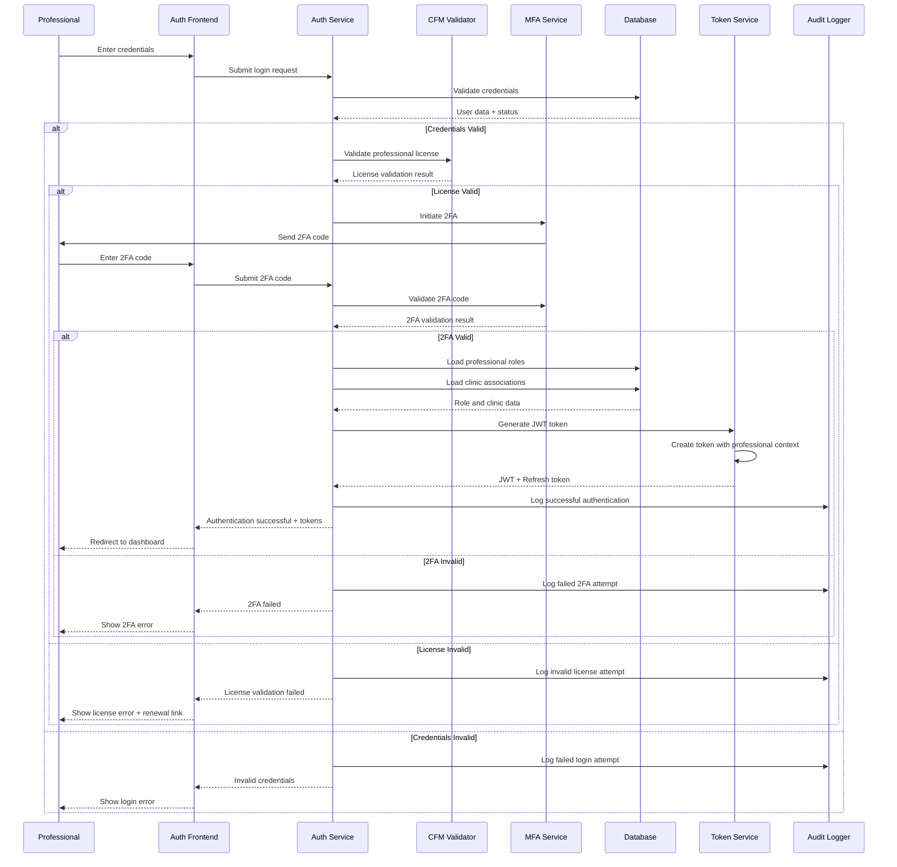
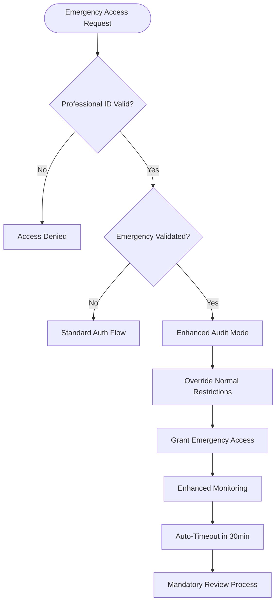
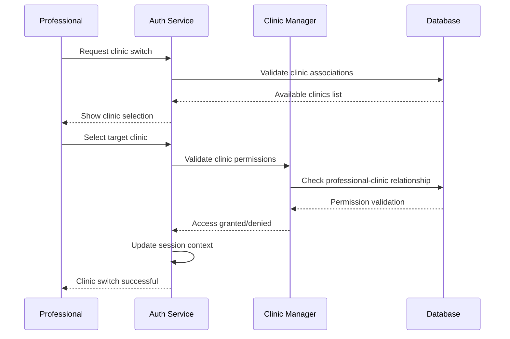

# Authentication Flow

## Purpose & Scope

This flow documents the complete authentication and authorization processes for the **NeonPro Healthcare Platform**, including professional credential validation, multi-factor authentication, role-based access control, and session management with healthcare compliance requirements.

## Compliance Requirements

- ✅ **CFM**: Professional license validation and verification
- ✅ **ANVISA**: Medical professional credential requirements
- ✅ **LGPD**: User consent for authentication data processing
- ✅ **Security Standards**: Strong authentication with audit trail
- ✅ **Session Security**: Secure token management and rotation

## Implementation Guidelines

### Phase 1: Initial Authentication
1. **Credential Validation**: Verify username/password against secure database
2. **Professional License Check**: Validate active CFM registration
3. **Multi-Factor Authentication**: SMS/Email/App-based 2FA verification
4. **Device Registration**: Register trusted devices for future access

### Phase 2: Authorization & Role Assignment
1. **Role Determination**: Assign roles based on professional credentials
2. **Clinic Association**: Link professional to authorized clinics
3. **Permission Matrix**: Apply role-based access control permissions
4. **Scope Definition**: Define data access boundaries per clinic

### Phase 3: Session Management
1. **JWT Token Generation**: Create secure JWT with professional context
2. **Refresh Token Setup**: Establish long-term refresh capability
3. **Session Storage**: Store session data with expiration tracking
4. **Audit Logging**: Record all authentication events

### Phase 4: Ongoing Validation
1. **Token Refresh**: Automatic token renewal before expiration
2. **Activity Monitoring**: Track professional activity patterns
3. **Security Validation**: Continuous security posture assessment
4. **Session Termination**: Secure logout and cleanup processes

## Mermaid Diagram



## Advanced Authentication Flows

### Emergency Access Flow



### Multi-Clinic Access Flow



## Error Handling

### Authentication Errors
- **Invalid Credentials**: 
  - Action: Show generic error message
  - Security: Log attempt with IP/timestamp
  - Recovery: Allow retry with rate limiting

- **Professional License Issues**:
  - Expired License: Redirect to renewal portal
  - Suspended License: Block access, contact admin
  - Invalid License: Request license verification

- **2FA Failures**:
  - Invalid Code: Allow retry (3 attempts max)
  - Code Expired: Generate new code
  - Device Issues: Provide backup authentication options

### Authorization Errors
- **Insufficient Permissions**: Show access denied with appeal process
- **Clinic Access Denied**: Display available clinics or contact admin
- **Role Assignment Issues**: Temporary access with manual review flag

### Session Errors
- **Token Expiration**: Automatic silent renewal if refresh token valid
- **Token Tampering**: Immediate session termination + security alert
- **Concurrent Sessions**: Allow with notification or enforce single session

## Security & Audit

### Authentication Security
- **Password Requirements**: Minimum 12 chars, complexity requirements
- **Account Lockout**: 5 failed attempts = 15-minute lockout
- **Device Fingerprinting**: Track device characteristics for anomaly detection
- **IP Restriction**: Optional IP whitelisting for high-security roles

### Session Security
- **JWT Security**: 
  - Signing: RS256 with rotating keys
  - Expiration: 15-minute access tokens
  - Refresh: 30-day refresh tokens with rotation
- **Session Hijacking Prevention**: 
  - IP binding optional
  - User agent validation
  - Activity pattern analysis

### Audit Requirements
- **Authentication Events**: All login attempts (success/failure)
- **Authorization Events**: Role assignments, permission changes
- **Session Events**: Token generation, refresh, expiration
- **Security Events**: Suspicious activity, emergency access usage

## Token Management

### JWT Token Structure
```json
{
  "header": {
    "alg": "RS256",
    "typ": "JWT"
  },
  "payload": {
    "sub": "prof_uuid_here",
    "iss": "neonpro-auth",
    "aud": "neonpro-api",
    "exp": 1640995200,
    "iat": 1640994300,
    "professional_id": "CFM_123456",
    "clinic_id": "clinic_uuid",
    "roles": ["doctor", "admin"],
    "permissions": ["patient_read", "patient_write"],
    "license_status": "active",
    "emergency_access": false
  }
}
```

### Token Refresh Strategy
- **Sliding Expiration**: Extend session for active users
- **Absolute Timeout**: Maximum session duration (8 hours for regular, 4 hours for admin)
- **Refresh Rotation**: New refresh token issued with each refresh
- **Revocation Support**: Immediate token blacklisting capability

## Performance Considerations

### Target Metrics
- **Login Time**: < 3 seconds (excluding 2FA input time)
- **Token Validation**: < 100ms
- **License Verification**: < 2 seconds
- **Session Refresh**: < 500ms

### Optimization Strategies
- **Credential Caching**: Hash-based caching for frequently accessed credentials
- **License Cache**: 1-hour TTL for CFM license validation
- **Token Caching**: Redis-based token validation cache
- **Connection Pooling**: Optimized database connections for auth operations

## Integration Points

### External Services
- **CFM Integration**: Real-time professional license validation
- **SMS Provider**: 2FA code delivery
- **Email Service**: Authentication notifications and alerts
- **Device Intelligence**: Fraud detection and device fingerprinting

### Internal Services
- **Audit Service**: Centralized authentication event logging
- **Permission Service**: Role-based access control management
- **Session Service**: Distributed session state management
- **Notification Service**: Security alerts and authentication notifications

## Emergency Procedures

### Account Recovery
1. **Identity Verification**: Multi-channel identity confirmation
2. **Temporary Access**: Limited-scope access for critical operations
3. **Security Review**: Mandatory security assessment before full restoration
4. **Enhanced Monitoring**: 30-day enhanced audit period

### Security Breach Response
1. **Immediate Lockdown**: All affected accounts locked immediately
2. **Token Revocation**: Mass token revocation and re-authentication required
3. **Audit Investigation**: Full security audit of affected accounts
4. **Communication**: Transparent communication to affected professionals

## Notes

- All authentication data encrypted in transit and at rest
- Professional license validation integrated with CFM real-time API
- Emergency access procedures require post-access justification
- Mobile and web authentication use same security standards
- Biometric authentication support planned for future releases

## Related Flows

- [`main-flow.md`](./main-flow.md) - Main application flow integration
- [`compliance-lgpd-flow.md`](./compliance-lgpd-flow.md) - LGPD compliance for auth data
- [`healthcare-emergency-flow.md`](./healthcare-emergency-flow.md) - Emergency access procedures