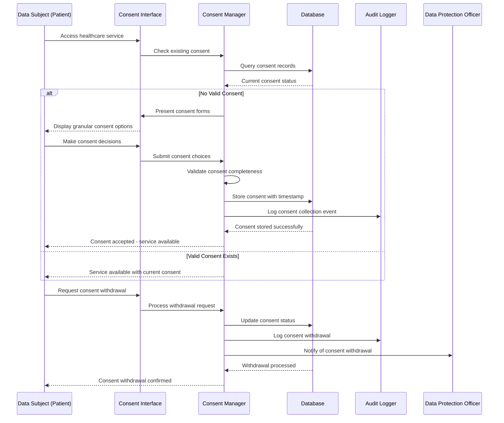
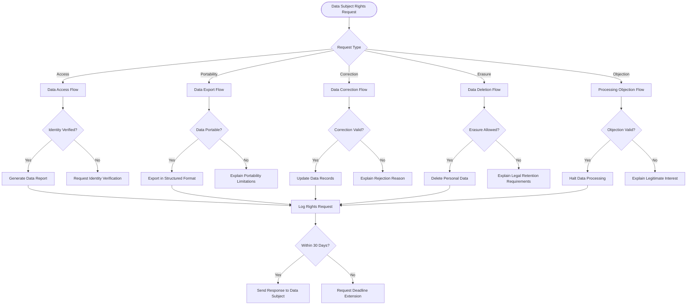
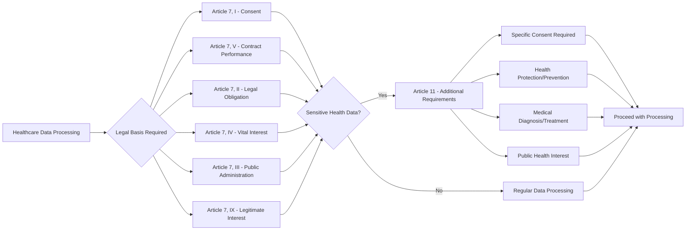
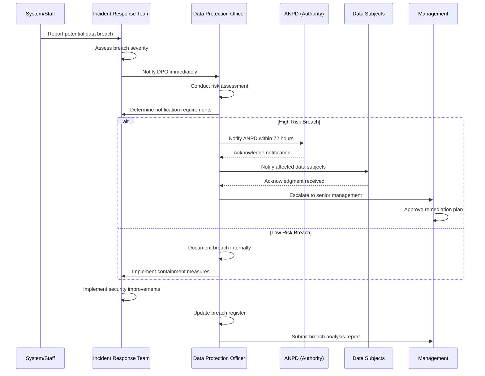

# LGPD Compliance Flow

## Purpose & Scope

This flow documents the complete **LGPD (Lei Geral de Proteção de Dados)** compliance implementation within the NeonPro Healthcare Platform, covering consent management, data subject rights, audit trails, and privacy protection measures for healthcare data processing.

## Compliance Requirements

- ✅ **LGPD Article 7**: Legal basis for personal data processing
- ✅ **LGPD Article 8**: Consent requirements and management
- ✅ **LGPD Article 9**: Consent for sensitive personal data (health data)
- ✅ **LGPD Article 18**: Data subject rights (access, portability, erasure)
- ✅ **LGPD Article 37**: Data Protection Officer (DPO) requirements
- ✅ **LGPD Article 48**: Data breach notification procedures

## Implementation Guidelines

### Phase 1: Legal Basis Establishment

1. **Purpose Definition**: Clearly define data processing purposes
2. **Legal Basis Selection**: Choose appropriate LGPD legal basis for each purpose
3. **Consent Requirements**: Identify when explicit consent is required
4. **Data Minimization**: Process only necessary data for each purpose

### Phase 2: Consent Management System

1. **Consent Collection**: Implement granular consent collection interfaces
2. **Consent Storage**: Securely store consent decisions with audit trail
3. **Consent Validation**: Real-time consent validation before data processing
4. **Consent Withdrawal**: Enable easy consent withdrawal by data subjects

### Phase 3: Data Subject Rights Implementation

1. **Access Rights**: Provide data subjects with access to their data
2. **Portability Rights**: Enable data export in structured formats
3. **Correction Rights**: Allow data subjects to correct inaccurate data
4. **Erasure Rights**: Implement "right to be forgotten" functionality

### Phase 4: Audit & Compliance Monitoring

1. **Processing Activities**: Maintain records of all data processing activities
2. **Data Protection Impact Assessment**: Regular DPIA for high-risk processing
3. **Breach Detection**: Automated detection of potential data breaches
4. **Compliance Reporting**: Regular compliance reports and metrics

## LGPD Consent Management Flow



## Data Subject Rights Management



## Healthcare Data Processing Legal Basis



## Data Breach Response Protocol



## Privacy by Design Implementation

### Technical Measures

- **Data Encryption**: End-to-end encryption for all personal data
- **Access Controls**: Role-based access with principle of least privilege
- **Data Anonymization**: Automatic anonymization of non-essential identifiers
- **Audit Logging**: Comprehensive logging of all data processing activities

### Organizational Measures

- **Privacy Policies**: Clear, transparent privacy notices
- **Staff Training**: Regular LGPD awareness and compliance training
- **Data Protection Impact Assessment**: Systematic DPIA for new processing activities
- **Vendor Management**: LGPD compliance requirements for all data processors

## Consent Interface Requirements

### Granular Consent Options

```typescript
interface ConsentOptions {
  // Core Healthcare Services
  medicalTreatment: boolean;
  appointmentScheduling: boolean;
  medicalRecords: boolean;

  // Additional Services
  healthInsights: boolean;
  researchParticipation: boolean;
  marketingCommunications: boolean;

  // Data Sharing
  laboratoryIntegration: boolean;
  insuranceIntegration: boolean;
  referralSharing: boolean;

  // Metadata
  consentDate: Date;
  expirationDate: Date;
  withdrawalMethod: string;
}
```

### Consent Validation Rules

- **Explicit Consent**: Required for sensitive health data processing
- **Specific Purpose**: Each consent tied to specific processing purpose
- **Informed Consent**: Clear explanation of data use and consequences
- **Freely Given**: No conditional service access based on unnecessary consent
- **Withdrawable**: Easy withdrawal mechanism available at all times

## Error Handling

### Consent Management Errors

- **Incomplete Consent**:
  - Block service access until complete consent obtained
  - Clear guidance on required consent elements
  - Option to consent partially for available services

- **Expired Consent**:
  - Automatic consent renewal reminders
  - Grace period for essential healthcare services
  - Data processing halt for non-essential services

- **Consent Conflicts**:
  - Resolution through most restrictive interpretation
  - Data subject notification of conflicts
  - Professional guidance on consent implications

### Data Subject Rights Errors

- **Identity Verification Failures**:
  - Enhanced verification procedures
  - Alternative verification methods
  - Fraud protection measures

- **Technical Processing Errors**:
  - Manual processing fallback procedures
  - Extended response timeframes with notification
  - Compensation for processing delays

## Audit & Compliance Monitoring

### Key Performance Indicators

- **Consent Response Rate**: Percentage of users providing informed consent
- **Rights Request Processing Time**: Average time to fulfill data subject rights
- **Breach Response Time**: Time from detection to containment
- **Compliance Training Completion**: Staff LGPD training completion rate

### Compliance Reports

- **Monthly**: Consent statistics and rights requests summary
- **Quarterly**: DPIA completion and risk assessment updates
- **Annually**: Comprehensive LGPD compliance assessment
- **Ad-hoc**: Breach incident reports and remediation status

## Integration Points

### Internal Systems

- **Patient Management System**: Consent validation before patient data access
- **Audit System**: Complete audit trail of all LGPD-related activities
- **Communication System**: LGPD-compliant patient communication channels
- **Access Control System**: Permission enforcement based on consent status

### External Integrations

- **ANPD Reporting**: Automated breach notification to national authority
- **Legal Services**: Integration with privacy legal counsel
- **Compliance Tools**: Third-party LGPD compliance monitoring tools
- **Training Platforms**: Staff education and certification systems

## Privacy Impact Assessment Process

### Assessment Triggers

- New data processing activities
- Changes to existing processing purposes
- Introduction of new technologies
- Cross-border data transfers
- High-risk processing activities

### Assessment Components

1. **Processing Description**: Detailed description of data processing
2. **Necessity Assessment**: Justification for data processing necessity
3. **Risk Analysis**: Identification of privacy risks to data subjects
4. **Mitigation Measures**: Technical and organizational safeguards
5. **Monitoring Plan**: Ongoing compliance monitoring procedures

## Notes

- All LGPD compliance measures integrate seamlessly with healthcare workflows
- Emergency healthcare situations may override certain consent requirements under vital interest legal basis
- Cross-border data transfers require additional safeguards and documentation
- Regular legal updates ensure ongoing compliance with LGPD evolution
- Patient education materials available in multiple formats for accessibility

## Related Flows

- [`healthcare-patient-flow.md`](./healthcare-patient-flow.md) - Patient data processing integration
- [`auth-flow.md`](./auth-flow.md) - Professional access control with LGPD compliance
- [`ai-flow.md`](./ai-flow.md) - AI processing LGPD compliance requirements
- [`main-flow.md`](./main-flow.md) - Overall platform LGPD integration
