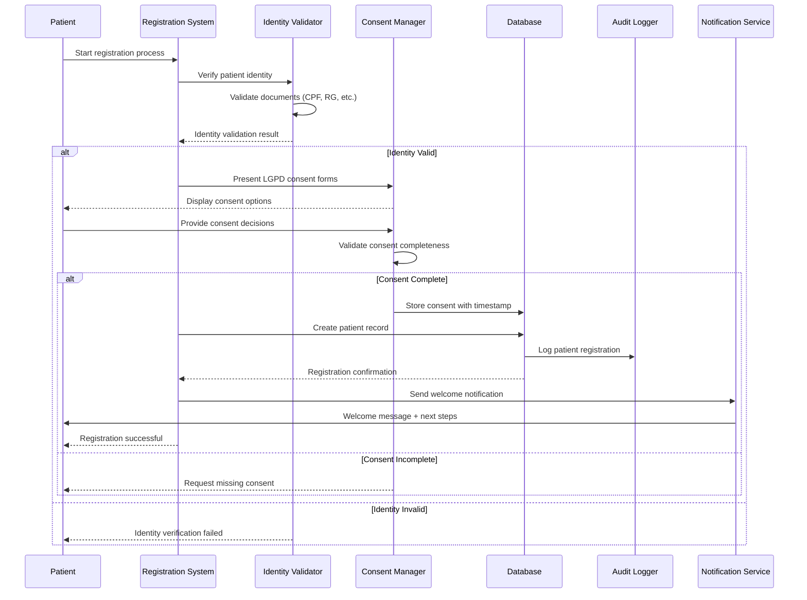
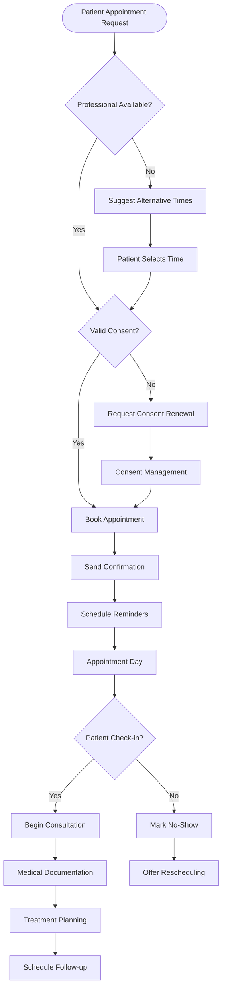
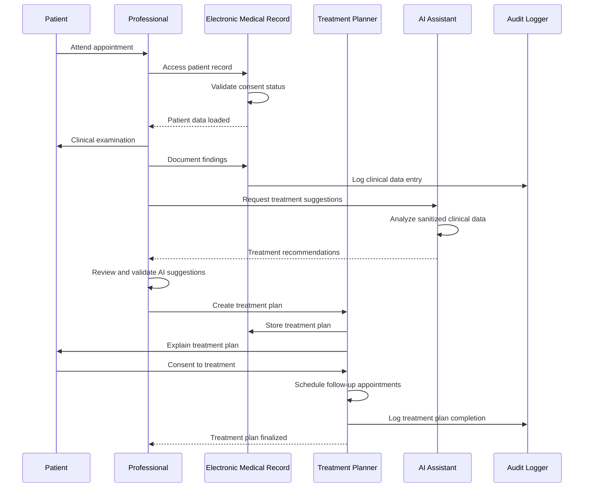
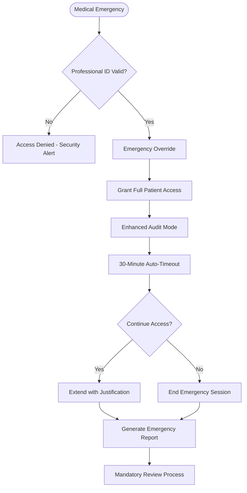

# Healthcare Patient Management Flow

## Purpose & Scope

This flow documents the complete patient management lifecycle within the **NeonPro Healthcare Platform**, covering patient registration, consent management, medical documentation, appointment scheduling, and treatment tracking while ensuring full compliance with Brazilian healthcare regulations.

## Compliance Requirements

- ✅ **LGPD**: Patient data protection and consent management
- ✅ **ANVISA**: Medical device software and patient safety requirements
- ✅ **CFM**: Medical ethics and professional responsibility
- ✅ **Healthcare Standards**: Patient safety and quality care protocols
- ✅ **Audit Trail**: Complete documentation of patient interactions

## Implementation Guidelines

### Phase 1: Patient Registration & Onboarding

1. **Identity Verification**: Validate patient identity using official documents
2. **LGPD Consent Collection**: Obtain explicit consent for data processing
3. **Medical History Collection**: Gather relevant medical background information
4. **Clinic Association**: Associate patient with appropriate clinic and professionals

### Phase 2: Medical Documentation & Records

1. **Medical Record Creation**: Establish comprehensive patient medical record
2. **Professional Assignment**: Link patient to primary care professionals
3. **Medical History Documentation**: Record existing conditions and treatments
4. **Insurance Integration**: Connect with health insurance information if applicable

### Phase 3: Appointment Management

1. **Appointment Scheduling**: Book medical appointments with professionals
2. **Reminder System**: Automated appointment reminders via multiple channels
3. **Preparation Protocols**: Pre-appointment preparation and documentation
4. **No-Show Management**: Handle missed appointments with AI prediction assistance

### Phase 4: Treatment & Care Delivery

1. **Clinical Documentation**: Real-time medical documentation during consultations
2. **Treatment Planning**: Collaborative treatment plan development
3. **Progress Tracking**: Monitor patient progress and treatment effectiveness
4. **Care Coordination**: Multi-professional care coordination when needed

## Patient Registration Flow

## Medical Appointment Flow

## Patient Treatment Workflow

## Emergency Access Protocol

## Error Handling

### Patient Registration Errors

- **Duplicate Registration**:
  - Detection: Check existing patient records by CPF/documents
  - Action: Offer account recovery or profile merge
  - Audit: Log duplicate registration attempt

- **Identity Verification Failure**:
  - Fallback: Manual verification process
  - Alternative: In-person verification at clinic
  - Security: Flag suspicious registration attempts

- **Consent Issues**:
  - Incomplete Consent: Block registration until complete
  - Consent Withdrawal: Immediate data processing halt
  - Expired Consent: Automatic reminder and renewal process

### Appointment Scheduling Errors

- **Double Booking**:
  - Prevention: Real-time availability checking
  - Resolution: Offer alternative times immediately
  - Notification: Alert both patients affected

- **Professional Unavailability**:
  - Alternative: Suggest other qualified professionals
  - Rescheduling: Automatic rescheduling with patient approval
  - Notification: Advance notice with explanation

### Medical Record Errors

- **Data Integrity Issues**:
  - Validation: Real-time data validation during entry
  - Backup: Automatic backup before critical changes
  - Recovery: Point-in-time recovery for corrupted records

- **Access Violations**:
  - Prevention: Role-based access control enforcement
  - Detection: Real-time access pattern monitoring
  - Response: Immediate access revocation and security alert

## Security & Audit

### Patient Data Protection

- **Encryption**: All patient data encrypted at rest and in transit
- **Access Control**: Role-based access with clinic-based isolation
- **Audit Trail**: Complete logging of all patient data access and modifications
- **Data Minimization**: Only collect and process necessary patient data

### Professional Oversight

- **Medical Decisions**: All treatment decisions require professional validation
- **Clinical Documentation**: Professional responsibility for all medical records
- **Quality Assurance**: Regular review of clinical documentation quality
- **Continuing Education**: Integration with professional development requirements

### Patient Safety Measures

- **Allergy Alerts**: Automatic alerts for known patient allergies
- **Drug Interactions**: Real-time medication interaction checking
- **Critical Values**: Immediate alerts for critical lab values or vital signs
- **Emergency Protocols**: Clear emergency access and notification procedures

## Performance Considerations

### Target Metrics

- **Registration Time**: < 5 minutes for new patient registration
- **Record Access**: < 2 seconds to load patient records
- **Appointment Booking**: < 30 seconds for appointment scheduling
- **Documentation**: Real-time sync of clinical documentation

### Optimization Strategies

- **Caching**: Frequently accessed patient data cached with 5-minute TTL
- **Prefetching**: Preload patient data for scheduled appointments
- **Batch Processing**: Group similar operations for efficiency
- **Edge Caching**: Cache static patient information at edge locations

## Integration Points

### External Healthcare Systems

- **Laboratory Systems**: Integration with diagnostic lab systems
- **Imaging Systems**: PACS integration for medical imaging
- **Pharmacy Systems**: Electronic prescription integration
- **Insurance Systems**: Real-time insurance verification and claims

### Internal Services

- **Consent Management**: LGPD compliance service integration
- **Notification Service**: Multi-channel patient communication
- **Analytics Service**: Patient care quality metrics and reporting
- **AI Services**: Clinical decision support and predictive analytics

## Patient Communication Workflows

### Appointment Reminders

- **24-Hour Reminder**: SMS + Email reminder with appointment details
- **2-Hour Reminder**: Final reminder with check-in instructions
- **Post-Appointment**: Follow-up message with treatment summary
- **Emergency Notifications**: Immediate alerts for urgent medical situations

### Treatment Communication

- **Treatment Plans**: Clear explanation of treatment goals and timeline
- **Progress Updates**: Regular updates on treatment progress
- **Educational Content**: Patient education materials related to conditions
- **Care Instructions**: Post-treatment care instructions and precautions

## Quality Assurance

### Clinical Quality Metrics

- **Documentation Completeness**: Percentage of complete medical records
- **Treatment Adherence**: Patient compliance with treatment plans
- **Outcome Tracking**: Treatment effectiveness and patient satisfaction
- **Safety Incidents**: Tracking and analysis of patient safety events

### Continuous Improvement

- **Patient Feedback**: Regular collection of patient experience feedback
- **Professional Input**: Clinician suggestions for workflow improvements
- **Data Analysis**: Continuous analysis of patient care patterns
- **Best Practices**: Integration of latest healthcare best practices

## Notes

- All patient interactions follow patient-centered care principles
- Emergency protocols override normal access restrictions with enhanced audit
- AI assistance enhances but never replaces professional medical judgment
- Multi-professional care coordination supported through shared patient records
- Integration with external healthcare systems maintains data consistency

## Related Flows

- [`main-flow.md`](./main-flow.md) - Integration with main application workflow
- [`auth-flow.md`](./auth-flow.md) - Professional authentication for patient access
- [`ai-flow.md`](./ai-flow.md) - AI assistance in patient care workflows
- [`compliance-lgpd-flow.md`](./compliance-lgpd-flow.md) - LGPD compliance for patient data
