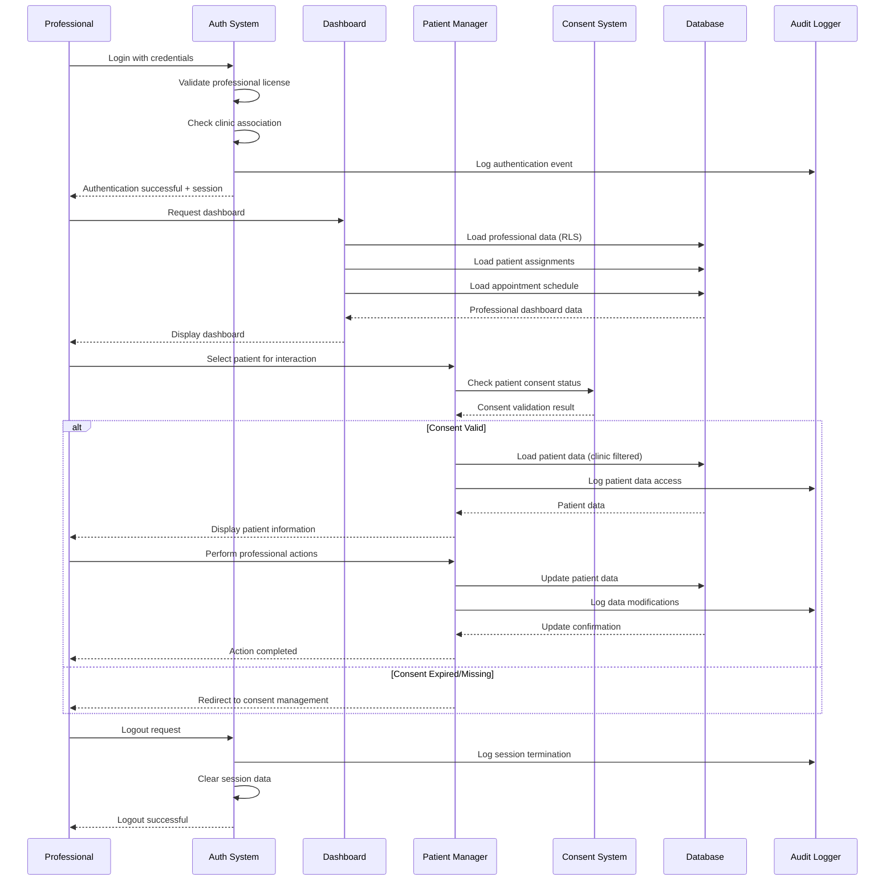
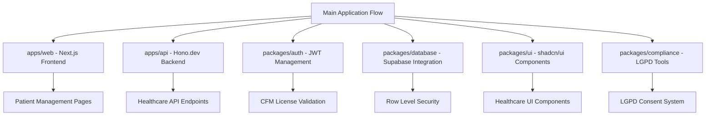

# Main Application Flow

## Purpose & Scope

This flow documents the primary user journey in the **NeonPro Healthcare Platform**, covering the complete workflow from professional login to patient interaction completion. This is the core flow that all healthcare professionals follow when using the system.

## Compliance Requirements

- ✅ **LGPD**: Patient data access requires explicit consent validation
- ✅ **ANVISA**: Professional license validation for healthcare data access
- ✅ **CFM**: Medical ethics compliance and professional responsibility tracking
- ✅ **Audit Trail**: Complete logging of all professional activities

## Implementation Guidelines

### Phase 1: Professional Authentication
1. **Professional Login**: Validate credentials and professional license
2. **Clinic Selection**: Associate session with specific clinic context
3. **Permission Validation**: Verify role-based access permissions
4. **Session Setup**: Initialize secure session with audit context

### Phase 2: Dashboard & Navigation
1. **Dashboard Loading**: Display personalized professional dashboard
2. **Patient Overview**: Show assigned patients with compliance status
3. **Appointment Summary**: Display daily/weekly appointment schedule
4. **Notification Center**: Show urgent notifications and alerts

### Phase 3: Patient Interaction
1. **Patient Selection**: Choose patient from assigned list or search
2. **Consent Validation**: Verify active LGPD consent before data access
3. **Data Access**: Load patient data with clinic-based RLS filtering
4. **Professional Actions**: Perform medical documentation, scheduling, etc.

### Phase 4: Completion & Audit
1. **Data Updates**: Save all professional actions and modifications
2. **Audit Logging**: Record all activities for compliance purposes
3. **Session Cleanup**: Secure session termination with audit trail
4. **Compliance Validation**: Final validation of all regulatory requirements

## Mermaid Diagram

## Error Handling

### Authentication Errors
- **Invalid Credentials**: Show error message, allow retry
- **License Expired**: Redirect to license renewal process
- **Clinic Access Denied**: Contact administrator message

### Data Access Errors
- **Consent Required**: Redirect to consent management workflow
- **Network Timeout**: Show offline mode with limited functionality
- **Permission Denied**: Log security event, show access denied message

### System Errors
- **Database Unavailable**: Show maintenance mode message
- **Session Expired**: Auto-redirect to login with context preservation
- **Audit Log Failure**: Block sensitive operations until logging restored

## Security & Audit

### Data Protection
- All patient data access requires active LGPD consent
- Professional actions logged with timestamp and purpose
- Sensitive data encrypted in transit and at rest
- Multi-tenant isolation via clinic-based RLS

### Audit Requirements
- **Professional Activities**: Login/logout, patient access, data modifications
- **Consent Events**: Consent validation, expiration notifications
- **Security Events**: Failed logins, unauthorized access attempts
- **System Events**: Errors, performance issues, maintenance activities

### Professional Oversight
- All clinical actions require professional validation
- AI-generated insights require human review before use
- Emergency access procedures with enhanced audit trail
- Professional responsibility tracking for CFM compliance

## Performance Considerations

### Target Metrics
- **Authentication**: < 2 seconds
- **Dashboard Load**: < 3 seconds
- **Patient Data Access**: < 1 second
- **Data Updates**: < 500ms

### Optimization Strategies
- Dashboard data caching with 5-minute TTL
- Patient data preloading for assigned patients
- Lazy loading for non-critical dashboard components
- Edge caching for static professional data

## Integration Points

### External Systems
- **Professional License Validation**: CFM integration
- **Consent Management**: LGPD compliance service
- **Audit Service**: Centralized logging platform
- **Notification System**: SMS/Email/Push notifications

### Internal Services
- **Authentication Service**: JWT-based session management
- **Database Layer**: Supabase with RLS policies
- **AI Services**: Healthcare intelligence with PHI sanitization
- **Monitoring**: Real-time performance and error tracking

## Notes

- This flow serves as the foundation for all specialized healthcare flows
- Emergency access procedures bypass normal consent validation with enhanced logging
- AI features integrate seamlessly but require professional oversight
- All timestamps use UTC with timezone conversion for professional interface
- Mobile and web interfaces follow the same logical flow with UI adaptations

## Architecture Integration

### **System Architecture References**
This flow integrates with the following architectural components:

- **[📁 Source Tree](../architecture/source-tree.md)**: Complete package and app structure
- **[🏗️ Tech Stack](../architecture/tech-stack.md)**: Technology choices and versions  
- **[🎯 Architecture Overview](../architecture.md)**: System design and compliance requirements
- **[📋 Coding Standards](../architecture/coding-standards.md)**: Implementation guidelines

### **Implementation Mapping**

### **Performance Targets**
Aligned with architecture performance requirements:
- **Next.js App Loading**: < 3s (architecture target: < 2s)
- **API Response Time**: < 200ms (architecture requirement)
- **Database Queries**: < 100ms (RLS-optimized)
- **Authentication**: < 2s (CFM validation included)

## Related Flows

- [`auth-flow.md`](./auth-flow.md) - Detailed authentication processes
- [`healthcare-patient-flow.md`](./healthcare-patient-flow.md) - Patient-specific workflows
- [`compliance-lgpd-flow.md`](./compliance-lgpd-flow.md) - LGPD compliance workflows
- [`ai-flow.md`](./ai-flow.md) - AI integration patterns