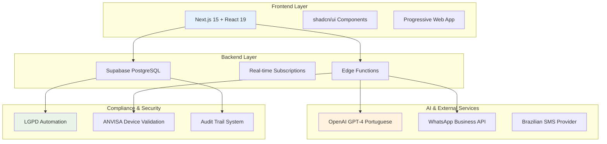
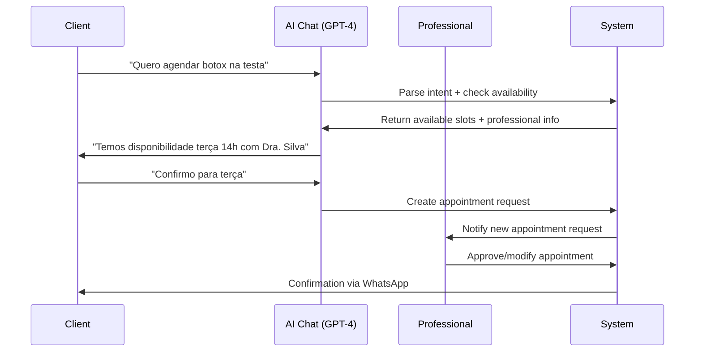
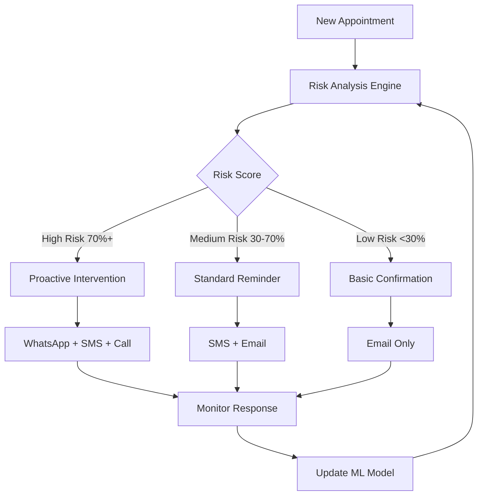
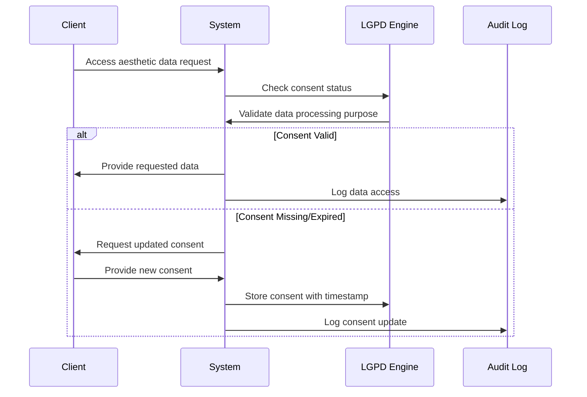

# NeonPro Architecture - Version: 1.0.0

## Overview

Complete system architecture for **NeonPro AI-First Advanced Aesthetic Platform** - Brazilian aesthetic clinic management system with intelligent features and regulatory compliance.

**Target Audience**: Developers implementing aesthetic clinic management systems
**Focus**: Brazilian aesthetic clinics (botox, fillers, facial harmonization, laser treatments)
**Professionals**: All aesthetic healthcare professionals (dermatologists, aestheticians, nurses, etc.)
**Compliance**: LGPD, ANVISA with Portuguese optimization

## Prerequisites

- Understanding of Brazilian aesthetic clinic operations
- Knowledge of LGPD data protection requirements
- Familiarity with aesthetic procedures and equipment regulations
- Basic Next.js + React + TypeScript development experience
- Understanding of Supabase PostgreSQL and real-time features

## Quick Start

### System Architecture Overview


## Core Architecture

### Technology Stack

**Frontend (Next.js 15)**:
- **Framework**: Next.js 15 with App Router + React 19
- **UI Library**: shadcn/ui components + Tailwind CSS
- **State Management**: React Server Components + Zustand for client state
- **Mobile**: Progressive Web App (PWA) with offline support
- **Language**: TypeScript with strict type checking

**Backend (Supabase)**:
- **Database**: PostgreSQL with Row Level Security (RLS)
- **Authentication**: Supabase Auth with role-based access
- **Real-time**: WebSocket subscriptions for live updates
- **Functions**: Edge Functions with Deno runtime
- **Storage**: File storage for procedure images and documents

**AI Integration**:
- **LLM**: OpenAI GPT-4 optimized for Brazilian Portuguese
- **Use Cases**: Natural language appointment scheduling, FAQ automation
- **Processing**: Streaming responses for real-time chat experience

**External Integrations**:
- **Communication**: WhatsApp Business API + Brazilian SMS providers
- **Compliance**: ANVISA API for equipment validation
- **Analytics**: Custom analytics with LGPD compliance

### Monorepo Structure

```typescript
neonpro/
├── apps/
│   ├── web/                    # Next.js aesthetic clinic interface
│   ├── api/                    # Supabase Edge Functions
│   └── docs/                   # Documentation site
├── packages/
│   ├── ui/                     # shadcn/ui aesthetic components
│   ├── database/               # Supabase schemas & types
│   ├── ai/                     # OpenAI integration utilities
│   ├── auth/                   # Authentication & authorization
│   ├── compliance/             # LGPD/ANVISA compliance utils
│   ├── shared/                 # Common utilities
│   ├── types/                  # TypeScript definitions
│   └── utils/                  # Helper functions
└── scripts/                    # Build and deployment scripts
```

## Platform Flows

### 1. Universal AI Chat Flow (Portuguese)

**Purpose**: Natural language interaction for appointment scheduling and aesthetic procedure inquiries



**Key Features**:
- Brazilian Portuguese natural conversation
- Aesthetic procedure recognition (botox, preenchimento, harmonização, laser)
- Automatic professional assignment based on specialization
- WhatsApp integration for confirmations

### 2. Anti-No-Show Engine Flow

**Purpose**: Predictive analytics to prevent appointment cancellations and optimize clinic capacity



**Implementation**:
```typescript
interface NoShowPrediction {
  appointmentId: string;
  clientId: string;
  riskScore: number;        // 0-100 percentage
  interventions: {
    whatsapp: boolean;
    sms: boolean;
    call: boolean;
    earlyReminder: boolean;
  };
  predictedNoShow: boolean;
}
```

### 3. LGPD Compliance Flow

**Purpose**: Automated data protection compliance for aesthetic clinic operations



## Professional Authentication

### Aesthetic Healthcare Professionals

**Supported Professional Types**:
- Dermatologists (medical doctors)
- Certified aestheticians
- Registered nurses specializing in aesthetics
- Licensed cosmetologists
- Other qualified aesthetic professionals

```typescript
interface AestheticProfessional {
  id: string;
  name: string;
  email: string;
  professionalType: 'dermatologist' | 'aesthetician' | 'nurse' | 'cosmetologist' | 'other';
  licenseNumber?: string;        // Professional license (when applicable)
  specializations: string[];     // ['botox', 'fillers', 'laser', 'peeling']
  clinicId: string;
  isActive: boolean;
  certifications: {
    name: string;
    issuer: string;
    validUntil: Date;
  }[];
}
```

**Role-Based Access Control**:
```typescript
const professionalPermissions = {
  'dermatologist': ['all_procedures', 'prescriptions', 'medical_history'],
  'aesthetician': ['basic_procedures', 'skincare', 'non_invasive'],
  'nurse': ['injections', 'laser', 'medical_support'],
  'cosmetologist': ['skincare', 'basic_treatments', 'consultations']
};
```

## Database Schema

### Core Tables

```sql
-- Aesthetic clients (LGPD compliant)
CREATE TABLE aesthetic_clients (
  id UUID PRIMARY KEY DEFAULT gen_random_uuid(),
  name VARCHAR(255) NOT NULL,
  email VARCHAR(255),
  phone VARCHAR(20),
  cpf_hash VARCHAR(64), -- Hashed CPF for privacy
  birth_date DATE,
  aesthetic_history JSONB,
  lgpd_consent JSONB NOT NULL,
  created_at TIMESTAMP DEFAULT NOW(),
  updated_at TIMESTAMP DEFAULT NOW()
);

-- Aesthetic professionals
CREATE TABLE aesthetic_professionals (
  id UUID PRIMARY KEY DEFAULT gen_random_uuid(),
  name VARCHAR(255) NOT NULL,
  email VARCHAR(255) UNIQUE NOT NULL,
  professional_type VARCHAR(50) NOT NULL,
  license_number VARCHAR(50),
  specializations TEXT[],
  clinic_id UUID NOT NULL,
  is_active BOOLEAN DEFAULT true,
  created_at TIMESTAMP DEFAULT NOW()
);

-- Appointments for aesthetic procedures
CREATE TABLE aesthetic_appointments (
  id UUID PRIMARY KEY DEFAULT gen_random_uuid(),
  client_id UUID REFERENCES aesthetic_clients(id),
  professional_id UUID REFERENCES aesthetic_professionals(id),
  procedure_type VARCHAR(100) NOT NULL,
  procedure_area VARCHAR(100),
  scheduled_at TIMESTAMP NOT NULL,
  duration_minutes INTEGER DEFAULT 60,
  status VARCHAR(50) DEFAULT 'scheduled',
  no_show_risk_score FLOAT DEFAULT 0,
  notes TEXT,
  created_at TIMESTAMP DEFAULT NOW()
);

-- AI chat sessions
CREATE TABLE ai_chat_sessions (
  id UUID PRIMARY KEY DEFAULT gen_random_uuid(),
  client_id UUID REFERENCES aesthetic_clients(id),
  professional_id UUID REFERENCES aesthetic_professionals(id),
  status VARCHAR(50) DEFAULT 'active',
  language VARCHAR(10) DEFAULT 'pt-BR',
  created_at TIMESTAMP DEFAULT NOW()
);

-- LGPD audit trail
CREATE TABLE lgpd_audit_log (
  id UUID PRIMARY KEY DEFAULT gen_random_uuid(),
  client_id UUID REFERENCES aesthetic_clients(id),
  professional_id UUID REFERENCES aesthetic_professionals(id),
  action_type VARCHAR(50) NOT NULL,
  data_accessed JSONB,
  purpose VARCHAR(255),
  timestamp TIMESTAMP DEFAULT NOW(),
  ip_address INET,
  user_agent TEXT
);
```

### Row Level Security (RLS) Policies

```sql
-- Clients can only see their own data
CREATE POLICY "clients_own_data" ON aesthetic_clients
  FOR ALL TO authenticated
  USING (auth.uid()::text = id::text);

-- Professionals can access clients in their clinic
CREATE POLICY "professionals_clinic_access" ON aesthetic_clients
  FOR SELECT TO authenticated
  USING (
    EXISTS (
      SELECT 1 FROM aesthetic_professionals 
      WHERE user_id = auth.uid() 
      AND clinic_id = (SELECT clinic_id FROM aesthetic_appointments WHERE client_id = aesthetic_clients.id LIMIT 1)
    )
  );
```

## Implementation Phases

### Fase 1: Fundação (4-6 semanas)
**Objetivo**: Establish solid foundation with optimized performance

**Deliverables**:
- Next.js 15 architecture with mobile-first design
- Professional authentication and authorization system
- Basic client and appointment CRUD operations
- Responsive interface with shadcn/ui components
- Basic LGPD compliance implementation
- Core database schema with RLS policies

### Fase 2: Arquitetura Inteligente (6-8 semanas)  
**Objetivo**: Prepare intelligent infrastructure for AI and integrations

**Deliverables**:
- Data pipeline for analytics and ML predictions
- WhatsApp Business API and SMS integration
- Intelligent notification system
- Basic dashboard with operational metrics
- Knowledge base preparation for AI training
- Anti-no-show prediction model foundation

### Fase 3: Integração de IA (8-12 semanas)
**Objetivo**: Implement advanced AI-powered features

**Deliverables**:
- Universal AI Chat with GPT-4 Portuguese optimization
- Anti-No-Show Engine with machine learning
- Administrative process automation
- Predictive insights and advanced reporting
- User feedback-based refinement and optimization

## Security & Compliance

### LGPD (Brazilian Data Protection)
- **Granular Consent Management**: Separate consent for different data processing purposes
- **Data Minimization**: Collect only necessary information for aesthetic treatments
- **Right to Deletion**: Automated data erasure after legal retention period
- **Audit Trail**: Complete logging of data access and modifications
- **Data Portability**: Export client data in structured format

### ANVISA (Medical Device Compliance)  
- **Equipment Registration**: Validation of aesthetic device registration numbers
- **Safety Protocol Integration**: Implementation of mandatory safety procedures
- **Adverse Event Reporting**: Automated reporting system for treatment complications
- **Device Maintenance Tracking**: Monitoring of calibration and maintenance schedules

### Professional Standards
- **License Verification**: Professional credential validation when applicable
- **Specialization Matching**: Procedure authorization based on professional qualifications
- **Continuing Education**: Optional tracking of professional development requirements
- **Insurance Validation**: Professional liability insurance verification

### WCAG 2.1 AA (Web Accessibility)
- **Keyboard Navigation**: Full system accessibility via keyboard
- **Screen Reader Optimization**: Portuguese language support with proper ARIA labels
- **Color Contrast**: 4.5:1 minimum for text, 3:1 for UI components  
- **Touch Targets**: Minimum 44px for interactive elements
- **Focus Management**: Visible focus indicators throughout interface

## Examples

### AI Chat Integration
```typescript
// ✅ Portuguese AI Chat for Aesthetic Procedures
export async function handleAestheticChat(message: string, clientId: string) {
  const response = await openai.chat.completions.create({
    model: "gpt-4",
    messages: [
      {
        role: "system",
        content: `Você é assistente especializado em clínica estética brasileira.
        Procedimentos: botox, preenchimento facial, harmonização orofacial, depilação laser.
        Use português brasileiro natural e profissional.
        Foque em agendamentos e informações sobre tratamentos estéticos.`
      },
      { role: "user", content: message }
    ],
    temperature: 0.3
  });

  return {
    reply: response.choices[0].message.content,
    suggestedActions: parseAestheticActions(message),
    language: 'pt-BR'
  };
}
```

### Professional Authentication
```typescript
// ✅ Generic Aesthetic Professional Authentication
export async function authenticateProfessional(credentials: {
  email: string;
  password: string;
}) {
  const { data: user } = await supabase.auth.signInWithPassword(credentials);
  
  if (user) {
    const { data: professional } = await supabase
      .from('aesthetic_professionals')
      .select('*')
      .eq('user_id', user.user.id)
      .single();
      
    return {
      user,
      professional,
      permissions: getProfessionalPermissions(professional.professional_type)
    };
  }
  
  throw new Error('Invalid credentials');
}
```

## Troubleshooting

### Common Issues

**Authentication Problems**:
- **Issue**: Professional login fails → **Solution**: Verify professional record exists and is active
- **Issue**: Permission denied → **Solution**: Check professional type and specialization requirements

**AI Chat Issues**:
- **Issue**: Portuguese responses not natural → **Solution**: Update system prompt with Brazilian aesthetic terminology
- **Issue**: Procedure not recognized → **Solution**: Add procedure to AI training context and specialization database

**LGPD Compliance**:
- **Issue**: Consent validation failing → **Solution**: Check consent version and client consent timestamp
- **Issue**: Data export not working → **Solution**: Verify client permissions and data retention policies

**Performance Issues**:
- **Issue**: Slow AI responses → **Solution**: Implement response caching and optimize prompts
- **Issue**: Database queries slow → **Solution**: Check RLS policies and database indexes
- **Issue**: Real-time updates delayed → **Solution**: Verify Supabase subscription configuration

**Accessibility Issues**:
- **Issue**: Screen reader not working → **Solution**: Add proper ARIA labels with lang="pt-BR"
- **Issue**: Keyboard navigation broken → **Solution**: Check focus management and tabindex values
- **Issue**: Touch targets too small → **Solution**: Ensure minimum 44px height and width

## Related Documentation

- [`docs/prd.md`](prd.md) - Complete product requirements for aesthetic platform
- [`docs/accessibility/accessibility-standards.md`](accessibility/accessibility-standards.md) - WCAG 2.1 AA implementation
- [`docs/app-flows/aesthetic-platform-flows.md`](app-flows/aesthetic-platform-flows.md) - Detailed workflow documentation
- [`docs/architecture/tech-stack.md`](architecture/tech-stack.md) - Technology stack details
- [`.ruler/agents/apex-dev.md`](../.ruler/agents/apex-dev.md) - Development principles

---

**Architecture Stack**: Next.js 15 + Supabase + OpenAI GPT-4 + shadcn/ui  
**Quality Validated**: ✅ 9.5/10 KISS + YAGNI + Constitutional Principles Applied  
**Target Market**: Brazilian Aesthetic Clinics with All Professional Types  
**Status**: Ready for Implementation