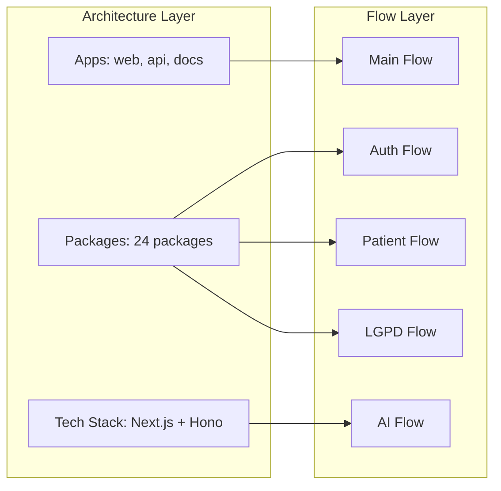
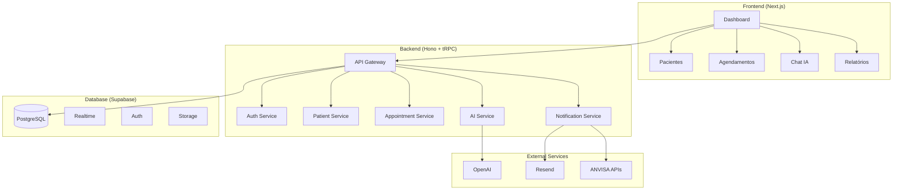
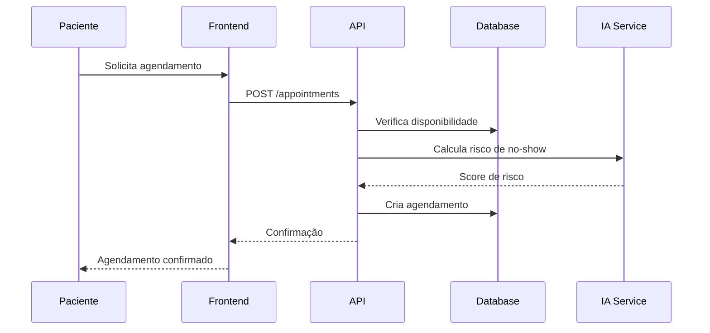
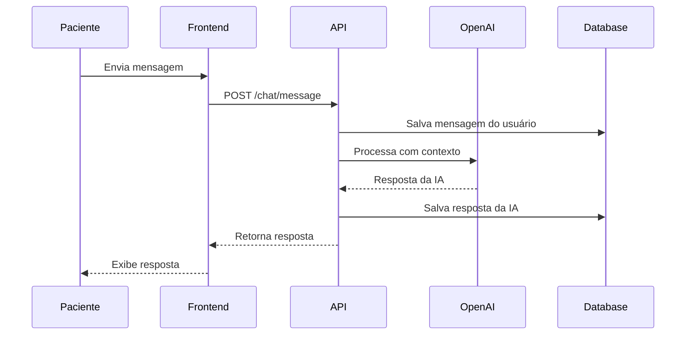

# 🏗️ NeonPro AI Advanced Aesthetic Platform - System Architecture

> **AI-First Advanced Aesthetic Platform for Brazilian aesthetic clinics with constitutional excellence and regulatory compliance**

## 📋 Visão Geral

**NeonPro** é uma plataforma completa de gestão AI-First para clínicas de estética avançada no Brasil, focada em:

- **Gestão de Pacientes**: Cadastro, histórico estético, agendamentos para procedimentos de estética avançada
- **Compliance Automatizado**: LGPD, ANVISA e CFM integrados para estética avançada
- **IA Integrada**: Chat inteligente e predição de no-show específico para estética
- **Experiência Otimizada**: Interface moderna e intuitiva para profissionais da estética avançada

## 🎯 Objetivos Atuais (Tier 1)

### Funcionalidades Essenciais

```typescript
const coreFeatures = {
  patients: "CRUD completo + histórico estético avançado",
  appointments: "Agendamento + calendário + notificações para procedimentos estéticos",
  professionals: "Gestão de profissionais + especialidades em estética avançada",
  aiChat: "FAQ inteligente + suporte automatizado para estética",
  noShowPrediction: "ML para reduzir faltas em consultas estéticas",
  lgpdCompliance: "Automatização de compliance LGPD para clínicas estéticas",
};
```

## 🔄 Application Flow Integration

### **Workflow Documentation**

A arquitetura do NeonPro é complementada por documentação detalhada de fluxos de aplicação que mostram como os componentes interagem em cenários reais:

- **[📋 Main Flow](./app-flows/main-flow.md)**: Fluxo principal da aplicação - jornada completa do profissional
- **[🔐 Auth Flow](./app-flows/auth-flow.md)**: Autenticação e autorização com validação CFM
- **[🏥 Patient Flow](./app-flows/healthcare-patient-flow.md)**: Gestão completa do ciclo de vida do paciente de estética avançada
- **[🤖 AI Flow](./app-flows/ai-flow.md)**: Integração IA com proteção PHI e supervisão profissional
- **[⚖️ LGPD Flow](./app-flows/compliance-lgpd-flow.md)**: Compliance LGPD e proteção de dados

### **Architecture-Flow Mapping**



### **Compliance Integration**

Os fluxos documentados implementam os requisitos de compliance definidos na arquitetura:

- **LGPD**: [`compliance-lgpd-flow.md`](./app-flows/compliance-lgpd-flow.md) detalha implementação completa
- **ANVISA**: Workflows de segurança médica integrados nos fluxos de paciente
- **CFM**: Supervisão profissional documentada no fluxo de autenticação

### Documentation References

- Tech stack: docs/architecture/tech-stack.md
- Application flows: docs/app-flows/ (Mermaid diagrams), docs/app-flows.md (guidelines)
- Database schema: docs/database-schema.md
- API documentation: docs/apis/apis.md
- Design guidelines: docs/architecture/design-guidelines.md
- Testing workflow: docs/ttd-flow.md
- Configuration: docs/variables-configuration.md

### Métricas de Sucesso

- **Redução de No-Show**: > 15%
- **Eficiência da Equipe**: > 20%
- **Satisfação do Paciente**: > 80%
- **Compliance**: 100% LGPD + ANVISA

## 🛠️ Stack Tecnológico

### Frontend

- **Next.js 15**: App Router + React Server Components
- **TypeScript**: Type safety completo
- **Tailwind CSS**: Styling utilitário
- **shadcn/ui**: Biblioteca de componentes
- **Framer Motion**: Animações e transições

### Backend

- **Hono.dev**: Framework web moderno e rápido
- **tRPC**: Type-safe APIs
- **Supabase**: Database + Auth + Realtime
- **PostgreSQL**: Database principal

### AI & Integrações

- **OpenAI GPT-4**: Chat inteligente
- **Vercel AI SDK**: Integração de IA
- **Supabase Vector**: Embeddings e busca semântica
- **Resend**: Email transacional

### DevOps & Monitoramento

- **Vercel**: Deploy e hosting
- **Sentry**: Error tracking
- **Turborepo**: Monorepo management
- **PNPM**: Package management

## 🏗️ Arquitetura de Alto Nível



## 🔐 Segurança & Compliance

### LGPD (Lei Geral de Proteção de Dados)

```typescript
const lgpdCompliance = {
  dataMinimization: "Coleta apenas dados necessários",
  consentManagement: "Controle granular de consentimentos",
  rightToForget: "Exclusão automática de dados",
  dataPortability: "Export completo em JSON",
  auditTrail: "Log completo de todas as operações",
  encryption: "Dados sensíveis criptografados",
};
```

### ANVISA Integration

```typescript
const anvisaCompliance = {
  procedureLogging: "Log automático de procedimentos",
  deviceTracking: "Rastreamento de equipamentos",
  adverseEvents: "Notificação automática de eventos",
  documentation: "Assinatura digital + timestamp",
};
```

## 🤖 Funcionalidades de IA

### Chat Inteligente

```typescript
const aiChatFeatures = {
  faqAutomation: "Respostas automáticas para dúvidas comuns",
  appointmentBooking: "Agendamento via chat",
  procedureInfo: "Informações sobre procedimentos",
  postCareGuidance: "Orientações pós-procedimento",
  emergencyDetection: "Detecção de situações de emergência",
};
```

### Predição de No-Show

```typescript
const noShowPrediction = {
  riskFactors: [
    "Histórico de faltas",
    "Tempo desde último agendamento",
    "Tipo de procedimento",
    "Dia da semana",
    "Condições climáticas",
    "Distância da clínica",
  ],
  actions: {
    highRisk: "Ligação de confirmação automática",
    mediumRisk: "SMS de lembrete",
    lowRisk: "Email de confirmação",
  },
};
```

## 📊 Schema do Banco de Dados

### Tabelas Principais

```sql
-- Pacientes
CREATE TABLE patients (
  id UUID PRIMARY KEY,
  name VARCHAR NOT NULL,
  email VARCHAR UNIQUE,
  phone VARCHAR,
  cpf VARCHAR UNIQUE,
  birth_date DATE,
  medical_history JSONB,
  lgpd_consent JSONB,
  created_at TIMESTAMP DEFAULT NOW()
);

-- Agendamentos
CREATE TABLE appointments (
  id UUID PRIMARY KEY,
  patient_id UUID REFERENCES patients(id),
  professional_id UUID REFERENCES professionals(id),
  procedure_type VARCHAR NOT NULL,
  scheduled_at TIMESTAMP NOT NULL,
  status VARCHAR DEFAULT 'scheduled',
  no_show_risk_score FLOAT,
  created_at TIMESTAMP DEFAULT NOW()
);

-- Sessões de Chat
CREATE TABLE chat_sessions (
  id UUID PRIMARY KEY,
  patient_id UUID REFERENCES patients(id),
  status VARCHAR DEFAULT 'active',
  created_at TIMESTAMP DEFAULT NOW()
);

-- Mensagens do Chat
CREATE TABLE chat_messages (
  id UUID PRIMARY KEY,
  session_id UUID REFERENCES chat_sessions(id),
  content TEXT NOT NULL,
  role VARCHAR NOT NULL, -- 'user' | 'assistant'
  created_at TIMESTAMP DEFAULT NOW()
);
```

## 🔄 Fluxos de Dados Principais

### 1. Agendamento de Consulta



### 2. Chat com IA



## 🚀 Deploy & Performance

### Estratégia de Deploy

```typescript
const deploymentStrategy = {
  frontend: "Vercel (Edge Functions + CDN global)",
  backend: "Vercel Serverless Functions",
  database: "Supabase (PostgreSQL gerenciado)",
  monitoring: "Sentry + Vercel Analytics",
  cdn: "Vercel Edge Network",
};
```

---

> **Princípios de Desenvolvimento**: KISS (Keep It Simple), YAGNI (You Aren't Gonna Need It), CoT (Chain of Thought)
>
> **Foco**: Funcionalidade sobre perfeição • Simplicidade sobre complexidade • Implementável sobre idealizado
