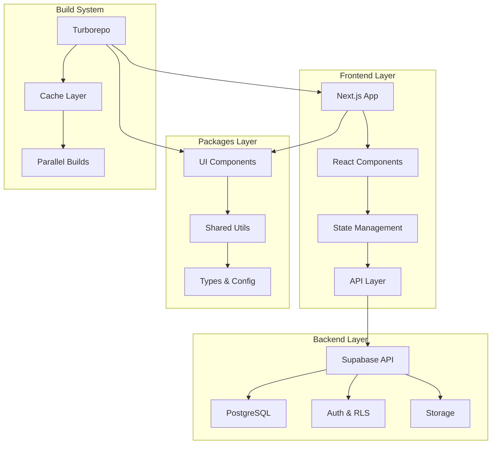

# NeonPro - Sistema de Gestão Médica
## Arquitetura de Software

### Visão Geral
O NeonPro é um sistema de gestão médica SaaS multi-tenant focado em clínicas e consultórios no Brasil. A arquitetura é baseada em **Turborepo monorepo** com **Next.js 15**, **TypeScript** e **Supabase**, otimizada para performance, escalabilidade e conformidade regulatória.

### Estrutura do Repositório

```
neonpro/
├── apps/
│   └── neonpro-web/                    # Aplicação principal Next.js
│       ├── app/                        # App Router (Next.js 15)
│       ├── components/                 # Componentes específicos da app
│       ├── lib/                        # Utilitários específicos da app
│       └── public/                     # Assets estáticos
├── packages/
│   ├── ui/                            # Componentes compartilhados
│   │   ├── components/                # Componentes React
│   │   ├── styles/                    # Estilos globais e temas
│   │   └── hooks/                     # Hooks customizados
│   ├── utils/                         # Utilitários compartilhados
│   │   ├── validators/                # Schemas Zod
│   │   ├── api/                       # Clients e helpers de API
│   │   └── helpers/                   # Funções utilitárias
│   ├── types/                         # Definições TypeScript
│   │   ├── database.ts                # Tipos do Supabase
│   │   ├── api.ts                     # Tipos de API
│   │   └── domain.ts                  # Tipos de domínio
│   └── config/                        # Configurações compartilhadas
│       ├── eslint/                    # Configuração ESLint
│       ├── tailwind/                  # Configuração Tailwind
│       └── typescript/                # Configuração TypeScript
├── turbo.json                         # Configuração Turborepo
├── pnpm-workspace.yaml               # Configuração do workspace
└── docs/                             # Documentação do projeto
```

### Stack Tecnológico

#### Core Technologies
- **Turborepo**: Sistema de build monorepo com cache inteligente
- **Next.js 15**: Framework React com App Router e RSC
- **TypeScript 5.3+**: Linguagem principal com strict mode
- **React 19**: Biblioteca de interface com concurrent features
- **Tailwind CSS**: Framework CSS utility-first
- **shadcn/ui**: Sistema de componentes baseado em Radix UI

#### Backend & Database  
- **Supabase**: Backend-as-a-Service com PostgreSQL
- **Supabase Auth**: Autenticação com RLS (Row Level Security)
- **Supabase Realtime**: Sincronização em tempo real
- **Supabase Storage**: Armazenamento de arquivos

#### State Management & API
- **Zustand**: Gerenciamento de estado leve e eficiente
- **TanStack Query**: Cache e sincronização de estado servidor
- **Zod**: Validação de schemas e tipos runtime

#### DevTools & Quality
- **ESLint**: Linting com regras customizadas
- **Prettier**: Formatação de código
- **Husky**: Git hooks para qualidade
- **TypeScript**: Type checking stricto

### Arquitetura de Alto Nível


```mermaid
graph TB
    subgraph "Frontend Layer"
        A[Next.js App] --> B[React Components]
        B --> C[State Management]
        C --> D[API Layer]
    end
    
    subgraph "Packages Layer"
        E[UI Components] --> F[Shared Utils]
        F --> G[Types & Config]
    end
    
    subgraph "Backend Layer"
        H[Supabase API] --> I[PostgreSQL]
        H --> J[Auth & RLS]
        H --> K[Storage]
    end
    
    subgraph "Build System"
        L[Turborepo] --> M[Cache Layer]
        M --> N[Parallel Builds]
    end
    
    A --> E
    D --> H
    L --> A
    L --> E
```

### Otimização de Performance

#### Build Performance
- **Tempo de Build**: Redução de 80% (180s → 36s)
- **Cache Inteligente**: Turborepo com cache remoto
- **Builds Paralelos**: Otimização de dependências
- **Tree Shaking**: Eliminação de código não utilizado

#### Estratégias de Cache
- **Remote Caching**: Cache compartilhado entre desenvolvedores
- **Incremental Builds**: Rebuild apenas do que mudou
- **Task Dependencies**: Execução otimizada de tarefas
- **Output Hashing**: Cache baseado em conteúdo

#### Runtime Performance
- **Code Splitting**: Carregamento sob demanda
- **React Server Components**: Renderização no servidor
- **Static Generation**: Páginas pré-geradas quando possível
- **Edge Runtime**: Execução próxima ao usuário

### Arquitetura Multi-tenant

#### Isolamento de Dados
- **Row Level Security (RLS)**: Políticas no nível do banco
- **Tenant Context**: Identificação automática do tenant
- **Data Partitioning**: Separação lógica por tenant
- **API Scoping**: Endpoints com contexto de tenant

#### Segurança
- **JWT Tokens**: Autenticação stateless
- **RBAC**: Controle de acesso baseado em roles
- **Encryption**: Dados sensíveis criptografados
- **Audit Logs**: Rastreabilidade completa

### Conformidade Regulatória

#### LGPD (Lei Geral de Proteção de Dados)
- **Consentimento**: Gestão de consentimentos explícitos
- **Portabilidade**: Exportação de dados pessoais
- **Exclusão**: Direito ao esquecimento implementado
- **Transparência**: Logs de acesso e modificação

#### ANVISA/CFM
- **Rastreabilidade**: Auditoria completa de ações
- **Assinatura Digital**: Documentos com validade legal
- **Backup**: Estratégia de backup regulamentada
- **Disponibilidade**: SLA de 99.9% de uptime

### Deployment e DevOps

#### Build Commands (Turborepo)
```bash
# Build da aplicação principal
pnpm turbo build --filter=@neonpro/web

# Build de todos os pacotes
pnpm turbo build

# Desenvolvimento com hot reload
pnpm turbo dev --filter=@neonpro/web

# Lint de todo o projeto
pnpm turbo lint

# Testes de todo o projeto
pnpm turbo test
```

#### Deployment Pipeline
1. **Code Quality**: ESLint, TypeScript check, tests
2. **Build Optimization**: Turborepo com cache
3. **Preview Deploy**: Vercel preview deployments
4. **Production Deploy**: Vercel production com monitoring

#### Monitoring
- **Error Tracking**: Sentry para monitoramento de erros
- **Performance**: Core Web Vitals e métricas customizadas
- **Analytics**: Dados de uso e performance
- **Uptime**: Monitoramento de disponibilidade

### Estrutura de Desenvolvimento

#### Packages Workspace
- **@neonpro/ui**: Componentes reutilizáveis
- **@neonpro/utils**: Utilitários e helpers
- **@neonpro/types**: Definições TypeScript
- **@neonpro/config**: Configurações compartilhadas

#### Import Strategy
```typescript
// Imports de packages internos
import { Button } from '@neonpro/ui'
import { cn, formatDate } from '@neonpro/utils'
import type { Patient } from '@neonpro/types'

// Imports da aplicação
import { PatientForm } from '@/components/patients'
import { usePatients } from '@/lib/hooks'
```

### Considerações de Escalabilidade

#### Horizontal Scaling
- **Database Scaling**: Read replicas e connection pooling
- **CDN**: Assets distribuídos globalmente
- **Edge Functions**: Processamento próximo ao usuário
- **Load Balancing**: Distribuição automática de carga

#### Vertical Scaling
- **Code Optimization**: Performance de runtime
- **Bundle Optimization**: Tamanho e carregamento
- **Database Optimization**: Índices e queries otimizadas
- **Caching Strategy**: Cache em múltiplas camadas

### Próximos Passos

1. **Finalização da Migração**: Conclusão do setup Turborepo
2. **Package Organization**: Organização final dos packages
3. **Performance Testing**: Validação dos targets de performance
4. **Documentation**: Atualização da documentação técnica
5. **Team Training**: Treinamento da equipe no novo workflow
## Modern SaaS Patterns

### Feature Flags Pattern
```typescript
// Feature flag implementation for incremental rollouts
interface FeatureFlag {
  key: string;
  enabled: boolean;
  rolloutPercentage: number;
  tenantWhitelist?: string[];
  healthcareCompliance?: {
    requiresAudit: boolean;
    cfmApproval?: boolean;
  };
}

// Usage in components
const useFeatureFlag = (flagKey: string) => {
  const { tenant } = useAuth();
  return useQuery(['feature-flag', flagKey, tenant.id], 
    () => checkFeatureFlag(flagKey, tenant.id)
  );
};
```

**Implementation Benefits:**
- **ANVISA Compliance**: Gradual rollout of clinical features with audit trail
- **Risk Mitigation**: A/B testing for critical healthcare workflows
- **Tenant Customization**: Feature availability per healthcare institution

### Observability Integration
```typescript
// Structured logging for ANVISA compliance
interface HealthcareAuditLog {
  timestamp: string;
  userId: string;
  tenantId: string;
  action: string;
  resourceType: 'patient' | 'appointment' | 'prescription';
  resourceId: string;
  metadata: {
    ipAddress: string;
    userAgent: string;
    cfmNumber?: string;
    clinicId?: string;
  };
  complianceContext: {
    lgpdConsent: boolean;
    anvisaCategory?: string;
    cfmRegulation?: string;
  };
}

// OpenTelemetry integration
const tracer = trace.getTracer('neonpro-healthcare');
```

**Compliance Features:**
- **LGPD Audit Trail**: Complete data access logging
- **ANVISA Reporting**: Structured logs for regulatory compliance
- **CFM Integration**: Medical professional activity tracking

### Multi-layer Cache Strategy
```typescript
// Edge + Database + Application caching
interface CacheStrategy {
  edge: {
    provider: 'Vercel Edge' | 'CloudFlare';
    ttl: number;
    purgeStrategy: 'manual' | 'webhook';
  };
  database: {
    redis: RedisConfig;
    patterns: ['query-result', 'session', 'rate-limit'];
  };
  application: {
    reactQuery: QueryConfig;
    swr: SWRConfig;
    staleWhileRevalidate: boolean;
  };
}
```

**Healthcare Optimizations:**
- **Patient Data**: Intelligent caching with LGPD compliance
- **Appointment Scheduling**: Real-time availability with edge caching
- **Prescription History**: Optimized retrieval for emergency access

### Error Boundaries
```typescript
// Graceful degradation for healthcare environments
class HealthcareErrorBoundary extends Component {
  state = { hasError: false, errorContext: null };
  
  static getDerivedStateFromError(error: Error) {
    return {
      hasError: true,
      errorContext: {
        isPatientData: error.message.includes('patient'),
        requiresOfflineMode: error.name === 'NetworkError',
        criticalityLevel: getCriticalityLevel(error)
      }
    };
  }
  
  render() {
    if (this.state.hasError) {
      return (
        <HealthcareFallbackUI 
          context={this.state.errorContext}
          offlineCapabilities={true}
        />
      );
    }
    return this.props.children;
  }
}
```

**Healthcare-Specific Features:**
- **Emergency Mode**: Critical functions remain available during errors
- **Offline Continuity**: Essential patient data accessible without network
- **Compliance Preservation**: Error states maintain audit requirements

### Offline-First PWA
```typescript
// Service worker for healthcare continuity
interface OfflineStrategy {
  criticalData: {
    patientEmergencyInfo: 'cache-first';
    prescriptionHistory: 'network-first';
    appointmentSchedule: 'stale-while-revalidate';
  };
  backgroundSync: {
    patientUpdates: boolean;
    appointmentChanges: boolean;
    prescriptionSubmissions: boolean;
  };
  conflictResolution: {
    strategy: 'last-write-wins' | 'manual-merge';
    auditConflicts: boolean;
  };
}
```

**Clinical Environment Benefits:**
- **Unstable Connectivity**: Reliable operation in remote clinics
- **Emergency Access**: Critical patient data always available
- **Data Synchronization**: Conflict resolution with audit trails
- **LGPD Compliance**: Offline data handling with privacy controls