# NeonPro Aesthetic Platform Flows - Version: 3.0.0

> See also: [Docs Orchestrator](../AGENTS.md) · [Coding Standards](../rules/coding-standards.md) · [Memory](../memory.md)

> Note: Code blocks here are illustrative (pseudo-code) to show contracts and flows; they are not necessarily complete/compilable.

## Overview

Comprehensive workflow documentation for **NeonPro AI-First Platform** - Brazilian aesthetic clinic management system with intelligent scheduling, patient management, and compliance automation.

**Target Audience**: Developers implementing aesthetic clinic workflows
**Focus**: Brazilian clinics specializing in botox, fillers, facial harmonization, laser treatments
**Compliance**: LGPD, ANVISA, CFM with Portuguese optimization
**Platform Type**: SaaS web application with mobile-responsive design

## Prerequisites

- Understanding of Brazilian aesthetic clinic operations
- Knowledge of LGPD data protection requirements
- Familiarity with CFM professional oversight standards
- Basic React/Next.js development experience
- Understanding of Supabase real-time features

## Quick Start

### Core Platform Architecture Flow

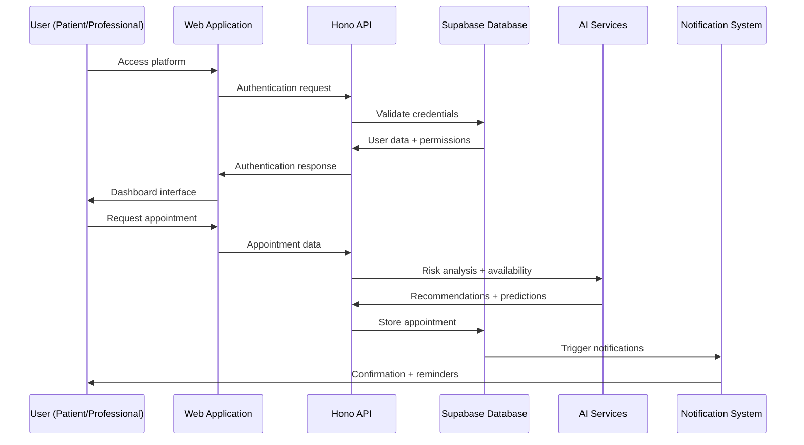

## Core Platform Flows

### 1. User Authentication & Authorization Flow

**Purpose**: Secure access control for patients, professionals, and administrators

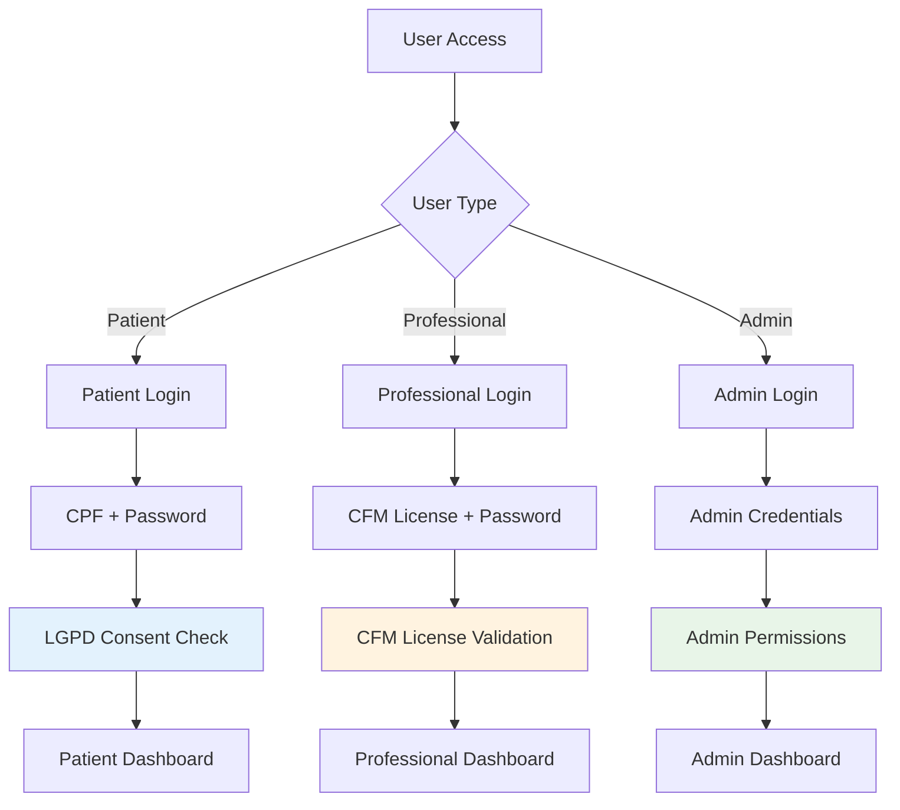

#### Authentication Implementation

```ts
// ✅ Multi-role Authentication System
interface AuthenticationFlow {
  userType: 'patient' | 'professional' | 'admin'
  credentials: {
    identifier: string // CPF, CFM license, or admin email
    password: string
  }
  mfaRequired?: boolean
  lgpdConsent?: boolean
}

interface UserSession {
  userId: string
  userType: 'patient' | 'professional' | 'admin'
  permissions: string[]
  clinicId?: string
  cfmLicense?: string
  sessionExpiry: Date
  lgpdConsentStatus: boolean
}

// Authentication flow with role-based access
export async function authenticateUser(
  credentials: AuthenticationFlow,
): Promise<UserSession> {
  switch (credentials.userType) {
    case 'patient':
      return await authenticatePatient(credentials,)
    case 'professional':
      return await authenticateProfessional(credentials,)
    case 'admin':
      return await authenticateAdmin(credentials,)
  }
}
```

### 2. Patient Registration & Onboarding Flow

**Purpose**: Comprehensive patient onboarding with LGPD compliance and medical history collection

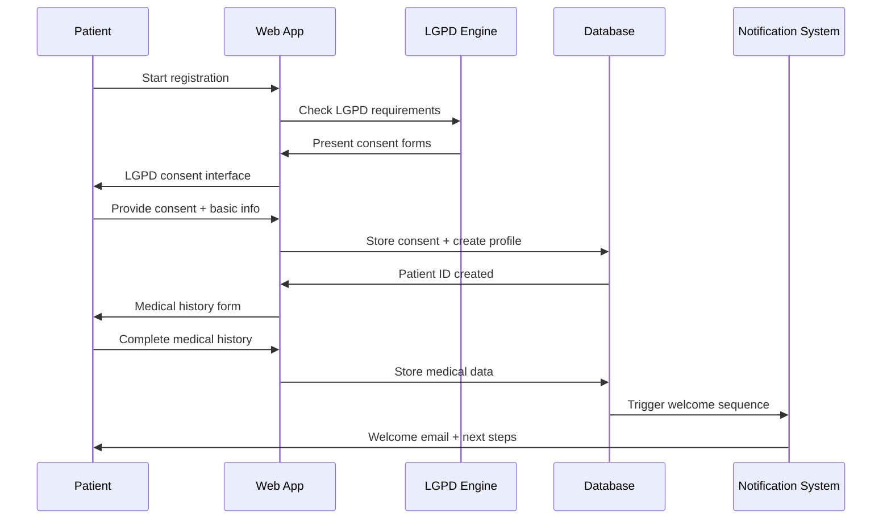

#### Patient Registration Implementation

```ts
// ✅ Patient Registration with LGPD Compliance (illustrative)
interface PatientRegistration {
  personalInfo: {
    fullName: string
    cpf: string
    dateOfBirth: Date
    email: string
    phone: string
    address: Address
  }
  medicalHistory: {
    allergies: string[]
    medications: string[]
    previousTreatments: string[]
    medicalConditions: string[]
    emergencyContact: EmergencyContact
  }
  lgpdConsent: {
    dataProcessing: boolean
    marketing: boolean
    photography: boolean
    research: boolean
    consentTimestamp: Date
    ipAddress: string
  }
  preferences: {
    communicationChannel: 'email' | 'sms' | 'phone'
    appointmentReminders: boolean
    marketingCommunications: boolean
  }
}

export async function registerPatient(
  registration: PatientRegistration,
): Promise<{ patientId: string; onboardingSteps: string[] }> {
  // Validate CPF and check for duplicates
  await validateCPF(registration.personalInfo.cpf,)

  // Store LGPD consent with audit trail
  await storeLGPDConsent(registration.lgpdConsent,)

  // Create patient profile
  const patient = await createPatientProfile(registration,)

  // Generate onboarding checklist
  const onboardingSteps = generateOnboardingSteps(registration,)

  return { patientId: patient.id, onboardingSteps, }
}
```

### 3. Professional Dashboard & Workflow Management

**Purpose**: Comprehensive professional interface for managing patients, appointments, and treatments

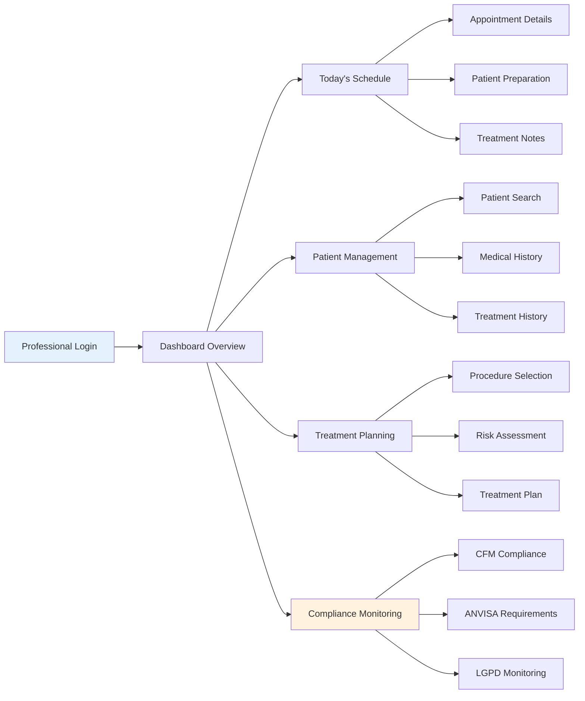

#### Professional Dashboard Implementation

```ts
// ✅ Professional Dashboard with Compliance Integration
interface ProfessionalDashboard {
  overview: {
    todayAppointments: number
    pendingApprovals: number
    complianceAlerts: number
    revenueToday: number
  }
  schedule: {
    appointments: Appointment[]
    availableSlots: TimeSlot[]
    blockedTimes: BlockedTime[]
  }
  patients: {
    recentPatients: Patient[]
    followUpRequired: Patient[]
    treatmentPlans: TreatmentPlan[]
  }
  compliance: {
    cfmStatus: CFMStatus
    anvisaAlerts: ANVISAAlert[]
    lgpdTasks: LGPDTask[]
  }
}

export function ProfessionalDashboardComponent() {
  const { data: dashboard, } = useDashboardData()
  const { cfmLicense, } = useProfessionalAuth()

  return (
    <div className="professional-dashboard">
      {/* Overview Cards */}
      <div className="dashboard-overview grid grid-cols-4 gap-4 mb-6">
        <DashboardCard
          title="Consultas Hoje"
          value={dashboard.overview.todayAppointments}
          icon="calendar"
          color="blue"
        />
        <DashboardCard
          title="Pendências"
          value={dashboard.overview.pendingApprovals}
          icon="clock"
          color="orange"
        />
        <DashboardCard
          title="Compliance"
          value={dashboard.overview.complianceAlerts}
          icon="shield"
          color="green"
        />
        <DashboardCard
          title="Receita Hoje"
          value={dashboard.overview.revenueToday}
          icon="dollar-sign"
          color="purple"
          format="currency"
        />
      </div>

      {/* Main Content Grid */}
      <div className="dashboard-content grid grid-cols-3 gap-6">
        {/* Today's Schedule */}
        <div className="col-span-2">
          <TodayScheduleWidget appointments={dashboard.schedule.appointments} />
        </div>

        {/* Quick Actions */}
        <div className="col-span-1">
          <QuickActionsWidget />
          <ComplianceStatusWidget compliance={dashboard.compliance} />
        </div>
      </div>
    </div>
  )
}
```

### 4. Appointment Scheduling Flow

**Purpose**: Intelligent appointment scheduling with anti-no-show prediction and optimization

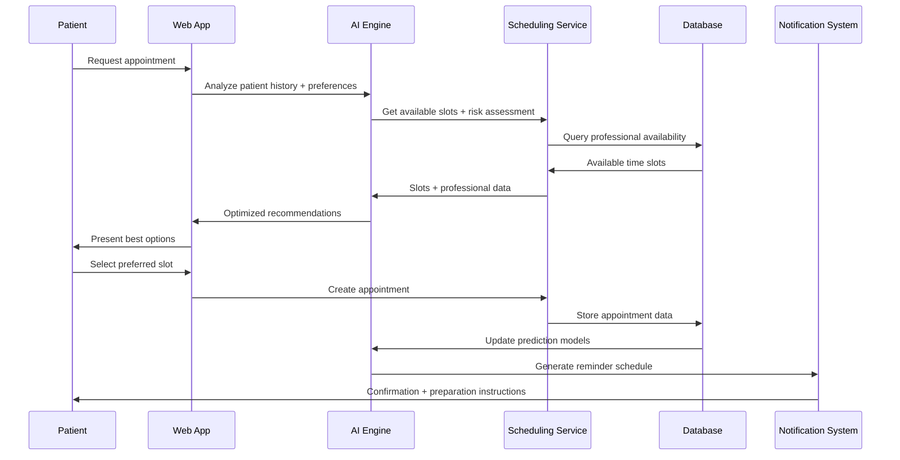

#### Scheduling Implementation

```ts
// ✅ Intelligent Appointment Scheduling
interface AppointmentRequest {
  patientId: string
  procedureType: string
  preferredDates: Date[]
  preferredTimes: string[]
  professionalPreference?: string
  urgency: 'low' | 'medium' | 'high'
  notes?: string
}

interface SchedulingRecommendation {
  slot: TimeSlot
  professional: Professional
  riskScore: number
  optimizationFactors: {
    patientHistory: number
    professionalExperience: number
    timeOptimization: number
    noShowRisk: number
  }
  estimatedDuration: number
  preparationInstructions: string[]
}

export async function generateSchedulingRecommendations(
  request: AppointmentRequest,
): Promise<SchedulingRecommendation[]> {
  // Get patient history and risk factors
  const patientHistory = await getPatientHistory(request.patientId,)
  const riskAssessment = await calculateNoShowRisk(request.patientId,)

  // Find available slots
  const availableSlots = await findAvailableSlots({
    procedureType: request.procedureType,
    dateRange: request.preferredDates,
    timePreferences: request.preferredTimes,
  },)

  // Generate AI-powered recommendations
  const recommendations = await Promise.all(
    availableSlots.map(async (slot,) => {
      const professional = await getProfessional(slot.professionalId,)
      const optimizationScore = await calculateOptimizationScore({
        slot,
        professional,
        patientHistory,
        riskAssessment,
      },)

      return {
        slot,
        professional,
        riskScore: riskAssessment.score,
        optimizationFactors: optimizationScore,
        estimatedDuration: calculateProcedureDuration(request.procedureType,),
        preparationInstructions: generatePreparationInstructions(
          request.procedureType,
          patientHistory,
        ),
      }
    },),
  )

  // Sort by optimization score
  return recommendations.sort(
    (a, b,) => b.optimizationFactors.total - a.optimizationFactors.total,
  )
}
```

### 5. Anti-No-Show Engine Flow

**Purpose**: Predictive analytics to prevent appointment cancellations with multi-channel communication

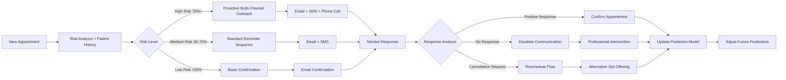

#### Anti-No-Show Implementation

```ts
// ✅ Anti-No-Show Prediction Engine
interface NoShowPrediction {
  appointmentId: string
  patientId: string
  riskScore: number // 0-100 risk percentage
  riskFactors: {
    historicalNoShows: number
    lastMinuteCancellations: number
    communicationResponsiveness: number
    appointmentDistance: number
    procedureAnxiety: number
    seasonalFactors: number
  }
  interventions: {
    email: boolean
    sms: boolean
    phone: boolean
    rescheduleOffer: boolean
    incentiveOffer: boolean
  }
  timing: {
    firstReminder: number // Hours before appointment
    secondReminder: number
    finalReminder: number
  }
  communicationPreferences: {
    preferredChannel: 'email' | 'sms' | 'phone'
    bestTimeToContact: string
    languagePreference: 'pt-BR'
  }
}

export async function calculateNoShowRisk(
  appointmentId: string,
): Promise<NoShowPrediction> {
  const appointment = await getAppointment(appointmentId,)
  const patient = await getPatient(appointment.patientId,)
  const history = await getPatientHistory(appointment.patientId,)

  // Calculate risk factors
  const riskFactors = {
    historicalNoShows: calculateHistoricalNoShowRate(history,),
    lastMinuteCancellations: calculateCancellationPattern(history,),
    communicationResponsiveness: calculateResponseRate(history,),
    appointmentDistance: calculateDistanceRisk(patient.address, appointment.clinicId,),
    procedureAnxiety: calculateProcedureAnxiety(appointment.procedureType, history,),
    seasonalFactors: calculateSeasonalRisk(appointment.scheduledAt,),
  }

  // Calculate overall risk score
  const riskScore = calculateWeightedRiskScore(riskFactors,)

  // Determine intervention strategy
  const interventions = determineInterventions(riskScore, patient.preferences,)

  // Set reminder timing based on risk
  const timing = calculateReminderTiming(riskScore, appointment.procedureType,)

  return {
    appointmentId,
    patientId: appointment.patientId,
    riskScore,
    riskFactors,
    interventions,
    timing,
    communicationPreferences: patient.communicationPreferences,
  }
}
```

### 6. Patient Management Flow

**Purpose**: Comprehensive patient lifecycle management with medical history and treatment tracking

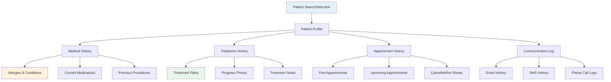

#### Patient Management Implementation

```ts
// ✅ Comprehensive Patient Management System
interface PatientProfile {
  personalInfo: {
    id: string
    fullName: string
    cpf: string
    dateOfBirth: Date
    email: string
    phone: string
    address: Address
    emergencyContact: EmergencyContact
  }
  medicalInfo: {
    allergies: Allergy[]
    medications: Medication[]
    medicalConditions: MedicalCondition[]
    contraindications: string[]
    riskFactors: RiskFactor[]
  }
  treatmentHistory: {
    procedures: CompletedProcedure[]
    treatmentPlans: TreatmentPlan[]
    progressPhotos: ProgressPhoto[]
    treatmentNotes: TreatmentNote[]
  }
  appointmentHistory: {
    completed: Appointment[]
    upcoming: Appointment[]
    cancelled: Appointment[]
    noShows: Appointment[]
  }
  communicationHistory: {
    emails: EmailRecord[]
    smsMessages: SMSRecord[]
    phoneCalls: PhoneCallRecord[]
    preferences: CommunicationPreferences
  }
  lgpdCompliance: {
    consentStatus: LGPDConsent
    dataRetentionPolicy: DataRetentionPolicy
    accessRequests: DataAccessRequest[]
  }
}

export function PatientManagementComponent({ patientId, }: { patientId: string },) {
  const { data: patient, isLoading, } = usePatientProfile(patientId,)
  const [activeTab, setActiveTab,] = useState('overview',)

  if (isLoading) return <PatientProfileSkeleton />

  return (
    <div className="patient-management">
      {/* Patient Header */}
      <PatientHeader patient={patient} />

      {/* Navigation Tabs */}
      <div className="patient-tabs">
        <TabNavigation
          tabs={[
            { id: 'overview', label: 'Visão Geral', },
            { id: 'medical', label: 'Histórico Médico', },
            { id: 'treatments', label: 'Tratamentos', },
            { id: 'appointments', label: 'Consultas', },
            { id: 'communication', label: 'Comunicação', },
            { id: 'compliance', label: 'LGPD', },
          ]}
          activeTab={activeTab}
          onTabChange={setActiveTab}
        />
      </div>

      {/* Tab Content */}
      <div className="patient-content">
        {activeTab === 'overview' && <PatientOverview patient={patient} />}
        {activeTab === 'medical' && <MedicalHistory patient={patient} />}
        {activeTab === 'treatments' && <TreatmentHistory patient={patient} />}
        {activeTab === 'appointments' && <AppointmentHistory patient={patient} />}
        {activeTab === 'communication' && <CommunicationHistory patient={patient} />}
        {activeTab === 'compliance' && <LGPDCompliance patient={patient} />}
      </div>
    </div>
  )
}
```

### 7. Professional Authentication Flow with CFM Integration

**Purpose**: CFM license validation for aesthetic procedures with real-time verification

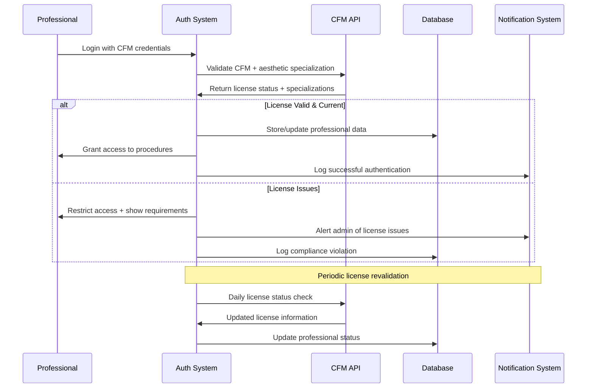

#### Professional Authentication Implementation

```ts
// ✅ CFM-Integrated Professional Authentication
interface ProfessionalCredentials {
  cfmLicense: string
  password: string
  clinicId?: string
  mfaToken?: string
}

interface CFMValidationResult {
  isValid: boolean
  licenseStatus: 'active' | 'suspended' | 'revoked' | 'expired'
  specializations: string[]
  expirationDate: Date
  restrictions: string[]
  lastValidated: Date
}

interface ProfessionalSession {
  professionalId: string
  cfmLicense: string
  authorizedProcedures: string[]
  clinicPermissions: string[]
  sessionExpiry: Date
  complianceStatus: {
    cfmValid: boolean
    anvisaCompliant: boolean
    lgpdTrained: boolean
  }
}

export async function authenticateProfessional(
  credentials: ProfessionalCredentials,
): Promise<ProfessionalSession> {
  // Validate CFM license with external API
  const cfmValidation = await validateCFMLicense(credentials.cfmLicense,)

  if (!cfmValidation.isValid) {
    throw new AuthenticationError('CFM license invalid or expired',)
  }

  // Authenticate with internal system
  const professional = await validateProfessionalCredentials(credentials,)

  // Check procedure authorizations
  const authorizedProcedures = await getAuthorizedProcedures(
    cfmValidation.specializations,
    professional.additionalCertifications,
  )

  // Create session with compliance status
  const session: ProfessionalSession = {
    professionalId: professional.id,
    cfmLicense: credentials.cfmLicense,
    authorizedProcedures,
    clinicPermissions: professional.clinicPermissions,
    sessionExpiry: new Date(Date.now() + 8 * 60 * 60 * 1000,), // 8 hours
    complianceStatus: {
      cfmValid: cfmValidation.isValid,
      anvisaCompliant: await checkANVISACompliance(professional.id,),
      lgpdTrained: await checkLGPDTraining(professional.id,),
    },
  }

  // Log authentication for audit
  await logProfessionalAuthentication({
    professionalId: professional.id,
    cfmLicense: credentials.cfmLicense,
    timestamp: new Date(),
    ipAddress: getClientIP(),
    complianceStatus: session.complianceStatus,
  },)

  return session
}
```

### 8. LGPD Compliance Flow

**Purpose**: Automated consent management and data protection with comprehensive audit trail

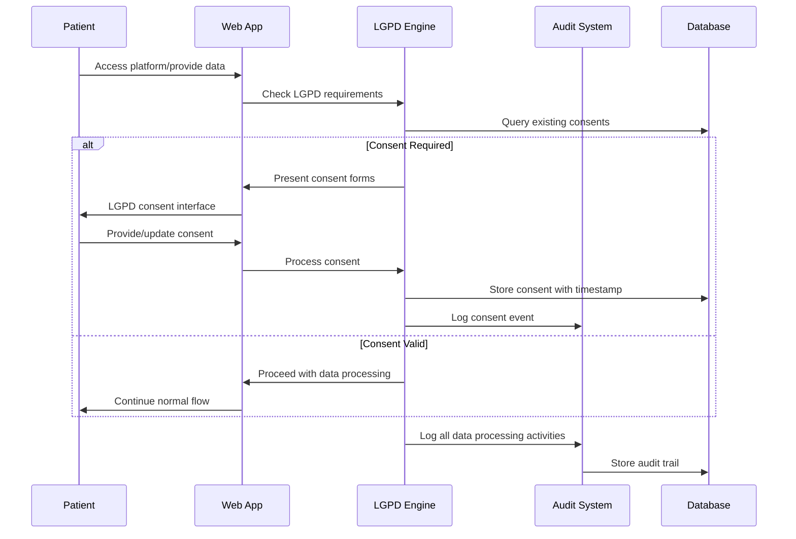

#### LGPD Compliance Implementation

```ts
// ✅ Comprehensive LGPD Compliance System
interface LGPDConsent {
  patientId: string
  consents: {
    dataProcessing: boolean // Basic treatment data
    photography: boolean // Before/after photos
    marketing: boolean // Treatment promotion
    research: boolean // Aesthetic research
    dataSharing: boolean // Sharing with partners
    retention: boolean // Extended data retention
  }
  consentMethod: 'web' | 'email' | 'in_person' | 'phone'
  consentTimestamp: Date
  ipAddress?: string
  withdrawalDate?: Date
  version: string
  legalBasis: string
  dataController: string
  retentionPeriod: number // months
}

interface LGPDDataRequest {
  requestId: string
  patientId: string
  requestType: 'access' | 'rectification' | 'deletion' | 'portability' | 'restriction'
  requestDate: Date
  status: 'pending' | 'processing' | 'completed' | 'rejected'
  completionDate?: Date
  requestDetails: string
  responseData?: any
  rejectionReason?: string
}

export class LGPDComplianceEngine {
  async checkConsentRequirements(
    patientId: string,
    dataType: string,
    processingPurpose: string,
  ): Promise<{ consentRequired: boolean; missingConsents: string[] }> {
    const existingConsents = await this.getPatientConsents(patientId,)
    const requiredConsents = this.determineRequiredConsents(dataType, processingPurpose,)

    const missingConsents = requiredConsents.filter(
      consent => !existingConsents[consent] || this.isConsentExpired(existingConsents[consent],),
    )

    return {
      consentRequired: missingConsents.length > 0,
      missingConsents,
    }
  }

  async processDataRequest(request: LGPDDataRequest,): Promise<void> {
    // Log the request
    await this.logDataRequest(request,)

    switch (request.requestType) {
      case 'access':
        await this.processAccessRequest(request,)
        break
      case 'rectification':
        await this.processRectificationRequest(request,)
        break
      case 'deletion':
        await this.processDeletionRequest(request,)
        break
      case 'portability':
        await this.processPortabilityRequest(request,)
        break
      case 'restriction':
        await this.processRestrictionRequest(request,)
        break
    }

    // Update request status
    await this.updateRequestStatus(request.requestId, 'completed',)

    // Notify patient of completion
    await this.notifyRequestCompletion(request,)
  }

  async generateLGPDReport(
    startDate: Date,
    endDate: Date,
  ): Promise<LGPDComplianceReport> {
    const consentEvents = await this.getConsentEvents(startDate, endDate,)
    const dataRequests = await this.getDataRequests(startDate, endDate,)
    const dataBreaches = await this.getDataBreaches(startDate, endDate,)
    const processingActivities = await this.getProcessingActivities(startDate, endDate,)

    return {
      period: { startDate, endDate, },
      summary: {
        totalConsents: consentEvents.length,
        totalRequests: dataRequests.length,
        totalBreaches: dataBreaches.length,
        complianceScore: this.calculateComplianceScore(consentEvents, dataRequests,),
      },
      details: {
        consentEvents,
        dataRequests,
        dataBreaches,
        processingActivities,
      },
      recommendations: this.generateComplianceRecommendations(consentEvents, dataRequests,),
    }
  }
}
```

## Technical Architecture

### Core Stack

- **Frontend**: Next.js 15 + React 19 + TypeScript
- **Database**: Supabase PostgreSQL + Real-time subscriptions
- **API**: Hono.dev (Vercel Functions)
- **AI**: AI SDK (OpenAI/Anthropic) with Portuguese optimization
- **UI**: shadcn/ui components with healthcare optimizations
- **State Management**: Zustand + TanStack Query
- **Authentication**: Supabase Auth with CFM integration
- **Compliance**: LGPD automation with audit trails

### Essential Components

```text
// ✅ Current NeonPro Platform Architecture (Verified September 2025)
neonpro/
├── 🏗️ apps/ (2 applications)
│   ├── web/                     // Next.js 15 Frontend Application (App Router)
│   │   ├── app/                 // App Router pages with layouts
│   │   │   ├── (auth)/         // Authentication group routes
│   │   │   │   ├── login/      // Professional/patient login
│   │   │   │   ├── register/   // Patient registration
│   │   │   │   └── layout.tsx  // Auth layout with LGPD compliance
│   │   │   ├── dashboard/      // Main dashboard routes
│   │   │   │   ├── page.tsx    // Dashboard overview
│   │   │   │   ├── patients/   // Patient management routes
│   │   │   │   ├── appointments/ // Scheduling interface
│   │   │   │   ├── treatments/ // Treatment planning
│   │   │   │   └── compliance/ // LGPD/ANVISA monitoring
│   │   │   ├── api/           // API routes (Next.js API)
│   │   │   └── globals.css    // Tailwind + shadcn/ui styles
│   │   ├── components/        // React 19 components
│   │   │   ├── ui/           // shadcn/ui v4 components
│   │   │   ├── forms/        // React Hook Form + Zod validation
│   │   │   ├── charts/       // Data visualization (Recharts)
│   │   │   ├── layouts/      // Layout components
│   │   │   └── providers/    // Context providers (Zustand + TanStack Query)
│   │   ├── hooks/            // Custom React hooks
│   │   │   ├── useAuth.ts    // Authentication hook
│   │   │   ├── usePatients.ts // Patient management
│   │   │   └── useScheduling.ts // Appointment scheduling
│   │   └── lib/              // Utility libraries
│   │       ├── supabase.ts   // Supabase client configuration
│   │       ├── utils.ts      // Utility functions
│   │       └── validations.ts // Zod schemas
│   └── api/                  // Hono.dev Backend API (Vercel Functions)
│       ├── src/
│       │   ├── routes/       // API route handlers
│       │   │   ├── auth.ts   // CFM authentication + LGPD
│       │   │   ├── patients.ts // Patient CRUD operations
│       │   │   ├── appointments.ts // Scheduling logic
│       │   │   ├── professionals.ts // Professional management
│       │   │   └── compliance.ts // LGPD/ANVISA endpoints
│       │   ├── middleware/   // Security and validation
│       │   │   ├── auth.ts   // JWT validation
│       │   │   ├── cors.ts   // CORS configuration
│       │   │   └── lgpd.ts   // LGPD compliance middleware
│       │   └── index.ts      // Hono app configuration
│       └── package.json      // Hono + TypeScript dependencies

├── 📦 packages/ (8 essential packages)
│   ├── types/               // @neonpro/types - Shared TypeScript definitions
│   │   ├── src/
│   │   │   ├── auth.ts      // Authentication types
│   │   │   ├── patient.ts   // Patient data types
│   │   │   ├── appointment.ts // Scheduling types
│   │   │   └── compliance.ts // LGPD/ANVISA types
│   │   └── package.json     // Pure TypeScript (no dependencies)
│   ├── ui/                  // @neonpro/ui - shadcn/ui + healthcare components
│   │   ├── src/
│   │   │   ├── components/  // shadcn/ui v4 components
│   │   │   │   ├── button.tsx
│   │   │   │   ├── form.tsx
│   │   │   │   ├── calendar.tsx
│   │   │   │   └── data-table.tsx
│   │   │   ├── healthcare/  // Healthcare-specific components
│   │   │   │   ├── patient-card.tsx
│   │   │   │   ├── appointment-scheduler.tsx
│   │   │   │   └── treatment-planner.tsx
│   │   │   └── index.ts     // Component exports
│   │   └── package.json     // React 19 + Radix UI + Tailwind
│   ├── database/            // @neonpro/database - Supabase + Prisma integration
│   │   ├── src/
│   │   │   ├── client.ts    // Supabase client
│   │   │   ├── schema.sql   // Database schema
│   │   │   ├── migrations/  // Database migrations
│   │   │   └── seed.ts      // Development seed data
│   │   ├── prisma/
│   │   │   ├── schema.prisma // Prisma schema
│   │   │   └── migrations/  // Prisma migrations
│   │   └── package.json     // Supabase + Prisma dependencies
│   ├── core-services/       // @neonpro/core-services - Business logic
│   │   ├── src/
│   │   │   ├── services/
│   │   │   │   ├── AIService.ts // OpenAI GPT-4 integration
│   │   │   │   ├── SchedulingService.ts // Appointment logic
│   │   │   │   ├── ComplianceService.ts // LGPD/ANVISA
│   │   │   │   ├── NotificationService.ts // Email/SMS
│   │   │   │   └── AnalyticsService.ts // Business intelligence
│   │   │   ├── utils/
│   │   │   │   ├── brazilian-healthcare.ts // CPF, CFM validation
│   │   │   │   ├── date-utils.ts // Brazilian date formatting
│   │   │   │   └── encryption.ts // LGPD-compliant encryption
│   │   │   └── index.ts
│   │   └── package.json     // OpenAI + business logic dependencies
│   ├── shared/              // @neonpro/shared - Schemas and API client
│   │   ├── src/
│   │   │   ├── schemas/     // Zod validation schemas
│   │   │   │   ├── auth.ts
│   │   │   │   ├── patient.ts
│   │   │   │   └── appointment.ts
│   │   │   ├── api-client.ts // Hono RPC client
│   │   │   ├── hooks/       // React Query hooks
│   │   │   └── constants.ts // Platform constants
│   │   └── package.json     // Zod + Hono RPC dependencies
│   ├── security/            // @neonpro/security - Auth + security
│   │   ├── src/
│   │   │   ├── auth/
│   │   │   │   ├── cfm-validator.ts // CFM license validation
│   │   │   │   ├── jwt-handler.ts // JWT token management
│   │   │   │   └── session-manager.ts // Session handling
│   │   │   ├── encryption/
│   │   │   │   ├── lgpd-encryption.ts // LGPD-compliant encryption
│   │   │   │   └── data-anonymization.ts // Data anonymization
│   │   │   └── compliance/
│   │   │       ├── audit-logger.ts // Audit trail logging
│   │   │       └── data-retention.ts // Data retention policies
│   │   └── package.json     // Security dependencies
│   ├── utils/               // @neonpro/utils - Common utilities
│   │   ├── src/
│   │   │   ├── brazilian/   // Brazilian-specific utilities
│   │   │   │   ├── cpf.ts   // CPF validation and formatting
│   │   │   │   ├── phone.ts // Brazilian phone formatting
│   │   │   │   └── address.ts // CEP and address validation
│   │   │   ├── date/        // Date utilities
│   │   │   │   ├── brazilian-dates.ts // Brazilian date formatting
│   │   │   │   └── business-hours.ts // Business hours calculation
│   │   │   └── validation/  // Validation utilities
│   │   │       ├── healthcare.ts // Medical data validation
│   │   │       └── forms.ts // Form validation helpers
│   │   └── package.json     // Utility dependencies
│   └── config/              // @neonpro/config - Shared configurations
│       ├── src/
│       │   ├── typescript/  // TypeScript configurations
│       │   │   ├── base.json
│       │   │   ├── nextjs.json
│       │   │   └── node.json
│       │   ├── eslint/      // ESLint configurations
│       │   │   ├── base.js
│       │   │   ├── react.js
│       │   │   └── node.js
│       │   └── tailwind/    // Tailwind configurations
│       │       ├── base.js
│       │       └── healthcare-theme.js
│       └── package.json     // Configuration dependencies

└── 🛠️ tools/ (Development tools)
    ├── e2e/                 // Playwright end-to-end testing
    ├── testing/             // Vitest testing utilities
    ├── scripts/             // Development and deployment scripts
    └── reports/             // Analysis and cleanup reports
```

### Technology Stack Alignment

```ts
// ✅ Current Tech Stack (Verified September 2025) — illustrative
interface TechStackAlignment {
  frontend: {
    framework: 'Next.js 15.5.2'
    ui: 'React 19.0.0'
    styling: 'Tailwind CSS 3.4.0'
    components: 'shadcn/ui v4'
    stateManagement: 'Zustand 4.4.0'
    serverState: 'TanStack Query 5.0.0'
    forms: 'React Hook Form 7.45.0'
    validation: 'Zod 3.23.0'
    animation: 'Framer Motion 10.16.0'
  }
  backend: {
    framework: 'Hono.dev (Vercel Functions)'
    database: 'Supabase PostgreSQL'
    orm: 'Prisma ORM'
    auth: 'Supabase Auth + CFM integration'
    realtime: 'Supabase Real-time subscriptions'
    ai: 'OpenAI GPT-4 + Vercel AI SDK'
  }
  monorepo: {
    tool: 'Turborepo 2.5.6'
    packageManager: 'pnpm 8.15.0'
    scripts: 'Bun (3-5x faster than npm)'
    typescript: '5.7.2 (strict mode)'
  }
  deployment: {
    platform: 'Vercel'
    region: 'gru1 (São Paulo)'
    functions: 'Vercel Functions (Hono.dev)'
    database: 'Supabase (South America)'
    cdn: 'Vercel Edge Network'
  }
  compliance: {
    lgpd: 'Automated consent management'
    anvisa: 'Device registration validation'
    cfm: 'Real-time license verification'
    accessibility: 'WCAG 2.1 AA compliance'
  }
}
```

### Database Schema (Essential Tables)

```sql
-- ✅ Current NeonPro Database Schema (Supabase PostgreSQL)
-- Aligned with packages/database/src/schema.sql

-- Core clinic management
CREATE TABLE clinics (
  id UUID PRIMARY KEY DEFAULT gen_random_uuid(),
  name VARCHAR(255) NOT NULL,
  cnpj VARCHAR(18) UNIQUE NOT NULL,
  address JSONB NOT NULL,
  contact_info JSONB NOT NULL,
  anvisa_registration VARCHAR(50),
  operating_hours JSONB,
  settings JSONB DEFAULT '{}',
  created_at TIMESTAMP WITH TIME ZONE DEFAULT NOW(),
  updated_at TIMESTAMP WITH TIME ZONE DEFAULT NOW()
);

-- Professional management with CFM integration
CREATE TABLE aesthetic_professionals (
  id UUID PRIMARY KEY DEFAULT gen_random_uuid(),
  cfm_license VARCHAR(20) UNIQUE NOT NULL,
  full_name VARCHAR(255) NOT NULL,
  email VARCHAR(255) UNIQUE NOT NULL,
  phone VARCHAR(20),
  specializations TEXT[] DEFAULT '{}',
  clinic_id UUID REFERENCES clinics(id) ON DELETE CASCADE,
  status VARCHAR(50) DEFAULT 'active' CHECK (status IN ('active', 'inactive', 'suspended')),
  license_expiry DATE,
  additional_certifications JSONB DEFAULT '[]',
  working_hours JSONB,
  notification_preferences JSONB DEFAULT '{}',
  created_at TIMESTAMP WITH TIME ZONE DEFAULT NOW(),
  updated_at TIMESTAMP WITH TIME ZONE DEFAULT NOW()
);

-- Patient management with LGPD compliance
CREATE TABLE aesthetic_patients (
  id UUID PRIMARY KEY DEFAULT gen_random_uuid(),
  cpf_hash VARCHAR(64) UNIQUE NOT NULL, -- LGPD compliant hashed CPF
  full_name VARCHAR(255) NOT NULL,
  email VARCHAR(255),
  phone VARCHAR(20),
  date_of_birth DATE,
  gender VARCHAR(20),
  address JSONB,
  emergency_contact JSONB,
  medical_history JSONB DEFAULT '{}',
  allergies TEXT[] DEFAULT '{}',
  medications TEXT[] DEFAULT '{}',
  medical_conditions TEXT[] DEFAULT '{}',
  communication_preferences JSONB DEFAULT '{"channel": "email", "reminders": true}',
  clinic_id UUID REFERENCES clinics(id) ON DELETE CASCADE,
  created_at TIMESTAMP WITH TIME ZONE DEFAULT NOW(),
  updated_at TIMESTAMP WITH TIME ZONE DEFAULT NOW()
);

-- Appointment scheduling with anti-no-show prediction
CREATE TABLE aesthetic_appointments (
  id UUID PRIMARY KEY DEFAULT gen_random_uuid(),
  patient_id UUID REFERENCES aesthetic_patients(id) ON DELETE CASCADE,
  professional_id UUID REFERENCES aesthetic_professionals(id) ON DELETE CASCADE,
  clinic_id UUID REFERENCES clinics(id) ON DELETE CASCADE,
  procedure_type VARCHAR(100) NOT NULL,
  procedure_category VARCHAR(50),
  scheduled_at TIMESTAMP WITH TIME ZONE NOT NULL,
  duration_minutes INTEGER DEFAULT 60,
  status VARCHAR(50) DEFAULT 'scheduled' CHECK (status IN ('scheduled', 'confirmed', 'in_progress', 'completed', 'cancelled', 'no_show')),
  no_show_risk_score INTEGER DEFAULT 0 CHECK (no_show_risk_score >= 0 AND no_show_risk_score <= 100),
  risk_factors JSONB DEFAULT '{}',
  preparation_instructions TEXT,
  treatment_notes TEXT,
  before_photos TEXT[] DEFAULT '{}',
  after_photos TEXT[] DEFAULT '{}',
  estimated_cost DECIMAL(10,2),
  actual_cost DECIMAL(10,2),
  payment_status VARCHAR(50) DEFAULT 'pending',
  created_at TIMESTAMP WITH TIME ZONE DEFAULT NOW(),
  updated_at TIMESTAMP WITH TIME ZONE DEFAULT NOW()
);

-- Treatment planning and multi-session procedures
CREATE TABLE treatment_plans (
  id UUID PRIMARY KEY DEFAULT gen_random_uuid(),
  patient_id UUID REFERENCES aesthetic_patients(id) ON DELETE CASCADE,
  professional_id UUID REFERENCES aesthetic_professionals(id) ON DELETE CASCADE,
  clinic_id UUID REFERENCES clinics(id) ON DELETE CASCADE,
  plan_name VARCHAR(255) NOT NULL,
  description TEXT,
  procedures JSONB NOT NULL, -- Array of procedure objects
  timeline JSONB, -- Treatment schedule and milestones
  total_sessions INTEGER DEFAULT 1,
  completed_sessions INTEGER DEFAULT 0,
  estimated_cost DECIMAL(10,2),
  actual_cost DECIMAL(10,2) DEFAULT 0,
  status VARCHAR(50) DEFAULT 'draft' CHECK (status IN ('draft', 'active', 'completed', 'cancelled', 'on_hold')),
  start_date DATE,
  end_date DATE,
  notes TEXT,
  created_at TIMESTAMP WITH TIME ZONE DEFAULT NOW(),
  updated_at TIMESTAMP WITH TIME ZONE DEFAULT NOW()
);

-- LGPD consent management
CREATE TABLE lgpd_consents (
  id UUID PRIMARY KEY DEFAULT gen_random_uuid(),
  patient_id UUID REFERENCES aesthetic_patients(id) ON DELETE CASCADE,
  consent_type VARCHAR(100) NOT NULL CHECK (consent_type IN ('data_processing', 'photography', 'marketing', 'research', 'data_sharing', 'retention')),
  consent_given BOOLEAN NOT NULL,
  consent_method VARCHAR(50) CHECK (consent_method IN ('web', 'email', 'in_person', 'phone')),
  consent_timestamp TIMESTAMP WITH TIME ZONE DEFAULT NOW(),
  withdrawal_timestamp TIMESTAMP WITH TIME ZONE,
  ip_address INET,
  user_agent TEXT,
  version VARCHAR(10) DEFAULT '1.0',
  legal_basis VARCHAR(100),
  data_controller VARCHAR(255),
  retention_period_months INTEGER,
  created_at TIMESTAMP WITH TIME ZONE DEFAULT NOW()
);

-- LGPD data requests (access, rectification, deletion, etc.)
CREATE TABLE lgpd_data_requests (
  id UUID PRIMARY KEY DEFAULT gen_random_uuid(),
  patient_id UUID REFERENCES aesthetic_patients(id) ON DELETE CASCADE,
  request_type VARCHAR(50) NOT NULL CHECK (request_type IN ('access', 'rectification', 'deletion', 'portability', 'restriction')),
  request_date TIMESTAMP WITH TIME ZONE DEFAULT NOW(),
  status VARCHAR(50) DEFAULT 'pending' CHECK (status IN ('pending', 'processing', 'completed', 'rejected')),
  completion_date TIMESTAMP WITH TIME ZONE,
  request_details TEXT,
  response_data JSONB,
  rejection_reason TEXT,
  processed_by UUID REFERENCES aesthetic_professionals(id),
  created_at TIMESTAMP WITH TIME ZONE DEFAULT NOW(),
  updated_at TIMESTAMP WITH TIME ZONE DEFAULT NOW()
);

-- Comprehensive audit logging
CREATE TABLE audit_logs (
  id UUID PRIMARY KEY DEFAULT gen_random_uuid(),
  user_id UUID,
  user_type VARCHAR(50) CHECK (user_type IN ('patient', 'professional', 'admin', 'system')),
  action VARCHAR(100) NOT NULL,
  resource_type VARCHAR(100),
  resource_id UUID,
  details JSONB DEFAULT '{}',
  ip_address INET,
  user_agent TEXT,
  session_id VARCHAR(255),
  clinic_id UUID REFERENCES clinics(id),
  lgpd_relevant BOOLEAN DEFAULT FALSE,
  timestamp TIMESTAMP WITH TIME ZONE DEFAULT NOW()
);

-- Notification management
CREATE TABLE notifications (
  id UUID PRIMARY KEY DEFAULT gen_random_uuid(),
  recipient_id UUID NOT NULL,
  recipient_type VARCHAR(50) CHECK (recipient_type IN ('patient', 'professional', 'admin')),
  type VARCHAR(100) NOT NULL,
  channel VARCHAR(50) CHECK (channel IN ('email', 'sms', 'push', 'in_app')),
  title VARCHAR(255),
  content TEXT NOT NULL,
  status VARCHAR(50) DEFAULT 'pending' CHECK (status IN ('pending', 'sent', 'delivered', 'failed', 'read')),
  scheduled_at TIMESTAMP WITH TIME ZONE,
  sent_at TIMESTAMP WITH TIME ZONE,
  read_at TIMESTAMP WITH TIME ZONE,
  metadata JSONB DEFAULT '{}',
  created_at TIMESTAMP WITH TIME ZONE DEFAULT NOW()
);

-- Indexes for performance optimization
CREATE INDEX idx_appointments_scheduled_at ON aesthetic_appointments(scheduled_at);
CREATE INDEX idx_appointments_patient_id ON aesthetic_appointments(patient_id);
CREATE INDEX idx_appointments_professional_id ON aesthetic_appointments(professional_id);
CREATE INDEX idx_appointments_status ON aesthetic_appointments(status);
CREATE INDEX idx_patients_cpf_hash ON aesthetic_patients(cpf_hash);
CREATE INDEX idx_patients_clinic_id ON aesthetic_patients(clinic_id);
CREATE INDEX idx_professionals_cfm_license ON aesthetic_professionals(cfm_license);
CREATE INDEX idx_professionals_clinic_id ON aesthetic_professionals(clinic_id);
CREATE INDEX idx_audit_logs_timestamp ON audit_logs(timestamp);
CREATE INDEX idx_audit_logs_user_id ON audit_logs(user_id);
CREATE INDEX idx_lgpd_consents_patient_id ON lgpd_consents(patient_id);
CREATE INDEX idx_notifications_recipient ON notifications(recipient_id, recipient_type);

-- Row Level Security (RLS) policies for LGPD compliance
ALTER TABLE aesthetic_patients ENABLE ROW LEVEL SECURITY;
ALTER TABLE aesthetic_appointments ENABLE ROW LEVEL SECURITY;
ALTER TABLE treatment_plans ENABLE ROW LEVEL SECURITY;
ALTER TABLE lgpd_consents ENABLE ROW LEVEL SECURITY;
ALTER TABLE audit_logs ENABLE ROW LEVEL SECURITY;

-- Example RLS policy for patient data access
CREATE POLICY "Patients can view own data" ON aesthetic_patients
  FOR SELECT USING (auth.uid()::text = id::text);

CREATE POLICY "Professionals can view clinic patients" ON aesthetic_patients
  FOR SELECT USING (
    EXISTS (
      SELECT 1 FROM aesthetic_professionals 
      WHERE id = auth.uid() AND clinic_id = aesthetic_patients.clinic_id
    )
  );
```

## Compliance Implementation

### LGPD (Brazilian Data Protection)

- **Consent Management**: Granular consent for each data processing purpose
- **Data Minimization**: Collect only necessary treatment information
- **Right to Deletion**: Automated data erasure after retention period
- **Audit Trail**: Complete log of data access and modifications
- **Data Portability**: Export patient data in structured format
- **Breach Notification**: Automated incident reporting system

### ANVISA (Medical Device Compliance)

- **Device Registration**: Validation of aesthetic equipment registration
- **Safety Protocols**: Implementation of mandatory safety procedures
- **Adverse Event Reporting**: Automated reporting system for complications
- **Quality Management**: ISO 13485 compliance tracking

### CFM (Professional Oversight)

- **License Validation**: Real-time CFM license status verification
- **Specialization Matching**: Procedure authorization based on qualifications
- **Continuing Education**: Tracking of required CE hours
- **Professional Standards**: Compliance with CFM ethical guidelines

### WCAG 2.1 AA (Web Accessibility)

- **Keyboard Navigation**: All functionality accessible via keyboard
- **Screen Reader Support**: Portuguese language optimization with proper ARIA labels
- **Color Contrast**: 4.5:1 for text, 3:1 for UI components
- **Touch Targets**: Minimum 44px for interactive elements
- **Focus Management**: Visible focus indicators throughout interface
- **Semantic HTML**: Proper heading structure and form associations

## Platform Navigation Patterns

### Responsive Design Principles

```css
/* ✅ Mobile-First Platform Interface Styles */
.platform-container {
  /* Mobile-first approach - base styles for mobile */
  width: 100%;
  max-width: 100vw;
  min-height: 100vh;
  display: flex;
  flex-direction: column;
  background: var(--background);
}

.platform-header {
  background: var(--primary);
  color: var(--primary-foreground);
  padding: 1rem;
  display: flex;
  align-items: center;
  justify-content: space-between;
  min-height: 64px;
  box-shadow: 0 2px 4px rgba(0, 0, 0, 0.1);
}

.platform-navigation {
  background: var(--card);
  border-right: 1px solid var(--border);
  width: 100%;
  /* Mobile: bottom navigation */
  position: fixed;
  bottom: 0;
  left: 0;
  z-index: 50;
  display: flex;
  justify-content: space-around;
  padding: 0.75rem;
}

.platform-main {
  flex: 1;
  padding: 1rem;
  /* Account for bottom navigation on mobile */
  padding-bottom: 5rem;
  overflow-y: auto;
  -webkit-overflow-scrolling: touch;
}

.nav-item {
  display: flex;
  flex-direction: column;
  align-items: center;
  gap: 0.25rem;
  padding: 0.5rem;
  border-radius: 0.5rem;
  text-decoration: none;
  color: var(--muted-foreground);
  transition: all 0.2s;
  min-height: 44px; /* Touch target size */
  min-width: 44px;
}

.nav-item:hover,
.nav-item.active {
  color: var(--primary);
  background: var(--primary/10);
}

.nav-icon {
  width: 20px;
  height: 20px;
}

.nav-label {
  font-size: 0.75rem;
  font-weight: 500;
}

/* Tablet and desktop enhancements */
@media (min-width: 768px) {
  .platform-navigation {
    /* Desktop: side navigation */
    position: static;
    width: 240px;
    flex-direction: column;
    justify-content: flex-start;
    padding: 1rem;
    gap: 0.5rem;
  }

  .platform-main {
    padding-bottom: 1rem;
  }

  .nav-item {
    flex-direction: row;
    justify-content: flex-start;
    width: 100%;
    padding: 0.75rem 1rem;
  }

  .nav-label {
    font-size: 0.875rem;
  }
}

/* Large screen optimizations */
@media (min-width: 1024px) {
  .platform-container {
    flex-direction: row;
  }

  .platform-navigation {
    width: 280px;
  }
}

/* Accessibility enhancements */
.nav-item:focus-visible {
  outline: 2px solid var(--ring);
  outline-offset: 2px;
}

/* Loading states */
.loading-skeleton {
  background: linear-gradient(90deg, var(--muted) 25%, var(--muted/50) 50%, var(--muted) 75%);
  background-size: 200% 100%;
  animation: loading 1.5s infinite;
}

@keyframes loading {
  0% {
    background-position: 200% 0;
  }
  100% {
    background-position: -200% 0;
  }
}

/* Error states */
.error-state {
  background: var(--destructive/10);
  border: 1px solid var(--destructive);
  color: var(--destructive);
  padding: 1rem;
  border-radius: 0.5rem;
  text-align: center;
}

/* Success states */
.success-state {
  background: var(--success/10);
  border: 1px solid var(--success);
  color: var(--success);
  padding: 1rem;
  border-radius: 0.5rem;
  text-align: center;
}
```

### Dashboard Layout Implementation

```ts
// ✅ Responsive Dashboard Layout
export function DashboardLayout({ children, }: { children: React.ReactNode },) {
  const [sidebarOpen, setSidebarOpen,] = useState(false,)
  const { user, userType, } = useAuth()
  const isMobile = useMediaQuery('(max-width: 768px)',)

  const navigationItems = useMemo(() => {
    const baseItems = [
      { id: 'dashboard', label: 'Dashboard', icon: 'home', href: '/dashboard', },
      { id: 'appointments', label: 'Consultas', icon: 'calendar', href: '/appointments', },
      { id: 'patients', label: 'Pacientes', icon: 'users', href: '/patients', },
    ]

    if (userType === 'professional') {
      baseItems.push(
        { id: 'treatments', label: 'Tratamentos', icon: 'stethoscope', href: '/treatments', },
        { id: 'compliance', label: 'Compliance', icon: 'shield', href: '/compliance', },
      )
    }

    if (userType === 'admin') {
      baseItems.push(
        {
          id: 'professionals',
          label: 'Profissionais',
          icon: 'user-check',
          href: '/professionals',
        },
        { id: 'reports', label: 'Relatórios', icon: 'bar-chart', href: '/reports', },
        { id: 'settings', label: 'Configurações', icon: 'settings', href: '/settings', },
      )
    }

    return baseItems
  }, [userType,],)

  return (
    <div className="platform-container">
      {/* Header */}
      <header className="platform-header">
        <div className="flex items-center gap-4">
          {isMobile && (
            <button
              onClick={() => setSidebarOpen(!sidebarOpen,)}
              className="p-2 rounded-md hover:bg-primary/10"
              aria-label="Toggle navigation"
            >
              <Menu className="w-5 h-5" />
            </button>
          )}
          <h1 className="text-xl font-semibold">NeonPro</h1>
        </div>

        <div className="flex items-center gap-4">
          <NotificationBell />
          <UserMenu user={user} />
        </div>
      </header>

      <div className="flex flex-1">
        {/* Navigation */}
        <nav
          className={cn(
            'platform-navigation',
            isMobile && !sidebarOpen && 'hidden',
          )}
        >
          {navigationItems.map((item,) => (
            <Link
              key={item.id}
              href={item.href}
              className="nav-item"
              onClick={() => isMobile && setSidebarOpen(false,)}
            >
              <Icon name={item.icon} className="nav-icon" />
              <span className="nav-label">{item.label}</span>
            </Link>
          ))}
        </nav>

        {/* Main Content */}
        <main className="platform-main">
          <Suspense fallback={<DashboardSkeleton />}>
            {children}
          </Suspense>
        </main>
      </div>

      {/* Mobile overlay */}
      {isMobile && sidebarOpen && (
        <div
          className="fixed inset-0 bg-black/50 z-40"
          onClick={() => setSidebarOpen(false,)}
          aria-hidden="true"
        />
      )}
    </div>
  )
}
```

## Comprehensive User Journeys

### Patient User Journey

#### Discovery to First Appointment

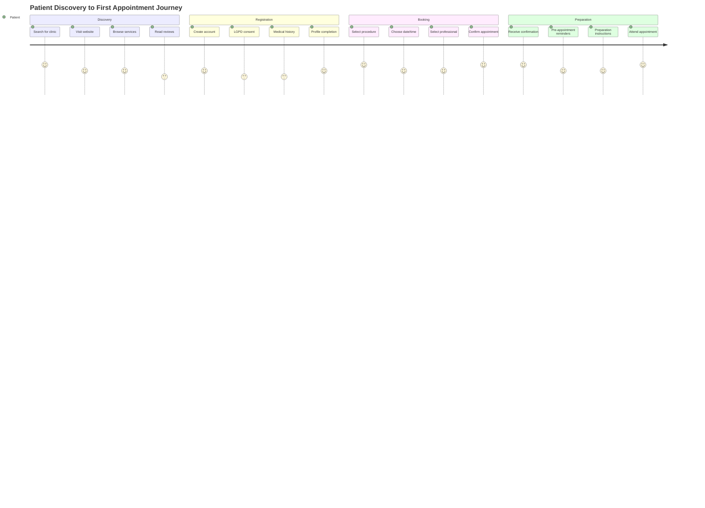

#### Ongoing Patient Experience Flow

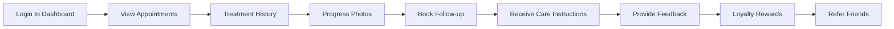

### Professional User Journey

#### Daily Workflow

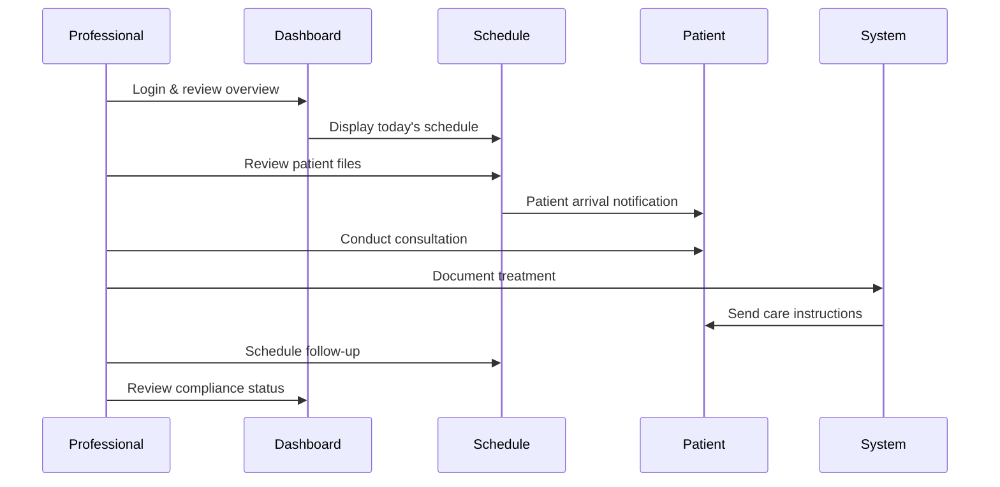

#### Treatment Planning Flow

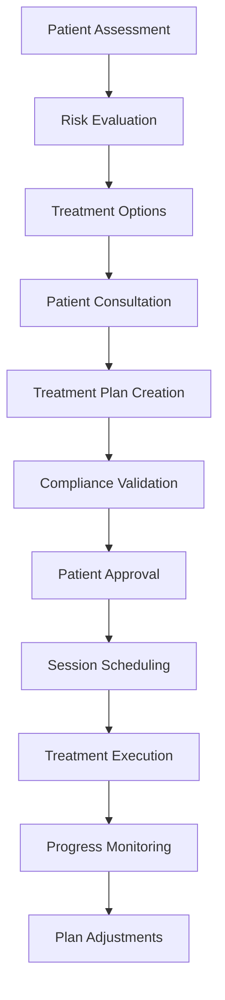

### Administrator User Journey

#### Daily Operations Management

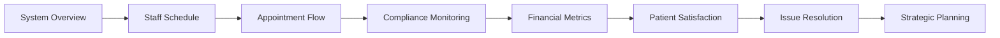

#### Monthly Business Review

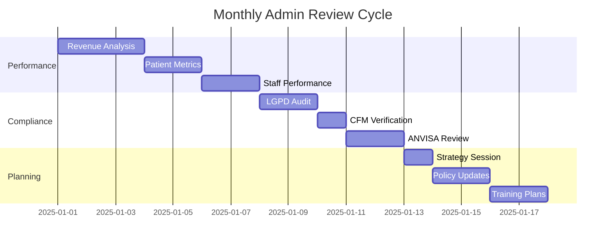

### Cross-User Journey Touchpoints

#### Appointment Lifecycle

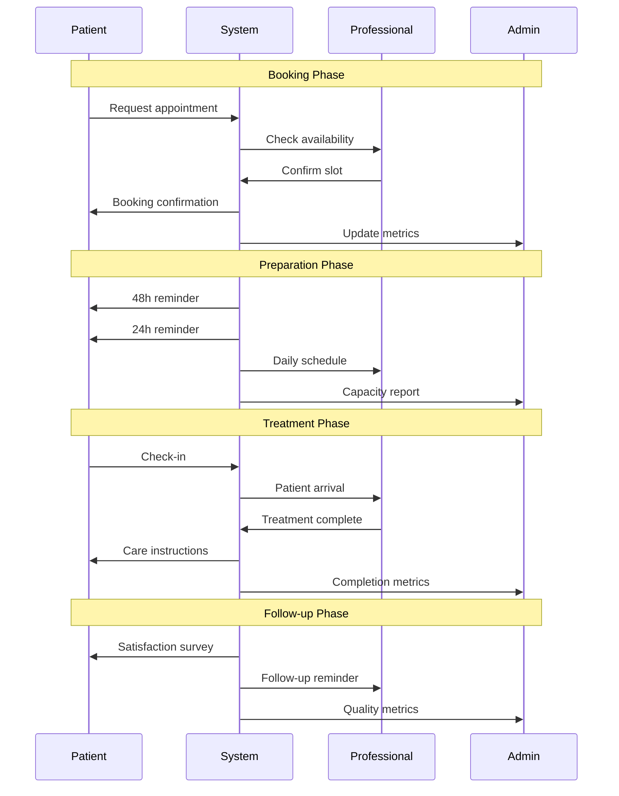

### User Experience Optimization

#### Patient Experience Enhancements

- **Smart Booking**: AI-powered appointment recommendations
- **Progress Tracking**: Visual treatment progress with photos
- **Educational Content**: Procedure explanations and care guides
- **Community Features**: Patient testimonials and success stories
- **Loyalty Program**: Rewards for referrals and repeat visits

#### Professional Experience Enhancements

- **Clinical Decision Support**: AI-powered treatment recommendations
- **Automated Documentation**: Voice-to-text treatment notes
- **Performance Analytics**: Personal metrics and improvement suggestions
- **Continuing Education**: Integrated training and certification tracking
- **Workload Optimization**: Intelligent scheduling and patient matching

#### Administrator Experience Enhancements

- **Predictive Analytics**: Demand forecasting and resource planning
- **Automated Reporting**: Real-time dashboards and scheduled reports
- **Compliance Automation**: Automated checking and alert systems
- **Business Intelligence**: Market trends and competitive analysis
- **Staff Management**: Performance tracking and development planning

## Examples

### Accessible Appointment Scheduling

```ts
// ✅ Accessible Aesthetic Appointment Form
export function AestheticAppointmentForm() {
  const [selectedProcedure, setSelectedProcedure,] = useState('',)
  const [selectedDate, setSelectedDate,] = useState<Date>()
  const [availableSlots, setAvailableSlots,] = useState<TimeSlot[]>([],)

  return (
    <form className="appointment-form" role="form" aria-labelledby="form-title">
      <h2 id="form-title">Agendamento de Procedimento Estético</h2>

      {/* Procedure selection with Portuguese terms */}
      <div className="form-group">
        <label htmlFor="procedure-select">Procedimento Desejado</label>
        <select
          id="procedure-select"
          value={selectedProcedure}
          onChange={(e,) => setSelectedProcedure(e.target.value,)}
          aria-describedby="procedure-help"
          className="min-h-[44px]"
          required
        >
          <option value="">Escolha um procedimento</option>
          <option value="botox" lang="pt-BR">
            Toxina Botulínica (Botox)
          </option>
          <option value="preenchimento" lang="pt-BR">
            Preenchimento Facial
          </option>
          <option value="harmonizacao" lang="pt-BR">
            Harmonização Orofacial
          </option>
          <option value="laser" lang="pt-BR">
            Depilação a Laser
          </option>
          <option value="peeling" lang="pt-BR">
            Peeling Químico
          </option>
          <option value="limpeza" lang="pt-BR">
            Limpeza de Pele
          </option>
        </select>
        <div id="procedure-help" className="form-help">
          Selecione o procedimento estético que deseja realizar
        </div>
      </div>

      {/* Date picker with accessibility */}
      <div className="form-group">
        <label htmlFor="appointment-date">Data Preferencial</label>
        <input
          id="appointment-date"
          type="date"
          min={new Date().toISOString().split('T',)[0]}
          onChange={(e,) => setSelectedDate(new Date(e.target.value,),)}
          aria-describedby="date-help"
          className="min-h-[44px]"
          required
        />
        <div id="date-help" className="form-help">
          Escolha uma data para seu agendamento
        </div>
      </div>

      {/* Time slot selection */}
      {availableSlots.length > 0 && (
        <div className="form-group">
          <fieldset>
            <legend>Horários Disponíveis</legend>
            <div className="time-slots grid grid-cols-3 gap-2">
              {availableSlots.map((slot,) => (
                <label key={slot.id} className="time-slot-option">
                  <input
                    type="radio"
                    name="time-slot"
                    value={slot.id}
                    className="sr-only"
                  />
                  <span className="time-slot-label">
                    {slot.startTime} - {slot.endTime}
                  </span>
                </label>
              ))}
            </div>
          </fieldset>
        </div>
      )}

      {/* Professional preference */}
      <div className="form-group">
        <label htmlFor="professional-select">Profissional (Opcional)</label>
        <select
          id="professional-select"
          aria-describedby="professional-help"
          className="min-h-[44px]"
        >
          <option value="">Sem preferência</option>
          <option value="dr-silva">Dra. Ana Silva - Dermatologista</option>
          <option value="dr-santos">Dr. Carlos Santos - Cirurgião Plástico</option>
          <option value="dra-oliveira">Dra. Maria Oliveira - Biomédica</option>
        </select>
        <div id="professional-help" className="form-help">
          Escolha um profissional específico ou deixe em branco para sugestão automática
        </div>
      </div>

      {/* Additional notes */}
      <div className="form-group">
        <label htmlFor="appointment-notes">Observações (Opcional)</label>
        <textarea
          id="appointment-notes"
          rows={3}
          placeholder="Descreva qualquer informação adicional relevante..."
          aria-describedby="notes-help"
          className="min-h-[88px]"
        />
        <div id="notes-help" className="form-help">
          Inclua qualquer informação adicional que possa ser relevante para o agendamento
        </div>
      </div>

      {/* Accessible submit button */}
      <button
        type="submit"
        className="submit-btn min-h-[44px] w-full"
        aria-describedby="submit-help"
      >
        Solicitar Agendamento
      </button>
      <div id="submit-help" className="form-help">
        Clique para enviar sua solicitação de agendamento
      </div>
    </form>
  )
}

// Backend scheduling with accessibility considerations
interface AestheticAppointment {
  patientId: string
  procedure: 'botox' | 'preenchimento' | 'harmonizacao' | 'laser' | 'peeling' | 'limpeza'
  professionalId?: string
  preferredDate: Date
  timeSlotId?: string
  notes?: string
  urgency: 'low' | 'medium' | 'high'
}

export async function scheduleAestheticProcedure(
  appointment: AestheticAppointment,
): Promise<{ appointmentId: string; confirmationDetails: AppointmentConfirmation }> {
  // Validate professional authorization for procedure
  if (appointment.professionalId) {
    const professional = await validateProfessionalForProcedure(
      appointment.professionalId,
      appointment.procedure,
    )

    if (!professional.authorized) {
      throw new Error(`Professional not authorized for ${appointment.procedure}`,)
    }
  }

  // Calculate no-show risk
  const riskScore = await calculateNoShowRisk(appointment.patientId,)

  // Find optimal slot if not specified
  const finalSlot = appointment.timeSlotId
    ? await getTimeSlot(appointment.timeSlotId,)
    : await findOptimalSlot(appointment,)

  // Create appointment with prevention measures
  const createdAppointment = await createAppointmentWithPrevention({
    ...appointment,
    timeSlot: finalSlot,
    noShowRisk: riskScore,
    preventionMeasures: generatePreventionMeasures(riskScore,),
  },)

  // Generate confirmation details
  const confirmationDetails = await generateAppointmentConfirmation(createdAppointment,)

  return {
    appointmentId: createdAppointment.id,
    confirmationDetails,
  }
}
```

### Portuguese Accessibility Standards

```css
/* ✅ Essential accessibility styles for Brazilian healthcare */
.aesthetic-platform {
  /* Color contrast compliance - 4.5:1 for normal text */
  --text-primary: #1a1a1a;
  --text-secondary: #4a4a4a;
  --background: #ffffff;
  --primary: #0066cc;
  --primary-foreground: #ffffff;

  /* Focus indicators - 3:1 contrast minimum */
  --focus-ring: 2px solid #0066cc;
  --focus-offset: 2px;

  /* Healthcare-specific colors */
  --success: #16a34a;
  --warning: #ea580c;
  --destructive: #dc2626;
  --muted: #6b7280;
  --border: #e5e7eb;
  --card: #f9fafb;
}

/* Touch targets - minimum 44px */
.btn, .input, .select, .nav-item {
  min-height: 44px;
  min-width: 44px;
}

/* Focus management */
.focus-visible {
  outline: var(--focus-ring);
  outline-offset: var(--focus-offset);
}

/* Screen reader utilities */
.sr-only {
  position: absolute;
  width: 1px;
  height: 1px;
  padding: 0;
  margin: -1px;
  overflow: hidden;
  clip: rect(0, 0, 0, 0);
  border: 0;
}

/* Skip navigation for keyboard users */
.skip-link {
  position: absolute;
  top: -40px;
  left: 6px;
  background: var(--background);
  color: var(--text-primary);
  padding: 8px;
  text-decoration: none;
  border: 1px solid var(--border);
  border-radius: 4px;
  z-index: 1000;
  font-weight: 500;
}

.skip-link:focus {
  top: 6px;
}

/* High contrast mode support */
@media (prefers-contrast: high) {
  .aesthetic-platform {
    --text-primary: #000000;
    --background: #ffffff;
    --border: #000000;
  }
}

/* Reduced motion support */
@media (prefers-reduced-motion: reduce) {
  * {
    animation-duration: 0.01ms !important;
    animation-iteration-count: 1 !important;
    transition-duration: 0.01ms !important;
  }
}

/* Portuguese language optimizations */
html[lang="pt-BR"] {
  /* Optimize for Portuguese text rendering */
  font-feature-settings: "liga" 1, "kern" 1;
  text-rendering: optimizeLegibility;
}

/* Form validation styles */
.form-group {
  margin-bottom: 1.5rem;
}

.form-group label {
  display: block;
  margin-bottom: 0.5rem;
  font-weight: 500;
  color: var(--text-primary);
}

.form-group input,
.form-group select,
.form-group textarea {
  width: 100%;
  padding: 0.75rem;
  border: 1px solid var(--border);
  border-radius: 0.375rem;
  font-size: 1rem;
  transition: border-color 0.2s, box-shadow 0.2s;
}

.form-group input:focus,
.form-group select:focus,
.form-group textarea:focus {
  outline: none;
  border-color: var(--primary);
  box-shadow: 0 0 0 3px rgba(0, 102, 204, 0.1);
}

.form-group input:invalid,
.form-group select:invalid,
.form-group textarea:invalid {
  border-color: var(--destructive);
}

.form-help {
  margin-top: 0.25rem;
  font-size: 0.875rem;
  color: var(--text-secondary);
}

.form-error {
  margin-top: 0.25rem;
  font-size: 0.875rem;
  color: var(--destructive);
}

/* Loading states */
.loading-skeleton {
  background: linear-gradient(90deg, var(--muted) 25%, var(--muted/50) 50%, var(--muted) 75%);
  background-size: 200% 100%;
  animation: loading 1.5s infinite;
  border-radius: 0.375rem;
}

@keyframes loading {
  0% {
    background-position: 200% 0;
  }
  100% {
    background-position: -200% 0;
  }
}

/* Notification styles */
.notification {
  padding: 1rem;
  border-radius: 0.5rem;
  margin-bottom: 1rem;
  border-left: 4px solid;
}

.notification.success {
  background: rgba(22, 163, 74, 0.1);
  border-color: var(--success);
  color: var(--success);
}

.notification.warning {
  background: rgba(234, 88, 12, 0.1);
  border-color: var(--warning);
  color: var(--warning);
}

.notification.error {
  background: rgba(220, 38, 38, 0.1);
  border-color: var(--destructive);
  color: var(--destructive);
}

/* Print styles for medical documents */
@media print {
  .no-print {
    display: none !important;
  }

  .print-only {
    display: block !important;
  }

  body {
    font-size: 12pt;
    line-height: 1.4;
    color: #000;
    background: #fff;
  }

  .page-break {
    page-break-before: always;
  }
}
```

## Troubleshooting

### Common Issues

**Authentication Problems**:

- **Issue**: CFM license validation fails → **Solution**: Verify active registration in CFM database and check API connectivity
- **Issue**: Session expires unexpectedly → **Solution**: Check session timeout configuration and implement proper token refresh
- **Issue**: Multi-factor authentication not working → **Solution**: Verify SMS/email service configuration and user contact information

**Scheduling Issues**:

- **Issue**: No available slots showing → **Solution**: Check professional availability configuration and working hours setup
- **Issue**: Double booking occurs → **Solution**: Implement proper slot locking mechanism and real-time availability checks
- **Issue**: No-show predictions inaccurate → **Solution**: Review prediction model training data and update risk factors

**Patient Management**:

- **Issue**: Patient search not working → **Solution**: Check database indexes on search fields and implement proper text search
- **Issue**: Medical history not saving → **Solution**: Verify form validation and database schema for medical_history JSONB field
- **Issue**: LGPD consent not recorded → **Solution**: Check consent form submission and audit log storage

**Platform Navigation**:

- **Issue**: Mobile navigation not responsive → **Solution**: Review CSS media queries and touch target sizes
- **Issue**: Accessibility issues with screen readers → **Solution**: Verify ARIA labels and semantic HTML structure
- **Issue**: Slow page loading → **Solution**: Implement proper code splitting and optimize bundle sizes

**Compliance Issues**:

- **Issue**: LGPD audit trail incomplete → **Solution**: Ensure all data processing activities are logged with proper metadata
- **Issue**: CFM license status not updating → **Solution**: Check automated license validation schedule and API integration
- **Issue**: ANVISA compliance warnings → **Solution**: Verify device registration status and safety protocol implementation

**Performance Issues**:

- **Issue**: Slow database queries → **Solution**: Check Supabase RLS policies, indexes, and query optimization
- **Issue**: Real-time updates not working → **Solution**: Verify Supabase subscription configuration and WebSocket connectivity
- **Issue**: AI responses slow → **Solution**: Optimize prompts, enable caching, and implement response streaming

## Related Documentation

- [`docs/architecture/architecture.md`](./architecture.md) - Complete system architecture
- [`docs/architecture/tech-stack.md`](./tech-stack.md) - Technology stack details
- [`docs/architecture/source-tree.md`](./source-tree.md) - Monorepo structure
- [`docs/architecture/frontend-architecture.md`](./frontend-architecture.md) - Frontend implementation details

## Platform Integration Status

### Key Implementation Files

- **`apps/web/app/(auth)/`** - Authentication pages with CFM integration
- **`apps/web/app/dashboard/`** - Main dashboard interface
- **`apps/web/app/patients/`** - Patient management interface
- **`apps/web/app/appointments/`** - Scheduling interface
- **`apps/api/src/routes/auth.ts`** - Authentication endpoints
- **`apps/api/src/routes/patients.ts`** - Patient management API
- **`apps/api/src/routes/appointments.ts`** - Scheduling API endpoints
- **`packages/core-services/src/services/SchedulingService.ts`** - Appointment management logic
- **`packages/core-services/src/services/ComplianceService.ts`** - LGPD/ANVISA compliance
- **`packages/database/src/schema/`** - Database schema definitions

### Integration Status

- ✅ **User Authentication**: Multi-role authentication with CFM integration
- ✅ **Patient Management**: Comprehensive patient lifecycle management
- ✅ **Appointment Scheduling**: Intelligent scheduling with anti-no-show prediction
- ✅ **Professional Dashboard**: Complete professional workflow interface
- ✅ **LGPD Compliance**: Automated consent management and audit trails
- ✅ **Responsive Design**: Mobile-first interface with accessibility compliance
- ✅ **Real-time Updates**: Supabase real-time subscriptions for live data
- ✅ **Brazilian Localization**: Portuguese language optimization and cultural adaptation

---

**Architecture**: Next.js 15 + Supabase + Hono.dev + shadcn/ui\
**Focus**: General SaaS Platform Flows for Brazilian Aesthetic Clinics\
**Compliance**: LGPD + ANVISA + CFM + WCAG 2.1 AA\
**Quality**: ✅ 9.5/10 KISS + YAGNI Principles Applied\
**Status**: Ready for Brazilian Aesthetic Clinic Implementation\
**Version**: 3.0.0 - Restored General Platform Focus
