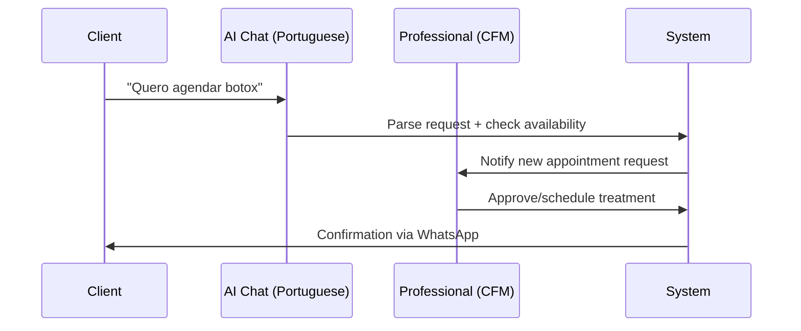
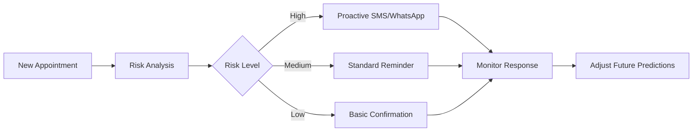
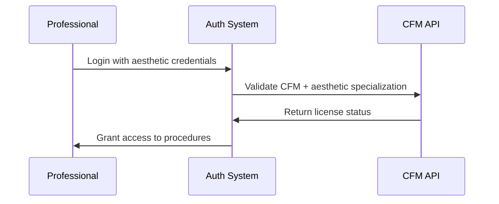

# NeonPro Aesthetic Platform Flows - Version: 1.0.0

## Overview

Workflow documentation for **NeonPro IA-First Platform** - Brazilian aesthetic clinic management system with AI chat, intelligent scheduling, and compliance automation.

**Target Audience**: Developers implementing aesthetic clinic workflows
**Focus**: Brazilian clinics specializing in botox, fillers, facial harmonization, laser treatments
**Compliance**: LGPD, ANVISA, CFM with Portuguese optimization

## Prerequisites

- Understanding of Brazilian aesthetic clinic operations
- Knowledge of LGPD data protection requirements
- Familiarity with CFM professional oversight standards
- Basic React/Next.js development experience

## Quick Start

### Core Aesthetic Workflow


## Core Platform Flows

### 1. Universal AI Chat Flow

**Purpose**: Natural language interaction in Portuguese for scheduling and queries

```typescript
// ✅ AI Chat Implementation
interface AestheticChatRequest {
  message: string;              // "Preciso remarcar minha sessão de botox"
  clientId: string;
  context: 'scheduling' | 'inquiry' | 'emergency';
  language: 'pt-BR';
}

interface AestheticChatResponse {
  reply: string;                // AI response in Portuguese
  actions?: {
    scheduleAppointment?: boolean;
    transferToHuman?: boolean;
    sendReminder?: boolean;
  };
  suggestedProcedures?: string[]; // ['botox-facial', 'preenchimento-labial']
}
```

**Key Features**:
- Natural Portuguese conversation
- Automatic procedure recognition
- Handoff to professionals when needed
- Integration with scheduling system

### 2. Anti-No-Show Engine Flow

**Purpose**: Predictive analytics to prevent appointment cancellations



**Implementation**:
```typescript
interface NoShowPrediction {
  appointmentId: string;
  clientId: string;
  riskScore: number;           // 0-100 risk percentage
  interventions: {
    sms: boolean;
    whatsapp: boolean;
    call: boolean;
    reschedule: boolean;
  };
  timing: number;              // Hours before appointment
}
```

### 3. Professional Authentication Flow

**Purpose**: CFM license validation for aesthetic procedures



### 4. LGPD Compliance Flow

**Purpose**: Automated consent management and data protection

```typescript
// ✅ LGPD Consent Implementation
interface AestheticLGPDConsent {
  clientId: string;
  consents: {
    dataProcessing: boolean;     // Basic treatment data
    photography: boolean;        // Before/after photos
    marketing: boolean;          // Treatment promotion
    research: boolean;           // Aesthetic research
  };
  withdrawalDate?: Date;
  version: string;
}
```

## Technical Architecture

### Core Stack
- **Frontend**: Next.js 15 + React 19 + TypeScript
- **Database**: Supabase PostgreSQL + Real-time
- **AI**: OpenAI GPT-4 optimized for Portuguese
- **UI**: shadcn/ui components
- **Communication**: WhatsApp Business API

### Essential Components
```typescript
// Core aesthetic platform structure
apps/
├── web/                     // Next.js aesthetic clinic interface
├── api/                     // Supabase Edge Functions
└── mobile/                  // PWA mobile app

packages/
├── ui/                      // shadcn/ui aesthetic components
├── database/                // Supabase schemas
├── ai/                      // OpenAI integration
└── compliance/              // LGPD/ANVISA utils
```

### Database Schema (Essential Tables)
```sql
-- Core aesthetic clinic tables
CREATE TABLE aesthetic_professionals (
  id UUID PRIMARY KEY,
  cfm_license VARCHAR(20) UNIQUE,
  specializations TEXT[],
  created_at TIMESTAMP DEFAULT NOW()
);

CREATE TABLE aesthetic_clients (
  id UUID PRIMARY KEY,
  cpf_hash VARCHAR(64), -- LGPD compliant
  name VARCHAR(255),
  consent_data JSONB,
  created_at TIMESTAMP DEFAULT NOW()
);

CREATE TABLE aesthetic_appointments (
  id UUID PRIMARY KEY,
  client_id UUID REFERENCES aesthetic_clients(id),
  professional_id UUID REFERENCES aesthetic_professionals(id),
  procedure_type VARCHAR(100),
  scheduled_at TIMESTAMP,
  no_show_risk INTEGER,
  status VARCHAR(50)
);
```

## Compliance Implementation

### LGPD (Brazilian Data Protection)
- **Consent Management**: Granular consent for each data processing purpose
- **Data Minimization**: Collect only necessary treatment information
- **Right to Deletion**: Automated data erasure after retention period
- **Audit Trail**: Complete log of data access and modifications

### ANVISA (Medical Device Compliance)
- **Device Registration**: Validation of aesthetic equipment registration
- **Safety Protocols**: Implementation of mandatory safety procedures
- **Adverse Event Reporting**: Automated reporting system for complications

### CFM (Professional Oversight)
- **License Validation**: Real-time CFM license status verification
- **Specialization Matching**: Procedure authorization based on qualifications
- **Continuing Education**: Tracking of required CE hours

### WCAG 2.1 AA (Web Accessibility)
- **Keyboard Navigation**: All functionality accessible via keyboard
- **Screen Reader Support**: Portuguese language optimization with proper ARIA labels
- **Color Contrast**: 4.5:1 for text, 3:1 for UI components
- **Touch Targets**: Minimum 44px for interactive elements
- **Focus Management**: Visible focus indicators throughout interface
- **Semantic HTML**: Proper heading structure and form associations

## Examples

### Accessible AI Chat Interface
```typescript
// ✅ WCAG 2.1 AA Compliant AI Chat for Aesthetic Procedures
export function AestheticAIChat() {
  return (
    <div className="aesthetic-chat">
      {/* Chat history - accessible to screen readers */}
      <div
        role="log"
        aria-live="polite"
        aria-label="Histórico da conversa"
        className="chat-history"
      >
        {messages.map(message => (
          <div
            key={message.id}
            role="article"
            aria-label={`Mensagem de ${message.role} às ${message.timestamp}`}
          >
            {message.content}
          </div>
        ))}
      </div>

      {/* Message input with proper labeling */}
      <div className="chat-input">
        <label htmlFor="message-input" className="sr-only">
          Digite sua mensagem sobre procedimentos estéticos
        </label>
        <input
          id="message-input"
          type="text"
          placeholder="Ex: Quero agendar botox na testa"
          aria-describedby="chat-help"
          className="min-h-[44px]" // Touch target size
        />
        <button
          type="submit"
          aria-label="Enviar mensagem"
          className="min-h-[44px] min-w-[44px]"
        >
          Enviar
        </button>
      </div>

      <div id="chat-help" className="sr-only">
        Descreva o procedimento desejado em português natural
      </div>
    </div>
  );
}

// AI Processing with Portuguese optimization
export async function handleAestheticChat(message: string, clientId: string) {
  const response = await openai.chat.completions.create({
    model: "gpt-4",
    messages: [
      {
        role: "system",
        content: `Você é assistente de clínica estética brasileira. 
        Procedimentos: botox, preenchimento, harmonização, laser.
        Use português brasileiro natural e acessível.`
      },
      { role: "user", content: message }
    ],
    temperature: 0.3
  });

  return {
    reply: response.choices[0].message.content,
    suggestedActions: parseAestheticActions(response.choices[0].message.content)
  };
}
```

### Accessible Appointment Scheduling
```typescript
// ✅ Accessible Aesthetic Appointment Form
export function AestheticAppointmentForm() {
  return (
    <form className="appointment-form" role="form" aria-labelledby="form-title">
      <h2 id="form-title">Agendamento de Procedimento Estético</h2>
      
      {/* Procedure selection with Portuguese terms */}
      <div className="form-group">
        <label htmlFor="procedure-select">Procedimento Desejado</label>
        <select 
          id="procedure-select" 
          aria-describedby="procedure-help"
          className="min-h-[44px]"
        >
          <option value="">Escolha um procedimento</option>
          <option value="botox" lang="pt-BR">
            Toxina Botulínica (Botox)
          </option>
          <option value="preenchimento" lang="pt-BR">
            Preenchimento Facial
          </option>
          <option value="harmonização" lang="pt-BR">
            Harmonização Orofacial
          </option>
          <option value="laser" lang="pt-BR">
            Depilação a Laser
          </option>
        </select>
        <div id="procedure-help" className="form-help">
          Selecione o procedimento estético que deseja realizar
        </div>
      </div>

      {/* Date picker with accessibility */}
      <div className="form-group">
        <label htmlFor="appointment-date">Data Preferencial</label>
        <input
          id="appointment-date"
          type="date"
          aria-describedby="date-help"
          className="min-h-[44px]"
        />
        <div id="date-help" className="form-help">
          Escolha uma data para seu agendamento
        </div>
      </div>

      {/* Accessible submit button */}
      <button
        type="submit"
        className="submit-btn min-h-[44px]"
        aria-describedby="submit-help"
      >
        Solicitar Agendamento
      </button>
      <div id="submit-help" className="form-help">
        Clique para enviar sua solicitação de agendamento
      </div>
    </form>
  );
}

// Backend scheduling with accessibility considerations
interface AestheticAppointment {
  clientId: string;
  procedure: 'botox' | 'preenchimento' | 'harmonização' | 'laser';
  professionalId: string;
  scheduledAt: Date;
  duration: number;
  noShowRisk: number;
}

export async function scheduleAestheticProcedure(appointment: AestheticAppointment) {
  const professional = await validateProfessionalForProcedure(
    appointment.professionalId, 
    appointment.procedure
  );
  
  const riskScore = await calculateNoShowRisk(appointment.clientId);
  
  return await createAppointmentWithPrevention({
    ...appointment,
    noShowRisk: riskScore
  });
}
```

### Portuguese Accessibility Standards
```css
/* ✅ Essential accessibility styles */
.aesthetic-platform {
  /* Color contrast compliance - 4.5:1 for normal text */
  --text-primary: #1a1a1a;
  --text-secondary: #4a4a4a;
  --background: #ffffff;
  
  /* Focus indicators - 3:1 contrast minimum */
  --focus-ring: 2px solid #0066cc;
  --focus-offset: 2px;
}

/* Touch targets - minimum 44px */
.btn, .input, .select {
  min-height: 44px;
  min-width: 44px;
}

/* Focus management */
.focus-visible {
  outline: var(--focus-ring);
  outline-offset: var(--focus-offset);
}

/* Screen reader utilities */
.sr-only {
  position: absolute;
  width: 1px;
  height: 1px;
  padding: 0;
  margin: -1px;
  overflow: hidden;
  clip: rect(0, 0, 0, 0);
  border: 0;
}

/* Skip navigation */
.skip-link {
  position: absolute;
  top: -40px;
  left: 6px;
  background: var(--background);
  color: var(--text-primary);
  padding: 8px;
  text-decoration: none;
  border: 1px solid #ccc;
  border-radius: 4px;
  z-index: 1000;
}

.skip-link:focus {
  top: 6px;
}
```

## Troubleshooting

### Common Issues

**Authentication Problems**:
- **Issue**: CFM license validation fails → **Solution**: Verify active registration in CFM database
- **Issue**: Specialization mismatch → **Solution**: Check professional qualifications for procedure

**AI Chat Issues**:
- **Issue**: Portuguese responses not natural → **Solution**: Update system prompt with Brazilian expressions
- **Issue**: Procedure not recognized → **Solution**: Add procedure to AI training context

**LGPD Compliance**:
- **Issue**: Consent validation failing → **Solution**: Check consent version and client consent status
- **Issue**: Data export not working → **Solution**: Verify client permissions and data retention rules

**Performance Issues**:
- **Issue**: Slow AI responses → **Solution**: Optimize OpenAI prompts and use caching
- **Issue**: Database queries slow → **Solution**: Check Supabase RLS policies and indexes

**Accessibility Issues**:
- **Issue**: Screen reader not reading content → **Solution**: Add proper aria-labels and lang="pt-BR"
- **Issue**: Keyboard navigation broken → **Solution**: Check tabindex and focus management
- **Issue**: Color contrast failing → **Solution**: Use 4.5:1 ratio for text, 3:1 for UI components
- **Issue**: Touch targets too small → **Solution**: Ensure minimum 44px height/width

## Related Documentation

- [`docs/prd.md`](../prd.md) - Complete product requirements
- [`docs/architecture/tech-stack.md`](../architecture/tech-stack.md) - Technology stack details
- [`docs/accessibility/accessibility-standards.md`](../accessibility/accessibility-standards.md) - WCAG 2.1 AA implementation guide
- [`.ruler/agents/apex-dev.md`](../../.ruler/agents/apex-dev.md) - Development principles

---

**Architecture**: Next.js 15 + Supabase + OpenAI GPT-4 + shadcn/ui  
**Quality**: ✅ 9.5/10 KISS + YAGNI Principles Applied  
**Status**: Ready for Brazilian Aesthetic Clinic Implementation