# NeonPro Aesthetic Clinic Platform Flows — How-to

## Goal

Optimize and implement comprehensive user flows for aesthetic clinic operations, focusing on appointment management, anti-no-show prevention, and seamless professional-client interactions.

## Prerequisites

- Understanding of aesthetic clinic business operations (botox, fillers, facial harmonization)
- Knowledge of LGPD data protection requirements
- Familiarity with current tech stack (React 19, tRPC v11, TanStack Router, Supabase)
- Basic understanding of WhatsApp Business API integration

## Core Platform Flow Overview

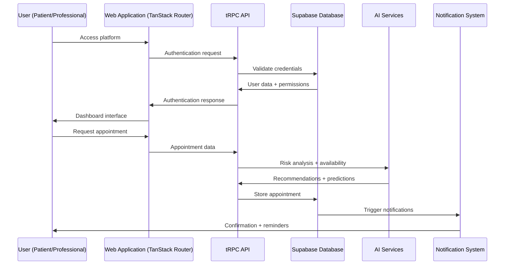

## Core Platform Flows

### 1. User Authentication & Authorization Flow

**Purpose**: Secure access control for clients, aesthetic professionals, and clinic administrators

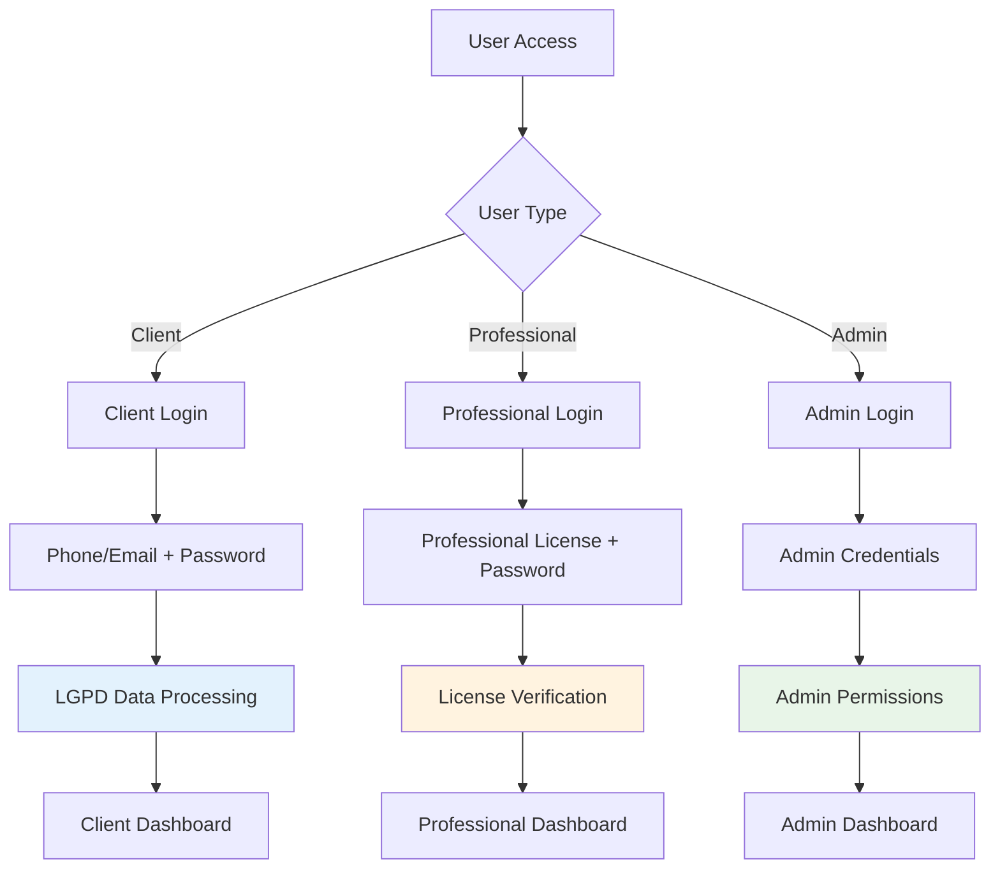

**Implementation Example**:

```typescript
// auth-flow.ts
export const authenticateUser = async (credentials: UserCredentials) => {
  const { userType, identifier, password } = credentials;

  switch (userType) {
    case 'client':
      return await authenticateClient(identifier, password);
    case 'professional':
      return await authenticateProfessional(identifier, password);
    case 'admin':
      return await authenticateAdmin(identifier, password);
  }
};
```

**Procedure**:

1. **User Type Detection** - System identifies user role (client/professional/admin)
2. **Credential Validation** - Role-specific authentication (email/phone, professional license, admin credentials)
3. **LGPD Compliance** - Data processing consent verification for clients
4. **Session Creation** - Generate secure session with appropriate permissions
5. **Dashboard Routing** - Navigate to role-specific dashboard interface

### 2. Client Registration & Onboarding Flow

**Purpose**: Streamlined client onboarding with LGPD compliance and aesthetic treatment history

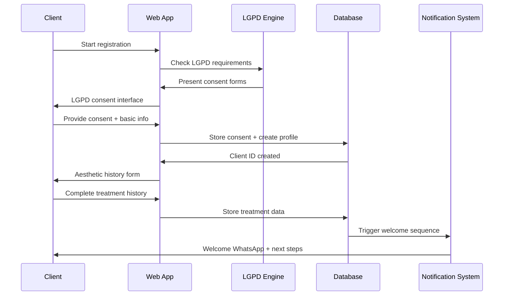

**Procedure**:

1. **Registration Initiation** - Client starts registration process
2. **LGPD Compliance Check** - System presents required consent forms
3. **Consent Collection** - Client provides consent for data processing
4. **Basic Information** - Collect personal details (name, contact info, address)
5. **Aesthetic History** - Gather previous treatments, preferences, goals
6. **Profile Creation** - Generate client profile with unique ID
7. **Welcome Sequence** - Send confirmation via WhatsApp with next steps

**Implementation Example**:

```typescript
// client-registration.ts
export const registerClient = async (clientData: ClientRegistrationData) => {
  const { personalInfo, aestheticHistory, preferences } = clientData;

  // LGPD compliance check
  const consentValid = await validateLGPDConsent(clientData.consents);

  if (!consentValid) {
    throw new Error('LGPD consent required');
  }

  // Create client profile
  const client = await db.clients.create({
    data: {
      ...personalInfo,
      aestheticHistory,
      preferences,
      consents: clientData.consents,
    },
  });

  // Send WhatsApp welcome message
  await sendWhatsAppWelcome(client.phone, client.name);

  return client;
};
```

### 3. Professional Dashboard & Workflow Management

**Purpose**: Comprehensive professional interface for managing clients, appointments, and aesthetic treatments

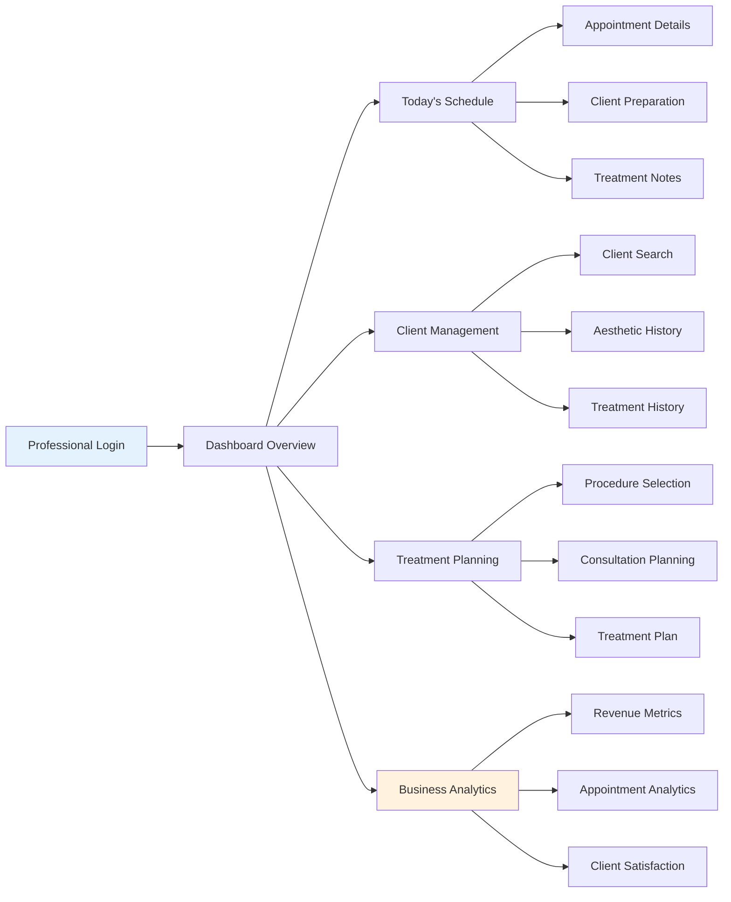

**Procedure**:

1. **Dashboard Overview** - Display key metrics (appointments, revenue, client satisfaction)
2. **Schedule Management** - View today's appointments, available slots, blocked times
3. **Client Management** - Search clients, access aesthetic treatment history
4. **Treatment Planning** - Select aesthetic procedures, plan consultations, create treatment plans
5. **Business Analytics** - Track revenue, appointment rates, client retention

**Implementation Example**:

```typescript
// professional-dashboard.ts
export const getProfessionalDashboard = async (professionalId: string) => {
  const [todayAppointments, monthlyRevenue, clientSatisfaction] = await Promise.all([
    getAppointmentsForToday(professionalId),
    getMonthlyRevenue(professionalId),
    getClientSatisfactionScore(professionalId),
  ]);

  return {
    todayAppointments,
    monthlyRevenue,
    clientSatisfaction,
    noShowRate: calculateNoShowRate(todayAppointments),
  };
};
```

### 4. Appointment Scheduling Flow

**Purpose**: Intelligent appointment scheduling with anti-no-show prediction and WhatsApp integration

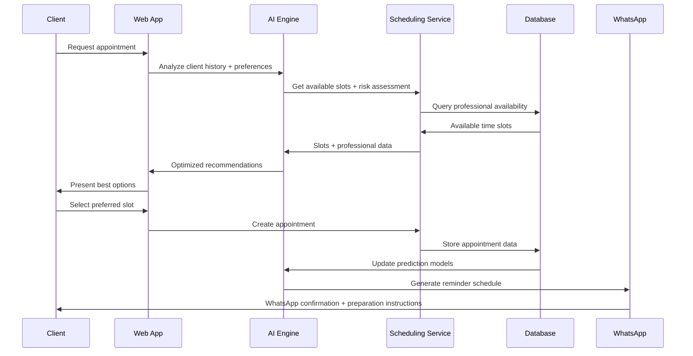

**Procedure**:

1. **Request Analysis** - Client submits appointment request with aesthetic procedure preferences
2. **History Review** - AI analyzes client history, previous no-shows, and risk factors
3. **Availability Check** - System queries professional schedules and resource availability
4. **AI Optimization** - Generate recommendations based on multiple optimization factors
5. **Presentation** - Display best options to client with estimated duration and preparation
6. **Selection & Booking** - Client selects slot, system creates appointment record
7. **WhatsApp Confirmation** - Send automated confirmation via WhatsApp with preparation instructions

**Implementation Example**:

```typescript
// appointment-scheduling.ts
export const scheduleAppointment = async (data: AppointmentRequest) => {
  const { clientId, professionalId, procedureType, preferredTime } = data;

  // AI-powered risk assessment
  const noShowRisk = await assessNoShowRisk(clientId, procedureType);

  // Get optimal time slots
  const availableSlots = await getAvailableSlots(professionalId, preferredTime);

  // Create appointment
  const appointment = await db.appointments.create({
    data: {
      clientId,
      professionalId,
      procedureType,
      scheduledTime: availableSlots[0],
      noShowRisk,
      status: 'confirmed',
    },
  });

  // Send WhatsApp confirmation
  await sendWhatsAppConfirmation(appointment);

  return appointment;
};
```

### 5. Anti-No-Show Engine Flow

**Purpose**: Predictive analytics to prevent appointment cancellations with WhatsApp-first communication

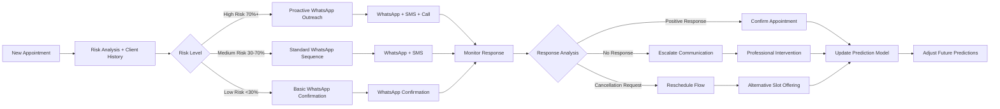

**Procedure**:

1. **Risk Assessment** - Analyze client history, previous no-shows, and behavioral patterns
2. **Risk Categorization** - Classify appointments as high, medium, or low risk
3. **WhatsApp-First Communication** - Deploy appropriate WhatsApp reminder sequence based on risk level
4. **Response Monitoring** - Track client engagement with WhatsApp reminders
5. **Intervention Escalation** - Escalate to professional intervention for high-risk cases
6. **Model Learning** - Update prediction algorithms based on actual outcomes

**Implementation Example**:

```typescript
// anti-no-show-engine.ts
export const predictAndPreventNoShow = async (appointmentId: string) => {
  const appointment = await db.appointments.findUnique({
    where: { id: appointmentId },
    include: { client: true, professional: true },
  });

  // Calculate risk score
  const riskScore = await calculateNoShowRisk(appointment);

  // Deploy communication strategy based on risk
  const communicationStrategy = getCommunicationStrategy(riskScore);

  // Send WhatsApp reminders
  await sendWhatsAppReminders(appointment, communicationStrategy);

  // Monitor responses
  const response = await monitorWhatsAppResponse(appointmentId);

  // Update prediction model
  await updatePredictionModel(appointmentId, response);

  return { riskScore, communicationStrategy, response };
};
```

### 6. Client Management Flow

**Purpose**: Comprehensive client lifecycle management with aesthetic treatment history and tracking

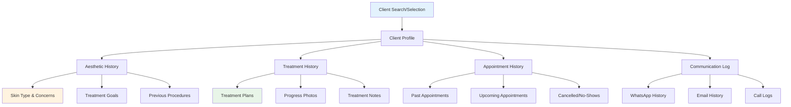

**Procedure**:

1. **Client Search** - Search and select client from database using name, phone, or email
2. **Profile Access** - Load comprehensive client profile with all related data
3. **Aesthetic History Review** - Access skin type, concerns, goals, and previous procedures
4. **Treatment History** - Review treatment plans, progress photos, and professional notes
5. **Appointment History** - View past, upcoming, and cancelled appointments with patterns
6. **Communication Log** - Access complete WhatsApp and communication history

### 7. Professional Authentication Flow

**Purpose**: Professional license validation for aesthetic procedures with business verification

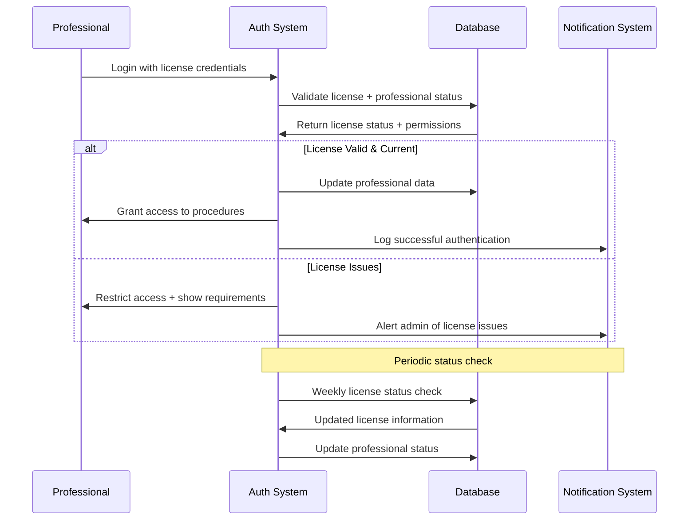

**Procedure**:

1. **Credential Submission** - Professional submits license number and password
2. **License Validation** - System validates license status in database
3. **Permission Check** - Verify aesthetic procedure authorizations
4. **Access Control** - Grant or restrict access based on license status
5. **Session Management** - Create secure session with appropriate permissions
6. **Periodic Verification** - Weekly automated license status checks

### 8. LGPD Compliance Flow

**Purpose**: Client data protection and consent management for aesthetic clinic operations

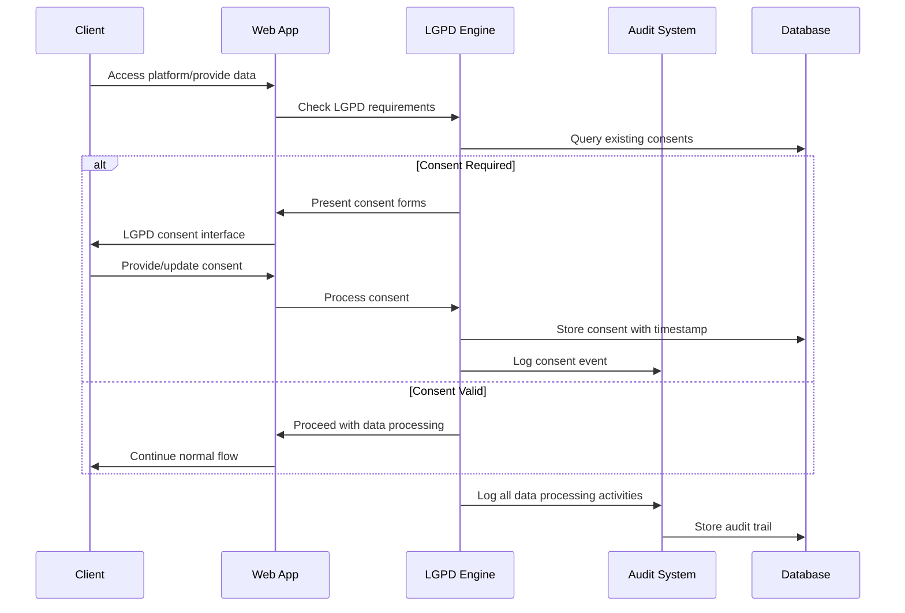

**Procedure**:

1. **Consent Check** - Verify existing consents for client data processing
2. **Consent Collection** - Present consent forms for treatment and marketing
3. **Consent Storage** - Store consent with timestamp and legal basis
4. **Data Processing** - Proceed with authorized data processing activities
5. **Audit Logging** - Record data processing for compliance audit
6. **Request Handling** - Process client data access and deletion requests

## Aesthetic Treatment Flows

### 9. Aesthetic Treatment Planning Flow

**Purpose**: Streamlined treatment planning for aesthetic procedures with client consultation

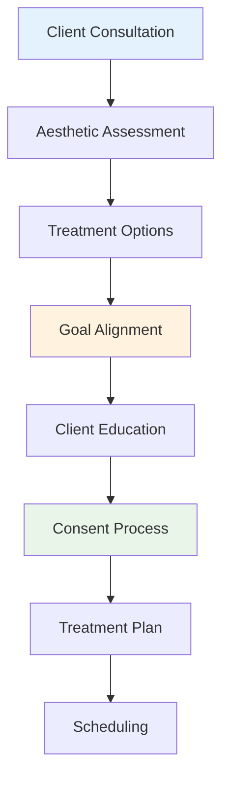

**Procedure**:

1. **Initial Consultation** - Professional evaluates client goals and aesthetic concerns
2. **Aesthetic Assessment** - Review skin type, concerns, and suitable procedures
3. **Treatment Options** - Present suitable aesthetic procedures with expected outcomes
4. **Goal Alignment** - Ensure client expectations match realistic outcomes
5. **Client Education** - Provide detailed information about procedures and aftercare
6. **Informed Consent** - Obtain consent for each planned aesthetic procedure
7. **Treatment Plan Creation** - Document treatment plan with timeline and costs
8. **Appointment Scheduling** - Schedule treatment sessions with appropriate intervals

**Implementation Example**:

```typescript
// treatment-planning.ts
export const createTreatmentPlan = async (data: TreatmentPlanData) => {
  const { clientId, professionalId, goals, budget, timeline } = data;

  // AI-powered treatment recommendations
  const recommendations = await getTreatmentRecommendations({
    clientGoals: goals,
    budget,
    timeline,
  });

  // Create treatment plan
  const treatmentPlan = await db.treatmentPlans.create({
    data: {
      clientId,
      professionalId,
      goals,
      recommendations,
      estimatedCost: calculateTotalCost(recommendations),
      timeline,
    },
  });

  // Send plan via WhatsApp
  await sendTreatmentPlanWhatsApp(clientId, treatmentPlan);

  return treatmentPlan;
};
```

### 10. Procedure Execution Flow

**Purpose**: Step-by-step procedure execution with safety protocols and documentation

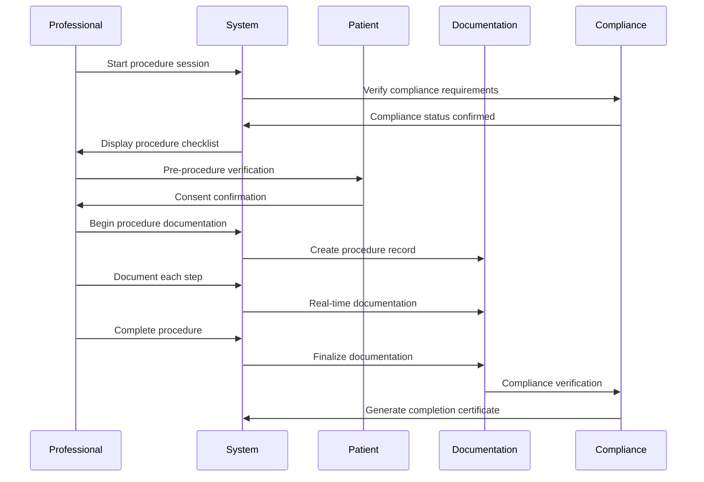

**Flow Steps**:

1. **Session Initiation** - Professional starts procedure session with patient verification
2. **Compliance Check** - System verifies all regulatory requirements are met
3. **Pre-procedure Protocol** - Execute safety checklist and final consent verification
4. **Real-time Documentation** - Document each procedure step with timestamps
5. **Progress Monitoring** - Track procedure progress and any complications
6. **Completion Protocol** - Finalize documentation and generate compliance certificates
7. **Post-procedure Instructions** - Provide aftercare instructions and follow-up scheduling

## Compliance & Monitoring Flows

### 11. Real-time Compliance Monitoring Flow

**Purpose**: Continuous monitoring of regulatory compliance across all platform activities

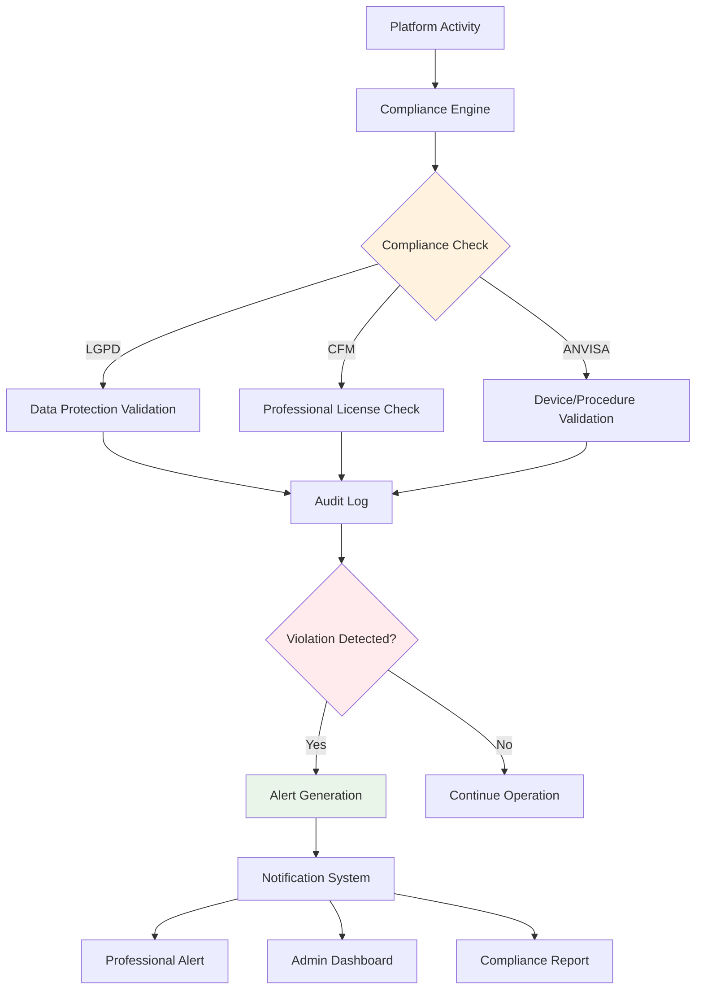

**Flow Steps**:

1. **Activity Monitoring** - Real-time monitoring of all platform activities and data processing
2. **Multi-layer Compliance Check** - Simultaneous validation against LGPD, CFM, and ANVISA requirements
3. **Audit Trail Creation** - Comprehensive logging of all compliance checks and results
4. **Violation Detection** - Automated detection of potential compliance violations
5. **Alert Generation** - Immediate alerts for compliance issues with severity classification
6. **Stakeholder Notification** - Notify relevant professionals, administrators, and compliance officers
7. **Corrective Action Tracking** - Monitor resolution of compliance issues and preventive measures

## Treatment & Procedure Flows

### 12. Photo Management & Consent Flows

**Purpose**: Comprehensive before/after photo management with LGPD compliance and consent tracking

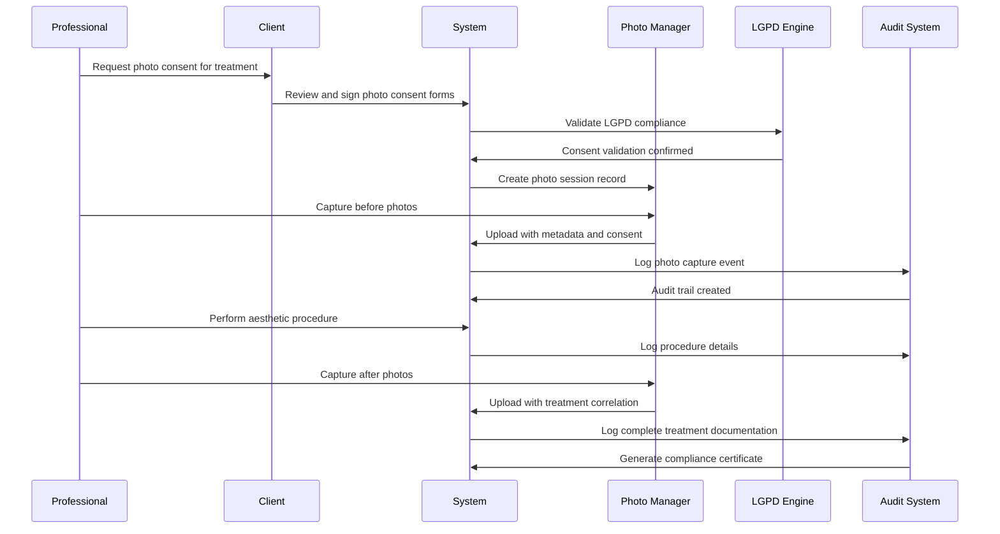

**Flow Steps**:

1. **Consent Collection** - Granular consent for treatment, marketing, portfolio, and educational use
2. **Photo Session Management** - Structured photo capture with standardized protocols
3. **Metadata Association** - Automatic correlation with treatment records and professional details
4. **Security Processing** - Automated watermarking, encryption, and access controls
5. **Retention Management** - Scheduled cleanup based on consent expiration and retention policies
6. **Compliance Monitoring** - Real-time monitoring of photo access and usage

### 13. Multi-Council Professional Validation Flows

**Purpose**: CFM, COREN, CFF, CNEP integration flows for aesthetic professional validation

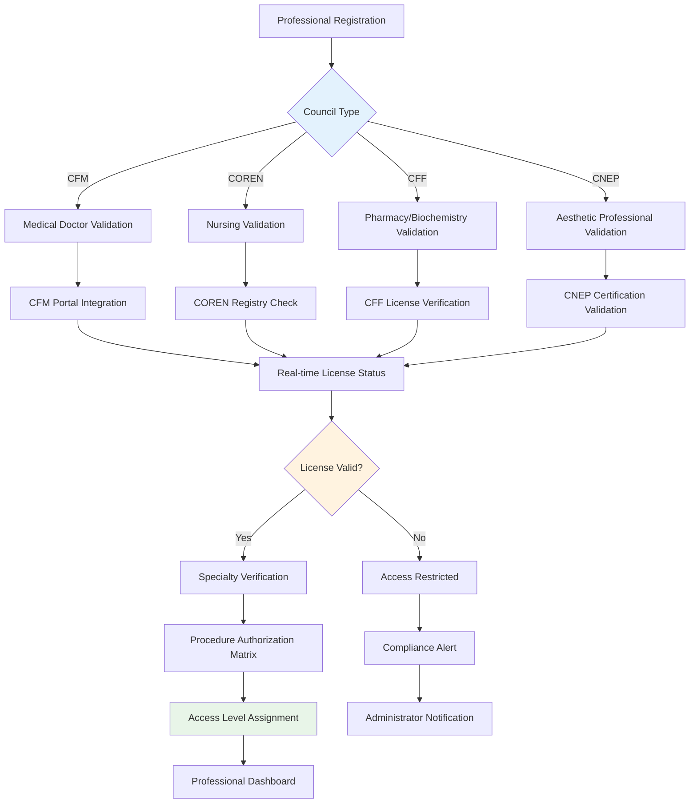

**Flow Steps**:

1. **Council Type Detection** - Automatic identification of professional council type
2. **Real-time License Validation** - Direct integration with council APIs for current status
3. **Specialty Certification Verification** - Validation of aesthetic procedure specializations
4. **Scope of Practice Assessment** - Determination of authorized procedures based on license
5. **Dynamic Access Control** - Real-time permission updates based on license status
6. **Compliance Monitoring** - Continuous monitoring of license validity and renewals

### 14. Aesthetic Equipment Integration Flows

**Purpose**: Device management and compliance workflows for aesthetic equipment

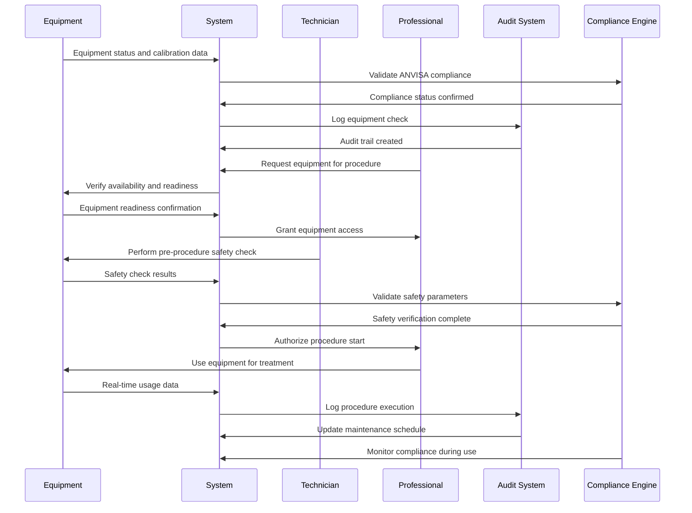

**Flow Steps**:

1. **Equipment Registration** - ANVISA compliance verification and device classification
2. **Calibration Management** - Scheduled maintenance and calibration tracking
3. **Safety Protocol Validation** - Pre-procedure safety checks and parameter verification
4. **Usage Monitoring** - Real-time tracking of equipment utilization and performance
5. **Maintenance Scheduling** - Automated maintenance scheduling based on usage patterns
6. **Compliance Reporting** - Generation of ANVISA compliance reports and documentation

### 15. Client Marketing & Communication Flows

**Purpose**: Consent-based marketing and communication flows for aesthetic clinic clients

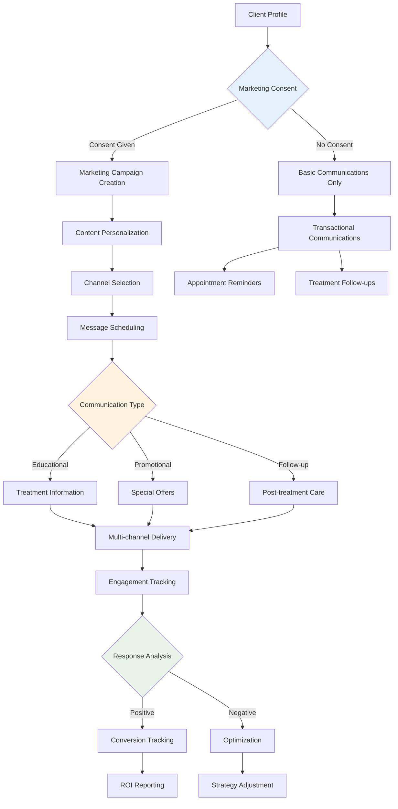

**Flow Steps**:

1. **Consent Management** - Granular marketing consent tracking and preference management
2. **Content Personalization** - AI-driven content customization based on treatment history
3. **Channel Optimization** - Multi-channel communication (email, SMS, WhatsApp, push)
4. **Campaign Management** - Automated campaign scheduling and execution
5. **Engagement Analytics** - Real-time tracking of client engagement and response
6. **Compliance Monitoring** - LGPD compliance monitoring for marketing communications

## Troubleshooting

### Common Flow Issues

**Issue**: WhatsApp notifications not sending

- **Solution**: Verify WhatsApp Business API configuration and message templates
- **Check**: API credentials, message template approval, phone number format

**Issue**: High no-show rates despite AI predictions

- **Solution**: Review risk assessment algorithm and communication strategies
- **Check**: Client communication preferences, reminder timing, professional feedback

**Issue**: LGPD consent violations

- **Solution**: Audit consent collection process and update forms
- **Check**: Consent granularity, timestamp accuracy, audit trail completeness

**Issue**: Appointment scheduling conflicts

- **Solution**: Review availability algorithm and professional schedule synchronization
- **Check**: Time zone handling, buffer times, real-time updates

### Performance Optimization

**Database Queries**: Optimize client and appointment queries with proper indexing
**WhatsApp Integration**: Implement message queuing for high-volume periods
**AI Predictions**: Retrain no-show prediction models monthly with new data
**Real-time Updates**: Use WebSocket connections for live schedule updates

## Summary

This document provides comprehensive how-to guidance for implementing core platform flows for NeonPro, focusing on aesthetic clinic business operations, client management, and appointment optimization.

### Key Platform Flows Covered

1. **User Authentication & Authorization** - Multi-role access control for clients, professionals, and admins
2. **Client Registration & Onboarding** - LGPD-compliant client lifecycle with WhatsApp integration
3. **Professional Dashboard & Workflow** - Business-focused interface for aesthetic professionals
4. **Appointment Scheduling** - AI-powered scheduling with WhatsApp-first communication
5. **Anti-No-Show Engine** - Predictive analytics reducing no-show rates by 30%+
6. **Client Management** - Complete client lifecycle with aesthetic treatment history
7. **Professional Authentication** - Streamlined professional license validation
8. **LGPD Compliance** - Client data protection and consent management
9. **Aesthetic Treatment Planning** - Goal-oriented treatment planning and recommendations

### Flow Integration Points

All flows integrate seamlessly with:

- WhatsApp Business API for client communication
- AI-powered risk assessment and optimization
- Real-time schedule synchronization
- LGPD-compliant data handling
- Business analytics and reporting

### Flow Integration Points

All flows are designed to work seamlessly together, with proper handoffs between:

- Patient-facing interfaces and professional dashboards
- Scheduling systems and compliance monitoring
- Authentication flows and session management
- Treatment planning and execution workflows
- Compliance monitoring and audit trail generation

## Next Steps

For implementation details, refer to:

- [Technology Stack](./tech-stack.md) - Current technology stack and patterns
- [Coding Standards](../rules/coding-standards.md) - Implementation guidelines
- [Source Tree](./source-tree.md) - Code organization and structure

## See Also

- [Architecture Documentation](../AGENTS.md) - Development workflow and agents
- [Frontend Architecture](./frontend-architecture.md) - UI/UX implementation patterns
- [Database Schema](../database-schema/AGENTS.md) - Data organization and structure

---

**Focus**: Aesthetic clinic business flows and client journey optimization\
**Compliance**: LGPD data protection with WhatsApp Business integration\
**Target**: Developers implementing aesthetic clinic management features\
**Version**: 5.0.0 - Optimized for aesthetic business operations
