# NeonPro Platform Flows

## Overview

This document defines the **core user flows and platform interactions** for NeonPro, an AI-first aesthetic clinic management platform. It focuses exclusively on workflow sequences, user journeys, and platform-specific interaction patterns.

**Scope**: Platform flows, user journeys, and workflow sequences
**Target Audience**: Developers implementing user flows and business logic
**Focus**: Brazilian aesthetic clinics (botox, fillers, facial harmonization, laser treatments)
**Compliance Context**: LGPD, ANVISA, CFM requirements integrated into flows

> **Note**: For system architecture see [architecture.md](./architecture.md), for technology details see [tech-stack.md](./tech-stack.md)

## Prerequisites

- Understanding of Brazilian aesthetic clinic operations
- Knowledge of LGPD data protection workflow requirements
- Familiarity with CFM professional oversight standards
- Basic understanding of the current tech stack (TanStack Router + Vite + Hono)

## Core Platform Flow Overview

## Core Platform Flows

### 1. User Authentication & Authorization Flow

**Purpose**: Secure access control for patients, professionals, and administrators

**Flow Steps**:

1. **User Type Detection** - System identifies user role (patient/professional/admin)
2. **Credential Validation** - Role-specific authentication (CPF, CFM license, admin credentials)
3. **Compliance Checks** - LGPD consent verification, CFM license validation
4. **Session Creation** - Generate secure session with appropriate permissions
5. **Dashboard Routing** - Navigate to role-specific dashboard interface

### 2. Patient Registration & Onboarding Flow

**Purpose**: Comprehensive patient onboarding with LGPD compliance and medical history collection

**Flow Steps**:

1. **Registration Initiation** - Patient starts registration process
2. **LGPD Compliance Check** - System presents required consent forms
3. **Consent Collection** - Patient provides granular consent for data processing
4. **Basic Information** - Collect personal details (CPF, contact info, address)
5. **Medical History** - Gather allergies, medications, previous treatments
6. **Profile Creation** - Generate patient profile with unique ID
7. **Welcome Sequence** - Send confirmation and onboarding materials

### 3. Professional Dashboard & Workflow Management

**Purpose**: Comprehensive professional interface for managing patients, appointments, and treatments

**Flow Steps**:

1. **Dashboard Overview** - Display key metrics (appointments, revenue, compliance status)
2. **Schedule Management** - View today's appointments, available slots, blocked times
3. **Patient Management** - Search patients, access medical/treatment history
4. **Treatment Planning** - Select procedures, assess risks, create treatment plans
5. **Compliance Monitoring** - Track CFM license status, ANVISA requirements, LGPD tasks

### 4. Appointment Scheduling Flow

**Purpose**: Intelligent appointment scheduling with anti-no-show prediction and optimization

**Flow Steps**:

1. **Request Analysis** - Patient submits appointment request with procedure type and preferences
2. **History Review** - AI analyzes patient history, previous no-shows, and risk factors
3. **Availability Check** - System queries professional schedules and resource availability
4. **AI Optimization** - Generate recommendations based on multiple optimization factors
5. **Presentation** - Display best options to patient with estimated duration and preparation
6. **Selection & Booking** - Patient selects slot, system creates appointment record
7. **Prediction Update** - Update AI models with new booking data for future optimization

### 5. Anti-No-Show Engine Flow

**Purpose**: Predictive analytics to prevent appointment cancellations with multi-channel communication

**Flow Steps**:

1. **Risk Assessment** - Analyze patient history, previous no-shows, and behavioral patterns
2. **Risk Categorization** - Classify appointments as high, medium, or low risk
3. **Communication Strategy** - Deploy appropriate reminder sequence based on risk level
4. **Response Monitoring** - Track patient engagement with reminders and confirmations
5. **Intervention Escalation** - Escalate to professional intervention for high-risk cases
6. **Model Learning** - Update prediction algorithms based on actual outcomes

### 6. Patient Management Flow

**Purpose**: Comprehensive patient lifecycle management with medical history and treatment tracking

**Flow Steps**:

1. **Patient Search** - Search and select patient from database using CPF, name, or phone
2. **Profile Access** - Load comprehensive patient profile with all related data
3. **Medical History Review** - Access allergies, conditions, medications, and previous procedures
4. **Treatment History** - Review treatment plans, progress photos, and professional notes
5. **Appointment History** - View past, upcoming, and cancelled appointments with patterns
6. **Communication Log** - Access complete communication history across all channels

### 7. Professional Authentication Flow with CFM Integration

**Purpose**: CFM license validation for aesthetic procedures with real-time verification

**Flow Steps**:

1. **Credential Submission** - Professional submits CFM license number and password
2. **CFM Validation** - System validates license with CFM database in real-time
3. **Specialization Check** - Verify aesthetic procedure specializations and certifications
4. **Access Control** - Grant or restrict access based on license status and specializations
5. **Compliance Logging** - Record authentication events for audit and compliance
6. **Session Management** - Create secure session with appropriate procedure permissions
7. **Periodic Revalidation** - Daily automated checks to ensure continued license validity

### 8. LGPD Compliance Flow

**Purpose**: Automated consent management and data protection with comprehensive audit trail

**Flow Steps**:

1. **Consent Check** - Verify existing consents for specific data processing activities
2. **Consent Collection** - Present granular consent forms for missing permissions
3. **Consent Storage** - Store consent with timestamp, IP address, and legal basis
4. **Data Processing** - Proceed with authorized data processing activities
5. **Audit Logging** - Record all data processing activities for compliance audit
6. **Request Handling** - Process patient data access, rectification, and deletion requests
7. **Compliance Monitoring** - Continuous monitoring of consent validity and data retention

## Treatment & Procedure Flows

### 9. Treatment Planning Flow

**Purpose**: Comprehensive treatment planning with risk assessment and patient education

**Flow Steps**:

1. **Initial Consultation** - Professional evaluates patient goals and medical history
2. **Medical Assessment** - Review contraindications, allergies, and risk factors
3. **Treatment Options** - Present suitable procedures with expected outcomes
4. **Risk Analysis** - AI-powered risk assessment based on patient profile
5. **Patient Education** - Provide detailed information about procedures and aftercare
6. **Informed Consent** - Obtain specific consent for each planned procedure
7. **Treatment Plan Creation** - Document comprehensive treatment plan with timeline
8. **Appointment Scheduling** - Schedule treatment sessions with appropriate intervals

### 10. Procedure Execution Flow

**Purpose**: Step-by-step procedure execution with safety protocols and documentation

```mermaid
sequenceDiagram
    participant P as Professional
    participant S as System
    participant PT as Patient
    participant D as Documentation
    participant C as Compliance

    P->>S: Start procedure session
    S->>C: Verify compliance requirements
    C->>S: Compliance status confirmed
    S->>P: Display procedure checklist
    P->>PT: Pre-procedure verification
    PT->>P: Consent confirmation
    P->>S: Begin procedure documentation
    S->>D: Create procedure record
    P->>S: Document each step
    S->>D: Real-time documentation
    P->>S: Complete procedure
    S->>D: Finalize documentation
    D->>C: Compliance verification
    C->>S: Generate completion certificate
```

**Flow Steps**:

1. **Session Initiation** - Professional starts procedure session with patient verification
2. **Compliance Check** - System verifies all regulatory requirements are met
3. **Pre-procedure Protocol** - Execute safety checklist and final consent verification
4. **Real-time Documentation** - Document each procedure step with timestamps
5. **Progress Monitoring** - Track procedure progress and any complications
6. **Completion Protocol** - Finalize documentation and generate compliance certificates
7. **Post-procedure Instructions** - Provide aftercare instructions and follow-up scheduling

## Compliance & Monitoring Flows

### 11. Real-time Compliance Monitoring Flow

**Purpose**: Continuous monitoring of regulatory compliance across all platform activities

**Flow Steps**:

1. **Activity Monitoring** - Real-time monitoring of all platform activities and data processing
2. **Multi-layer Compliance Check** - Simultaneous validation against LGPD, CFM, and ANVISA requirements
3. **Audit Trail Creation** - Comprehensive logging of all compliance checks and results
4. **Violation Detection** - Automated detection of potential compliance violations
5. **Alert Generation** - Immediate alerts for compliance issues with severity classification
6. **Stakeholder Notification** - Notify relevant professionals, administrators, and compliance officers
7. **Corrective Action Tracking** - Monitor resolution of compliance issues and preventive measures

## Treatment & Procedure Flows

### 12. Photo Management & Consent Flows

**Purpose**: Comprehensive before/after photo management with LGPD compliance and consent tracking

**Flow Steps**:

1. **Consent Collection** - Granular consent for treatment, marketing, portfolio, and educational use
2. **Photo Session Management** - Structured photo capture with standardized protocols
3. **Metadata Association** - Automatic correlation with treatment records and professional details
4. **Security Processing** - Automated watermarking, encryption, and access controls
5. **Retention Management** - Scheduled cleanup based on consent expiration and retention policies
6. **Compliance Monitoring** - Real-time monitoring of photo access and usage

### 13. Multi-Council Professional Validation Flows

**Purpose**: CFM, COREN, CFF, CNEP integration flows for aesthetic professional validation

**Flow Steps**:

1. **Council Type Detection** - Automatic identification of professional council type
2. **Real-time License Validation** - Direct integration with council APIs for current status
3. **Specialty Certification Verification** - Validation of aesthetic procedure specializations
4. **Scope of Practice Assessment** - Determination of authorized procedures based on license
5. **Dynamic Access Control** - Real-time permission updates based on license status
6. **Compliance Monitoring** - Continuous monitoring of license validity and renewals

### 14. Aesthetic Equipment Integration Flows

**Purpose**: Device management and compliance workflows for aesthetic equipment

**Flow Steps**:

1. **Equipment Registration** - ANVISA compliance verification and device classification
2. **Calibration Management** - Scheduled maintenance and calibration tracking
3. **Safety Protocol Validation** - Pre-procedure safety checks and parameter verification
4. **Usage Monitoring** - Real-time tracking of equipment utilization and performance
5. **Maintenance Scheduling** - Automated maintenance scheduling based on usage patterns
6. **Compliance Reporting** - Generation of ANVISA compliance reports and documentation

### 15. Client Marketing & Communication Flows

**Purpose**: Consent-based marketing and communication flows for aesthetic clinic clients

**Flow Steps**:

1. **Consent Management** - Granular marketing consent tracking and preference management
2. **Content Personalization** - AI-driven content customization based on treatment history
3. **Channel Optimization** - Multi-channel communication (email, SMS, WhatsApp, push)
4. **Campaign Management** - Automated campaign scheduling and execution
5. **Engagement Analytics** - Real-time tracking of client engagement and response
6. **Compliance Monitoring** - LGPD compliance monitoring for marketing communications

## Summary

This document provides a comprehensive overview of the core platform flows for NeonPro, focusing exclusively on user journeys, workflow sequences, and business process flows specific to Brazilian aesthetic clinics.

### Key Platform Flows Covered

1. **User Authentication & Authorization** - Multi-role access control with multi-council integration
2. **Patient Registration & Onboarding** - LGPD-compliant patient lifecycle management
3. **Professional Dashboard & Workflow** - Comprehensive professional interface flows
4. **Appointment Scheduling** - AI-powered scheduling with optimization
5. **Anti-No-Show Engine** - Predictive analytics for appointment retention
6. **Patient Management** - Complete patient lifecycle workflows
7. **Professional Authentication** - Multi-council license validation flows
8. **LGPD Compliance** - Automated consent and data protection workflows
9. **Treatment Planning** - Comprehensive treatment planning workflows
10. **Procedure Execution** - Step-by-step procedure documentation flows
11. **Real-time Compliance Monitoring** - Continuous regulatory compliance tracking
12. **Photo Management & Consent** - Before/after photo workflows with LGPD compliance
13. **Multi-Council Professional Validation** - CFM, COREN, CFF, CNEP integration flows
14. **Aesthetic Equipment Integration** - Device management and compliance workflows
15. **Client Marketing & Communication** - Consent-based marketing and communication flows

### Flow Integration Points

All flows are designed to work seamlessly together, with proper handoffs between:

- Patient-facing interfaces and professional dashboards
- Scheduling systems and compliance monitoring
- Authentication flows and session management
- Treatment planning and execution workflows
- Compliance monitoring and audit trail generation

### Next Steps

For implementation details, refer to:

- [System Architecture](./architecture.md) - Technical architecture and patterns
- [Technology Stack](./tech-stack.md) - Technology choices and implementation
- [Frontend Architecture](./frontend-architecture.md) - UI/UX implementation details
- [Source Tree](./source-tree.md) - Code organization and structure

---

**Focus**: Platform flows and user journeys for Brazilian aesthetic clinics\
**Compliance**: LGPD, ANVISA, CFM requirements integrated into workflows\
**Target**: Developers implementing business logic and user experience flows\
**Version**: 4.0.0 - Optimized for platform flows only
