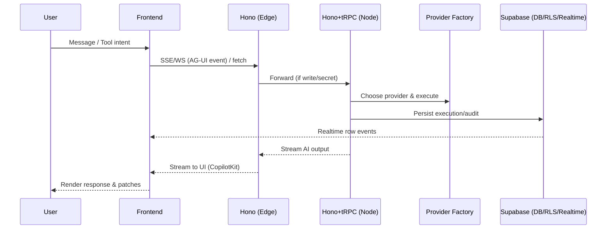

# AI Agents Architecture — Reference

### Core Objectives

- **Healthcare Specialization**: Medical + aesthetic AI services with Brazilian compliance (LGPD, ANVISA, CFM)
- **Real-time Communication**: AG-UI protocol integration with ~16 standard event types for seamless interactions <mcreference link="https://github.com/ag-ui-protocol/ag-ui" index="1">1</mcreference>
- **React Integration**: CopilotKit v1.10.5 hooks with advanced generative UI and human-in-the-loop capabilities <mcreference link="https://github.com/CopilotKit/CopilotKit" index="0">0</mcreference>
- **Multi-Provider Support**: OpenAI GPT-5-mini + Gemini Flash 2.5 with intelligent failover
- **Compliance First**: Built-in Brazilian healthcare regulations at every layer

### Key Design Principles

- **Modularity**: Clear separation of concerns with cohesive AI service modules
- **Type Safety**: End-to-end TypeScript with strict typing for data integrity
- **Extensibility**: Easy addition of new AI providers and specialized services with framework-agnostic approach <mcreference link="https://github.com/ag-ui-protocol/ag-ui" index="1">1</mcreference>
- **Performance**: Optimized for real-time healthcare applications (<2s response time)
- **Security**: End-to-end encryption with comprehensive audit trails

## Unified AI Services Architecture

### System Architecture

┌─────────────────────────────────────────────────────────────────┐
│                     Frontend Layer (React 19)                   │
├─────────────────────────────────────────────────────────────────┤
│  ┌─────────────────┐  ┌─────────────────┐  ┌─────────────────┐  │
│  │   CopilotKit    │  │    AG-UI        │  │   AI Chat UI    │  │
│  │   Integration   │  │    Protocol     │  │   Components    │  │
│  └─────────────────┘  └─────────────────┘  └─────────────────┘  │
└─────────────────────────────────────────────────────────────────┘
                                  │
                   ┌──────────────▼───────────────┐
                   │         AI Gateway           │
                   │    (tRPC + Vercel AI SDK)    │
                   └──────────────┬───────────────┘
                                  │
           ┌──────────────────────┼─────────────────────┐
           │                      │                     │
    ┌──────▼──────┐        ┌──────▼──────┐       ┌──────▼──────┐
    │   Provider  │        │   Clinical  │       │   Protocol  │
    │   Factory   │        │   Services  │       │   Handler   │
    │             │        │             │       │             │
    │ • OpenAI    │        │ • Assessment│       │ • WebSocket │
    │ • Gemini    │        │ • Planning  │       │ • AG-UI     │
    │ • Fallback  │        │ • Decision  │       │ • Real-time │
    └──────┬──────┘        └──────┬──────┘       └──────┬──────┘
           │                      │                     │
           └──────────────────────┼─────────────────────┘
                                  │
                    ┌──────────────▼───────────────┐
                    │      Compliance Layer        │
                    │                              │
                    └──────────────────────────────┘


### Core Components

## 1) Purpose & Scope
- **Purpose**: Provide a single, authoritative specification for AI agent features (chat, tools, workflows) consistent with NeonPro’s front-end and back-end architecture.
- **Scope**: Frontend integration (CopilotKit + AG‑UI), API surface (Hono + tRPC), data plane (Supabase Realtime + RLS), observability, security, performance SLOs.

**Non-goals**: Model training, vendor billing, or infra details beyond Vercel/Supabase defaults.

---

## 2) Normalization vs. Source Documents
The attached architecture materials are authoritative for concepts and flows. We align them with NeonPro’s chosen technologies and **remove mismatches**.

### Reconciled Items
- **Express/Prisma → Hono + tRPC + Supabase**: We replace Express and Prisma references with **Hono (Edge-first)** and **tRPC v11** procedures; DB access via **`@supabase/supabase-js`** with **RLS** and **Realtime**.
- **Vector DB**: May be provided via **pgvector** inside Supabase or an external vector service later (feature-flagged). Default = **deferred** (YAGNI).
- **Redis/Message Queue**: Optional. Default = **off**. Use only when required by throughput or long-running workflows.
- **Multi-provider AI**: Keep **OpenAI (primary)** and **Gemini (fallback)** through a **Provider Factory** at the API layer. The Copilot UI remains provider-agnostic.

### Kept As‑Is (with naming alignment)
- **AG‑UI Protocol**: Event taxonomy (~16 types), WebSocket/SSE transport, security envelope.
- **CopilotKit**: Provider + actions + chat components and human‑in‑the‑loop (`renderAndWaitForResponse`).

---

## 3) Stack & Ownership Overview
- **Frontend**: Vite + React 19, TanStack Router (file‑based), TanStack Query v5, Tailwind + shadcn/ui, **CopilotKit** + **AG‑UI Client**.
- **API**: **Hono (Edge)** for read/light transforms; **Node runtime** for secrets/`service_role`, **tRPC v11** for business rules & tool mutations.
- **Data**: **Supabase** (Postgres/Auth/Realtime/RLS). Tables for agents/sessions, tools/actions, executions, messages, audit.
- **Validation**: **Zod** DTOs shared in `@neonpro/types`; infer types across API/UI.

**Ownership & Boundaries**
- Apps own UX/APIs; packages provide primitives (`@neonpro/ui`, `@neonpro/agents`, `@neonpro/types`, `@neonpro/database`, `@neonpro/config`).
- **Edge vs Node** split governed by ADR‑0002; no secrets in Edge bundles.

---

## 4) Reference Architecture (Updated)
```mermaid
graph TB
  subgraph "Frontend (React 19)"
    CK[CopilotKit Provider+UI]
    AGC[AG-UI Client]
    TR[TanStack Router/Query]
  end

  subgraph "API (Vercel)"
    HE[Hono (Edge) - reads/SSE]
    TN[Hono (Node) + tRPC v11 - writes/side-effects]
    PF[AI Provider Factory]
  end

  subgraph "Data (Supabase)"
    DB[(Postgres + RLS + Realtime)]
    AUTH[Auth (JWT, claims clinic_id, role)]
    AUD[Audit (append-only)]
  end

  CK --> HE
  AGC --> HE
  HE --> TN
  TN --> PF
  PF --> TN
  TN --> DB
  HE --> DB
  AUTH --> HE
  AUTH --> TN
  TN --> AUD
```
**Notes**
- Reads can go **direct** (Edge → Supabase anon) where safe; writes/tools flow through **tRPC** (Node) if `service_role` is needed.
- Realtime events (**Postgres Changes**) patch TanStack Query caches in the UI.

---

## 5) Data Plane & Realtime
**Supabase** is the single source of truth with **RLS** and **Realtime** enabled on AI tables and clinic ops tables.

### Core Tables (minimum viable)
- `agent_sessions (id, user_id, clinic_id, agent_type, metadata, created_at, status)`
- `agent_messages (id, session_id, role, content, tokens, created_at)`
- `copilotkit_actions (id, name, parameters, handler, agent_types, is_active)`
- `copilotkit_executions (id, action_id, session_id, input, output, duration_ms, status, error)`
- `audit_events (id, user_id, clinic_id, actor, action, payload, created_at)`

### Realtime Subscriptions
- UI subscribes to `agent_sessions`, `agent_messages`, `copilotkit_executions` filtered by `clinic_id` and/or `session_id`.
- Event → `queryClient.setQueryData` for patchable lists; otherwise `invalidateQueries`.

**RLS Pattern**
```sql
-- Example: sessions/messages restricted by clinic
create policy tenant_read on public.agent_sessions for select
  using (clinic_id = auth.jwt() ->> 'clinic_id');

create policy tenant_write on public.agent_sessions for insert with check
  (clinic_id = auth.jwt() ->> 'clinic_id');
```

---

## 6) API Surface (Hono + tRPC v11)
- **Edge (Hono)**: read, stream, health, non‑secret transports (SSE/WebSocket handshakes if needed).
- **Node (Hono + tRPC)**: tool mutations, provider calls, webhooks, cron.

**Routers (examples)**
- `agents`: `startSession`, `endSession`, `summarizeSession`
- `messages`: `send`, `redact`, `summarize`
- `actions`: `execute`, `status`, `cancel`
- `compliance`: `validate`, `consent`, `audit`

**Contract**
- All `input` validated by **Zod DTOs** in `@neonpro/types`.
- All mutations are **idempotent** with dedupe keys (tool calls, webhooks).

---

## 7) CopilotKit + AG‑UI Integration
- **CopilotKit Provider** in frontend; actions defined in `@neonpro/agents` map to **tRPC** tool endpoints.
- **AG‑UI Protocol** messages wrap requests/responses with compliance metadata. Transport = **SSE/WebSocket** depending on route.
- **Human‑in‑the‑loop**: Use `renderAndWaitForResponse` for high‑risk clinical actions, emitting approval events via AG‑UI and logging to `audit_events`.

**Tool Guidelines**
- Read‑only tools may use Edge + anon client under RLS.
- Write tools **must** go through Node tRPC; attach actor + clinic context for audit.

---

## 8) Security & Compliance
- **Auth**: Supabase Auth (JWT) with `clinic_id`, `role`, council codes when applicable.
- **RLS**: On all clinic‑scoped tables; negative tests required.
- **Audit**: Append‑only `audit_events` on sensitive mutations (who/when/what).
- **PII**: Redaction utilities before persistence; LGPD consent checks on AI inputs.

**Edge Guardrails**
- No secrets or `service_role` in Edge.
- CI blocks any import of Node‑only clients from Edge routes.

---

## 9) Performance & Observability Targets
- **Edge read TTFB** ≤ 150 ms (P95)
- **Realtime UI patch** ≤ 1.5 s (P95) across two clients
- **AI response** ≤ 2 s (P95) for standard prompts

**Monitoring**
- Vercel Analytics (web), optional Sentry. Track: latency, errors, token usage, AI provider health, compliance errors.

---

## 10) Testing Matrix
- **Unit**: Zod DTOs, realtime hooks, provider adapters.
- **Integration**: tRPC procedures (positive/negative), AG‑UI dispatcher.
- **E2E (smoke)**: two‑client realtime (INSERT/UPDATE), human‑in‑loop approval.
- **RLS**: crafted JWTs with valid/invalid `clinic_id` and roles.
- **Load Probe**: 100 concurrent message inserts; no duplicate events; UI responsive.

---

## 11) Migration Notes
1. Keep current URLs and route structure (file‑based).
2. Introduce AI tables & RLS; enable Realtime on sessions/messages/executions.
3. Wire CopilotKit actions → tRPC tools; add AG‑UI dispatcher.
4. Validate Edge/Node split in CI; add canary flags; roll out per feature.

**Done when**
- Two‑client realtime passes (≤ 1.5 s).
- AI tool call roundtrip with audit in place.
- RLS negative tests pass; no secrets in Edge bundle.

---

## 12) Diagrams (carried & adapted)
### High‑Level (adapted)
```mermaid
graph TB
  UI[React 19 + CopilotKit + AG‑UI] --> Edge[Hono Edge (SSE/WS)]
  Edge --> Node[Hono Node + tRPC v11]
  Node --> Providers[(AI Provider Factory)]
  Edge --> DB[(Supabase Postgres + Realtime + RLS)]
  Node --> DB
  Node --> Audit[(Audit Events)]
```
### Data Flow (adapted)


---

## 13) Appendix — Table Seeds (Examples)
```sql
-- Minimal actions (enable/disable at runtime)
insert into public.copilotkit_actions (id, name, parameters, handler, agent_types, is_active)
values
  (gen_random_uuid(), 'create_appointment', '{"patientId":"uuid","date":"timestamptz"}', 'appointments.create', '{"assistant"}', true),
  (gen_random_uuid(), 'confirm_appointment', '{"appointmentId":"uuid"}', 'appointments.confirm', '{"assistant"}', true);
```

**End of Document**
---
