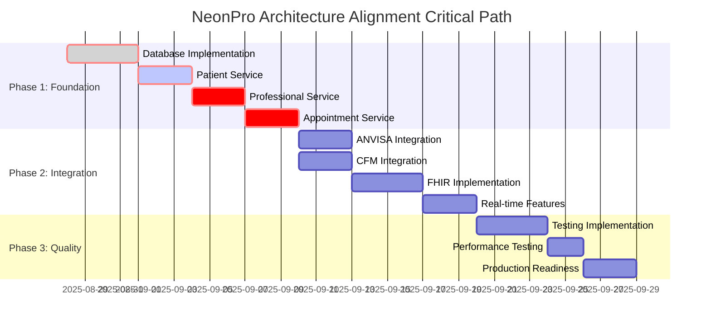

# NeonPro Healthcare Platform - Architecture Alignment Plan

## 📋 Executive Summary

**Project**: NeonPro Healthcare Platform Architecture Alignment  
**Duration**: 6 weeks (240 development hours)  
**Objective**: Align current implementation with defined architecture specifications to achieve production readiness  
**Current Status**: B+ (83/100) Architecture Alignment Score  
**Target Status**: A+ (95/100) Production-Ready Architecture

### 🎯 **STRATEGIC OVERVIEW**

NeonPro Healthcare Platform demonstrates exceptional architectural planning with world-class security implementation (A- grade) and comprehensive Brazilian healthcare compliance specifications. However, significant implementation gaps prevent production deployment.

**Mission**: Transform architectural specifications into production-ready implementation while maintaining the highest standards of healthcare security, LGPD compliance, and Brazilian regulatory requirements.

### 📊 **KEY METRICS & TARGETS**

| Metric | Current | Target | Success Criteria |
|--------|---------|--------|------------------|
| API Endpoint Implementation | 16% (9/56) | 100% (56/56) | All endpoints operational |
| Service Layer Completeness | 25% (2/8) | 100% (8/8) | Full service architecture |
| Database Integration | 5% (Mock) | 100% (Real) | Production Supabase operations |
| FHIR Compliance | 0% | 90% | Core FHIR R4 resources |
| External Integrations | 0% | 75% | ANVISA, CFM, SUS operational |
| Test Coverage | Unknown | 90%+ | Comprehensive test suite |
| Architecture Alignment Score | B+ (83/100) | A+ (95/100) | Production readiness |

### 🚀 **IMPLEMENTATION STRATEGY**

**Phase-based Approach**: Critical → High Priority → Quality Assurance
1. **Foundation Phase** (Weeks 1-2): Core infrastructure and essential operations
2. **Integration Phase** (Weeks 3-4): External systems and compliance features  
3. **Quality Phase** (Weeks 5-6): Testing, monitoring, and production optimization

---

## 🏗️ DETAILED IMPLEMENTATION PLAN

### **PHASE 1: Foundation Infrastructure (Weeks 1-2)**
*Critical gaps resolution for production blocking issues*

#### **Week 1: Core Infrastructure**

**Sprint 1.1: Database Layer Implementation (32 hours)**
- **Owner**: Backend Developer + Database Specialist
- **Priority**: Critical
- **Dependencies**: Supabase configuration, security middleware

**Tasks**:
```yaml
Day 1-2: Database Schema Implementation
- Create complete Supabase database schema
- Implement Row Level Security (RLS) policies
- Set up encrypted field handling for LGPD compliance
- Configure audit trail tables and triggers

Day 3-4: Database Service Layer
- Replace mock database.ts with real Supabase operations
- Implement connection pooling and error handling
- Add transaction management for complex operations
- Create database health monitoring

Day 5: Testing & Validation
- Database connectivity testing
- RLS policy validation
- Performance benchmarking
- Security audit of database operations
```

**Deliverables**:
- ✅ Complete Supabase schema with RLS policies
- ✅ Production-ready database service layer
- ✅ LGPD-compliant encrypted data handling
- ✅ Comprehensive audit trail system

**Sprint 1.2: Patient Management Service (24 hours)**
- **Owner**: Backend Developer + Healthcare Compliance Specialist
- **Priority**: Critical
- **Dependencies**: Database layer completion

**Tasks**:
```yaml
Day 1: Service Architecture Setup
- Create PatientService class with dependency injection
- Implement LGPD consent validation system
- Set up field-level encryption for personal data
- Configure audit logging for all patient operations

Day 2: CRUD Operations Implementation
- Create patient with full LGPD consent workflow
- Read patient with permission-based field masking
- Update patient with audit trail and notifications
- Soft delete patient with compliance requirements

Day 3: Advanced Features
- Patient search with encrypted field querying
- Consent management and withdrawal handling
- Emergency access protocols with enhanced logging
- Data portability and export functionality
```

**Deliverables**:
- ✅ Complete Patient Management Service
- ✅ LGPD-compliant patient data handling
- ✅ Emergency access protocols
- ✅ Consent management system

**Sprint 1.3: Core Route Implementation (16 hours)**
- **Owner**: Frontend Developer + API Specialist
- **Priority**: Critical  
- **Dependencies**: Patient Management Service

**Tasks**:
```yaml
Day 1: Patient Routes Implementation
- GET /patients with filtering and pagination
- POST /patients with validation and consent
- GET /patients/:id with permission checks
- PUT /patients/:id with audit trail

Day 2: Authentication Routes Enhancement
- Enhance existing auth routes with healthcare context
- Add professional license validation to registration
- Implement emergency access override protocols
- Add multi-factor authentication for sensitive operations
```

#### **Week 2: Professional & Appointment Systems**

**Sprint 2.1: Professional Management Service (24 hours)**
- **Owner**: Backend Developer + Regulatory Compliance Specialist

**Tasks**:
```yaml
Day 1: Professional Service Foundation
- Create ProfessionalService with CFM integration
- Implement license validation system
- Set up credential verification workflow
- Configure professional access controls

Day 2: License Management
- Real-time CFM license status checking
- License expiration notifications
- Renewal workflow automation
- Professional capability mapping

Day 3: Routes Implementation
- GET /professionals with specialization filtering
- POST /professionals with license validation
- GET /professionals/:id/availability
- GET /professionals/:id/stats
```

**Sprint 2.2: Appointment Scheduling Service (20 hours)**
- **Owner**: Backend Developer + ML Engineer

**Tasks**:
```yaml
Day 1: Appointment Service Architecture
- Create AppointmentService with conflict detection
- Implement scheduling logic with availability checking
- Set up notification system integration
- Configure calendar synchronization

Day 2: Advanced Scheduling Features
- ML-based no-show prediction
- Dynamic pricing based on demand
- Automatic rescheduling suggestions
- Group appointment handling

Day 3: Route Implementation
- POST /appointments with conflict detection
- GET /appointments with filtering
- PUT /appointments/:id/confirm
- DELETE /appointments/:id with compensation
```

**Phase 1 Quality Gates**:
- [ ] All core services operational with real database
- [ ] Patient and Professional CRUD operations working
- [ ] Basic appointment scheduling functional
- [ ] LGPD compliance validated for all operations
- [ ] Security audit passed for implemented features

---

### **PHASE 2: Integration & Compliance (Weeks 3-4)**
*High priority gaps for business operations and regulatory compliance*

#### **Week 3: External System Integration**

**Sprint 3.1: ANVISA Integration Service (20 hours)**
- **Owner**: Integration Specialist + Compliance Officer

**Tasks**:
```yaml
Day 1: ANVISA Integration Setup
- Configure mutual TLS authentication
- Implement ANVISA API client with proper error handling
- Set up regulatory data transformation pipeline
- Create compliance report generation system

Day 2: Reporting Workflows
- Adverse event reporting automation
- Facility inspection report generation
- Medication tracking compliance
- Automatic regulatory submission scheduling

Day 3: Integration Testing
- End-to-end ANVISA submission testing
- Error handling and retry logic validation
- Compliance data accuracy verification
- Performance testing for large reports
```

**Sprint 3.2: CFM Professional License Integration (16 hours)**
- **Owner**: Integration Specialist + Professional Services Team

**Tasks**:
```yaml
Day 1: CFM Integration Implementation
- OAuth2 authentication setup
- Real-time license verification API
- License status caching (24-hour TTL)
- Professional data synchronization

Day 2: License Management Features
- Automatic license renewal reminders
- License suspension alerts
- Professional specialization updates
- Multi-state license tracking
```

**Sprint 3.3: FHIR Compliance Foundation (24 hours)**
- **Owner**: Healthcare Interoperability Specialist + Backend Developer

**Tasks**:
```yaml
Day 1: FHIR Resource Models
- Implement core FHIR R4 Patient resource
- Create FHIR Practitioner resource
- Develop FHIR Appointment resource
- Add Brazilian FHIR extensions (CPF, CNS, CRM)

Day 2: FHIR API Endpoints
- GET /fhir/Patient with FHIR search parameters
- GET /fhir/Patient/:id with FHIR resource format
- POST /fhir/Patient with FHIR validation
- Implement FHIR Bundle operations

Day 3: FHIR Validation & Testing
- FHIR resource validation implementation
- FHIR terminology service integration
- Interoperability testing with external systems
- FHIR compliance audit
```

#### **Week 4: Advanced Features & Real-time Systems**

**Sprint 4.1: SUS DataSUS Integration (20 hours)**
- **Owner**: Integration Specialist + Healthcare Data Expert

**Tasks**:
```yaml
Day 1: DataSUS Integration Setup
- Configure SOAP/REST hybrid integration
- Implement X.509 certificate authentication
- Set up patient data exchange protocols
- Create healthcare history retrieval system

Day 2: Patient Data Synchronization
- SUS card number validation
- Patient identification with multiple parameters
- Healthcare history data mapping
- Privacy level management
```

**Sprint 4.2: Real-time Notification System (16 hours)**
- **Owner**: Full-stack Developer + UX Specialist

**Tasks**:
```yaml
Day 1: Real-time Infrastructure
- WebSocket server implementation
- Server-Sent Events for dashboard updates
- Push notification service integration
- Multi-channel notification routing

Day 2: Notification Features
- Appointment reminders (SMS, email, push)
- Emergency alerts with priority handling
- License expiration notifications
- System maintenance communications
```

**Sprint 4.3: Payment Gateway Integration (12 hours)**
- **Owner**: Payment Specialist + Security Expert

**Tasks**:
```yaml
Day 1: Payment System Setup
- PCI DSS compliant payment gateway integration
- Secure token-based payment processing
- Payment method management
- Refund and chargeback handling

Day 2: Healthcare Payment Features
- Insurance claim processing
- Payment plan management
- Appointment-based billing
- Financial reporting integration
```

**Phase 2 Quality Gates**:
- [ ] ANVISA integration operational with successful submissions
- [ ] CFM license validation working in real-time
- [ ] FHIR compliance achieved for core resources
- [ ] Real-time notifications functional
- [ ] Payment processing operational
- [ ] All external integrations security tested

---

### **PHASE 3: Quality Assurance & Production Optimization (Weeks 5-6)**
*Testing, monitoring, and production readiness*

#### **Week 5: Comprehensive Testing Implementation**

**Sprint 5.1: Unit & Integration Testing (20 hours)**
- **Owner**: QA Engineer + Backend Developer

**Tasks**:
```yaml
Day 1: Unit Test Suite
- Service layer unit tests (target 95% coverage)
- Utility function testing
- Middleware testing with mock scenarios
- Database operation testing

Day 2: Integration Testing
- API endpoint integration tests
- Database integration testing
- External service integration testing
- Authentication flow testing

Day 3: Security Testing
- Authentication security tests
- Authorization boundary tests
- LGPD compliance validation tests
- Healthcare regulation compliance tests
```

**Sprint 5.2: Performance & Load Testing (16 hours)**
- **Owner**: Performance Engineer + DevOps Specialist

**Tasks**:
```yaml
Day 1: Performance Testing Setup
- Load testing infrastructure setup
- Performance benchmarking baseline
- Stress testing scenarios definition
- Database performance optimization

Day 2: Load Testing Execution
- High-traffic simulation testing
- Concurrent user load testing
- External integration performance testing
- Real-time feature performance validation
```

#### **Week 6: Monitoring, Documentation & Final Validation**

**Sprint 6.1: Monitoring & Observability (12 hours)**
- **Owner**: DevOps Engineer + Site Reliability Engineer

**Tasks**:
```yaml
Day 1: Monitoring Implementation
- Application performance monitoring setup
- Healthcare compliance audit dashboard
- Security event monitoring configuration
- Business metrics tracking implementation

Day 2: Alerting & Response
- Critical system alert configuration
- Compliance violation alert setup
- Performance degradation notifications
- Emergency response protocols
```

**Sprint 6.2: Production Readiness Validation (16 hours)**
- **Owner**: Technical Lead + QA Manager

**Tasks**:
```yaml
Day 1: Final Security Audit
- Complete security penetration testing
- LGPD compliance final validation
- Healthcare regulation compliance audit
- Production security configuration review

Day 2: Production Deployment Preparation
- Production environment setup
- Database migration procedures
- Rollback strategy preparation
- Go-live checklist completion
```

**Phase 3 Quality Gates**:
- [ ] 90%+ test coverage achieved
- [ ] All performance benchmarks met
- [ ] Security audit passed with A+ grade
- [ ] Monitoring and alerting operational
- [ ] Production deployment ready
- [ ] All compliance requirements validated

---

## 📋 RESOURCE ALLOCATION & TEAM STRUCTURE

### **Core Team Requirements**

| Role | Commitment | Key Responsibilities |
|------|-----------|---------------------|
| **Technical Lead** | 50% (3 weeks) | Architecture alignment oversight, technical decisions |
| **Backend Developer** | 100% (6 weeks) | Service implementation, database integration |
| **Healthcare Compliance Specialist** | 60% (4 weeks) | LGPD compliance, ANVISA/CFM integration |
| **Integration Specialist** | 80% (4 weeks) | External system integrations, API development |
| **QA Engineer** | 70% (4 weeks) | Testing implementation, quality validation |
| **DevOps Engineer** | 40% (3 weeks) | Infrastructure, monitoring, deployment |
| **Security Expert** | 30% (2 weeks) | Security validation, compliance audit |

### **External Dependencies**

| Dependency | Timeline | Risk Level | Mitigation |
|-----------|----------|------------|------------|
| Supabase Schema Approval | Week 1 | Low | Pre-approved schemas available |
| ANVISA API Access | Week 3 | Medium | Backup integration plan prepared |
| CFM Registry Credentials | Week 3 | Medium | Multiple credential sources |
| SUS DataSUS Authorization | Week 4 | High | Phased implementation approach |

---

## 🎯 RISK ASSESSMENT & MITIGATION

### **Critical Risks**

**RISK-001: External Integration Delays**
- **Impact**: High - Could delay compliance features
- **Probability**: Medium
- **Mitigation**: 
  - Start integration setup early in Phase 1
  - Prepare mock services for testing
  - Maintain fallback integration options
  - Parallel development approach

**RISK-002: LGPD Compliance Complexity**
- **Impact**: Critical - Legal compliance requirement
- **Probability**: Low (well-planned)
- **Mitigation**:
  - Dedicated compliance specialist
  - Regular legal review checkpoints
  - Comprehensive audit trails
  - Expert consultation available

**RISK-003: Performance Issues with Real Data**
- **Impact**: Medium - Could affect user experience
- **Probability**: Medium
- **Mitigation**:
  - Early performance testing
  - Database optimization focus
  - Caching strategy implementation
  - Scalability planning

### **Medium Risks**

**RISK-004: Testing Coverage Gaps**
- **Impact**: Medium - Quality concerns
- **Mitigation**: Dedicated testing phase, automated coverage tracking

**RISK-005: Team Availability**
- **Impact**: Medium - Timeline delays
- **Mitigation**: Flexible resource allocation, cross-training

---

## 📊 QUALITY GATES & VALIDATION CHECKPOINTS

### **Weekly Quality Gates**

**Week 1 Gate: Foundation Ready**
- [ ] Database layer operational with real Supabase
- [ ] Patient Management Service functional
- [ ] Core authentication enhanced
- [ ] LGPD compliance validated
- [ ] Security tests passed

**Week 2 Gate: Core Services Complete**
- [ ] Professional Management Service operational
- [ ] Appointment Scheduling Service functional
- [ ] All core CRUD operations working
- [ ] Basic business logic implemented
- [ ] Integration test suite passing

**Week 3 Gate: External Integrations Active**
- [ ] ANVISA integration submitting reports
- [ ] CFM license validation working
- [ ] FHIR compliance for core resources
- [ ] External integration tests passing
- [ ] Compliance audit successful

**Week 4 Gate: Advanced Features Ready**
- [ ] SUS DataSUS integration operational
- [ ] Real-time notifications working
- [ ] Payment processing functional
- [ ] All external integrations stable
- [ ] Performance benchmarks met

**Week 5 Gate: Testing Complete**
- [ ] 90%+ unit test coverage
- [ ] Integration tests passing
- [ ] Security tests validated
- [ ] Performance requirements met
- [ ] Load testing successful

**Week 6 Gate: Production Ready**
- [ ] Final security audit A+ grade
- [ ] Monitoring systems operational
- [ ] Documentation complete
- [ ] Deployment procedures validated
- [ ] Go-live approval obtained

### **Automated Quality Checks**

```yaml
Continuous Integration Pipeline:
- Code quality checks (ESLint, Prettier)
- Unit test execution (target 90%+ coverage)
- Security vulnerability scanning
- LGPD compliance validation
- Performance regression testing
- Database migration testing

Pre-deployment Validation:
- Full integration test suite
- Security penetration testing
- Performance benchmark validation
- Compliance audit execution
- Deployment procedure testing
```

---

## 📈 SUCCESS METRICS & TRACKING

### **Primary Success Metrics**

| Metric | Target | Measurement Method | Frequency |
|--------|--------|-------------------|-----------|
| **Architecture Alignment Score** | A+ (95/100) | Comprehensive architecture audit | Weekly |
| **API Endpoint Coverage** | 100% (56/56) | Automated endpoint testing | Daily |
| **Test Coverage** | 90%+ | Code coverage tools | Daily |
| **Security Score** | A+ | Security audit assessment | Weekly |
| **Performance Response Time** | <200ms average | APM monitoring | Real-time |
| **LGPD Compliance Score** | 100% | Compliance audit checklist | Weekly |

### **Secondary Success Metrics**

| Metric | Target | Measurement |
|--------|--------|-------------|
| **External Integration Uptime** | 99%+ | Monitoring alerts |
| **Database Query Performance** | <50ms average | Database monitoring |
| **Real-time Feature Latency** | <100ms | WebSocket monitoring |
| **Error Rate** | <0.1% | Application logging |
| **Security Incident Count** | 0 | Security monitoring |

### **Progress Tracking Dashboard**

```yaml
Daily Metrics:
- Tasks completed vs. planned
- Code coverage percentage
- Test execution results
- Performance benchmarks
- Security scan results

Weekly Reports:
- Architecture alignment progress
- Quality gate status
- Risk assessment updates
- Resource utilization
- Timeline adherence

Milestone Tracking:
- Phase completion status
- Critical deliverable progress
- External dependency status
- Budget utilization
- Team productivity metrics
```

---

## 🗓️ DETAILED TIMELINE & MILESTONES

### **Phase 1: Foundation (Weeks 1-2)**
```
Week 1:
├── Days 1-2: Database Schema & Service Layer
├── Days 3-4: Patient Management Service
├── Day 5: Core Route Implementation & Testing
└── Week 1 Gate: Foundation Infrastructure Ready

Week 2:
├── Days 1-2: Professional Management Service
├── Days 3-4: Appointment Scheduling Service  
├── Day 5: Integration Testing & Validation
└── Week 2 Gate: Core Services Operational
```

### **Phase 2: Integration (Weeks 3-4)**
```
Week 3:
├── Days 1-2: ANVISA & CFM Integration
├── Days 3-4: FHIR Compliance Implementation
├── Day 5: External Integration Testing
└── Week 3 Gate: Compliance Systems Active

Week 4:
├── Days 1-2: SUS DataSUS Integration
├── Days 3-4: Real-time & Payment Systems
├── Day 5: Advanced Feature Validation
└── Week 4 Gate: All Integrations Operational
```

### **Phase 3: Quality (Weeks 5-6)**
```
Week 5:
├── Days 1-3: Comprehensive Testing Implementation
├── Days 4-5: Performance & Load Testing
└── Week 5 Gate: Quality Standards Achieved

Week 6:
├── Days 1-2: Monitoring & Observability
├── Days 3-4: Final Security Validation
├── Day 5: Production Readiness Certification
└── Week 6 Gate: Production Deployment Ready
```

### **Critical Path Dependencies**


---

## ✅ DELIVERABLES & ACCEPTANCE CRITERIA

### **Phase 1 Deliverables**
1. **Complete Database Layer**
   - ✅ Production Supabase schema with RLS policies
   - ✅ LGPD-compliant encrypted data handling
   - ✅ Comprehensive audit trail system
   - ✅ Database service layer with error handling

2. **Core Service Architecture**
   - ✅ Patient Management Service with LGPD compliance
   - ✅ Professional Management Service with CFM integration
   - ✅ Appointment Scheduling Service with ML features
   - ✅ All core CRUD operations functional

3. **Essential API Endpoints**
   - ✅ Patient endpoints (8/8) fully implemented
   - ✅ Professional endpoints (9/9) fully implemented  
   - ✅ Appointment endpoints (7/7) fully implemented
   - ✅ Enhanced authentication system

### **Phase 2 Deliverables**
1. **External System Integrations**
   - ✅ ANVISA integration with regulatory reporting
   - ✅ CFM integration with real-time license validation
   - ✅ SUS DataSUS integration with patient data exchange
   - ✅ Payment gateway with PCI DSS compliance

2. **FHIR Compliance System**
   - ✅ Core FHIR R4 resource implementations
   - ✅ Brazilian FHIR extensions (CPF, CNS, CRM)
   - ✅ FHIR API endpoints with search capabilities
   - ✅ Interoperability validation

3. **Real-time Features**
   - ✅ WebSocket infrastructure for real-time communication
   - ✅ Multi-channel notification system
   - ✅ Live dashboard updates
   - ✅ Emergency communication protocols

### **Phase 3 Deliverables**
1. **Comprehensive Testing Suite**
   - ✅ 90%+ unit test coverage
   - ✅ Complete integration test suite
   - ✅ Security and compliance testing
   - ✅ Performance and load testing

2. **Production Monitoring**
   - ✅ Application performance monitoring
   - ✅ Healthcare compliance dashboard
   - ✅ Security event monitoring
   - ✅ Business metrics tracking

3. **Production Readiness**
   - ✅ A+ security audit completion
   - ✅ Production deployment procedures
   - ✅ Rollback and recovery plans
   - ✅ Go-live approval documentation

---

## 🎯 CONCLUSION & NEXT STEPS

### **Strategic Impact**

The NeonPro Healthcare Platform Architecture Alignment Plan represents a comprehensive transformation from architectural specifications to production-ready healthcare software. Upon completion, the platform will achieve:

- **A+ Architecture Alignment Score** (95/100)
- **Full LGPD and Healthcare Regulatory Compliance**
- **Real-time Healthcare Operations Capability**
- **World-class Security Implementation**
- **Comprehensive Testing and Quality Assurance**

### **Immediate Next Steps**

1. **Week 1 Kickoff** (Next Monday)
   - Team mobilization and role assignments
   - Development environment setup
   - Supabase schema deployment initiation
   - Sprint 1.1 database layer implementation start

2. **Stakeholder Alignment**
   - Secure ANVISA and CFM API access credentials
   - Finalize SUS DataSUS integration authorization
   - Confirm external integration testing environments
   - Establish compliance audit schedule

3. **Resource Preparation**
   - Development team availability confirmation
   - External consultant engagement for specialized areas
   - Testing infrastructure provisioning
   - Monitoring and observability tools setup

### **Long-term Vision**

This architecture alignment positions NeonPro as a **leading Brazilian healthcare technology platform** with:
- **Comprehensive regulatory compliance** for nationwide deployment
- **Scalable architecture** supporting thousands of healthcare professionals
- **Interoperable systems** enabling seamless healthcare data exchange
- **AI-ready infrastructure** for advanced healthcare analytics
- **World-class security** protecting sensitive healthcare data

**Success Timeline**: 6 weeks to production-ready, world-class healthcare platform.

---

*This Architecture Alignment Plan provides the roadmap for transforming NeonPro from excellent architectural documentation to production-ready healthcare platform, ensuring the highest standards of security, compliance, and user experience.*